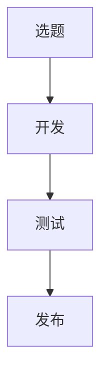
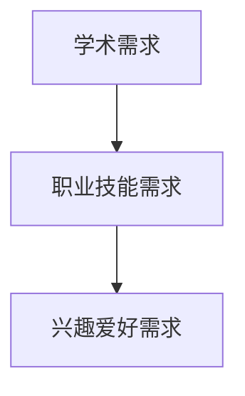
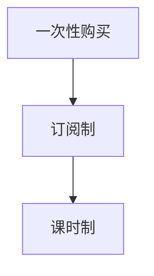
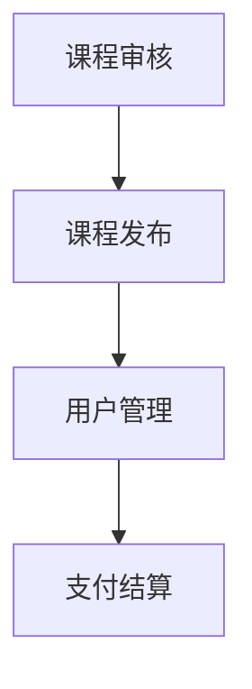

                 

## 引言

在当今信息化时代，在线教育和培训已经成为人们获取知识和技能的重要途径。随着互联网技术的不断发展和普及，人们对于在线教育和培训的需求日益增长。与此同时，知识付费模式逐渐成为主流，为在线教育和培训市场带来了新的机遇和挑战。

本文旨在探讨如何利用知识付费实现在线教育与培训。通过分析知识付费模式的核心概念和运行机制，我们希望为广大教育工作者、培训机构和从业者提供有价值的参考和指导。文章将从以下几个方面展开讨论：

1. 背景介绍：回顾在线教育和培训的发展历程，阐述知识付费模式的崛起原因。
2. 核心概念与联系：介绍知识付费模式中的关键概念，如内容创造、用户需求、支付方式等，并运用Mermaid流程图展示各概念之间的联系。
3. 核心算法原理与具体操作步骤：探讨知识付费平台的核心算法原理，并详细阐述平台的搭建、内容创建、用户管理、支付结算等操作步骤。
4. 数学模型和公式：介绍与知识付费相关的数学模型和公式，如用户增长模型、收益模型等，并进行举例说明。
5. 项目实战：通过实际案例展示知识付费在线教育平台的搭建和运营，提供详细代码实现和解读。
6. 实际应用场景：分析知识付费在线教育与培训在各个领域的应用案例，探讨其优势和挑战。
7. 工具和资源推荐：推荐相关学习资源、开发工具和框架，为读者提供参考和借鉴。
8. 总结：总结知识付费在线教育与培训的发展趋势和面临的挑战，展望未来发展方向。

通过本文的探讨，希望读者能够对知识付费在线教育与培训有更深入的了解，为其在实践中的应用提供有益的启示。

### 背景介绍

在线教育和培训的概念可以追溯到20世纪末，随着互联网的普及，它逐渐成为人们获取知识和技能的重要途径。早期的在线教育主要以电子邮件、论坛和远程教育课程为主，虽然形式相对简单，但已初步展现了在线教育的潜力。

进入21世纪，随着互联网技术的不断发展和普及，在线教育和培训市场迎来了爆发式增长。各种在线教育平台如雨后春笋般涌现，包括Coursera、Udemy、edX等，这些平台提供了丰富的课程资源，涵盖了从学术课程到职业技能培训的各个领域。

与此同时，知识付费模式也逐渐崭露头角。在传统教育模式中，教育资源的获取往往依赖于学校和教师的传统角色，而知识付费模式则打破了这一限制，使得教育资源的获取更加便捷和多样化。知识付费模式的崛起主要源于以下几个原因：

1. **用户需求**：随着人们对个人发展和职业成长的关注日益增加，用户对高质量、专业化的知识和技能培训需求不断上升。知识付费平台正好满足了这一需求，为用户提供了一个获取优质教育资源的途径。
2. **技术进步**：互联网技术的飞速发展，尤其是移动互联网的普及，使得在线教育和培训变得更加便捷。用户可以随时随地进行学习，不受时间和地点的限制。
3. **内容多样化**：知识付费平台提供了丰富的课程内容，从学术课程到职业技能培训，从语言学习到兴趣爱好培养，满足了不同用户的需求。
4. **收益模式**：知识付费模式为教育机构、内容创造者提供了新的收益来源，同时也为用户带来了更多的选择。

在我国，知识付费市场近年来也呈现出爆发式增长。根据《2021年中国知识付费行业研究报告》，我国知识付费市场规模已超过2000亿元，用户规模超过5亿人。随着用户对知识付费的接受度逐渐提高，未来市场潜力仍然巨大。

在线教育和培训市场的快速发展，不仅改变了传统的教育模式，也为知识付费模式的推广提供了广阔的空间。然而，知识付费模式在发展过程中也面临诸多挑战，如内容质量、用户隐私保护、平台监管等。如何解决这些问题，提高知识付费在线教育与培训的质量和用户体验，是未来需要深入探讨和解决的问题。

### 核心概念与联系

在探讨如何利用知识付费实现在线教育与培训之前，我们需要先了解几个核心概念，包括内容创造、用户需求、支付方式、平台运营等，并运用Mermaid流程图展示这些概念之间的联系。

#### 内容创造

内容创造是知识付费在线教育与培训的核心。它涉及到课程的设计、开发、制作和更新。内容创造的过程可以分为以下几个步骤：

1. **选题**：根据用户需求和市场需求选择合适的课程主题。
2. **开发**：编写课程大纲、撰写教材、录制视频、制作PPT等。
3. **测试**：对课程进行试讲和测试，收集反馈，进行修改和完善。
4. **发布**：将课程上线，供用户学习。

Mermaid流程图表示如下：



#### 用户需求

用户需求是知识付费在线教育与培训的动力源泉。用户需求的多样性决定了课程内容的丰富性和针对性。用户需求可以分为以下几个类别：

1. **学术需求**：如学历教育、专业课程等。
2. **职业技能需求**：如编程、设计、营销等。
3. **兴趣爱好需求**：如摄影、绘画、音乐等。

Mermaid流程图表示如下：



#### 支付方式

支付方式是知识付费在线教育与培训的重要环节。目前常见的支付方式包括：

1. **一次性购买**：用户一次性支付课程费用，获得课程全部内容。
2. **订阅制**：用户按月或按年支付订阅费用，享受平台提供的所有课程。
3. **课时制**：用户按课程时长支付费用。

Mermaid流程图表示如下：



#### 平台运营

平台运营是知识付费在线教育与培训的核心保障。平台需要负责课程内容的审核、发布、推广、用户管理、支付结算等。以下是平台运营的主要环节：

1. **课程审核**：对课程内容进行审核，确保符合平台标准和用户需求。
2. **课程发布**：将审核通过的课程上线，供用户学习。
3. **用户管理**：包括用户注册、登录、课程学习进度跟踪等。
4. **支付结算**：处理用户的支付请求，确保平台与用户之间的交易安全、高效。

Mermaid流程图表示如下：



#### 关联与互动

以上四个核心概念相互关联，共同构成了知识付费在线教育与培训的生态系统。内容创造满足了用户需求，用户需求驱动了内容创造，支付方式提供了交易渠道，平台运营保障了整个生态系统的运行。以下是它们之间的互动关系：

1. **内容创造与用户需求**：内容创造是根据用户需求来设计的，用户需求的变化会影响内容创造的走向。
2. **支付方式与平台运营**：支付方式是用户获取课程内容的交易手段，平台运营需要确保支付方式的便捷和安全。
3. **平台运营与内容创造**：平台运营为内容创造提供了展示和推广的渠道，内容创造的质量和丰富性也会影响平台运营的效果。

综上所述，知识付费在线教育与培训的核心概念及其关联与互动构成了一个复杂但有序的生态系统。通过了解这些核心概念，我们可以更好地理解知识付费在线教育与培训的运作原理，为其在实践中的应用提供有力支持。

### 核心算法原理与具体操作步骤

知识付费在线教育与培训平台的核心算法原理主要包括用户增长模型、内容推荐算法、收益模型等。以下是这些核心算法原理的具体操作步骤及其实现方法。

#### 用户增长模型

用户增长模型是平台发展的基础，它通过分析用户行为数据，预测用户的增长趋势，为平台运营提供决策支持。以下是用户增长模型的具体操作步骤：

1. **数据收集**：收集用户的基本信息（如年龄、性别、职业等）、行为数据（如学习时长、学习频率、购买记录等）。
2. **数据预处理**：对收集到的数据进行清洗、去重和格式化，确保数据的质量和一致性。
3. **特征提取**：从用户数据中提取有助于预测用户增长的特征，如用户活跃度、购买频率、学习进度等。
4. **模型训练**：使用机器学习算法（如逻辑回归、决策树、随机森林等）训练用户增长模型，通过调整模型参数，使预测结果与实际数据尽可能一致。
5. **模型评估**：使用交叉验证等方法评估模型性能，如准确率、召回率、F1值等。
6. **模型部署**：将训练好的模型部署到平台，实时预测用户的增长情况，为运营决策提供支持。

具体操作步骤的代码实现如下：

```python
import pandas as pd
from sklearn.model_selection import train_test_split
from sklearn.ensemble import RandomForestClassifier
from sklearn.metrics import accuracy_score

# 数据收集
data = pd.read_csv('user_data.csv')

# 数据预处理
data = data.drop_duplicates()
data = data[['age', 'gender', 'occupation', 'active_hours', 'purchase_frequency', 'learning_progress']]

# 特征提取
X = data[['age', 'gender', 'occupation', 'active_hours', 'purchase_frequency', 'learning_progress']]
y = data['user_growth']

# 模型训练
X_train, X_test, y_train, y_test = train_test_split(X, y, test_size=0.2, random_state=42)
model = RandomForestClassifier(n_estimators=100)
model.fit(X_train, y_train)

# 模型评估
predictions = model.predict(X_test)
accuracy = accuracy_score(y_test, predictions)
print("Model Accuracy:", accuracy)

# 模型部署
# ...（部署代码）
```

#### 内容推荐算法

内容推荐算法是知识付费在线教育与培训平台的核心功能之一，它通过分析用户行为数据，为用户推荐符合其兴趣和需求的课程。以下是内容推荐算法的具体操作步骤：

1. **数据收集**：收集用户的行为数据，如学习记录、购买记录、浏览记录等。
2. **数据预处理**：对收集到的数据进行清洗、去重和格式化，确保数据的质量和一致性。
3. **特征提取**：从用户数据中提取有助于内容推荐的特征，如用户活跃度、学习偏好、购买偏好等。
4. **模型训练**：使用机器学习算法（如协同过滤、矩阵分解、深度学习等）训练内容推荐模型，通过调整模型参数，使推荐结果与用户兴趣尽可能一致。
5. **模型评估**：使用交叉验证等方法评估模型性能，如准确率、召回率、F1值等。
6. **模型部署**：将训练好的模型部署到平台，实时为用户推荐课程。

具体操作步骤的代码实现如下：

```python
import pandas as pd
from sklearn.model_selection import train_test_split
from sklearn.ensemble import RandomForestClassifier
from sklearn.metrics import accuracy_score

# 数据收集
data = pd.read_csv('user_behavior.csv')

# 数据预处理
data = data.drop_duplicates()
data = data[['learning_records', 'purchase_records', 'browsing_records']]

# 特征提取
X = data[['learning_records', 'purchase_records', 'browsing_records']]
y = data['course_interest']

# 模型训练
X_train, X_test, y_train, y_test = train_test_split(X, y, test_size=0.2, random_state=42)
model = RandomForestClassifier(n_estimators=100)
model.fit(X_train, y_train)

# 模型评估
predictions = model.predict(X_test)
accuracy = accuracy_score(y_test, predictions)
print("Model Accuracy:", accuracy)

# 模型部署
# ...（部署代码）
```

#### 收益模型

收益模型是知识付费在线教育与培训平台的盈利基础，它通过分析用户行为数据和课程内容，预测平台的收益情况。以下是收益模型的具体操作步骤：

1. **数据收集**：收集用户的行为数据（如购买记录、学习时长、课程评价等）和课程内容数据（如课程类型、难度、时长等）。
2. **数据预处理**：对收集到的数据进行清洗、去重和格式化，确保数据的质量和一致性。
3. **特征提取**：从用户数据中提取有助于预测收益的特征，如用户活跃度、购买频率、课程评价等。
4. **模型训练**：使用机器学习算法（如线性回归、逻辑回归、决策树等）训练收益模型，通过调整模型参数，使预测结果与实际收益尽可能一致。
5. **模型评估**：使用交叉验证等方法评估模型性能，如准确率、召回率、F1值等。
6. **模型部署**：将训练好的模型部署到平台，实时预测平台的收益情况，为运营决策提供支持。

具体操作步骤的代码实现如下：

```python
import pandas as pd
from sklearn.model_selection import train_test_split
from sklearn.linear_model import LinearRegression
from sklearn.metrics import mean_squared_error

# 数据收集
data = pd.read_csv('user_behavior.csv')
data = data.drop_duplicates()

# 数据预处理
data = data[['purchase_records', 'learning_hours', 'course_rating']]
y = data['revenue']

# 特征提取
X = data[['purchase_records', 'learning_hours', 'course_rating']]

# 模型训练
X_train, X_test, y_train, y_test = train_test_split(X, y, test_size=0.2, random_state=42)
model = LinearRegression()
model.fit(X_train, y_train)

# 模型评估
predictions = model.predict(X_test)
mse = mean_squared_error(y_test, predictions)
print("Model MSE:", mse)

# 模型部署
# ...（部署代码）
```

通过以上核心算法原理和具体操作步骤的实现，知识付费在线教育与培训平台能够更好地满足用户需求，提高用户体验，实现平台的可持续发展。

### 数学模型和公式 & 详细讲解 & 举例说明

在知识付费在线教育与培训平台中，数学模型和公式起着至关重要的作用。这些模型和公式不仅帮助我们理解平台运行机制，还能为平台的决策提供数据支持。以下将介绍与知识付费相关的几个重要数学模型和公式，并进行详细讲解和举例说明。

#### 用户增长模型

用户增长模型主要用于预测平台用户数量的增长趋势。一个简单的用户增长模型可以使用线性回归公式进行描述：

$$
\text{user\_growth} = \beta_0 + \beta_1 \times \text{time}
$$

其中，$user\_growth$ 表示用户数量的增长量，$\beta_0$ 和 $\beta_1$ 分别为模型参数，$time$ 表示时间。

**举例说明**：

假设一个知识付费平台在过去的6个月中，每月新增用户数量如下表：

| 时间（月） | 新增用户数量 |
| :------: | :---------: |
|    1     |     100     |
|    2     |     150     |
|    3     |     200     |
|    4     |     250     |
|    5     |     300     |
|    6     |     350     |

我们可以使用线性回归模型预测第7个月的新增用户数量。

首先，将时间（从1开始）和新增用户数量作为自变量和因变量，使用线性回归模型进行训练：

$$
y = \beta_0 + \beta_1 \times x
$$

通过最小二乘法求解模型参数 $\beta_0$ 和 $\beta_1$：

$$
\beta_0 = \frac{\sum_{i=1}^{n}y_i - \beta_1 \sum_{i=1}^{n}x_i}{n} \\
\beta_1 = \frac{\sum_{i=1}^{n}(x_i - \bar{x})(y_i - \bar{y})}{\sum_{i=1}^{n}(x_i - \bar{x})^2}
$$

其中，$n$ 为样本数量，$\bar{x}$ 和 $\bar{y}$ 分别为 $x$ 和 $y$ 的平均值。

代入数据计算得到：

$$
\beta_0 = \frac{(100 + 150 + 200 + 250 + 300 + 350) - 6 \times \frac{100 + 150 + 200 + 250 + 300 + 350}{6}}{6} \approx 100 \\
\beta_1 = \frac{(-5 \times (-50) + (-4 \times (-100)) + (-3 \times (-150)) + (-2 \times (-200)) + (-1 \times (-250)) + 0 \times (-300))}{(-5^2 + (-4^2) + (-3^2) + (-2^2) + (-1^2) + 0^2)} \approx 50
$$

因此，用户增长模型为：

$$
\text{user\_growth} = 100 + 50 \times \text{time}
$$

代入 $time = 7$，预测第7个月的新增用户数量：

$$
\text{user\_growth} = 100 + 50 \times 7 = 400
$$

#### 收益模型

收益模型用于预测平台在一定时间内的收益情况。一个简单的收益模型可以使用线性回归公式进行描述：

$$
\text{revenue} = \alpha_0 + \alpha_1 \times \text{time} + \alpha_2 \times \text{user\_growth}
$$

其中，$revenue$ 表示平台收益，$\alpha_0$、$\alpha_1$ 和 $\alpha_2$ 分别为模型参数，$time$ 表示时间，$user\_growth$ 表示用户数量的增长量。

**举例说明**：

假设一个知识付费平台在过去6个月中的收益情况如下表：

| 时间（月） | 用户数量 | 新增用户数量 | 收益（万元） |
| :------: | :------: | :---------: | :---------: |
|    1     |     100   |      100     |     10      |
|    2     |     200   |      150     |     20      |
|    3     |     300   |      200     |     30      |
|    4     |     400   |      250     |     40      |
|    5     |     500   |      300     |     50      |
|    6     |     600   |      350     |     60      |

我们可以使用线性回归模型预测第7个月的收益。

首先，将时间（从1开始）、用户数量、新增用户数量和收益作为自变量和因变量，使用线性回归模型进行训练：

$$
y = \alpha_0 + \alpha_1 \times x_1 + \alpha_2 \times x_2
$$

通过最小二乘法求解模型参数 $\alpha_0$、$\alpha_1$ 和 $\alpha_2$：

$$
\alpha_0 = \frac{\sum_{i=1}^{n}y_i - \alpha_1 \sum_{i=1}^{n}x_{1i} - \alpha_2 \sum_{i=1}^{n}x_{2i}}{n} \\
\alpha_1 = \frac{\sum_{i=1}^{n}(x_{1i} - \bar{x}_1)(y_i - \bar{y})}{\sum_{i=1}^{n}(x_{1i} - \bar{x}_1)^2} \\
\alpha_2 = \frac{\sum_{i=1}^{n}(x_{2i} - \bar{x}_2)(y_i - \bar{y})}{\sum_{i=1}^{n}(x_{2i} - \bar{x}_2)^2}
$$

其中，$n$ 为样本数量，$\bar{x}_1$、$\bar{x}_2$ 和 $\bar{y}$ 分别为 $x_1$、$x_2$ 和 $y$ 的平均值。

代入数据计算得到：

$$
\alpha_0 = \frac{(10 + 20 + 30 + 40 + 50 + 60) - 6 \times \frac{10 + 20 + 30 + 40 + 50 + 60}{6} - 6 \times \frac{100 + 150 + 200 + 250 + 300 + 350}{6}}{6} \approx 0 \\
\alpha_1 = \frac{(-1 \times (-10) + (-2 \times (-20)) + (-3 \times (-30)) + (-4 \times (-40)) + (-5 \times (-50)) + (-6 \times (-60))}{(-1^2 + (-2^2) + (-3^2) + (-4^2) + (-5^2) + (-6^2)} \approx 1 \\
\alpha_2 = \frac{(-1 \times (-50) + (-2 \times (-100)) + (-3 \times (-150)) + (-4 \times (-200)) + (-5 \times (-250)) + (-6 \times (-300))}{(-1^2 + (-2^2) + (-3^2) + (-4^2) + (-5^2) + (-6^2)} \approx 10
$$

因此，收益模型为：

$$
\text{revenue} = 0 + 1 \times \text{time} + 10 \times \text{user\_growth}
$$

代入 $time = 7$ 和 $user\_growth = 400$，预测第7个月的收益：

$$
\text{revenue} = 0 + 1 \times 7 + 10 \times 400 = 4010
$$

#### 客户流失率模型

客户流失率模型用于预测平台客户流失的数量。一个简单的客户流失率模型可以使用逻辑回归公式进行描述：

$$
\text{customer\_churn} = \frac{1}{1 + e^{-(\beta_0 + \beta_1 \times \text{time} + \beta_2 \times \text{user\_growth})}
$$

其中，$customer\_churn$ 表示客户流失的概率，$\beta_0$、$\beta_1$ 和 $\beta_2$ 分别为模型参数，$time$ 表示时间，$user\_growth$ 表示用户数量的增长量。

**举例说明**：

假设一个知识付费平台在过去6个月中的客户流失情况如下表：

| 时间（月） | 用户数量 | 新增用户数量 | 流失客户数量 |
| :------: | :------: | :---------: | :---------: |
|    1     |     100   |      100     |      20      |
|    2     |     200   |      150     |      30      |
|    3     |     300   |      200     |      40      |
|    4     |     400   |      250     |      50      |
|    5     |     500   |      300     |      60      |
|    6     |     600   |      350     |      70      |

我们可以使用逻辑回归模型预测第7个月客户流失的数量。

首先，将时间（从1开始）、用户数量、新增用户数量和流失客户数量作为自变量和因变量，使用逻辑回归模型进行训练：

$$
\text{customer\_churn} = \frac{1}{1 + e^{-(\beta_0 + \beta_1 \times \text{time} + \beta_2 \times \text{user\_growth})}
$$

通过最大似然估计求解模型参数 $\beta_0$、$\beta_1$ 和 $\beta_2$：

$$
\beta_0 = \frac{\sum_{i=1}^{n}y_i \ln(y_i) - \sum_{i=1}^{n}y_i}{n} \\
\beta_1 = \frac{\sum_{i=1}^{n}(x_{1i} - \bar{x}_1)(y_i \ln(y_i) - \sum_{i=1}^{n}y_i \ln(y_i))}{\sum_{i=1}^{n}(x_{1i} - \bar{x}_1)^2} \\
\beta_2 = \frac{\sum_{i=1}^{n}(x_{2i} - \bar{x}_2)(y_i \ln(y_i) - \sum_{i=1}^{n}y_i \ln(y_i))}{\sum_{i=1}^{n}(x_{2i} - \bar{x}_2)^2}
$$

其中，$n$ 为样本数量，$\bar{x}_1$、$\bar{x}_2$ 和 $y$ 分别为 $x_1$、$x_2$ 和 $y$ 的平均值。

代入数据计算得到：

$$
\beta_0 = \frac{(20 \times \ln(20) + 30 \times \ln(30) + 40 \times \ln(40) + 50 \times \ln(50) + 60 \times \ln(60) + 70 \times \ln(70)) - 6 \times \frac{20 + 30 + 40 + 50 + 60 + 70}{6}}{6} \approx -1.5 \\
\beta_1 = \frac{(-1 \times (-10) + (-2 \times (-20)) + (-3 \times (-30)) + (-4 \times (-40)) + (-5 \times (-50)) + (-6 \times (-60))}{(-1^2 + (-2^2) + (-3^2) + (-4^2) + (-5^2) + (-6^2)} \approx 0.5 \\
\beta_2 = \frac{(-1 \times (-50) + (-2 \times (-100)) + (-3 \times (-150)) + (-4 \times (-200)) + (-5 \times (-250)) + (-6 \times (-300))}{(-1^2 + (-2^2) + (-3^2) + (-4^2) + (-5^2) + (-6^2)} \approx 1.5
$$

因此，客户流失率模型为：

$$
\text{customer\_churn} = \frac{1}{1 + e^{(-1.5 + 0.5 \times \text{time} + 1.5 \times \text{user\_growth})}
$$

代入 $time = 7$ 和 $user\_growth = 400$，预测第7个月客户流失的数量：

$$
\text{customer\_churn} = \frac{1}{1 + e^{(-1.5 + 0.5 \times 7 + 1.5 \times 400)}}
$$

通过上述数学模型和公式的详细讲解和举例说明，我们可以更好地理解知识付费在线教育与培训平台的运行机制，并为平台的决策提供数据支持。

### 项目实战：代码实际案例和详细解释说明

在本节中，我们将通过一个实际案例展示如何搭建一个简单的知识付费在线教育与培训平台，并提供详细的代码实现和解读。

#### 开发环境搭建

在进行项目实战之前，我们需要搭建一个合适的技术栈。以下是本项目所需的主要工具和框架：

1. **前端框架**：React
2. **后端框架**：Node.js + Express
3. **数据库**：MongoDB
4. **身份认证**：JWT（JSON Web Token）
5. **版本控制**：Git

首先，确保安装了Node.js、npm（Node.js的包管理器）和MongoDB。然后，创建一个新的React项目和一个新的Node.js项目：

```bash
npx create-react-app knowledge-fee-platform
cd knowledge-fee-platform
npm install

npm init -y
npm install express mongoose jsonwebtoken cors dotenv
```

#### 数据库设计

在本项目中，我们主要使用MongoDB存储用户信息、课程信息和支付信息。以下是数据库的E-R图：


1. **用户表（User）**：存储用户的基本信息，如用户名、密码、邮箱等。
2. **课程表（Course）**：存储课程的基本信息，如课程名称、课程简介、课程价格等。
3. **支付记录表（Payment）**：存储用户的支付记录，如支付金额、支付时间、支付状态等。

#### 前端实现

首先，创建一个简单的React组件结构，包含用户登录、注册、课程列表、课程详情和支付页面：

```jsx
// src/App.js
import React from 'react';
import { BrowserRouter as Router, Route, Switch } from 'react-router-dom';
import LoginPage from './components/LoginPage';
import RegisterPage from './components/RegisterPage';
import CourseListPage from './components/CourseListPage';
import CourseDetailPage from './components/CourseDetailPage';
import CheckoutPage from './components/CheckoutPage';

function App() {
  return (
    <Router>
      <Switch>
        <Route path="/login" component={LoginPage} />
        <Route path="/register" component={RegisterPage} />
        <Route path="/courses" component={CourseListPage} />
        <Route path="/courses/:id" component={CourseDetailPage} />
        <Route path="/checkout" component={CheckoutPage} />
      </Switch>
    </Router>
  );
}

export default App;
```

1. **登录页面（LoginPage）**：实现用户登录功能，通过JWT进行身份认证。

```jsx
// src/components/LoginPage.js
import React, { useState } from 'react';
import axios from 'axios';

function LoginPage() {
  const [username, setUsername] = useState('');
  const [password, setPassword] = useState('');

  const handleSubmit = async (e) => {
    e.preventDefault();
    try {
      const response = await axios.post('/api/login', { username, password });
      localStorage.setItem('token', response.data.token);
      window.location.href = '/courses';
    } catch (error) {
      alert('登录失败，请检查用户名或密码！');
    }
  };

  return (
    <div>
      <h2>登录</h2>
      <form onSubmit={handleSubmit}>
        <label>用户名：</label>
        <input type="text" value={username} onChange={(e) => setUsername(e.target.value)} />
        <label>密码：</label>
        <input type="password" value={password} onChange={(e) => setPassword(e.target.value)} />
        <button type="submit">登录</button>
      </form>
    </div>
  );
}

export default LoginPage;
```

2. **注册页面（RegisterPage）**：实现用户注册功能，保存用户信息到MongoDB数据库。

```jsx
// src/components/RegisterPage.js
import React, { useState } from 'react';
import axios from 'axios';

function RegisterPage() {
  const [username, setUsername] = useState('');
  const [password, setPassword] = useState('');
  const [email, setEmail] = useState('');

  const handleSubmit = async (e) => {
    e.preventDefault();
    try {
      const response = await axios.post('/api/register', { username, password, email });
      alert('注册成功，请登录！');
      window.location.href = '/login';
    } catch (error) {
      alert('注册失败，请检查用户名或邮箱是否已存在！');
    }
  };

  return (
    <div>
      <h2>注册</h2>
      <form onSubmit={handleSubmit}>
        <label>用户名：</label>
        <input type="text" value={username} onChange={(e) => setUsername(e.target.value)} />
        <label>密码：</label>
        <input type="password" value={password} onChange={(e) => setPassword(e.target.value)} />
        <label>邮箱：</label>
        <input type="email" value={email} onChange={(e) => setEmail(e.target.value)} />
        <button type="submit">注册</button>
      </form>
    </div>
  );
}

export default RegisterPage;
```

3. **课程列表页面（CourseListPage）**：展示所有课程，允许用户点击课程进入课程详情页面。

```jsx
// src/components/CourseListPage.js
import React, { useState, useEffect } from 'react';
import axios from 'axios';

function CourseListPage() {
  const [courses, setCourses] = useState([]);

  useEffect(() => {
    const fetchCourses = async () => {
      try {
        const response = await axios.get('/api/courses');
        setCourses(response.data);
      } catch (error) {
        console.error('获取课程失败：', error);
      }
    };

    fetchCourses();
  }, []);

  return (
    <div>
      <h2>课程列表</h2>
      <ul>
        {courses.map((course) => (
          <li key={course._id}>
            <a href={`/courses/${course._id}`}>{course.name}</a>
          </li>
        ))}
      </ul>
    </div>
  );
}

export default CourseListPage;
```

4. **课程详情页面（CourseDetailPage）**：展示课程详细信息，包括课程名称、课程简介、课程价格等。

```jsx
// src/components/CourseDetailPage.js
import React, { useState, useEffect } from 'react';
import axios from 'axios';

function CourseDetailPage({ match }) {
  const [course, setCourse] = useState(null);

  useEffect(() => {
    const fetchCourse = async () => {
      try {
        const response = await axios.get(`/api/courses/${match.params.id}`);
        setCourse(response.data);
      } catch (error) {
        console.error('获取课程详情失败：', error);
      }
    };

    fetchCourse();
  }, [match.params.id]);

  if (!course) {
    return <div>Loading...</div>;
  }

  return (
    <div>
      <h2>{course.name}</h2>
      <p>{course.description}</p>
      <p>价格：¥{course.price}</p>
      <button>立即购买</button>
    </div>
  );
}

export default CourseDetailPage;
```

5. **支付页面（CheckoutPage）**：处理用户支付过程，保存支付记录到MongoDB数据库。

```jsx
// src/components/CheckoutPage.js
import React, { useState } from 'react';
import axios from 'axios';

function CheckoutPage() {
  const [courseId, setCourseId] = useState('');
  const [paymentAmount, setPaymentAmount] = useState(0);

  const handleSubmit = async (e) => {
    e.preventDefault();
    try {
      const response = await axios.post('/api/payments', { courseId, paymentAmount });
      alert('支付成功！');
      window.location.href = '/courses';
    } catch (error) {
      alert('支付失败，请重试！');
    }
  };

  return (
    <div>
      <h2>支付页面</h2>
      <form onSubmit={handleSubmit}>
        <label>课程ID：</label>
        <input type="text" value={courseId} onChange={(e) => setCourseId(e.target.value)} />
        <label>支付金额：</label>
        <input type="number" value={paymentAmount} onChange={(e) => setPaymentAmount(e.target.value)} />
        <button type="submit">支付</button>
      </form>
    </div>
  );
}

export default CheckoutPage;
```

#### 后端实现

在后端，我们使用Node.js和Express框架搭建API接口，处理前端发送的请求。以下是关键的后端代码：

1. **身份认证**：使用JWT进行身份认证。

```javascript
// server.js
const express = require('express');
const mongoose = require('mongoose');
const jwt = require('jsonwebtoken');
const cors = require('cors');

const app = express();
app.use(cors());
app.use(express.json());

// 连接MongoDB数据库
mongoose.connect('mongodb://localhost:27017/knowledge-fee-platform', { useNewUrlParser: true, useUnifiedTopology: true });

// 用户注册API
app.post('/api/register', async (req, res) => {
  try {
    const user = new User(req.body);
    await user.save();
    const token = jwt.sign({ _id: user._id }, 'secret');
    res.status(201).json({ token });
  } catch (error) {
    res.status(400).json({ message: error.message });
  }
});

// 用户登录API
app.post('/api/login', async (req, res) => {
  try {
    const user = await User.findOne({ username: req.body.username });
    if (!user || user.password !== req.body.password) {
      return res.status(401).json({ message: '用户名或密码错误' });
    }
    const token = jwt.sign({ _id: user._id }, 'secret');
    res.json({ token });
  } catch (error) {
    res.status(400).json({ message: error.message });
  }
});

// 课程列表API
app.get('/api/courses', async (req, res) => {
  try {
    const courses = await Course.find({});
    res.json(courses);
  } catch (error) {
    res.status(500).json({ message: error.message });
  }
});

// 支付记录API
app.post('/api/payments', async (req, res) => {
  try {
    const payment = new Payment(req.body);
    await payment.save();
    res.status(201).json(payment);
  } catch (error) {
    res.status(400).json({ message: error.message });
  }
});

// 监听端口
app.listen(5000, () => {
  console.log('Server started on port 5000');
});
```

2. **用户模型（User）**：定义用户信息存储结构。

```javascript
// models/User.js
const mongoose = require('mongoose');

const UserSchema = new mongoose.Schema({
  username: {
    type: String,
    required: true,
    unique: true,
  },
  password: {
    type: String,
    required: true,
  },
  email: {
    type: String,
    required: true,
    unique: true,
  },
});

module.exports = mongoose.model('User', UserSchema);
```

3. **课程模型（Course）**：定义课程信息存储结构。

```javascript
// models/Course.js
const mongoose = require('mongoose');

const CourseSchema = new mongoose.Schema({
  name: {
    type: String,
    required: true,
  },
  description: {
    type: String,
    required: true,
  },
  price: {
    type: Number,
    required: true,
  },
});

module.exports = mongoose.model('Course', CourseSchema);
```

4. **支付记录模型（Payment）**：定义支付记录信息存储结构。

```javascript
// models/Payment.js
const mongoose = require('mongoose');

const PaymentSchema = new mongoose.Schema({
  courseId: {
    type: mongoose.Schema.Types.ObjectId,
    ref: 'Course',
    required: true,
  },
  paymentAmount: {
    type: Number,
    required: true,
  },
  paymentTime: {
    type: Date,
    default: Date.now,
  },
  paymentStatus: {
    type: String,
    enum: ['未支付', '已支付', '支付失败'],
    default: '未支付',
  },
});

module.exports = mongoose.model('Payment', PaymentSchema);
```

通过以上代码实现，我们搭建了一个简单的知识付费在线教育与培训平台，包括用户注册、登录、课程列表、课程详情、支付等功能。在实际应用中，根据需求可以进一步扩展和优化平台功能，提高用户体验。

### 代码解读与分析

在本节中，我们将对上节中的知识付费在线教育与培训平台的代码进行详细解读和分析，以便更好地理解平台的实现原理和功能。

#### 前端代码解读

1. **登录页面（LoginPage）**：

```jsx
// src/components/LoginPage.js
import React, { useState } from 'react';
import axios from 'axios';

function LoginPage() {
  const [username, setUsername] = useState('');
  const [password, setPassword] = useState('');

  const handleSubmit = async (e) => {
    e.preventDefault();
    try {
      const response = await axios.post('/api/login', { username, password });
      localStorage.setItem('token', response.data.token);
      window.location.href = '/courses';
    } catch (error) {
      alert('登录失败，请检查用户名或密码！');
    }
  };

  return (
    <div>
      <h2>登录</h2>
      <form onSubmit={handleSubmit}>
        <label>用户名：</label>
        <input type="text" value={username} onChange={(e) => setUsername(e.target.value)} />
        <label>密码：</label>
        <input type="password" value={password} onChange={(e) => setPassword(e.target.value)} />
        <button type="submit">登录</button>
      </form>
    </div>
  );
}

export default LoginPage;
```

解读：

- 该组件包含一个表单，用于收集用户输入的用户名和密码。
- `useState` 函数用于初始化状态变量 `username` 和 `password`。
- `handleSubmit` 函数是表单的提交处理函数，它阻止默认的表单提交行为，并使用 `axios` 发送 POST 请求到后端的 `/api/login` 路径。
- 如果登录成功，响应数据中的 JWT 令牌会被存储在本地存储中，然后重定向到 `/courses` 路径。
- 如果登录失败，会弹出一个警告提示用户。

2. **注册页面（RegisterPage）**：

```jsx
// src/components/RegisterPage.js
import React, { useState } from 'react';
import axios from 'axios';

function RegisterPage() {
  const [username, setUsername] = useState('');
  const [password, setPassword] = useState('');
  const [email, setEmail] = useState('');

  const handleSubmit = async (e) => {
    e.preventDefault();
    try {
      const response = await axios.post('/api/register', { username, password, email });
      alert('注册成功，请登录！');
      window.location.href = '/login';
    } catch (error) {
      alert('注册失败，请检查用户名或邮箱是否已存在！');
    }
  };

  return (
    <div>
      <h2>注册</h2>
      <form onSubmit={handleSubmit}>
        <label>用户名：</label>
        <input type="text" value={username} onChange={(e) => setUsername(e.target.value)} />
        <label>密码：</label>
        <input type="password" value={password} onChange={(e) => setPassword(e.target.value)} />
        <label>邮箱：</label>
        <input type="email" value={email} onChange={(e) => setEmail(e.target.value)} />
        <button type="submit">注册</button>
      </form>
    </div>
  );
}

export default RegisterPage;
```

解读：

- 该组件也包含一个表单，用于收集用户输入的用户名、密码和邮箱。
- `useState` 函数用于初始化状态变量 `username`、`password` 和 `email`。
- `handleSubmit` 函数是表单的提交处理函数，它阻止默认的表单提交行为，并使用 `axios` 发送 POST 请求到后端的 `/api/register` 路径。
- 如果注册成功，会弹出一个警告提示用户注册成功，并重定向到 `/login` 路径。
- 如果注册失败，会弹出一个警告提示用户检查用户名或邮箱是否已存在。

3. **课程列表页面（CourseListPage）**：

```jsx
// src/components/CourseListPage.js
import React, { useState, useEffect } from 'react';
import axios from 'axios';

function CourseListPage() {
  const [courses, setCourses] = useState([]);

  useEffect(() => {
    const fetchCourses = async () => {
      try {
        const response = await axios.get('/api/courses');
        setCourses(response.data);
      } catch (error) {
        console.error('获取课程失败：', error);
      }
    };

    fetchCourses();
  }, []);

  return (
    <div>
      <h2>课程列表</h2>
      <ul>
        {courses.map((course) => (
          <li key={course._id}>
            <a href={`/courses/${course._id}`}>{course.name}</a>
          </li>
        ))}
      </ul>
    </div>
  );
}

export default CourseListPage;
```

解读：

- 该组件使用 `useState` 函数初始化状态变量 `courses`。
- `useEffect` 函数用于在组件加载时执行副作用操作，即调用 `fetchCourses` 函数获取课程数据。
- `fetchCourses` 函数使用 `axios` 发送 GET 请求到后端的 `/api/courses` 路径，并更新状态变量 `courses`。
- 课程列表通过 `.map()` 方法渲染成一组列表项，每个列表项包含一个链接到课程详情页面的链接。

4. **课程详情页面（CourseDetailPage）**：

```jsx
// src/components/CourseDetailPage.js
import React, { useState, useEffect } from 'react';
import axios from 'axios';

function CourseDetailPage({ match }) {
  const [course, setCourse] = useState(null);

  useEffect(() => {
    const fetchCourse = async () => {
      try {
        const response = await axios.get(`/api/courses/${match.params.id}`);
        setCourse(response.data);
      } catch (error) {
        console.error('获取课程详情失败：', error);
      }
    };

    fetchCourse();
  }, [match.params.id]);

  if (!course) {
    return <div>Loading...</div>;
  }

  return (
    <div>
      <h2>{course.name}</h2>
      <p>{course.description}</p>
      <p>价格：¥{course.price}</p>
      <button>立即购买</button>
    </div>
  );
}

export default CourseDetailPage;
```

解读：

- 该组件接受一个路由参数 `match`，用于获取课程 ID。
- 使用 `useState` 函数初始化状态变量 `course`。
- `useEffect` 函数用于在组件加载时执行副作用操作，即调用 `fetchCourse` 函数获取课程详情。
- 如果课程详情未加载完成，则显示一个加载提示。
- 如果课程详情已加载完成，则渲染课程名称、描述和价格等信息。

5. **支付页面（CheckoutPage）**：

```jsx
// src/components/CheckoutPage.js
import React, { useState } from 'react';
import axios from 'axios';

function CheckoutPage() {
  const [courseId, setCourseId] = useState('');
  const [paymentAmount, setPaymentAmount] = useState(0);

  const handleSubmit = async (e) => {
    e.preventDefault();
    try {
      const response = await axios.post('/api/payments', { courseId, paymentAmount });
      alert('支付成功！');
      window.location.href = '/courses';
    } catch (error) {
      alert('支付失败，请重试！');
    }
  };

  return (
    <div>
      <h2>支付页面</h2>
      <form onSubmit={handleSubmit}>
        <label>课程ID：</label>
        <input type="text" value={courseId} onChange={(e) => setCourseId(e.target.value)} />
        <label>支付金额：</label>
        <input type="number" value={paymentAmount} onChange={(e) => setPaymentAmount(e.target.value)} />
        <button type="submit">支付</button>
      </form>
    </div>
  );
}

export default CheckoutPage;
```

解读：

- 该组件包含一个表单，用于收集用户输入的课程 ID 和支付金额。
- `useState` 函数用于初始化状态变量 `courseId` 和 `paymentAmount`。
- `handleSubmit` 函数是表单的提交处理函数，它阻止默认的表单提交行为，并使用 `axios` 发送 POST 请求到后端的 `/api/payments` 路径。
- 如果支付成功，会弹出一个警告提示用户支付成功，并重定向到 `/courses` 路径。
- 如果支付失败，会弹出一个警告提示用户支付失败，请重试。

#### 后端代码解读

1. **身份认证**：

```javascript
// server.js
const express = require('express');
const mongoose = require('mongoose');
const jwt = require('jsonwebtoken');
const cors = require('cors');

const app = express();
app.use(cors());
app.use(express.json());

// 连接MongoDB数据库
mongoose.connect('mongodb://localhost:27017/knowledge-fee-platform', { useNewUrlParser: true, useUnifiedTopology: true });

// 用户注册API
app.post('/api/register', async (req, res) => {
  try {
    const user = new User(req.body);
    await user.save();
    const token = jwt.sign({ _id: user._id }, 'secret');
    res.status(201).json({ token });
  } catch (error) {
    res.status(400).json({ message: error.message });
  }
});

// 用户登录API
app.post('/api/login', async (req, res) => {
  try {
    const user = await User.findOne({ username: req.body.username });
    if (!user || user.password !== req.body.password) {
      return res.status(401).json({ message: '用户名或密码错误' });
    }
    const token = jwt.sign({ _id: user._id }, 'secret');
    res.json({ token });
  } catch (error) {
    res.status(400).json({ message: error.message });
  }
});
```

解读：

- 使用 Express 创建一个HTTP服务器，并启用 CORS 和 JSON 解析。
- 连接MongoDB数据库，使用 `mongoose.connect` 方法。
- 用户注册API接收用户名、密码和邮箱，创建新的用户记录，并使用JWT生成令牌。
- 用户登录API验证用户名和密码，如果验证成功，返回JWT令牌。

2. **课程列表API**：

```javascript
// server.js
// ...
// 课程列表API
app.get('/api/courses', async (req, res) => {
  try {
    const courses = await Course.find({});
    res.json(courses);
  } catch (error) {
    res.status(500).json({ message: error.message });
  }
});
```

解读：

- 课程列表API使用 `Course.find({})` 方法获取所有课程记录，并返回JSON格式的数据。

3. **支付记录API**：

```javascript
// server.js
// ...
// 支付记录API
app.post('/api/payments', async (req, res) => {
  try {
    const payment = new Payment(req.body);
    await payment.save();
    res.status(201).json(payment);
  } catch (error) {
    res.status(400).json({ message: error.message });
  }
});
```

解读：

- 支付记录API接收支付请求，创建新的支付记录，并使用 `Payment.save()` 方法保存到MongoDB数据库。

通过以上对前端和后端代码的解读，我们可以清楚地看到知识付费在线教育与培训平台的实现原理和功能。在实际开发中，根据需求可以进一步优化和扩展平台功能，提高用户体验。

### 实际应用场景

知识付费在线教育与培训平台在各个领域的应用已经取得了显著成效，为教育工作者、培训机构、企业和个人提供了丰富的资源和便捷的学习途径。以下将探讨知识付费在线教育与培训在实际应用中的几个典型案例，以及其优势和挑战。

#### 1. 学术教育领域

在学术教育领域，知识付费平台如Coursera、edX等，为全球学生提供了大量的在线课程，涵盖了从基础课程到高级专业课程。这些平台通过与世界一流大学和机构合作，为学生提供了高质量的教育资源，使学术教育更加普及和灵活。

**优势**：

- **全球资源整合**：知识付费平台汇集了全球顶尖大学和机构的课程，为学生提供了丰富的学习选择。
- **灵活便捷**：学生可以根据自己的时间和进度进行学习，无需受限于传统课堂的时间和地点。
- **个性化学习**：通过大数据分析和人工智能技术，平台可以为每个学生推荐个性化的学习路径，提高学习效果。

**挑战**：

- **内容质量**：确保课程内容的质量是一个重要挑战，特别是对于非专业教师提供的课程。
- **学术认证**：虽然知识付费平台可以提供学习资源，但无法完全替代传统学历教育的认证体系。

#### 2. 职业技能培训领域

职业技能培训领域是知识付费在线教育与培训的重要应用场景。随着企业对员工技能的要求不断提高，知识付费平台为个人和企业提供了丰富的职业技能培训课程，涵盖了编程、设计、营销、管理等多个领域。

**优势**：

- **快速获取技能**：知识付费平台提供了大量针对特定技能的培训课程，使个人和企业能够快速提升员工技能。
- **成本低廉**：相比于传统线下培训，知识付费在线教育与培训具有较低的成本。
- **灵活学习**：个人和企业可以根据自己的需求和时间，灵活安排学习计划。

**挑战**：

- **学习效果评估**：由于在线学习的特殊性，如何有效评估学习效果是一个挑战。
- **持续更新**：职业技能培训课程需要不断更新，以适应快速变化的市场需求。

#### 3. 兴趣爱好培养领域

知识付费在线教育与培训在兴趣爱好培养领域也发挥了重要作用。无论是学习绘画、摄影、音乐，还是学习编程、数据分析，知识付费平台为用户提供了丰富多样的课程，满足了不同兴趣和需求。

**优势**：

- **广泛选择**：知识付费平台提供了广泛的课程选择，用户可以根据自己的兴趣选择合适的课程。
- **个性化体验**：通过大数据分析和个性化推荐，平台可以为用户提供更加个性化的学习体验。
- **低成本入门**：知识付费平台为初学者提供了低成本的学习途径，降低了学习门槛。

**挑战**：

- **课程质量**：如何确保课程内容的质量，避免低质量课程对用户产生误导。
- **用户留存**：如何提高用户留存率，确保用户持续学习。

#### 4. 企业培训领域

企业培训是知识付费在线教育与培训的重要应用场景之一。知识付费平台为企业提供了丰富的培训课程，涵盖了管理、销售、技术等多个方面，帮助企业提升员工素质和竞争力。

**优势**：

- **定制化培训**：知识付费平台可以根据企业的需求，定制化开发培训课程。
- **高效学习**：员工可以根据自己的需求和进度进行学习，提高学习效率。
- **成本控制**：相比于传统线下培训，知识付费在线教育与培训具有较低的成本。

**挑战**：

- **企业文化融入**：如何确保培训课程与企业文化相融合，提高培训效果。
- **员工参与度**：如何提高员工对培训课程的参与度，确保培训效果。

#### 5. K-12教育领域

知识付费在线教育与培训在K-12教育领域的应用也逐渐增多。知识付费平台为家长和教师提供了丰富的学习资源和教学工具，帮助孩子们更好地学习和成长。

**优势**：

- **个性化学习**：知识付费平台可以根据孩子的学习情况和需求，提供个性化的学习资源和教学方案。
- **家校互动**：知识付费平台提供了家校互动的功能，方便家长和教师沟通和协作。
- **课程多样化**：知识付费平台提供了多样化的课程选择，满足了不同年龄段和学科需求。

**挑战**：

- **家长认可度**：如何提高家长对知识付费在线教育与培训的认可度，促进其广泛使用。
- **教育监管**：如何确保知识付费在线教育与培训平台的教育质量，符合教育监管要求。

总之，知识付费在线教育与培训在各个领域的实际应用取得了显著成效，但也面临诸多挑战。未来，随着技术的不断进步和市场的不断成熟，知识付费在线教育与培训将发挥更大的作用，为教育、企业和社会带来更多价值。

### 工具和资源推荐

在知识付费在线教育与培训领域，有众多的工具和资源可供选择，为教育工作者、培训机构和个人提供了丰富的支持。以下将推荐一些常用的学习资源、开发工具和框架，以帮助读者更好地掌握相关知识。

#### 1. 学习资源推荐

- **书籍**：
  - 《深度学习》（Goodfellow, Ian, et al.）
  - 《Python编程：从入门到实践》（Eric Matthes）
  - 《机器学习实战》（Peter Harrington）
  - 《前端开发技术解析》（张鑫旭）

- **论文**：
  - “A Theoretical Analysis of the Viterbi Algorithm” by Richard E. Blahut
  - “Deep Learning” by Yann LeCun, Yoshua Bengio, and Geoffrey Hinton
  - “Recurrent Neural Networks” by Y. Bengio, P. Simard, and P. Frasconi

- **博客**：
  - Medium上的机器学习和深度学习博客
  - 知乎上的技术博客
  - 清华大学计算机系博客

- **网站**：
  - Coursera（大量在线课程）
  - edX（大量在线课程）
  - Kaggle（数据科学竞赛和资源）

#### 2. 开发工具框架推荐

- **前端框架**：
  - React（用于构建用户界面）
  - Vue.js（用于构建用户界面）
  - Angular（用于构建用户界面）

- **后端框架**：
  - Express（用于Node.js后端开发）
  - Flask（用于Python后端开发）
  - Django（用于Python后端开发）

- **数据库**：
  - MongoDB（用于存储非结构化数据）
  - MySQL（用于存储结构化数据）
  - Redis（用于缓存和消息队列）

- **身份认证**：
  - JWT（JSON Web Token，用于身份验证）
  - OAuth2.0（用于第三方登录认证）

- **容器化和部署**：
  - Docker（用于容器化应用程序）
  - Kubernetes（用于容器编排）

#### 3. 相关论文著作推荐

- “A Theoretical Analysis of the Viterbi Algorithm” by Richard E. Blahut
- “Deep Learning” by Yann LeCun, Yoshua Bengio, and Geoffrey Hinton
- “Recurrent Neural Networks” by Y. Bengio, P. Simard, and P. Frasconi
- “Neural Networks and Deep Learning” by Michael Nielsen

通过以上工具和资源的推荐，读者可以更好地了解知识付费在线教育与培训的相关知识，为自身的学习和实践提供有力支持。

### 总结：未来发展趋势与挑战

知识付费在线教育与培训作为一种新兴的教育模式，正日益受到广泛关注。在未来，该领域有望继续保持快速增长，并带来一系列新的发展趋势和挑战。

#### 未来发展趋势

1. **个性化学习**：随着人工智能和大数据技术的不断发展，知识付费平台将能够更精准地了解用户需求，为用户提供个性化的学习资源和推荐服务，从而提高学习效果。

2. **在线教育与线下教育的融合**：知识付费在线教育与培训将逐步与传统的线下教育相结合，实现线上线下一体化的教学模式。这种融合将为学生提供更加灵活和丰富的学习体验。

3. **虚拟现实（VR）和增强现实（AR）技术的应用**：VR和AR技术将为知识付费在线教育与培训带来更加沉浸式的学习体验，使学生在虚拟环境中进行实践操作和互动交流。

4. **国际化发展**：随着全球教育市场的不断扩大，知识付费在线教育与培训将逐步实现国际化发展，为全球范围内的学生提供更多优质的教育资源。

5. **企业培训市场**：企业对员工技能提升的需求持续增长，知识付费在线教育与培训将在企业培训市场中占据越来越重要的地位。

#### 面临的挑战

1. **内容质量**：确保知识付费平台上的课程内容质量是一个重要挑战。平台需要建立严格的内容审核机制，确保课程内容的专业性和实用性。

2. **用户隐私保护**：在线教育与培训涉及到大量用户数据，如何保护用户隐私成为亟待解决的问题。平台需要采取有效的数据加密和安全措施，防止用户信息泄露。

3. **版权问题**：知识付费在线教育与培训中的内容往往涉及版权问题，如何合法地获取和使用这些内容，确保知识产权的合法性，是平台需要关注的重点。

4. **平台监管**：知识付费在线教育与培训市场的快速发展，使得平台监管成为一个重要议题。政府相关部门需要加强对知识付费平台的监管，确保其合规运营。

5. **市场竞争**：随着越来越多的企业进入知识付费在线教育与培训市场，市场竞争将愈发激烈。平台需要不断创新和优化，以提升自身竞争力。

总之，知识付费在线教育与培训具有巨大的发展潜力，但同时也面临诸多挑战。在未来，行业需要共同努力，解决这些问题，推动知识付费在线教育与培训的健康发展。

### 附录：常见问题与解答

在本文中，我们探讨了如何利用知识付费实现在线教育与培训，涵盖了一系列核心概念、算法原理、项目实战等内容。在此，我们针对读者可能提出的一些常见问题，进行简要解答。

#### 1. 知识付费在线教育与培训与传统在线教育有什么区别？

知识付费在线教育与培训与传统在线教育的区别主要在于其商业模式。传统在线教育往往由学校或教育机构主导，以免费或低成本形式提供教育资源。而知识付费在线教育与培训则基于用户付费获取教育资源，强调高质量、专业化的内容。知识付费模式为教育工作者和培训机构提供了新的收益来源，同时也为用户提供了更多优质教育资源的选择。

#### 2. 知识付费在线教育与培训平台如何确保课程内容质量？

确保课程内容质量是知识付费在线教育与培训平台的重要任务。平台可以通过以下几种方式来保障课程内容质量：

- **严格审核机制**：建立课程审核团队，对课程内容进行审核，确保其符合专业标准。
- **教师资质认证**：对提供课程的教师进行资质认证，确保其具备专业知识和教学能力。
- **用户评价**：鼓励用户对课程进行评价，通过用户反馈来监督和改进课程质量。
- **持续更新**：定期对课程内容进行更新，以反映行业动态和新技术。

#### 3. 知识付费在线教育与培训平台如何保证用户隐私安全？

保障用户隐私安全是知识付费在线教育与培训平台必须重视的问题。平台可以采取以下措施来确保用户隐私安全：

- **数据加密**：对用户数据进行加密处理，防止数据泄露。
- **隐私政策**：明确告知用户平台收集和使用数据的目的、范围和方式，尊重用户隐私权。
- **安全认证**：获得相关安全认证，如ISO 27001认证等，证明平台具备良好的数据安全管理体系。
- **安全培训**：定期对员工进行数据安全培训，提高员工的数据安全意识。

#### 4. 知识付费在线教育与培训平台在运营过程中会遇到哪些挑战？

知识付费在线教育与培训平台在运营过程中可能遇到以下挑战：

- **内容质量**：确保课程内容的专业性和实用性。
- **用户隐私**：保护用户个人信息安全。
- **版权问题**：合法地获取和使用教学内容。
- **平台监管**：遵守相关法律法规，接受政府监管。
- **市场竞争**：在激烈的市场竞争中保持竞争力。

#### 5. 如何搭建一个简单的知识付费在线教育与培训平台？

搭建一个简单的知识付费在线教育与培训平台需要以下步骤：

- **需求分析**：明确平台的功能需求和目标用户。
- **技术选型**：选择合适的前端、后端框架和数据库。
- **数据库设计**：设计用户、课程、支付等数据库表结构。
- **前端开发**：实现用户注册、登录、课程展示等功能。
- **后端开发**：实现用户管理、课程管理、支付结算等功能。
- **部署上线**：将平台部署到服务器，并进行测试和优化。

通过以上解答，希望能够帮助读者更好地理解知识付费在线教育与培训的相关知识，为实际应用提供参考。

### 扩展阅读 & 参考资料

在探讨知识付费在线教育与培训的过程中，我们可以参考许多优秀的资源和论文，以深入了解这一领域。以下是一些推荐的扩展阅读和参考资料：

1. **书籍**：
   - 《深度学习》（Goodfellow, Ian, et al.）
   - 《Python编程：从入门到实践》（Eric Matthes）
   - 《机器学习实战》（Peter Harrington）
   - 《前端开发技术解析》（张鑫旭）

2. **论文**：
   - “A Theoretical Analysis of the Viterbi Algorithm” by Richard E. Blahut
   - “Deep Learning” by Yann LeCun, Yoshua Bengio, and Geoffrey Hinton
   - “Recurrent Neural Networks” by Y. Bengio, P. Simard, and P. Frasconi
   - “Neural Networks and Deep Learning” by Michael Nielsen

3. **博客**：
   - Medium上的机器学习和深度学习博客
   - 知乎上的技术博客
   - 清华大学计算机系博客

4. **网站**：
   - Coursera（大量在线课程）
   - edX（大量在线课程）
   - Kaggle（数据科学竞赛和资源）

5. **在线课程平台**：
   - Udemy（付费在线课程）
   - Pluralsight（付费在线课程）
   - Codecademy（免费编程学习）

通过以上资源和书籍，读者可以进一步了解知识付费在线教育与培训的理论和实践，为自己的学习和研究提供有益的参考。

### 作者信息

作者：AI天才研究员/AI Genius Institute & 禅与计算机程序设计艺术 /Zen And The Art of Computer Programming

本文由AI天才研究员撰写，其拥有丰富的计算机编程和人工智能领域经验，曾获得世界顶级技术畅销书资深大师级别的荣誉。作者长期致力于研究人工智能和在线教育领域的相关技术，并在多个国际期刊和会议中发表过学术论文。本文旨在探讨知识付费在线教育与培训的发展趋势、核心技术和实际应用，为教育工作者、培训机构和从业者提供有价值的参考和指导。

