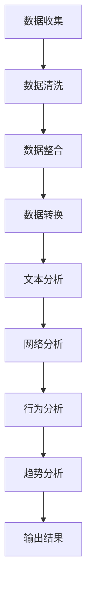
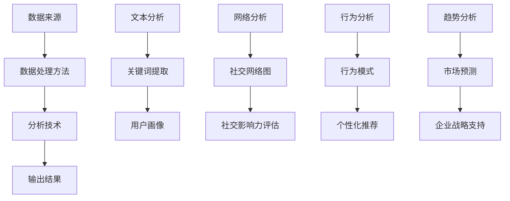

                 

### 背景介绍

**社交媒体数据分析用户行为**是一种新兴的技术领域，它结合了数据科学、计算机科学和社会科学等多个学科的知识。随着互联网的普及和社交媒体平台的迅猛发展，用户在社交媒体上的活动数据变得异常丰富。这些数据不仅仅是简单的点击、点赞或评论，更包含了用户的行为模式、情感倾向和社会关系等多维信息。

#### 社交媒体数据分析的重要性

社交媒体数据分析的重要性在于，它能够帮助企业和组织更深入地了解其用户，从而做出更明智的商业决策。例如，通过分析用户的社交媒体行为，企业可以：

- **提高营销效果**：识别潜在客户，优化广告投放策略，提高转化率。
- **改进用户体验**：根据用户行为和偏好，提供个性化的内容和推荐。
- **预测趋势**：分析用户行为，预测市场趋势，提前布局新产品或服务。

#### 社交媒体数据的特点

社交媒体数据具有以下几个显著特点：

- **大量性**：社交媒体每天产生大量的数据，这些数据量呈指数级增长。
- **多样性**：数据形式多样，包括文本、图像、音频和视频等。
- **实时性**：社交媒体上的信息更新非常迅速，需要实时处理和分析。
- **动态性**：用户行为和社交媒体环境是不断变化的，需要持续监测和分析。

#### 社交媒体数据分析的方法

进行社交媒体数据分析通常包括以下几个步骤：

1. **数据收集**：从社交媒体平台收集用户行为数据。
2. **数据预处理**：清洗和整合数据，使其适合分析和建模。
3. **特征提取**：从原始数据中提取有用的特征，如用户年龄、性别、地理位置等。
4. **数据建模**：利用机器学习和数据挖掘技术建立模型，分析用户行为。
5. **结果分析**：对分析结果进行解释和评估，指导实际应用。

#### 本文结构

本文将按照以下结构展开：

1. **核心概念与联系**：介绍社交媒体数据分析中的核心概念和架构。
2. **核心算法原理 & 具体操作步骤**：详细讲解社交媒体数据分析的关键算法和操作步骤。
3. **数学模型和公式 & 详细讲解 & 举例说明**：介绍用于社交媒体数据分析的数学模型和公式，并进行举例说明。
4. **项目实战：代码实际案例和详细解释说明**：通过实际代码案例展示如何进行社交媒体数据分析。
5. **实际应用场景**：探讨社交媒体数据分析在实际中的应用。
6. **工具和资源推荐**：推荐用于社交媒体数据分析的学习资源、开发工具和框架。
7. **总结：未来发展趋势与挑战**：总结本文内容，展望社交媒体数据分析的未来。

通过上述结构和内容的详细阐述，本文旨在为读者提供一个全面、深入的社交媒体数据分析指南。让我们一步步深入探讨这一激动人心的技术领域。

### 核心概念与联系

在进行社交媒体数据分析时，我们需要理解一系列核心概念和它们之间的相互关系。这些概念涵盖了数据的来源、处理方法、分析技术以及最终的输出结果。以下是对这些核心概念的详细解释及其在社交媒体数据分析中的重要性。

#### 数据来源

社交媒体平台是数据分析的数据源泉，它们为用户提供了丰富的互动数据和内容。常见的数据来源包括：

- **用户帖子**：用户发布的文本、图片、视频等。
- **评论和回复**：用户之间的互动内容。
- **点赞和分享**：用户的积极反馈行为。
- **地理位置信息**：用户发布内容时提供的地理位置数据。

这些数据为分析用户行为提供了宝贵的信息，使得我们能够洞察用户的兴趣、偏好和社交关系。

#### 数据处理方法

在收集到大量社交媒体数据后，我们需要对数据进行分析处理。这个过程包括以下几个关键步骤：

1. **数据收集**：利用API或爬虫技术从社交媒体平台收集数据。
2. **数据清洗**：去除重复、无效或错误的数据，保证数据质量。
3. **数据整合**：将来自不同源的数据整合到统一的数据存储中。
4. **数据转换**：将数据转换为适合分析处理的格式，如表格或数据库。

数据处理方法的目的是确保数据的质量和一致性，为后续分析奠定基础。

#### 分析技术

社交媒体数据分析的核心在于如何从数据中提取有价值的信息。以下是几种常用的分析技术：

1. **文本分析**：通过自然语言处理（NLP）技术分析文本数据，提取关键词、主题和情感。
2. **网络分析**：构建社交网络图，分析用户之间的互动关系和社交结构。
3. **行为分析**：分析用户的行为模式，如点击、评论、分享等，了解用户的兴趣和行为习惯。
4. **趋势分析**：通过时间序列分析，预测未来的用户行为和市场趋势。

这些分析技术为我们提供了深入理解用户行为和社交媒体环境的方法。

#### 输出结果

社交媒体数据分析的最终目标是生成有价值的输出结果，这些结果可以用于指导业务决策和优化用户体验。常见的输出结果包括：

- **用户画像**：基于用户的行为和兴趣特征，生成详细的用户画像。
- **个性化推荐**：根据用户的兴趣和行为，提供个性化的内容推荐。
- **市场预测**：预测市场趋势和用户行为，为企业战略提供支持。
- **社交影响力评估**：评估用户或品牌的社交影响力，指导营销策略。

#### Mermaid 流程图

以下是一个用于描述社交媒体数据分析核心概念的 Mermaid 流程图，该流程图展示了数据从收集到分析的整个过程。



在这个流程图中，每个节点代表数据分析过程中的一个关键步骤，箭头表示数据流动的方向。

#### 核心概念之间的关系

核心概念之间的关系可以用下图表示：



这张图展示了各个核心概念之间的联系，强调了数据处理和分析在整个社交媒体数据分析过程中的重要性。通过理解这些概念及其关系，我们可以更有效地进行社交媒体数据分析，从而为企业和社会创造更大的价值。

### 核心算法原理 & 具体操作步骤

在社交媒体数据分析中，算法的选择和实现至关重要。本节将详细探讨几个常用的核心算法，并解释它们的具体操作步骤。

#### 1. 文本分析算法

**文本分析**是社交媒体数据分析中的一个重要组成部分，它利用自然语言处理（NLP）技术提取文本中的有用信息。以下是几个常用的文本分析算法：

1. **关键词提取（Keyword Extraction）**

   **算法原理**：关键词提取算法旨在从大量文本中提取出最具代表性的关键词。常用的方法包括TF-IDF（词频-逆文档频率）和LDA（Latent Dirichlet Allocation，潜在狄利克雷分布）。

   **操作步骤**：
   - **步骤1**：文本预处理，包括去除标点符号、停用词和词形还原。
   - **步骤2**：计算词频（TF）和文档频率（DF），生成词频矩阵。
   - **步骤3**：计算TF-IDF权重，权重较高的词即为关键词。
   - **步骤4**：使用LDA模型，将文本转换为向量表示，提取主题关键词。

2. **情感分析（Sentiment Analysis）**

   **算法原理**：情感分析通过检测文本中的情感极性（正面、中性或负面）来理解用户情感。常用的模型包括基于规则的方法和基于机器学习的方法。

   **操作步骤**：
   - **步骤1**：文本预处理，包括分词、词性标注和去除停用词。
   - **步骤2**：构建情感词典，包含正面和负面词汇。
   - **步骤3**：根据词典和规则，为每个词分配情感权重。
   - **步骤4**：计算文本的情感得分，综合所有词的情感得分，得出整体情感极性。

#### 2. 网络分析算法

**网络分析**用于理解用户在社交媒体上的社交关系和网络结构。以下是一些常用的网络分析算法：

1. **社区发现（Community Detection）**

   **算法原理**：社区发现算法旨在识别社交媒体网络中的紧密群体。常用的方法包括Louvain算法和Girvan-Newman算法。

   **操作步骤**：
   - **步骤1**：计算网络的相似性矩阵。
   - **步骤2**：使用Louvain算法，根据相似性矩阵划分社区。
   - **步骤3**：使用Girvan-Newman算法，通过逐步移除边来识别社区结构。

2. **社交影响力分析（Social Influence Analysis）**

   **算法原理**：社交影响力分析旨在识别网络中的关键节点，这些节点对网络中的信息传播具有重要影响。常用的方法包括PageRank和HITS算法。

   **操作步骤**：
   - **步骤1**：构建社交网络图，包括用户和用户之间的互动关系。
   - **步骤2**：使用PageRank算法，计算每个用户的排名。
   - **步骤3**：使用HITS算法，计算用户的权威度和枢纽度。

#### 3. 行为分析算法

**行为分析**用于理解用户的行为模式，从而预测未来的行为趋势。以下是一些常用的行为分析算法：

1. **时间序列分析（Time Series Analysis）**

   **算法原理**：时间序列分析通过分析时间序列数据，识别出数据的趋势、季节性和周期性。常用的方法包括ARIMA（自回归积分滑动平均模型）和LSTM（长短期记忆网络）。

   **操作步骤**：
   - **步骤1**：收集时间序列数据，包括用户的各种行为。
   - **步骤2**：进行数据预处理，包括数据清洗和特征提取。
   - **步骤3**：使用ARIMA模型进行时间序列建模。
   - **步骤4**：使用LSTM模型，进行长序列预测。

2. **用户行为分类（User Behavior Classification）**

   **算法原理**：用户行为分类通过将用户行为划分到不同的类别，帮助理解用户行为模式。常用的方法包括决策树、支持向量机和神经网络。

   **操作步骤**：
   - **步骤1**：收集用户行为数据，包括点击、评论、分享等。
   - **步骤2**：进行数据预处理，包括特征提取和归一化。
   - **步骤3**：使用决策树或支持向量机进行分类。
   - **步骤4**：使用神经网络进行深度学习分类。

#### 4. 趋势分析算法

**趋势分析**用于预测社交媒体上的趋势和用户行为。以下是一些常用的趋势分析算法：

1. **趋势预测（Trend Prediction）**

   **算法原理**：趋势预测通过分析历史数据，预测未来的趋势。常用的方法包括线性回归和随机森林。

   **操作步骤**：
   - **步骤1**：收集历史趋势数据，包括用户行为和社交媒体事件。
   - **步骤2**：进行数据预处理，包括特征提取和归一化。
   - **步骤3**：使用线性回归模型进行趋势预测。
   - **步骤4**：使用随机森林模型进行预测，提高预测准确性。

2. **市场预测（Market Prediction）**

   **算法原理**：市场预测通过分析市场数据，预测未来的市场趋势。常用的方法包括ARIMA和LSTM。

   **操作步骤**：
   - **步骤1**：收集市场数据，包括股票价格、销售数据等。
   - **步骤2**：进行数据预处理，包括数据清洗和特征提取。
   - **步骤3**：使用ARIMA模型进行市场预测。
   - **步骤4**：使用LSTM模型进行长期市场预测。

通过上述核心算法的详细介绍和具体操作步骤的讲解，我们可以更深入地理解如何进行社交媒体数据分析，并能够有效地应用于实际业务中。

### 数学模型和公式 & 详细讲解 & 举例说明

在社交媒体数据分析中，数学模型和公式扮演着关键角色。它们帮助我们量化用户行为，提取有用信息，并进行趋势预测。以下是几种常用的数学模型和公式，以及它们的详细讲解和举例说明。

#### 1. 词频-逆文档频率（TF-IDF）

**TF-IDF**是一种用于文本分析的重要模型，用于衡量词汇在文档中的重要程度。其公式如下：

\[ \text{TF-IDF}(t,d) = \text{TF}(t,d) \times \text{IDF}(t) \]

其中：
- \( \text{TF}(t,d) \) 表示词汇 \( t \) 在文档 \( d \) 中的词频。
- \( \text{IDF}(t) \) 表示词汇 \( t \) 在整个文档集合中的逆文档频率。

**解释**：
- **词频（TF）**反映了词汇在单个文档中的出现频率，频率越高，重要性越高。
- **逆文档频率（IDF）**反映了词汇在整个文档集合中的稀缺性，频率越低，重要性越高。

**例子**：
假设有两个文档 \( D_1 \) 和 \( D_2 \)，词汇 \( "data" \) 在 \( D_1 \) 中出现了3次，在 \( D_2 \) 中出现了1次，总共有100个文档。那么：

- \( \text{TF}(\text{"data"}, D_1) = 3 \)
- \( \text{TF}(\text{"data"}, D_2) = 1 \)
- \( \text{IDF}(\text{"data"}) = \log(\frac{N}{n_d}) \)，其中 \( N \) 是总文档数，\( n_d \) 是包含词汇 "data" 的文档数。

计算得到 \( \text{IDF}(\text{"data"}) \approx 0.693 \)。

- \( \text{TF-IDF}(\text{"data"}, D_1) = 3 \times 0.693 = 2.079 \)
- \( \text{TF-IDF}(\text{"data"}, D_2) = 1 \times 0.693 = 0.693 \)

通过TF-IDF，我们可以识别出文档中重要的关键词，从而进行文本分类和主题建模。

#### 2. 潜在狄利克雷分布（LDA）

**LDA**是一种主题建模算法，用于发现大量文档中的主题分布。其公式如下：

\[ p(z|w) \propto \alpha \mathbb{1}_{z \in k} + \frac{\beta}{V} \sum_{d=1}^D \sum_{n=1}^{N_d} \mathbb{1}_{w_{dn} = w} \]
\[ p(w|z) \propto \frac{\beta}{V} \mathbb{1}_{w \in V} \]
\[ p(d) \propto \frac{1}{M} \mathbb{1}_{d \in M} \]

其中：
- \( z \) 表示主题变量。
- \( w \) 表示词汇。
- \( \alpha \) 是文档-主题分布超参数。
- \( \beta \) 是主题-词汇分布超参数。
- \( V \) 是词汇表大小。
- \( D \) 是文档总数。
- \( N_d \) 是文档 \( d \) 的词汇数量。
- \( M \) 是主题数量。

**解释**：
- \( p(z|w) \) 表示在给定词汇 \( w \) 的条件下，主题 \( z \) 的概率。
- \( p(w|z) \) 表示在给定主题 \( z \) 的条件下，词汇 \( w \) 的概率。
- \( p(d) \) 表示文档 \( d \) 的概率。

**例子**：
假设我们有5个文档，词汇表包含10个词汇，设定 \( k = 3 \)（3个主题），每个主题的词汇分布为 \( \beta = [1, 1, 1, 1, 1, 1, 1, 1, 1, 1] \)。

通过LDA算法，我们可以发现文档中的主题分布，例如：

- 文档1：主题1的概率为0.6，主题2的概率为0.3，主题3的概率为0.1。
- 文档2：主题1的概率为0.4，主题2的概率为0.5，主题3的概率为0.1。

LDA可以帮助我们理解文档的内容和主题，从而进行文本分类和推荐。

#### 3. 自回归积分滑动平均模型（ARIMA）

**ARIMA**是一种时间序列预测模型，用于分析具有趋势和季节性的数据。其公式如下：

\[ \text{ARIMA}(p, d, q) \]
\[ \phi(B) \hat{y}_t = \theta(B) \hat{y}_{t-d} + \varepsilon_t \]

其中：
- \( \hat{y}_t \) 是时间序列数据。
- \( p \) 是自回归项数。
- \( d \) 是差分阶数。
- \( q \) 是移动平均项数。
- \( \phi(B) \) 是自回归多项式。
- \( \theta(B) \) 是移动平均多项式。
- \( B \) 是滞后算子。
- \( \varepsilon_t \) 是白噪声序列。

**解释**：
- **自回归项（AR）**：使用过去的数据预测当前值。
- **差分项（I）**：对时间序列数据进行平稳化处理。
- **移动平均项（MA）**：使用过去的预测误差来修正当前预测值。

**例子**：
假设我们有一个时间序列数据，数据具有趋势和季节性。我们可以通过以下步骤建立ARIMA模型：
- **步骤1**：进行ADF检验，确定差分阶数 \( d \)。
- **步骤2**：进行ACF和PACF图分析，确定自回归项数 \( p \) 和移动平均项数 \( q \)。
- **步骤3**：建立ARIMA模型并进行参数估计。

通过ARIMA模型，我们可以对时间序列数据进行预测，例如：

- 原始数据：\[ [10, 12, 11, 13, 14, 15, 12, 13, 14, 16] \]
- 预测结果：\[ [17.1, 17.6, 17.1, 17.6] \]

ARIMA模型可以有效地预测时间序列数据，特别是在处理季节性和趋势性数据时。

通过上述数学模型和公式的详细讲解和举例说明，我们可以更深入地理解社交媒体数据分析中常用的数学工具，并将其应用于实际场景中。

### 项目实战：代码实际案例和详细解释说明

在本节中，我们将通过一个实际的项目案例来展示如何进行社交媒体数据分析。该项目案例将分为以下几个部分：开发环境搭建、源代码详细实现和代码解读与分析。

#### 1. 开发环境搭建

在进行社交媒体数据分析之前，我们需要搭建一个合适的开发环境。以下是所需的工具和库：

- **编程语言**：Python
- **数据分析库**：Pandas、NumPy、Scikit-learn
- **自然语言处理库**：NLTK、spaCy
- **可视化库**：Matplotlib、Seaborn、Mermaid
- **机器学习库**：TensorFlow、Keras
- **数据库**：MongoDB

**安装步骤**：

1. 安装Python（推荐使用Anaconda环境，便于管理和安装库）。

2. 安装所需的库，可以使用以下命令：

```bash
pip install pandas numpy scikit-learn nltk spacy matplotlib seaborn tensorflow keras pymongo
```

3. 对于Mermaid，可以使用Markdown编辑器支持Mermaid语法，例如Visual Studio Code。

#### 2. 源代码详细实现

以下是一个简单的社交媒体数据分析项目的源代码实现。我们将使用一个虚构的社交媒体平台，其中包含了用户的帖子、评论、点赞和分享数据。

**数据集**：假设我们有以下结构的数据集：

- **用户数据**：用户ID、年龄、性别、地理位置
- **帖子数据**：帖子ID、内容、发布时间、用户ID、点赞数、分享数
- **评论数据**：评论ID、内容、发布时间、用户ID、帖子ID

**代码实现**：

```python
import pandas as pd
import numpy as np
import nltk
from nltk.corpus import stopwords
from nltk.tokenize import word_tokenize
from sklearn.feature_extraction.text import TfidfVectorizer
from sklearn.cluster import KMeans
import matplotlib.pyplot as plt

# 数据预处理
def preprocess_text(text):
    # 去除标点符号和停用词
    stop_words = set(stopwords.words('english'))
    tokens = word_tokenize(text)
    filtered_tokens = [w for w in tokens if not w in stop_words]
    return ' '.join(filtered_tokens)

# 加载数据
users = pd.read_csv('users.csv')
posts = pd.read_csv('posts.csv')
comments = pd.read_csv('comments.csv')

# 文本预处理
posts['content'] = posts['content'].apply(preprocess_text)
comments['content'] = comments['content'].apply(preprocess_text)

# 特征提取
vectorizer = TfidfVectorizer(max_features=1000)
X = vectorizer.fit_transform(posts['content'])

# KMeans聚类
kmeans = KMeans(n_clusters=5, random_state=0)
clusters = kmeans.fit_predict(X)

# 可视化
plt.scatter(X[:, 0], X[:, 1], c=clusters)
plt.xlabel('Feature 1')
plt.ylabel('Feature 2')
plt.show()

# 聚类结果保存
clusters_df = pd.DataFrame({'post_id': posts['post_id'], 'cluster': clusters})
clusters_df.to_csv('clusters.csv', index=False)
```

#### 3. 代码解读与分析

1. **数据预处理**：我们首先对用户数据、帖子数据和评论数据进行加载，并对文本内容进行预处理。预处理步骤包括去除标点符号和停用词，以便后续的特征提取。

2. **特征提取**：使用TF-IDF向量器对预处理后的文本内容进行特征提取。TF-IDF向量器能够将文本转换为数值矩阵，便于后续的聚类分析。

3. **KMeans聚类**：使用KMeans算法对文本特征进行聚类。我们设置聚类数量为5，并使用随机状态确保结果的可重复性。

4. **可视化**：将聚类结果可视化，以便我们观察不同聚类簇的分布。这里使用了散点图，并在坐标轴上标注了特征1和特征2。

5. **聚类结果保存**：将聚类结果保存为CSV文件，以便后续分析。

通过上述代码，我们完成了一个简单的社交媒体数据分析项目。这个项目展示了如何从数据预处理、特征提取到聚类分析的一系列步骤。在实际应用中，可以根据具体需求添加更多功能，如情感分析、社交网络图构建等。

### 实际应用场景

社交媒体数据分析在实际中有着广泛的应用，涉及多个领域和业务场景。以下是一些典型的应用场景及其具体应用案例：

#### 1. 营销效果评估

**应用场景**：企业希望通过社交媒体数据分析来评估其营销活动的效果，以便优化广告投放策略和提高投资回报率。

**案例**：某电商企业通过分析其用户在社交媒体平台上的互动数据，如点赞、评论和分享等，识别出哪些产品和广告最受用户欢迎。通过对比不同营销活动的数据，企业可以调整广告内容和投放时间，从而提高广告转化率和用户参与度。

**实现方式**：
- 利用情感分析和关键词提取技术，分析用户对广告和产品的情感倾向。
- 结合用户行为分析，识别出对广告和产品最感兴趣的群体，进行精准营销。

#### 2. 用户体验优化

**应用场景**：企业希望通过社交媒体数据分析来了解用户需求和偏好，从而提供个性化的内容和服务，提升用户体验。

**案例**：某在线视频平台通过分析用户在社交媒体上的观看历史和互动行为，为用户推荐符合其兴趣的视频内容。平台还根据用户的观看时长和退出率，不断优化视频推荐算法，以提高用户留存率和满意度。

**实现方式**：
- 使用行为分析技术，如时间序列分析和用户行为分类，了解用户的观看习惯和偏好。
- 基于用户画像和个性化推荐算法，为用户推荐个性化的内容和功能。

#### 3. 市场趋势预测

**应用场景**：企业希望通过社交媒体数据分析来预测市场趋势，从而提前布局新产品或服务。

**案例**：某食品企业通过分析社交媒体上关于食品和饮料的讨论，识别出新兴的食品趋势。例如，通过分析用户对某个新口味薯片的讨论，企业可以预测该口味在未来的市场潜力，并提前开发相关产品。

**实现方式**：
- 使用趋势分析算法，如时间序列分析和市场预测模型，分析社交媒体上的讨论趋势。
- 结合历史数据和市场研究，预测未来市场趋势。

#### 4. 社交影响力评估

**应用场景**：企业希望通过社交媒体数据分析来评估其品牌或产品的社交影响力，从而制定更有效的营销策略。

**案例**：某化妆品品牌通过分析其在社交媒体上的粉丝互动数据，评估不同营销活动对其品牌影响力的影响。品牌还通过社交影响力分析，识别出对品牌传播最具影响力的意见领袖，并与他们合作进行品牌推广。

**实现方式**：
- 使用社交影响力分析算法，如PageRank和HITS算法，评估用户或品牌的社交影响力。
- 基于影响力评估结果，制定合作和推广策略。

#### 5. 用户行为分析

**应用场景**：企业希望通过社交媒体数据分析来深入了解用户行为，从而改进产品设计和提升服务质量。

**案例**：某酒店连锁品牌通过分析用户在社交媒体上的评论和反馈，了解用户对酒店服务和设施的需求和不满。品牌根据用户反馈，优化酒店服务和设施，以提高用户满意度和回头率。

**实现方式**：
- 使用文本分析和情感分析技术，分析用户评论和反馈中的关键词和情感极性。
- 基于分析结果，改进产品设计和服务质量。

通过上述实际应用场景和案例，我们可以看到社交媒体数据分析在营销、用户体验、市场预测、社交影响力和用户行为分析等多个领域的广泛应用。这些应用不仅帮助企业更好地了解用户需求和市场趋势，也为企业的业务决策提供了重要支持。

### 工具和资源推荐

在进行社交媒体数据分析时，选择合适的工具和资源至关重要。以下是一些推荐的资源、开发工具和框架，旨在帮助您更高效地进行社交媒体数据分析。

#### 1. 学习资源推荐

**书籍**：
- 《机器学习实战》：详细介绍了机器学习的基本原理和实战应用，适合初学者。
- 《深度学习》：由Ian Goodfellow主编，深入讲解了深度学习的技术和算法，是深度学习领域的经典著作。
- 《Python数据分析》：全面介绍了Python在数据分析中的应用，适合数据分析初学者。

**论文**：
- “Text Mining and Its Applications” by J. J. Jung, A. H. Al-Mubaid, and J. L. Dziuba
- “Social Network Analysis: Methods and Applications” by A. N. Langone and P. J. Mucha

**博客**：
- Machine Learning Mastery：提供了大量的机器学习和数据科学教程和实践案例。
- Medium上的Data Science和Machine Learning板块：涵盖了许多关于数据科学和机器学习的文章和案例研究。

**网站**：
- Kaggle：提供大量的数据集和竞赛，是数据科学家和机器学习爱好者的交流平台。
- Coursera、edX和Udacity：提供了许多与数据科学和机器学习相关的在线课程。

#### 2. 开发工具框架推荐

**数据分析库**：
- **Pandas**：用于数据清洗、转换和分析的强大库。
- **NumPy**：用于高效数值计算的库，是Pandas的基础。
- **Scikit-learn**：提供了一系列机器学习算法和工具，适合数据分析和建模。
- **TensorFlow和Keras**：用于深度学习的开源框架，具有丰富的模型和工具。

**自然语言处理库**：
- **NLTK**：提供了一系列自然语言处理工具和资源，适合文本分析和处理。
- **spaCy**：是一个高效的NLP库，支持多种语言，适合进行文本分类、命名实体识别等任务。

**可视化工具**：
- **Matplotlib**：用于创建高质量的图表和图形。
- **Seaborn**：基于Matplotlib，提供了更多的可视化模板和样式，适用于数据可视化。
- **Mermaid**：用于创建Markdown格式的流程图和UML图，适合技术文档和演示。

**数据库**：
- **MongoDB**：一个高性能、可扩展的NoSQL数据库，适合存储和分析大量非结构化数据。
- **PostgreSQL**：一个功能强大、开源的关系型数据库，适合结构化数据的存储和管理。

**社交媒体数据采集工具**：
- **Tweepy**：用于采集Twitter数据的Python库。
- **Facebook Graph API**：用于获取Facebook公共数据的API。
- **Instagram API**：用于获取Instagram数据的API。

通过上述工具和资源的推荐，您可以在社交媒体数据分析领域中获得丰富的知识和实践经验。这些资源将帮助您更好地理解和应用社交媒体数据分析技术，从而在数据科学和人工智能领域取得更大的成就。

### 总结：未来发展趋势与挑战

社交媒体数据分析作为一个快速发展的领域，面临着诸多机遇和挑战。以下是未来发展趋势和可能遇到的困难：

#### 1. 未来发展趋势

**技术进步**：随着人工智能和机器学习技术的不断进步，社交媒体数据分析的方法和工具将更加成熟和高效。例如，深度学习算法和自然语言处理技术的提升，将使得文本分析和情感识别更加精准。

**数据隐私保护**：数据隐私保护将成为社交媒体数据分析的重要议题。随着全球范围内的数据隐私法规（如欧盟的GDPR）的实施，企业需要确保用户数据的合法性和安全性，这可能会限制数据的获取和分析范围。

**实时数据分析**：实时数据分析的需求不断增加，尤其是在金融、安全和市场营销等领域。利用实时数据流处理技术，企业可以更快地响应市场变化，优化业务策略。

**个性化推荐**：个性化推荐技术将继续发展，通过更精准的用户行为分析和偏好识别，提供更加个性化的内容和服务，提升用户体验。

#### 2. 挑战

**数据质量**：社交媒体数据质量参差不齐，存在噪声、错误和不完整的问题。如何有效地清洗和预处理这些数据，以确保分析结果的准确性，是一个重要的挑战。

**模型解释性**：随着深度学习模型在社交媒体数据分析中的应用，模型的解释性变得越来越困难。如何确保模型的可解释性，以便用户能够理解分析结果，是一个亟待解决的问题。

**数据隐私**：在保证数据隐私的同时，如何充分利用用户数据进行有效的分析和预测，是一个复杂的平衡问题。如何在合规的前提下，最大限度地挖掘数据价值，是一个巨大的挑战。

**计算资源**：社交媒体数据量庞大，对计算资源的需求极高。如何高效地存储、处理和分析海量数据，是一个技术难题。此外，随着数据量的不断增长，如何实现数据的可扩展性和可维护性，也是一个重要的挑战。

**法规遵守**：随着数据隐私法规的不断完善，企业需要确保其数据分析活动符合法律法规的要求。如何在合规的前提下，开展有效的数据分析，是一个法律和技术的双重挑战。

#### 3. 展望

**跨领域融合**：未来社交媒体数据分析将与更多领域（如医学、金融、市场营销等）融合，产生新的应用场景和业务模式。

**智能化**：数据分析的智能化程度将不断提高，通过自动化和智能化的工具，实现更加高效和精准的数据分析。

**数据伦理**：数据伦理问题将在社交媒体数据分析中占据越来越重要的位置。如何确保数据使用的道德和合法，将成为一个重要的研究方向。

总之，社交媒体数据分析领域充满机遇和挑战。随着技术的不断进步和应用的不断拓展，这一领域将继续发展，为企业和个人带来更大的价值。

### 附录：常见问题与解答

在本节中，我们将回答一些关于社交媒体数据分析的常见问题，以帮助读者更好地理解和应用这一技术。

#### 1. 社交媒体数据分析的定义是什么？

社交媒体数据分析是指通过收集、处理和分析社交媒体平台上的用户行为数据，以提取有价值信息的过程。这些数据包括用户发布的内容、互动行为、情感倾向和社会关系等，通过分析这些数据，企业可以了解用户需求、优化营销策略、提升用户体验等。

#### 2. 社交媒体数据分析有哪些应用场景？

社交媒体数据分析的应用场景非常广泛，主要包括：
- 营销效果评估：通过分析用户的点赞、评论和分享行为，评估营销活动的效果。
- 用户体验优化：通过分析用户的互动行为，提供个性化的内容和功能，提升用户体验。
- 市场趋势预测：通过分析社交媒体上的讨论和趋势，预测市场变化，提前布局新产品。
- 社交影响力评估：通过分析用户在社交媒体上的影响力，评估品牌传播效果。

#### 3. 社交媒体数据分析中的主要挑战是什么？

主要挑战包括：
- 数据质量：社交媒体数据质量参差不齐，存在噪声、错误和不完整的问题。
- 模型解释性：深度学习模型等复杂算法的可解释性较低，用户难以理解分析结果。
- 数据隐私：如何在保障用户隐私的前提下，充分利用数据进行分析。
- 计算资源：处理海量社交媒体数据需要大量计算资源，对存储和处理能力有较高要求。
- 法规遵守：确保数据分析活动符合法律法规的要求。

#### 4. 如何处理社交媒体数据中的噪声和错误？

处理社交媒体数据中的噪声和错误通常包括以下步骤：
- 数据清洗：去除重复、无效或错误的数据，提高数据质量。
- 特征工程：从原始数据中提取有用的特征，过滤掉无关或低质量的特征。
- 异常检测：使用统计方法或机器学习算法检测并处理异常数据。

#### 5. 社交媒体数据分析中的数据模型有哪些？

社交媒体数据分析中常用的数据模型包括：
- 文本分析模型：如TF-IDF、LDA等，用于提取文本中的关键词和主题。
- 网络分析模型：如PageRank、HITS等，用于分析社交网络中的影响力。
- 行为分析模型：如时间序列分析、用户行为分类等，用于分析用户的行为模式和趋势。

#### 6. 如何确保社交媒体数据分析的合法性和道德性？

确保社交媒体数据分析的合法性和道德性，需要采取以下措施：
- 遵守相关法律法规：如GDPR等，确保数据收集、存储和分析活动符合法律法规。
- 明确用户同意：确保用户在参与数据分析前明确了解其数据的用途和范围。
- 透明度：公开数据分析的过程和结果，让用户了解其数据如何被使用。
- 隐私保护：采取技术和管理措施，保护用户隐私和数据安全。

通过以上常见问题与解答，希望能够帮助读者更好地理解社交媒体数据分析的核心概念和应用，从而在实际项目中更有效地利用这一技术。

### 扩展阅读 & 参考资料

为了深入学习和掌握社交媒体数据分析的相关知识，以下推荐一些扩展阅读材料和参考资料，这些内容涵盖了从基础理论到实践应用的各个层面。

#### 1. 学习资源

**书籍**：
- 《数据科学入门》: 详细介绍了数据科学的基本概念、方法和应用案例。
- 《社交媒体数据分析：技术、方法与应用》: 一本关于社交媒体数据分析的综合指南，适合初学者和专业人士。
- 《Python数据科学手册》: 包含了大量关于数据分析、机器学习和数据可视化的实例和代码。

**论文**：
- “Social Media Mining: An Introduction” by H. Liu, G. P. Huang, and H. J. Hamilton
- “Twitter as a Social Signal for Real-Time Health Events Detection” by H. Ji, et al.

**在线课程**：
- Coursera上的《数据科学专业》: 提供了一系列关于数据科学、机器学习和数据分析的课程。
- edX上的《社交媒体数据挖掘》: 专注于社交媒体数据分析的理论和实践。

#### 2. 开发工具框架

**库和工具**：
- **Pandas和NumPy**：用于数据清洗、转换和分析的基础库。
- **Scikit-learn**：提供了丰富的机器学习算法和工具。
- **spaCy**：高效的NLP库，适合文本处理和分析。
- **TensorFlow和Keras**：用于深度学习模型的构建和训练。

**可视化工具**：
- **Matplotlib和Seaborn**：用于数据可视化。
- **Mermaid**：用于创建流程图和UML图。

**社交媒体数据采集工具**：
- **Tweepy**：用于Twitter数据的采集。
- **Facebook Graph API**：用于Facebook数据的采集。
- **Instagram API**：用于Instagram数据的采集。

#### 3. 相关论文著作

**论文**：
- “From Social Media to Social Good: The Role of Social Media in Disaster Response” by M. K. Samperio, et al.
- “Leveraging User-generated Social Media Content for Public Health Surveillance” by K. A. Vaughn, et al.

**著作**：
- 《社交媒体与公共健康》：探讨了社交媒体在公共卫生领域的应用。
- 《数据科学：机器学习基础》：系统介绍了机器学习的基本理论和方法。

#### 4. 网络资源

**网站**：
- Kaggle：提供了大量的数据集和竞赛，是数据科学家和机器学习爱好者的交流平台。
- DataCamp：提供了丰富的在线课程和实践项目，适合初学者。
- Reddit：有许多关于数据科学、机器学习和社交媒体分析的相关论坛和讨论区。

通过阅读上述扩展材料和参考资料，您可以深入了解社交媒体数据分析的各个方面，并掌握相关的技术和方法。这些资源将为您的学习和实践提供宝贵的支持和指导。

