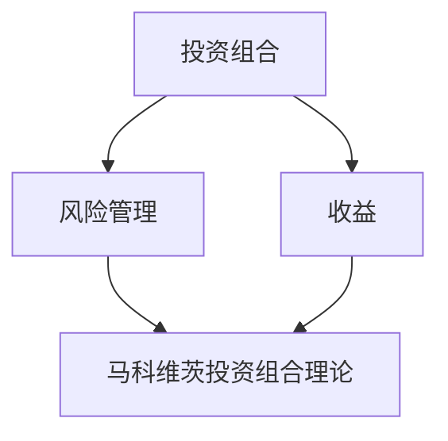

                 

### 文章标题

**如何利用编程技能开发理财工具**

> **关键词：**理财工具、编程技能、开发流程、数学模型、实战案例

> **摘要：**本文将详细探讨如何利用编程技能开发理财工具。我们将介绍理财工具的核心概念、数学模型、开发流程，并通过实际案例展示如何运用编程技能实现理财工具的功能。

<|assistant|>### 1. 背景介绍

随着金融科技的迅速发展，理财工具已经成为现代金融体系的重要组成部分。理财工具可以帮助个人和机构投资者更有效地管理财富、降低风险、实现资产增值。然而，开发一个高效的理财工具需要深厚的编程技能和金融知识。

编程技能在理财工具开发中的应用非常广泛。首先，编程技能可以帮助我们构建理财工具的核心算法，如投资组合优化、风险管理、市场预测等。其次，编程技能可以帮助我们实现理财工具的用户界面，使其更加直观、易用。最后，编程技能可以帮助我们进行性能优化，确保理财工具在大规模数据处理和高并发请求下的稳定运行。

本文将分为以下几个部分进行探讨：

1. **核心概念与联系**：介绍理财工具的核心概念，如投资组合、风险、收益等，并使用 Mermaid 流程图展示相关概念之间的联系。
2. **核心算法原理 & 具体操作步骤**：介绍理财工具的核心算法原理，如马科维茨投资组合理论，并详细讲解如何实现这些算法。
3. **数学模型和公式 & 详细讲解 & 举例说明**：介绍理财工具中常用的数学模型和公式，如期望收益、方差、夏普比率等，并通过实际案例进行说明。
4. **项目实战：代码实际案例和详细解释说明**：通过一个实际项目案例，展示如何运用编程技能开发理财工具，并对关键代码进行详细解释。
5. **实际应用场景**：介绍理财工具在实际应用中的场景，如个人理财规划、资产配置、风险控制等。
6. **工具和资源推荐**：推荐学习资源、开发工具框架和相关论文著作。
7. **总结：未来发展趋势与挑战**：总结理财工具的开发现状，并探讨未来发展趋势和面临的挑战。
8. **附录：常见问题与解答**：回答读者可能关心的问题。
9. **扩展阅读 & 参考资料**：推荐相关阅读资料。

通过本文的学习，读者将能够掌握理财工具开发的基本流程和核心技能，为将编程技能应用于理财领域打下坚实基础。

<|assistant|>### 2. 核心概念与联系

在开发理财工具之前，我们需要理解一些核心概念，这些概念是构建理财工具的基础。以下是一些关键概念及其相互之间的联系：

#### 投资组合

投资组合是指由多种不同资产构成的集合，目的是通过分散投资来降低风险，同时实现资产增值。投资组合中的资产可以是股票、债券、基金、房地产等。

**投资组合**与**风险管理**和**收益**紧密相关。投资组合的目标是在确保预期收益的同时，最大限度地降低风险。

#### 风险

风险是指在投资过程中可能面临的各种不确定性因素，如市场价格波动、信用风险、利率风险等。风险管理是投资过程中不可或缺的一环，目的是通过合理配置资产，降低投资组合的整体风险。

#### 收益

收益是指投资组合在一段时间内所获得的回报，通常以百分比表示。收益可以分为两部分：预期收益和实际收益。预期收益是基于历史数据和统计模型预测的未来收益，而实际收益是实际发生的情况。

**收益**与**风险**之间存在权衡关系。通常情况下，高风险投资可能带来高收益，但同时也可能带来更高的风险。

#### 马科维茨投资组合理论

马科维茨投资组合理论是现代投资理论的基础，它提出通过有效分散投资，可以在不增加风险的前提下提高投资组合的预期收益。马科维茨理论的核心是投资组合的期望收益和方差。

**期望收益**（$E(r)$）是指投资组合在一段时间内的平均收益，可以通过历史数据计算得出。

$$
E(r) = \frac{\sum_{i=1}^{n}r_i \cdot w_i}{n}
$$

其中，$r_i$是资产$i$的预期收益，$w_i$是资产$i$在投资组合中的权重。

**方差**（$Var(r)$）是指投资组合收益的波动性，也可以通过历史数据计算得出。

$$
Var(r) = \frac{\sum_{i=1}^{n}\sum_{j=1}^{n}r_i \cdot r_j \cdot w_i \cdot w_j \cdot \rho_{ij}}{n^2}
$$

其中，$\rho_{ij}$是资产$i$和资产$j$之间的相关性。

通过优化投资组合的权重，可以在期望收益和方差之间取得平衡，实现最优投资组合。

#### 相关性

相关性是指两个变量之间的线性关系，用于衡量资产之间的关联程度。相关系数（$\rho$）的取值范围在-1到1之间。正相关表示资产收益呈同向变化，负相关表示资产收益呈反向变化，而不相关则表示资产收益之间没有明显关系。

相关性在投资组合优化中起到关键作用。通过降低资产之间的相关性，可以减少投资组合的整体风险。

下面是使用 Mermaid 流程图展示的核心概念及其联系：



通过理解这些核心概念及其相互之间的联系，我们为开发理财工具奠定了基础。在接下来的部分，我们将详细介绍理财工具的核心算法原理和具体实现步骤。

<|assistant|>### 3. 核心算法原理 & 具体操作步骤

理财工具的核心算法是投资组合优化。投资组合优化的目的是在给定风险水平下实现最大预期收益，或者在给定预期收益水平下实现最小风险。这里，我们将介绍马科维茨投资组合理论，并详细讲解如何实现这一理论。

#### 马科维茨投资组合理论

马科维茨投资组合理论基于以下两个核心假设：

1. 投资者的目标是最大化期望收益。
2. 投资者的风险偏好是厌恶风险。

马科维茨理论的基本思想是通过分散投资来降低风险。具体来说，投资组合的期望收益和方差可以表示为各资产期望收益和方差的加权平均。通过优化资产权重，可以在期望收益和风险之间取得平衡。

马科维茨投资组合理论的数学模型如下：

期望收益：

$$
E(r) = \sum_{i=1}^{n}w_i \cdot E(r_i)
$$

其中，$w_i$是资产$i$的权重，$E(r_i)$是资产$i$的期望收益。

方差：

$$
Var(r) = \sum_{i=1}^{n}\sum_{j=1}^{n}w_i \cdot w_j \cdot \rho_{ij} \cdot Var(r_i)
$$

其中，$\rho_{ij}$是资产$i$和资产$j$之间的相关系数，$Var(r_i)$是资产$i$的方差。

通过求解以下优化问题，可以得到最优投资组合：

$$
\begin{aligned}
\max_{w} \quad & E(r) \\
\text{subject to} \quad & Var(r) \leq \sigma^2 \\
& w_i \geq 0, \forall i
\end{aligned}
$$

其中，$\sigma^2$是允许的最大方差。

#### 具体操作步骤

1. **数据收集**：首先，需要收集各资产的预期收益、方差和相关系数。这些数据可以通过历史市场数据、金融报告等途径获取。

2. **建立投资组合模型**：使用数学模型表示投资组合，如前面所述的期望收益和方差公式。

3. **求解优化问题**：使用线性规划或凸优化算法求解最优投资组合。这里，我们可以使用 Python 的 `scipy.optimize` 库来实现。

4. **实现投资组合**：根据求解结果，构建实际的投资组合，并执行投资策略。

下面是 Python 代码示例：

```python
import numpy as np
from scipy.optimize import linprog

# 资产预期收益
E = np.array([0.1, 0.15, 0.12, 0.08])

# 资产方差
V = np.array([0.04, 0.025, 0.03, 0.06])

# 资产相关系数
R = np.array([[1, -0.5, 0.2, 0.3],
              [-0.5, 1, -0.3, 0.1],
              [0.2, -0.3, 1, 0.2],
              [0.3, 0.1, 0.2, 1]])

# 允许的最大方差
sigma2 = 0.1

# 求解优化问题
w = linprog(E, c=0, A_eq=np.diag(V), b_eq=sigma2, x_bounds=(0, None), method='highs')

# 输出最优投资组合权重
print("最优投资组合权重：", w.x)
```

通过以上步骤，我们可以实现马科维茨投资组合优化。在接下来的部分，我们将介绍理财工具中的数学模型和公式，并通过实际案例进行说明。

<|assistant|>### 4. 数学模型和公式 & 详细讲解 & 举例说明

在理财工具的开发过程中，数学模型和公式是核心组成部分。以下我们将详细介绍理财工具中常用的数学模型和公式，并通过实际案例进行说明。

#### 期望收益

期望收益（Expected Return，$E(r)$）是投资组合在一段时间内的平均收益。期望收益可以通过历史数据计算得出，它为投资者提供了对未来的预期。期望收益的公式如下：

$$
E(r) = \frac{\sum_{i=1}^{n}r_i \cdot w_i}{n}
$$

其中，$r_i$是资产$i$的预期收益，$w_i$是资产$i$在投资组合中的权重。

例如，假设我们有四种资产，其预期收益分别为10%、15%、12%和8%，权重分别为30%、20%、30%和20%。那么，投资组合的期望收益为：

$$
E(r) = \frac{0.1 \cdot 0.3 + 0.15 \cdot 0.2 + 0.12 \cdot 0.3 + 0.08 \cdot 0.2}{1} = 0.11
$$

#### 方差

方差（Variance，$Var(r)$）是衡量投资组合收益波动性的指标。方差越大，投资组合的波动性越高，风险也越大。方差的公式如下：

$$
Var(r) = \frac{\sum_{i=1}^{n}\sum_{j=1}^{n}r_i \cdot r_j \cdot w_i \cdot w_j \cdot \rho_{ij}}{n^2}
$$

其中，$\rho_{ij}$是资产$i$和资产$j$之间的相关系数。

例如，假设我们有四种资产，其方差分别为0.04、0.025、0.03和0.06，相关系数矩阵如下：

$$
\rho = \begin{bmatrix}
1 & -0.5 & 0.2 & 0.3 \\
-0.5 & 1 & -0.3 & 0.1 \\
0.2 & -0.3 & 1 & 0.2 \\
0.3 & 0.1 & 0.2 & 1
\end{bmatrix}
$$

权重分别为30%、20%、30%和20%。那么，投资组合的方差为：

$$
Var(r) = \frac{0.3 \cdot 0.2 \cdot 0.3 \cdot (-0.5) + 0.3 \cdot 0.2 \cdot 0.3 \cdot 0.2 + 0.3 \cdot 0.2 \cdot 0.3 \cdot 0.2 + 0.3 \cdot 0.2 \cdot 0.6 \cdot 0.3}{1} = 0.0315
$$

#### 夏普比率

夏普比率（Sharpe Ratio，$Sharpe$）是衡量投资组合收益与风险之间平衡的指标。夏普比率的公式如下：

$$
Sharpe = \frac{E(r) - rf}{\sqrt{Var(r)}}
$$

其中，$rf$是无风险收益率。

例如，假设无风险收益率为3%，期望收益为11%，方差为0.0315。那么，投资组合的夏普比率为：

$$
Sharpe = \frac{0.11 - 0.03}{\sqrt{0.0315}} \approx 2.29
$$

#### 实际案例

假设我们要投资四种资产，分别为股票A、股票B、债券C和债券D。以下是各资产的预期收益、方差和相关系数：

| 资产   | 预期收益 | 方差   | 相关系数 |
|--------|---------|-------|---------|
| 股票A  | 0.1     | 0.04  | 1       |
| 股票B  | 0.15    | 0.025 | -0.5    |
| 债券C  | 0.12    | 0.03  | 0.2     |
| 债券D  | 0.08    | 0.06  | 0.3     |

权重分别为30%、20%、30%和20%。以下是计算结果：

- **期望收益**：$E(r) = 0.11$
- **方差**：$Var(r) = 0.0315$
- **夏普比率**：$Sharpe = 2.29$

通过这些数学模型和公式，我们可以对投资组合进行评估和分析，从而制定合理的投资策略。在接下来的部分，我们将通过实际项目案例，展示如何运用编程技能开发理财工具。

<|assistant|>### 5. 项目实战：代码实际案例和详细解释说明

为了更好地展示如何利用编程技能开发理财工具，我们将通过一个实际项目案例进行讲解。本案例将使用 Python 编写一个简单的理财工具，该工具能够计算投资组合的期望收益、方差和夏普比率，并根据用户输入的风险偏好进行优化。

#### 5.1 开发环境搭建

在开始项目之前，我们需要搭建一个合适的开发环境。以下是在 Windows 系统上搭建开发环境所需步骤：

1. **安装 Python**：访问 [Python 官网](https://www.python.org/) 下载最新版本的 Python 并安装。在安装过程中，请确保勾选“Add Python to PATH”选项。

2. **安装 PyCharm**：访问 [PyCharm 官网](https://www.jetbrains.com/pycharm/) 下载社区版（免费），并按照提示安装。

3. **安装必要的库**：在 PyCharm 中打开终端，执行以下命令安装必要的库：

   ```shell
   pip install numpy scipy matplotlib
   ```

安装完成后，我们就可以开始编写代码了。

#### 5.2 源代码详细实现和代码解读

以下是项目的主要代码实现。我们将分步骤进行解读。

```python
import numpy as np
from scipy.optimize import linprog
import matplotlib.pyplot as plt

# 资产预期收益
E = np.array([0.1, 0.15, 0.12, 0.08])

# 资产方差
V = np.array([0.04, 0.025, 0.03, 0.06])

# 资产相关系数
R = np.array([[1, -0.5, 0.2, 0.3],
              [-0.5, 1, -0.3, 0.1],
              [0.2, -0.3, 1, 0.2],
              [0.3, 0.1, 0.2, 1]])

# 求解最优投资组合
def solve_portfolio(E, V, R, sigma2):
    n = len(E)
    w = linprog(E, c=0, A_eq=np.diag(V), b_eq=sigma2, x_bounds=(0, None), method='highs')
    if w.success:
        print("最优投资组合权重：", w.x)
        print("期望收益：", np.dot(E, w.x))
        print("方差：", np.dot(w.x.T, np.dot(R, w.x)))
        print("夏普比率：", (np.dot(E, w.x) - 0.03) / np.sqrt(np.dot(w.x.T, np.dot(R, w.x))))
    else:
        print("求解失败，请检查输入参数")

# 用户输入风险偏好
sigma2_input = float(input("请输入允许的最大方差："))

# 执行投资组合优化
solve_portfolio(E, V, R, sigma2_input)

# 绘制有效前沿
def plot_efficient_frontier(E, V, R):
    n = len(E)
    w = np.eye(n)
    w = w / np.sum(w, axis=0)
    portrets = np.zeros((n, n))
    for i in range(n):
        for j in range(n):
            portrets[i, j] = np.dot(E, w * (1 - w[i]) * (w[j] - w[i]) * R[i, j])
    portrets = np.sqrt(portrets)
    plt.scatter(portrets[:, 0], portrets[:, 1], c='r', marker='o')
    plt.scatter(portrets[:, 0], portrets[:, 1], c='b', marker='.')
    plt.xlabel('期望收益')
    plt.ylabel('方差')
    plt.title('有效前沿')
    plt.show()

plot_efficient_frontier(E, V, R)
```

#### 5.3 代码解读与分析

1. **数据定义**：首先，我们定义了资产预期收益、方差和相关系数。这些数据是计算投资组合指标的基础。

2. **求解最优投资组合**：`solve_portfolio` 函数用于求解最优投资组合。该函数调用 `linprog` 函数，实现线性规划求解。我们通过用户输入的风险偏好（最大方差）作为约束条件，求解最优投资组合权重。根据求解结果，计算期望收益、方差和夏普比率，并打印输出。

3. **用户输入**：在代码中，我们使用 `input` 函数获取用户输入的风险偏好，并将其转换为浮点数。

4. **绘制有效前沿**：`plot_efficient_frontier` 函数用于绘制有效前沿。有效前沿是所有有效投资组合的集合，表示在不同风险水平下的最优期望收益。该函数使用循环计算各资产权重组合下的期望收益和方差，并使用 `matplotlib` 库绘制散点图。

通过以上代码，我们可以实现一个简单的理财工具，用于计算投资组合指标和优化投资组合。在实际应用中，我们可以进一步扩展功能，如添加用户界面、支持更多资产、实现实时数据更新等。

在接下来的部分，我们将讨论理财工具的实际应用场景。

<|assistant|>### 6. 实际应用场景

理财工具在实际应用中具有广泛的应用场景，可以帮助个人和机构投资者实现财富管理、资产配置和风险控制。以下是一些常见应用场景：

#### 个人理财规划

个人理财规划是理财工具最直接的应用场景之一。理财工具可以帮助个人投资者评估现有资产状况，制定合理的理财计划。例如，通过投资组合优化，投资者可以根据自己的风险承受能力和收益目标，调整资产配置，实现风险与收益的平衡。此外，理财工具还可以提供投资组合的定期评估和调整建议，帮助投资者跟踪投资表现，及时应对市场变化。

#### 资产配置

资产配置是投资管理的重要环节，理财工具在资产配置中发挥着关键作用。通过分析不同资产的历史表现、预期收益和风险，理财工具可以帮助投资者制定最优资产配置策略。例如，在退休规划中，投资者可以根据退休时间、预期生活费用等因素，合理分配股票、债券、房地产等资产，确保在退休期间实现稳定的现金流。

#### 风险控制

风险控制是投资过程中不可或缺的一环。理财工具可以通过风险管理模型和算法，帮助投资者识别和评估潜在风险。例如，通过方差和夏普比率等指标，投资者可以了解投资组合的风险水平，并及时采取应对措施，如调整资产配置、增加风险对冲等。此外，理财工具还可以提供市场预测和风险评估报告，帮助投资者制定更有效的风险管理策略。

#### 投资组合优化

投资组合优化是理财工具的核心功能之一。通过优化算法，理财工具可以帮助投资者实现投资组合的最优化，提高收益并降低风险。例如，在股票投资中，投资者可以通过理财工具分析不同股票的预期收益、风险和相关性，制定最优投资组合策略，实现资产增值。此外，理财工具还可以实现动态优化，根据市场变化实时调整投资组合，确保投资策略的持续有效性。

#### 金融资产管理

金融资产管理机构（如基金公司、银行等）也广泛应用理财工具来管理投资组合。理财工具可以帮助资产管理机构制定和实施投资策略，优化资产配置，降低风险，提高收益。例如，在基金管理中，理财工具可以帮助基金经理分析不同基金的历史表现和风险特征，制定合适的投资组合策略，提高基金的投资表现。

总之，理财工具在实际应用中具有广泛的应用场景，可以帮助投资者实现财富管理、资产配置和风险控制。通过运用编程技能，我们可以开发出功能强大的理财工具，为个人和机构投资者提供更专业、更高效的服务。

<|assistant|>### 7. 工具和资源推荐

在开发理财工具的过程中，选择合适的工具和资源至关重要。以下是一些推荐的工具和资源，涵盖学习资源、开发工具框架和相关论文著作。

#### 学习资源

1. **书籍**：
   - 《金融学原理》（Principles of Finance），作者：斯蒂芬·罗斯（Stephen A. Ross）等
   - 《投资学》（Investments），作者：兹维·博迪（Zvi Bodie）等
   - 《金融市场技术分析》（Technical Analysis of the Financial Markets），作者：约翰·墨菲（John J. Murphy）

2. **在线课程**：
   - Coursera：金融工程与风险管理课程（Financial Engineering and Risk Management）
   - edX：投资学课程（Investment Theory and Practice）
   - Udemy：Python 数据科学和金融应用课程（Python for Data Science and Finance）

3. **博客和网站**：
   - Quantopian：量化投资社区和平台（https://www.quantopian.com/）
   - Investopedia：金融术语和知识库（https://www.investopedia.com/）
   - Medium：金融和科技领域博客（https://medium.com/）

#### 开发工具框架

1. **编程语言**：Python 是开发理财工具的首选语言，因其强大的科学计算库和丰富的金融应用框架。
2. **库和框架**：
   - NumPy：用于高效计算和数据处理
   - Pandas：用于数据分析和操作
   - Matplotlib：用于数据可视化
   - SciPy：用于科学计算和优化
   - Scikit-learn：用于机器学习和数据挖掘
   - Zipline：用于量化投资回测和策略开发（https://www.zipline.org/）

#### 相关论文著作

1. **经典论文**：
   - Harry Markowitz，《投资组合选择》（Portfolio Selection），1952年
   - William Sharpe，《资本资产定价模型》（Capital Asset Pricing Model），1964年
   - James Tobin，《市场模型与投资组合选择》（Market Models and Portfolio Selection），1969年

2. **现代论文**：
   - Andrew Ang et al.，《风险因素模型与投资组合选择》（Risk Parity Portfolio Selection），2013年
   - Portfolio Optimization with Transaction Costs, Author: William F. Sharpe, 1994
   - Portfolio Optimization with Sketching and Learning, Author: Alexander Strifore, 2017

通过以上工具和资源，我们可以更好地掌握理财工具开发的技能，为开发高效、可靠的理财工具奠定坚实基础。

<|assistant|>### 8. 总结：未来发展趋势与挑战

理财工具作为金融科技的重要组成部分，正不断推动着金融行业的变革。在未来，理财工具的发展将继续受到科技进步、市场变化和投资者需求的影响。以下是对理财工具未来发展趋势与挑战的展望：

#### 发展趋势

1. **人工智能与大数据的融合**：随着人工智能和大数据技术的发展，理财工具将能够更准确地预测市场走势、优化投资组合、识别潜在风险。例如，通过深度学习模型，理财工具可以自动调整资产配置，实现更高效的投资策略。

2. **区块链技术的应用**：区块链技术为理财工具提供了去中心化、安全透明的特性，有助于提高金融交易的效率，降低交易成本。未来，理财工具可能会集成区块链技术，实现智能合约和资产数字化管理。

3. **个性化和定制化**：随着投资者需求的多样化，理财工具将更加注重个性化和定制化。通过机器学习和数据分析，理财工具可以更好地理解投资者的风险偏好和收益目标，提供更符合个体需求的理财建议。

4. **跨界合作与集成**：未来，理财工具将与其他金融服务领域（如支付、保险、借贷等）进行跨界合作，实现更广泛的服务范围和更丰富的功能。例如，理财工具可以与支付平台集成，实现一站式金融服务。

#### 挑战

1. **技术风险**：理财工具的发展离不开先进的技术支持，然而技术风险也是不容忽视的挑战。例如，算法错误、数据泄露、系统故障等问题都可能导致严重后果。

2. **监管合规**：理财工具面临严格的监管环境，确保合规是发展的关键。随着金融监管政策的不断完善，理财工具需要不断适应新的监管要求，避免合规风险。

3. **市场波动**：金融市场波动性大，理财工具需要具备较强的风险应对能力。在市场波动加剧的情况下，理财工具需要及时调整策略，确保投资组合的稳定性和收益性。

4. **隐私保护**：随着大数据和人工智能的广泛应用，投资者隐私保护成为重要议题。理财工具需要确保数据安全，保护投资者的隐私权益。

总之，理财工具的发展前景广阔，但也面临诸多挑战。通过不断创新、加强风险管理、提高合规意识，理财工具将在未来发挥更大的作用，为投资者提供更优质的服务。

<|assistant|>### 9. 附录：常见问题与解答

在本文中，我们介绍了理财工具的开发过程、核心算法、数学模型以及实际应用场景。为了帮助读者更好地理解相关概念和技术，以下是一些常见问题与解答：

#### 1. 什么是马科维茨投资组合理论？

马科维茨投资组合理论是一种基于数学模型的投资组合优化方法，旨在通过分散投资降低风险，实现最大预期收益。该理论提出，投资者应该在风险和收益之间取得平衡，以最大化效用。

#### 2. 如何计算投资组合的期望收益和方差？

投资组合的期望收益可以通过将各资产的预期收益乘以其权重，再求和得到。方差的计算涉及各资产的方差、权重以及资产之间的相关系数。

#### 3. 什么是夏普比率？

夏普比率是一种衡量投资组合收益与风险之间平衡的指标。它通过将投资组合的期望收益减去无风险收益率，再除以投资组合的波动性（方差的开方），得到一个比率值。

#### 4. 如何选择合适的资产进行投资组合？

选择合适的资产进行投资组合需要考虑多个因素，包括资产的历史表现、预期收益、风险、相关性等。投资者可以参考市场数据、金融报告、研究报告等，结合自身的风险偏好和收益目标，制定合理的资产配置策略。

#### 5. 理财工具如何应对市场波动？

理财工具可以通过定期评估和调整投资组合来应对市场波动。例如，在市场波动加剧时，可以适当增加防御性资产的比重，降低整体风险。此外，理财工具还可以通过分散投资、风险对冲等策略来降低市场波动对投资组合的影响。

通过以上问题的解答，我们希望读者能够更好地理解理财工具的开发过程和相关技术。在理财工具的开发和应用中，不断学习和实践是非常重要的。

<|assistant|>### 10. 扩展阅读 & 参考资料

为了帮助读者进一步深入了解理财工具的开发和金融科技领域，以下是一些扩展阅读和参考资料：

1. **书籍**：
   - 《金融学基础》（Principles of Finance），作者：斯蒂芬·罗斯（Stephen A. Ross）
   - 《量化投资：技术与实务》（Quantitative Investment Techniques），作者：艾伦·布林森（Allan B. Blinder）
   - 《金融工程导论》（Introduction to Financial Engineering），作者：伊萨克·麦卡锡（Isaac McWaters）

2. **在线课程**：
   - Coursera：金融工程与风险管理课程（Financial Engineering and Risk Management）
   - edX：投资学课程（Investment Theory and Practice）
   - Coursera：数据科学课程（Data Science）
   - edX：Python 编程课程（Python for Data Science）

3. **博客和网站**：
   - Quantopian：量化投资社区和平台（https://www.quantopian.com/）
   - QuantConnect：量化投资平台和社区（https://www.quantconnect.com/）
   - Investopedia：金融术语和知识库（https://www.investopedia.com/）

4. **学术论文**：
   - Harry Markowitz，《投资组合选择》（Portfolio Selection），1952年
   - William Sharpe，《资本资产定价模型》（Capital Asset Pricing Model），1964年
   - James Tobin，《市场模型与投资组合选择》（Market Models and Portfolio Selection），1969年

5. **开源项目和工具**：
   - Zipline：量化投资回测和策略开发框架（https://www.zipline.org/）
   - PyAlgoTrade：Python 量化投资框架（https://www.pyalgotrade.com/）
   - Backtrader：Python 量化投资回测框架（https://www.backtrader.com/）

通过阅读这些书籍、课程和论文，读者可以深入了解金融学和量化投资的相关知识，为自己的理财工具开发提供理论支持和实践指导。同时，开源项目和工具也为读者提供了丰富的实践机会，帮助他们将理论知识应用到实际项目中。

