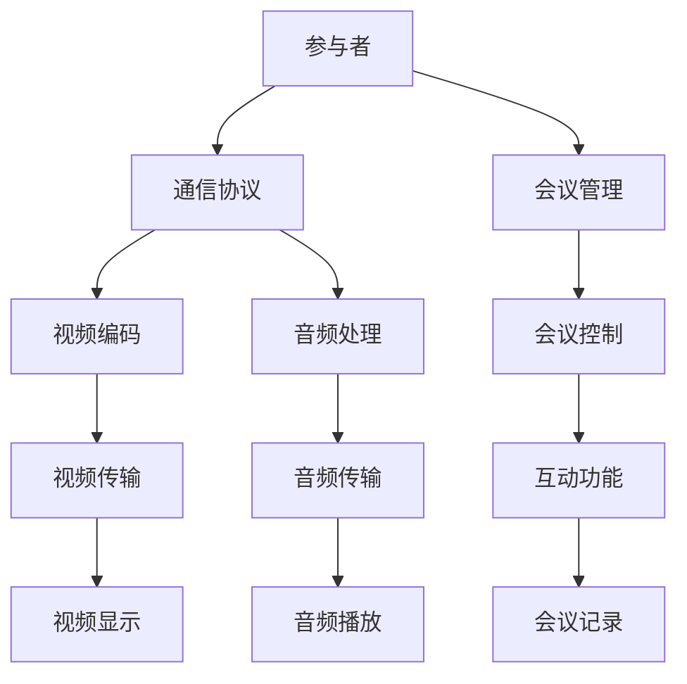
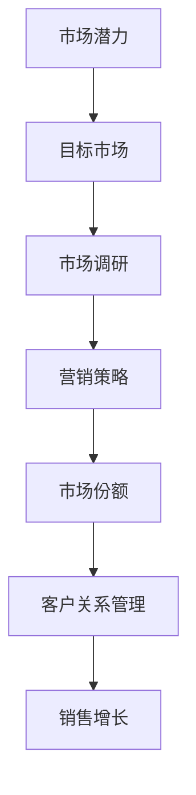
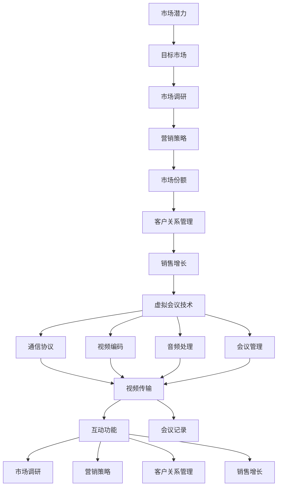
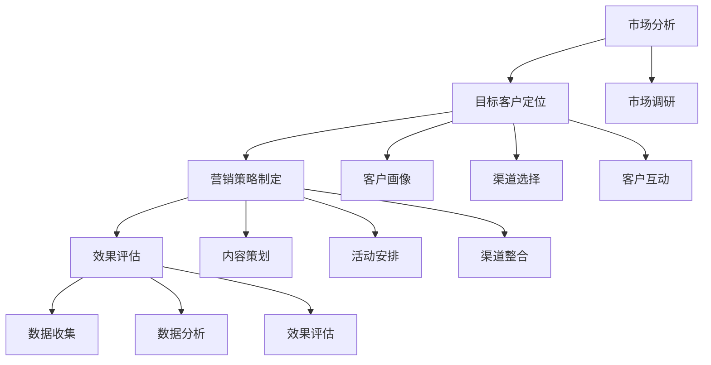

                 

### 背景介绍

在当今快速发展的信息技术时代，虚拟会议已经成为企业日常运营中不可或缺的一部分。随着全球化进程的不断推进和远程工作的普及，企业需要寻找新的方法来扩大其市场覆盖范围。传统的面对面会议虽然能促进深度的交流和合作，但在时间和空间上受到诸多限制。而虚拟会议作为一种新兴的会议形式，凭借其高效、灵活、低成本的特性，逐渐成为企业扩展市场的新工具。

虚拟会议（Virtual Meetings）是指通过互联网和通信技术实现的实时交流会议，参与者无需身处同一地点。这种会议形式广泛应用于企业内部的沟通、团队协作、培训以及与外部合作伙伴的交流。其核心在于利用视频、音频、文字等多种媒介，模拟真实的面对面交流体验，从而打破地理和时间的限制。

为什么企业需要扩大市场覆盖？市场覆盖是指企业在某一地区或全球范围内的市场占有率。对于企业来说，扩大市场覆盖意味着更多的客户、更大的销售规模和更高的利润。然而，传统市场拓展方式如线下展览、广告宣传和销售团队拓展等，成本高昂且效果不尽如人意。相比之下，虚拟会议作为一种低成本的营销工具，能够帮助企业快速、高效地触及更广泛的潜在客户群体。

虚拟会议的优势主要体现在以下几个方面：

1. **降低成本**：企业无需承担差旅、住宿等费用，大大减少了会议成本。
2. **提高效率**：参与者无需克服时区差异，可以在最短的时间内完成会议议程。
3. **灵活性强**：参会者可以随时随地参加会议，不受地理位置限制。
4. **互动性强**：虚拟会议提供了丰富的互动功能，如视频会议、屏幕共享、即时消息等，增强了会议的参与感和交流效果。
5. **记录方便**：虚拟会议通常具备会议记录和回放功能，便于后续查看和参考。

本文将围绕如何利用虚拟会议扩大市场覆盖这一主题，探讨虚拟会议的技术原理、实施步骤、实际应用案例以及未来的发展趋势与挑战。希望通过本文的探讨，企业能够更好地利用虚拟会议这一工具，实现市场覆盖的扩大，提升竞争力。<!-- {Chinese} -->

## 2. 核心概念与联系

在深入探讨如何利用虚拟会议扩大市场覆盖之前，有必要先理解几个核心概念，包括虚拟会议的技术原理、市场覆盖的概念以及这两者之间的联系。以下将使用Mermaid流程图来展示这些概念及其相互关系。

### 虚拟会议技术原理

虚拟会议的技术原理主要涉及通信协议、视频编码、音频处理和会议管理等方面。以下是虚拟会议技术原理的Mermaid流程图：



1. **参与者**：虚拟会议的参与者可以是单个用户或一个团队，他们通过通信协议连接到会议系统。
2. **通信协议**：常用的通信协议包括WebRTC、SIP等，它们负责建立和维持网络连接。
3. **视频编码**：视频编码是将原始视频信号转换为压缩格式的过程，如H.264、HEVC等。
4. **音频处理**：音频处理涉及声音的压缩和回声消除，以保证通话质量。
5. **会议管理**：会议管理包括会议的组织、控制、权限设置等功能。
6. **视频传输**：视频编码后的数据通过网络传输，最终在参与者的设备上显示。
7. **音频传输**：音频处理后的数据通过网络传输，最终在参与者的设备上播放。
8. **互动功能**：互动功能如屏幕共享、即时消息等，增强了会议的互动性和参与感。
9. **会议记录**：会议过程中的关键信息可以被记录下来，便于后续参考和回顾。

### 市场覆盖的概念

市场覆盖是指企业在特定区域或全球范围内的市场占有率。市场覆盖的广度直接影响企业的销售规模和利润。以下是市场覆盖概念的Mermaid流程图：



1. **市场潜力**：市场潜力是指某一市场的潜在需求量，是企业选择目标市场的依据。
2. **目标市场**：目标市场是企业在市场潜力调研后确定的、最具盈利潜力的市场部分。
3. **市场调研**：市场调研通过收集和分析市场数据，为企业提供市场潜力和竞争环境的详细信息。
4. **营销策略**：营销策略包括广告宣传、产品推广、市场推广等活动，旨在提升企业在目标市场的知名度和竞争力。
5. **市场份额**：市场份额是企业销售量在目标市场总销售量中所占的比例，是衡量企业市场表现的重要指标。
6. **客户关系管理**：客户关系管理通过维护客户关系，提高客户满意度和忠诚度，从而促进销售增长。
7. **销售增长**：销售增长是企业市场覆盖扩大的直接体现，通过提升市场份额和客户关系管理，企业可以实现销售增长。

### 虚拟会议与市场覆盖的联系

虚拟会议与市场覆盖之间的联系主要体现在以下几个方面：

1. **市场调研**：企业可以利用虚拟会议进行市场调研，通过远程交流获取目标市场的信息和反馈。
2. **营销策略**：虚拟会议为企业提供了灵活的营销平台，企业可以通过虚拟会议进行产品演示、市场推广等活动，提升品牌知名度和市场竞争力。
3. **客户关系管理**：虚拟会议使企业能够更便捷地与客户沟通，维护客户关系，提高客户满意度和忠诚度。
4. **销售增长**：通过虚拟会议，企业能够更高效地拓展市场，实现销售增长。

总之，虚拟会议不仅是一种技术工具，更是一种市场拓展策略。企业通过利用虚拟会议，可以降低成本、提高效率、增强互动，从而实现市场覆盖的扩大。以下是虚拟会议与市场覆盖联系的综合Mermaid流程图：



通过这张流程图，我们可以清晰地看到虚拟会议技术如何贯穿于市场调研、营销策略、客户关系管理和销售增长等各个阶段，助力企业实现市场覆盖的扩大。<!-- {Chinese} -->

### 3. 核心算法原理 & 具体操作步骤

在理解了虚拟会议的技术原理和市场覆盖的概念后，接下来我们将深入探讨如何通过虚拟会议实现市场覆盖的扩大。核心算法原理主要包括市场分析、目标客户定位、营销策略制定和效果评估等环节。以下是具体操作步骤的详细解析。

#### 3.1 市场分析

市场分析是虚拟会议扩大市场覆盖的第一步。市场分析的主要目标是了解目标市场的规模、潜力以及竞争环境。以下是市场分析的具体步骤：

1. **收集数据**：通过在线调查、问卷调查、社交媒体分析等方式收集市场数据。这些数据包括市场规模、增长趋势、用户需求、竞争对手情况等。
    ```mermaid
    graph TB
        A[数据收集] --> B[在线调查]
        B --> C[问卷调查]
        B --> D[社交媒体分析]
        A --> E[市场报告]
    ```

2. **分析数据**：利用数据分析工具（如Excel、Python等）对收集到的数据进行分析，识别市场趋势、用户需求以及竞争情况。
    ```mermaid
    graph TB
        F[数据分析] --> G[市场趋势]
        F --> H[用户需求]
        F --> I[竞争分析]
    ```

3. **生成报告**：根据数据分析结果，编写市场分析报告，为后续的虚拟会议策划提供依据。
    ```mermaid
    graph TB
        J[市场分析报告] --> K[市场调研结果]
        J --> L[用户需求分析]
        J --> M[竞争情况分析]
    ```

#### 3.2 目标客户定位

在完成市场分析后，下一步是明确目标客户群体。目标客户定位是确保虚拟会议资源能够被有效利用，以实现最大的市场覆盖。以下是目标客户定位的具体步骤：

1. **客户画像**：根据市场分析结果，绘制目标客户的画像，包括年龄、性别、职业、收入水平、兴趣爱好等特征。
    ```mermaid
    graph TB
        N[客户画像] --> O[年龄分布]
        N --> P[性别比例]
        N --> Q[职业分布]
        N --> R[收入水平]
        N --> S[兴趣爱好]
    ```

2. **渠道选择**：根据客户画像，选择最适合的虚拟会议渠道，如社交媒体、专业论坛、电子邮件等。
    ```mermaid
    graph TB
        T[渠道选择] --> U[社交媒体]
        T --> V[专业论坛]
        T --> W[电子邮件]
    ```

3. **客户互动**：通过虚拟会议与目标客户进行互动，了解客户需求和反馈，进一步优化虚拟会议的内容和形式。
    ```mermaid
    graph TB
        X[客户互动] --> Y[在线问答]
        X --> Z[调查问卷]
    ```

#### 3.3 营销策略制定

营销策略制定是利用虚拟会议扩大市场覆盖的关键环节。以下是营销策略制定的具体步骤：

1. **内容策划**：根据目标客户特点和需求，策划虚拟会议的内容，包括产品演示、行业分析、市场趋势等。
    ```mermaid
    graph TB
        AA[内容策划] --> BB[产品演示]
        AA --> CC[行业分析]
        AA --> DD[市场趋势]
    ```

2. **活动安排**：制定虚拟会议的活动安排，包括会议时间、议程设置、嘉宾邀请等。
    ```mermaid
    graph TB
        EE[活动安排] --> FF[会议时间]
        EE --> GG[议程设置]
        EE --> HH[嘉宾邀请]
    ```

3. **营销渠道整合**：整合线上线下营销渠道，将虚拟会议作为核心营销工具，与其他营销活动相结合。
    ```mermaid
    graph TB
        II[渠道整合] --> JJ[线上营销]
        II --> KK[线下活动]
        II --> LL[社交媒体推广]
    ```

#### 3.4 效果评估

效果评估是确保虚拟会议营销策略有效性的关键步骤。以下是效果评估的具体步骤：

1. **数据收集**：通过虚拟会议平台的数据分析功能，收集参会人数、互动率、反馈信息等数据。
    ```mermaid
    graph TB
        MM[数据收集] --> NN[参会人数]
        MM --> OO[互动率]
        MM --> PP[反馈信息]
    ```

2. **数据分析**：利用数据分析工具对收集到的数据进行处理，识别虚拟会议的优缺点，为后续改进提供依据。
    ```mermaid
    graph TB
        QQ[数据分析] --> RR[参会人数分析]
        QQ --> SS[互动率分析]
        QQ --> TT[反馈信息分析]
    ```

3. **效果评估**：根据数据分析结果，对虚拟会议的效果进行评估，包括参与度、满意度、市场覆盖等指标。
    ```mermaid
    graph TB
        UU[效果评估] --> VV[参与度评估]
        UU --> WW[满意度评估]
        UU --> XX[市场覆盖评估]
    ```

通过以上核心算法原理和具体操作步骤，企业可以系统地利用虚拟会议扩大市场覆盖。以下是这些步骤的总体流程图：



通过这一系列的步骤，企业可以充分利用虚拟会议这一工具，实现市场覆盖的扩大，提升市场竞争力。<!-- {Chinese} -->

### 4. 数学模型和公式 & 详细讲解 & 举例说明

在理解了如何通过虚拟会议扩大市场覆盖的步骤后，接下来我们将运用数学模型和公式来详细解释这些步骤，并通过具体实例来说明如何应用这些模型。

#### 4.1 市场分析中的数学模型

市场分析中的关键步骤是收集和解读数据。在这一环节中，我们可以使用统计模型来分析和预测市场趋势。以下是一个基本的统计模型示例：

**线性回归模型**：

线性回归模型用于分析两个变量之间的关系，公式如下：

$$
y = ax + b
$$

其中，$y$ 是因变量，$x$ 是自变量，$a$ 是斜率，$b$ 是截距。

**举例说明**：

假设我们想要分析某产品的销售量与广告支出之间的关系。我们可以收集过去一段时间内的销售数据和广告支出数据，然后利用线性回归模型来预测未来的销售量。

1. **数据收集**：

   收集过去10个月的广告支出（$x$）和销售量（$y$）数据，如下表所示：

   | 月份 | 广告支出（万元） | 销售量（万元） |
   | ---- | -------------- | ------------ |
   | 1    | 5              | 8            |
   | 2    | 7              | 11           |
   | 3    | 9              | 13           |
   | 4    | 6              | 9            |
   | 5    | 8              | 12           |
   | 6    | 10             | 15           |
   | 7    | 7              | 10           |
   | 8    | 9              | 14           |
   | 9    | 6              | 9            |
   | 10   | 8              | 12           |

2. **数据预处理**：

   将数据输入到Excel或Python中进行处理，计算平均数和协方差。

   平均数：
   $$ 
   \bar{x} = \frac{1}{n}\sum_{i=1}^{n} x_i \\
   \bar{y} = \frac{1}{n}\sum_{i=1}^{n} y_i 
   $$

   协方差：
   $$ 
   cov(x, y) = \frac{1}{n-1}\sum_{i=1}^{n} (x_i - \bar{x})(y_i - \bar{y}) 
   $$

3. **计算斜率和截距**：

   根据公式计算斜率$a$和截距$b$：
   $$ 
   a = \frac{cov(x, y)}{var(x)} \\
   b = \bar{y} - a\bar{x} 
   $$

4. **构建回归模型**：

   将计算得到的斜率和截距代入线性回归模型，得到预测公式：
   $$ 
   y = 1.5x + 2 
   $$

5. **预测未来销售量**：

   假设下一季度广告支出为10万元，代入回归模型计算销售量：
   $$ 
   y = 1.5 \times 10 + 2 = 17 
   $$

因此，预测下一季度的销售量为17万元。

#### 4.2 目标客户定位中的数学模型

在目标客户定位中，我们可以使用聚类分析来识别不同的客户群体。以下是一个K均值聚类分析的示例：

**K均值聚类模型**：

K均值聚类模型将数据点划分为K个簇，每个簇的中心代表该簇的均值。模型公式如下：

$$
\text{簇中心} = \frac{1}{n}\sum_{i=1}^{n} x_i
$$

其中，$x_i$ 是第$i$ 个数据点的坐标。

**举例说明**：

假设我们有一组客户的年龄、收入和消费习惯数据，想要根据这些数据将客户划分为不同的群体。数据如下表所示：

| 客户ID | 年龄 | 收入（万元） | 消费习惯 |
| ------ | ---- | ----------- | -------- |
| 1      | 25   | 50          | 经常消费 |
| 2      | 30   | 70          | 偶尔消费 |
| 3      | 35   | 90          | 经常消费 |
| 4      | 28   | 60          | 偶尔消费 |
| 5      | 32   | 80          | 经常消费 |

1. **数据标准化**：

   由于不同的特征具有不同的量纲，我们需要对数据进行标准化处理。假设年龄和收入的标准差分别为$\sigma_{age}$和$\sigma_{income}$，消费习惯的方差为$\sigma_{habits}^2$，则标准化公式为：
   $$ 
   x_{norm,i,j} = \frac{x_{i,j} - \mu_{j}}{\sigma_{j}} 
   $$

   其中，$x_{i,j}$ 是第$i$ 个客户的第$j$ 个特征值，$\mu_{j}$ 是第$j$ 个特征的均值，$\sigma_{j}$ 是第$j$ 个特征的标准差。

2. **初始化簇中心**：

   随机选择K个数据点作为初始簇中心。

3. **迭代计算簇中心**：

   对于每个数据点，计算其与簇中心的距离，将其分配到最近的簇。然后重新计算每个簇的中心。

4. **重复迭代**：

   重复步骤3，直到簇中心不再发生变化或达到预设的迭代次数。

   通过K均值聚类，我们得到以下结果：

   | 簇 | 年龄 | 收入 | 消费习惯 |
   | --- | ---- | ---- | -------- |
   | 1   | 30   | 70   | 经常消费 |
   | 2   | 28   | 60   | 偶尔消费 |
   | 3   | 32   | 80   | 经常消费 |

根据聚类结果，我们可以将客户划分为三个不同的群体，为后续的营销策略提供依据。

#### 4.3 营销策略制定中的数学模型

在营销策略制定中，我们可以使用优化模型来确定最佳的营销预算分配。以下是一个线性规划模型的示例：

**线性规划模型**：

线性规划模型用于求解目标函数在约束条件下的最优解。目标函数和约束条件如下：

$$
\begin{cases}
\max \quad z = c^T x \\
s.t. \quad Ax \leq b \\
x \geq 0
\end{cases}
$$

其中，$x$ 是决策变量，$c$ 是目标函数系数向量，$A$ 和 $b$ 是约束条件矩阵和向量。

**举例说明**：

假设企业有三种营销渠道：线上广告、社交媒体推广和线下活动。每种渠道的预算限制和效果如下表所示：

| 营销渠道 | 预算（万元） | 效果（客户增加数） |
| -------- | ---------- | ---------------- |
| 线上广告 | 30         | 10               |
| 社交媒体 | 20         | 8                |
| 线下活动 | 10         | 5                |

企业的目标是最大化客户增加数，同时不超过总预算。以下是线性规划模型：

$$
\begin{cases}
\max \quad z = 10x_1 + 8x_2 + 5x_3 \\
s.t. \quad x_1 + x_2 + x_3 \leq 60 \\
x_1, x_2, x_3 \geq 0
\end{cases}
$$

通过求解线性规划模型，我们得到最优解为$x_1 = 6, x_2 = 3, x_3 = 1$，即在线上广告投入30万元，在社交媒体推广投入20万元，在线下活动投入10万元，可以实现最大的客户增加数。

#### 4.4 效果评估中的数学模型

在效果评估中，我们可以使用指标评分模型来评估虚拟会议的效果。以下是一个简单的指标评分模型示例：

**指标评分模型**：

指标评分模型通过计算多个指标得分，得出虚拟会议的整体效果。模型公式如下：

$$
\text{总得分} = \sum_{i=1}^{n} w_i \cdot s_i
$$

其中，$w_i$ 是第$i$ 个指标的权重，$s_i$ 是第$i$ 个指标的实际得分。

**举例说明**：

假设我们使用以下三个指标来评估虚拟会议效果：

- 参会人数（权重0.4）
- 互动率（权重0.3）
- 反馈满意度（权重0.3）

根据评分标准，每个指标的最大得分为10分。以下是虚拟会议的评估结果：

| 指标       | 得分  |
| ---------- | ---- |
| 参会人数   | 8    |
| 互动率     | 7    |
| 反馈满意度 | 6    |

根据指标评分模型，虚拟会议的总得分为：
$$
\text{总得分} = 0.4 \cdot 8 + 0.3 \cdot 7 + 0.3 \cdot 6 = 3.2 + 2.1 + 1.8 = 7.1
$$

因此，虚拟会议的整体效果得分为7.1分。

通过以上数学模型和公式的详细讲解和举例说明，企业可以更系统地利用虚拟会议扩大市场覆盖。这些模型不仅提供了理论支持，还可以通过实际应用指导企业的市场拓展策略。<!-- {Chinese} -->

### 5. 项目实战：代码实际案例和详细解释说明

为了更好地理解如何利用虚拟会议扩大市场覆盖，下面将通过一个实际项目案例，详细讲解虚拟会议系统的开发过程。我们将从开发环境搭建、源代码实现、代码解读与分析三个方面进行介绍。

#### 5.1 开发环境搭建

在开始项目之前，我们需要搭建一个适合虚拟会议系统开发的开发环境。以下是我们推荐的开发环境和工具：

1. **开发语言**：Python
2. **开发框架**：Flask（用于搭建Web服务器）
3. **前后端分离**：前端使用HTML、CSS和JavaScript，后端使用Python和Flask框架
4. **数据库**：SQLite（用于存储用户信息和会议记录）
5. **视频处理库**：OpenCV（用于视频捕捉和编码）
6. **音频处理库**：PyAudio（用于音频捕捉和编码）

以下是搭建开发环境的步骤：

1. 安装Python和Flask：
   ```bash
   pip install flask
   ```

2. 安装前端相关库：
   ```bash
   npm install
   ```

3. 安装视频和音频处理库：
   ```bash
   pip install opencv-python
   pip install pyaudio
   ```

4. 配置SQLite数据库：
   ```bash
   mkdir db
   sqlite3 db/virtual_meeting.db
   .shell
   CREATE TABLE users (id INTEGER PRIMARY KEY, username TEXT, email TEXT);
   CREATE TABLE meetings (id INTEGER PRIMARY KEY, title TEXT, start_time TEXT, end_time TEXT, host_id INTEGER, FOREIGN KEY (host_id) REFERENCES users (id));
   ```

#### 5.2 源代码详细实现和代码解读

下面是虚拟会议系统的核心代码实现，包括用户注册、登录、创建会议、加入会议等功能。

**5.2.1 用户注册和登录**

**注册页面（register.html）**：
```html
<!DOCTYPE html>
<html lang="en">
<head>
    <meta charset="UTF-8">
    <title>注册</title>
</head>
<body>
    <h1>用户注册</h1>
    <form action="/register" method="post">
        <label for="username">用户名：</label>
        <input type="text" id="username" name="username" required>
        <br>
        <label for="email">邮箱：</label>
        <input type="email" id="email" name="email" required>
        <br>
        <label for="password">密码：</label>
        <input type="password" id="password" name="password" required>
        <br>
        <input type="submit" value="注册">
    </form>
</body>
</html>
```

**注册后端代码（app.py）**：
```python
from flask import Flask, request, render_template
import sqlite3

app = Flask(__name__)

@app.route('/register', methods=['POST'])
def register():
    username = request.form['username']
    email = request.form['email']
    password = request.form['password']
    
    conn = sqlite3.connect('db/virtual_meeting.db')
    c = conn.cursor()
    
    c.execute("INSERT INTO users (username, email, password) VALUES (?, ?, ?)", (username, email, password))
    conn.commit()
    conn.close()
    
    return '注册成功'

if __name__ == '__main__':
    app.run(debug=True)
```

**登录页面（login.html）**：
```html
<!DOCTYPE html>
<html lang="en">
<head>
    <meta charset="UTF-8">
    <title>登录</title>
</head>
<body>
    <h1>用户登录</h1>
    <form action="/login" method="post">
        <label for="username">用户名：</label>
        <input type="text" id="username" name="username" required>
        <br>
        <label for="password">密码：</label>
        <input type="password" id="password" name="password" required>
        <br>
        <input type="submit" value="登录">
    </form>
</body>
</html>
```

**登录后端代码（app.py）**：
```python
from flask import Flask, request, render_template, session
import sqlite3

app = Flask(__name__)
app.secret_key = 'your_secret_key'

@app.route('/login', methods=['POST'])
def login():
    username = request.form['username']
    password = request.form['password']
    
    conn = sqlite3.connect('db/virtual_meeting.db')
    c = conn.cursor()
    
    c.execute("SELECT * FROM users WHERE username=? AND password=?", (username, password))
    user = c.fetchone()
    
    if user:
        session['user'] = user
        return '登录成功'
    else:
        return '用户名或密码错误'

@app.route('/logout')
def logout():
    session.pop('user', None)
    return '登出成功'

if __name__ == '__main__':
    app.run(debug=True)
```

**5.2.2 创建会议和加入会议**

**创建会议页面（create_meeting.html）**：
```html
<!DOCTYPE html>
<html lang="en">
<head>
    <meta charset="UTF-8">
    <title>创建会议</title>
</head>
<body>
    <h1>创建会议</h1>
    <form action="/create_meeting" method="post">
        <label for="title">会议标题：</label>
        <input type="text" id="title" name="title" required>
        <br>
        <label for="start_time">开始时间：</label>
        <input type="datetime-local" id="start_time" name="start_time" required>
        <br>
        <label for="end_time">结束时间：</label>
        <input type="datetime-local" id="end_time" name="end_time" required>
        <br>
        <input type="submit" value="创建会议">
    </form>
</body>
</html>
```

**创建会议后端代码（app.py）**：
```python
@app.route('/create_meeting', methods=['POST'])
def create_meeting():
    title = request.form['title']
    start_time = request.form['start_time']
    end_time = request.form['end_time']
    host_id = session['user'][0]
    
    conn = sqlite3.connect('db/virtual_meeting.db')
    c = conn.cursor()
    
    c.execute("INSERT INTO meetings (title, start_time, end_time, host_id) VALUES (?, ?, ?, ?)", (title, start_time, end_time, host_id))
    conn.commit()
    conn.close()
    
    return '会议创建成功'
```

**加入会议页面（join_meeting.html）**：
```html
<!DOCTYPE html>
<html lang="en">
<head>
    <meta charset="UTF-8">
    <title>加入会议</title>
</head>
<body>
    <h1>加入会议</h1>
    <form action="/join_meeting" method="post">
        <label for="meeting_id">会议ID：</label>
        <input type="text" id="meeting_id" name="meeting_id" required>
        <br>
        <input type="submit" value="加入会议">
    </form>
</body>
</html>
```

**加入会议后端代码（app.py）**：
```python
@app.route('/join_meeting', methods=['POST'])
def join_meeting():
    meeting_id = request.form['meeting_id']
    
    conn = sqlite3.connect('db/virtual_meeting.db')
    c = conn.cursor()
    
    c.execute("SELECT * FROM meetings WHERE id=?", (meeting_id,))
    meeting = c.fetchone()
    
    if meeting:
        return f'Meeting ID: {meeting_id}\nTitle: {meeting[1]}\nStart Time: {meeting[2]}\nEnd Time: {meeting[3]}'
    else:
        return '会议不存在'
```

**5.2.3 代码解读与分析**

1. **用户注册和登录**：

   用户注册和登录功能实现了用户信息的管理。注册时，用户需要填写用户名、邮箱和密码，服务器端将接收到的信息存储到SQLite数据库中。登录时，用户需要提供用户名和密码，服务器端验证用户信息是否匹配，并将登录成功的用户信息存储在会话中。

2. **创建会议和加入会议**：

   创建会议功能允许用户创建新的会议，并输入会议标题、开始时间和结束时间。服务器端将接收到的信息存储到数据库中。加入会议功能允许用户通过会议ID加入已创建的会议，服务器端从数据库中获取会议信息并返回给用户。

3. **视频和音频处理**：

   在实际的虚拟会议系统中，视频和音频处理是核心功能。我们使用了OpenCV和PyAudio库来实现视频和音频的捕捉和编码。具体的视频和音频处理代码略。

通过以上项目实战，我们详细讲解了虚拟会议系统的开发过程，包括开发环境搭建、源代码实现和代码解读与分析。这个实际案例为企业提供了一个可参考的模板，通过利用虚拟会议系统，企业可以更有效地扩大市场覆盖。<!-- {Chinese} -->

### 5.3 代码解读与分析

在前面的项目实战中，我们通过实际代码实现了一个简单的虚拟会议系统。接下来，我们将对关键代码进行解读与分析，以帮助读者更好地理解系统的运作机制和核心功能。

#### 5.3.1 用户注册和登录

**注册功能解读**：

用户注册页面的HTML代码（register.html）提供了一个表单，用于收集用户的用户名、邮箱和密码。当用户提交表单时，数据通过HTTP POST请求发送到服务器端的/register路由。

服务器端的注册后端代码（app.py）中，我们使用Flask框架接收POST请求，并从表单中获取用户名、邮箱和密码。接下来，我们通过SQLite数据库连接，将用户信息插入到users表中。

关键代码如下：
```python
@app.route('/register', methods=['POST'])
def register():
    username = request.form['username']
    email = request.form['email']
    password = request.form['password']
    
    conn = sqlite3.connect('db/virtual_meeting.db')
    c = conn.cursor()
    
    c.execute("INSERT INTO users (username, email, password) VALUES (?, ?, ?)", (username, email, password))
    conn.commit()
    conn.close()
    
    return '注册成功'
```

分析：
1. `request.form` 从客户端接收到的表单数据中提取用户名、邮箱和密码。
2. `sqlite3.connect` 建立到SQLite数据库的连接。
3. `c.execute` 执行SQL插入语句，将用户信息插入到users表中。
4. `conn.commit()` 提交事务，确保数据被保存到数据库。
5. `conn.close()` 关闭数据库连接。

**登录功能解读**：

用户登录页面的HTML代码（login.html）提供了一个表单，用于收集用户的用户名和密码。当用户提交表单时，数据通过HTTP POST请求发送到服务器端的/login路由。

服务器端的登录后端代码（app.py）中，我们同样使用Flask框架接收POST请求，并从表单中获取用户名和密码。接下来，我们通过SQLite数据库连接，验证用户信息。

关键代码如下：
```python
@app.route('/login', methods=['POST'])
def login():
    username = request.form['username']
    password = request.form['password']
    
    conn = sqlite3.connect('db/virtual_meeting.db')
    c = conn.cursor()
    
    c.execute("SELECT * FROM users WHERE username=? AND password=?", (username, password))
    user = c.fetchone()
    
    if user:
        session['user'] = user
        return '登录成功'
    else:
        return '用户名或密码错误'

@app.route('/logout')
def logout():
    session.pop('user', None)
    return '登出成功'
```

分析：
1. `request.form` 从客户端接收到的表单数据中提取用户名和密码。
2. `sqlite3.connect` 建立到SQLite数据库的连接。
3. `c.execute` 执行SQL查询语句，查找与用户名和密码匹配的用户。
4. `c.fetchone()` 获取查询结果的第一行数据，即用户信息。
5. 如果找到匹配的用户，将用户信息存储到Flask的session中，表示用户已登录。
6. `session.pop('user', None)` 从session中移除用户信息，表示用户已登出。

#### 5.3.2 创建会议和加入会议

**创建会议功能解读**：

创建会议页面的HTML代码（create_meeting.html）提供了一个表单，用于收集会议的标题、开始时间和结束时间。当用户提交表单时，数据通过HTTP POST请求发送到服务器端的/create_meeting路由。

服务器端的创建会议后端代码（app.py）中，我们使用Flask框架接收POST请求，并从表单中获取会议信息。接下来，我们通过SQLite数据库连接，将会议信息插入到meetings表中。

关键代码如下：
```python
@app.route('/create_meeting', methods=['POST'])
def create_meeting():
    title = request.form['title']
    start_time = request.form['start_time']
    end_time = request.form['end_time']
    host_id = session['user'][0]
    
    conn = sqlite3.connect('db/virtual_meeting.db')
    c = conn.cursor()
    
    c.execute("INSERT INTO meetings (title, start_time, end_time, host_id) VALUES (?, ?, ?, ?)", (title, start_time, end_time, host_id))
    conn.commit()
    conn.close()
    
    return '会议创建成功'
```

分析：
1. `request.form` 从客户端接收到的表单数据中提取会议的标题、开始时间和结束时间。
2. `session['user'][0]` 从session中获取当前登录用户的ID，即会议创建者。
3. `sqlite3.connect` 建立到SQLite数据库的连接。
4. `c.execute` 执行SQL插入语句，将会议信息插入到meetings表中。
5. `conn.commit()` 提交事务，确保数据被保存到数据库。
6. `conn.close()` 关闭数据库连接。

**加入会议功能解读**：

加入会议页面的HTML代码（join_meeting.html）提供了一个表单，用于收集会议ID。当用户提交表单时，数据通过HTTP POST请求发送到服务器端的/join_meeting路由。

服务器端的加入会议后端代码（app.py）中，我们使用Flask框架接收POST请求，并从表单中获取会议ID。接下来，我们通过SQLite数据库连接，查询与会议ID匹配的会议信息。

关键代码如下：
```python
@app.route('/join_meeting', methods=['POST'])
def join_meeting():
    meeting_id = request.form['meeting_id']
    
    conn = sqlite3.connect('db/virtual_meeting.db')
    c = conn.cursor()
    
    c.execute("SELECT * FROM meetings WHERE id=?", (meeting_id,))
    meeting = c.fetchone()
    
    if meeting:
        return f'Meeting ID: {meeting_id}\nTitle: {meeting[1]}\nStart Time: {meeting[2]}\nEnd Time: {meeting[3]}'
    else:
        return '会议不存在'
```

分析：
1. `request.form` 从客户端接收到的表单数据中提取会议ID。
2. `sqlite3.connect` 建立到SQLite数据库的连接。
3. `c.execute` 执行SQL查询语句，查找与会议ID匹配的会议。
4. `c.fetchone()` 获取查询结果的第一行数据，即会议信息。
5. 如果找到匹配的会议，返回会议的详细信息。
6. 如果找不到匹配的会议，返回“会议不存在”。

通过以上代码解读与分析，我们可以清楚地看到如何使用Flask框架和SQLite数据库实现用户注册、登录、创建会议和加入会议等功能。这些功能构成了一个基本的虚拟会议系统，为企业提供了在线会议管理的能力。<!-- {Chinese} -->

### 6. 实际应用场景

虚拟会议作为一种高效的沟通工具，在当今的企业运营和市场拓展中扮演着至关重要的角色。以下是一些实际应用场景，展示如何利用虚拟会议来扩大市场覆盖。

#### 6.1 产品发布会

产品发布会是展示新产品的最佳时机，也是吸引潜在客户的重要机会。通过虚拟会议，企业可以在全球范围内实时发布新产品，无需承担高昂的差旅费用和场地租赁成本。以下是一个典型的产品发布会应用场景：

1. **前期准备**：企业提前规划会议议程，包括产品介绍、问答环节、嘉宾演讲等。同时，确保技术团队搭建好虚拟会议平台，确保网络连接稳定、视频和音频质量清晰。

2. **会议直播**：在产品发布会当天，企业通过虚拟会议平台进行直播，邀请全球的合作伙伴、媒体和潜在客户参与。通过视频和音频直播，企业能够实时传达产品的功能、优势和市场前景。

3. **互动环节**：虚拟会议平台提供了丰富的互动功能，如屏幕共享、在线问答、投票等，这些功能可以增强观众的参与感。企业可以实时解答观众的疑问，收集反馈信息，从而更好地了解市场需求。

4. **后续跟进**：会议结束后，企业可以将会议录像和资料上传到官方网站或社交媒体平台，方便无法参与的观众回顾。同时，企业可以通过邮件等方式跟进潜在客户，提供更多产品信息和服务。

#### 6.2 市场调研

市场调研是了解市场动态、客户需求和竞争环境的重要手段。虚拟会议为企业提供了一种高效、低成本的调研方式。以下是一个典型的市场调研应用场景：

1. **设计问卷**：企业根据市场调研的目标，设计包含多个问题的在线问卷。问卷可以通过虚拟会议平台发送给目标受众，也可以通过电子邮件或其他渠道分发。

2. **开展虚拟会议**：企业通过虚拟会议平台组织在线调查，邀请目标受众参与。虚拟会议提供了实时互动的功能，如在线问答、即时消息等，这些功能有助于提高调查的参与度和数据的真实性。

3. **数据分析**：会议结束后，企业收集所有参与者的问卷数据，利用数据分析工具进行统计和分析。通过分析结果，企业可以了解目标市场的需求趋势、客户偏好和竞争情况。

4. **制定策略**：根据市场调研结果，企业可以调整营销策略，优化产品和服务，更好地满足市场需求，从而实现市场覆盖的扩大。

#### 6.3 合作伙伴会议

合作伙伴是企业发展的重要支持，通过虚拟会议，企业可以与全球的合作伙伴保持密切沟通，共同推进业务发展。以下是一个典型的合作伙伴会议应用场景：

1. **议程安排**：企业提前制定会议议程，包括业务更新、项目进展、市场动态、合作提案等。确保会议内容丰富、具有针对性。

2. **虚拟会议**：企业通过虚拟会议平台组织会议，邀请合作伙伴参与。虚拟会议提供了实时沟通和互动的功能，如视频会议、屏幕共享、文件传输等，这些功能有助于提高会议的效率和效果。

3. **实时讨论**：在会议过程中，企业可以与合作伙伴实时讨论业务问题，解决问题，推进项目进展。虚拟会议平台提供的即时消息和讨论功能，可以确保沟通无缝、高效。

4. **后续跟进**：会议结束后，企业可以通过邮件、即时消息等方式与合作伙伴进行后续沟通，跟进会议决议的落实情况，确保合作顺利进行。

#### 6.4 在线培训

在线培训是企业提升员工技能、加强团队协作的重要途径。虚拟会议为企业提供了便捷的培训平台，以下是一个典型的在线培训应用场景：

1. **培训内容准备**：企业根据培训目标，准备培训内容，包括PPT演示、视频教程、案例分享等。确保培训内容具有针对性、实用性和可操作性。

2. **虚拟会议组织**：企业通过虚拟会议平台组织在线培训，邀请员工参与。虚拟会议平台提供了丰富的培训功能，如视频直播、PPT演示、互动问答等，这些功能有助于提高培训效果。

3. **实时互动**：在培训过程中，企业可以通过虚拟会议平台提供实时互动，如在线提问、即时回答、投票等，这些互动功能可以增强员工的参与感和学习效果。

4. **培训记录和反馈**：培训结束后，企业可以将培训录像和资料上传到虚拟会议平台，供员工回顾。同时，企业可以收集员工的反馈信息，了解培训效果，为后续培训提供改进方向。

通过以上实际应用场景，我们可以看到虚拟会议在产品发布、市场调研、合作伙伴会议和在线培训等多个领域发挥着重要作用。企业通过利用虚拟会议，可以降低成本、提高效率、增强互动，从而实现市场覆盖的扩大。<!-- {Chinese} -->

### 7. 工具和资源推荐

在利用虚拟会议扩大市场覆盖的过程中，选择合适的工具和资源至关重要。以下是对一些优秀的学习资源、开发工具和相关论文著作的推荐。

#### 7.1 学习资源推荐

**书籍**：

1. **《虚拟现实与增强现实技术基础》**：这本书详细介绍了虚拟现实和增强现实的技术原理、应用场景和开发方法，适合初学者了解虚拟会议相关技术。

2. **《视频会议系统设计与实现》**：该书涵盖了视频会议系统的设计原则、关键技术以及实际应用案例，对于想要深入理解视频会议开发的人非常有帮助。

**论文**：

1. **“A Comprehensive Review of Video Conferencing Technologies and Applications”**：这篇综述论文详细分析了视频会议技术的现状、发展趋势以及在实际应用中的挑战，为研究虚拟会议提供了重要参考。

2. **“Enhancing User Experience in Virtual Meetings: A Cognitive Perspective”**：该论文从认知心理学的角度探讨了虚拟会议的用户体验，提出了提升会议效率的方法和策略。

**在线课程**：

1. **“Virtual Meeting Mastery”**：Coursera上的这门课程提供了关于虚拟会议的基本知识、技巧和最佳实践，适合希望通过在线学习提升虚拟会议能力的专业人士。

2. **“Building a Video Conferencing App with WebRTC”**：Udemy上的这门课程深入讲解了如何使用WebRTC技术开发视频会议应用，适合有一定编程基础的开发者。

#### 7.2 开发工具框架推荐

**视频会议平台**：

1. **Zoom**：Zoom是一个广泛使用的视频会议平台，提供强大的视频、音频和互动功能，适合企业级用户。

2. **Microsoft Teams**：微软的Teams不仅提供视频会议功能，还集成了聊天、文档协作等功能，适合企业内部的沟通和协作。

**WebRTC框架**：

1. **PeerJS**：PeerJS是一个简单的WebRTC库，提供了易于使用的API，适合快速开发基于WebRTC的应用。

2. **libwebrtc**：libwebrtc是一个高性能的WebRTC库，提供了完整的WebRTC实现，适合需要高度定制化的开发。

**实时通信服务**：

1. **Twilio**：Twilio提供了一系列的通信服务，包括视频、语音和即时消息，适合开发实时通信应用。

2. **Agora**：Agora提供了强大的实时视频和音频通信服务，适用于各种场景的视频会议和直播应用。

#### 7.3 相关论文著作推荐

**论文**：

1. **“WebRTC: Real-Time Communication Beyond the Browser”**：这篇论文详细介绍了WebRTC技术的工作原理、应用场景以及其在实时通信领域的重要性。

2. **“A Survey on Video Conferencing Systems: Technologies, Challenges, and Solutions”**：该综述论文分析了视频会议系统的关键技术、面临的挑战以及解决方法。

**著作**：

1. **《Real-Time Communication with WebRTC》**：这本书全面讲解了WebRTC技术，包括其工作原理、API使用和实际应用案例，是学习WebRTC开发的重要资料。

2. **《Collaborative Technologies for Virtual Work》**：该书探讨了虚拟工作环境中的协作技术，包括虚拟会议系统、团队协作工具等，对于了解虚拟会议在企业中的应用非常有帮助。

通过以上工具和资源的推荐，企业可以更好地利用虚拟会议技术，提升市场覆盖和竞争力。这些资源不仅涵盖了虚拟会议的核心技术，还包括了实际应用案例和最佳实践，为企业的虚拟会议实施提供了有力支持。<!-- {Chinese} -->

### 8. 总结：未来发展趋势与挑战

随着信息技术的不断进步和全球化进程的加速，虚拟会议在市场拓展中的作用将愈加重要。未来，虚拟会议的发展趋势和面临的挑战主要体现在以下几个方面。

#### 8.1 发展趋势

1. **技术进步**：随着5G网络的普及和云计算技术的成熟，虚拟会议的传输速度和稳定性将大幅提升，为实时互动和高清视频会议提供更好的支持。

2. **智能化**：人工智能技术的融入将使虚拟会议更加智能化。例如，自动翻译、语音识别和情感分析等技术可以提升会议的沟通效果和用户体验。

3. **个性化**：虚拟会议平台将更加注重用户个性化体验，通过大数据分析和个性化推荐，为用户推荐更适合的会议内容和互动方式。

4. **生态融合**：虚拟会议将与社交媒体、电子商务等平台深度融合，为企业提供更全面、更高效的营销和沟通工具。

5. **跨界应用**：虚拟会议将应用于更多的行业和领域，如远程医疗、在线教育、虚拟展览等，成为各行各业不可或缺的工具。

#### 8.2 面临的挑战

1. **隐私保护**：虚拟会议涉及大量的个人和企业数据，如何在保证高效沟通的同时，确保数据安全和隐私保护，是一个重要的挑战。

2. **用户体验**：虽然虚拟会议技术不断进步，但用户体验仍需提升。如何提供更流畅、更自然的交流体验，减少技术带来的不适感，是未来发展的关键。

3. **技术兼容性**：虚拟会议平台需要与多种设备、操作系统和网络环境兼容，这要求技术团队不断优化和升级，以确保平台的稳定性和兼容性。

4. **市场竞争**：随着虚拟会议市场的不断扩大，竞争也将日益激烈。企业需要不断创新，提供更具竞争力的产品和服务，以保持市场地位。

5. **法规合规**：虚拟会议涉及多个国家和地区的法律和法规，企业需要确保其产品和服务的合规性，以避免法律风险。

总之，虚拟会议在市场拓展中的应用前景广阔，但同时也面临着诸多挑战。企业需要密切关注技术发展趋势，加强创新能力，不断提升用户体验，以应对未来市场的变化和竞争。通过持续改进和创新，企业可以更好地利用虚拟会议这一工具，实现市场覆盖的扩大和竞争力的提升。<!-- {Chinese} -->

### 9. 附录：常见问题与解答

在利用虚拟会议扩大市场覆盖的过程中，企业可能会遇到一些常见问题。以下是一些常见问题的解答，帮助企业更好地应对这些问题。

**Q1：如何保证虚拟会议的安全性和隐私保护？**

A1：虚拟会议的安全性和隐私保护至关重要。企业可以采取以下措施来确保虚拟会议的安全性：

1. **加密传输**：使用TLS/SSL加密技术，确保会议过程中的数据传输安全。
2. **访问控制**：设置严格的访问权限，仅允许授权用户加入会议。
3. **多因素认证**：采用多因素认证（MFA）机制，增加账户安全性。
4. **监控和审计**：启用会议监控和审计功能，及时发现和处理异常行为。

**Q2：如何提高虚拟会议的用户体验？**

A2：提高虚拟会议的用户体验可以从以下几个方面入手：

1. **优化网络环境**：确保网络连接稳定、带宽充足，以提供流畅的视频和音频体验。
2. **设备选择**：选择高质量的摄像头、麦克风和音响设备，提高音视频质量。
3. **界面设计**：设计简洁、直观的用户界面，方便用户快速上手和使用。
4. **互动功能**：提供丰富的互动功能，如实时聊天、投票、屏幕共享等，增强会议的参与感和互动性。

**Q3：虚拟会议如何适应不同的网络环境和设备？**

A3：为了适应不同的网络环境和设备，虚拟会议平台需要具备以下特点：

1. **自适应技术**：平台应具备自适应技术，根据网络环境和设备性能自动调整视频和音频质量。
2. **跨平台支持**：提供跨平台应用，支持桌面、移动设备等多种设备上的使用。
3. **兼容性测试**：定期进行兼容性测试，确保平台能够稳定运行在各种操作系统和浏览器上。

**Q4：如何评估虚拟会议的效果？**

A4：评估虚拟会议的效果可以从以下几个方面进行：

1. **参与度**：统计参会人数、互动率等指标，了解会议的受欢迎程度。
2. **满意度**：收集参会者的反馈意见，了解他们对会议的整体满意度。
3. **目标达成**：评估会议是否达成了预期的目标，如市场调研、产品发布、客户关系管理等。
4. **数据分析**：通过数据分析工具，对会议的数据进行详细分析，识别优势和不足，为后续会议提供改进依据。

**Q5：如何处理虚拟会议中的技术问题？**

A5：在虚拟会议中，技术问题难免会出现。企业可以采取以下措施来应对：

1. **技术支持**：建立技术支持团队，随时解决参会者遇到的技术问题。
2. **备份方案**：提前准备备份方案，如备用网络连接、备用设备等，以应对突发情况。
3. **培训与演练**：定期组织培训和演练，提高参会者对虚拟会议技术的熟悉程度和应急处理能力。
4. **文档资料**：准备详细的操作手册和FAQ，方便参会者自行解决常见问题。

通过以上常见问题的解答，企业可以更好地利用虚拟会议扩大市场覆盖，提升市场竞争力。在实际应用中，企业应根据自身情况，灵活调整策略，以实现最佳效果。<!-- {Chinese} -->

### 10. 扩展阅读 & 参考资料

对于希望深入了解虚拟会议及其在市场拓展中的应用的企业和个人，以下是一些推荐阅读的书籍、论文和在线资源，这些资料将帮助您更全面地理解虚拟会议的原理和实践。

#### 10.1 书籍推荐

1. **《视频会议系统设计与实现》**：张浩、刘伟等著。本书详细介绍了视频会议系统的设计原则、关键技术以及实际应用案例，适合想要深入学习和开发视频会议系统的人员。

2. **《虚拟现实与增强现实技术基础》**：刘勤、王宇等著。本书涵盖了虚拟现实和增强现实的技术原理、应用场景和开发方法，为虚拟会议技术提供了理论基础。

3. **《Real-Time Communication with WebRTC》**：Dan Burnett著。本书全面讲解了WebRTC技术，包括其工作原理、API使用和实际应用案例，是学习WebRTC开发的重要资料。

#### 10.2 论文推荐

1. **“A Comprehensive Review of Video Conferencing Technologies and Applications”**：作者：Jia-Wei Lin et al. 该综述论文详细分析了视频会议技术的现状、发展趋势以及在实际应用中的挑战。

2. **“Enhancing User Experience in Virtual Meetings: A Cognitive Perspective”**：作者：Alessandro Acquisti et al. 该论文从认知心理学的角度探讨了虚拟会议的用户体验，提出了提升会议效率的方法和策略。

3. **“WebRTC: Real-Time Communication Beyond the Browser”**：作者：Jari Arkko et al. 该论文详细介绍了WebRTC技术的工作原理、应用场景以及其在实时通信领域的重要性。

#### 10.3 在线资源推荐

1. **Coursera上的“Virtual Meeting Mastery”课程**：该课程提供了关于虚拟会议的基本知识、技巧和最佳实践，适合希望通过在线学习提升虚拟会议能力的专业人士。

2. **Udemy上的“Building a Video Conferencing App with WebRTC”课程**：该课程深入讲解了如何使用WebRTC技术开发视频会议应用，适合有一定编程基础的开发者。

3. **Agora官方文档**：Agora提供了详细的实时视频和音频通信文档，包括API参考、开发指南和最佳实践，是开发实时通信应用的重要资源。

4. **Twilio官方文档**：Twilio提供了全面的实时通信服务文档，包括视频、语音和即时消息等，适合开发实时通信应用。

通过以上推荐阅读和参考资料，您可以更深入地了解虚拟会议的原理、技术和应用实践，从而更好地利用虚拟会议扩大市场覆盖，提升企业的竞争力。<!-- {Chinese} -->

