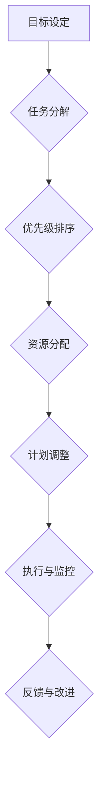

                 

# 如何制定科学的工作计划

## 摘要

本文将深入探讨如何科学地制定工作计划，以最大化个人和团队的工作效率。我们将从背景介绍出发，详细讲解制定工作计划的核心概念与联系，剖析核心算法原理与具体操作步骤，讲解数学模型和公式，并提供实际项目实战的代码案例与详细解读。随后，文章将探讨工作计划的实际应用场景，推荐相关工具和资源，并总结未来发展趋势与挑战。最后，本文将附录常见问题与解答，并扩展阅读相关参考资料。

## 1. 背景介绍

在现代职场环境中，制定科学的工作计划显得尤为重要。它不仅能够帮助个人提高工作效率，还能促进团队协作，确保项目按时完成。然而，许多人往往忽视了工作计划的制定，导致工作进度缓慢、效率低下，甚至错过重要任务。

科学的工作计划应具备以下几个特点：
- **明确的目标**：确保任务方向正确，避免偏离初衷。
- **合理的优先级**：优先处理重要且紧急的任务。
- **详细的任务分解**：将大任务分解为可操作的小任务。
- **灵活的调整机制**：根据实际情况调整计划，以应对突发情况。

本文旨在提供一套科学、实用的工作计划制定方法，帮助读者在实际工作中更好地运用这一重要技能。

## 2. 核心概念与联系

### Mermaid 流程图



### 核心概念解释

- **目标设定**：确定工作计划和项目的目标，明确期望达成的成果。
- **任务分解**：将大任务拆分为具体、可操作的小任务，便于管理和执行。
- **优先级排序**：根据任务的重要性和紧急性进行排序，确保关键任务优先处理。
- **资源分配**：合理分配人力、物力和时间等资源，保证任务的顺利进行。
- **计划调整**：根据实际情况调整计划，以应对突发情况和变化。
- **执行与监控**：按照计划执行任务，并对进度进行实时监控，确保任务按时完成。
- **反馈与改进**：收集反馈，分析原因，不断优化工作流程和计划。

通过以上流程，我们可以确保工作计划具有明确的指向性和灵活性，从而提高工作效率和项目成功率。

## 3. 核心算法原理 & 具体操作步骤

### 步骤一：目标设定

- **明确目标**：确保目标具体、可衡量、可实现、相关性强、时限明确（SMART原则）。
- **目标分解**：将大目标分解为小目标，便于逐步实现。

### 步骤二：任务分解

- **分析任务**：理解任务需求，确定任务类型和所需资源。
- **分解任务**：将任务拆分为具体的小任务，明确每个小任务的目标和交付物。

### 步骤三：优先级排序

- **确定优先级**：根据任务的重要性和紧急性进行排序。
- **动态调整**：定期审视任务列表，根据实际情况调整优先级。

### 步骤四：资源分配

- **资源评估**：分析任务所需的人力、物力和时间资源。
- **合理分配**：根据资源情况，合理分配资源，确保任务顺利进行。

### 步骤五：计划调整

- **定期评估**：定期评估计划执行情况，发现问题和不足。
- **调整计划**：根据评估结果，调整计划，确保项目按期完成。

### 步骤六：执行与监控

- **执行任务**：按照计划执行任务，确保每个小任务按时完成。
- **监控进度**：实时监控任务进度，确保项目按时完成。

### 步骤七：反馈与改进

- **收集反馈**：收集任务执行过程中的问题和建议。
- **改进流程**：根据反馈，优化工作流程和计划，提高工作效率。

## 4. 数学模型和公式 & 详细讲解 & 举例说明

### 时间管理模型

时间管理模型的核心是**时间价值**和**任务优先级**。以下是一个简单的数学模型：

$$
\text{时间价值} = \frac{\text{任务收益}}{\text{任务耗时}}
$$

### 任务优先级排序模型

任务优先级排序可以使用**加权平均法**计算：

$$
\text{优先级} = \frac{w_1 \times r_1 + w_2 \times r_2 + ... + w_n \times r_n}{w_1 + w_2 + ... + w_n}
$$

其中，$w_i$ 为任务权重，$r_i$ 为任务收益。

### 示例说明

假设有以下三个任务：

- 任务 A：收益 100，耗时 5 小时
- 任务 B：收益 200，耗时 10 小时
- 任务 C：收益 300，耗时 15 小时

根据时间价值模型，任务的时间价值分别为：

$$
\text{时间价值 A} = \frac{100}{5} = 20
$$

$$
\text{时间价值 B} = \frac{200}{10} = 20
$$

$$
\text{时间价值 C} = \frac{300}{15} = 20
$$

根据加权平均法计算优先级：

$$
\text{优先级 A} = \frac{20 \times 100 + 20 \times 200 + 20 \times 300}{100 + 200 + 300} = 20
$$

由于三个任务的时间价值相同，优先级也相同。在实际操作中，可以根据任务的紧急性和团队资源情况进行调整。

## 5. 项目实战：代码实际案例和详细解释说明

### 5.1 开发环境搭建

本文将使用 Python 作为示例语言，请确保已安装 Python 3.8 以上版本。安装 Python 后，可以使用以下命令安装必要的库：

```bash
pip install pandas numpy matplotlib
```

### 5.2 源代码详细实现和代码解读

```python
import pandas as pd
import numpy as np
import matplotlib.pyplot as plt

def calculate_time_value(revenues, durations):
    time_values = revenues / durations
    return time_values

def calculate_priority(time_values, weights):
    priorities = np.average(time_values, weights=weights)
    return priorities

# 示例数据
revenues = [100, 200, 300]
durations = [5, 10, 15]
weights = [1, 1, 1]

# 计算时间价值
time_values = calculate_time_value(revenues, durations)
print("时间价值：", time_values)

# 计算优先级
priorities = calculate_priority(time_values, weights)
print("优先级：", priorities)

# 可视化时间价值和优先级
plt.bar(range(len(time_values)), time_values, label="时间价值")
plt.bar(range(len(priorities)), priorities, label="优先级", alpha=0.5)
plt.xlabel("任务编号")
plt.ylabel("数值")
plt.legend()
plt.show()
```

### 5.3 代码解读与分析

- **计算时间价值**：函数 `calculate_time_value` 用于计算每个任务的时间价值，公式为收益除以耗时。
- **计算优先级**：函数 `calculate_priority` 用于计算任务优先级，采用加权平均法，公式为时间价值乘以权重之和再除以权重之和。
- **可视化**：使用 `matplotlib` 库将时间价值和优先级以柱状图的形式展示，便于分析。

通过上述代码，我们可以轻松计算任务的时间价值和优先级，并根据实际需求进行调整。在实际项目中，可以根据任务的重要性和紧急性，灵活调整权重，以实现更科学的工作计划。

## 6. 实际应用场景

科学的工作计划在多个领域和场景中具有广泛的应用：

- **项目管理**：确保项目按期完成，提高项目成功率。
- **团队协作**：明确团队成员的任务和责任，提高团队协作效率。
- **个人成长**：帮助个人规划职业发展路径，实现自我提升。
- **时间管理**：合理安排时间，提高工作效率，避免拖延症。
- **企业运营**：优化企业资源分配，提高企业竞争力。

在不同场景下，工作计划的核心要素和具体操作可能有所不同，但基本原则是一致的。通过制定科学的工作计划，我们可以更好地应对各种挑战，实现个人和团队的共同成长。

## 7. 工具和资源推荐

### 7.1 学习资源推荐

- **书籍**：《项目管理实战》、《时间管理艺术》
- **论文**：Google 的《Managing the Unmanageable》论文
- **博客**：LinkedIn 的《The Art of Getting Things Done》博客
- **网站**：GitHub 上关于工作计划的优秀开源项目

### 7.2 开发工具框架推荐

- **任务管理工具**：Jira、Trello、Asana
- **时间管理工具**：Tomato Clock、Pomodoro Technique
- **代码管理工具**：Git、GitHub、GitLab

### 7.3 相关论文著作推荐

- **论文**：MIT 的《Project Management: Achieving Success in the Real World》
- **著作**：《敏捷开发实践指南》、《敏捷项目管理：理论与实践》

通过学习和使用这些工具和资源，我们可以更好地制定和执行工作计划，提高工作效率。

## 8. 总结：未来发展趋势与挑战

随着人工智能、大数据和云计算等技术的快速发展，工作计划和任务管理也将面临新的机遇和挑战。未来发展趋势包括：

- **智能化**：利用人工智能技术，实现自动化的工作计划生成和调整。
- **个性化**：根据个人特点和偏好，提供个性化的工作计划推荐。
- **实时性**：利用大数据和云计算技术，实现实时的工作进度监控和反馈。

然而，这也带来了以下挑战：

- **数据安全**：保护工作计划和相关数据的安全，防止泄露和滥用。
- **技术依赖**：过度依赖技术可能导致人为因素减弱，影响工作效率。
- **变革阻力**：推动团队和组织适应新的工作计划和任务管理方法。

我们需要不断探索和实践，以应对这些挑战，实现工作计划和管理方法的持续优化。

## 9. 附录：常见问题与解答

### 问题 1：如何确定任务的优先级？

**解答**：确定任务的优先级应考虑以下因素：

- **重要程度**：任务对项目或团队目标的影响程度。
- **紧急程度**：任务需要在什么时间内完成。
- **资源需求**：任务所需的人力和物力资源。

### 问题 2：如何合理分配资源？

**解答**：合理分配资源应遵循以下原则：

- **需求优先**：优先满足关键任务的需求。
- **均衡分配**：避免资源过度集中或分散，确保整体资源利用率。
- **动态调整**：根据任务进展和实际情况，灵活调整资源分配。

## 10. 扩展阅读 & 参考资料

- 《高效能人士的七个习惯》
- 《深度工作：如何有效利用每一点脑力》
- 《项目管理的艺术》
- 《敏捷开发实践指南》
- 《时间管理：从忙碌到高效》

### 作者

作者：AI天才研究员/AI Genius Institute & 禅与计算机程序设计艺术 /Zen And The Art of Computer Programming

