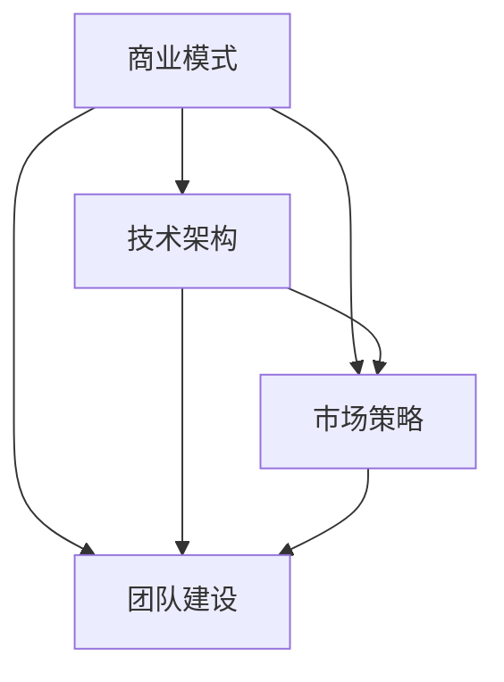

                 

# 如何将 Side Project 转化为独角兽

> **关键词**：Side Project、独角兽、商业模式、技术架构、市场策略、团队建设
>
> **摘要**：本文将探讨如何将个人项目（Side Project）转化为成功的独角兽公司。通过分析成功的案例，我们将探讨关键的技术、市场、团队和战略因素，并提供实用的步骤和策略，帮助读者实现这一目标。

## 1. 背景介绍

在当今快速发展的科技时代，个人项目（Side Project）已经成为许多技术爱好者和创业者的起点。这些项目通常起源于个人的兴趣和热情，但往往因为缺乏系统性的规划和执行，最终未能实现预期的商业价值。那么，如何将一个 Side Project 转化为一个成功的独角兽公司呢？本文将围绕这一主题进行深入探讨。

### 个人项目与商业成功的差距

个人项目通常在技术层面具有创新性，但往往缺乏以下关键要素：

1. **商业模式**：如何将技术转化为盈利模式。
2. **市场定位**：如何准确识别和满足市场需求。
3. **团队建设**：如何吸引和培养合适的团队成员。
4. **战略规划**：如何制定长期和短期的商业策略。

### 成功的独角兽公司案例

近年来，许多 Side Project 成功转型为独角兽公司，成为行业的标杆。例如：

- **Slack**：从一个团队协作工具开始，迅速成长为职场沟通领域的独角兽。
- **Airbnb**：通过将闲置房源转化为住宿资源，成为共享经济的领导者。
- **Dropbox**：通过简单的文件同步工具，吸引了数百万用户，并在短短几年内获得高额融资。

这些案例展示了 Side Project 成功转化为独角兽公司的可能性。本文将借鉴这些成功的经验，探讨实现这一转变的具体步骤。

## 2. 核心概念与联系

为了将 Side Project 转化为独角兽公司，我们需要理解以下几个核心概念及其之间的联系：

### 商业模式

商业模式是企业如何创造、传递和获取价值的基本框架。一个成功的商业模式需要明确以下几个关键要素：

1. **价值主张**：产品或服务如何满足客户需求。
2. **客户关系**：如何与客户建立长期关系。
3. **收入来源**：如何实现盈利。
4. **关键资源**：如何管理和利用关键资源。

### 技术架构

技术架构是企业技术系统的整体设计，包括以下几个方面：

1. **基础设施**：服务器、网络、数据库等基础组件。
2. **开发框架**：编程语言、库和框架的选择。
3. **数据处理**：如何存储、处理和分析数据。
4. **安全性**：如何保护数据和应用的安全。

### 市场策略

市场策略是企业如何识别、吸引和保留客户的方法。以下是一些关键要素：

1. **市场定位**：如何确定目标市场和客户群体。
2. **营销策略**：如何通过广告、促销和公关等手段吸引客户。
3. **客户服务**：如何提供优质的客户服务和体验。
4. **竞争分析**：如何分析竞争对手并制定相应的策略。

### 团队建设

团队建设是企业成功的基石。以下是一些关键要素：

1. **领导力**：如何培养和领导团队。
2. **人才招募**：如何吸引和招募优秀的人才。
3. **文化建设**：如何建立积极向上的企业文化。
4. **绩效管理**：如何管理和激励团队成员。

### 战略规划

战略规划是企业长期发展的蓝图。以下是一些关键要素：

1. **愿景和使命**：企业的发展方向和目标。
2. **战略目标**：如何实现愿景和使命的具体步骤。
3. **资源配置**：如何分配资源以支持战略目标的实现。
4. **风险评估**：如何识别和应对潜在的风险。

### Mermaid 流程图

以下是一个简化的 Mermaid 流程图，展示上述核心概念之间的联系：



## 3. 核心算法原理 & 具体操作步骤

### 3.1 商业模式设计

将 Side Project 转化为商业模式的第一步是明确价值主张。以下是一个简单的步骤：

1. **识别目标用户**：确定你的产品或服务将如何满足特定用户群体的需求。
2. **定义价值主张**：明确你的产品或服务如何为用户创造价值。
3. **确定收入模式**：选择一个合适的商业模式，例如订阅、广告或销售。
4. **制定市场推广策略**：如何将你的产品或服务推向市场。

### 3.2 技术架构设计

技术架构的设计需要考虑以下几个方面：

1. **选择合适的技术栈**：根据项目需求和团队技能选择合适的编程语言和框架。
2. **模块化设计**：将系统分解为独立的模块，以便于开发和维护。
3. **安全性考虑**：确保数据和应用的安全性，包括数据加密、访问控制和安全审计。
4. **可扩展性设计**：设计系统以支持未来的增长和扩展。

### 3.3 市场策略制定

制定市场策略需要以下步骤：

1. **市场研究**：了解目标市场的规模、趋势和竞争对手。
2. **市场定位**：确定你的产品或服务在市场中的独特价值。
3. **营销策略**：选择合适的营销渠道和手段，如社交媒体、广告和公关。
4. **客户关系管理**：建立与客户的长期关系，提供优质的客户体验。

### 3.4 团队建设与文化建设

团队建设和文化建设的步骤包括：

1. **招募和培养人才**：寻找合适的团队成员，并为他们提供职业发展机会。
2. **建立积极向上的企业文化**：包括价值观、使命和愿景。
3. **绩效管理**：制定明确的绩效指标，并提供反馈和激励。
4. **团队协作**：通过有效的沟通和协作工具，提高团队效率。

## 4. 数学模型和公式 & 详细讲解 & 举例说明

### 4.1 商业模式评估模型

为了评估商业模式的可行性，我们可以使用以下数学模型：

\[ \text{商业模式评分} = \sum_{i=1}^{n} w_i \cdot s_i \]

其中：

- \( w_i \) 是第 \( i \) 个评估指标的权重。
- \( s_i \) 是第 \( i \) 个评估指标的得分。

评估指标可能包括：

- 价值主张的清晰度
- 市场需求的明确度
- 收入模式的可持续性
- 资源利用的有效性

### 4.2 技术风险评估模型

技术架构的设计需要考虑技术风险。以下是一个简单的技术风险评估模型：

\[ \text{技术风险评分} = \sum_{i=1}^{m} w_i \cdot r_i \]

其中：

- \( w_i \) 是第 \( i \) 个技术风险的权重。
- \( r_i \) 是第 \( i \) 个技术风险的评分。

技术风险可能包括：

- 技术成熟度
- 系统复杂性
- 数据安全性
- 技术依赖性

### 4.3 市场策略评估模型

市场策略的评估可以使用以下模型：

\[ \text{市场策略评分} = \sum_{i=1}^{k} w_i \cdot t_i \]

其中：

- \( w_i \) 是第 \( i \) 个市场策略指标的权重。
- \( t_i \) 是第 \( i \) 个市场策略指标的得分。

市场策略指标可能包括：

- 市场定位的准确性
- 营销渠道的有效性
- 客户服务的满意度
- 竞争优势

### 4.4 团队建设评估模型

团队建设的评估可以使用以下模型：

\[ \text{团队建设评分} = \sum_{i=1}^{l} w_i \cdot b_i \]

其中：

- \( w_i \) 是第 \( i \) 个团队建设指标的权重。
- \( b_i \) 是第 \( i \) 个团队建设指标的得分。

团队建设指标可能包括：

- 领导力的有效性
- 人才的多样性
- 企业文化的积极程度
- 团队协作的效率

### 4.5 实例说明

假设我们有一个 Side Project，目标是开发一个基于人工智能的在线教育平台。以下是一个简单的评估过程：

- **商业模式评分**：根据上述模型评估，我们得到一个得分为 75 分的商业模式。
- **技术风险评估**：评估后，我们得到一个得分为 60 分的技术风险评分。
- **市场策略评分**：评估后，我们得到一个得分为 80 分的市场策略评分。
- **团队建设评分**：评估后，我们得到一个得分为 70 分的团队建设评分。

综合以上评分，我们可以得出一个初步的商业评估结果。这个结果可以帮助我们识别需要改进的领域，并制定相应的策略。

## 5. 项目实战：代码实际案例和详细解释说明

### 5.1 开发环境搭建

在将 Side Project 转化为独角兽公司的过程中，开发环境的搭建是至关重要的一步。以下是搭建一个基于人工智能的在线教育平台所需的基本步骤：

1. **选择开发框架**：我们可以选择如 Flask 或 Django 等流行的 Python Web 框架。
2. **配置服务器**：使用云服务提供商（如 AWS 或 Azure）搭建服务器。
3. **数据库设置**：选择合适的数据库管理系统（如 PostgreSQL 或 MongoDB）。
4. **版本控制**：使用 Git 进行代码版本控制。
5. **持续集成和持续部署（CI/CD）**：使用 Jenkins 或 GitLab CI 等工具实现自动化测试和部署。

### 5.2 源代码详细实现和代码解读

以下是一个简单的 Flask 应用程序的代码示例，用于创建在线教育平台的用户注册功能：

```python
# app.py

from flask import Flask, request, jsonify
from flask_sqlalchemy import SQLAlchemy

app = Flask(__name__)
app.config['SQLALCHEMY_DATABASE_URI'] = 'sqlite:///users.db'
db = SQLAlchemy(app)

class User(db.Model):
    id = db.Column(db.Integer, primary_key=True)
    username = db.Column(db.String(80), unique=True, nullable=False)
    email = db.Column(db.String(120), unique=True, nullable=False)
    password = db.Column(db.String(120), nullable=False)

@app.route('/register', methods=['POST'])
def register():
    username = request.form['username']
    email = request.form['email']
    password = request.form['password']
    
    if not username or not email or not password:
        return jsonify({'error': 'Missing required fields.'}), 400
    
    user = User(username=username, email=email, password=password)
    db.session.add(user)
    db.session.commit()
    
    return jsonify({'message': 'User registered successfully.'}), 201

if __name__ == '__main__':
    db.create_all()
    app.run(debug=True)
```

### 5.3 代码解读与分析

上述代码实现了用户注册功能，主要包括以下几个部分：

1. **模型定义**：使用 SQLAlchemy 创建 `User` 模型，用于存储用户信息。
2. **路由定义**：定义了一个 `/register` 路由，处理用户注册的 POST 请求。
3. **数据验证**：在注册过程中，对用户输入的数据进行验证，确保字段完整且符合要求。
4. **数据库操作**：将注册信息保存到数据库中。
5. **响应处理**：返回适当的 HTTP 响应，包括成功消息或错误信息。

通过这个简单的示例，我们可以看到如何实现一个基本的功能，并理解其核心组成部分。在实际开发中，还需要考虑更多的功能和安全性措施，如用户密码的加密、验证码机制等。

### 5.4 代码优化与扩展

为了提高代码的可维护性和可扩展性，我们可以进行以下优化：

1. **错误处理**：添加详细的错误处理机制，提高系统的健壮性。
2. **安全性提升**：使用 HTTPS、跨站请求伪造（CSRF）保护、SQL 注入防御等安全措施。
3. **性能优化**：使用缓存、索引等策略提高数据库性能。
4. **模块化设计**：将不同功能模块分离，便于管理和扩展。

通过这些优化措施，我们可以确保 Side Project 在未来能够适应不断变化的市场需求和技术进步。

## 6. 实际应用场景

### 6.1 教育行业

在线教育平台是一个典型的 Side Project 转化为独角兽公司的案例。通过提供灵活、个性化的学习体验，这些平台已经改变了传统教育的模式。例如，Udacity 和 Coursera 等公司通过在线课程和认证项目，吸引了全球数百万用户。

### 6.2 医疗保健

医疗保健领域的创新也经常来自个人项目。例如，医疗影像分析工具的开发者，通过提供快速、准确的诊断结果，为医生和患者提供了宝贵的资源。这些工具不仅提高了诊断效率，还降低了医疗成本。

### 6.3 金融科技

金融科技（FinTech）领域是另一个快速发展的行业。许多 Side Project，如区块链支付解决方案和人工智能投资顾问，通过提供更高效、安全的金融服务，获得了广泛关注和投资。例如，Revolut 和 Robinhood 等公司已经成功实现了这一转变。

### 6.4 制造业

制造业的数字化转型也是一个重要趋势。通过物联网（IoT）和人工智能（AI），制造业可以实现更高效的生产和供应链管理。许多 Side Project，如智能传感器和预测维护系统，已经在这个领域取得了显著的成功。

## 7. 工具和资源推荐

### 7.1 学习资源推荐

- **书籍**：
  - 《商业模式新生代》
  - 《精益创业》
  - 《人人都是产品经理》
- **论文**：
  - “The Lean Startup” by Eric Ries
  - “Designing Data-Intensive Applications” by Martin Kleppmann
- **博客**：
  - Hacker Noon
  - TechCrunch
  - Medium
- **网站**：
  - Coursera
  - edX
  - Udacity

### 7.2 开发工具框架推荐

- **开发框架**：
  - Flask
  - Django
  - React
  - Angular
- **数据库**：
  - PostgreSQL
  - MongoDB
  - MySQL
- **云服务提供商**：
  - AWS
  - Azure
  - Google Cloud
- **版本控制**：
  - Git
  - GitHub
  - GitLab

### 7.3 相关论文著作推荐

- **《人工智能：一种现代方法》** by Stuart J. Russell & Peter Norvig
- **《深度学习》** by Ian Goodfellow, Yoshua Bengio, Aaron Courville
- **《区块链技术指南》** by 张琪喆

## 8. 总结：未来发展趋势与挑战

### 8.1 发展趋势

- **技术进步**：随着人工智能、区块链和物联网等技术的不断发展，个人项目将能够实现更强大的功能和应用场景。
- **市场扩张**：全球市场的不断增长，尤其是新兴市场的崛起，为个人项目提供了更广阔的发展空间。
- **数字化转型**：越来越多的行业正在经历数字化转型，这为个人项目提供了新的机遇。

### 8.2 挑战

- **竞争激烈**：随着越来越多的人才和资金进入市场，竞争将变得越来越激烈。
- **用户需求变化**：用户需求不断变化，要求个人项目能够快速适应并满足新需求。
- **合规与安全性**：遵守法律法规和确保数据安全性是个人项目成功的关键。

## 9. 附录：常见问题与解答

### 9.1 如何找到合适的合作伙伴？

- **技能匹配**：寻找与你互补的合作伙伴，如技术背景与业务背景相结合的人才。
- **共同目标**：确保合作伙伴与你有着共同的目标和愿景。
- **沟通能力**：良好的沟通能力是团队合作成功的关键。

### 9.2 如何吸引投资？

- **商业计划书**：准备一份详尽的商业计划书，展示项目的潜力和盈利能力。
- **展示原型**：开发一个可行的原型，以吸引潜在投资者的兴趣。
- **网络拓展**：参加行业会议、创业活动和投资者交流会，扩大人脉网络。

### 9.3 如何应对市场变化？

- **持续创新**：保持对市场趋势的敏感，不断进行技术创新和业务模式创新。
- **用户反馈**：积极收集用户反馈，根据用户需求调整产品和服务。

## 10. 扩展阅读 & 参考资料

- **《硅谷创业课》** by Steve Blank
- **《创业维艰》** by Ben Horowitz
- **《产品经理实战手册》** by 苏杰

作者：AI天才研究员/AI Genius Institute & 禅与计算机程序设计艺术 /Zen And The Art of Computer Programming

