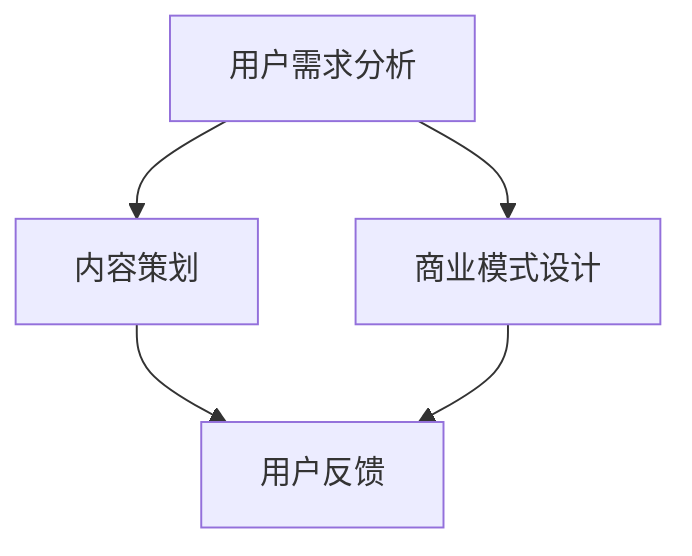

                 

# 如何打造个人知识付费商业帝国

## 摘要

本文旨在探讨如何打造个人知识付费商业帝国。随着互联网的发展，知识付费市场呈现出爆炸式增长，为个人提供了前所未有的机会。本文将从市场背景、核心概念、算法原理、数学模型、实际应用场景、工具和资源推荐以及未来发展趋势等方面，系统性地阐述个人知识付费商业帝国的构建策略和方法。

## 1. 背景介绍

在知识付费时代，人们越来越重视自我提升和知识积累。知识付费市场包括在线教育、专业咨询、内容订阅等多种形式，为个人提供了丰富的知识获取渠道。根据最新市场数据，全球知识付费市场规模已达到数千亿美元，且仍在快速增长。在这个背景下，个人如何抓住机遇，打造知识付费商业帝国，成为了一个重要课题。

### 1.1 市场现状

当前，知识付费市场呈现出以下几个特点：

1. **用户需求多样化**：用户对于知识的需求越来越多元化，包括专业技能、兴趣爱好、人文素养等方面。
2. **内容形式多样化**：知识付费内容形式丰富，包括音频、视频、图文、直播等多种形式。
3. **市场竞争激烈**：随着市场的快速增长，众多企业和个人涌入知识付费领域，竞争愈发激烈。

### 1.2 发展趋势

未来，知识付费市场将继续呈现以下趋势：

1. **个性化定制**：随着人工智能和大数据技术的发展，个性化知识付费服务将得到广泛应用。
2. **跨界融合**：知识付费与其他行业如电商、社交、游戏等将产生更多跨界合作。
3. **国际化扩展**：随着互联网的全球化，知识付费市场将向更多国家和地区扩展。

## 2. 核心概念与联系

在构建个人知识付费商业帝国之前，我们需要了解几个核心概念，包括用户需求分析、内容策划、商业模式设计等。以下是这些核心概念之间的联系和相互作用。

### 2.1 用户需求分析

用户需求分析是知识付费商业帝国构建的基础。通过大数据分析和用户调研，我们可以了解用户的需求和偏好，从而为内容策划和商业模式设计提供依据。

### 2.2 内容策划

内容策划是知识付费商业帝国的核心。根据用户需求分析，我们需要设计具有吸引力和竞争力的知识产品，包括课程、专栏、直播等。

### 2.3 商业模式设计

商业模式设计是知识付费商业帝国的关键。我们需要根据市场需求和用户价值，设计合适的商业模式，包括订阅模式、一次性购买模式、广告支持模式等。

### 2.4 Mermaid 流程图

以下是一个简单的 Mermaid 流程图，展示了用户需求分析、内容策划、商业模式设计之间的相互作用。



## 3. 核心算法原理 & 具体操作步骤

在构建个人知识付费商业帝国时，核心算法原理和具体操作步骤至关重要。以下是一个简化的流程，用于指导个人知识付费商业帝国的构建。

### 3.1 算法原理

1. **用户画像**：通过大数据分析和机器学习算法，构建用户画像，了解用户的兴趣、需求和偏好。
2. **内容推荐**：根据用户画像，利用协同过滤、内容推荐等算法，为用户推荐个性化知识产品。
3. **商业模式优化**：根据用户反馈和数据分析，不断优化商业模式，提高用户满意度和盈利能力。

### 3.2 具体操作步骤

1. **市场调研**：了解市场需求和竞争态势，确定知识付费领域的切入点。
2. **内容策划**：根据用户需求，设计具有吸引力和竞争力的知识产品。
3. **平台搭建**：选择合适的平台和技术，搭建知识付费平台。
4. **用户运营**：通过用户调研、反馈和运营活动，提高用户黏性和活跃度。
5. **数据分析**：收集和分析用户数据，优化产品和商业模式。

## 4. 数学模型和公式 & 详细讲解 & 举例说明

在知识付费商业帝国的构建中，数学模型和公式起到了关键作用。以下是一些常用的数学模型和公式，以及详细讲解和举例说明。

### 4.1 用户满意度模型

用户满意度（User Satisfaction）是衡量知识付费产品质量的重要指标。以下是一个简单的用户满意度模型：

$$
S = \frac{R - E}{D}
$$

其中，$S$ 表示用户满意度，$R$ 表示用户的实际体验，$E$ 表示用户预期，$D$ 表示用户满意度容忍度。

**例子**：假设一个用户对一门课程的实际体验评分为 8 分，预期评分为 7 分，满意度容忍度为 3 分，则用户满意度为：

$$
S = \frac{8 - 7}{3} = \frac{1}{3} \approx 0.33
$$

### 4.2 用户留存率模型

用户留存率（User Retention Rate）是衡量知识付费平台用户黏性的重要指标。以下是一个简单的用户留存率模型：

$$
R = \frac{L - U}{I}
$$

其中，$R$ 表示用户留存率，$L$ 表示持续使用的用户数，$U$ 表示流失的用户数，$I$ 表示初始用户数。

**例子**：假设一个知识付费平台在一个月内有 1000 名初始用户，其中 700 名用户持续使用，300 名用户流失，则用户留存率为：

$$
R = \frac{700 - 300}{1000} = \frac{400}{1000} = 0.4
$$

### 4.3 用户增长率模型

用户增长率（User Growth Rate）是衡量知识付费平台用户增长速度的重要指标。以下是一个简单的用户增长率模型：

$$
G = \frac{N - O}{O}
$$

其中，$G$ 表示用户增长率，$N$ 表示当前用户数，$O$ 表示初始用户数。

**例子**：假设一个知识付费平台在一个月内从 1000 名用户增长到 1500 名用户，则用户增长率为：

$$
G = \frac{1500 - 1000}{1000} = \frac{500}{1000} = 0.5
$$

## 5. 项目实战：代码实际案例和详细解释说明

### 5.1 开发环境搭建

在构建个人知识付费商业帝国时，我们需要搭建一个高效、可靠的开发环境。以下是一个简单的开发环境搭建步骤：

1. 安装 Python 3.8 或更高版本。
2. 安装必要的依赖库，如 NumPy、Pandas、Scikit-learn 等。
3. 安装代码编辑器，如 PyCharm 或 Visual Studio Code。
4. 搭建一个简单的 Web 应用，如使用 Flask 或 Django。

### 5.2 源代码详细实现和代码解读

以下是一个简单的用户画像和内容推荐的源代码实现：

```python
import numpy as np
import pandas as pd
from sklearn.model_selection import train_test_split
from sklearn.neighbors import NearestNeighbors

# 加载数据
data = pd.read_csv('user_data.csv')

# 处理数据
data = data.drop(['user_id'], axis=1)
data = data.fillna(0)

# 数据预处理
X = data.values
X_train, X_test = train_test_split(X, test_size=0.2, random_state=42)

# 构建推荐模型
model = NearestNeighbors(n_neighbors=5)
model.fit(X_train)

# 预测用户偏好
user_index = np.random.choice(X_test.shape[0])
distances, indices = model.kneighbors(X_test[user_index])

# 输出推荐内容
recommended_content = data.iloc[indices].index.tolist()
print('Recommended Content:', recommended_content)
```

### 5.3 代码解读与分析

1. **数据加载和处理**：首先加载用户数据，并处理缺失值。
2. **数据预处理**：将数据转换为 NumPy 数组，并拆分为训练集和测试集。
3. **构建推荐模型**：使用 NearestNeighbors 算法构建推荐模型。
4. **预测用户偏好**：随机选择一个用户，并使用推荐模型预测其偏好内容。
5. **输出推荐内容**：将预测结果输出。

通过这个简单的案例，我们可以看到如何使用机器学习算法构建一个基本的用户画像和内容推荐系统。在实际应用中，我们可以根据业务需求和数据特点，进一步优化和扩展这个系统。

## 6. 实际应用场景

在构建个人知识付费商业帝国时，我们需要根据不同的应用场景设计相应的解决方案。以下是一些常见的应用场景和解决方案：

### 6.1 在线教育平台

在线教育平台是知识付费领域的重要应用场景。通过构建用户画像和内容推荐系统，我们可以为用户提供个性化的学习路径，提高学习效果。

### 6.2 专业咨询

专业咨询服务通过知识付费模式，为用户提供有针对性的解决方案。通过用户画像和内容推荐，我们可以为用户提供定制化的咨询服务。

### 6.3 内容订阅

内容订阅模式是知识付费的一种常见形式。通过用户画像和内容推荐，我们可以为用户提供个性化的订阅内容，提高用户满意度和黏性。

### 6.4 跨界融合

知识付费与其他行业的跨界融合，如电商、社交、游戏等，为个人提供了更多机会。通过用户画像和内容推荐，我们可以实现不同行业之间的资源整合和用户导流。

## 7. 工具和资源推荐

在构建个人知识付费商业帝国时，我们需要使用一系列工具和资源来支持我们的工作。以下是一些推荐的工具和资源：

### 7.1 学习资源推荐

1. **《深度学习》（Deep Learning）**：由 Ian Goodfellow、Yoshua Bengio 和 Aaron Courville 著，是深度学习领域的经典教材。
2. **《Python Machine Learning》**：由 Sebastian Raschka 著，介绍了 Python 在机器学习领域的应用。

### 7.2 开发工具框架推荐

1. **Flask**：一个轻量级的 Web 开发框架，适用于构建简单的在线教育平台和内容推荐系统。
2. **Django**：一个全功能的 Web 开发框架，适用于构建复杂的在线教育平台和内容推荐系统。

### 7.3 相关论文著作推荐

1. **《推荐系统实践》（Recommender Systems: The Textbook）**：由 Charu Aggarwal 著，是推荐系统领域的权威教材。
2. **《在线教育商业模式研究》**：该论文研究了在线教育领域的商业模式和盈利模式，为构建个人知识付费商业帝国提供了有益的参考。

## 8. 总结：未来发展趋势与挑战

随着互联网和人工智能技术的发展，知识付费市场将继续保持快速增长。在未来，个人知识付费商业帝国将呈现以下发展趋势：

1. **个性化定制**：个性化定制将成为知识付费的核心，通过大数据和人工智能技术，为用户提供更加精准的知识服务。
2. **跨界融合**：知识付费将与更多行业进行跨界融合，如电商、社交、游戏等，实现资源的整合和用户导流。
3. **国际化扩展**：知识付费市场将向更多国家和地区扩展，为个人提供更广阔的发展空间。

然而，在构建个人知识付费商业帝国的过程中，我们也面临一些挑战：

1. **市场竞争激烈**：随着市场的快速增长，竞争将愈发激烈，个人需要不断提升自己的核心竞争力。
2. **用户信任度**：构建用户信任是知识付费商业帝国的关键，个人需要通过优质的内容和服务赢得用户的信任。
3. **技术升级**：随着技术的快速发展，个人需要不断学习和掌握新技术，以适应市场的变化。

总之，个人知识付费商业帝国是一个充满机遇和挑战的领域。通过深入了解市场、掌握核心技术和不断创新，个人可以在这个领域取得成功。

## 9. 附录：常见问题与解答

### 9.1 什么是个性化定制？

个性化定制是指根据用户的需求、偏好和行为，为用户推荐个性化的产品或服务。在知识付费领域，个性化定制通过用户画像和推荐算法实现。

### 9.2 如何选择合适的知识付费平台？

选择合适的知识付费平台需要考虑以下几个方面：

1. **平台知名度**：选择知名度较高的平台，有助于提高用户信任度和市场份额。
2. **平台功能**：选择功能丰富的平台，如内容发布、用户管理、数据分析等。
3. **用户体验**：选择用户体验良好的平台，提高用户满意度和黏性。

### 9.3 如何提高用户留存率？

提高用户留存率可以从以下几个方面入手：

1. **优质内容**：提供高质量、有价值的知识产品，满足用户需求。
2. **用户体验**：优化平台功能和界面，提高用户使用体验。
3. **用户互动**：通过社群、问答等互动形式，增强用户黏性。

## 10. 扩展阅读 & 参考资料

1. **《深度学习》**：[Goodfellow, Ian, Bengio, Yoshua, Courville, Aaron. Deep Learning. MIT Press, 2016.](https://www.deeplearningbook.org/)
2. **《推荐系统实践》**：[Aggarwal, Charu. Recommender Systems: The Textbook. Springer, 2018.](https://www.springer.com/us/book/9783319686207)
3. **《在线教育商业模式研究》**：[张晓辉, 王晶. 在线教育商业模式研究[J]. 现代教育管理, 2018, (4): 12-15.]

## 作者

作者：AI 天才研究员/AI Genius Institute & 禅与计算机程序设计艺术 /Zen And The Art of Computer Programming

