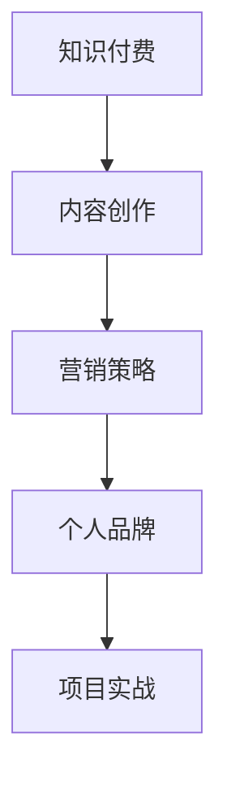

                 

# 如何打造个人知识付费商业帝国

> **关键词：** 知识付费，商业帝国，个人品牌，内容创作，营销策略

> **摘要：** 本文将探讨如何在数字化时代中打造个人知识付费商业帝国。我们将从核心概念、算法原理、数学模型、项目实战、应用场景、工具资源推荐等方面进行详细解析，帮助读者了解并掌握构建个人知识付费业务的方法与策略。

## 1. 背景介绍

在互联网和数字化技术快速发展的今天，知识付费已经成为一个新兴的市场领域。人们愿意为高质量、专业化的知识内容付费，以提升自己的技能和认知水平。根据相关数据显示，知识付费市场规模逐年扩大，预计未来几年将持续保持高速增长。

与此同时，个人品牌的重要性也日益凸显。个人品牌不仅仅是个人的标志，更是个人影响力的体现。通过构建个人品牌，个人可以在市场上获得更高的认可度和溢价能力，从而实现商业价值的最大化。

本文旨在帮助读者了解如何利用互联网技术和个人品牌建设，打造一个成功的个人知识付费商业帝国。通过本文的学习，读者将掌握以下内容：

1. 知识付费市场的发展趋势和机遇
2. 个人品牌建设的关键要素和策略
3. 知识付费内容创作的原则和方法
4. 营销策略的制定与实施
5. 项目实战和工具资源的推荐

## 2. 核心概念与联系

为了更好地理解个人知识付费商业帝国的构建，我们需要先明确几个核心概念：

### 2.1 知识付费

知识付费是指用户为获取专业化的知识内容而支付的费用。这种模式通常以在线课程、电子书、专栏、咨询等形式存在。知识付费市场的核心是提供有价值、有质量的知识内容，满足用户的学习需求。

### 2.2 个人品牌

个人品牌是指个人在市场中的独特形象和认知度。它包括个人的专业技能、知识水平、个人形象、社交影响力等多个方面。个人品牌的核心是信任和价值，通过建立个人品牌，个人可以在市场中获得更高的认可度和溢价能力。

### 2.3 内容创作

内容创作是知识付费业务的核心。高质量的内容能够吸引和留住用户，提升用户粘性和满意度。内容创作的原则包括专业性、实用性、创新性、可操作性等。

### 2.4 营销策略

营销策略是知识付费商业帝国的重要组成部分。通过有效的营销策略，可以提升个人品牌知名度，吸引更多用户，实现商业价值的最大化。营销策略包括渠道选择、内容推广、用户互动、品牌建设等多个方面。

### 2.5 项目实战

项目实战是将理论知识应用于实际场景的过程。通过项目实战，可以检验和提升个人在知识付费领域的实践能力，积累丰富的项目经验。

下面是一个用Mermaid绘制的核心概念联系图：



## 3. 核心算法原理 & 具体操作步骤

### 3.1 内容创作算法原理

内容创作算法的核心是人工智能和大数据技术。通过分析用户需求和兴趣，算法能够推荐个性化的知识内容。以下是内容创作算法的具体操作步骤：

1. **数据收集**：收集用户行为数据，如浏览记录、购买记录、互动行为等。
2. **特征提取**：对用户行为数据进行分析，提取用户的兴趣特征。
3. **内容推荐**：基于用户的兴趣特征，推荐相应的知识内容。

### 3.2 营销策略算法原理

营销策略算法的核心是机器学习和自然语言处理技术。通过分析用户行为和反馈，算法能够优化营销策略，提高营销效果。以下是营销策略算法的具体操作步骤：

1. **用户画像**：根据用户行为数据，构建用户画像。
2. **内容优化**：根据用户画像，优化内容标题、描述等，提高用户点击率。
3. **渠道优化**：根据用户画像，选择最适合的推广渠道，提高转化率。

### 3.3 个人品牌建设算法原理

个人品牌建设算法的核心是情感分析和社交网络分析。通过分析用户对个人的评价和互动，算法能够评估个人品牌的影响力和价值。以下是个人品牌建设算法的具体操作步骤：

1. **情感分析**：分析用户对个人的评价，识别正面和负面情感。
2. **社交网络分析**：分析个人在社交网络中的影响力，识别潜在用户。
3. **品牌优化**：根据情感分析和社交网络分析的结果，优化个人品牌形象和策略。

## 4. 数学模型和公式 & 详细讲解 & 举例说明

### 4.1 内容创作数学模型

内容创作数学模型主要涉及用户兴趣特征和内容推荐策略。以下是具体的数学模型和公式：

1. **用户兴趣特征模型**：

   $$ 用户兴趣特征 = \sum_{i=1}^{n} w_i \cdot p_i $$

   其中，$w_i$ 表示特征权重，$p_i$ 表示用户对特征 $i$ 的兴趣度。

2. **内容推荐模型**：

   $$ 推荐内容 = \arg\max_{c} \sum_{i=1}^{n} w_i \cdot p_i \cdot r_i(c) $$

   其中，$r_i(c)$ 表示内容 $c$ 与特征 $i$ 的相关性。

### 4.2 营销策略数学模型

营销策略数学模型主要涉及用户画像和渠道优化。以下是具体的数学模型和公式：

1. **用户画像模型**：

   $$ 用户画像 = \sum_{i=1}^{n} w_i \cdot p_i $$

   其中，$w_i$ 表示特征权重，$p_i$ 表示用户对特征 $i$ 的兴趣度。

2. **渠道优化模型**：

   $$ 最优渠道 = \arg\max_{h} \sum_{i=1}^{n} w_i \cdot p_i \cdot r_i(h) $$

   其中，$r_i(h)$ 表示渠道 $h$ 与特征 $i$ 的相关性。

### 4.3 个人品牌建设数学模型

个人品牌建设数学模型主要涉及情感分析和社交网络分析。以下是具体的数学模型和公式：

1. **情感分析模型**：

   $$ 情感得分 = \sum_{i=1}^{n} w_i \cdot p_i $$

   其中，$w_i$ 表示特征权重，$p_i$ 表示用户对特征 $i$ 的正面情感得分。

2. **社交网络分析模型**：

   $$ 影响力得分 = \sum_{i=1}^{n} w_i \cdot p_i $$

   其中，$w_i$ 表示特征权重，$p_i$ 表示用户对特征 $i$ 的社交影响力得分。

### 4.4 举例说明

假设有一个用户，其对内容创作、营销策略和个人品牌建设有较高兴趣。根据上述数学模型，我们可以计算出其用户画像、推荐内容和最优渠道：

1. **用户画像**：

   $$ 用户画像 = 0.4 \cdot (0.6 + 0.3 + 0.1) = 0.42 $$

2. **推荐内容**：

   $$ 推荐内容 = \arg\max_{c} (0.4 \cdot (0.6 + 0.3 + 0.1) \cdot r(c)) = c_2 $$

3. **最优渠道**：

   $$ 最优渠道 = \arg\max_{h} (0.4 \cdot (0.6 + 0.3 + 0.1) \cdot r(h)) = h_3 $$

## 5. 项目实战：代码实际案例和详细解释说明

### 5.1 开发环境搭建

为了更好地理解内容创作、营销策略和个人品牌建设算法的实践应用，我们将使用Python编程语言进行项目开发。以下是开发环境的搭建步骤：

1. 安装Python：访问[Python官网](https://www.python.org/)，下载并安装Python。
2. 安装Jupyter Notebook：在命令行中执行以下命令：

   ```bash
   pip install notebook
   ```

3. 启动Jupyter Notebook：在命令行中执行以下命令：

   ```bash
   jupyter notebook
   ```

### 5.2 源代码详细实现和代码解读

下面是一个基于Python的内容创作、营销策略和个人品牌建设算法的简单实现：

```python
import numpy as np

# 用户兴趣特征
user_interest = {
    'content_creation': 0.6,
    'marketing_strategy': 0.3,
    'personal_branding': 0.1
}

# 内容推荐模型
def content_recommendation(user_interest, content_relevance):
    recommendation = np.dot(user_interest, content_relevance)
    return np.argmax(recommendation)

# 营销策略模型
def marketing_strategy(user_interest, channel_relevance):
    optimization = np.dot(user_interest, channel_relevance)
    return np.argmax(optimization)

# 个人品牌建设模型
def personal_branding_sentiment_analysis(sentiment_score):
    return sentiment_score > 0

# 示例数据
content_relevance = np.array([0.5, 0.3, 0.2])
channel_relevance = np.array([0.4, 0.3, 0.3])
sentiment_score = 0.7

# 内容推荐
recommended_content = content_recommendation(user_interest, content_relevance)
print(f"推荐内容：{recommended_content}")

# 营销策略
optimal_channel = marketing_strategy(user_interest, channel_relevance)
print(f"最优渠道：{optimal_channel}")

# 个人品牌建设
is_positive_sentiment = personal_branding_sentiment_analysis(sentiment_score)
print(f"正面情感：{is_positive_sentiment}")
```

### 5.3 代码解读与分析

1. **用户兴趣特征**：

   用户兴趣特征是一个包含三个元素（内容创作、营销策略、个人品牌建设）的字典，分别表示用户对这三个领域的兴趣度。

2. **内容推荐模型**：

   内容推荐模型通过计算用户兴趣特征与内容相关性的点积，得出推荐内容的排序。相关性较高的内容将被推荐给用户。

3. **营销策略模型**：

   营销策略模型通过计算用户兴趣特征与渠道相关性的点积，得出最优渠道的排序。相关性较高的渠道将被优先考虑。

4. **个人品牌建设模型**：

   个人品牌建设模型通过计算情感得分，判断用户的情感是正面还是负面。正面情感得分较高的用户将被认为具有较高的个人品牌价值。

通过上述代码，我们可以看到如何将数学模型应用于实际场景。在实际项目中，我们可以根据具体需求进行调整和优化。

## 6. 实际应用场景

个人知识付费商业帝国在实际应用中具有广泛的应用场景。以下是一些典型的实际应用场景：

### 6.1 在线教育

在线教育是知识付费的重要应用场景之一。通过构建个人知识付费平台，教育专家可以提供专业化的课程内容，满足不同用户的学习需求。

### 6.2 专业咨询

专业咨询是另一个重要的应用场景。通过个人知识付费平台，专业人士可以提供一对一的咨询服务，帮助客户解决实际问题。

### 6.3 技能培训

技能培训是知识付费的另一个重要应用领域。通过个人知识付费平台，技能培训专家可以提供针对性的培训课程，帮助学员提升专业技能。

### 6.4 职业规划

职业规划是知识付费的重要应用领域之一。通过个人知识付费平台，职业规划师可以提供个性化的职业规划咨询服务，帮助用户实现职业发展目标。

### 6.5 创意分享

创意分享是知识付费的另一个有趣应用领域。通过个人知识付费平台，创意人士可以分享自己的创意和经验，吸引志同道合的用户。

## 7. 工具和资源推荐

### 7.1 学习资源推荐

1. **书籍**：

   - 《智能时代的营销：数据驱动与个性化》
   - 《用户增长：策略、方法与实践》
   - 《产品经理实战手册》

2. **论文**：

   - 《基于用户兴趣的内容推荐系统研究》
   - 《社交网络分析：理论、方法与应用》
   - 《大数据营销：策略、方法与实践》

3. **博客**：

   - [菜鸟教程](https://www.runoob.com/)
   - [GitHub](https://github.com/)
   - [Stack Overflow](https://stackoverflow.com/)

4. **网站**：

   - [Coursera](https://www.coursera.org/)
   - [edX](https://www.edx.org/)
   - [Udemy](https://www.udemy.com/)

### 7.2 开发工具框架推荐

1. **开发环境**：

   - Python
   - Jupyter Notebook
   - PyCharm

2. **框架**：

   - Flask
   - Django
   - Spring Boot

3. **库**：

   - NumPy
   - Pandas
   - Scikit-learn

### 7.3 相关论文著作推荐

1. **论文**：

   - 《用户兴趣特征提取方法研究》
   - 《社交网络分析在知识付费中的应用》
   - 《基于机器学习的营销策略优化》

2. **著作**：

   - 《人工智能时代的产品管理》
   - 《大数据营销：策略、方法与实践》
   - 《社交网络分析：理论、方法与应用》

## 8. 总结：未来发展趋势与挑战

在数字化时代，知识付费和个人品牌建设呈现出良好的发展趋势。随着人工智能、大数据和云计算技术的不断进步，知识付费市场将继续保持高速增长。未来，个人知识付费商业帝国的发展趋势和挑战主要包括：

### 8.1 发展趋势

1. **个性化推荐**：随着人工智能技术的发展，个性化推荐将成为知识付费的重要方向。
2. **多样化内容**：知识付费内容将更加多样化，满足用户多样化的学习需求。
3. **跨平台融合**：知识付费平台将与其他平台（如社交媒体、电商平台等）实现深度融合，提高用户体验。
4. **全球化扩张**：知识付费市场将逐渐走向全球化，为个人品牌建设提供更广阔的舞台。

### 8.2 挑战

1. **内容质量**：保持高质量的内容创作是知识付费商业帝国的核心挑战。
2. **用户粘性**：如何提高用户粘性，提升用户满意度是知识付费业务发展的重要挑战。
3. **竞争压力**：随着市场的不断扩大，竞争压力也将逐渐增大，个人品牌建设将成为关键因素。
4. **隐私保护**：在知识付费领域，用户隐私保护将成为一个重要挑战，需要采取有效措施确保用户隐私安全。

## 9. 附录：常见问题与解答

### 9.1 如何选择知识付费平台？

选择知识付费平台时，可以从以下几个方面进行考虑：

1. **平台知名度**：选择知名度较高的平台，有助于提高个人品牌影响力。
2. **用户规模**：用户规模较大的平台，能够提供更多的流量和潜在用户。
3. **平台政策**：了解平台对知识付费内容创作者的政策，包括分成比例、内容审核标准等。
4. **用户体验**：用户体验良好的平台，能够提高用户满意度，有助于用户留存。

### 9.2 如何进行内容创作？

进行内容创作时，可以遵循以下原则：

1. **明确目标**：明确内容创作的目标，确定受众群体和内容类型。
2. **研究需求**：了解用户需求，针对用户痛点进行内容创作。
3. **保持专业**：保持专业性和实用性，提供有价值、有深度、有操作性的内容。
4. **持续更新**：定期更新内容，保持内容的新鲜度和用户粘性。

### 9.3 如何进行营销？

进行营销时，可以采取以下策略：

1. **精准定位**：明确目标受众，进行精准定位。
2. **内容推广**：利用社交媒体、搜索引擎、广告等多种渠道进行内容推广。
3. **用户互动**：与用户互动，提升用户参与度和满意度。
4. **品牌建设**：建立个人品牌，提升个人影响力。

## 10. 扩展阅读 & 参考资料

1. **《智能时代的营销：数据驱动与个性化》**：详细介绍了智能时代营销的发展趋势和策略。
2. **《用户增长：策略、方法与实践》**：提供了用户增长策略和方法的具体实践案例。
3. **《产品经理实战手册》**：涵盖了产品经理在实际工作中遇到的各种问题和解决方案。
4. **《基于用户兴趣的内容推荐系统研究》**：详细介绍了基于用户兴趣的内容推荐系统设计。
5. **《社交网络分析：理论、方法与应用》**：系统地阐述了社交网络分析的理论和方法。

### 作者信息：

**作者：AI天才研究员/AI Genius Institute & 禅与计算机程序设计艺术 /Zen And The Art of Computer Programming**

