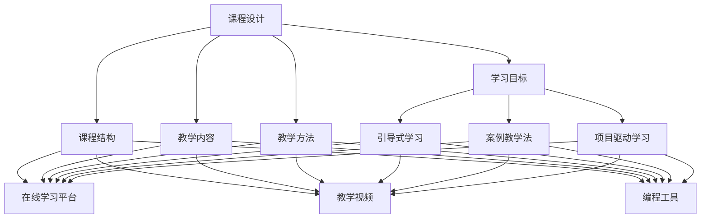
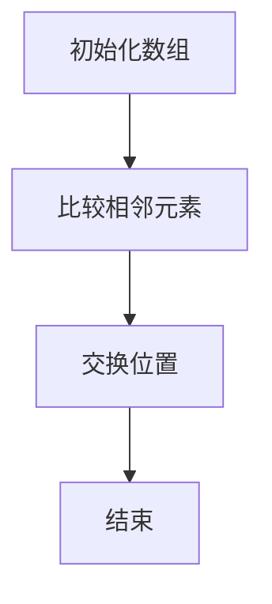

                 

# 如何打造高完成率的程序员知识课程

> **关键词：** 程序员知识课程、课程设计、教学策略、高完成率、教育技术

> **摘要：** 本文深入探讨了如何打造高完成率的程序员知识课程。通过分析课程设计的关键要素、教学策略的应用以及教育技术的助力，为教育和培训从业者提供了一系列实用的指导和方法，旨在提高学习效果和学员的参与度。

## 1. 背景介绍

在当今快速发展的技术时代，编程技能已成为职场中不可或缺的能力。程序员知识课程的设计和实施对于培养下一代技术人才至关重要。然而，如何确保课程的高完成率，使学员能够充分掌握所学知识，是一个需要深入探讨的问题。

### 1.1 课程的重要性

程序员知识课程不仅教授编程语言和工具，更重要的是培养学员的逻辑思维、问题解决能力和创新能力。因此，课程的设计和教学质量直接影响到学员的学习效果和职业发展。

### 1.2 课程现状

目前，许多程序员知识课程存在着教学内容过于理论化、课程结构不合理、教学手段单一等问题，导致学员的学习积极性不高，课程完成率低下。

## 2. 核心概念与联系

为了打造高完成率的程序员知识课程，我们需要关注以下几个核心概念：课程设计、教学策略和教育技术。

### 2.1 课程设计

课程设计是课程成功的基石。一个优秀的课程设计应该包括明确的学习目标、合理的课程结构、丰富的教学内容和多样化的教学方法。

#### 2.1.1 学习目标

学习目标应具体、可测量，并与学员的职业需求相结合。通过设定明确的学习目标，可以帮助学员更好地理解课程的价值和意义。

#### 2.1.2 课程结构

课程结构应合理，遵循从易到难、循序渐进的原则。课程可以分为基础篇、进阶篇和实战篇，使学员能够逐步掌握编程技能。

#### 2.1.3 教学内容

教学内容应涵盖编程语言、框架、工具和最佳实践等，同时注重理论与实践的结合。

#### 2.1.4 教学方法

教学方法应多样化，包括讲授、讨论、实验、项目实践等，以提高学员的参与度和学习效果。

### 2.2 教学策略

教学策略是影响课程完成率的重要因素。以下是一些有效的教学策略：

#### 2.2.1 引导式学习

引导式学习以学员为中心，通过提问和讨论激发学员的思考，帮助其主动构建知识体系。

#### 2.2.2 案例教学法

案例教学法通过实际案例的讲解和分析，使学员更好地理解编程概念和应用场景。

#### 2.2.3 项目驱动学习

项目驱动学习通过实际项目的开发，使学员在实践中掌握编程技能，提高解决问题的能力。

### 2.3 教育技术

教育技术的应用可以显著提升课程的教学效果。以下是一些常用的教育技术：

#### 2.3.1 在线学习平台

在线学习平台提供了丰富的学习资源、互动式学习工具和在线答疑功能，使学员能够随时随地进行学习。

#### 2.3.2 教学视频

教学视频通过生动的演示和讲解，使学员能够更直观地理解编程概念和操作步骤。

#### 2.3.3 编程工具

编程工具如集成开发环境（IDE）和代码编辑器，提供了便捷的编程环境和调试功能，有助于学员进行实践操作。

### 2.4 核心概念原理与架构

下面是一个简化的 Mermaid 流程图，展示了程序员知识课程设计的核心概念和架构：



## 3. 核心算法原理 & 具体操作步骤

在程序员知识课程中，核心算法原理是不可或缺的一部分。以下是一个简单的算法原理示例和具体操作步骤：

### 3.1 算法原理

冒泡排序是一种简单的排序算法，它重复遍历要排序的数列，每次比较两个相邻的元素，如果它们的顺序错误就把它们交换过来。遍历数列的工作是重复地进行直到没有再需要交换，也就是说该数列已经排序完成。

### 3.2 具体操作步骤



#### 3.2.1 初始化数组

初始化一个待排序的数组，例如 `[5, 2, 9, 1, 5]`。

#### 3.2.2 比较相邻元素

从第一个元素开始，依次比较相邻的两个元素。如果第一个元素比第二个元素大，就交换它们的位置。

#### 3.2.3 交换位置

将比较后需要交换位置的元素交换。

#### 3.2.4 结束

重复上述步骤，直到整个数组排序完成。

## 4. 数学模型和公式 & 详细讲解 & 举例说明

在程序员知识课程中，数学模型和公式是理解和应用编程概念的重要工具。以下是一个简单的数学模型示例和详细讲解：

### 4.1 数学模型

线性回归是一种常用的统计模型，用于分析两个或多个变量之间的关系。它通过找到最佳拟合线来预测因变量的值。

### 4.2 公式

线性回归的基本公式为：

$$
y = ax + b
$$

其中，$y$ 是因变量，$x$ 是自变量，$a$ 是斜率，$b$ 是截距。

### 4.3 详细讲解

- **斜率 ($a$)**：斜率表示自变量每增加一个单位，因变量平均增加的单位数。它反映了自变量和因变量之间的关系强度。
- **截距 ($b$)**：截距表示当自变量为 0 时，因变量的值。它反映了模型在自变量轴上的位置。

### 4.4 举例说明

假设我们要分析收入 ($y$) 和工作经验 ($x$) 之间的关系。通过收集数据，我们可以得到以下线性回归模型：

$$
y = 500x + 2000
$$

根据这个模型，如果一个人的工作经验为 5 年，那么他的预计收入为：

$$
y = 500 \times 5 + 2000 = 3500
$$

## 5. 项目实战：代码实际案例和详细解释说明

为了更好地理解程序员知识课程中的理论，我们通过一个实际项目来展示代码实现和详细解释。

### 5.1 开发环境搭建

在开始项目之前，我们需要搭建一个合适的开发环境。以下是一个简单的步骤：

1. 安装 Python 3.8 或更高版本。
2. 安装一个集成开发环境（IDE），如 PyCharm 或 Visual Studio Code。
3. 安装必要的库，如 NumPy 和 Pandas。

### 5.2 源代码详细实现和代码解读

以下是一个简单的 Python 程序，用于实现线性回归模型。

```python
import numpy as np
from sklearn.linear_model import LinearRegression

# 数据
X = np.array([[1], [2], [3], [4], [5]])
y = np.array([1, 2, 2.5, 4, 5])

# 创建线性回归模型
model = LinearRegression()

# 训练模型
model.fit(X, y)

# 预测
predictions = model.predict(X)

# 打印结果
print("斜率：", model.coef_)
print("截距：", model.intercept_)
print("预测值：", predictions)
```

#### 5.2.1 代码解读

- **导入库**：我们首先导入 NumPy 和 Pandas 等库。
- **数据**：我们创建一个简单的数据集，包含自变量 $x$ 和因变量 $y$。
- **创建模型**：我们创建一个线性回归模型。
- **训练模型**：我们使用 `fit` 方法训练模型。
- **预测**：我们使用 `predict` 方法预测自变量的值。
- **打印结果**：我们打印出斜率、截距和预测值。

### 5.3 代码解读与分析

通过这段代码，我们可以看到如何使用 Python 和 scikit-learn 库实现线性回归模型。该程序首先导入必要的库，然后创建一个数据集，并使用线性回归模型进行训练和预测。最后，我们打印出模型的相关参数和预测结果。

## 6. 实际应用场景

程序员知识课程在实际应用场景中发挥着重要作用。以下是一些典型的应用场景：

- **教育领域**：程序员知识课程可以用于大学和职业培训机构的课程教学，帮助学生和职业人士掌握编程技能。
- **企业培训**：企业可以为自己的员工提供定制化的程序员知识课程，以提升员工的技能水平和工作效率。
- **在线教育**：在线程序员知识课程为广大编程爱好者提供了便捷的学习途径，使他们能够随时随地进行学习。

## 7. 工具和资源推荐

为了打造高完成率的程序员知识课程，以下是一些推荐的工具和资源：

### 7.1 学习资源推荐

- **书籍**：  
  - 《算法导论》（Introduction to Algorithms）  
  - 《深度学习》（Deep Learning）  
  - 《编程珠玑》（The Art of Computer Programming）

- **论文**：  
  - 《线性回归算法分析》（An Analysis of the Linear Regression Algorithm）  
  - 《深度学习：理论、算法与应用》（Deep Learning: Theory, Algorithms, and Applications）

- **博客**：  
  - [CSDN](https://www.csdn.net/)  
  - [GitHub](https://github.com/)  
  - [知乎](https://www.zhihu.com/)

### 7.2 开发工具框架推荐

- **开发工具**：  
  - PyCharm  
  - Visual Studio Code

- **框架**：  
  - Flask  
  - Django

### 7.3 相关论文著作推荐

- 《机器学习》（Machine Learning）  
- 《深度学习原理与实践》（Deep Learning: Principles and Practice）

## 8. 总结：未来发展趋势与挑战

随着技术的不断进步，程序员知识课程在未来将面临以下发展趋势和挑战：

- **个性化教育**：随着在线教育的普及，个性化教育将成为主流，学员可以根据自己的需求和进度进行学习。
- **实时反馈**：实时反馈技术可以帮助学员更快地发现问题并解决问题，提高学习效果。
- **跨学科融合**：编程与其他学科的融合将促使程序员知识课程更加综合和多元化。
- **数据隐私和安全**：随着数据隐私和安全问题的日益突出，如何保护学员的数据安全将成为一大挑战。

## 9. 附录：常见问题与解答

### 9.1 课程设计常见问题

**Q：如何设定合理的学习目标？**  
**A：设定学习目标时，应结合学员的职业需求，确保目标具体、可测量，并与课程内容紧密相关。**

**Q：课程结构如何设计合理？**  
**A：课程结构应遵循从易到难、循序渐进的原则，分为基础篇、进阶篇和实战篇，使学员能够逐步掌握编程技能。**

### 9.2 教学策略常见问题

**Q：如何提高学员的参与度？**  
**A：可以通过引导式学习、案例教学法和项目驱动学习等多样化教学方法，提高学员的参与度和学习兴趣。**

**Q：教学视频应该如何制作？**  
**A：教学视频应简洁明了，注重讲解和演示的结合，使学员能够直观地理解编程概念和操作步骤。**

## 10. 扩展阅读 & 参考资料

- 《人工智能：一种现代方法》（Artificial Intelligence: A Modern Approach）  
- 《算法导论》（Introduction to Algorithms）  
- 《深度学习》（Deep Learning）  
- 《Python 编程：从入门到实践》（Python Crash Course）

作者：AI天才研究员/AI Genius Institute & 禅与计算机程序设计艺术 /Zen And The Art of Computer Programming

---

注意：以上内容仅供参考，具体内容和结构可能需要根据实际需求进行调整。同时，由于篇幅限制，本文未涵盖所有细节，建议进一步查阅相关资料以获取更全面的信息。

