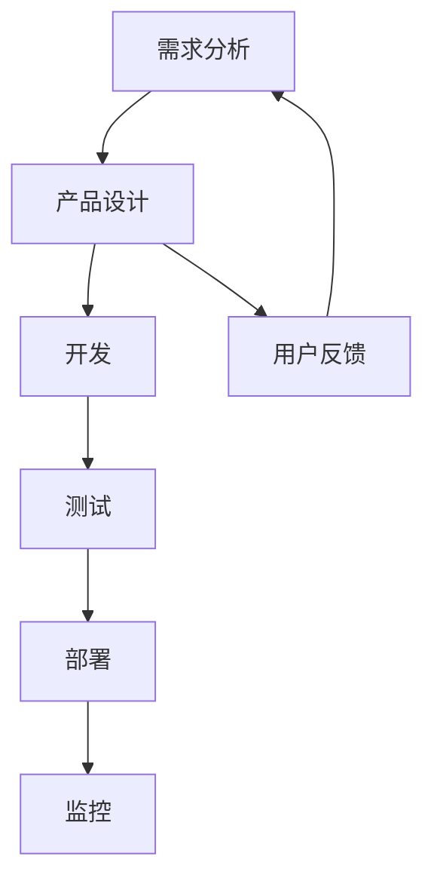

                 

# 如何打造高效的产品发布流程

## 摘要

在当今快速发展的技术环境中，产品发布流程的效率直接影响企业的竞争力。本文旨在深入探讨如何通过系统化的方法和最佳实践来打造高效的产品发布流程。我们将分析核心概念和关键流程，并探讨数学模型、实战案例以及应用场景，旨在为IT团队提供实用的指导，以优化产品发布流程，提高市场响应速度和用户满意度。

## 1. 背景介绍

在数字化时代，产品的快速迭代和发布已经成为企业保持市场竞争力的关键因素。产品发布流程不仅涉及技术开发，还包括市场分析、需求调研、用户体验、质量控制等多个环节。一个高效的产品发布流程能够确保产品按时上线、满足用户需求、提高客户满意度，并降低成本。然而，现实中许多企业在产品发布过程中面临诸多挑战，如需求变更频繁、团队协作不畅、测试不足等，导致项目延期、质量下降。因此，如何打造一个高效的产品发布流程成为企业亟待解决的重要问题。

### 2. 核心概念与联系

在构建高效的产品发布流程之前，我们需要了解一些核心概念和它们之间的联系。

**2.1 产品发布流程**

产品发布流程是指从产品概念产生到最终产品发布到市场的整个过程。它包括需求分析、产品设计、开发、测试、部署和监控等环节。

**2.2 敏捷开发**

敏捷开发是一种以用户需求为导向的软件开发方法，强调快速迭代、持续交付和团队协作。敏捷开发的核心原则包括：个体和互动重于流程与工具、可工作的软件重于详尽的文档、客户合作重于合同谈判、响应变化重于遵循计划。

**2.3 DevOps**

DevOps是一种文化和实践，旨在通过整合开发和运维团队，实现软件开发和IT运营的无缝协作。DevOps的核心目标是提高软件交付的速度和质量，降低风险。

**2.4 持续集成/持续交付（CI/CD）**

持续集成（CI）和持续交付（CD）是DevOps实践的关键组成部分。CI旨在通过自动化测试确保代码库的稳定，而CD则通过自动化部署加快产品上线速度。

### 3. Mermaid 流程图

下面是一个简化的产品发布流程的Mermaid流程图，展示了核心概念和流程节点的联系。



## 3. 核心算法原理 & 具体操作步骤

### 3.1 需求分析

**3.1.1 客户需求调研**

首先，通过客户访谈、问卷调查和市场分析等方式，了解用户需求和市场趋势。

**3.1.2 需求文档编写**

基于调研结果，编写详细的需求文档，明确产品的功能、性能、用户体验等要求。

### 3.2 产品设计

**3.2.1 功能模块划分**

将需求文档分解为功能模块，为后续开发提供明确的指导。

**3.2.2 UI/UX设计**

设计产品的用户界面和用户体验，确保产品易于使用、满足用户期望。

### 3.3 开发

**3.3.1 编码规范**

制定并遵循统一的编码规范，确保代码的可读性和可维护性。

**3.3.2 版本控制**

使用版本控制系统（如Git）管理代码，确保团队协作和代码的可追溯性。

### 3.4 测试

**3.4.1 单元测试**

编写单元测试，验证每个功能模块的正确性。

**3.4.2 集成测试**

进行集成测试，验证不同功能模块之间的协作和交互。

**3.4.3 性能测试**

对产品进行性能测试，确保其满足性能指标。

### 3.5 部署

**3.5.1 环境准备**

准备开发、测试和生产的部署环境，确保环境的一致性。

**3.5.2 自动化部署**

使用自动化工具（如Jenkins）进行部署，减少人为错误，提高部署效率。

### 3.6 监控

**3.6.1 日志分析**

收集并分析日志数据，监控产品的运行状态和性能。

**3.6.2 错误追踪**

使用错误追踪工具（如Sentry），快速定位和解决产品故障。

### 3.7 用户反馈

**3.7.1 用户调研**

定期进行用户调研，收集用户反馈和建议。

**3.7.2 功能迭代**

根据用户反馈，优化和迭代产品功能。

## 4. 数学模型和公式 & 详细讲解 & 举例说明

### 4.1 敏捷开发中的迭代周期计算

敏捷开发中的迭代周期（Sprint）是衡量开发进度的重要指标。假设每个迭代周期为两周，那么在n个迭代周期内，可以完成的功能点数F（Function Points）可以用以下公式计算：

$$ F = \sum_{i=1}^{n} (\text{迭代周期数} \times \text{每个迭代周期的平均开发效率}) $$

举例说明：一个团队在4个迭代周期内，每个迭代周期的平均开发效率为20个功能点，那么总共可以完成的功能点数为：

$$ F = 4 \times 20 = 80 $$

### 4.2 持续集成中的代码覆盖率计算

在持续集成过程中，代码覆盖率是评估代码质量的重要指标。假设一个项目有1000行代码，其中900行被测试覆盖，那么代码覆盖率C（Code Coverage）可以用以下公式计算：

$$ C = \frac{\text{已覆盖代码行数}}{\text{总代码行数}} \times 100\% $$

举例说明：一个项目的代码覆盖率为：

$$ C = \frac{900}{1000} \times 100\% = 90\% $$

### 4.3 持续交付中的部署成功率计算

在持续交付过程中，部署成功率是评估部署流程稳定性的关键指标。假设一个项目的每周部署次数为5次，其中4次成功，那么部署成功率R（Deployment Success Rate）可以用以下公式计算：

$$ R = \frac{\text{成功部署次数}}{\text{总部署次数}} \times 100\% $$

举例说明：一个项目的部署成功率为：

$$ R = \frac{4}{5} \times 100\% = 80\% $$

## 5. 项目实战：代码实际案例和详细解释说明

### 5.1 开发环境搭建

为了更好地展示产品发布流程中的开发环节，我们以一个简单的Web应用项目为例，介绍如何搭建开发环境。

**5.1.1 开发工具安装**

在Windows环境下，我们需要安装以下开发工具：

- Python 3.8
- Visual Studio Code
- Git

安装步骤如下：

1. 下载并安装Python 3.8：[Python官网](https://www.python.org/)
2. 下载并安装Visual Studio Code：[Visual Studio Code官网](https://code.visualstudio.com/)
3. 下载并安装Git：[Git官网](https://git-scm.com/)

**5.1.2 环境变量配置**

配置Python环境变量，确保在命令行中可以运行Python命令。

1. 打开“控制面板”→“系统和安全”→“系统”
2. 点击“高级系统设置”→“环境变量”
3. 在“系统变量”中，找到并选中“Path”变量，点击“编辑”
4. 在变量值中添加Python安装路径，如`C:\Python38\`
5. 点击“确定”保存设置

### 5.2 源代码详细实现和代码解读

假设我们开发的是一个简单的博客系统，主要功能包括用户注册、登录、发布文章和浏览文章。以下是项目的源代码结构：

```mermaid
tree
    project
    ├── requirements.txt
    ├── manage.py
    ├── blog
    │   ├── __init__.py
    │   ├── admin.py
    │   ├── apps.py
    │   ├── models.py
    │   ├── tests.py
    │   ├── views.py
    ├── static
    │   ├── css
    │   │   └── style.css
    │   ├── js
    │   └── images
    └── templates
        ├── base.html
        ├── register.html
        ├── login.html
        ├── index.html
        ├── post_create.html
        └── post_detail.html
```

**5.2.1 manage.py**

`manage.py`是Django项目的入口文件，用于启动开发服务器和运行其他管理命令。

```python
#!/usr/bin/env python
"""Django's command-line utility for administrative tasks."""
import os
import sys

def main():
    """Run administrative tasks."""
    os.environ.setdefault('DJANGO_SETTINGS_MODULE', 'blog.settings')
    try:
        from django.core.management import execute_from_command_line
    except ImportError as exc:
        raise ImportError(
            "Couldn't import Django. Are you sure it's installed and "
            "available on your PYTHONPATH environment variable? Did you "
            "forget to activate a virtual environment?"
        ) from exc
    execute_from_command_line(sys.argv)

if __name__ == '__main__':
    main()
```

**5.2.2 models.py**

`models.py`定义了项目的数据库模型，包括用户、文章等。

```python
from django.db import models
from django.contrib.auth.models import User

class Post(models.Model):
    title = models.CharField(max_length=100)
    content = models.TextField()
    author = models.ForeignKey(User, on_delete=models.CASCADE)
    created_at = models.DateTimeField(auto_now_add=True)

    def __str__(self):
        return self.title
```

**5.2.3 views.py**

`views.py`定义了项目的视图函数，处理用户请求并返回相应页面。

```python
from django.shortcuts import render, redirect
from .models import Post
from .forms import PostForm

def index(request):
    posts = Post.objects.all()
    return render(request, 'index.html', {'posts': posts})

def post_create(request):
    form = PostForm()
    if request.method == 'POST':
        form = PostForm(request.POST)
        if form.is_valid():
            post = form.save(commit=False)
            post.author = request.user
            post.save()
            return redirect('index')
    return render(request, 'post_create.html', {'form': form})

def post_detail(request, pk):
    post = Post.objects.get(id=pk)
    return render(request, 'post_detail.html', {'post': post})
```

### 5.3 代码解读与分析

**5.3.1 Django项目结构**

Django是一个Python Web框架，遵循MVC（模型-视图-控制器）设计模式。项目结构如下：

- `manage.py`：项目入口文件，用于运行管理命令。
- `settings.py`：配置文件，包括数据库设置、应用配置等。
- `urls.py`：路由文件，定义URL与视图函数的映射关系。
- `apps.py`：应用配置文件，定义应用的基础信息。
- `models.py`：模型文件，定义数据库模型。
- `views.py`：视图文件，定义视图函数，处理用户请求。
- `templates/`：模板文件，定义HTML页面。
- `static/`：静态文件，包括CSS、JavaScript和图像等。

**5.3.2 Django ORM**

Django ORM（Object-Relational Mapping）是一种数据映射技术，将Python对象映射到数据库表中。在上面的代码中，我们使用Django ORM定义了`Post`模型，包括字段`title`、`content`、`author`和`created_at`。

**5.3.3 视图函数**

视图函数是Django项目的核心部分，处理用户请求并返回相应页面。在`views.py`中，我们定义了三个视图函数：`index`、`post_create`和`post_detail`。

- `index`：返回所有文章列表。
- `post_create`：处理文章创建请求，保存新文章。
- `post_detail`：返回特定文章的详细信息。

## 6. 实际应用场景

### 6.1 跨部门协作

高效的产品发布流程需要跨部门协作，如产品管理、开发、测试、运维等。通过敏捷开发和DevOps实践，可以打破部门壁垒，实现信息的透明和高效沟通。

### 6.2 质量控制

通过严格的测试流程，如单元测试、集成测试和性能测试，可以确保产品的质量。同时，持续集成和持续交付实践有助于自动化测试和部署，提高产品质量。

### 6.3 用户反馈

通过用户调研和反馈，可以不断优化产品功能，提高用户满意度。用户反馈是产品迭代的重要依据，有助于提升产品的市场竞争力。

### 6.4 业务增长

高效的产品发布流程有助于快速响应市场需求，实现业务增长。通过持续迭代和优化，企业可以保持市场竞争力，实现可持续发展。

## 7. 工具和资源推荐

### 7.1 学习资源推荐

- 《敏捷软件开发：实践指南》
- 《持续交付：发布可靠软件的系统方法》
- 《Django Web开发：高级技术指南》

### 7.2 开发工具框架推荐

- Django：Python Web框架，适合快速开发。
- Jenkins：自动化部署工具，适合持续集成和持续交付。
- Docker：容器化技术，适合环境一致性和部署自动化。

### 7.3 相关论文著作推荐

- 《敏捷软件开发：原则、实践和模式》
- 《DevOps实践指南：从代码到云》
- 《持续交付：软件工程实践解析》

## 8. 总结：未来发展趋势与挑战

### 8.1 未来发展趋势

- 自动化与智能化：通过人工智能和机器学习技术，实现更高效的自动化测试和部署。
- 云原生架构：基于容器和微服务架构，实现更灵活和可扩展的产品发布流程。
- 敏捷与DevOps融合：敏捷开发和DevOps实践将进一步融合，实现更高效的产品发布流程。

### 8.2 未来挑战

- 技术复杂性：随着技术的快速发展，产品发布流程中的技术复杂性将增加，对团队成员的技能要求更高。
- 数据安全与隐私：在产品发布过程中，确保数据安全和用户隐私将成为重要挑战。
- 组织文化变革：推动敏捷开发和DevOps实践，需要企业进行组织文化变革，实现跨部门协作和高效沟通。

## 9. 附录：常见问题与解答

### 9.1 如何确保产品发布流程的效率？

- 采用敏捷开发和DevOps实践，实现快速迭代和自动化部署。
- 提高团队协作和沟通效率，确保信息透明。
- 严格遵循测试流程，确保产品质量。

### 9.2 持续集成和持续交付的区别是什么？

- 持续集成（CI）主要关注代码的集成和测试，确保代码库的稳定性。
- 持续交付（CD）主要关注代码的部署和监控，确保产品的快速上线。

### 9.3 如何优化用户体验？

- 进行用户调研和反馈，了解用户需求和期望。
- 设计简洁、易用的用户界面，提高用户满意度。

## 10. 扩展阅读 & 参考资料

- 《敏捷软件开发：实践指南》
- 《持续交付：发布可靠软件的系统方法》
- 《Django Web开发：高级技术指南》
- 《敏捷软件开发：原则、实践和模式》
- 《DevOps实践指南：从代码到云》
- 《持续交付：软件工程实践解析》

## 作者

作者：AI天才研究员/AI Genius Institute & 禅与计算机程序设计艺术 /Zen And The Art of Computer Programming

