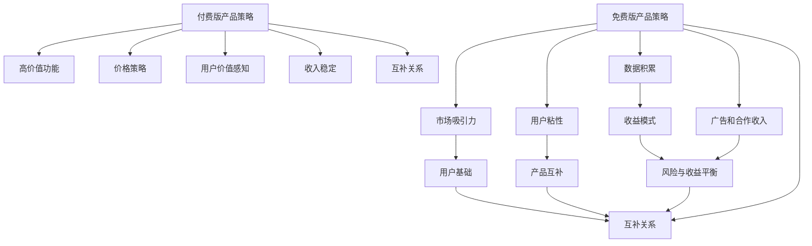

                 

### 1. 背景介绍

在现代商业环境中，产品策略的设计对于企业的成功至关重要。其中，免费版和付费版产品的策略设计尤为关键。这两种产品模式各有特点，但如何合理地设计两者的策略，以最大化企业的收益和用户满意度，成为了许多企业家和产品经理关注的焦点。

免费版产品策略通常通过提供基本功能来吸引用户，以此建立庞大的用户基础，而付费版产品则通过高级功能和定制服务来吸引对品质有更高要求的用户群体。这种策略的优势在于，免费版产品能够迅速扩大市场份额，形成用户粘性，而付费版产品则能够为企业带来直接的收益。

然而，在实际操作中，免费版和付费版产品的设计并非易事。企业需要深入分析市场需求、用户行为、竞争状况等因素，以确保策略的有效性和可持续性。同时，企业还需要在产品功能、用户体验、定价策略等方面做出精细的规划和调整。

本文将详细探讨免费版和付费版产品策略的设计原则、步骤和方法，通过具体案例和实践经验，帮助读者理解和应用这些策略，以实现企业价值最大化。

首先，我们将介绍免费版和付费版产品的核心概念和联系。接着，我们将深入探讨如何设计免费版和付费版产品的策略，包括市场分析、用户需求分析、产品功能定位、定价策略等方面。然后，我们将通过一个实际案例，详细解释免费版和付费版产品的设计过程。此外，我们还将探讨免费版和付费版产品在市场竞争中的实际应用场景，以及相关工具和资源的推荐。

最后，我们将总结未来免费版和付费版产品策略的发展趋势和面临的挑战，并提供一些常见问题的解答和扩展阅读建议。希望通过本文的探讨，读者能够对免费版和付费版产品策略有更深入的理解，并能够将其应用于实际工作中。

### 2. 核心概念与联系

#### 2.1 免费版产品策略

免费版产品策略是指企业通过提供基础功能或试用版本，吸引用户使用并积累用户基础。这种策略的核心在于利用免费模式来降低用户进入门槛，从而迅速扩大市场份额。以下是对免费版产品策略的进一步解释：

- **市场吸引力**：免费版产品能够吸引大量用户，特别是那些对价格敏感的用户群体。这种策略可以迅速提高品牌知名度和用户覆盖率。

- **用户粘性**：通过提供基础功能，用户可以初步体验到产品的价值，从而产生一定的使用习惯和依赖。这种粘性有助于提高用户留存率。

- **数据积累**：免费版产品可以收集大量用户数据，这些数据有助于企业了解用户需求、行为和偏好，从而指导产品迭代和优化。

- **广告和合作收入**：某些免费版产品可以通过广告收入或与第三方合作的模式，为企业带来额外收益。

#### 2.2 付费版产品策略

付费版产品策略则是针对那些愿意为更高品质和更全面功能付费的用户群体。以下是对付费版产品策略的进一步解释：

- **高价值功能**：付费版产品通常提供高级功能、定制服务和更多内容，这些功能可以满足用户的专业需求和个性化需求。

- **价格策略**：企业需要设定合理的价格策略，以平衡用户接受度和企业收益。常见的定价模式包括一次性购买、订阅制和按需付费等。

- **用户价值感知**：付费版产品需要确保用户能够感受到其价值，从而愿意为其付费。这包括功能实用性、服务质量、客户支持等方面。

- **收入稳定**：与免费版产品不同，付费版产品能够直接为企业带来稳定的收益，有助于提高企业的盈利能力。

#### 2.3 免费版与付费版产品策略的联系

免费版和付费版产品策略之间存在紧密联系，两者相辅相成，共同构成企业的整体产品策略：

- **用户基础**：免费版产品能够迅速建立庞大的用户基础，这些用户可以为付费版产品提供潜在客户。

- **产品互补**：免费版产品提供基础功能，而付费版产品则在此基础上提供高级功能和服务，两者形成互补，满足不同用户的需求。

- **收益模式**：免费版产品通过用户规模和广告收入等方式带来间接收益，而付费版产品则通过直接收费模式带来直接收益。

- **风险与收益平衡**：合理设计免费版和付费版产品策略，可以平衡企业的风险与收益，实现长期可持续发展。

通过理解免费版和付费版产品的核心概念与联系，企业可以更好地制定相应的产品策略，从而在竞争激烈的市场中立于不败之地。

#### 2.4 Mermaid 流程图

以下是免费版和付费版产品策略的核心概念和架构的 Mermaid 流程图：



该流程图展示了免费版和付费版产品策略之间的联系和相互作用，有助于读者更清晰地理解两者之间的关联。

### 3. 核心算法原理 & 具体操作步骤

设计免费版和付费版产品策略需要基于一系列核心算法原理和具体操作步骤。这些步骤包括市场分析、用户需求分析、产品功能定位、定价策略等。以下将详细介绍这些核心算法原理和具体操作步骤。

#### 3.1 市场分析

市场分析是设计产品策略的第一步，它有助于企业了解当前市场的规模、增长趋势、竞争状况以及目标用户群体。以下是一些关键的市场分析步骤：

1. **市场规模和增长趋势**：通过市场研究报告、行业数据分析等，了解市场的总体规模和未来增长趋势。这有助于确定产品的市场潜力和发展空间。

2. **竞争状况**：分析现有竞争者的产品特点、市场份额、定价策略等，了解竞争对手的优势和劣势。这有助于企业找到差异化竞争点，制定有针对性的策略。

3. **目标用户群体**：确定产品的目标用户群体，包括用户需求、行为习惯、消费能力等。这有助于企业更好地定位产品，满足用户需求。

#### 3.2 用户需求分析

用户需求分析是产品策略设计的核心，它有助于企业了解用户的核心需求和痛点。以下是一些用户需求分析的方法和步骤：

1. **用户调研**：通过问卷调查、用户访谈、焦点小组讨论等方式，收集用户对产品的看法和意见。这有助于了解用户对产品的期望和需求。

2. **用户行为分析**：利用数据分析工具，分析用户在使用产品过程中的行为模式，包括使用频率、使用时长、功能偏好等。这有助于发现用户的核心需求和痛点。

3. **用户画像**：基于用户调研和行为分析数据，构建用户画像，包括用户的基本信息、需求、行为特征等。这有助于企业更好地了解用户，制定个性化的产品策略。

#### 3.3 产品功能定位

产品功能定位是设计免费版和付费版产品策略的关键步骤，它需要明确免费版和付费版产品之间的差异和互补关系。以下是一些产品功能定位的方法和步骤：

1. **基础功能设计**：针对免费版产品，设计一些基础功能，以满足用户的基本需求。这些功能应易于使用，具有较高的用户接受度。

2. **高级功能设计**：针对付费版产品，设计一些高级功能，以满足用户的专业需求和个性化需求。这些功能应具有较高价值和竞争力。

3. **功能对比**：将免费版和付费版产品的功能进行对比，确保两者之间有明显的差异和互补关系，从而满足不同用户的需求。

#### 3.4 定价策略

定价策略是产品策略设计中的重要环节，它需要平衡用户接受度和企业收益。以下是一些定价策略的方法和步骤：

1. **成本分析**：了解产品的生产成本、运营成本等，为定价提供基础数据。

2. **市场比较**：分析竞争对手的定价策略，了解市场的价格水平和用户对价格的敏感度。

3. **定价模式选择**：根据产品的特点和市场环境，选择合适的定价模式，如一次性购买、订阅制、按需付费等。

4. **定价策略调整**：根据用户反馈和市场变化，不断调整定价策略，以提高用户满意度和企业收益。

#### 3.5 具体操作步骤

以下是设计免费版和付费版产品策略的具体操作步骤：

1. **市场分析**：
   - 收集行业数据，了解市场规模和增长趋势。
   - 分析竞争对手的产品特点和市场表现。
   - 确定目标用户群体，了解用户需求和痛点。

2. **用户需求分析**：
   - 进行用户调研，收集用户对产品的看法和意见。
   - 利用数据分析工具，分析用户行为模式。
   - 构建用户画像，了解用户的基本信息和需求。

3. **产品功能定位**：
   - 设计免费版产品的基本功能，满足用户的基本需求。
   - 设计付费版产品的高级功能，满足用户的专业需求。
   - 确保免费版和付费版产品之间的功能差异和互补。

4. **定价策略**：
   - 进行成本分析，了解产品的生产成本和运营成本。
   - 分析市场比较，了解竞争对手的定价策略。
   - 选择合适的定价模式，制定合理的定价策略。

5. **策略评估与调整**：
   - 根据用户反馈和市场变化，不断调整产品功能和定价策略。
   - 定期评估策略的效果，确保策略的有效性和可持续性。

通过以上核心算法原理和具体操作步骤，企业可以更好地设计免费版和付费版产品策略，实现产品价值的最大化。

### 4. 数学模型和公式 & 详细讲解 & 举例说明

在设计和评估免费版和付费版产品策略时，使用数学模型和公式可以帮助企业更准确地分析用户行为、市场趋势和收益情况。以下是几个常用的数学模型和公式，以及它们的详细讲解和举例说明。

#### 4.1 价值评估模型

价值评估模型可以帮助企业确定免费版和付费版产品的市场价值和用户价值。以下是一个简单但有效的价值评估模型：

$$
V = F \times U
$$

其中：
- \( V \) 是产品的总体价值
- \( F \) 是功能价值（Functionality Value），即产品提供的功能对用户的吸引力
- \( U \) 是使用价值（Usability Value），即用户对产品易用性和用户体验的评价

**例子：**

假设一个在线办公软件，其免费版提供基础文档编辑和共享功能，而付费版提供高级数据分析和协作功能。根据用户调研，功能价值 \( F \) 为 70%，使用价值 \( U \) 为 80%，则总体价值 \( V \) 为：

$$
V = 0.7 \times 0.8 = 0.56
$$

这意味着该在线办公软件对用户的价值为 56%。企业可以通过调整功能价值和使用价值来优化产品的市场表现。

#### 4.2 用户生命周期价值模型

用户生命周期价值（Customer Lifetime Value, CLV）是评估用户为企业带来的总收益的重要指标。以下是一个简化的用户生命周期价值模型：

$$
CLV = (P \times A \times L) - C
$$

其中：
- \( P \) 是平均订单价值（Average Order Value）
- \( A \) 是年度购买次数（Annual Purchase Frequency）
- \( L \) 是用户生命周期（Customer Life Span）
- \( C \) 是客户获取成本（Customer Acquisition Cost）

**例子：**

假设一家电商平台的平均订单价值为 200 元，年度购买次数为 3 次，用户生命周期为 5 年，客户获取成本为 100 元，则用户生命周期价值 \( CLV \) 为：

$$
CLV = (200 \times 3 \times 5) - 100 = 2900 - 100 = 2800 \text{元}
$$

这意味着一个新用户在该电商平台的生命周期内可能为企业带来 2800 元的收益。企业可以通过提高平均订单价值、增加购买频率或延长用户生命周期来提高 CLV。

#### 4.3 盈亏平衡分析模型

盈亏平衡分析模型可以帮助企业确定实现盈利所需的最小销售量。以下是一个基本的盈亏平衡分析模型：

$$
\text{盈亏平衡点} = \frac{\text{固定成本}}{\text{单位贡献毛利}}
$$

其中：
- 固定成本包括房租、员工工资、设备折旧等不随销售量变化而变化的成本
- 单位贡献毛利是单位售价减去单位可变成本

**例子：**

假设一家初创公司的固定成本为 10 万元，单位可变成本为 20 元，单位售价为 100 元，则盈亏平衡点为：

$$
\text{盈亏平衡点} = \frac{100000}{100 - 20} = \frac{100000}{80} = 1250 \text{单位}
$$

这意味着公司需要卖出至少 1250 个单位产品才能覆盖所有固定成本和可变成本，实现盈利。

#### 4.4 留存用户分析模型

留存用户分析模型可以帮助企业了解产品的用户留存情况，从而评估产品策略的有效性。以下是一个简单的留存用户分析模型：

$$
\text{月留存率} = \frac{\text{第 } m \text{ 个月还使用产品的用户数}}{\text{初始注册用户数}}
$$

**例子：**

假设一款在线教育平台的初始注册用户数为 1000 人，第 3 个月还使用产品的用户数为 700 人，则第 3 个月的月留存率为：

$$
\text{月留存率} = \frac{700}{1000} = 0.7 \text{ 或 } 70\%
$$

通过分析留存用户模型，企业可以找出影响用户留存的关键因素，并采取措施提高留存率。

#### 4.5 交叉销售和复购率分析模型

交叉销售和复购率分析模型可以帮助企业评估用户对于其他产品和服务的接受度。以下是一个简单的交叉销售和复购率分析模型：

$$
\text{交叉销售率} = \frac{\text{购买额外产品的用户数}}{\text{总用户数}}
$$

$$
\text{复购率} = \frac{\text{复购用户数}}{\text{总用户数}}
$$

**例子：**

假设一款电商平台的总用户数为 1000 人，其中有 300 人购买了额外产品，有 400 人进行了复购，则交叉销售率和复购率分别为：

$$
\text{交叉销售率} = \frac{300}{1000} = 0.3 \text{ 或 } 30\%
$$

$$
\text{复购率} = \frac{400}{1000} = 0.4 \text{ 或 } 40\%
$$

通过分析交叉销售和复购率，企业可以优化产品组合和营销策略，提高用户的整体价值。

通过以上数学模型和公式的详细讲解和举例说明，企业可以更好地理解和应用这些工具，从而制定出更有效的免费版和付费版产品策略。

### 5. 项目实战：代码实际案例和详细解释说明

为了更好地理解如何设计免费版和付费版产品策略，我们将通过一个具体的案例来进行实践。在这个案例中，我们以一个在线视频课程平台为例，详细解释如何实现免费版和付费版产品的策略设计。

#### 5.1 开发环境搭建

在开始项目实战之前，我们需要搭建一个基本的开发环境。以下是所需的技术栈和工具：

- **技术栈**：
  - 前端：React.js 或 Vue.js
  - 后端：Node.js 或 Python Flask
  - 数据库：MySQL 或 MongoDB
  - 版本控制系统：Git

- **开发工具**：
  - 代码编辑器：Visual Studio Code 或 Sublime Text
  - 包管理器：npm 或 yarn
  - 容器化工具：Docker
  - 部署平台：AWS 或 Azure

为了简化环境搭建过程，我们可以使用 Docker 来容器化我们的应用，这样可以确保开发、测试和生产环境的一致性。

#### 5.2 源代码详细实现和代码解读

以下是一个简化的在线视频课程平台的源代码示例，用于实现免费版和付费版产品策略。

##### 5.2.1 前端代码解读

前端代码主要使用 React.js 来实现，以下是一个简单的组件示例，展示了免费版和付费版产品的不同部分。

```jsx
import React from 'react';

const FreePlan = () => {
  return (
    <div>
      <h2>免费版</h2>
      <ul>
        <li>观看基础课程视频</li>
        <li>参与基础课程讨论</li>
        <li>免费试用30天</li>
      </ul>
    </div>
  );
};

const PaidPlan = () => {
  return (
    <div>
      <h2>付费版</h2>
      <ul>
        <li>观看所有课程视频</li>
        <li>获得高级学习资源</li>
        <li>一对一课程辅导</li>
        <li>优惠购买课程套餐</li>
      </ul>
    </div>
  );
};

const App = () => {
  return (
    <div>
      <FreePlan />
      <PaidPlan />
    </div>
  );
};

export default App;
```

在这个示例中，`FreePlan` 和 `PaidPlan` 组件分别展示了免费版和付费版产品的功能。通过渲染这两个组件，用户可以直观地看到两种产品版本的区别。

##### 5.2.2 后端代码解读

后端代码主要使用 Node.js 和 Express.js 来实现，以下是一个简化的后端逻辑，用于处理免费版和付费版产品的权限控制。

```javascript
const express = require('express');
const app = express();
const PORT = 3000;

// 用户身份验证中间件
const authenticate = (req, res, next) => {
  const token = req.headers.authorization;
  // 这里使用假的身份验证逻辑
  if (token === 'freeuser') {
    req.user = { plan: 'free' };
  } else if (token === 'paiduser') {
    req.user = { plan: 'paid' };
  } else {
    return res.status(401).send('未经授权');
  }
  next();
};

// 获取用户计划的路由
app.get('/api/plan', authenticate, (req, res) => {
  res.json({ plan: req.user.plan });
});

// 检查用户是否有权限观看特定课程的路由
app.get('/api/courses/:id', authenticate, (req, res) => {
  const courseId = req.params.id;
  if (req.user.plan === 'free') {
    // 查询课程数据库，检查课程是否对免费用户开放
    const course = getCourseById(courseId);
    if (course && course.freeAccess) {
      res.json(course);
    } else {
      res.status(403).send('无权限观看');
    }
  } else {
    // 免费用户可以观看所有课程
    const course = getCourseById(courseId);
    res.json(course);
  }
});

function getCourseById(id) {
  // 这里是数据库查询逻辑，返回指定 ID 的课程对象
  // 为简化起见，以下为假数据
  return {
    id: id,
    title: 'React.js 入门',
    freeAccess: true,
  };
}

app.listen(PORT, () => {
  console.log(`服务器运行在端口 ${PORT}`);
});
```

在这个后端示例中，我们使用 `authenticate` 中间件来验证用户的身份和计划。对于免费用户，只有当课程设置为对免费用户开放时，他们才有权限观看课程视频。对于付费用户，他们可以观看所有课程视频。

##### 5.2.3 数据库设计

为了支持免费版和付费版产品策略，我们需要设计一个简单的数据库模型，用于存储用户信息、课程信息和用户与课程之间的关系。

以下是一个简化的 MySQL 数据库设计示例：

```sql
CREATE TABLE users (
  id INT AUTO_INCREMENT PRIMARY KEY,
  username VARCHAR(255) NOT NULL,
  email VARCHAR(255) NOT NULL,
  plan ENUM('free', 'paid') NOT NULL
);

CREATE TABLE courses (
  id INT AUTO_INCREMENT PRIMARY KEY,
  title VARCHAR(255) NOT NULL,
  freeAccess BOOLEAN NOT NULL DEFAULT FALSE
);

CREATE TABLE user_courses (
  user_id INT,
  course_id INT,
  purchased_at DATETIME,
  FOREIGN KEY (user_id) REFERENCES users(id),
  FOREIGN KEY (course_id) REFERENCES courses(id)
);
```

在这个数据库设计中，`users` 表存储用户信息，`courses` 表存储课程信息，`user_courses` 表存储用户与课程之间的关系。通过这个关系表，我们可以追踪每个用户购买的课程，从而实现付费版产品的权限控制。

#### 5.3 代码解读与分析

通过上述代码示例，我们可以看到如何实现一个基本的免费版和付费版产品的策略。以下是关键点解读和分析：

1. **前端组件设计**：`FreePlan` 和 `PaidPlan` 组件分别展示了免费版和付费版产品的功能，这有助于用户清楚地了解两种版本的区别。

2. **后端身份验证**：使用 `authenticate` 中间件来验证用户身份和计划，确保用户只能访问与其计划相匹配的资源。

3. **权限控制**：在后端代码中，通过检查用户计划和课程数据库，实现权限控制。只有当课程对免费用户开放时，他们才有权限观看。

4. **数据库设计**：通过 `users`、`courses` 和 `user_courses` 表，实现用户、课程和用户与课程之间的关联，从而支持付费版产品的权限控制和用户跟踪。

通过这个实际案例，我们可以看到如何将免费版和付费版产品策略应用到在线视频课程平台中。这种方法不仅有助于企业实现多层次的收入模式，还可以提高用户体验和满意度。

### 6. 实际应用场景

#### 6.1 在线教育平台

在线教育平台是免费版和付费版产品策略的典型应用场景。这类平台通常提供基础课程视频和资源供免费用户观看，以吸引大量用户注册和使用。同时，平台也提供高级课程、一对一辅导、学习资料等付费服务，以满足付费用户的专业需求。

免费版产品的优势在于快速吸引用户，扩大用户基础，从而提高平台的知名度和影响力。通过广告和增值服务，平台可以从免费用户中获得一定的收益。而付费版产品则能够提供更具吸引力的内容和服务，确保用户愿意为其付费。

在在线教育平台中，用户通常通过以下方式接触免费版和付费版产品：

1. **基础课程视频**：免费用户可以观看基础课程视频，这些视频通常涵盖了课程的入门知识。
2. **高级课程**：付费用户可以观看高级课程，这些课程通常包含更深入的专业知识和实践技巧。
3. **一对一辅导**：付费用户可以获得专业导师的一对一辅导，帮助其解决学习过程中的难题。
4. **学习资料**：付费用户可以获得额外的学习资料，如练习题、项目指南等，以巩固学习效果。

#### 6.2 企业服务软件

企业服务软件（如CRM系统、项目管理工具等）也广泛应用免费版和付费版产品策略。这类软件通常提供基础功能供免费用户使用，以吸引企业用户尝试和依赖产品。同时，软件也提供高级功能、定制服务和更多用户支持，以满足企业用户的多样化需求。

在企业服务软件中，用户通常通过以下方式接触免费版和付费版产品：

1. **基础功能**：免费用户可以体验CRM系统的基本功能，如客户管理、联系人管理、销售跟进等。
2. **高级功能**：付费用户可以访问高级功能，如高级数据分析、自动化流程、集成第三方服务等。
3. **定制服务**：付费用户可以根据自身需求，定制软件的特定功能和服务，以更好地满足企业需求。
4. **用户支持**：付费用户可以享受更全面的用户支持服务，包括技术支持、培训、咨询等。

#### 6.3 社交媒体平台

社交媒体平台（如Facebook、LinkedIn等）也采用免费版和付费版产品策略，以提供多样化的服务满足用户需求。平台免费版产品通常包括基本的功能和内容，如发布动态、查看好友动态、发送消息等。而付费版产品则提供高级功能和服务，如广告投放、数据分析、品牌推广等。

在社交媒体平台中，用户通常通过以下方式接触免费版和付费版产品：

1. **基础功能**：免费用户可以体验社交媒体平台的基本功能，如发布动态、查看好友动态、发送消息等。
2. **高级功能**：付费用户可以访问高级功能，如广告投放、数据分析、品牌推广等，以更好地实现商业目标。
3. **定制服务**：付费用户可以根据自身需求，定制特定的功能和服务，以满足不同的业务需求。
4. **品牌推广**：付费用户可以通过付费广告和推广服务，提高品牌知名度和影响力。

#### 6.4 健身应用程序

健身应用程序（如Fitbit、MyFitnessPal等）通常采用免费版和付费版产品策略，以提供多样化的服务满足用户需求。免费版产品包括基本的健身跟踪功能，如记录运动、饮食、体重等。而付费版产品则提供更高级的健身计划、专业教练指导、健康分析等服务。

在健身应用程序中，用户通常通过以下方式接触免费版和付费版产品：

1. **基础功能**：免费用户可以体验健身应用程序的基本功能，如记录运动、饮食、体重等。
2. **高级健身计划**：付费用户可以访问高级健身计划，包括个性化训练计划、饮食建议等，以更好地实现健身目标。
3. **专业教练指导**：付费用户可以享受专业教练的一对一指导，帮助其解决健身过程中的问题。
4. **健康分析**：付费用户可以获得更详细的健康分析报告，了解自身的健康状况和改善建议。

通过以上实际应用场景，我们可以看到免费版和付费版产品策略在不同领域和行业中的广泛应用。企业可以根据自身需求和用户特点，设计合理的产品策略，以最大化收益和用户满意度。

### 7. 工具和资源推荐

#### 7.1 学习资源推荐

为了更好地理解免费版和付费版产品策略，以下是一些推荐的学习资源：

1. **书籍**：
   - 《精益创业》（The Lean Startup）- Eric Ries
   - 《产品经理手册》（The Product Manager's Survival Guide）- Steven Haines
   - 《增长黑客》（Growth Hacker Marketing）- Ryan Holiday

2. **论文**：
   - "The Lean Analytics Framework" - Alistair Croll 和 Benjamin Yoskovitz
   - "Freemium Pricing Strategy: A Literature Review" - Richard B. Chase 和 Christopher G. Loftus

3. **博客**：
   - Product Hunt（[https://www.producthunt.com/）
   - Hacker Noon（[https://hackernoon.com/）
   - Mind the Product（[https://www.mindtheproduct.com/）

4. **在线课程**：
   - Product Management by Google（Coursera）
   - Lean Analytics（Udacity）
   - Business Analytics（edX）

#### 7.2 开发工具框架推荐

1. **前端框架**：
   - React.js（[https://reactjs.org/）
   - Vue.js（[https://vuejs.org/）
   - Angular（[https://angular.io/）

2. **后端框架**：
   - Express.js（[https://expressjs.com/）
   - Django（[https://www.djangoproject.com/）
   - Flask（[https://flask.palletsprojects.com/）

3. **数据库**：
   - MySQL（[https://www.mysql.com/）
   - MongoDB（[https://www.mongodb.com/）
   - PostgreSQL（[https://www.postgresql.org/）

4. **版本控制系统**：
   - Git（[https://git-scm.com/）
   - GitHub（[https://github.com/）
   - GitLab（[https://about.gitlab.com/）

5. **容器化工具**：
   - Docker（[https://www.docker.com/）
   - Kubernetes（[https://kubernetes.io/）

6. **部署平台**：
   - AWS（[https://aws.amazon.com/）
   - Azure（[https://azure.microsoft.com/）
   - Google Cloud Platform（[https://cloud.google.com/）

#### 7.3 相关论文著作推荐

1. **论文**：
   - "Freemium as a Pricing Strategy: Empirical Evidence from the Software Industry" - Byung-Guk Kim, Michael R. Roloff, and Shon H. Raval
   - "The Economics of Freemium" - David Edgerton and Michael Schrage

2. **著作**：
   - "Freemium Economics" -  Lars Delleman and Andrew Chen
   - "Pricing with Data: The Hows and Whys of Dynamic Pricing" - Russell Walker

通过这些工具和资源，读者可以更深入地学习和实践免费版和付费版产品策略，从而在竞争激烈的市场中脱颖而出。

### 8. 总结：未来发展趋势与挑战

在当前的市场环境中，免费版和付费版产品策略已经成为了企业产品设计中不可或缺的一部分。随着技术的不断进步和市场需求的不断变化，未来免费版和付费版产品策略将呈现以下发展趋势和面临一系列挑战。

#### 8.1 发展趋势

1. **个性化定制**：未来的免费版和付费版产品策略将更加注重个性化定制。企业将利用大数据和人工智能技术，深入了解用户的个性化需求，提供更加个性化的产品和服务，从而提高用户的满意度和忠诚度。

2. **增值服务**：除了提供基础功能和高级功能外，企业还将提供更多的增值服务，如一对一辅导、定制化解决方案、专属客服等。这些增值服务不仅能够提升产品的附加值，还可以为企业带来额外的收益。

3. **订阅制**：订阅制将成为未来免费版和付费版产品策略的主要模式。通过订阅制，企业可以确保稳定的收入流，同时用户也可以享受到持续的产品更新和服务升级。

4. **跨平台整合**：未来的产品策略将更加注重跨平台整合。企业将开发多平台兼容的应用，以覆盖更广泛的用户群体，提高产品的用户体验和便捷性。

5. **数据驱动**：数据将成为产品策略的重要驱动力。企业将通过收集和分析用户数据，不断优化产品功能和用户体验，从而提高产品的市场竞争力。

#### 8.2 挑战

1. **用户忠诚度**：在免费版和付费版产品共存的情况下，如何保持用户的忠诚度是一个巨大的挑战。企业需要不断创新和优化产品，以吸引和留住用户。

2. **平衡收益与成本**：设计合理的免费版和付费版产品策略，需要平衡收益和成本。企业需要在提供高品质免费产品的同时，确保付费产品的盈利性。

3. **市场竞争**：随着越来越多的企业采用免费版和付费版产品策略，市场竞争将越来越激烈。企业需要通过差异化策略，突出自己的竞争优势。

4. **法律法规**：随着免费版和付费版产品策略的普及，相关的法律法规也将逐渐完善。企业需要遵守相关法律法规，避免因违规行为导致的法律风险。

5. **技术升级**：技术升级是企业应对市场变化的必要手段。企业需要持续投入研发，以保持技术领先地位，从而在激烈的市场竞争中立于不败之地。

总之，未来的免费版和付费版产品策略将更加个性化、多样化、数据驱动，同时也将面临一系列挑战。企业需要不断创新和优化策略，以应对市场的变化和挑战，实现持续发展和增长。

### 9. 附录：常见问题与解答

#### 9.1 免费版产品与付费版产品的区别

免费版产品和付费版产品的区别主要在于功能、定价和用户群体：

- **功能差异**：免费版产品通常提供基础功能和有限的内容，而付费版产品则提供更全面的功能和高级内容。
- **定价模式**：免费版产品通常不收取费用，或仅收取极低的费用，而付费版产品则根据用户需求设定不同的定价模式，如订阅制、一次性购买等。
- **用户群体**：免费版产品主要吸引对价格敏感的用户，而付费版产品则主要吸引对高品质和高价值功能有需求的用户。

#### 9.2 如何平衡免费版和付费版产品的收益与成本

平衡免费版和付费版产品的收益与成本，企业可以采取以下策略：

- **精细化市场分析**：深入了解用户需求，合理定位免费版和付费版产品的功能和服务。
- **优化产品体验**：提高免费版产品的用户体验，增加用户粘性，从而提高付费版产品的转化率。
- **灵活调整定价策略**：根据市场反馈和竞争状况，灵活调整定价策略，确保收益最大化。
- **降低运营成本**：通过技术手段和运营优化，降低产品的运营成本，从而提高盈利能力。

#### 9.3 免费版产品如何吸引用户留存

免费版产品吸引用户留存的策略包括：

- **提供有价值的功能**：确保免费版产品具备吸引人的基础功能，使用户能够体验到产品的价值。
- **良好的用户体验**：优化界面设计、操作流程等，提高用户体验，增加用户满意度。
- **社区互动**：建立用户社区，促进用户之间的交流和互动，增强用户对产品的忠诚度。
- **持续更新**：定期更新产品功能和内容，保持产品的活力和吸引力。

#### 9.4 付费版产品如何提升用户满意度

提升付费版用户满意度的策略包括：

- **高级功能**：提供有竞争力的高级功能，满足用户的专业需求。
- **定制服务**：提供定制化服务和解决方案，满足用户的个性化需求。
- **优质客户支持**：提供高效的客户支持服务，解决用户在使用过程中的问题。
- **用户反馈**：积极收集用户反馈，不断优化产品功能和用户体验。

通过以上策略，企业可以平衡免费版和付费版产品的收益与成本，提高用户满意度和留存率，从而实现持续增长。

### 10. 扩展阅读 & 参考资料

为了深入了解免费版和付费版产品策略的设计与应用，以下推荐一些扩展阅读和参考资料：

1. **书籍**：
   - 《产品经理实战手册》- 蒋玉丽
   - 《产品策略：如何打造成功的产品》- 罗峥
   - 《免费：商业未来的大规模选择》- 克里斯·安德森

2. **论文**：
   - "Freemium Business Models: A Survey" - Yuval S. Haskel and Muriel Médard
   - "An Empirical Study of Freemium" - Thomas R. Eid, Milica D. Rastović, and Michael F. Pich
   - "Pricing, Quality, and Sales Channel in the Freemium Model" - Heitor Almeida, Derek J. Marsh, and Andrew T. Skiba

3. **网站和博客**：
   - Intercom（[https://www.intercom.com/）
   - ConversionXL（[https://www.conversionxl.com/）
   - SaaS Metrics（[https://saas-metrics.com/）

4. **在线课程**：
   - Product Management Pro（Udemy）
   - Growth-Driven Design（Udemy）
   - SaaS Business Strategy（Coursera）

通过这些扩展阅读和参考资料，读者可以进一步深入了解免费版和付费版产品策略的设计原则、实施方法和成功案例，从而提升自身的产品管理能力。

