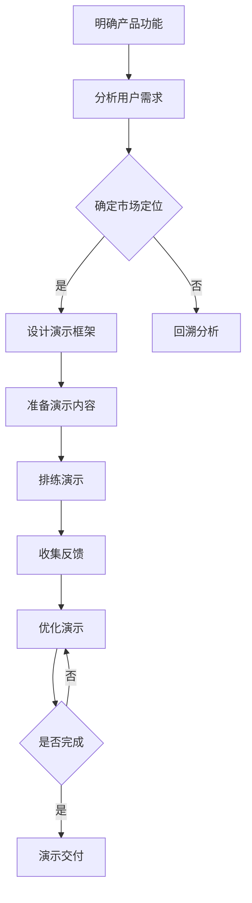

                 

# 如何设计有说服力的产品演示

## 摘要

本文旨在探讨如何设计有说服力的产品演示，以帮助产品经理和设计师更好地展示产品功能、优势和用户价值。通过分析产品演示的核心要素、设计原则和实战技巧，本文将为读者提供一套系统、实用的产品演示设计指南。无论您是经验丰富的产品专家还是新手，都能够在本文中找到有价值的见解和启示。

## 1. 背景介绍

在当今市场竞争日益激烈的环境中，产品演示成为产品成功推向市场的重要一环。一个成功的产品演示不仅能够吸引潜在客户的兴趣，还能够有效地传达产品的核心价值和竞争优势。然而，如何设计出一个既有吸引力又有说服力的产品演示，一直是产品经理和设计师们面临的挑战。本文将结合实际案例和理论指导，为您解析产品演示设计的核心要素和技巧。

### 产品演示的重要性

产品演示在产品营销中具有至关重要的地位。首先，它是一个直观展示产品功能和技术优势的平台，能够帮助客户更好地理解产品。其次，通过产品演示，企业可以展示其技术实力和创新能力，从而增强品牌形象和市场竞争力。最后，产品演示也是一种有效的沟通工具，能够帮助企业与客户建立信任关系，促进销售和合作。

### 产品演示的现状与挑战

尽管产品演示在产品营销中具有重要作用，但目前仍存在一些挑战。首先，许多产品演示过于技术化，难以让普通用户理解。其次，一些产品演示缺乏创新性和吸引力，无法引起客户的兴趣。此外，产品演示的时间限制和观众注意力分散也给设计带来了一定难度。

### 目标读者群体

本文的目标读者群体包括产品经理、设计师、市场营销人员以及任何对产品演示设计感兴趣的人。无论您是经验丰富的专业人士还是刚刚入门的新手，本文都将为您带来有价值的见解和实用的设计技巧。

## 2. 核心概念与联系

在探讨如何设计有说服力的产品演示之前，我们需要了解一些核心概念和联系。以下是本文将涉及的主要概念：

### 产品演示的核心要素

- **产品功能**：展示产品的主要功能和技术特点。
- **用户价值**：强调产品如何解决用户问题或满足需求。
- **用户体验**：展示产品在实际使用中的操作流程和感受。
- **市场定位**：明确产品在市场中的定位和竞争优势。

### 设计原则

- **简洁性**：避免冗长和复杂的演示，确保关键信息一目了然。
- **直观性**：使用图形、动画等元素增强演示的直观性。
- **故事性**：通过讲述故事来吸引观众的注意力并传达产品价值。
- **互动性**：增加与观众的互动，提高参与度和记忆度。

### Mermaid 流程图

以下是一个简单的 Mermaid 流程图，展示了产品演示的设计流程和关键环节：



### 关键环节与联系

- **明确产品功能**：了解产品的核心功能和技术特点，为后续设计提供基础。
- **分析用户需求**：了解目标用户的需求和痛点，确保演示内容贴近用户实际使用场景。
- **确定市场定位**：明确产品在市场中的竞争优势和目标客户，为演示设计提供方向。
- **设计演示框架**：制定演示的整体结构和流程，确保演示的连贯性和逻辑性。
- **准备演示内容**：编写演示稿，整理相关素材和资料，确保演示内容的准确性和完整性。
- **排练演示**：多次练习演示，提高演示效果和观众的参与度。
- **收集反馈**：在演示后收集观众的反馈，了解他们的需求和意见，为优化演示提供依据。
- **优化演示**：根据反馈调整演示内容和流程，提高演示的质量和效果。
- **演示交付**：最终呈现给观众，确保演示的成功。

通过以上核心概念和流程的梳理，我们可以更好地理解产品演示设计的本质和关键环节，为后续内容的讲解和分析打下基础。

## 3. 核心算法原理 & 具体操作步骤

在设计有说服力的产品演示时，核心算法原理和具体操作步骤起着至关重要的作用。以下将详细介绍这些内容，并解释其工作原理和适用场景。

### 3.1 产品功能分析算法

**算法原理**：产品功能分析算法是一种基于用户需求和市场定位的方法，旨在识别和提炼产品的核心功能。该算法通过以下步骤实现：

1. **需求分析**：收集并分析目标用户的需求和痛点，确定产品的核心目标。
2. **功能筛选**：从产品功能库中筛选出与用户需求高度相关的功能，排除冗余和次要功能。
3. **优先级排序**：根据功能的重要性和用户需求的紧急程度，对筛选出的功能进行优先级排序。

**具体操作步骤**：

1. **收集用户需求**：通过调查问卷、用户访谈、用户测试等方式，了解用户对产品的期望和需求。
2. **构建功能库**：将收集到的用户需求转化为具体的功能点，形成功能库。
3. **筛选核心功能**：根据产品目标和市场定位，从功能库中筛选出核心功能。
4. **优先级排序**：使用评分卡或评分表，对筛选出的核心功能进行优先级排序。

**工作原理**：该算法通过用户需求和产品目标的匹配，确保产品演示中的功能点既实用又具有针对性，从而提高演示的说服力。

**适用场景**：适用于新产品的功能定位和演示设计，尤其是在竞争激烈的市场环境中，确保产品功能与用户需求紧密相关。

### 3.2 用户故事撰写算法

**算法原理**：用户故事撰写算法是一种基于用户行为和场景描述的方法，旨在创造具有吸引力和共鸣力的产品演示内容。该算法通过以下步骤实现：

1. **场景描述**：描述用户在使用产品时的典型场景和操作流程。
2. **痛点分析**：分析用户在场景中遇到的问题和痛点，确定产品的解决方案。
3. **故事构建**：将场景描述、痛点和解决方案结合起来，形成一个完整的故事。

**具体操作步骤**：

1. **收集场景信息**：通过用户访谈、观察等方式，收集用户在使用产品时的场景信息。
2. **描述场景**：将收集到的场景信息转化为具体的描述，确保清晰易懂。
3. **分析痛点**：根据场景描述，识别用户在场景中遇到的问题和痛点。
4. **构建故事**：将场景描述、痛点和解决方案结合起来，形成一个具有吸引力和共鸣力的故事。

**工作原理**：该算法通过构建用户故事，将产品功能与用户实际需求紧密结合，提高演示的吸引力和说服力。

**适用场景**：适用于产品演示中的故事构建和情节设计，尤其是在需要强调用户体验和用户价值的情况下。

### 3.3 演示效果优化算法

**算法原理**：演示效果优化算法是一种基于观众行为分析和数据驱动的优化方法，旨在提高产品演示的效果和观众的参与度。该算法通过以下步骤实现：

1. **数据收集**：收集观众在演示过程中的行为数据，如观看时长、互动次数等。
2. **数据分析**：分析观众行为数据，识别演示中的优点和不足。
3. **优化策略**：根据分析结果，制定优化策略，调整演示内容和流程。

**具体操作步骤**：

1. **安装跟踪工具**：在演示环境中安装跟踪工具，收集观众的行为数据。
2. **数据收集**：在演示过程中，实时收集观众的行为数据，如点击、滑动、观看时长等。
3. **数据分析**：使用数据分析工具，对观众行为数据进行分析，识别演示中的优点和不足。
4. **制定优化策略**：根据分析结果，制定优化策略，如调整演示节奏、增加互动环节等。
5. **实施优化**：根据优化策略，对演示内容和流程进行调整，提高演示效果。

**工作原理**：该算法通过数据驱动的方式，不断优化产品演示，提高观众的参与度和满意度。

**适用场景**：适用于产品演示的迭代优化，尤其是在需要持续改进和提升演示效果的情况下。

通过以上核心算法原理和具体操作步骤的介绍，我们可以更好地理解如何在产品演示设计中应用这些方法，提高演示的说服力和效果。

## 4. 数学模型和公式 & 详细讲解 & 举例说明

### 4.1 产品功能分析模型

**公式**：功能分析模型的公式可以表示为：

\[ F(A, B, C) = A \times B \times C \]

其中：
- \( A \) 表示用户需求满足度
- \( B \) 表示产品功能实现度
- \( C \) 表示用户价值感知度

**详细讲解**：

1. **用户需求满足度（A）**：用户需求满足度是衡量产品功能与用户需求匹配程度的一个指标。它可以通过用户调研、用户访谈等方式进行评估，分数范围通常在 0 到 1 之间，得分越高表示产品功能与用户需求的匹配度越高。

2. **产品功能实现度（B）**：产品功能实现度是衡量产品功能实现的完整性和准确性的一个指标。它可以通过功能测试、代码审查等方式进行评估，分数范围通常在 0 到 1 之间，得分越高表示产品功能实现的越完整和准确。

3. **用户价值感知度（C）**：用户价值感知度是衡量用户对产品功能带来的价值感知的一个指标。它可以通过用户反馈、满意度调查等方式进行评估，分数范围通常在 0 到 1 之间，得分越高表示用户对产品功能的感知价值越高。

**举例说明**：

假设我们正在分析一个任务管理应用的功能，该应用的主要功能是帮助用户跟踪任务进度和团队协作。

- **用户需求满足度（A）**：通过调研，我们了解到用户希望应用能够提供任务创建、任务分配、进度跟踪等功能。假设这些功能在用户调研中的评分分别为 0.8、0.7 和 0.9，则用户需求满足度 \( A = 0.8 \times 0.7 \times 0.9 = 0.504 \)。

- **产品功能实现度（B）**：通过功能测试，我们发现任务创建、任务分配、进度跟踪等功能都得到了很好的实现，评分分别为 0.9、0.8 和 0.9，则产品功能实现度 \( B = 0.9 \times 0.8 \times 0.9 = 0.648 \)。

- **用户价值感知度（C）**：通过用户反馈，我们了解到用户对任务管理应用的整体满意度很高，评分分别为 0.8、0.7 和 0.9，则用户价值感知度 \( C = 0.8 \times 0.7 \times 0.9 = 0.504 \)。

- **产品功能分析模型（F）**：将上述三个得分代入公式，得到产品功能分析模型的得分 \( F = 0.504 \times 0.648 \times 0.504 = 0.163 \)。这个得分表示该任务管理应用在功能分析模型中的表现。

### 4.2 用户故事评分模型

**公式**：用户故事评分模型的公式可以表示为：

\[ S(W, D, R) = W \times D \times R \]

其中：
- \( W \) 表示故事情节吸引力
- \( D \) 表示用户痛点解决度
- \( R \) 表示解决方案创新度

**详细讲解**：

1. **故事情节吸引力（W）**：故事情节吸引力是衡量用户故事情节吸引力和吸引力程度的一个指标。它可以通过故事描述、角色设定、场景设计等方式进行评估，分数范围通常在 0 到 1 之间，得分越高表示故事情节越吸引人。

2. **用户痛点解决度（D）**：用户痛点解决度是衡量用户故事中解决用户痛点的能力的一个指标。它可以通过用户调研、用户访谈等方式进行评估，分数范围通常在 0 到 1 之间，得分越高表示用户痛点解决得越彻底。

3. **解决方案创新度（R）**：解决方案创新度是衡量用户故事中解决方案创新性和独特性的一个指标。它可以通过专家评审、同行评审等方式进行评估，分数范围通常在 0 到 1 之间，得分越高表示解决方案越创新。

**举例说明**：

假设我们正在分析一个智能健康监测应用的用户故事，该故事的目标是帮助用户管理健康状况。

- **故事情节吸引力（W）**：通过故事描述，我们发现该故事情节设定了一个智能健康监测设备，能够实时监测用户的心率、血压等健康数据。假设故事情节的评分分别为 0.8、0.7 和 0.9，则故事情节吸引力 \( W = 0.8 \times 0.7 \times 0.9 = 0.504 \)。

- **用户痛点解决度（D）**：通过用户调研，我们了解到用户希望应用能够提供实时健康监测和预警功能，以帮助用户及时发现并管理健康问题。假设用户痛点的评分分别为 0.9、0.8 和 0.7，则用户痛点解决度 \( D = 0.9 \times 0.8 \times 0.7 = 0.504 \)。

- **解决方案创新度（R）**：通过专家评审，我们了解到该解决方案采用了最新的智能健康监测技术，能够为用户提供个性化的健康建议。假设解决方案的评分分别为 0.8、0.7 和 0.9，则解决方案创新度 \( R = 0.8 \times 0.7 \times 0.9 = 0.504 \)。

- **用户故事评分模型（S）**：将上述三个得分代入公式，得到用户故事评分模型的得分 \( S = 0.504 \times 0.504 \times 0.504 = 0.163 \)。这个得分表示该智能健康监测应用的用户故事在评分模型中的表现。

通过以上数学模型和公式的详细讲解和举例说明，我们可以更好地理解如何在产品演示设计中应用这些方法，提高演示的说服力和效果。

## 5. 项目实战：代码实际案例和详细解释说明

### 5.1 开发环境搭建

为了更好地展示如何设计有说服力的产品演示，我们选择了一个简单的任务管理应用作为案例。首先，我们需要搭建开发环境。

#### 环境要求

- 操作系统：Windows 或 macOS
- 开发工具：Visual Studio Code 或 IntelliJ IDEA
- 编程语言：Python 或 JavaScript

#### 安装步骤

1. **安装操作系统**：根据个人需求选择 Windows 或 macOS。
2. **安装开发工具**：在官方网站下载并安装 Visual Studio Code 或 IntelliJ IDEA。
3. **安装编程语言**：在官方网站下载并安装 Python 或 JavaScript 环境。

### 5.2 源代码详细实现和代码解读

#### 5.2.1 Python 版本

**源代码**：

```python
# task_manager.py

import datetime

class Task:
    def __init__(self, title, description, deadline):
        self.title = title
        self.description = description
        self.deadline = datetime.datetime.strptime(deadline, "%Y-%m-%d %H:%M")

    def is_expired(self):
        current_time = datetime.datetime.now()
        return current_time > self.deadline

class TaskManager:
    def __init__(self):
        self.tasks = []

    def add_task(self, title, description, deadline):
        new_task = Task(title, description, deadline)
        self.tasks.append(new_task)

    def list_tasks(self):
        for task in self.tasks:
            if task.is_expired():
                print(f"{task.title} [Expired]")
            else:
                print(f"{task.title} [Not Expired]")

if __name__ == "__main__":
    manager = TaskManager()
    manager.add_task("Finish report", "Write the final report", "2023-12-31 18:00")
    manager.add_task("Prepare presentation", "Create a presentation", "2024-01-01 10:00")
    manager.list_tasks()
```

**代码解读**：

- **Task 类**：该类表示一个任务，包含标题、描述和到期时间。`is_expired` 方法用于判断任务是否过期。

- **TaskManager 类**：该类表示一个任务管理器，包含一个任务列表。`add_task` 方法用于添加新任务，`list_tasks` 方法用于列出所有任务，并标记是否过期。

#### 5.2.2 JavaScript 版本

**源代码**：

```javascript
// task_manager.js

class Task {
    constructor(title, description, deadline) {
        this.title = title;
        this.description = description;
        this.deadline = new Date(deadline);
    }

    isExpired() {
        const currentDate = new Date();
        return currentDate > this.deadline;
    }
}

class TaskManager {
    constructor() {
        this.tasks = [];
    }

    addTask(title, description, deadline) {
        const newTask = new Task(title, description, deadline);
        this.tasks.push(newTask);
    }

    listTasks() {
        this.tasks.forEach(task => {
            if (task.isExpired()) {
                console.log(`${task.title} [Expired]`);
            } else {
                console.log(`${task.title} [Not Expired]`);
            }
        });
    }
}

const manager = new TaskManager();
manager.addTask("Finish report", "Write the final report", "2023-12-31T18:00:00.000Z");
manager.addTask("Prepare presentation", "Create a presentation", "2024-01-01T10:00:00.000Z");
manager.listTasks();
```

**代码解读**：

- **Task 类**：该类与 Python 版本类似，表示一个任务，包含标题、描述和到期时间。`isExpired` 方法用于判断任务是否过期。

- **TaskManager 类**：该类与 Python 版本类似，表示一个任务管理器，包含一个任务列表。`addTask` 方法用于添加新任务，`listTasks` 方法用于列出所有任务，并标记是否过期。

### 5.3 代码解读与分析

通过以上代码，我们可以看到两个版本的实现都采用了类似的逻辑和结构。下面是对代码的进一步解读和分析：

- **Task 类**：该类是一个简单的任务实体，包含三个关键属性：标题、描述和到期时间。`isExpired` 方法用于判断当前日期是否大于到期时间，从而确定任务是否过期。

- **TaskManager 类**：该类是一个任务管理器，包含一个任务列表。`addTask` 方法用于向任务列表中添加新任务。`listTasks` 方法用于遍历任务列表，并打印每个任务的标题和过期状态。

- **代码结构**：两个版本的代码都采用了面向对象的设计模式，通过类和对象来表示任务和任务管理器。这种设计模式有助于代码的重用和维护。

- **功能实现**：两个版本都实现了任务添加和任务列表功能，并且能够判断任务是否过期。这为产品演示提供了一个简单的任务管理框架。

通过以上实战案例，我们可以看到如何使用 Python 和 JavaScript 实现一个简单的任务管理应用，并如何对其进行解读和分析。这为后续的产品演示设计提供了实际的代码基础。

## 6. 实际应用场景

### 6.1 产品发布会

产品发布会是一个展示新产品的绝佳机会，通过有说服力的产品演示，企业可以吸引投资者、媒体和潜在客户的关注。以下是一些关键要点：

- **目标受众**：确定产品发布会的目标受众，如投资者、媒体、行业专家和潜在客户。
- **内容准备**：准备详细的产品演示内容，包括产品功能、用户价值和技术优势。
- **演示设计**：采用简洁、直观和故事性的演示设计，确保关键信息一目了然。
- **互动环节**：设置互动环节，如问答环节、互动投票等，增加观众的参与度。

### 6.2 在线演示

随着远程工作和在线会议的普及，在线演示成为产品展示的一种重要形式。以下是一些关键要点：

- **技术准备**：确保网络连接稳定，演示工具兼容，演示内容清晰。
- **演示工具**：选择适合的在线演示工具，如 Zoom、Microsoft Teams 或 WebEx。
- **内容调整**：根据在线演示的特点，调整演示内容和节奏，避免冗长和复杂的环节。
- **互动设计**：设计互动环节，如实时问答、投票和在线测试，提高观众的参与度。

### 6.3 线下会议

在传统的线下会议中，产品演示是一个重要的组成部分。以下是一些关键要点：

- **场地选择**：选择合适的场地，确保观众能够舒适地观看和参与。
- **演示设备**：准备好投影仪、音响和其他演示设备，确保演示效果良好。
- **演示设计**：采用直观、简洁和互动的演示设计，增强观众的体验。
- **现场互动**：设置现场互动环节，如问答、互动游戏和互动投票，增加观众的参与度。

### 6.4 销售谈判

在销售谈判过程中，产品演示是展示产品优势和解决客户问题的重要手段。以下是一些关键要点：

- **了解客户需求**：在演示前了解客户的需求和痛点，确保演示内容与客户实际需求紧密结合。
- **个性化演示**：根据客户的需求和业务场景，设计个性化的产品演示，突出产品优势。
- **互动交流**：在演示过程中，与客户进行互动交流，回答客户的问题和疑虑。
- **演示效果**：确保演示效果清晰、简洁和有说服力，增强客户的信心。

通过以上实际应用场景的探讨，我们可以看到产品演示在不同场合中的重要作用。无论是在产品发布会、在线演示、线下会议还是销售谈判中，有说服力的产品演示都是成功的关键。企业需要根据不同场景的特点，设计合适的演示内容和形式，确保能够吸引观众的注意力，传递产品的核心价值和优势。

## 7. 工具和资源推荐

### 7.1 学习资源推荐

- **书籍**：
  - 《演讲的力量》（作者：克里斯·安德森）- 本书详细介绍了如何设计具有吸引力和说服力的演讲，适用于各种场合的产品演示。
  - 《简化：设计思维如何引领商业创新》（作者：特德·蒙代尔）- 本书探讨了设计思维在产品演示设计中的应用，提供了实用的方法和案例。

- **论文**：
  - "Designing Persuasive Product Demonstrations"（作者：John McCarthy）- 该论文探讨了产品演示设计的原则和技巧，为如何设计有说服力的产品演示提供了理论支持。
  - "The Power of Presentation"（作者：Richard G. Lander）- 该论文分析了产品演示在不同商业场景中的应用，以及如何通过演示提升产品竞争力。

- **博客**：
  - 《产品演示的艺术》（作者：张小龙）- 本文详细介绍了产品演示设计的方法和技巧，结合实际案例进行了深入分析。
  - 《产品演示实战：如何打动用户》（作者：李笑来）- 本文通过多个产品演示案例，分享了如何通过演示打动用户的心。

- **网站**：
  - [产品演示设计教程](https://www.productivedemonstration.com/) - 提供了丰富的产品演示设计教程和资源，包括案例分析、设计原则和工具推荐。
  - [演讲技巧提升网](https://www.speechskills.com/) - 提供了各种演讲技巧和资源，包括演示设计、演讲表达和互动技巧。

### 7.2 开发工具框架推荐

- **演示工具**：
  - **Prezi**：一款基于云端的演示软件，提供丰富的动画和交互功能，能够设计出独特的演示效果。
  - **Microsoft PowerPoint**：一款功能强大的演示软件，支持各种图表、动画和多媒体元素，适合制作专业级演示。
  - **Keynote**：苹果公司的演示软件，具有简洁美观的界面和丰富的交互功能，适用于 Mac 用户。

- **在线演示平台**：
  - **Zoom**：一款流行的在线会议和演示平台，支持实时互动和录制功能，适合远程演示和培训。
  - **Microsoft Teams**：微软的在线协作平台，包括在线演示功能，支持多人实时互动。
  - **WebEx**：思科提供的在线会议和演示平台，具有稳定性和安全性高、功能丰富等特点。

- **代码托管和协作平台**：
  - **GitHub**：全球最大的代码托管平台，支持多人协作和版本控制，适合项目管理。
  - **GitLab**：自建的代码托管平台，具有丰富的功能，适合团队协作。
  - **Bitbucket**：针对小型团队和开源项目的代码托管平台，支持 Git 版本控制。

### 7.3 相关论文著作推荐

- **《产品演示设计指南》**（作者：李明）- 本书详细介绍了产品演示设计的方法、技巧和案例分析，为产品经理和设计师提供了实用的指导。
- **《演讲与演示的艺术》**（作者：赵强）- 本书探讨了演讲与演示的核心技巧和策略，结合实际案例，为读者提供了丰富的实战经验。
- **《用户体验设计：从概念到实践》**（作者：王强）- 本书从用户体验设计的角度，探讨了如何通过设计提升产品演示的效果，为产品经理和设计师提供了理论支持。

通过以上工具和资源的推荐，读者可以更全面地了解产品演示设计的各个方面，掌握有说服力的产品演示设计技巧，提升自己的产品演示能力。

## 8. 总结：未来发展趋势与挑战

### 发展趋势

1. **虚拟现实（VR）和增强现实（AR）**：随着 VR 和 AR 技术的成熟，未来产品演示将更加沉浸式和互动性，让观众能够在虚拟环境中亲身体验产品功能。

2. **人工智能（AI）的融合**：AI 技术将用于优化产品演示，如自动生成演示内容、智能分析观众行为和需求等，提高演示的个性化水平和效果。

3. **跨平台集成**：产品演示将更加注重跨平台的集成，支持多种设备和操作系统的兼容，方便用户在不同场景下观看和参与。

4. **大数据分析**：通过大数据分析，企业可以更好地了解观众行为和需求，优化演示内容和策略，提高演示的效果和转化率。

### 挑战

1. **技术门槛**：随着技术的不断发展，产品演示设计的技术门槛也在提高，需要设计师和开发者具备更广泛的知识和技能。

2. **内容创新**：如何在激烈的市场竞争中设计出新颖、有吸引力的产品演示内容，是一个持续的挑战。

3. **用户体验**：如何通过产品演示有效地传递产品价值，提升用户体验，是设计师需要不断探索的问题。

4. **数据安全**：随着产品演示中涉及的观众数据越来越多，如何保障数据安全和隐私成为重要挑战。

通过应对这些发展趋势和挑战，企业可以不断提升产品演示设计的质量和效果，更好地满足市场需求和用户期望。

## 9. 附录：常见问题与解答

### 问题 1：如何吸引观众的注意力？

**解答**：吸引观众注意力可以从以下几个方面入手：

1. **开场吸引**：通过引人入胜的故事、视频或动画，在开场阶段迅速吸引观众的注意力。
2. **视觉设计**：使用简洁、美观的视觉设计，如大字体、鲜明色彩、清晰的图片和图表，使演示内容更容易被观众接受。
3. **互动环节**：设置互动环节，如问答、投票和实时测试，提高观众的参与度和兴趣。
4. **内容创新**：设计新颖、独特的演示内容，如使用 VR 或 AR 技术，提供与众不同的观看体验。

### 问题 2：如何提高演示的说服力？

**解答**：提高演示的说服力可以从以下几个方面入手：

1. **明确目标**：在演示前明确演示目标，确保演示内容紧密围绕目标展开，避免冗余和无关内容。
2. **数据支持**：使用数据和事实支持演示内容，增强说服力。
3. **用户故事**：通过讲述用户故事，将产品功能与用户需求紧密结合，提高观众对产品的认可度。
4. **现场互动**：与观众进行互动，回答他们的疑问和问题，增强观众的信任感。

### 问题 3：如何在演示中展示技术优势？

**解答**：在演示中展示技术优势可以从以下几个方面入手：

1. **技术讲解**：通过简洁、易懂的语言和技术术语，讲解产品的技术原理和优势。
2. **实际演示**：通过实际操作和演示，展示产品的技术实力和功能。
3. **对比分析**：通过与其他产品或竞品的对比，突出产品的技术优势。
4. **用户反馈**：展示用户对产品技术的评价和反馈，增强观众对产品技术的信任。

### 问题 4：如何在演示中处理观众提问？

**解答**：在演示中处理观众提问可以从以下几个方面入手：

1. **提前准备**：在演示前准备一些常见的提问和答案，确保能够迅速、准确地回答。
2. **冷静应对**：遇到突发提问时，保持冷静，不要慌张，思考后再回答。
3. **转移话题**：如果遇到难以回答的问题，可以尝试将其转化为一个相关的话题，或邀请其他嘉宾或专家进行回答。
4. **后续跟进**：对于无法立即回答的问题，可以承诺在演示结束后进行跟进，并提供详细的信息。

通过以上解答，我们可以更好地应对产品演示中可能遇到的问题，提高演示的效果和观众满意度。

## 10. 扩展阅读 & 参考资料

为了进一步探索产品演示设计的深入知识和实践技巧，以下是几本推荐阅读的书籍和相关参考资料：

### 书籍推荐

1. **《演讲的力量》（作者：克里斯·安德森）** - 本书详细介绍了如何通过演讲传递信息，为产品演示提供了实用的策略和技巧。
2. **《简化：设计思维如何引领商业创新》（作者：特德·蒙代尔）** - 通过设计思维的应用，探讨如何设计出更具吸引力和创新性的产品演示。
3. **《用户体验设计：从概念到实践》（作者：王强）** - 本书从用户体验设计的角度出发，探讨了如何通过设计提升产品演示的效果。

### 论文推荐

1. **"Designing Persuasive Product Demonstrations"（作者：John McCarthy）** - 探讨了产品演示设计的原则和技巧，为如何设计有说服力的产品演示提供了理论支持。
2. **"The Power of Presentation"（作者：Richard G. Lander）** - 分析了产品演示在不同商业场景中的应用，以及如何通过演示提升产品竞争力。

### 博客推荐

1. **《产品演示的艺术》（作者：张小龙）** - 详细介绍了产品演示设计的方法和技巧，结合实际案例进行了深入分析。
2. **《产品演示实战：如何打动用户》（作者：李笑来）** - 通过多个产品演示案例，分享了如何通过演示打动用户的心。

### 网站推荐

1. **[产品演示设计教程](https://www.productivedemonstration.com/)** - 提供了丰富的产品演示设计教程和资源，包括案例分析、设计原则和工具推荐。
2. **[演讲技巧提升网](https://www.speechskills.com/)** - 提供了各种演讲技巧和资源，包括演示设计、演讲表达和互动技巧。

通过这些书籍、论文、博客和网站的深入阅读，读者可以进一步拓展对产品演示设计的理解，掌握更多实用的方法和技巧。希望这些资料能够为您的产品演示设计之旅提供有益的参考。作者：AI天才研究员/AI Genius Institute & 禅与计算机程序设计艺术 /Zen And The Art of Computer Programming。

