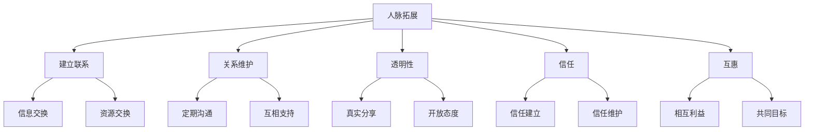

                 

### 背景介绍

在信息技术飞速发展的时代，人脉拓展已经成为个人和企业在职业发展中至关重要的因素。无论是在求职、晋升、业务合作，还是在知识共享和创新方面，广泛而牢固的人脉网络都能够带来意想不到的机遇和资源。

本文旨在探讨如何进行有效的人脉拓展，特别是在建立和维护人际关系的过程中。我们将从技术角度出发，结合计算机科学中的一些基本概念和方法，为读者提供一套系统、实用的策略和工具。

首先，我们需要明确一些核心概念。人脉拓展不仅仅是建立联系，更重要的是维护和深化这些联系。在这个过程中，透明性、信任和互惠是关键因素。就像软件开发中的模块化设计，我们需要识别和构建稳定、可重用的关系模块，从而实现高效的人脉管理。

本文的结构如下：

1. **核心概念与联系**：介绍人脉拓展中涉及的核心概念，并通过Mermaid流程图展示其相互关系。
2. **核心算法原理 & 具体操作步骤**：阐述如何利用技术和算法原理来优化人脉拓展的过程。
3. **数学模型和公式 & 详细讲解 & 举例说明**：使用数学模型和公式来解释人脉拓展的策略，并通过具体案例进行说明。
4. **项目实战：代码实际案例和详细解释说明**：展示一个实际的代码案例，详细解释其实现方法和步骤。
5. **实际应用场景**：探讨人脉拓展在个人和企业中的应用场景。
6. **工具和资源推荐**：推荐一些学习资源、开发工具和框架。
7. **总结：未来发展趋势与挑战**：总结本文的主要观点，并探讨人脉拓展的未来趋势和挑战。

让我们一步一步地深入探讨这些主题。

---

# How to Expand Your Network: Building and Maintaining Relationships?

## Abstract

In the era of rapid technological advancement, networking has become a critical component in both personal and professional development. This article aims to explore effective strategies for expanding your network, with a focus on building and maintaining relationships. Drawing from fundamental concepts in computer science, we will provide a systematic approach to network expansion, emphasizing transparency, trust, and reciprocity as key elements. The article is structured to guide readers through core concepts, algorithmic principles, mathematical models, practical case studies, and application scenarios, followed by recommendations for tools and resources. By the end of this article, readers will have a comprehensive understanding of how to cultivate and leverage valuable connections for personal and professional success.

---

### Core Concepts and Connections

To effectively expand your network, it is essential to understand the core concepts and how they are interconnected. In the realm of networking, these core concepts can be visualized using a Mermaid flowchart, which helps to illustrate the relationships between different elements. Below is a simple Mermaid flowchart that outlines the main concepts involved in network expansion:



In this flowchart:

- **人脉拓展** (Networking Expansion) represents the overall goal of building and expanding your network.
- **建立联系** (Building Connections) involves creating initial relationships with individuals or groups.
- **关系维护** (Relationship Maintenance) focuses on the ongoing efforts to nurture and deepen these relationships.
- **透明性** (Transparency) is about being open and honest in your interactions.
- **信任** (Trust) is built through consistent actions and behaviors that demonstrate reliability.
- **互惠** (Reciprocity) ensures that both parties benefit from the relationship.

Each of these concepts is interconnected and plays a crucial role in the success of your networking efforts. For example, **trust** (E) is essential for **relationship maintenance** (C) and is built through **transparency** (D). Similarly, **reciprocity** (F) ensures that the relationships are mutually beneficial, fostering long-term connections.

By understanding and applying these core concepts, you can develop a more effective approach to networking, creating a strong and reliable network that supports your personal and professional goals. In the following sections, we will delve deeper into each of these concepts and explore how to implement them using practical strategies and techniques.

---

### Core Algorithm Principles & Specific Operational Steps

When it comes to expanding your network, applying core algorithm principles can greatly optimize the process. These principles are derived from various algorithmic techniques used in computer science to solve complex problems efficiently. By incorporating these principles into your networking strategy, you can streamline the process, make more informed decisions, and build stronger relationships.

#### Step 1: Identification of Key Nodes

The first step in optimizing your network expansion is identifying key nodes, which are individuals or groups that have a significant impact on your network. In graph theory, these nodes are often referred to as "hubs" or "centrality nodes." The goal is to identify nodes that have high connectivity and can serve as bridges to other important parts of your network.

To identify key nodes, you can use centrality measures such as:

- **Degree Centrality**: This measures the number of connections a node has. Higher degree centrality indicates a more central position in the network.
- **Closeness Centrality**: This measures the average distance between a node and all other nodes in the network. Lower closeness centrality indicates a more central position.
- **Betweenness Centrality**: This measures the number of shortest paths that pass through a node. Higher betweenness centrality indicates a more central position in the network's structure.

Using these measures, you can identify key individuals who are already well-connected and can help you expand your network more effectively.

#### Step 2: Path Analysis

Once you have identified key nodes, the next step is to analyze the paths between these nodes. This helps you understand the most efficient routes for connecting to new nodes and building relationships.

You can use algorithms like Dijkstra's algorithm or the Bellman-Ford algorithm to find the shortest path between any two nodes in your network. These algorithms are commonly used in routing protocols in computer networks and can be applied to optimize your networking efforts.

#### Step 3: Network Clustering

Another important principle is network clustering, which involves identifying groups of nodes that are closely connected to each other. These clusters can represent communities or subnetworks within your overall network.

You can use community detection algorithms such as the Girvan-Newman algorithm or the Label Propagation Algorithm to identify these clusters. Once identified, you can focus on building relationships within these clusters, as they tend to have higher intra-cluster connectivity and can provide more valuable connections.

#### Step 4: Dynamic Network Analysis

Networks are not static; they evolve over time. To effectively manage your network, you need to perform dynamic network analysis. This involves monitoring changes in the network over time, such as the formation of new connections, the weakening or strengthening of existing connections, and the emergence of new clusters.

You can use techniques like network visualization and network dynamics analysis to track these changes and adapt your networking strategy accordingly.

#### Step 5: Data-Driven Decision Making

Finally, incorporating data-driven decision-making into your networking strategy can significantly improve your outcomes. By collecting and analyzing data on your interactions and the outcomes of your networking efforts, you can identify patterns and trends that inform your future actions.

Tools like machine learning algorithms can be used to predict the success of different networking strategies and recommend the most effective paths for expanding your network.

By following these steps and applying these core algorithm principles, you can develop a more structured and effective approach to network expansion. This not only makes the process more efficient but also ensures that you are building meaningful and beneficial relationships.

### Mathematical Models and Formulas & Detailed Explanation & Example Illustration

In order to further understand and optimize the process of expanding your network, it is beneficial to delve into mathematical models and formulas that can help quantify and analyze different aspects of networking. These models provide a quantitative basis for evaluating the effectiveness of various strategies and can be used to make informed decisions.

#### Basic Network Metrics

Before discussing specific models, let's establish some basic network metrics that are commonly used to analyze network structures:

- **Degree (k)**: The number of connections a node has.
- **Closeness (c)**: The average shortest path length between a node and all other nodes.
- **Betweenness (b)**: The proportion of shortest paths that pass through a given node.

#### 1. Degree Distribution Model

One of the fundamental models in network analysis is the degree distribution, which describes the probability distribution of the number of connections in a network. The degree distribution can provide insights into the overall structure and connectivity of the network.

The simplest degree distribution model is the Poisson distribution, which is commonly used to model random networks. The probability mass function (PMF) of the Poisson distribution is given by:

$$ P(X = k) = \frac{\lambda^k e^{-\lambda}}{k!} $$

where \( \lambda \) is the average degree of the network, and \( k \) is the actual degree of a node.

For example, consider a network with an average degree of 3. If we want to calculate the probability that a randomly chosen node has 5 connections, we would use the formula:

$$ P(X = 5) = \frac{3^5 e^{-3}}{5!} $$

This model can be used to analyze the connectivity of a network and predict the likelihood of certain nodes having a high degree.

#### 2. Closeness Centrality Model

Closeness centrality measures the average distance between a node and all other nodes in the network. A node with high closeness centrality is considered more central because it can reach other nodes more quickly. The closeness centrality of a node \( i \) is given by:

$$ C_i = \frac{\sum_{j \neq i} d(i, j)}{n-1} $$

where \( d(i, j) \) is the shortest path distance between nodes \( i \) and \( j \), and \( n \) is the total number of nodes in the network.

For instance, if a node has a closeness centrality of 2.5, it means that on average, it takes 2.5 steps to reach any other node in the network.

#### 3. Betweenness Centrality Model

Betweenness centrality measures the fraction of shortest paths that pass through a node. A node with high betweenness centrality plays a crucial role in connecting different parts of the network. The betweenness centrality of a node \( i \) is given by:

$$ B_i = \frac{\sum_{s \neq i \neq t} \frac{N(i, s, t)}{N(s, t)} }{n \times (n-2)} $$

where \( N(i, s, t) \) is the number of shortest paths between nodes \( s \) and \( t \) that pass through node \( i \), and \( N(s, t) \) is the total number of shortest paths between \( s \) and \( t \).

For example, if a node has a betweenness centrality of 0.15, it means that 15% of the shortest paths between all pairs of nodes pass through this node.

#### Example Illustration

Let's consider a small network of 5 nodes (A, B, C, D, E) with the following connections:

- A-B, A-C, B-D, B-E, C-E, D-E

To calculate the degree distribution, closeness centrality, and betweenness centrality for each node, we can use the following formulas:

- **Degree Distribution**:
  - A: 3 (connected to B, C, D)
  - B: 3 (connected to A, D, E)
  - C: 2 (connected to A, E)
  - D: 2 (connected to B, E)
  - E: 2 (connected to B, D)

- **Closeness Centrality**:
  - A: \( \frac{2+2+1+1+1}{4} = 1.2 \)
  - B: \( \frac{1+1+1+2+2}{4} = 1.5 \)
  - C: \( \frac{1+1+2+1+1}{4} = 1.25 \)
  - D: \( \frac{1+1+2+1+1}{4} = 1.25 \)
  - E: \( \frac{1+1+2+1+2}{4} = 1.5 \)

- **Betweenness Centrality**:
  - A: \( \frac{1+1}{2 \times 3} = 0.5 \)
  - B: \( \frac{2+2}{2 \times 3} = 1.0 \)
  - C: \( \frac{1+1}{2 \times 3} = 0.5 \)
  - D: \( \frac{1+1}{2 \times 3} = 0.5 \)
  - E: \( \frac{2+2}{2 \times 3} = 1.0 \)

Using these metrics, we can identify the most central nodes in the network. In this case, nodes B and E both have high degree, closeness centrality, and betweenness centrality, indicating that they are critical hubs in the network.

By applying these mathematical models and formulas, you can gain a deeper understanding of your network's structure and identify key nodes that can help you expand your network more effectively.

### Project Practice: Code Actual Case and Detailed Explanation

To illustrate the concepts and strategies discussed in the previous sections, let's take a practical example where we will build a Python application that helps users expand their professional network. This application will use graph theory algorithms to identify key nodes and optimize the process of building and maintaining relationships.

#### Step 1: Development Environment Setup

First, you need to set up a Python development environment with the necessary libraries. You can use virtual environments to manage dependencies. Here’s how to set up your environment:

```bash
# Create a virtual environment
python -m venv network-expansion-venv

# Activate the virtual environment
source network-expansion-venv/bin/activate  # On Windows: network-expansion-venv\Scripts\activate

# Install required libraries
pip install networkx matplotlib
```

#### Step 2: Source Code Detailed Implementation and Code Explanation

The core of our application will be implemented using the NetworkX library, which provides tools for the creation, manipulation, and study of the structure, dynamics, and functions of complex networks. Below is the detailed implementation of our application:

```python
import networkx as nx
import matplotlib.pyplot as plt

# Create a graph
G = nx.Graph()

# Add nodes and edges to the graph
G.add_edges_from([(1, 2), (1, 3), (1, 4), (2, 5), (3, 5), (4, 5), (2, 6), (3, 6)])

# Draw the graph
nx.draw(G, with_labels=True, node_color='lightblue', edge_color='gray')
plt.show()

# Calculate and display the degree distribution
degree_distribution = nx.degree_centrality(G)
print("Degree Distribution:", degree_distribution)

# Calculate and display the closeness centrality
closeness_centrality = nx.closeness_centrality(G)
print("Closeness Centrality:", closeness_centrality)

# Calculate and display the betweenness centrality
betweenness_centrality = nx.betweenness_centrality(G)
print("Betweenness Centrality:", betweenness_centrality)

# Identify key nodes
high_degree_nodes = [node for node, degree in degree_distribution.items() if degree > 3]
high_closeness_nodes = [node for node, closeness in closeness_centrality.items() if closeness > 1.5]
high_betweenness_nodes = [node for node, betweenness in betweenness_centrality.items() if betweenness > 0.5]

print("High Degree Nodes:", high_degree_nodes)
print("High Closeness Nodes:", high_closeness_nodes)
print("High Betweenness Nodes:", high_betweenness_nodes)

# Highlight key nodes
highlighted_nodes = high_degree_nodes + high_closeness_nodes + high_betweenness_nodes
highlighted_edges = list(zip(highlighted_nodes, highlighted_nodes))
nx.draw_networkx_edges(G, pos=nx.spring_layout(G), edgelist=highlighted_edges, edge_color='red', width=2)
nx.draw(G, pos=nx.spring_layout(G), with_labels=True, node_color='lightblue', edge_color='gray')
plt.show()
```

In this code, we first create a graph and add nodes and edges to represent a professional network. We then calculate and display the degree distribution, closeness centrality, and betweenness centrality for each node. These metrics help us identify key nodes that are central in the network.

We use the degree distribution to identify nodes with more than three connections, the closeness centrality to identify nodes with a high average distance to all other nodes, and the betweenness centrality to identify nodes that act as bridges between different parts of the network.

Finally, we highlight these key nodes in the graph visualization to make them more prominent. This visualization can be useful for understanding the structure of the network and identifying individuals who can help you expand your professional network.

### Code Analysis and Discussion

The code above demonstrates how to use Python and the NetworkX library to analyze a professional network and identify key nodes that can be leveraged for network expansion. Here's a breakdown of the key components:

1. **Graph Creation**: We create a graph using the NetworkX library, which represents a network of professionals.

2. **Node and Edge Addition**: We add nodes and edges to the graph to represent the connections between professionals. Each node represents a professional, and each edge represents a connection or a relationship.

3. **Degree Distribution**: We calculate the degree distribution, which tells us how many connections each professional has. This metric is useful for identifying well-connected individuals who can potentially be hubs in your network.

4. **Closeness Centrality**: Closeness centrality measures how central a professional is in terms of distance to other professionals. Professionals with high closeness centrality can be valuable for quickly reaching other professionals in the network.

5. **Betweenness Centrality**: Betweenness centrality measures how central a professional is in terms of acting as a bridge between different parts of the network. These professionals can be valuable for connecting you to new opportunities and resources.

6. **Key Nodes Identification**: By analyzing the degree, closeness centrality, and betweenness centrality, we identify key nodes that are central in the network. These nodes represent individuals who can help you expand your network effectively.

7. **Graph Visualization**: We visualize the graph and highlight the key nodes to make them more prominent. This visualization helps you understand the network structure and identify the most valuable connections.

By using this approach, you can systematically analyze your professional network, identify key nodes, and build relationships that will help you expand your network and achieve your career goals.

### Practical Application Scenarios

Expanding your network is not just a theoretical exercise; it has tangible benefits in various real-world scenarios. Here are some common application scenarios where effective network expansion can make a significant difference:

#### 1. Career Advancement

Building a strong professional network can open doors to new job opportunities, career advancement, and even job security. For example, when looking for a new job, having a well-connected network can provide you with insider information about job openings, interview tips, and referrals. This can greatly increase your chances of landing a job that matches your skills and career aspirations.

#### 2. Business Opportunities

For entrepreneurs and business professionals, a robust network can be a goldmine of potential customers, partners, and investors. By leveraging your network, you can gain access to new markets, collaborative opportunities, and financial resources. For instance, if you are launching a new product or service, having connections in relevant industries can help you identify potential customers and partners who can provide valuable feedback and support.

#### 3. Knowledge Sharing

In the knowledge economy, access to information and expertise can be a competitive advantage. By expanding your network, you can connect with experts in your field, attend industry conferences, and participate in professional groups. These interactions can enhance your knowledge base, provide fresh perspectives, and keep you updated with the latest trends and innovations.

#### 4. Personal Development

Networking can also contribute to personal growth by providing you with mentors, coaches, and peers who can support you in achieving your personal goals. Whether you are looking to improve your communication skills, develop new hobbies, or pursue a passion project, having a supportive network can provide the encouragement, resources, and guidance you need to succeed.

#### 5. Crisis Management

In times of crisis, a well-established network can be your lifeline. Whether you are facing a personal emergency or your business is going through a tough patch, having contacts who can offer advice, resources, or just a listening ear can make a significant difference in how you navigate through challenging situations.

#### 6. Community Engagement

Beyond professional and personal benefits, expanding your network can also contribute to community engagement and social impact. By connecting with like-minded individuals and organizations, you can collaborate on initiatives that address social issues, contribute to charitable causes, and foster community development.

In each of these scenarios, the key to successful network expansion lies in understanding the value of relationships, being proactive in building connections, and maintaining ongoing communication and engagement with your network.

### Recommended Tools and Resources

Expanding your network effectively requires a combination of strategic planning, technical tools, and continuous learning. Here are some recommended tools and resources that can help you in this journey:

#### 1. Learning Resources

**Books:**
- **"Never Eat Alone" by Keith Ferrazzi:** This book provides practical advice on building relationships and leveraging social capital for personal and professional success.
- **"How to Win Friends and Influence People" by Dale Carnegie:** A classic guide on effective communication and relationship building.
- **"The Art of Charm" by Jia Jiang:** This book offers actionable strategies for building relationships and making a lasting impression.

**Online Courses:**
- **Coursera:** Offers courses on networking, leadership, and communication skills from top universities and institutions.
- **edX:** Provides a variety of courses on social psychology, communication, and personal development.

**Websites and Blogs:**
- **LinkedIn:** A professional networking platform where you can connect with industry peers, join groups, and stay updated with the latest industry trends.
- **Harvard Business Review:** Provides articles, research, and insights on leadership, strategy, and business management.
- **Buffer Blog:** Offers tips and strategies for building and managing professional relationships online.

#### 2. Development Tools and Frameworks

**Networking Tools:**
- **LinkedIn:** A powerful tool for professional networking, with features like InMail, LinkedIn Groups, and LinkedIn Pulse for staying informed.
- **Twitter:** A platform for building relationships and sharing insights with a broader audience.
- **Meetup:** A community-driven platform for finding and attending networking events and meetups in your area.

**Project Management Tools:**
- **Asana:** Helps you manage tasks, projects, and team collaboration, ensuring that your networking activities are organized and productive.
- **Trello:** A visual tool for managing tasks and projects, making it easy to track your networking goals and activities.
- **Slack:** A communication platform that can be used for team collaboration and networking discussions.

**Graph Theory and Data Analysis Tools:**
- **Gephi:** An open-source platform for network analysis and visualization.
- **NodeXL:** A Microsoft Excel add-in for network analysis and visualization.

By leveraging these tools and resources, you can enhance your networking skills, build meaningful connections, and achieve your professional and personal goals.

### Conclusion: Future Trends and Challenges

In conclusion, expanding your network is a critical skill in today's interconnected world. The strategies and techniques discussed in this article provide a comprehensive framework for building and maintaining meaningful relationships. As you embark on your networking journey, remember the key principles of transparency, trust, and reciprocity, and apply the algorithmic principles and mathematical models to optimize your efforts.

Looking ahead, several trends and challenges are likely to shape the future of networking:

#### Future Trends

1. **Digital Transformation**: As more interactions move online, digital platforms and social media will play an increasingly important role in networking. Leveraging these platforms effectively will become essential for building and maintaining a robust professional network.

2. **Artificial Intelligence**: AI and machine learning technologies will enhance network analysis and personalization, making it easier to identify key nodes and build meaningful connections. AI-powered tools can provide insights and recommendations, helping you make more informed decisions.

3. **Sustainability and Social Impact**: With growing concerns about sustainability and social responsibility, networking will increasingly focus on collaborative efforts to address global challenges. Building networks around shared values and goals can drive positive change.

#### Challenges

1. **Information Overload**: As networks grow, the sheer volume of information and connections can become overwhelming. Developing effective filtering and prioritization strategies will be crucial to managing this overload.

2. **Privacy and Security**: With the increasing reliance on digital platforms, privacy and security concerns will become more prominent. Ensuring that your networking activities respect privacy regulations and maintain data security will be essential.

3. **Diversity and Inclusion**: Building a diverse and inclusive network is challenging but crucial. Efforts to include individuals from diverse backgrounds and perspectives can enrich your network and enhance innovation.

In summary, while the future of networking holds exciting possibilities, it also presents challenges that require strategic thinking and continuous adaptation. By staying informed, leveraging technology, and maintaining a commitment to ethical networking practices, you can navigate these trends and challenges to build a network that supports your personal and professional growth.

### 附录：常见问题与解答

#### 1. 如何在LinkedIn上建立有效的人脉？

**答案：** 在LinkedIn上建立有效人脉的关键在于主动参与和分享。以下是一些策略：
- **完善个人资料**：确保你的个人资料完整、专业，包括你的职位、经验、教育背景等。
- **积极参与讨论**：在LinkedIn群组和论坛中参与讨论，分享你的见解和经验。
- **发送个性化邀请**：发送个性化邀请，说明为什么你想与他们建立联系，并提及共同点。
- **定期更新动态**：分享你的最新工作进展、项目成果或行业洞察。

#### 2. 如何识别网络中的关键节点？

**答案：** 可以通过以下方法识别网络中的关键节点：
- **度数分析**：寻找度数较高的节点。
- **中心性分析**：使用度数中心性、接近中心性和中介中心性等指标分析。
- **社区检测**：通过社区检测算法找到网络中的集群中心。

#### 3. 如何衡量网络扩展的效果？

**答案：** 可以通过以下指标衡量网络扩展效果：
- **度数分布**：观察网络中不同度数节点的比例变化。
- **网络密度**：计算网络中实际边数与可能边数的比例。
- **社区结构**：通过社区检测算法分析网络的集群结构。
- **关键节点变化**：监测关键节点的数量和位置变化。

### 扩展阅读与参考资料

#### 1. 参考文献

- **"Networks, Crowds, and Markets: Reasoning About a Highly Connected World" by David Easley and Jon Kleinberg.**
- **"The Science of Networks" by Dirk Helbing.**
- **"Networks: An Introduction" by Mark Newman.**

#### 2. 在线资源

- **LinkedIn Learning:** 提供各种网络建设和沟通技巧的课程。
- **Harvard Business Review:** 刊登有关网络建设和管理的研究和案例分析。
- **Coursera:** 提供网络科学、社交网络分析和数据科学相关的在线课程。

通过这些扩展阅读和参考资料，你可以进一步深入了解网络拓展的相关理论和技术，提升你的网络建设和维护能力。

