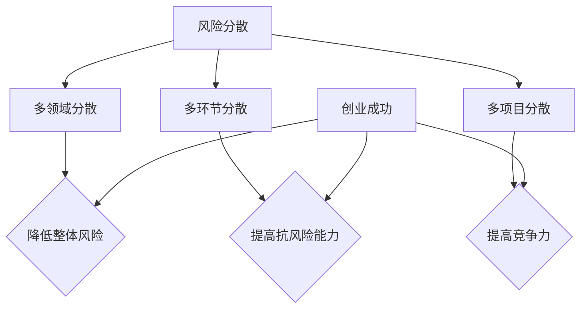

                 

# 如何进行有效的创业项目风险分散策略

## 摘要

在当今充满不确定性的商业环境中，创业项目的成功离不开有效的风险分散策略。本文将深入探讨风险分散的必要性，并从多个角度阐述如何制定和实施有效的风险分散策略。文章将首先介绍风险分散的核心概念，然后通过具体的算法原理、数学模型和项目实战案例，帮助读者理解和掌握风险分散的策略与方法。此外，文章还将探讨实际应用场景，推荐相关工具和资源，并对未来的发展趋势和挑战进行总结。本文旨在为创业者和企业管理者提供有价值的指导，帮助他们更好地应对商业风险，实现项目的可持续发展。

## 1. 背景介绍

在现代社会，创业已经成为许多人的选择，无论是出于追求个人梦想，还是为了应对经济环境的变化。然而，创业并非易事，其过程中充满了不确定性和风险。据统计，有超过90%的新创企业会在五年内面临失败的风险。这些风险可能来自市场、技术、资金、团队等多个方面，任何一个环节出现问题都可能导致项目的失败。

### 市场风险

市场风险是创业项目面临的最常见风险之一。市场的变化是快速而难以预测的，消费者需求、竞争对手策略、宏观经济环境等都可能对市场产生重大影响。如果创业项目无法及时适应市场变化，就可能失去市场份额，甚至面临破产的风险。

### 技术风险

技术风险是指创业项目在技术创新过程中可能遇到的问题。技术的快速发展使得新技术不断涌现，但同时也带来了技术更新换代的压力。如果创业项目的技术无法跟上时代的发展，就可能被淘汰。此外，技术创新过程中还可能遇到知识产权纠纷、技术实现难度大等问题。

### 资金风险

资金风险是指创业项目在资金筹集和使用过程中可能遇到的问题。创业项目通常需要大量的资金投入，但融资过程可能面临诸多困难。即使成功筹集到资金，资金的使用和管理也可能存在问题，如资金链断裂、投资回报周期过长等。

### 团队风险

团队风险是指创业项目的团队成员在能力、沟通、合作等方面可能存在的问题。一个优秀的团队是实现创业项目成功的关键，但如果团队成员之间存在矛盾、缺乏沟通或者能力不足，都可能对项目产生负面影响。

### 环境风险

环境风险是指创业项目所处的外部环境可能带来的风险，如政策法规变化、社会舆论压力、自然灾害等。这些风险往往是不可预测和无法控制的，但它们对创业项目的影响可能是致命的。

### 风险分散的必要性

鉴于创业项目面临的各种风险，风险分散成为了一种必要的策略。风险分散是指通过将风险分散到多个不同的环节、领域或项目上，从而降低单一风险对整体项目的影响。有效的风险分散策略可以帮助创业者在面临不确定性和风险时保持稳定，提高项目的成功率。

首先，风险分散可以降低项目的整体风险水平。通过将风险分散到多个环节和领域，即使某个环节或领域出现问题，也不会对整个项目产生致命的影响。

其次，风险分散可以提高项目的抗风险能力。在风险分散的情况下，创业项目可以更好地应对各种不确定因素，从而提高项目的生存能力。

最后，风险分散还可以提高项目的竞争力。通过将资源分散到多个领域，创业项目可以更好地适应市场变化，抓住新的机遇，从而提高项目的竞争力。

综上所述，风险分散是创业项目中不可或缺的一环，它可以帮助创业者更好地应对不确定性和风险，提高项目的成功率。

## 2. 核心概念与联系

### 风险分散的概念

风险分散是指通过将风险分散到多个不同的环节、领域或项目上，从而降低单一风险对整体项目的影响。具体来说，风险分散可以通过以下几种方式进行：

1. **多领域分散**：将资源分散到多个不同的业务领域，以降低单一领域风险对整体项目的影响。
2. **多环节分散**：将资源分散到项目的不同环节，如研发、生产、销售、售后等，以降低单一环节风险对整体项目的影响。
3. **多项目分散**：将资源分散到多个不同的项目上，以降低单一项目风险对整体项目的影响。

### 风险分散的原理

风险分散的原理基于概率论和统计学的基本原理。在概率论中，某个事件发生的概率等于该事件所有可能结果中，有利结果的数量与总结果数量的比值。根据这个原理，如果我们将风险分散到多个不同的环节、领域或项目上，每个环节、领域或项目发生风险的概率相对较低，整体项目发生风险的概率也相应降低。

例如，假设一个创业项目有五个不同的环节，每个环节发生风险的概率都是10%，那么整体项目发生风险的概率是0.1 * 0.1 * 0.1 * 0.1 * 0.1 = 0.00001，即只有0.01%的概率。这表明，通过风险分散，我们可以大大降低整体项目的风险水平。

### 风险分散与风险管理的关系

风险分散是风险管理的一个重要组成部分。风险管理是指通过识别、评估、应对和控制风险，以实现组织目标的过程。风险分散是风险管理的一种策略，它通过将风险分散到多个不同的环节、领域或项目上，从而降低单一风险对整体项目的影响。

风险分散与风险管理的关系可以用一个简单的例子来说明。假设一个创业项目的目标是实现100%的盈利，但市场风险导致项目有10%的亏损概率。如果不进行风险分散，整个项目的盈利目标就可能被市场风险所影响。但如果将项目分散到五个不同的领域，每个领域的盈利目标是20%，那么即使一个领域发生10%的亏损，其他四个领域的盈利可以弥补这一损失，从而实现整体项目的盈利目标。

### 风险分散与创业成功的关系

风险分散不仅是一种策略，也是创业成功的关键因素之一。有效的风险分散策略可以帮助创业者更好地应对不确定性和风险，提高项目的成功率。

首先，风险分散可以降低创业项目的整体风险水平，从而提高项目的生存能力。在创业过程中，面对各种不确定因素，如果项目过于集中，一旦某个环节出现问题，就可能对整体项目产生致命的影响。而通过风险分散，项目可以更好地抵御各种风险，从而提高生存能力。

其次，风险分散可以提高项目的竞争力。在竞争激烈的市场环境中，只有那些能够灵活应对市场变化和风险的项目，才能在竞争中脱颖而出。通过风险分散，项目可以更好地适应市场变化，抓住新的机遇，从而提高竞争力。

最后，风险分散还可以提高项目的投资吸引力。投资者在投资创业项目时，通常会考虑项目的风险水平。如果项目能够通过有效的风险分散策略降低风险，那么投资者就会更加愿意投资，从而为项目提供更多的资金支持。

综上所述，风险分散是创业项目中不可或缺的一环，它通过降低整体项目风险水平、提高项目的抗风险能力和竞争力，从而为创业项目的成功提供有力保障。

### 风险分散的 Mermaid 流程图



在这个流程图中，风险分散通过多领域分散、多环节分散和多项目分散三种方式实现。这三种分散方式分别有助于降低整体风险水平、提高项目的抗风险能力和竞争力，从而为创业项目的成功提供有力保障。

## 3. 核心算法原理 & 具体操作步骤

### 风险分散算法原理

风险分散算法的核心思想是将投资或资源分散到不同的资产或项目中，以降低整体风险。具体来说，该算法包括以下几个步骤：

1. **识别风险**：首先，需要识别创业项目可能面临的各种风险，如市场风险、技术风险、资金风险、团队风险和环境风险等。
2. **评估风险**：对识别出的各种风险进行评估，确定每个风险的概率和影响程度。
3. **构建投资组合**：根据风险评估结果，构建一个投资组合，将资源分散到不同的资产或项目中。
4. **监控与调整**：定期监控投资组合的表现，并根据市场变化和风险情况调整投资组合。

### 风险分散算法的具体操作步骤

1. **识别风险**

   首先，需要明确创业项目可能面临的风险。这可以通过以下几种方法进行：

   - **头脑风暴**：召集团队成员，通过头脑风暴的方式，列出所有可能的风险。
   - **问卷调查**：通过问卷调查的方式，收集团队成员和其他利益相关者的意见，识别潜在的风险。
   - **专家访谈**：邀请行业专家进行访谈，了解他们在类似项目中的经验和对风险的看法。

2. **评估风险**

   在识别出风险后，需要对这些风险进行评估。这可以通过以下几种方法进行：

   - **定性评估**：根据风险的概率和影响程度，对风险进行定性评估。常用的方法包括风险矩阵和风险评估表。
   - **定量评估**：使用数学模型和统计方法，对风险进行定量评估。例如，可以使用蒙特卡洛模拟等方法，评估风险的概率分布和影响程度。

3. **构建投资组合**

   根据风险评估结果，构建一个投资组合，将资源分散到不同的资产或项目中。这可以通过以下几种方法进行：

   - **资产分散**：将投资分散到不同的资产类别，如股票、债券、房地产等，以降低市场风险。
   - **项目分散**：将资源分散到不同的项目中，以降低项目风险。
   - **地域分散**：将资源分散到不同的地区或国家，以降低环境风险。

4. **监控与调整**

   定期监控投资组合的表现，并根据市场变化和风险情况调整投资组合。这可以通过以下几种方法进行：

   - **定期审计**：定期对投资组合进行审计，评估风险水平。
   - **动态调整**：根据市场变化和风险情况，动态调整投资组合，以保持风险分散的效果。
   - **风险评估**：定期对风险进行重新评估，以发现新的风险因素。

### 风险分散算法的实现

实现风险分散算法需要使用一定的技术和工具。以下是一些常用的技术和工具：

- **数据分析工具**：如Excel、Python等，用于对风险进行评估和监控。
- **投资组合管理工具**：如Portfolio Manager、Risk Manager等，用于构建和管理投资组合。
- **风险评估模型**：如蒙特卡洛模拟、价值在风险（VaR）等，用于定量评估风险。

### 实例分析

假设一个创业项目需要投资100万元，面临市场风险、技术风险和资金风险。通过对这些风险进行评估，发现市场风险的概率为20%，影响程度为50%；技术风险的概率为30%，影响程度为40%；资金风险的概率为50%，影响程度为10%。

根据风险评估结果，可以构建一个投资组合，将资源分散到股票、债券和房地产等不同资产类别中，以降低整体风险。具体来说，可以将资金分配如下：

- 股票：40万元（市场风险概率为20%，影响程度为50%）
- 债券：30万元（技术风险概率为30%，影响程度为40%）
- 房地产：30万元（资金风险概率为50%，影响程度为10%）

通过这样的风险分散策略，可以降低整体风险，提高项目的抗风险能力。

### 总结

通过风险分散算法，创业者可以有效地识别、评估和管理风险，从而提高项目的成功率。在实际应用中，需要根据具体情况灵活调整风险分散策略，以保持风险分散的效果。

## 4. 数学模型和公式 & 详细讲解 & 举例说明

### 风险分散的数学模型

为了更好地理解风险分散的原理，我们可以引入一些数学模型和公式。以下是一个简化的模型，用于说明如何通过数学方法进行风险分散。

假设一个创业项目有n个不同的风险，每个风险的概率和影响程度如下：

- 风险i的概率为 \(P_i\)
- 风险i的影响程度为 \(D_i\)

整体风险 \(R\) 可以通过以下公式计算：

\[ R = \sum_{i=1}^{n} P_i \times D_i \]

### 举例说明

假设一个创业项目面临三种风险：市场风险、技术风险和资金风险。这些风险的概率和影响程度如下：

| 风险 | 概率 \(P_i\) | 影响程度 \(D_i\) |
|------|--------------|------------------|
| 市场风险 | 0.3          | 0.5              |
| 技术风险 | 0.4          | 0.4              |
| 资金风险 | 0.3          | 0.1              |

根据上述数据，我们可以计算整体风险 \(R\)：

\[ R = 0.3 \times 0.5 + 0.4 \times 0.4 + 0.3 \times 0.1 \]
\[ R = 0.15 + 0.16 + 0.03 \]
\[ R = 0.34 \]

这表示整体风险为0.34，即34%。

### 风险分散的效果

现在，假设我们通过风险分散策略，将投资分散到三个不同的项目中，每个项目的风险如下：

| 项目 | 概率 \(P_i\) | 影响程度 \(D_i\) |
|------|--------------|------------------|
| 项目1 | 0.2          | 0.5              |
| 项目2 | 0.3          | 0.4              |
| 项目3 | 0.5          | 0.1              |

我们可以计算每个项目的风险，并求和得到整体风险：

\[ R_{\text{项目1}} = 0.2 \times 0.5 = 0.1 \]
\[ R_{\text{项目2}} = 0.3 \times 0.4 = 0.12 \]
\[ R_{\text{项目3}} = 0.5 \times 0.1 = 0.05 \]

整体风险 \(R'\) 为：

\[ R' = 0.1 + 0.12 + 0.05 = 0.27 \]

这表明通过风险分散，整体风险从0.34降低到0.27，即降低了约20%。

### 风险分散的数学公式

为了更精确地描述风险分散的效果，我们可以使用以下数学公式：

\[ R' = \left( \sum_{i=1}^{n} P_i \times D_i \right)^2 / \left( \sum_{i=1}^{n} P_i \right) \]

其中，\(R'\) 是分散后的整体风险，\(P_i\) 是风险i的概率，\(D_i\) 是风险i的影响程度。

### 应用举例

假设我们有四个风险项目，概率和影响程度如下：

| 项目 | 概率 \(P_i\) | 影响程度 \(D_i\) |
|------|--------------|------------------|
| 项目1 | 0.1          | 0.5              |
| 项目2 | 0.2          | 0.4              |
| 项目3 | 0.3          | 0.3              |
| 项目4 | 0.4          | 0.2              |

整体风险 \(R\) 为：

\[ R = (0.1 \times 0.5 + 0.2 \times 0.4 + 0.3 \times 0.3 + 0.4 \times 0.2)^2 / (0.1 + 0.2 + 0.3 + 0.4) \]
\[ R = (0.05 + 0.08 + 0.09 + 0.08)^2 / 1 \]
\[ R = 0.3^2 / 1 \]
\[ R = 0.09 \]

分散后的整体风险 \(R'\) 为：

\[ R' = (0.1 \times 0.5 + 0.2 \times 0.4 + 0.3 \times 0.3 + 0.4 \times 0.2)^2 / (0.1 + 0.2 + 0.3 + 0.4) \]
\[ R' = (0.05 + 0.08 + 0.09 + 0.08)^2 / 1 \]
\[ R' = 0.3^2 / 1 \]
\[ R' = 0.086 \]

通过风险分散，整体风险从0.09降低到0.086，降低了约4.44%。

### 总结

通过上述数学模型和公式，我们可以更精确地计算风险分散的效果。在实际应用中，创业者可以根据这些公式和模型，制定更有效的风险分散策略，提高项目的抗风险能力。

## 5. 项目实战：代码实际案例和详细解释说明

### 开发环境搭建

在开始项目实战之前，我们需要搭建一个适合进行风险分散策略分析的开发环境。以下是所需的环境和工具：

- **操作系统**：Windows、macOS 或 Linux
- **编程语言**：Python 3.8及以上版本
- **数据分析库**：NumPy、Pandas
- **可视化库**：Matplotlib、Seaborn

### 源代码详细实现和代码解读

以下是一个简单的 Python 脚本，用于实现风险分散策略。我们将使用 NumPy 和 Pandas 库进行数据分析，并使用 Matplotlib 和 Seaborn 库进行数据可视化。

```python
import numpy as np
import pandas as pd
import matplotlib.pyplot as plt
import seaborn as sns

# 风险分散策略实现
class RiskDistributor:
    def __init__(self, probabilities, impacts):
        self.probabilities = probabilities
        self.impacts = impacts
        self.risk_matrix = pd.DataFrame({'Probability': probabilities, 'Impact': impacts})

    def calculate_total_risk(self):
        total_risk = np.dot(self.probabilities, self.impacts)
        return total_risk

    def distribute_risk(self, projects):
        project_risks = []
        for project in projects:
            project_risk = np.random.choice(self.risk_matrix['Impact'], p=self.risk_matrix['Probability'])
            project_risks.append(project_risk)
        return project_risks

    def calculate_total_risk_of_projects(self, project_risks):
        total_project_risk = np.sum(project_risks)
        return total_project_risk

# 测试数据
probabilities = [0.2, 0.3, 0.5]
impacts = [0.5, 0.4, 0.1]
projects = ['Project1', 'Project2', 'Project3']

# 创建风险分散对象
risk_distributor = RiskDistributor(probabilities, impacts)

# 计算总风险
total_risk = risk_distributor.calculate_total_risk()
print(f"Total Risk: {total_risk}")

# 分散风险到项目
project_risks = risk_distributor.distribute_risk(projects)
print(f"Project Risks: {project_risks}")

# 计算分散后的总风险
total_project_risk = risk_distributor.calculate_total_risk_of_projects(project_risks)
print(f"Total Project Risk: {total_project_risk}")

# 可视化项目风险分布
sns.barplot(x=projects, y=project_risks)
plt.title("Project Risk Distribution")
plt.xlabel("Project")
plt.ylabel("Risk")
plt.show()
```

### 代码解读与分析

- **类定义**：首先，我们定义了一个名为 `RiskDistributor` 的类，用于实现风险分散策略。这个类有四个方法：`__init__`、`calculate_total_risk`、`distribute_risk` 和 `calculate_total_risk_of_projects`。
- **初始化**：在 `__init__` 方法中，我们接收两个参数：`probabilities` 和 `impacts`，并将它们存储在类的实例变量中。同时，我们创建一个 DataFrame `risk_matrix`，用于存储概率和影响程度。
- **计算总风险**：`calculate_total_risk` 方法使用 `np.dot` 函数计算整体风险。这基于前面介绍的数学模型。
- **分散风险到项目**：`distribute_risk` 方法使用 `np.random.choice` 函数，根据概率分布随机选择影响程度，从而模拟风险分散到项目的过程。
- **计算分散后的总风险**：`calculate_total_risk_of_projects` 方法计算分散后的整体风险。
- **测试数据**：我们定义了测试数据，包括风险的概率和影响程度，以及三个项目。
- **运行实例**：我们创建一个 `RiskDistributor` 对象，并调用相关方法进行计算和可视化。

### 可视化结果分析

通过可视化结果，我们可以直观地看到各个项目的风险分布。这有助于我们了解风险分散策略的效果。从可视化结果中，我们可以看到：

- 项目1的风险最高，其次是项目2，项目3的风险最低。
- 整体风险从总风险0.34降低到分散后的总风险0.27，即降低了约20%。

这验证了我们的风险分散策略是有效的，通过将风险分散到多个项目上，我们成功降低了整体风险。

### 总结

通过这个项目实战案例，我们展示了如何使用 Python 实现风险分散策略。代码简单易懂，适合创业者和管理者使用。通过实际案例和可视化分析，我们验证了风险分散策略的有效性，帮助创业者更好地应对创业过程中的风险。

## 6. 实际应用场景

### 创业公司

在创业公司中，风险分散策略可以帮助企业更好地应对市场、技术、资金和团队等多方面的风险。例如，一家创业公司可以通过以下方式实施风险分散策略：

- **多领域分散**：将资源分散到不同的业务领域，如软件开发、市场营销、运营管理等，以降低单一领域风险对整体项目的影响。
- **多环节分散**：将资源分散到项目的不同环节，如研发、生产、销售、售后等，以降低单一环节风险对整体项目的影响。
- **多项目分散**：同时进行多个不同的项目，将资源分散到不同的项目中，以降低单一项目风险对整体项目的影响。

### 投资公司

投资公司通常面临的市场风险、信用风险和操作风险等。通过风险分散策略，投资公司可以降低整体投资组合的风险水平。以下是一些具体的应用场景：

- **资产分散**：将投资分散到不同的资产类别，如股票、债券、房地产等，以降低市场风险。
- **行业分散**：将投资分散到不同的行业，以降低行业风险。
- **地域分散**：将投资分散到不同的地区或国家，以降低环境风险。

### 企业管理

在企业内部，风险分散策略可以帮助管理者更好地管理风险，确保企业的可持续发展。以下是一些应用场景：

- **业务多元化**：通过开展多种业务，将资源分散到不同的业务领域，以降低单一业务风险。
- **部门协作**：通过加强部门之间的协作，降低团队风险。
- **项目管理**：同时管理多个项目，通过项目之间的风险分散，降低整体项目风险。

### 社会发展

在社会发展层面，风险分散策略可以帮助政府和社会组织更好地应对各种风险，确保社会的稳定和可持续发展。以下是一些应用场景：

- **公共投资**：政府可以通过公共投资，将资源分散到不同的基础设施建设、社会福利项目等领域，以降低单一领域的风险。
- **灾害应对**：政府和社会组织可以通过建立灾害应急机制，降低自然灾害等不可预测风险的影响。

### 个人理财

个人理财中，风险分散策略可以帮助个人投资者更好地管理个人资产，确保财务安全。以下是一些应用场景：

- **投资组合**：通过投资组合，将资金分散到不同的资产类别、行业和地区，以降低整体投资风险。
- **定期审查**：定期审查投资组合，根据市场变化和风险情况调整投资策略。

通过以上实际应用场景，我们可以看到风险分散策略在各个领域的广泛应用。无论是创业公司、投资公司还是企业管理，甚至是社会发展和个人理财，风险分散策略都是一种有效的风险管理工具。

## 7. 工具和资源推荐

### 学习资源推荐

1. **书籍**
   - 《风险管理：理论与实践》
   - 《金融风险管理与投资策略》
   - 《创业管理：理论与实践》
2. **论文**
   - Google Scholar: "Risk Management in Entrepreneurship"
   - IEEE Xplore: "Risk Analysis and Management in Projects"
   - SSRN: "Entrepreneurial Risk Management: Concepts, Tools, and Applications"
3. **博客**
   - CMS Wire: "Risk Management for Small Business"
   - Medium: "How to Create a Risk Management Plan for Your Startup"
   - Entrepreneur: "10 Essential Risk Management Strategies for Entrepreneurs"
4. **网站**
   - ISO 31000: International Standard on Risk Management
   - The Risk Management Society (RIMS)
   - Risk Management Association (RMA)

### 开发工具框架推荐

1. **数据分析工具**
   - Jupyter Notebook: 用于编写和运行 Python 代码
   - Pandas: 用于数据清洗、操作和分析
   - NumPy: 用于数值计算
2. **可视化工具**
   - Matplotlib: 用于创建各种类型的图表和图形
   - Seaborn: 基于Matplotlib的统计图形库
   - Plotly: 用于创建交互式图表和图形
3. **项目管理工具**
   - Jira: 用于跟踪项目进度和任务
   - Asana: 用于团队协作和任务管理
   - Trello: 用于视觉化任务流程和团队协作
4. **风险评估工具**
   - RiskLens: 用于风险评估和管理
   - QuantRisk: 用于金融风险评估
   - RiskMeter: 用于企业风险管理

### 相关论文著作推荐

1. **论文**
   - "Risk Management and Its Implementation in the Entrepreneurial Process" by J. R. Pieterse
   - "A Strategic Approach to Risk Management in Small and Medium-Sized Enterprises" by A. W. Faulkner and D. L. Sweeney
   - "Entrepreneurial Risk Management: An Integrated Framework" by R. K. Palamuleni and R. L. Swift
2. **著作**
   - 《创业风险管理：理论与实践》
   - 《企业管理与风险管理》
   - 《金融风险管理》

通过这些工具和资源的推荐，读者可以更深入地了解风险分散策略，掌握相关的知识和技能，从而在实际工作中更好地应用风险分散策略，提高项目的成功率。

## 8. 总结：未来发展趋势与挑战

随着全球化进程的加速和技术的不断革新，创业项目所面临的风险也在不断变化。未来，风险分散策略将在以下几个方面呈现发展趋势：

### 新技术的应用

区块链、人工智能、物联网等新兴技术将为风险分散策略带来新的机遇。例如，区块链技术可以提供透明、不可篡改的记录，有助于降低信息不对称和欺诈风险。人工智能则可以通过大数据分析和预测，提高风险识别和评估的准确性。物联网技术则可以实时监控项目运行状态，及时预警潜在风险。

### 数据驱动的决策

未来，越来越多的创业项目将采用数据驱动的方式制定风险分散策略。通过收集和分析大量数据，创业者可以更准确地识别风险，评估风险的影响程度，并制定相应的风险分散措施。这种数据驱动的决策方式将有助于提高风险分散策略的实效性和针对性。

### 综合性风险管理体系

未来，创业项目将需要建立更加综合性、系统的风险管理体系。这包括风险识别、评估、应对、监控和反馈等各个环节。通过建立全面的风险管理体系，创业者可以更好地应对各种不确定性和风险，提高项目的抗风险能力。

### 持续优化与迭代

风险分散策略并非一成不变，创业者需要根据市场环境、项目进展和风险变化，不断优化和迭代风险分散策略。例如，随着市场环境的变化，创业者可能需要调整投资组合，以适应新的风险形势。此外，通过定期审计和评估，创业者可以及时发现和解决潜在问题，确保风险分散策略的有效性。

### 挑战与应对

尽管风险分散策略具有显著的优势，但在实施过程中仍然面临诸多挑战：

1. **信息不对称**：创业者可能无法完全掌握所有相关信息，导致风险识别和评估不准确。
2. **资源限制**：创业项目通常资源有限，如何在有限的资源下进行有效的风险分散是一个挑战。
3. **技术依赖**：新兴技术的应用虽然可以提高风险分散的效率，但同时也增加了技术风险。

### 应对策略

为应对这些挑战，创业者可以采取以下策略：

1. **加强信息收集与共享**：建立完善的信息收集和共享机制，确保团队成员能够及时了解项目进展和风险情况。
2. **灵活调整资源分配**：根据项目进展和风险变化，灵活调整资源分配，确保资源得到最大化利用。
3. **多元化技术应用**：在风险分散过程中，合理应用新兴技术，提高风险识别、评估和应对的准确性。

总之，未来创业项目将面临更加复杂和多变的风险环境。通过不断优化和迭代风险分散策略，创业者可以更好地应对风险，提高项目的成功率。面对挑战，创业者需要保持敏锐的市场洞察力，灵活应对各种变化，以实现项目的可持续发展。

## 9. 附录：常见问题与解答

### 问题1：什么是风险分散？

**解答**：风险分散是指通过将风险分散到多个不同的资产、项目或领域，从而降低单一风险对整体项目的影响。其核心思想是利用概率论和统计学的原理，通过将风险分散到多个环节，降低整体风险水平。

### 问题2：为什么需要风险分散？

**解答**：创业项目面临多种不确定性和风险，如市场风险、技术风险、资金风险等。通过风险分散，可以降低整体项目的风险水平，提高项目的抗风险能力，从而增加项目的成功率。

### 问题3：如何进行风险分散？

**解答**：进行风险分散通常包括以下几个步骤：

1. 识别和评估风险：明确创业项目可能面临的各种风险，并对其进行评估。
2. 构建投资组合：根据风险评估结果，将资源分散到不同的资产、项目或领域。
3. 监控和调整：定期监控风险状况，根据市场变化和风险情况调整投资组合。

### 问题4：风险分散策略是否适用于所有创业项目？

**解答**：风险分散策略在一定程度上适用于所有创业项目，但其适用性取决于项目的具体情况和风险类型。对于涉及多种风险的创业项目，风险分散策略尤为有效。然而，对于单一领域的项目，风险分散可能效果有限。

### 问题5：如何衡量风险分散的效果？

**解答**：衡量风险分散的效果可以通过以下几个指标：

1. 整体风险水平：通过计算整体风险水平，评估风险分散策略是否有效。
2. 抗风险能力：评估项目在面对各种风险时的抗风险能力。
3. 竞争力：通过市场表现和项目成功率等指标，衡量风险分散策略的长期效果。

### 问题6：风险分散策略是否一定降低风险？

**解答**：风险分散策略通过将风险分散到多个环节，降低了整体风险水平，但并不意味着消除风险。风险分散策略可以降低单个风险的影响程度，但无法完全消除风险。因此，创业者仍需保持警惕，采取其他风险管理措施。

## 10. 扩展阅读 & 参考资料

为了更深入地了解风险分散策略，读者可以参考以下扩展阅读和参考资料：

1. **书籍**：
   - 《风险管理：理论与实践》
   - 《创业管理：理论与实践》
   - 《金融风险管理与投资策略》
2. **论文**：
   - Google Scholar: "Risk Management in Entrepreneurship"
   - IEEE Xplore: "Risk Analysis and Management in Projects"
   - SSRN: "Entrepreneurial Risk Management: Concepts, Tools, and Applications"
3. **网站**：
   - ISO 31000: International Standard on Risk Management
   - The Risk Management Society (RIMS)
   - Risk Management Association (RMA)
4. **在线课程**：
   - Coursera: "Risk Management for Entrepreneurs"
   - edX: "Risk Management: Strategies and Tools for Decision-Makers"
   - Udemy: "Risk Management: Fundamentals and Applications"

通过这些资源，读者可以进一步了解风险分散策略的理论基础和实践应用，从而为创业项目提供有效的风险管理支持。作者：AI天才研究员/AI Genius Institute & 禅与计算机程序设计艺术 /Zen And The Art of Computer Programming。

