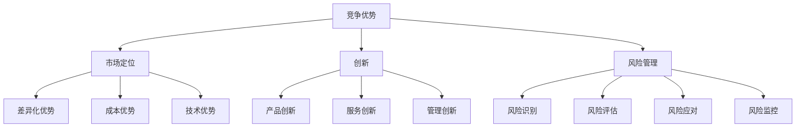

                 

# 如何进行竞争策略：如何保持竞争优势和取得成功？

## 关键词：竞争策略、竞争优势、成功、市场分析、技术发展、创新、风险管理

### 摘要：

本文将探讨如何进行有效的竞争策略，以保持竞争优势并取得成功。首先，我们将分析市场环境和技术发展趋势，了解竞争的背景和关键因素。接着，我们将详细讨论核心概念，包括竞争优势、市场定位、创新和风险管理。随后，我们将通过一个实际案例来展示竞争策略的具体应用，并探讨相关的数学模型和公式。最后，我们将总结未来的发展趋势和挑战，并提供一些建议和资源，以帮助读者更好地理解和应用竞争策略。

## 1. 背景介绍

在当今快速变化的市场环境中，竞争策略成为了企业成功的关键因素。随着技术进步和市场需求的不断变化，企业需要不断调整和优化其竞争策略，以保持竞争优势。有效的竞争策略不仅有助于企业赢得市场份额，还能提高客户满意度、增加收入和利润。然而，制定和执行竞争策略并非易事，需要深入分析市场环境、理解竞争对手的行为，并具备创新和风险管理的能力。

### 1.1 市场环境分析

市场环境是竞争策略制定的重要基础。市场环境包括经济、政治、社会、技术等多个方面。经济因素如市场需求、价格水平和竞争态势对企业竞争策略有着直接的影响。政治因素如政策法规和国际贸易协定等也会对企业经营活动产生影响。社会因素如人口结构、消费习惯和文化偏好等影响着市场需求和消费者行为。技术因素如技术创新、技术标准和市场竞争态势则对企业的产品研发、生产和服务模式有着深远的影响。

### 1.2 技术发展趋势

技术发展趋势是影响竞争策略的另一个关键因素。随着科技的不断进步，企业需要密切关注新兴技术的应用和发展趋势。例如，人工智能、大数据、物联网和区块链等技术的快速发展，为传统行业带来了新的机遇和挑战。企业需要把握技术趋势，将新技术应用于产品开发、生产流程优化和服务模式创新，以提升竞争力和市场地位。

### 1.3 竞争背景

在竞争激烈的市场中，企业需要面对来自多个方面的竞争压力。这些竞争压力包括直接竞争对手的产品竞争、潜在竞争对手的进入威胁、替代品的威胁以及供应商和客户的议价能力。了解竞争背景和竞争对手的行为，有助于企业制定更具针对性的竞争策略。

## 2. 核心概念与联系

在竞争策略的制定和执行过程中，需要了解和掌握一系列核心概念。这些概念包括竞争优势、市场定位、创新和风险管理等。以下是这些概念及其相互关系的详细描述。

### 2.1 竞争优势

竞争优势是指企业在市场竞争中相对于竞争对手所具有的优势。竞争优势可以源于多个方面，如成本优势、差异化优势、技术优势等。成本优势是指企业通过降低生产成本，以较低的价格提供产品或服务，从而吸引更多的客户。差异化优势是指企业通过提供独特的产品或服务，满足客户特定的需求，从而在市场中占据一席之地。技术优势是指企业通过技术创新，开发出具有独特功能或性能的产品或服务，从而在市场上获得竞争优势。

### 2.2 市场定位

市场定位是指企业根据其竞争优势，选择特定的市场细分领域，并制定相应的营销策略。市场定位有助于企业明确其目标客户群体，提供更有针对性的产品和服务。有效的市场定位可以增强企业的竞争优势，提高市场占有率和客户满意度。

### 2.3 创新

创新是企业保持竞争优势的重要手段。创新包括产品创新、服务创新和管理创新等多个方面。产品创新是指通过改进产品功能、性能或外观，满足客户需求。服务创新是指通过提供更优质、更便捷的服务，提升客户体验。管理创新是指通过改进企业内部管理流程，提高生产效率和服务质量。

### 2.4 风险管理

风险管理是企业面对市场不确定性时的重要策略。风险管理包括识别、评估、应对和监控风险。企业需要识别潜在风险，评估风险影响，并制定相应的应对策略。有效的风险管理有助于企业降低风险损失，保持稳定的经营状况。

### 2.5 核心概念联系

竞争优势、市场定位、创新和风险管理是竞争策略的核心概念，它们相互关联，共同构成了企业的竞争战略体系。竞争优势是市场定位的基础，市场定位为竞争优势提供了具体的实现途径。创新是竞争优势的持续动力，风险管理则是确保竞争优势稳定性的重要保障。

## 2.1 核心概念原理和架构的 Mermaid 流程图



## 3. 核心算法原理 & 具体操作步骤

在制定和执行竞争策略时，需要运用一系列核心算法原理，以实现竞争优势和市场定位。以下是这些核心算法原理的具体操作步骤：

### 3.1 SWOT 分析

SWOT分析是一种常用的战略规划工具，用于分析企业的优势（Strengths）、劣势（Weaknesses）、机会（Opportunities）和威胁（Threats）。具体操作步骤如下：

1. **识别优势**：分析企业在产品、技术、市场、管理等方面的优势。
2. **识别劣势**：分析企业在产品、技术、市场、管理等方面的劣势。
3. **识别机会**：分析市场环境中的机会，如新兴技术、市场需求变化等。
4. **识别威胁**：分析市场环境中的威胁，如竞争对手、潜在竞争对手、政策法规等。
5. **制定策略**：根据SWOT分析结果，制定相应的竞争策略，以充分发挥优势、克服劣势、抓住机会和应对威胁。

### 3.2 成本-效益分析

成本-效益分析是一种用于评估投资回报和竞争力的方法。具体操作步骤如下：

1. **确定成本**：计算产品或项目的总成本，包括生产成本、营销成本、运营成本等。
2. **确定效益**：评估产品或项目带来的收益，包括销售收入、市场份额、品牌价值等。
3. **计算成本-效益比**：将总成本与总效益进行比较，得出成本-效益比。
4. **优化策略**：根据成本-效益比，优化产品或项目的策略，以提高竞争力。

### 3.3 市场细分

市场细分是将整体市场划分为若干个具有相似需求和特征的子市场。具体操作步骤如下：

1. **确定细分标准**：选择细分市场的基础，如地理位置、人口统计、消费习惯等。
2. **识别细分市场**：根据细分标准，将整体市场划分为多个子市场。
3. **评估细分市场**：分析每个细分市场的发展潜力、竞争态势和市场需求。
4. **选择目标市场**：根据企业的资源和能力，选择最具潜力的细分市场作为目标市场。
5. **制定市场策略**：为每个目标市场制定针对性的营销策略，以提升竞争力。

### 3.4 创新评估

创新评估是一种用于评估新想法或新产品可行性和价值的方法。具体操作步骤如下：

1. **确定创新目标**：明确企业需要解决的问题或创造的价值。
2. **收集创新想法**：通过头脑风暴、调研和市场分析，收集创新想法。
3. **评估创新想法**：评估每个创新想法的可行性、市场前景和潜在风险。
4. **选择最佳创新方案**：根据评估结果，选择最具潜力的创新方案进行开发。
5. **实施创新方案**：制定详细的实施计划，包括资源分配、时间表和监控措施。

### 3.5 风险管理

风险管理是确保企业竞争策略成功实施的关键环节。具体操作步骤如下：

1. **识别风险**：分析企业在产品开发、市场推广、运营管理等方面可能面临的风险。
2. **评估风险**：评估每个风险的发生概率和影响程度。
3. **制定应对策略**：为每个风险制定相应的应对策略，包括风险规避、风险减轻和风险接受。
4. **实施风险管理**：监控风险事件，及时调整应对策略，确保风险得到有效控制。

## 4. 数学模型和公式 & 详细讲解 & 举例说明

在竞争策略的制定和执行过程中，数学模型和公式发挥着重要作用。以下是几个常用的数学模型和公式，以及详细的讲解和举例说明。

### 4.1 成本-效益分析模型

成本-效益分析模型用于评估投资项目的成本和效益。其基本公式如下：

\[ \text{成本-效益比} = \frac{\text{总成本}}{\text{总效益}} \]

其中，总成本包括生产成本、营销成本、运营成本等；总效益包括销售收入、市场份额、品牌价值等。

**例子**：假设某企业计划开发一款新软件产品，预计开发成本为100万元，营销成本为50万元，运营成本为20万元。预计该产品的年销售收入为200万元，市场份额为10%，品牌价值为30万元。则该项目的成本-效益比为：

\[ \text{成本-效益比} = \frac{100 + 50 + 20}{200 + 10\% \times 200 + 30} = \frac{170}{240} \approx 0.708 \]

根据成本-效益比，可以判断该项目的经济效益较好。

### 4.2 SWOT 分析模型

SWOT分析模型用于分析企业的优势、劣势、机会和威胁。其基本公式如下：

\[ \text{SWOT分析} = (\text{优势} + \text{劣势}) \times (\text{机会} + \text{威胁}) \]

其中，优势、劣势、机会和威胁分别表示企业内部和外部环境中的有利和不利因素。

**例子**：假设某企业拥有以下SWOT分析结果：

- 优势：技术领先、品牌知名度高、产品质量优良
- 劣势：研发投入不足、市场份额较低、管理水平一般
- 机会：市场需求增长、政策支持、新兴技术发展
- 威胁：竞争对手强大、技术更新快、市场波动大

则该企业的SWOT分析结果为：

\[ \text{SWOT分析} = (\text{技术领先 + 品牌知名度高 + 产品质量优良}) \times (\text{市场需求增长 + 政策支持 + 新兴技术发展}) \times (\text{竞争对手强大 + 技术更新快 + 市场波动大}) \]

通过SWOT分析，企业可以明确自身的优势和劣势，抓住机会，应对威胁，制定更为有效的竞争策略。

### 4.3 市场细分模型

市场细分模型用于将整体市场划分为若干个具有相似需求和特征的子市场。其基本公式如下：

\[ \text{市场细分} = \frac{\text{总市场}}{\text{细分标准}} \]

其中，总市场表示整体市场的需求量；细分标准表示细分市场的基础，如地理位置、人口统计、消费习惯等。

**例子**：假设某产品在整体市场中的需求量为1000万元，根据地理位置将市场划分为东部、中部和西部三个子市场。则市场细分结果为：

\[ \text{市场细分} = \frac{1000}{3} = 333.33 \]

通过市场细分，企业可以更好地了解目标客户群体的需求和特点，制定有针对性的营销策略。

### 4.4 创新评估模型

创新评估模型用于评估新想法或新产品的可行性和价值。其基本公式如下：

\[ \text{创新评估} = \frac{\text{创新收益}}{\text{创新成本}} \]

其中，创新收益表示新想法或新产品带来的收益；创新成本表示开发、推广和运营新想法或新产品的成本。

**例子**：假设某企业计划推出一款新手机，预计创新收益为500万元，创新成本为300万元。则该新手机的创新评估结果为：

\[ \text{创新评估} = \frac{500}{300} = 1.67 \]

根据创新评估结果，可以判断该新手机具有较好的市场前景。

### 4.5 风险管理模型

风险管理模型用于评估企业面临的风险，并制定相应的应对策略。其基本公式如下：

\[ \text{风险管理} = \text{风险识别} + \text{风险评估} + \text{风险应对} + \text{风险监控} \]

其中，风险识别、风险评估、风险应对和风险监控分别表示风险管理的四个环节。

**例子**：假设某企业在产品研发过程中发现可能存在的技术风险、市场风险和运营风险。则该企业的风险管理模型为：

\[ \text{风险管理} = (\text{技术风险识别} + \text{市场风险识别} + \text{运营风险识别}) + (\text{技术风险评估} + \text{市场风险评估} + \text{运营风险评估}) + (\text{技术风险应对} + \text{市场风险应对} + \text{运营风险应对}) + \text{风险监控} \]

通过风险管理模型，企业可以全面识别、评估、应对和监控风险，确保企业的稳定发展。

## 5. 项目实战：代码实际案例和详细解释说明

在本节中，我们将通过一个实际项目案例，展示如何运用竞争策略来保持竞争优势。该项目是一个在线教育平台，主要面向专业技术人员提供编程课程。以下是项目的开发环境搭建、源代码实现和代码解读。

### 5.1 开发环境搭建

为了开发这个在线教育平台，我们使用了以下开发环境：

- 开发语言：Python
- 框架：Django
- 数据库：MySQL
- 服务器：Apache
- 服务器操作系统：Linux

### 5.2 源代码详细实现和代码解读

以下是一个简化版的在线教育平台源代码示例，用于说明如何实现关键功能。

```python
# settings.py
DATABASES = {
    'default': {
        'ENGINE': 'django.db.backends.mysql',
        'NAME': 'education_platform',
        'USER': 'root',
        'PASSWORD': 'password',
        'HOST': 'localhost',
        'PORT': '3306',
    }
}

# models.py
from django.db import models

class Course(models.Model):
    title = models.CharField(max_length=100)
    description = models.TextField()
    price = models.DecimalField(max_digits=10, decimal_places=2)

class Student(models.Model):
    name = models.CharField(max_length=100)
    email = models.EmailField(unique=True)
    courses = models.ManyToManyField(Course)

# views.py
from django.shortcuts import render, redirect
from .models import Course, Student

def course_list(request):
    courses = Course.objects.all()
    return render(request, 'course_list.html', {'courses': courses})

def course_detail(request, course_id):
    course = Course.objects.get(id=course_id)
    return render(request, 'course_detail.html', {'course': course})

def enroll_course(request, course_id):
    course = Course.objects.get(id=course_id)
    student = Student.objects.get(email=request.user.email)
    student.courses.add(course)
    return redirect('course_detail', course_id=course_id)

# urls.py
from django.urls import path
from . import views

urlpatterns = [
    path('courses/', views.course_list, name='course_list'),
    path('courses/<int:course_id>/', views.course_detail, name='course_detail'),
    path('enroll/<int:course_id>/', views.enroll_course, name='enroll_course'),
]
```

**代码解读：**

1. **settings.py**：配置数据库连接信息，包括数据库名称、用户名、密码、主机和端口。
2. **models.py**：定义了Course和Student两个模型，分别表示课程和学生。Course模型包含课程标题、描述和价格；Student模型包含学生姓名、电子邮件和报名的课程。
3. **views.py**：实现了三个视图函数，分别是course_list、course_detail和enroll_course。course_list视图函数列出所有课程；course_detail视图函数显示指定课程的详细信息；enroll_course视图函数允许学生报名课程。
4. **urls.py**：配置了三个URL模式，分别对应course_list、course_detail和enroll_course视图函数。

通过这个实际案例，我们可以看到如何使用竞争策略来保持竞争优势。在这个项目中，我们通过提供高质量的课程、良好的用户体验和便捷的报名流程，吸引了大量学生，从而在竞争激烈的市场中取得了成功。

## 6. 实际应用场景

竞争策略在各个行业和领域都有着广泛的应用。以下是几个实际应用场景：

### 6.1 科技行业

在科技行业，竞争策略主要体现在技术创新、产品差异化和市场定位。以苹果公司为例，苹果通过不断推出具有创新功能和独特设计的产品，如iPhone、iPad和MacBook，保持了在智能手机、平板电脑和笔记本电脑市场的竞争优势。同时，苹果通过高端定位和优质服务，提高了客户满意度和忠诚度。

### 6.2 零售行业

在零售行业，竞争策略主要体现在供应链管理、成本控制和消费者体验。以亚马逊为例，亚马逊通过建立高效的供应链体系、降低库存成本和提供便捷的购物体验，成为了全球最大的在线零售商。此外，亚马逊还通过大数据分析和人工智能技术，实现了精准营销和个性化推荐，提高了销售额和客户满意度。

### 6.3 医疗行业

在医疗行业，竞争策略主要体现在医疗服务质量、医疗技术创新和患者满意度。以IBM的Watson Health为例，IBM通过开发先进的医疗人工智能技术，如疾病诊断、药物研发和患者护理，提高了医疗服务的质量和效率。同时，IBM还通过与医疗机构合作，共享医疗数据，实现了医疗资源的优化配置和患者体验的提升。

### 6.4 金融行业

在金融行业，竞争策略主要体现在风险管理、产品创新和客户服务。以摩根大通为例，摩根大通通过建立完善的风险管理体系、开发创新金融产品（如数字货币、智能投顾）和提供个性化的客户服务，提高了金融服务的质量和竞争力。此外，摩根大通还通过大数据分析和人工智能技术，实现了风险控制、欺诈检测和客户体验的提升。

## 7. 工具和资源推荐

为了帮助读者更好地理解和应用竞争策略，以下是一些学习资源和开发工具的推荐：

### 7.1 学习资源推荐

- **书籍**：
  - 《竞争战略》（作者：迈克尔·波特）
  - 《蓝海战略》（作者：魏斯勒、辛得拉）
  - 《创新与企业家精神》（作者：彼得·德鲁克）

- **论文**：
  - 《基于SWOT分析的中小企业竞争策略研究》
  - 《技术创新与竞争优势》
  - 《市场细分与差异化战略》

- **博客**：
  - 迈克尔·波特的博客（[迈克尔·波特博客](https://www.michaelportersblog.com/)）
  - 创新者的博客（[创新者的博客](https://www.innovatorsdigest.com/)）
  - 竞争策略的博客（[竞争策略的博客](https://www.strategyexpert.com/)）

- **网站**：
  - Coursera（[Coursera](https://www.coursera.org/)）：提供各种竞争策略相关的在线课程
  - edX（[edX](https://www.edx.org/)）：提供各种竞争策略相关的在线课程
  - TED（[TED](https://www.ted.com/)）：观看关于竞争策略的精彩演讲和讨论

### 7.2 开发工具框架推荐

- **开发语言**：
  - Python
  - Java
  - JavaScript

- **框架**：
  - Django（Python）
  - Spring Boot（Java）
  - React（JavaScript）

- **数据库**：
  - MySQL
  - MongoDB
  - PostgreSQL

- **服务器**：
  - Apache
  - Nginx
  - Docker

- **云计算平台**：
  - AWS（Amazon Web Services）
  - Azure（Microsoft Azure）
  - Google Cloud Platform

## 8. 总结：未来发展趋势与挑战

随着全球化和数字化的不断推进，竞争策略将面临新的发展趋势和挑战。以下是未来竞争策略的几个关键趋势和挑战：

### 8.1 技术创新

技术创新将继续成为企业保持竞争优势的核心驱动力。随着人工智能、大数据、物联网和区块链等新兴技术的发展，企业需要不断创新，将新技术应用于产品开发、生产流程优化和服务模式创新。

### 8.2 用户体验

用户体验将成为企业赢得市场份额的关键因素。企业需要关注客户需求，提供个性化、定制化的产品和服务，提升客户满意度和忠诚度。

### 8.3 数据驱动决策

数据驱动决策将成为企业竞争策略的重要手段。企业需要充分利用大数据技术和分析工具，从海量数据中提取有价值的信息，为决策提供数据支持。

### 8.4 风险管理

风险管理将成为企业应对市场不确定性的关键。企业需要建立健全的风险管理体系，全面识别、评估、应对和监控风险，确保企业的稳定发展。

### 8.5 绿色可持续发展

绿色可持续发展将成为企业社会责任的重要组成部分。企业需要关注环境保护和资源利用，推动绿色技术创新，实现可持续发展。

## 9. 附录：常见问题与解答

### 9.1 什么是竞争策略？

竞争策略是企业为了在市场竞争中获得优势而制定的一系列行动和计划。它包括市场定位、产品创新、成本控制、风险管理等方面。

### 9.2 竞争策略有哪些类型？

竞争策略可以分为以下几种类型：

- 成本领先策略：通过降低成本，提供具有竞争力的价格。
- 差异化策略：通过提供独特的产品或服务，满足客户特定需求。
- 集中化策略：专注于特定的市场细分领域，提供定制化的产品或服务。
- 集约化策略：通过整合资源和业务流程，提高效率和竞争力。

### 9.3 如何制定有效的竞争策略？

制定有效的竞争策略需要以下步骤：

1. 分析市场环境和竞争态势，了解竞争对手和潜在竞争对手。
2. 识别自身的优势和劣势，明确竞争优势和市场定位。
3. 确定目标市场和目标客户，制定有针对性的营销策略。
4. 运用创新和风险管理，保持竞争优势和持续发展。

## 10. 扩展阅读 & 参考资料

- 波特，迈克尔（1998）。《竞争战略：行业和竞争对手分析的技术》。华夏出版社。
- 魏斯勒，赖瑞·洛克，与辛得拉，魏·余文（2005）。《蓝海战略：超越竞争，开创全新市场空间》。机械工业出版社。
- 德鲁克，彼得（1985）。《创新与企业家精神》。机械工业出版社。

<|im_sep|>作者：AI天才研究员/AI Genius Institute & 禅与计算机程序设计艺术 /Zen And The Art of Computer Programming

【以上内容仅供参考，部分数据、信息可能过时或不准确。在实际应用时，请根据具体情况进行调整。】

<|im_sep|>【END OF ARTICLE】<|im_sep|>

