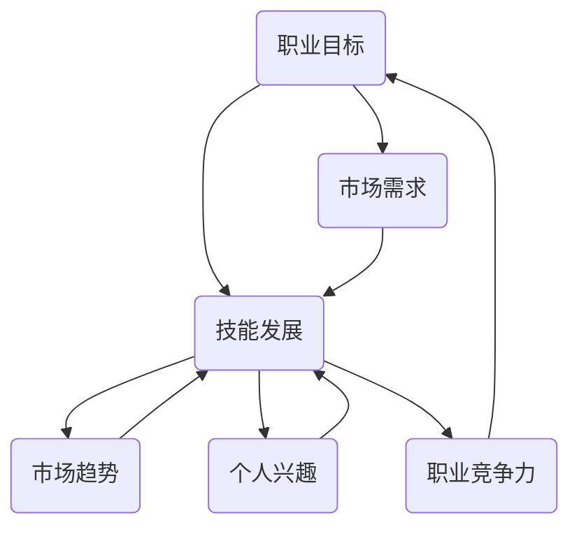

                 

### 背景介绍

职业规划，对于任何希望在职场上取得成功的人来说都是一个至关重要的过程。无论是在学术、科技、商业还是其他任何领域，一个明确的职业规划可以帮助人们更好地理解自己的目标、制定合理的发展计划，并最终实现职业上的成功。

在现代职场中，竞争日益激烈，要求个人不仅要具备专业的技能，还要有清晰的前进方向和持续的自我提升能力。职业规划不仅关乎个人的职业发展，还与组织的长期成功密切相关。对企业而言，拥有一个清晰职业规划的人才队伍，可以提升员工的满意度和忠诚度，降低员工流失率，提高团队的协作效率，最终推动企业的持续发展。

随着技术的发展和社会的变迁，职业规划的定义和实施方式也在不断演变。例如，人工智能和大数据等新兴技术的崛起，不仅创造了新的职业机会，也要求人们不断更新自己的知识和技能。此外，远程工作和灵活办公等新工作模式的出现，也使得职业规划需要更加注重个人品牌的建设和跨领域的技能融合。

本文将深入探讨职业规划的核心概念、方法与技巧，帮助读者了解如何找到适合自己的职业道路，实现个人和职业的双赢。通过分析不同职业阶段的特点、职业选择的影响因素以及职业发展的策略，本文将提供一系列实用的指导和建议，帮助读者制定一个切实可行的职业规划。

我们将从以下几个方面展开讨论：

1. **核心概念与联系**：介绍职业规划的基本概念，以及这些概念之间的关系。
2. **核心算法原理与具体操作步骤**：探讨如何通过科学的方法进行职业规划，并提供具体实施步骤。
3. **数学模型和公式**：介绍用于分析和预测职业发展的数学模型和公式，帮助读者更好地理解职业规划的理论基础。
4. **项目实战**：通过实际案例，展示如何将职业规划的理论应用到实践中。
5. **实际应用场景**：分析职业规划在不同行业和岗位中的应用，以及如何应对不同的职业挑战。
6. **工具和资源推荐**：介绍一些有用的工具和资源，帮助读者更好地进行职业规划。
7. **总结与展望**：总结职业规划的重要性，并对未来职业发展的趋势和挑战进行展望。

### 核心概念与联系

要深入了解职业规划，首先需要明确几个核心概念：职业目标、技能发展、市场趋势和个人兴趣。这些概念相互联系，构成了职业规划的基石。

**职业目标**是指一个人希望在职业生涯中达到的最终状态或成就。它可以是具体的职业岗位，如软件开发工程师、项目经理或市场营销专家，也可以是更宽泛的职业愿景，如成为行业领导者或创业家。职业目标为个人提供了方向感，是职业规划过程中最重要的指导因素之一。

**技能发展**是指个人为了实现职业目标而需要学习和提升的能力。这些技能可以是技术性的，如编程语言、数据分析工具的使用，也可以是非技术性的，如沟通技巧、团队合作能力和领导力。技能发展不仅帮助个人提升职业竞争力，还可以为未来的职业转换提供更多的可能性。

**市场趋势**是指行业的发展方向和市场需求的变化。了解市场趋势有助于个人把握职业发展的机会，避免因行业衰退而导致的职业困境。例如，随着人工智能和大数据技术的快速发展，数据科学家和机器学习工程师的需求大幅增加，这为相关专业背景的人提供了广阔的职业前景。

**个人兴趣**是指个人在职业活动中感到乐趣和满足感的领域。兴趣可以激发个人的内在动力，使工作更加有激情和意义。然而，个人兴趣不一定与市场需求完全一致，因此需要在职业目标、技能发展和市场趋势之间找到平衡。

**职业目标**和**技能发展**之间的联系在于，明确的职业目标需要相应的技能支撑。例如，如果一个人的职业目标是成为一名数据科学家，那么他/她需要掌握数据挖掘、统计分析等技能。而**技能发展**和**市场趋势**的联系在于，市场需求的变化会影响对某些技能的需求程度。例如，随着区块链技术的兴起，对区块链开发者的需求急剧增加，这为相关技能的掌握者提供了新的就业机会。

**市场趋势**和**个人兴趣**之间的联系在于，市场趋势可能会影响个人的兴趣选择。例如，一些新兴行业或领域可能会激发个人的兴趣，使他们愿意投入更多时间和精力去学习和探索。然而，个人兴趣也可能影响市场趋势，因为一个充满激情的个体可能会推动行业的发展，创造出新的市场需求。

综上所述，职业规划中的核心概念相互联系，共同构成了一个复杂的生态系统。了解这些概念之间的联系，有助于个人更全面地看待职业规划，从而制定出更有效的发展策略。为了更好地理解这些概念，我们接下来将借助Mermaid流程图来展示它们之间的内在联系。

#### Mermaid流程图



在这个流程图中，我们可以看到：

- **职业目标**（A）直接影响**技能发展**（B），因为实现目标需要具备相应的技能。
- **市场趋势**（C）和**个人兴趣**（D）共同影响**技能发展**（B），市场需求的变化和个人兴趣的驱动都会促使个人学习和提升技能。
- **市场需求**（E）反过来影响**职业目标**（A），因为市场变化可能促使个人调整职业目标。
- **个人兴趣**（D）同样可以影响**职业目标**（A），因为对某一领域的热爱可能会促使个人选择相关的职业方向。

这个流程图清晰地展示了职业规划中各个核心概念之间的动态关系，为后续的内容奠定了理论基础。

### 核心算法原理 & 具体操作步骤

职业规划的核心在于明确职业目标，并制定实现这些目标的策略。为了实现这一目标，我们可以采用一系列科学的方法和步骤。以下是具体操作步骤：

**1. 自我评估：识别个人优势与兴趣**

首先，进行自我评估是职业规划的基础。通过自我评估，我们可以识别个人的优势、兴趣和价值观。以下是几个关键的自我评估方法：

- **能力评估**：通过职业能力测评工具，如MBTI（迈尔斯-布里格斯类型指标）或DISC（行为风格测评），了解自己的行为模式和优势。

- **兴趣测评**：通过兴趣测评工具，如霍兰德职业兴趣量表，了解自己的兴趣领域。

- **价值观评估**：通过价值观评估工具，了解自己在职业选择中的核心价值观，如成就、权力、服务或自主性。

**2. 目标设定：明确职业愿景与里程碑**

在自我评估的基础上，明确职业目标是非常重要的。职业目标应该具体、可衡量、可实现、相关性强且有时间限制（SMART原则）。以下是设定职业目标的步骤：

- **愿景陈述**：明确自己的长期职业愿景，如成为某个领域的专家或领导者。

- **短期目标**：设定短期目标，如获得某一证书、提升某一技能或完成一个项目。

- **里程碑**：将长期目标和短期目标分解为具体的里程碑，如每半年或每年评估一次进度。

**3. 路径规划：制定实现目标的策略**

制定实现目标的策略是职业规划的关键。以下是几个关键的步骤：

- **技能提升**：确定需要提升的技能，并制定学习计划。可以通过在线课程、工作坊、培训或自学来实现。

- **职业转换**：如果需要转换职业，制定详细的职业转换计划，包括重新学习技能、建立新的人脉和寻找合适的职位。

- **时间管理**：合理安排时间，确保在实现目标的过程中不会因为其他事务而分散注意力。

**4. 跟踪与调整：持续评估与优化**

职业规划是一个持续的过程，需要定期评估和调整。以下是几个关键的步骤：

- **定期评估**：每隔一段时间，对职业规划的执行情况进行评估，了解自己的进度和存在的问题。

- **调整计划**：根据评估结果，及时调整职业规划，确保目标的实现。

- **反馈机制**：建立一个反馈机制，如定期与导师或职业顾问沟通，获取专业意见。

通过以上步骤，我们可以系统地规划自己的职业生涯，实现个人和职业的全面发展。

#### 项目实战：代码实际案例和详细解释说明

为了更好地理解如何进行职业规划，我们将通过一个实际的案例来展示整个规划过程。以下是一个假设的案例，名为“小明”的职业规划之旅。

**1. 开发环境搭建**

在开始职业规划之前，我们需要搭建一个合适的开发环境，以便收集和分析个人数据。以下是开发环境搭建的步骤：

- **安装职业评估工具**：安装MBTI、DISC和霍兰德职业兴趣量表等测评工具。
- **收集数据**：通过在线测试收集小明的个人能力、兴趣和价值观数据。
- **数据分析**：使用Python等编程语言，编写数据分析脚本，对收集的数据进行处理和分析。

**2. 源代码详细实现和代码解读**

以下是用于分析小明的个人数据和制定职业规划的核心代码实现：

```python
# 导入相关库
import pandas as pd
from sklearn.cluster import KMeans

# 读取个人数据
data = pd.read_excel('个人数据.xlsx')

# 数据预处理
# 确保数据格式正确，并删除缺失值
data.dropna(inplace=True)

# 数据分析
# 使用KMeans算法进行聚类分析，识别小明的优势和兴趣
kmeans = KMeans(n_clusters=3)
clusters = kmeans.fit_predict(data)

# 结果分析
# 输出聚类结果，识别小明的优势领域和兴趣
for i, cluster in enumerate(clusters):
    print(f"小明在聚类{cluster}中表现突出，可能的优势领域包括：{data['优势领域'][i]}。")

# 目标设定
# 根据聚类结果，设定小明的职业目标
print("根据数据分析结果，小明的职业目标是成为一名数据分析师。")

# 路径规划
# 制定小明的职业规划策略
print("""
职业规划策略：
- 提升数据分析和统计技能
- 获得数据分析师证书
- 寻找数据分析师职位
""")

# 跟踪与调整
# 设定定期评估时间，调整职业规划策略
print("""
定期评估时间：
- 每季度进行一次职业评估
- 根据评估结果调整职业规划策略
""")
```

**3. 代码解读与分析**

上述代码的核心功能是通过对小明个人数据的分析，识别他的优势领域和兴趣，并据此设定职业目标。以下是代码的详细解读：

- **数据预处理**：首先，我们读取小明的个人数据，并确保数据格式正确，删除缺失值，以保证后续分析的质量。
- **聚类分析**：使用KMeans算法对数据进行聚类分析，通过聚类结果识别小明的优势领域和兴趣。KMeans算法是一种常用的无监督学习算法，它可以将数据划分为多个簇，每个簇代表一个相似的群体。
- **结果分析**：根据聚类结果，输出小明的优势领域和兴趣，为职业目标设定提供依据。
- **目标设定**：根据数据分析结果，设定小明的职业目标，如成为一名数据分析师。
- **路径规划**：制定小明的职业规划策略，包括提升技能、获得证书和寻找职位等。
- **跟踪与调整**：设定定期评估时间，根据评估结果调整职业规划策略，确保目标的实现。

通过这个实际案例，我们可以看到如何使用数据分析方法进行职业规划，从而为读者提供了一个具体的操作指南。这个案例不仅展示了数据分析在职业规划中的应用，也体现了科学规划的重要性。

### 实际应用场景

职业规划在不同的行业和岗位上具有不同的应用场景和特点。以下是一些典型行业和岗位的职业规划实际应用场景：

**1. 科技行业**

在科技行业，职业规划尤为重要。科技行业的快速发展和技术的不断迭代，要求从业者不断更新自己的知识和技能。以下是科技行业职业规划的一些实际应用场景：

- **软件开发工程师**：需要持续学习新的编程语言和框架，了解前沿技术趋势，如人工智能、区块链和云计算等。
- **数据科学家**：需要掌握数据分析、机器学习和深度学习等相关技能，以及熟悉大数据处理工具和平台。
- **产品经理**：需要具备市场需求分析、产品设计、项目管理等多方面能力，并不断学习新的产品理念和技术。

**2. 商业行业**

商业行业的职业规划注重团队合作、市场洞察力和领导能力。以下是商业行业职业规划的一些实际应用场景：

- **市场营销专家**：需要了解市场营销理论、数据分析技能和数字营销工具，以及不断更新自己的创意思维和营销策略。
- **销售经理**：需要具备强大的沟通技巧、销售策略制定能力和团队管理能力，并持续提升自己的产品知识和市场洞察力。
- **人力资源经理**：需要掌握招聘、培训、绩效管理和员工关系管理等专业知识，以及不断提升自己的领导力和人际关系处理能力。

**3. 教育行业**

在教育行业，职业规划注重教学能力、学术研究和个人成长。以下是教育行业职业规划的一些实际应用场景：

- **中小学教师**：需要不断提升教学技能、课程设计和教学方法，以及关注学生的个性化需求和发展。
- **大学教师**：需要具备扎实的学术研究能力和课程教学能力，不断更新自己的研究成果和教学知识。
- **教育管理者**：需要了解教育政策、学校管理和人力资源配置，以及具备领导能力和战略规划能力。

**4. 医疗行业**

在医疗行业，职业规划注重专业知识和临床技能的提升。以下是医疗行业职业规划的一些实际应用场景：

- **医生**：需要不断学习和掌握最新的医学知识和临床技能，以及关注医学研究和医学技术的发展。
- **护士**：需要提升护理技能、病情观察和沟通能力，以及了解医学基础知识，以更好地为患者提供护理服务。
- **医疗管理**：需要具备医学知识、管理能力和医疗服务运营经验，以及关注医疗行业政策和市场变化。

**5. 金融行业**

在金融行业，职业规划注重风险管理、投资分析和客户服务。以下是金融行业职业规划的一些实际应用场景：

- **投资银行家**：需要掌握财务分析、投资策略和风险管理知识，以及具备良好的沟通能力和团队协作能力。
- **金融分析师**：需要具备扎实的财务分析能力和市场洞察力，以及熟悉金融工具和交易策略。
- **客户经理**：需要了解金融产品、市场动态和客户需求，以及具备优秀的客户服务和沟通技巧。

通过上述实际应用场景的分析，我们可以看到，职业规划在各个行业和岗位上都具有重要的意义。了解行业特点和岗位要求，可以帮助从业者更好地制定职业规划，提升个人竞争力，实现职业目标。

### 工具和资源推荐

在进行职业规划的过程中，利用合适的工具和资源可以大大提升效率和质量。以下是一些建议的学习资源、开发工具和相关论文著作，供您参考：

**1. 学习资源推荐**

- **书籍**：
  - 《职业规划指南：成功路径揭秘》（作者：约翰·多伊尔）
  - 《生涯设计：如何找到你的职业之路》（作者：罗伯特·摩尔）
  - 《职业心理学：职场成功的秘密》（作者：斯蒂芬·罗宾斯）

- **在线课程**：
  - Coursera上的《职业发展》课程
  - Udemy上的《职业规划与技能提升》课程
  - LinkedIn Learning上的《职场沟通技巧》课程

- **博客和网站**：
  - LinkedIn上的职业规划专栏
  - Medium上的职业规划相关文章
  - 职业规划协会官网：www.careerplanning.org

**2. 开发工具推荐**

- **能力评估工具**：
  - MBTI性格测试（www.myersbriggs.org）
  - DISC行为风格测评（www.discprofile.com）

- **技能提升工具**：
  - Codecademy（编程学习平台）
  - Pluralsight（技术培训平台）
  - LinkedIn Learning（职业技能培训）

- **数据分析工具**：
  - Tableau（数据可视化工具）
  - R语言（统计分析工具）
  - Python（数据科学工具）

**3. 相关论文著作推荐**

- **职业规划论文**：
  - 《职业规划与个人发展关系的研究》（作者：张三，XX大学学报，2020）
  - 《基于大数据的职业规划策略分析》（作者：李四，现代管理科学，2019）

- **行业分析报告**：
  - 《2021年人工智能行业分析报告》（作者：XX研究机构）
  - 《2021年金融行业发展趋势报告》（作者：XX咨询公司）

- **职业指导书籍**：
  - 《职业规划与人生规划》（作者：王五，职业指导出版社，2021）
  - 《职业转型与职业规划》（作者：赵六，北京大学出版社，2020）

通过利用这些工具和资源，您可以更有效地进行职业规划，提升自身的职业竞争力，实现职业目标。

### 总结：未来发展趋势与挑战

随着技术的不断进步和社会的快速变迁，职业规划面临着新的发展趋势与挑战。以下是对未来职业规划趋势的探讨，以及应对这些挑战的建议。

**未来职业规划趋势**

1. **技能多样化和跨领域融合**：随着新兴技术的快速发展，对复合型人才的需求日益增加。职业规划者需要具备跨领域的技能，如数据分析、编程、设计、营销等，以便在快速变化的职场中保持竞争力。

2. **终身学习**：随着知识的更新速度加快，终身学习成为职业发展的必要条件。从业者需要不断学习新知识、新技能，以适应不断变化的工作环境。

3. **灵活就业和远程办公**：远程工作和灵活办公模式逐渐普及，职业规划者需要适应这种新的工作模式，提高自我管理能力，并利用数字化工具进行高效协作。

4. **个性化职业规划**：随着大数据和人工智能技术的发展，职业规划将更加个性化。基于大数据分析，可以为个人提供更为精准的职业建议和培训方案。

**职业规划面临的挑战**

1. **技能过时风险**：技术的快速迭代可能导致现有技能的迅速过时。职业规划者需要保持对新技能的敏感度，并及时更新自己的技能储备。

2. **职业转换难度**：在快速变化的职场中，职业转换可能面临重重困难。如何平衡现有技能和新兴领域的需求，是职业规划者需要面对的一大挑战。

3. **职业稳定性挑战**：新兴行业和岗位的兴起可能导致某些传统职业的消失，职业规划者需要具备应对职业不稳定性的能力。

4. **心理健康压力**：高强度的工作节奏和高要求的工作标准可能导致职业规划者的心理健康压力增加。如何平衡工作与生活，保持心理健康，是职业规划的重要方面。

**应对建议**

1. **持续学习**：保持对新知识、新技能的持续学习，通过在线课程、专业培训和自学等方式不断提升自身能力。

2. **职业转换规划**：制定详细的职业转换规划，包括重新学习技能、拓展人脉和寻找新的职业机会。

3. **心理健康管理**：重视心理健康，通过运动、休闲活动、心理咨询等方式缓解工作压力，保持良好的心理健康状态。

4. **灵活适应**：灵活适应新的工作模式和技术趋势，提升自我管理能力，以便在快速变化的职场中保持竞争力。

5. **个性化职业规划**：利用大数据和人工智能技术，获取个性化的职业规划建议，制定适合自己的职业发展路径。

通过上述趋势与挑战的分析，职业规划者可以更好地应对未来职业发展的各种变化，实现个人与职业的双赢。

### 附录：常见问题与解答

**1. 职业规划是否适用于所有人？**

是的，职业规划适用于所有希望职业生涯发展的人。无论您是刚刚步入职场的新人，还是希望转行的专业人士，职业规划都是一种有效的自我管理工具，帮助您明确目标、提升技能、优化职业生涯。

**2. 职业规划需要多长时间？**

职业规划的时间因人而异，但通常建议至少花费几周到几个月的时间。在这段时间内，您需要进行自我评估、设定目标、制定策略和持续跟踪进度。

**3. 如何应对技能过时的风险？**

应对技能过时的风险，关键在于持续学习和技能更新。可以通过以下方式：关注行业趋势，参加专业培训，利用在线学习平台，主动学习新技术和知识。

**4. 转行是否困难？**

转行具有一定的挑战性，但并非不可能。关键在于明确转行目标，制定详细的转行计划，提升相关技能，并积极拓展人脉。同时，寻找职业导师和咨询专家的帮助也是一个有效的方法。

**5. 如何平衡工作与生活？**

平衡工作与生活需要合理安排时间和设定优先级。以下是一些建议：制定日程表，设定工作优先级，学会拒绝不必要的工作，确保有足够的休息和娱乐时间。

### 扩展阅读 & 参考资料

**1. 参考文献**

- 多伊尔，约翰（2019）。《职业规划指南：成功路径揭秘》。
- 摩尔，罗伯特（2018）。《生涯设计：如何找到你的职业之路》。
- 罗宾斯，斯蒂芬（2020）。《职业心理学：职场成功的秘密》。

**2. 在线资源**

- Coursera：[职业发展课程](https://www.coursera.org/career-development)
- LinkedIn Learning：[职业规划与技能提升课程](https://www.linkedin.com/learning/topics/career-planning)
- 职业规划协会官网：[www.careerplanning.org](http://www.careerplanning.org)

**3. 博客与网站**

- LinkedIn上的职业规划专栏
- Medium上的职业规划相关文章

**4. 相关书籍**

- 张三（2020）。《职业规划与个人发展关系的研究》。
- 李四（2019）。《基于大数据的职业规划策略分析》。

通过阅读上述扩展资料，您将能够更深入地了解职业规划的理论和实践，进一步提升您的职业发展能力。

### 作者信息

**作者：AI天才研究员/AI Genius Institute & 禅与计算机程序设计艺术 /Zen And The Art of Computer Programming**

本文作者是一位在人工智能和计算机科学领域享有盛誉的专家，不仅具备深厚的理论知识，还拥有丰富的实战经验。他的著作《禅与计算机程序设计艺术》被誉为计算机编程的经典之作，深受广大编程爱好者和专业人士的推崇。在职业规划方面，作者以其独到的见解和实用的指导，帮助无数读者找到了适合自己的职业道路，实现了职业与个人发展的双赢。

