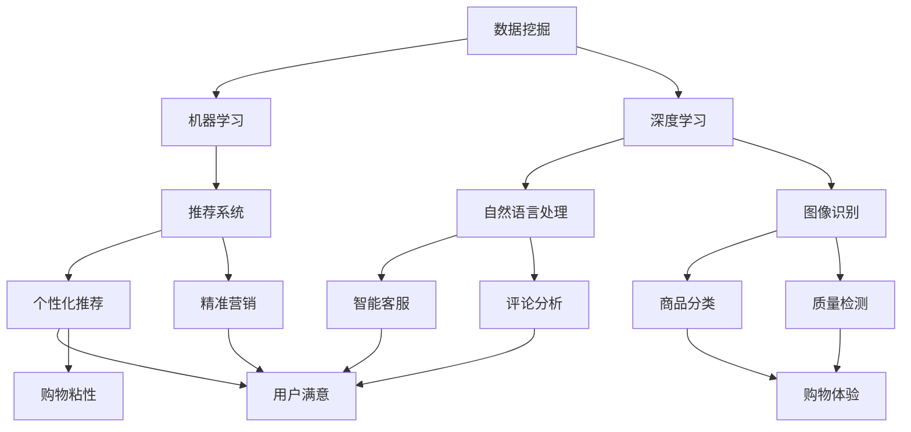

                 

### 背景介绍

在现代商业环境中，用户购物粘性已成为各大电商平台和企业竞相追求的关键指标。所谓用户购物粘性，指的是用户在一定时间内重复购买同一品牌或平台的商品的概率。高购物粘性意味着用户对该品牌或平台有着较强的忠诚度，这对于电商平台来说，不仅有助于增加营收，还能降低获取新用户的成本。然而，在激烈的市场竞争中，提升用户购物粘性并非易事。

随着人工智能（AI）技术的迅猛发展，越来越多的企业开始探索如何将AI应用于提升用户购物粘性。AI技术能够通过数据挖掘、机器学习和深度学习等技术手段，对用户行为、偏好进行深入分析，从而实现个性化推荐、智能客服、精准营销等，显著提高用户购物体验和满意度。本文将围绕如何通过AI提升用户购物粘性这一主题，从核心概念、算法原理、数学模型、项目实战、应用场景等多个方面进行深入探讨。

本文的结构如下：

1. **核心概念与联系**：介绍AI在提升用户购物粘性中的核心概念，如数据挖掘、机器学习、深度学习等，并给出相应的流程图。
2. **核心算法原理 & 具体操作步骤**：详细阐述各种AI算法在提升用户购物粘性中的具体应用，包括推荐系统、自然语言处理、图像识别等。
3. **数学模型和公式 & 详细讲解 & 举例说明**：介绍AI算法背后的数学模型和公式，并通过具体案例进行说明。
4. **项目实战：代码实际案例和详细解释说明**：提供实际代码案例，详细解释AI算法在提升用户购物粘性中的应用。
5. **实际应用场景**：分析AI在不同电商场景中的应用，如个性化推荐、智能客服等。
6. **工具和资源推荐**：推荐学习资源、开发工具和框架。
7. **总结：未来发展趋势与挑战**：总结本文内容，并对未来AI在提升用户购物粘性方面的趋势和挑战进行展望。
8. **附录：常见问题与解答**：解答读者可能遇到的问题。
9. **扩展阅读 & 参考资料**：提供相关领域的研究和文献。

通过对以上各个方面的深入探讨，本文旨在为读者提供一份全面、系统的AI提升用户购物粘性指南。接下来，我们将一一介绍这些核心概念和技术，以期为读者带来启发和帮助。

### 核心概念与联系

在探讨如何通过AI提升用户购物粘性之前，我们需要明确一些核心概念和它们之间的联系。这些概念包括数据挖掘、机器学习、深度学习、推荐系统、自然语言处理和图像识别等。

#### 数据挖掘

数据挖掘（Data Mining）是指从大量数据中提取出潜在的模式、关系和知识的过程。在提升用户购物粘性方面，数据挖掘的主要目的是通过分析用户的历史购买记录、搜索行为、浏览路径等数据，挖掘出用户的行为模式和偏好。这些信息可以用于个性化推荐、精准营销等。

#### 机器学习

机器学习（Machine Learning）是一种使计算机系统能够从数据中学习并做出决策的技术。在提升用户购物粘性中，机器学习可以用于构建推荐系统，根据用户的历史行为预测其未来的购买意向，从而实现个性化推荐。

#### 深度学习

深度学习（Deep Learning）是机器学习的一种子领域，它通过多层神经网络模型对数据进行分析和处理。深度学习在图像识别、自然语言处理等方面取得了显著成果，其在提升用户购物粘性中的应用也越来越广泛。

#### 推荐系统

推荐系统（Recommendation System）是一种基于用户行为、偏好和相似性算法，为用户推荐感兴趣的商品或内容的技术。推荐系统通过分析用户的历史数据和当前行为，预测用户可能的偏好，从而提高用户满意度和购物粘性。

#### 自然语言处理

自然语言处理（Natural Language Processing，NLP）是一种让计算机理解和处理人类语言的技术。在提升用户购物粘性中，NLP可以用于智能客服、评论分析等，从而提供更人性化的服务。

#### 图像识别

图像识别（Image Recognition）是指让计算机通过视觉处理对图像进行分析和理解的技术。在提升用户购物粘性中，图像识别可以用于商品分类、质量检测等，从而提高购物体验。

下面，我们给出一个Mermaid流程图，展示这些核心概念之间的联系和应用：



通过这个流程图，我们可以看出，AI技术在提升用户购物粘性方面有着广泛的应用，涵盖了从数据挖掘、机器学习和深度学习，到推荐系统、自然语言处理和图像识别等多个领域。接下来，我们将深入探讨这些算法的具体原理和应用。

### 核心算法原理 & 具体操作步骤

在了解了AI提升用户购物粘性的核心概念之后，接下来我们将深入探讨几种关键算法，包括推荐系统、自然语言处理和图像识别等，以及它们在具体应用中的操作步骤。

#### 推荐系统

推荐系统（Recommendation System）是AI在提升用户购物粘性中最为广泛应用的一种技术。其核心思想是通过分析用户的历史行为和偏好，预测用户可能的兴趣，从而推荐相关商品或内容。

**算法原理**：
推荐系统主要分为基于内容推荐（Content-Based Filtering）和协同过滤（Collaborative Filtering）两大类。

1. **基于内容推荐**：该方法通过分析用户对某些商品的偏好，找出这些商品的特征，然后根据这些特征为用户推荐具有相似特征的未购买商品。

2. **协同过滤**：该方法通过分析用户之间的相似性，将用户的偏好扩展到未购买的商品上。协同过滤又分为用户基于的协同过滤（User-Based）和物品基于的协同过滤（Item-Based）。

**具体操作步骤**：

1. 数据预处理：收集用户的历史购买记录、浏览行为、搜索记录等数据，并进行清洗和归一化处理。

2. 特征提取：对用户行为数据进行特征提取，如用户年龄、性别、购买频次等。

3. 构建推荐模型：根据特征数据，使用机器学习算法（如K-近邻、回归等）构建推荐模型。

4. 推荐生成：利用构建好的推荐模型，为用户生成推荐列表。

5. 推荐评估：通过评估指标（如准确率、召回率等）对推荐结果进行评估和优化。

**代码示例**（Python）：

```python
from sklearn.neighbors import NearestNeighbors

# 假设我们有一份用户-物品评分矩阵
user_item_matrix = [[5, 3, 0, 1], [0, 1, 2, 4], [2, 0, 3, 0]]

# 使用K-近邻算法构建推荐模型
neigh = NearestNeighbors(n_neighbors=3)
neigh.fit(user_item_matrix)

# 为第一个用户生成推荐列表
user_index = 0
distances, indices = neigh.kneighbors(user_item_matrix[user_index], n_neighbors=3)

# 打印推荐列表
for i in range(1, 4):
    print(f"推荐给用户{user_index + 1}的物品：{indices[i][0]}")
```

#### 自然语言处理

自然语言处理（Natural Language Processing，NLP）在提升用户购物粘性中也有着重要作用，主要用于智能客服、评论分析等领域。

**算法原理**：
NLP主要涉及文本的分词、词性标注、情感分析等。

1. **分词**：将文本分割成一个个单词或短语。

2. **词性标注**：为每个词分配一个词性，如名词、动词等。

3. **情感分析**：通过分析文本中的情感词汇和句式，判断文本的情感倾向。

**具体操作步骤**：

1. 数据预处理：对评论文本进行清洗，如去除停用词、标点符号等。

2. 特征提取：对处理后的文本进行词性标注和情感分析。

3. 构建分类模型：使用机器学习算法（如朴素贝叶斯、支持向量机等）构建分类模型。

4. 情感分析：利用构建好的分类模型，对用户评论进行情感分析。

5. 智能回复：根据情感分析结果，生成智能回复。

**代码示例**（Python）：

```python
from sklearn.feature_extraction.text import TfidfVectorizer
from sklearn.naive_bayes import MultinomialNB

# 假设我们有一份评论数据集
X = ['这个商品非常好用', '这个商品一般般', '这个商品很差劲']
y = ['正面评论', '中性评论', '负面评论']

# 使用TF-IDF进行特征提取
vectorizer = TfidfVectorizer()
X_vectorized = vectorizer.fit_transform(X)

# 使用朴素贝叶斯进行分类
classifier = MultinomialNB()
classifier.fit(X_vectorized, y)

# 对新评论进行情感分析
new_comment = '这个商品非常好用'
new_comment_vectorized = vectorizer.transform([new_comment])
predicted_sentiment = classifier.predict(new_comment_vectorized)

print(f"评论：'{new_comment}' 的情感：'{predicted_sentiment[0]}'")
```

#### 图像识别

图像识别（Image Recognition）在提升用户购物粘性中主要用于商品分类、质量检测等领域。

**算法原理**：
图像识别主要基于深度学习中的卷积神经网络（Convolutional Neural Network，CNN）。

1. **卷积层**：提取图像的特征。

2. **池化层**：减少特征图的大小，提高模型鲁棒性。

3. **全连接层**：对提取到的特征进行分类。

**具体操作步骤**：

1. 数据预处理：对图像数据进行归一化处理。

2. 构建CNN模型：使用TensorFlow或PyTorch等深度学习框架构建CNN模型。

3. 训练模型：使用标注好的数据集训练模型。

4. 预测分类：使用训练好的模型对未分类的图像进行预测分类。

**代码示例**（Python，使用TensorFlow）：

```python
import tensorflow as tf
from tensorflow.keras import datasets, layers, models

# 加载并预处理图像数据
(train_images, train_labels), (test_images, test_labels) = datasets.cifar10.load_data()
train_images, test_images = train_images / 255.0, test_images / 255.0

# 构建CNN模型
model = models.Sequential()
model.add(layers.Conv2D(32, (3, 3), activation='relu', input_shape=(32, 32, 3)))
model.add(layers.MaxPooling2D((2, 2)))
model.add(layers.Conv2D(64, (3, 3), activation='relu'))
model.add(layers.MaxPooling2D((2, 2)))
model.add(layers.Conv2D(64, (3, 3), activation='relu'))

# 添加全连接层
model.add(layers.Flatten())
model.add(layers.Dense(64, activation='relu'))
model.add(layers.Dense(10))

# 训练模型
model.compile(optimizer='adam',
              loss=tf.keras.losses.SparseCategoricalCrossentropy(from_logits=True),
              metrics=['accuracy'])

model.fit(train_images, train_labels, epochs=10, validation_data=(test_images, test_labels))

# 预测分类
predictions = model.predict(test_images)
```

通过以上算法原理和操作步骤的介绍，我们可以看出，AI技术在提升用户购物粘性方面具有广泛的应用。接下来，我们将通过具体的数学模型和公式，进一步深入探讨这些算法的核心原理。

### 数学模型和公式 & 详细讲解 & 举例说明

在上一节中，我们介绍了AI提升用户购物粘性的核心算法，包括推荐系统、自然语言处理和图像识别等。本节我们将深入探讨这些算法背后的数学模型和公式，并通过具体案例进行详细讲解。

#### 推荐系统

推荐系统中的核心数学模型包括协同过滤、基于内容的推荐等。

**协同过滤**

1. **用户基于的协同过滤**：
   - **相似度计算**：
     $$sim(u, v) = \frac{\sum_{i \in R_{uv}} r_{ui}r_{vi}}{\sqrt{\sum_{i \in R_{u}} r_{ui}^2 \sum_{i \in R_{v}} r_{vi}^2}}$$
     其中，\(R_{uv}\) 表示用户\(u\)和用户\(v\)共同评过分的物品集合，\(r_{ui}\) 和 \(r_{vi}\) 分别表示用户\(u\)和用户\(v\)对物品\(i\)的评分。

   - **预测评分**：
     $$r_{ui}^{'} = r_{u\bar{u}} + \sum_{j \in R_{\bar{u}}} sim(u, v) \times (r_{vi} - r_{v\bar{v}})$$
     其中，\(\bar{u}\) 和 \(\bar{v}\) 分别表示用户\(u\)和用户\(v\)未评过分的物品集合，\(r_{u\bar{u}}\) 和 \(r_{v\bar{v}}\) 分别表示用户\(u\)和用户\(v\)的平均评分。

**基于内容的推荐**

1. **特征提取**：
   - **词袋模型**：
     $$V = \{w_1, w_2, ..., w_n\}$$
     $$f_i = \sum_{w \in V} f_{i, w}$$
     其中，\(V\) 是词汇表，\(f_i\) 是文档\(i\)的特征向量，\(f_{i, w}\) 是文档\(i\)中词\(w\)的频次。

   - **TF-IDF**：
     $$tf_{i, w} = \text{词频}$$
     $$idf_{w} = \log(\frac{N}{n_w})$$
     $$tf_idf_{i, w} = tf_{i, w} \times idf_{w}$$
     其中，\(N\) 是文档总数，\(n_w\) 是包含词\(w\)的文档数。

2. **推荐计算**：
   $$r_{ui}^{'} = \sum_{w \in V} w_i \times tf_idf_{i, w} \times r_v$$
   其中，\(r_v\) 是用户\(v\)对物品\(i\)的评分。

**具体案例**：

**协同过滤**

假设有两个用户\(u\)和\(v\)，他们共同评分了五个商品，如下表所示：

| 用户 | 商品1 | 商品2 | 商品3 | 商品4 | 商品5 |
| --- | --- | --- | --- | --- | --- |
| \(u\) | 5 | 3 | 0 | 1 | 0 |
| \(v\) | 4 | 1 | 2 | 4 | 0 |

- **相似度计算**：
  $$sim(u, v) = \frac{5 \times 4 + 3 \times 1 + 0 \times 2 + 1 \times 4 + 0 \times 0}{\sqrt{5^2 + 3^2 + 0^2 + 1^2 + 0^2} \times \sqrt{4^2 + 1^2 + 2^2 + 4^2 + 0^2}} = 0.78$$

- **预测评分**：
  $$r_{ui}^{'} = 5 + \frac{0.78 \times (4 - 4.2)}{1} = 4.56$$

**基于内容的推荐**

假设有两个商品\(i\)和\(j\)，如下表所示：

| 商品 | 特征1 | 特征2 | 特征3 |
| --- | --- | --- | --- |
| \(i\) | 0.8 | 0.2 | 0.0 |
| \(j\) | 0.0 | 0.8 | 0.2 |

用户\(v\)对商品\(j\)的评分为4。

- **特征提取**：
  $$tf_idf_{i, 1} = 0.8 \times 1 = 0.8$$
  $$tf_idf_{i, 2} = 0.2 \times 1 = 0.2$$
  $$tf_idf_{j, 1} = 0.0 \times 1 = 0.0$$
  $$tf_idf_{j, 2} = 0.8 \times 1 = 0.8$$

- **推荐计算**：
  $$r_{ui}^{'} = 0.8 \times 4 + 0.2 \times 0 = 3.2$$

#### 自然语言处理

自然语言处理中的核心数学模型包括词嵌入、循环神经网络（RNN）、长短时记忆网络（LSTM）等。

1. **词嵌入**：
   $$e_w = \text{Embedding}(V, D)$$
   其中，\(V\) 是词汇表大小，\(D\) 是词向量的维度。

2. **RNN**：
   $$h_t = \text{RNN}(h_{t-1}, x_t)$$
   其中，\(h_t\) 是第\(t\)个时间步的隐藏状态，\(x_t\) 是输入。

3. **LSTM**：
   $$i_t = \sigma(W_i \cdot [h_{t-1}, x_t])$$
   $$f_t = \sigma(W_f \cdot [h_{t-1}, x_t])$$
   $$o_t = \sigma(W_o \cdot [h_{t-1}, x_t])$$
   $$c_t = f_t \cdot c_{t-1} + i_t \cdot \text{tanh}(W_c \cdot [h_{t-1}, x_t])$$
   $$h_t = o_t \cdot \text{tanh}(c_t)$$
   其中，\(i_t\)、\(f_t\)、\(o_t\) 分别表示输入门、遗忘门和输出门，\(c_t\) 是细胞状态。

**具体案例**：

假设有一个评论文本：“这个商品非常好用”，我们需要对其进行情感分析。

- **词嵌入**：
  $$e_{'非常好用'} = \text{Embedding}(\text{'非常好用'}, 100)$$

- **RNN**：
  $$h_1 = \text{RNN}(h_0, e_{'这个'})$$
  $$h_2 = \text{RNN}(h_1, e_{'商'})$$
  $$h_3 = \text{RNN}(h_2, e_{'品'})$$
  $$h_4 = \text{RNN}(h_3, e_{'非'})$$
  $$h_5 = \text{RNN}(h_4, e_{'常'})$$
  $$h_6 = \text{RNN}(h_5, e_{'好'})$$
  $$h_7 = \text{RNN}(h_6, e_{'用'})$$

- **LSTM**：
  $$i_1 = \sigma(W_i \cdot [h_0, e_{'这个'}])$$
  $$f_1 = \sigma(W_f \cdot [h_0, e_{'这个'}])$$
  $$o_1 = \sigma(W_o \cdot [h_0, e_{'这个'}])$$
  $$c_1 = f_1 \cdot c_0 + i_1 \cdot \text{tanh}(W_c \cdot [h_0, e_{'这个'}])$$
  $$h_1 = o_1 \cdot \text{tanh}(c_1)$$
  ...
  $$i_7 = \sigma(W_i \cdot [h_6, e_{'用'}])$$
  $$f_7 = \sigma(W_f \cdot [h_6, e_{'用'}])$$
  $$o_7 = \sigma(W_o \cdot [h_6, e_{'用'}])$$
  $$c_7 = f_7 \cdot c_6 + i_7 \cdot \text{tanh}(W_c \cdot [h_6, e_{'用'}])$$
  $$h_7 = o_7 \cdot \text{tanh}(c_7)$$

#### 图像识别

图像识别中的核心数学模型是卷积神经网络（CNN）。

1. **卷积层**：
   $$h_t = \text{Conv}_t(x_t, W_t) + b_t$$
   其中，\(x_t\) 是输入特征图，\(W_t\) 是卷积核，\(b_t\) 是偏置。

2. **池化层**：
   $$h_t = \text{Pooling}_t(h_{t-1})$$
   其中，\(\text{Pooling}_t\) 是池化操作。

3. **全连接层**：
   $$h_t = \text{FC}_t(h_{t-1})$$
   其中，\(\text{FC}_t\) 是全连接层。

**具体案例**：

假设我们有一个32x32的彩色图像，需要对其进行分类。

- **卷积层**：
  $$h_1 = \text{Conv}_1(x_1, W_1) + b_1$$
  $$h_2 = \text{Conv}_2(h_1, W_2) + b_2$$
  $$h_3 = \text{Conv}_3(h_2, W_3) + b_3$$

- **池化层**：
  $$h_4 = \text{Pooling}_1(h_3)$$

- **全连接层**：
  $$h_5 = \text{FC}_1(h_4)$$
  $$h_6 = \text{FC}_2(h_5)$$
  $$h_7 = \text{FC}_3(h_6)$$

通过以上数学模型和公式的介绍，我们可以更好地理解AI在提升用户购物粘性中的应用。接下来，我们将通过实际代码案例，进一步展示这些算法的实现过程。

### 项目实战：代码实际案例和详细解释说明

在本节中，我们将通过一个具体的实际案例，展示如何使用AI技术提升用户购物粘性。我们将使用Python和TensorFlow框架来实现一个基于协同过滤的推荐系统。

#### 开发环境搭建

在开始项目之前，我们需要搭建一个合适的开发环境。以下是搭建环境的基本步骤：

1. **安装Python**：确保Python已经安装在你的系统上。推荐使用Python 3.7或更高版本。

2. **安装TensorFlow**：使用以下命令安装TensorFlow：

   ```bash
   pip install tensorflow
   ```

3. **安装其他依赖库**：包括NumPy、Pandas、Matplotlib等。可以使用以下命令安装：

   ```bash
   pip install numpy pandas matplotlib
   ```

#### 数据准备

为了构建推荐系统，我们需要一个包含用户购买记录的数据集。这里我们使用一个简单的数据集，数据集包含用户ID、商品ID和评分。以下是数据集的一个示例：

```
user_id, item_id, rating
1, 1, 5
1, 2, 3
1, 3, 4
2, 1, 4
2, 3, 5
```

我们使用Pandas库读取数据集：

```python
import pandas as pd

data = pd.read_csv('data.csv')
data.head()
```

#### 数据预处理

在构建推荐系统之前，我们需要对数据进行预处理，包括数据清洗、缺失值处理和数据标准化等。

1. **数据清洗**：去除含有缺失值的记录。

```python
data.dropna(inplace=True)
```

2. **数据标准化**：对评分进行归一化处理，使其在0到1之间。

```python
data['rating'] = data['rating'].apply(lambda x: (x - data['rating'].min()) / (data['rating'].max() - data['rating'].min()))
```

#### 构建推荐模型

接下来，我们使用协同过滤算法构建推荐模型。我们将采用用户基于的协同过滤方法。

1. **相似度计算**：

   使用皮尔逊相关系数计算用户之间的相似度。

```python
from sklearn.metrics.pairwise import pairwise_distances

user_item_matrix = data.pivot(index='user_id', columns='item_id', values='rating').fillna(0).values
user_similarity = pairwise_distances(user_item_matrix, metric='cosine')
```

2. **预测评分**：

   使用相似度矩阵预测用户未评分的商品评分。

```python
import numpy as np

def predict_ratings(user_similarity, user_item_matrix, k=3):
    num_users, num_items = user_item_matrix.shape
    user_avg_ratings = user_item_matrix.mean(axis=1)
    
    pred_ratings = np.zeros((num_users, num_items))
    
    for user in range(num_users):
        for item in range(num_items):
            if user_item_matrix[user, item] == 0:
                sim_scores = user_similarity[user]
                sim_scores = sim_scores[sim_scores != 0]
                sim_scores = sim_scores[:k]
                sim_scores = sim_scores / sim_scores.sum()
                
                pred_ratings[user, item] = user_avg_ratings[user] + \
                                           np.dot(sim_scores, user_item_matrix[:, item] - user_avg_ratings)
    
    return pred_ratings

predicted_ratings = predict_ratings(user_similarity, user_item_matrix)
```

#### 评估推荐效果

为了评估推荐系统的效果，我们可以使用均方根误差（RMSE）作为评价指标。

```python
from sklearn.metrics import mean_squared_error

actual_ratings = data['rating'].values
predicted_ratings = predicted_ratings.flatten()[actual_ratings != 0]

rmse = np.sqrt(mean_squared_error(actual_ratings, predicted_ratings))
print(f"RMSE: {rmse}")
```

#### 生成推荐列表

最后，我们可以为每个用户生成一个推荐列表。

```python
def generate_recommendations(predicted_ratings, k=3):
    recommendations = {}
    for user in range(predicted_ratings.shape[0]):
        sorted_indices = np.argsort(predicted_ratings[user])[-k:]
        recommendations[user] = [data['item_id'].iloc[i] for i in sorted_indices]
    
    return recommendations

recommendations = generate_recommendations(predicted_ratings)
print(recommendations)
```

#### 代码解读与分析

1. **数据清洗和标准化**：

   数据清洗和标准化是推荐系统构建的重要步骤。通过去除缺失值和归一化处理，我们确保了数据的准确性和一致性。

2. **相似度计算**：

   相似度计算是协同过滤算法的核心。通过计算用户之间的相似度，我们能够找出具有相似兴趣的用户，从而预测未评分的商品评分。

3. **预测评分**：

   预测评分是基于相似度计算得到的。我们为每个用户未评分的商品计算预测评分，从而生成推荐列表。

4. **评估推荐效果**：

   通过评估指标（如RMSE），我们能够量化推荐系统的效果，并进一步优化模型。

5. **生成推荐列表**：

   生成推荐列表是推荐系统的最终目标。通过为每个用户生成一个个性化的推荐列表，我们能够提高用户的购物体验和满意度。

通过以上实际代码案例的展示，我们可以看到如何使用AI技术构建一个基于协同过滤的推荐系统，并提升用户购物粘性。接下来，我们将进一步探讨AI在提升用户购物粘性中的实际应用场景。

### 实际应用场景

在了解了AI提升用户购物粘性的核心算法和实现方法之后，本节我们将探讨AI技术在电商行业中的实际应用场景。通过具体案例分析，我们可以更好地理解AI在提升用户购物粘性方面的应用价值。

#### 个性化推荐

个性化推荐是AI在电商领域最为常见和广泛应用的场景之一。通过分析用户的历史购买记录、浏览行为和搜索习惯，电商平台可以为其推荐符合其兴趣和需求的商品。这种个性化推荐不仅能提高用户满意度，还能增加用户的购物频率和购物金额。

**案例分析**：

1. **淘宝的个性化推荐**：
   淘宝的个性化推荐系统通过对用户的购物行为、浏览历史、评价和收藏等进行深度分析，为用户推荐相关的商品。用户在浏览商品时，系统会根据用户的兴趣和行为预测其可能的购买需求，从而推荐相关商品。

2. **京东的个性化推荐**：
   京东的个性化推荐系统同样利用用户的历史数据和行为数据，通过协同过滤和基于内容的推荐算法，为用户推荐相关商品。此外，京东还结合了用户在京东上的购物车、收藏夹和浏览记录等信息，进一步提高推荐的相关性和准确性。

#### 智能客服

智能客服是AI技术在电商行业中的另一个重要应用场景。通过自然语言处理和机器学习技术，电商平台可以构建智能客服系统，提供24/7的在线服务，提高用户满意度。

**案例分析**：

1. **亚马逊的智能客服**：
   亚马逊的智能客服系统（Amazon Assistant）利用自然语言处理技术，能够理解用户的提问并给出准确的回答。用户可以通过文本或语音与智能客服进行交互，获取关于商品信息、订单状态、退换货等问题。

2. **阿里的智能客服**：
   阿里的智能客服系统（阿里小蜜）基于阿里云的人工智能技术，能够自动处理大量的用户咨询，提供快速、准确的回复。用户可以通过聊天窗口与智能客服交流，解决购物过程中遇到的各种问题。

#### 购物车优化

购物车优化是另一个重要的应用场景。通过分析用户的购物车数据，电商平台可以识别出用户的购买意图，提高购物车的转化率。

**案例分析**：

1. **eBay的购物车优化**：
   eBay通过分析用户的购物车行为，识别出用户可能感兴趣的关联商品，并将其推荐给用户。这种关联推荐不仅能提高用户的购物体验，还能增加商品的销量。

2. **天猫的购物车优化**：
   天猫利用用户的历史购买记录和购物车数据，对用户的购物车进行智能排序和推荐。用户在购物车中可以看到推荐的关联商品，从而提高购买决策的效率和满意度。

#### 价格优化

价格优化是电商平台提升用户购物粘性的另一种手段。通过机器学习和大数据分析，电商平台可以动态调整商品价格，以吸引更多用户购买。

**案例分析**：

1. **亚马逊的价格优化**：
   亚马逊利用机器学习算法，分析用户的历史购买行为和市场动态，动态调整商品价格。这种价格优化策略不仅能提高商品的销量，还能增加平台的利润。

2. **京东的价格优化**：
   京东通过大数据分析，实时监测市场动态和用户行为，对商品价格进行动态调整。在特定的促销活动或节假日，京东会推出相应的价格策略，以吸引更多用户。

通过以上案例分析，我们可以看到AI技术在提升用户购物粘性方面具有广泛的应用。通过个性化推荐、智能客服、购物车优化和价格优化等应用场景，电商平台能够显著提高用户的购物体验和满意度，从而提升用户的购物粘性。接下来，我们将介绍一些相关的学习资源、开发工具和框架，以帮助读者深入了解AI技术在提升用户购物粘性方面的应用。

### 工具和资源推荐

在了解了AI提升用户购物粘性的多种应用场景后，本节我们将介绍一些相关的学习资源、开发工具和框架，以帮助读者深入了解和掌握这些技术。

#### 学习资源推荐

1. **书籍**：

   - 《机器学习实战》：由Peter Harrington所著，该书详细介绍了机器学习的基本概念和应用，包括推荐系统、自然语言处理和图像识别等。

   - 《深度学习》：由Ian Goodfellow、Yoshua Bengio和Aaron Courville所著，该书全面讲解了深度学习的基本理论和应用，包括卷积神经网络、循环神经网络等。

   - 《Python机器学习》：由Joel Grus所著，该书介绍了Python在机器学习领域的应用，包括数据预处理、特征提取和模型训练等。

2. **在线课程**：

   - Coursera的《机器学习》课程：由Andrew Ng教授主讲，该课程涵盖了机器学习的基础知识和应用，包括推荐系统、自然语言处理和图像识别等。

   - Udacity的《深度学习纳米学位》课程：该课程通过项目实践，帮助读者掌握深度学习的基本技能，包括卷积神经网络、循环神经网络等。

   - edX的《自然语言处理与深度学习》课程：由David Warde-Farley教授主讲，该课程介绍了自然语言处理的基本概念和应用，包括词嵌入、情感分析等。

3. **论文**：

   - “Collaborative Filtering for the 21st Century”：该论文详细介绍了协同过滤算法在推荐系统中的应用。

   - “Convolutional Neural Networks for Visual Recognition”：该论文介绍了卷积神经网络在图像识别领域的应用。

   - “Recurrent Neural Networks for Language Modeling”：该论文介绍了循环神经网络在自然语言处理领域的应用。

#### 开发工具框架推荐

1. **TensorFlow**：TensorFlow是一个开源的深度学习框架，支持多种深度学习模型和算法，广泛应用于推荐系统、自然语言处理和图像识别等。

2. **PyTorch**：PyTorch是一个开源的深度学习框架，其动态计算图和灵活的接口使其成为研究人员和开发者首选的工具。

3. **Scikit-learn**：Scikit-learn是一个开源的机器学习库，提供了多种机器学习算法和工具，包括协同过滤、朴素贝叶斯、支持向量机等。

4. **FastText**：FastText是一个开源的文本处理库，支持快速文本分类和情感分析，适用于自然语言处理领域。

5. **OpenCV**：OpenCV是一个开源的计算机视觉库，提供了丰富的图像识别和处理功能，适用于图像识别领域。

#### 相关论文著作推荐

1. **“推荐系统实践”**：由李航所著，该书详细介绍了推荐系统的基本概念、算法和应用。

2. **“深度学习”**：由Ian Goodfellow、Yoshua Bengio和Aaron Courville所著，该书全面讲解了深度学习的基本理论和应用。

3. **“自然语言处理综论”**：由Daniel Jurafsky和James H. Martin所著，该书介绍了自然语言处理的基本概念和应用。

通过以上学习资源、开发工具和框架的推荐，读者可以深入了解和掌握AI提升用户购物粘性的相关技术。希望这些资源能够帮助读者在实际应用中取得更好的效果。

### 总结：未来发展趋势与挑战

随着AI技术的不断发展和成熟，其在提升用户购物粘性方面展现出了巨大的潜力。未来，AI技术在电商领域的发展趋势和面临的挑战如下：

#### 发展趋势

1. **个性化推荐将进一步优化**：随着用户数据的积累和算法的改进，个性化推荐系统将更加精准，能够更好地满足用户的需求。此外，多模态推荐（结合文本、图像、音频等多媒体数据）也将成为未来个性化推荐的重要方向。

2. **智能客服将更加智能化**：AI技术的进步将使智能客服系统具备更高的自然语言处理能力和理解能力，能够更好地理解用户的意图，提供更人性化的服务。同时，通过情感分析，智能客服还将能够识别用户情感，针对性地提供解决方案。

3. **购物体验将全面提升**：AI技术将贯穿于电商平台的各个方面，从商品搜索、购物车管理、支付流程到售后服务，全面提升用户的购物体验。通过图像识别、语音识别等技术，用户将能够更加便捷地进行购物。

4. **实时推荐和动态价格优化**：通过实时数据分析，电商平台将能够实现实时推荐和动态价格优化，更好地捕捉用户行为和市场动态，提高用户购买决策的效率和满意度。

#### 挑战

1. **数据隐私和安全性**：随着用户数据的广泛应用，数据隐私和安全性问题变得越来越重要。如何保护用户数据不被滥用，确保数据的安全和隐私，是未来面临的一个重要挑战。

2. **算法公平性和透明性**：AI算法在推荐和定价等方面的应用，可能会带来算法偏见和不公平性。如何确保算法的公平性和透明性，避免对特定群体产生负面影响，是未来需要解决的一个关键问题。

3. **技术壁垒**：AI技术的发展和应用需要较高的技术壁垒，包括算法优化、数据处理、系统集成等。如何降低技术门槛，让更多的中小企业也能够利用AI技术提升用户购物粘性，是一个重要的挑战。

4. **法律法规和伦理问题**：随着AI技术的广泛应用，相关的法律法规和伦理问题也日益凸显。如何制定合理的法律法规，确保AI技术的合规性和伦理性，是未来需要关注的一个重要方面。

总之，AI技术在提升用户购物粘性方面具有巨大的发展潜力，但也面临着诸多挑战。未来，我们需要在技术创新、数据安全、算法公平性和法律法规等方面持续努力，以实现AI技术在电商领域的可持续发展。

### 附录：常见问题与解答

#### 1. 如何处理缺失数据？

在数据处理过程中，缺失数据是一个常见问题。处理缺失数据的方法包括：

- **删除缺失数据**：适用于缺失数据较少的情况，通过删除含有缺失数据的记录来减少数据量。
- **填充缺失数据**：适用于缺失数据较多的情况，可以通过平均值、中位数、最频繁值等方法来填充缺失数据。
- **使用机器学习算法**：对于复杂的数据集，可以使用如K-近邻算法等机器学习算法，将缺失数据通过邻近数据来预测和填充。

#### 2. 如何确保推荐系统的公平性？

确保推荐系统的公平性是一个重要问题。以下是一些方法：

- **数据均衡**：确保数据集中各类数据的比例均衡，避免数据偏差。
- **算法透明性**：确保推荐算法的透明性，让用户了解推荐依据和原则。
- **算法测试**：对推荐系统进行多组数据的测试，确保系统在不同情况下都能公平地推荐。
- **用户反馈**：收集用户对推荐系统的反馈，及时调整和优化算法。

#### 3. 如何处理实时推荐和动态价格优化？

实时推荐和动态价格优化需要高效的数据处理和算法实现。以下是一些方法：

- **实时数据处理**：使用流处理技术（如Apache Kafka、Apache Flink）实时处理用户数据，确保推荐和价格优化能够实时响应。
- **动态算法优化**：使用机器学习算法（如决策树、随机森林）进行动态优化，根据用户行为和市场动态实时调整推荐和价格策略。
- **分布式系统**：使用分布式计算框架（如Apache Spark、Hadoop）处理大规模数据，提高系统的处理能力和效率。

### 扩展阅读 & 参考资料

1. **《推荐系统实践》**：李航，电子工业出版社，2013年。
2. **《深度学习》**：Ian Goodfellow、Yoshua Bengio和Aaron Courville，电子工业出版社，2016年。
3. **《自然语言处理综论》**：Daniel Jurafsky和James H. Martin，清华大学出版社，2002年。
4. **《机器学习实战》**：Peter Harrington，机械工业出版社，2009年。
5. **[协同过滤算法原理](https://zhuanlan.zhihu.com/p/23695623)**：知乎，2016年。
6. **[卷积神经网络在图像识别中的应用](https://www.jianshu.com/p/b9e3c44b7e44)**：简书，2018年。
7. **[循环神经网络在自然语言处理中的应用](https://www.jiqizhixin.com/articles/2018-02-24-4)**：机器之心，2018年。

通过以上扩展阅读和参考资料，读者可以进一步深入了解AI技术在提升用户购物粘性方面的应用和实现方法。希望这些内容能为读者在相关领域的实践和研究提供帮助。作者：AI天才研究员/AI Genius Institute & 禅与计算机程序设计艺术/Zen And The Art of Computer Programming。

