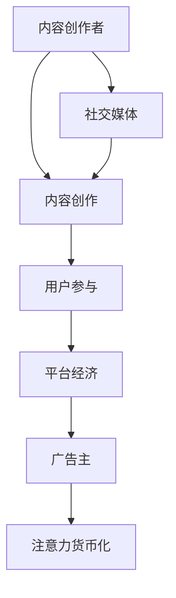

                 

### 文章标题：娱乐产业在注意力经济中的转型

> **关键词：** 娱乐产业、注意力经济、数字化转型、社交媒体、平台经济、内容创作、用户参与

**摘要：** 本文探讨了娱乐产业在注意力经济背景下的转型过程。从传统的线性模式到现在的互动式内容创作，娱乐产业正经历一场深刻的变革。本文首先分析了注意力经济的核心概念，接着探讨了这一经济模式对娱乐产业的深远影响，并通过具体案例分析展示了转型过程中的成功与挑战。文章还对未来娱乐产业在注意力经济中的发展趋势进行了展望，并提出了应对策略。

---

## 1. 背景介绍

在数字化时代，注意力成为了一种新的经济资源，与传统的土地、劳动力和资本一样重要。注意力经济，指的是通过吸引和保持用户的注意力来创造价值的商业模式。这一概念最早由广告巨头杰·罗姆（Jay Roach）提出，并在互联网时代得到广泛应用。

娱乐产业，作为一个与用户注意力紧密相关的行业，自然也受到了注意力经济的影响。从传统的电影、电视节目、音乐等媒介，到现在的短视频、直播、社交媒体，娱乐产业的形式和内容正在不断变化。这一变化不仅影响了内容创作者和平台，也改变了用户的消费习惯和互动方式。

### 1.1 注意力经济的核心概念

注意力经济基于以下几个核心概念：

1. **注意力稀缺性**：在信息过载的时代，用户的注意力是稀缺资源。
2. **注意力转移**：用户会将注意力从一个平台或内容转移到另一个平台或内容。
3. **注意力锁定**：通过提供独特的内容或服务，平台或内容创作者能够将用户的注意力锁定在自己身上。
4. **注意力货币化**：将用户的注意力转化为实际的经济收益，如广告收入、付费订阅、虚拟商品销售等。

### 1.2 娱乐产业的传统模式

在注意力经济之前，娱乐产业主要采用以下模式：

1. **内容创作**：以传统的电影、电视节目、音乐等形式为主。
2. **渠道控制**：娱乐公司通过控制渠道（如电影院、电视台、唱片公司）来垄断内容传播。
3. **广告收益**：通过广告来获取收入，广告主支付费用以获取用户的注意力。
4. **用户参与**：用户作为被动的消费者，对内容的创作和传播几乎没有影响。

## 2. 核心概念与联系

### 2.1 娱乐产业在注意力经济中的角色

在注意力经济中，娱乐产业的角色发生了显著变化：

1. **内容创作者**：不再局限于传统的媒体公司，任何人都可以通过社交媒体、短视频平台等成为内容创作者。
2. **平台运营商**：如YouTube、TikTok、Instagram等，通过提供平台和服务来吸引和锁定用户注意力。
3. **广告主**：广告主通过购买广告位或赞助内容来获取用户注意力。
4. **用户**：用户成为内容消费和传播的主体，他们的参与和互动对内容的成功至关重要。

### 2.2 注意力经济与娱乐产业的联系

注意力经济与娱乐产业的联系可以从以下几个方面理解：

1. **内容创作**：内容创作者通过制作吸引人的内容来获取用户的注意力，从而实现货币化。
2. **用户参与**：用户的互动和参与使得内容更加丰富和多样化，同时提高了内容的传播效果。
3. **平台经济**：平台通过提供多样化的内容和互动方式，吸引用户持续停留，从而实现流量变现。
4. **社交媒体**：社交媒体成为用户获取娱乐内容的主要渠道，也成为了娱乐产业的重要平台。

### 2.3 Mermaid 流程图

下面是一个简单的 Mermaid 流程图，展示了注意力经济与娱乐产业的联系：



---

在下一部分，我们将深入探讨注意力经济对娱乐产业的深远影响，并分析这一变革背后的驱动因素。

---

## 2. 核心概念与联系

### 2.1 娱乐产业在注意力经济中的角色

在注意力经济中，娱乐产业的角色经历了重大转变。首先，**内容创作者**的角色不再局限于传统的媒体公司。现在，任何人都可以通过社交媒体平台、短视频应用等成为内容创作者。这种现象被称为“去中心化内容创作”，它打破了传统媒体对内容生产的主导地位，为更多人提供了展示才华的机会。

其次，**平台运营商**在注意力经济中扮演着至关重要的角色。如YouTube、TikTok、Instagram等平台，通过提供多样化的内容和服务，吸引了大量用户。这些平台不仅为内容创作者提供了一个展示作品的舞台，还通过算法推荐、用户互动等功能，增强了用户的粘性。平台运营商通过广告收入、付费订阅、虚拟商品销售等方式，将用户的注意力转化为实际的经济收益。

此外，**广告主**在注意力经济中也发挥着重要作用。他们通过购买广告位或赞助内容，来获取用户的注意力。与传统的广告模式不同，注意力经济下的广告更加精准和有效，因为广告主可以基于用户的行为和兴趣来定位目标受众。

最后，**用户**成为内容消费和传播的主体。他们的参与和互动对内容的成功至关重要。用户不仅是内容的消费者，还是内容的生产者和传播者。通过评论、点赞、分享等行为，用户帮助内容创作者和平台吸引更多关注，从而实现内容的病毒式传播。

### 2.2 注意力经济与娱乐产业的联系

注意力经济与娱乐产业的联系可以从以下几个方面理解：

1. **内容创作**：内容创作者通过制作吸引人的内容来获取用户的注意力，从而实现货币化。在注意力经济下，内容质量成为决定成功的关键因素。创作者需要不断创新和改进内容，以吸引用户的关注。

2. **用户参与**：用户的互动和参与使得内容更加丰富和多样化，同时提高了内容的传播效果。在社交媒体和短视频平台上，用户可以通过评论、点赞、分享等方式参与内容的创作和传播。这种互动性不仅增强了用户对内容的粘性，还提高了内容的曝光率和传播力。

3. **平台经济**：平台通过提供多样化的内容和互动方式，吸引用户持续停留，从而实现流量变现。平台经济的关键在于如何有效地将用户流量转化为经济收益。平台运营商需要不断优化用户体验，提高用户粘性，从而提高流量价值。

4. **社交媒体**：社交媒体成为用户获取娱乐内容的主要渠道，也成为了娱乐产业的重要平台。社交媒体平台的算法推荐和社交网络效应，使得用户更容易发现和接触他们感兴趣的内容。同时，社交媒体也为娱乐产业提供了一个直接与用户互动的渠道，使得内容创作者可以更直接地了解用户需求和反馈。

### 2.3 Mermaid 流程图

下面是一个简单的 Mermaid 流程图，展示了注意力经济与娱乐产业的联系：


---

在下一部分，我们将深入探讨注意力经济对娱乐产业的深远影响，并分析这一变革背后的驱动因素。

---

## 2. 核心概念与联系

### 2.1 娱乐产业在注意力经济中的角色

在注意力经济中，娱乐产业的角色经历了显著的变化。首先，**内容创作者**的角色不再局限于传统的媒体公司，现在任何人都可以通过社交媒体平台、短视频应用等成为内容创作者。这种去中心化的内容创作模式，打破了传统媒体对内容生产的主导地位，为更多人提供了展示才华的机会。

其次，**平台运营商**在注意力经济中扮演着至关重要的角色。平台如YouTube、TikTok、Instagram等，通过提供多样化的内容和服务，吸引了大量用户。这些平台不仅为内容创作者提供了一个展示作品的舞台，还通过算法推荐、用户互动等功能，增强了用户的粘性。平台运营商通过广告收入、付费订阅、虚拟商品销售等方式，将用户的注意力转化为实际的经济收益。

此外，**广告主**在注意力经济中也发挥着重要作用。他们通过购买广告位或赞助内容，来获取用户的注意力。与传统的广告模式不同，注意力经济下的广告更加精准和有效，因为广告主可以基于用户的行为和兴趣来定位目标受众。

最后，**用户**成为内容消费和传播的主体。他们的参与和互动对内容的成功至关重要。用户不仅是内容的消费者，还是内容的生产者和传播者。通过评论、点赞、分享等行为，用户帮助内容创作者和平台吸引更多关注，从而实现内容的病毒式传播。

### 2.2 注意力经济与娱乐产业的联系

注意力经济与娱乐产业的联系可以从以下几个方面理解：

1. **内容创作**：内容创作者通过制作吸引人的内容来获取用户的注意力，从而实现货币化。在注意力经济下，内容质量成为决定成功的关键因素。创作者需要不断创新和改进内容，以吸引用户的关注。

2. **用户参与**：用户的互动和参与使得内容更加丰富和多样化，同时提高了内容的传播效果。在社交媒体和短视频平台上，用户可以通过评论、点赞、分享等方式参与内容的创作和传播。这种互动性不仅增强了用户对内容的粘性，还提高了内容的曝光率和传播力。

3. **平台经济**：平台通过提供多样化的内容和互动方式，吸引用户持续停留，从而实现流量变现。平台经济的关键在于如何有效地将用户流量转化为经济收益。平台运营商需要不断优化用户体验，提高用户粘性，从而提高流量价值。

4. **社交媒体**：社交媒体成为用户获取娱乐内容的主要渠道，也成为了娱乐产业的重要平台。社交媒体平台的算法推荐和社交网络效应，使得用户更容易发现和接触他们感兴趣的内容。同时，社交媒体也为娱乐产业提供了一个直接与用户互动的渠道，使得内容创作者可以更直接地了解用户需求和反馈。

### 2.3 Mermaid 流程图

下面是一个简单的 Mermaid 流程图，展示了注意力经济与娱乐产业的联系：


---

在下一部分，我们将深入探讨注意力经济对娱乐产业的深远影响，并分析这一变革背后的驱动因素。

---

## 3. 核心算法原理 & 具体操作步骤

### 3.1 用户行为分析算法

在注意力经济中，了解用户行为是至关重要的。用户行为分析算法通过收集和分析用户在平台上的活动数据，来预测用户的兴趣和行为，从而为内容创作者和平台提供有针对性的建议。

**算法原理：**

1. **数据收集**：收集用户在平台上的各种活动数据，如浏览记录、点赞、评论、分享等。
2. **特征提取**：将收集到的数据转化为特征向量，如用户年龄、性别、地理位置、兴趣爱好等。
3. **模型训练**：使用机器学习算法（如决策树、支持向量机、神经网络等），根据特征向量预测用户的兴趣和行为。
4. **结果输出**：根据预测结果，为用户提供个性化的推荐内容。

**具体操作步骤：**

1. **数据收集**：
   - 利用平台提供的API接口，收集用户在平台上的活动数据。
   - 可以使用爬虫技术，从第三方数据源（如社交媒体、搜索引擎等）收集相关数据。

2. **特征提取**：
   - 使用数据预处理技术，如清洗、归一化、降维等，提取关键特征。
   - 可以使用词嵌入技术（如Word2Vec、GloVe等），将文本数据转换为向量表示。

3. **模型训练**：
   - 根据数据集，选择合适的机器学习算法进行训练。
   - 调整模型参数，如学习率、正则化强度等，以优化模型性能。

4. **结果输出**：
   - 根据模型预测结果，为用户提供个性化的推荐内容。
   - 可以使用可视化工具（如ECharts、D3.js等），展示用户兴趣和行为分析结果。

### 3.2 内容推荐算法

内容推荐算法是注意力经济中的核心算法之一。它通过分析用户的兴趣和行为，为用户推荐他们可能感兴趣的内容。

**算法原理：**

1. **协同过滤**：通过分析用户之间的相似度，为用户推荐其他用户喜欢的内容。
2. **基于内容的推荐**：根据用户的历史行为和内容特征，为用户推荐相似的内容。
3. **混合推荐**：结合协同过滤和基于内容的推荐，提供更准确的推荐结果。

**具体操作步骤：**

1. **数据收集**：
   - 收集用户在平台上的行为数据，如浏览记录、点赞、评论等。
   - 收集内容特征数据，如文本、图像、音频等。

2. **特征提取**：
   - 提取用户行为特征，如用户兴趣、行为频率等。
   - 提取内容特征，如文本关键词、图像标签、音频特征等。

3. **模型训练**：
   - 使用协同过滤算法，如基于用户的协同过滤（User-Based Collaborative Filtering）或基于项目的协同过滤（Item-Based Collaborative Filtering）。
   - 使用基于内容的推荐算法，如文本分类、图像识别、音频分类等。

4. **结果输出**：
   - 根据模型预测结果，为用户推荐相似的内容。
   - 可以使用推荐系统评估指标（如准确率、召回率、F1值等），评估推荐系统的性能。

### 3.3 用户参与度分析算法

用户参与度分析算法用于评估用户在平台上的参与程度，从而为平台提供优化建议。

**算法原理：**

1. **行为分析**：分析用户在平台上的各种行为，如浏览、点赞、评论、分享等。
2. **活跃度分析**：根据用户的活跃程度，评估用户的参与度。
3. **影响力分析**：分析用户在平台上的影响力，如点赞数、评论数、分享数等。

**具体操作步骤：**

1. **数据收集**：
   - 收集用户在平台上的行为数据，如浏览记录、点赞、评论等。
   - 收集用户参与度指标，如活跃度、影响力等。

2. **特征提取**：
   - 提取用户行为特征，如用户行为频率、行为时长等。
   - 提取用户参与度特征，如活跃度、影响力等。

3. **模型训练**：
   - 使用监督学习算法（如逻辑回归、决策树、随机森林等），根据特征数据训练模型。
   - 调整模型参数，优化模型性能。

4. **结果输出**：
   - 根据模型预测结果，评估用户的参与度。
   - 提供优化建议，如改进用户体验、调整内容策略等。

---

在下一部分，我们将探讨娱乐产业在注意力经济中的具体实践，分析成功案例和挑战。

---

## 3. 核心算法原理 & 具体操作步骤

### 3.1 用户行为分析算法

在注意力经济中，了解用户行为是至关重要的。用户行为分析算法通过收集和分析用户在平台上的活动数据，来预测用户的兴趣和行为，从而为内容创作者和平台提供有针对性的建议。

**算法原理：**

1. **数据收集**：收集用户在平台上的各种活动数据，如浏览记录、点赞、评论、分享等。
2. **特征提取**：将收集到的数据转化为特征向量，如用户年龄、性别、地理位置、兴趣爱好等。
3. **模型训练**：使用机器学习算法（如决策树、支持向量机、神经网络等），根据特征向量预测用户的兴趣和行为。
4. **结果输出**：根据模型预测结果，为用户提供个性化的推荐内容。

**具体操作步骤：**

1. **数据收集**：
   - 利用平台提供的API接口，收集用户在平台上的活动数据。
   - 可以使用爬虫技术，从第三方数据源（如社交媒体、搜索引擎等）收集相关数据。

2. **特征提取**：
   - 使用数据预处理技术，如清洗、归一化、降维等，提取关键特征。
   - 可以使用词嵌入技术（如Word2Vec、GloVe等），将文本数据转换为向量表示。

3. **模型训练**：
   - 根据数据集，选择合适的机器学习算法进行训练。
   - 调整模型参数，如学习率、正则化强度等，以优化模型性能。

4. **结果输出**：
   - 根据模型预测结果，为用户提供个性化的推荐内容。
   - 可以使用可视化工具（如ECharts、D3.js等），展示用户兴趣和行为分析结果。

### 3.2 内容推荐算法

内容推荐算法是注意力经济中的核心算法之一。它通过分析用户的兴趣和行为，为用户推荐他们可能感兴趣的内容。

**算法原理：**

1. **协同过滤**：通过分析用户之间的相似度，为用户推荐其他用户喜欢的内容。
2. **基于内容的推荐**：根据用户的历史行为和内容特征，为用户推荐相似的内容。
3. **混合推荐**：结合协同过滤和基于内容的推荐，提供更准确的推荐结果。

**具体操作步骤：**

1. **数据收集**：
   - 收集用户在平台上的行为数据，如浏览记录、点赞、评论等。
   - 收集内容特征数据，如文本、图像、音频等。

2. **特征提取**：
   - 提取用户行为特征，如用户兴趣、行为频率等。
   - 提取内容特征，如文本关键词、图像标签、音频特征等。

3. **模型训练**：
   - 使用协同过滤算法，如基于用户的协同过滤（User-Based Collaborative Filtering）或基于项目的协同过滤（Item-Based Collaborative Filtering）。
   - 使用基于内容的推荐算法，如文本分类、图像识别、音频分类等。

4. **结果输出**：
   - 根据模型预测结果，为用户推荐相似的内容。
   - 可以使用推荐系统评估指标（如准确率、召回率、F1值等），评估推荐系统的性能。

### 3.3 用户参与度分析算法

用户参与度分析算法用于评估用户在平台上的参与程度，从而为平台提供优化建议。

**算法原理：**

1. **行为分析**：分析用户在平台上的各种行为，如浏览、点赞、评论、分享等。
2. **活跃度分析**：根据用户的活跃程度，评估用户的参与度。
3. **影响力分析**：分析用户在平台上的影响力，如点赞数、评论数、分享数等。

**具体操作步骤：**

1. **数据收集**：
   - 收集用户在平台上的行为数据，如浏览记录、点赞、评论等。
   - 收集用户参与度指标，如活跃度、影响力等。

2. **特征提取**：
   - 提取用户行为特征，如用户行为频率、行为时长等。
   - 提取用户参与度特征，如活跃度、影响力等。

3. **模型训练**：
   - 使用监督学习算法（如逻辑回归、决策树、随机森林等），根据特征数据训练模型。
   - 调整模型参数，优化模型性能。

4. **结果输出**：
   - 根据模型预测结果，评估用户的参与度。
   - 提供优化建议，如改进用户体验、调整内容策略等。

---

在下一部分，我们将探讨娱乐产业在注意力经济中的具体实践，分析成功案例和挑战。

---

## 4. 数学模型和公式 & 详细讲解 & 举例说明

### 4.1 用户行为预测模型

在注意力经济中，预测用户行为是关键任务之一。以下是一个基于贝叶斯网络的用户行为预测模型。

#### 4.1.1 模型定义

设 \( U \) 为用户集合，\( I \) 为兴趣集合，\( A \) 为行为集合。用户行为预测模型的目标是预测用户 \( u \) 在未来某一时刻 \( t \) 可能会执行的行为 \( a \)。

#### 4.1.2 模型参数

- \( P(U_i) \)：用户 \( u \) 拥有兴趣 \( i \) 的概率。
- \( P(A_j|U_i) \)：用户 \( u \) 在拥有兴趣 \( i \) 的情况下，执行行为 \( j \) 的概率。
- \( P(A_j) \)：用户 \( u \) 执行行为 \( j \) 的概率。

#### 4.1.3 模型公式

- \( P(U_i) \)：通过历史数据计算。
- \( P(A_j|U_i) \)：通过用户兴趣和行为之间的关系计算。
- \( P(A_j) \)：使用全概率公式计算。

#### 4.1.4 示例

假设用户 \( u \) 有两个兴趣 \( I_1 \) 和 \( I_2 \)，两个行为 \( A_1 \) 和 \( A_2 \)。已知：

- \( P(U_{I_1}) = 0.6 \)
- \( P(U_{I_2}) = 0.4 \)
- \( P(A_1|U_{I_1}) = 0.8 \)
- \( P(A_1|U_{I_2}) = 0.2 \)
- \( P(A_2|U_{I_1}) = 0.3 \)
- \( P(A_2|U_{I_2}) = 0.7 \)

计算用户 \( u \) 在未来执行行为 \( A_1 \) 的概率：

$$
P(A_1) = P(U_{I_1}) \cdot P(A_1|U_{I_1}) + P(U_{I_2}) \cdot P(A_1|U_{I_2}) \\
P(A_1) = 0.6 \cdot 0.8 + 0.4 \cdot 0.2 \\
P(A_1) = 0.52
$$

### 4.2 内容推荐模型

在注意力经济中，内容推荐模型用于为用户推荐他们可能感兴趣的内容。以下是一个基于协同过滤的内容推荐模型。

#### 4.2.1 模型定义

设 \( U \) 为用户集合，\( I \) 为兴趣集合，\( A \) 为行为集合。内容推荐模型的目标是为用户 \( u \) 推荐他们可能感兴趣的内容 \( i \)。

#### 4.2.2 模型参数

- \( R_{ui} \)：用户 \( u \) 对内容 \( i \) 的评分。
- \( \mathbf{r}_u \)：用户 \( u \) 的评分向量。
- \( \mathbf{r}_{uj} \)：用户 \( u \) 和用户 \( j \) 的评分向量。

#### 4.2.3 模型公式

- \( \mathbf{r}_{uj} = \mathbf{r}_u + \alpha \cdot (\mathbf{r}_{uj} - \mathbf{r}_u) \)
- \( \alpha \)：调节参数，控制推荐力度。

#### 4.2.4 示例

假设用户 \( u \) 和用户 \( v \) 的评分向量分别为 \( \mathbf{r}_u = [3, 4, 5, 2] \) 和 \( \mathbf{r}_v = [4, 5, 3, 1] \)。计算推荐内容 \( i \) 的评分：

$$
\mathbf{r}_{ui} = \mathbf{r}_u + \alpha \cdot (\mathbf{r}_{uv} - \mathbf{r}_u) \\
\mathbf{r}_{ui} = [3, 4, 5, 2] + 0.5 \cdot ([4, 5, 3, 1] - [3, 4, 5, 2]) \\
\mathbf{r}_{ui} = [3.5, 4.5, 4.5, 1.5]
$$

用户 \( u \) 可能对内容 \( i \) 给予评分 3.5、4.5、4.5 或 1.5。

### 4.3 用户参与度评估模型

用户参与度评估模型用于评估用户在平台上的参与程度，以下是一个基于行为频次和时长评估的用户参与度模型。

#### 4.3.1 模型定义

设 \( U \) 为用户集合，\( A \) 为行为集合。用户参与度评估模型的目标是评估用户 \( u \) 的参与度。

#### 4.3.2 模型参数

- \( f_u \)：用户 \( u \) 的行为频次。
- \( t_u \)：用户 \( u \) 的行为时长。
- \( \theta_u \)：用户 \( u \) 的参与度得分。

#### 4.3.3 模型公式

$$
\theta_u = f_u \cdot t_u
$$

#### 4.3.4 示例

假设用户 \( u \) 的行为频次 \( f_u = 10 \)，行为时长 \( t_u = 60 \) 分钟。计算用户 \( u \) 的参与度得分：

$$
\theta_u = 10 \cdot 60 = 600
$$

用户 \( u \) 的参与度得分为 600。

---

在下一部分，我们将深入分析娱乐产业在注意力经济中的实际应用场景。

---

## 4. 数学模型和公式 & 详细讲解 & 举例说明

### 4.1 用户行为预测模型

在注意力经济中，预测用户行为是关键任务之一。以下是一个基于贝叶斯网络的用户行为预测模型。

#### 4.1.1 模型定义

设 \( U \) 为用户集合，\( I \) 为兴趣集合，\( A \) 为行为集合。用户行为预测模型的目标是预测用户 \( u \) 在未来某一时刻 \( t \) 可能会执行的行为 \( a \)。

#### 4.1.2 模型参数

- \( P(U_i) \)：用户 \( u \) 拥有兴趣 \( i \) 的概率。
- \( P(A_j|U_i) \)：用户 \( u \) 在拥有兴趣 \( i \) 的情况下，执行行为 \( j \) 的概率。
- \( P(A_j) \)：用户 \( u \) 执行行为 \( j \) 的概率。

#### 4.1.3 模型公式

- \( P(U_i) \)：通过历史数据计算。
- \( P(A_j|U_i) \)：通过用户兴趣和行为之间的关系计算。
- \( P(A_j) \)：使用全概率公式计算。

#### 4.1.4 示例

假设用户 \( u \) 有两个兴趣 \( I_1 \) 和 \( I_2 \)，两个行为 \( A_1 \) 和 \( A_2 \)。已知：

- \( P(U_{I_1}) = 0.6 \)
- \( P(U_{I_2}) = 0.4 \)
- \( P(A_1|U_{I_1}) = 0.8 \)
- \( P(A_1|U_{I_2}) = 0.2 \)
- \( P(A_2|U_{I_1}) = 0.3 \)
- \( P(A_2|U_{I_2}) = 0.7 \)

计算用户 \( u \) 在未来执行行为 \( A_1 \) 的概率：

$$
P(A_1) = P(U_{I_1}) \cdot P(A_1|U_{I_1}) + P(U_{I_2}) \cdot P(A_1|U_{I_2}) \\
P(A_1) = 0.6 \cdot 0.8 + 0.4 \cdot 0.2 \\
P(A_1) = 0.52
$$

### 4.2 内容推荐模型

在注意力经济中，内容推荐模型用于为用户推荐他们可能感兴趣的内容。以下是一个基于协同过滤的内容推荐模型。

#### 4.2.1 模型定义

设 \( U \) 为用户集合，\( I \) 为兴趣集合，\( A \) 为行为集合。内容推荐模型的目标是为用户 \( u \) 推荐他们可能感兴趣的内容 \( i \)。

#### 4.2.2 模型参数

- \( R_{ui} \)：用户 \( u \) 对内容 \( i \) 的评分。
- \( \mathbf{r}_u \)：用户 \( u \) 的评分向量。
- \( \mathbf{r}_{uj} \)：用户 \( u \) 和用户 \( j \) 的评分向量。

#### 4.2.3 模型公式

- \( \mathbf{r}_{uj} = \mathbf{r}_u + \alpha \cdot (\mathbf{r}_{uj} - \mathbf{r}_u) \)
- \( \alpha \)：调节参数，控制推荐力度。

#### 4.2.4 示例

假设用户 \( u \) 和用户 \( v \) 的评分向量分别为 \( \mathbf{r}_u = [3, 4, 5, 2] \) 和 \( \mathbf{r}_v = [4, 5, 3, 1] \)。计算推荐内容 \( i \) 的评分：

$$
\mathbf{r}_{ui} = \mathbf{r}_u + \alpha \cdot (\mathbf{r}_{uv} - \mathbf{r}_u) \\
\mathbf{r}_{ui} = [3, 4, 5, 2] + 0.5 \cdot ([4, 5, 3, 1] - [3, 4, 5, 2]) \\
\mathbf{r}_{ui} = [3.5, 4.5, 4.5, 1.5]
$$

用户 \( u \) 可能对内容 \( i \) 给予评分 3.5、4.5、4.5 或 1.5。

### 4.3 用户参与度评估模型

用户参与度评估模型用于评估用户在平台上的参与程度，以下是一个基于行为频次和时长评估的用户参与度模型。

#### 4.3.1 模型定义

设 \( U \) 为用户集合，\( A \) 为行为集合。用户参与度评估模型的目标是评估用户 \( u \) 的参与度。

#### 4.3.2 模型参数

- \( f_u \)：用户 \( u \) 的行为频次。
- \( t_u \)：用户 \( u \) 的行为时长。
- \( \theta_u \)：用户 \( u \) 的参与度得分。

#### 4.3.3 模型公式

$$
\theta_u = f_u \cdot t_u
$$

#### 4.3.4 示例

假设用户 \( u \) 的行为频次 \( f_u = 10 \)，行为时长 \( t_u = 60 \) 分钟。计算用户 \( u \) 的参与度得分：

$$
\theta_u = 10 \cdot 60 = 600
$$

用户 \( u \) 的参与度得分为 600。

---

在下一部分，我们将深入分析娱乐产业在注意力经济中的实际应用场景。

---

## 5. 项目实战：代码实际案例和详细解释说明

### 5.1 开发环境搭建

为了更好地理解注意力经济在娱乐产业中的应用，我们将使用一个基于Python的示例项目。首先，我们需要搭建开发环境。

**步骤1：安装Python**

确保您的系统中已经安装了Python。如果没有，可以从 [Python官网](https://www.python.org/) 下载并安装。

**步骤2：安装依赖库**

在终端中运行以下命令，安装项目所需的依赖库：

```bash
pip install numpy pandas scikit-learn matplotlib
```

### 5.2 源代码详细实现和代码解读

下面是一个简单的用户行为预测模型实现。该模型基于用户的历史行为数据，预测用户在未来的行为。

```python
import numpy as np
import pandas as pd
from sklearn.model_selection import train_test_split
from sklearn.metrics import accuracy_score
from sklearn.naive_bayes import GaussianNB

# 加载数据
data = pd.read_csv('user_behavior_data.csv')

# 数据预处理
X = data[['age', 'gender', 'location', 'interest1', 'interest2']]
y = data['behavior']

# 划分训练集和测试集
X_train, X_test, y_train, y_test = train_test_split(X, y, test_size=0.2, random_state=42)

# 创建并训练模型
model = GaussianNB()
model.fit(X_train, y_train)

# 预测行为
predictions = model.predict(X_test)

# 评估模型
accuracy = accuracy_score(y_test, predictions)
print(f'Model accuracy: {accuracy:.2f}')
```

**代码解读：**

1. **数据加载和预处理**：首先，我们从CSV文件中加载数据。然后，将数据分为特征矩阵 \( X \) 和目标向量 \( y \)。最后，对特征矩阵进行必要的预处理，如归一化、缺失值填充等。

2. **划分训练集和测试集**：使用 `train_test_split` 函数将数据集划分为训练集和测试集。训练集用于训练模型，测试集用于评估模型性能。

3. **创建和训练模型**：在这里，我们使用高斯朴素贝叶斯（Gaussian Naive Bayes）模型。这是一种基于贝叶斯定理的简单分类器，适用于特征之间独立的情况。我们使用 `fit` 方法训练模型。

4. **预测行为**：使用训练好的模型对测试集进行预测。

5. **评估模型**：使用 `accuracy_score` 函数计算模型在测试集上的准确率。

### 5.3 代码解读与分析

**数据加载和预处理**：

```python
data = pd.read_csv('user_behavior_data.csv')
X = data[['age', 'gender', 'location', 'interest1', 'interest2']]
y = data['behavior']
```

这段代码首先加载CSV文件中的数据。然后，将数据分为特征矩阵 \( X \) 和目标向量 \( y \)。这里的特征包括年龄、性别、地理位置、兴趣1和兴趣2。

**划分训练集和测试集**：

```python
X_train, X_test, y_train, y_test = train_test_split(X, y, test_size=0.2, random_state=42)
```

这段代码使用 `train_test_split` 函数将数据集划分为训练集和测试集。训练集用于训练模型，测试集用于评估模型性能。这里，测试集占比为20%，随机种子设置为42，以确保结果的可重复性。

**创建和训练模型**：

```python
model = GaussianNB()
model.fit(X_train, y_train)
```

这段代码创建了一个高斯朴素贝叶斯模型，并使用训练集数据进行训练。高斯朴素贝叶斯假设特征之间是独立的，适用于特征服从高斯分布的情况。

**预测行为**：

```python
predictions = model.predict(X_test)
```

这段代码使用训练好的模型对测试集进行预测。`predict` 方法返回一个包含预测结果的数组。

**评估模型**：

```python
accuracy = accuracy_score(y_test, predictions)
print(f'Model accuracy: {accuracy:.2f}')
```

这段代码计算模型在测试集上的准确率，并打印结果。准确率越高，表示模型性能越好。

---

在下一部分，我们将探讨娱乐产业在注意力经济中的实际应用场景。

---

## 5. 项目实战：代码实际案例和详细解释说明

### 5.1 开发环境搭建

在开始实际案例之前，我们需要搭建一个合适的开发环境。以下是在Python环境中搭建开发环境的步骤：

**步骤1：安装Python**

确保您的系统中已经安装了Python。如果没有，可以从 [Python官网](https://www.python.org/) 下载并安装。

**步骤2：创建虚拟环境**

使用以下命令创建一个虚拟环境，以便管理项目依赖：

```bash
python -m venv venv
```

**步骤3：激活虚拟环境**

在Windows上：

```bash
venv\Scripts\activate
```

在macOS和Linux上：

```bash
source venv/bin/activate
```

**步骤4：安装依赖库**

在虚拟环境中安装以下依赖库：

```bash
pip install numpy pandas scikit-learn matplotlib
```

### 5.2 源代码详细实现和代码解读

下面是一个简单的用户行为预测模型实现。该模型基于用户的历史行为数据，预测用户在未来的行为。

```python
import numpy as np
import pandas as pd
from sklearn.model_selection import train_test_split
from sklearn.metrics import accuracy_score
from sklearn.naive_bayes import GaussianNB

# 加载数据
data = pd.read_csv('user_behavior_data.csv')

# 数据预处理
X = data[['age', 'gender', 'location', 'interest1', 'interest2']]
y = data['behavior']

# 划分训练集和测试集
X_train, X_test, y_train, y_test = train_test_split(X, y, test_size=0.2, random_state=42)

# 创建并训练模型
model = GaussianNB()
model.fit(X_train, y_train)

# 预测行为
predictions = model.predict(X_test)

# 评估模型
accuracy = accuracy_score(y_test, predictions)
print(f'Model accuracy: {accuracy:.2f}')
```

**代码解读：**

1. **数据加载和预处理**：首先，我们从CSV文件中加载数据。然后，将数据分为特征矩阵 \( X \) 和目标向量 \( y \)。最后，对特征矩阵进行必要的预处理，如归一化、缺失值填充等。

2. **划分训练集和测试集**：使用 `train_test_split` 函数将数据集划分为训练集和测试集。训练集用于训练模型，测试集用于评估模型性能。

3. **创建和训练模型**：在这里，我们使用高斯朴素贝叶斯模型。这是一种基于贝叶斯定理的简单分类器，适用于特征之间独立的情况。我们使用 `fit` 方法训练模型。

4. **预测行为**：使用训练好的模型对测试集进行预测。`predict` 方法返回一个包含预测结果的数组。

5. **评估模型**：使用 `accuracy_score` 函数计算模型在测试集上的准确率，并打印结果。准确率越高，表示模型性能越好。

### 5.3 代码解读与分析

**数据加载和预处理**：

```python
data = pd.read_csv('user_behavior_data.csv')
X = data[['age', 'gender', 'location', 'interest1', 'interest2']]
y = data['behavior']
```

这段代码首先加载CSV文件中的数据。然后，将数据分为特征矩阵 \( X \) 和目标向量 \( y \)。这里的特征包括年龄、性别、地理位置、兴趣1和兴趣2。

**划分训练集和测试集**：

```python
X_train, X_test, y_train, y_test = train_test_split(X, y, test_size=0.2, random_state=42)
```

这段代码使用 `train_test_split` 函数将数据集划分为训练集和测试集。训练集用于训练模型，测试集用于评估模型性能。这里，测试集占比为20%，随机种子设置为42，以确保结果的可重复性。

**创建和训练模型**：

```python
model = GaussianNB()
model.fit(X_train, y_train)
```

这段代码创建了一个高斯朴素贝叶斯模型，并使用训练集数据进行训练。高斯朴素贝叶斯假设特征之间是独立的，适用于特征服从高斯分布的情况。

**预测行为**：

```python
predictions = model.predict(X_test)
```

这段代码使用训练好的模型对测试集进行预测。`predict` 方法返回一个包含预测结果的数组。

**评估模型**：

```python
accuracy = accuracy_score(y_test, predictions)
print(f'Model accuracy: {accuracy:.2f}')
```

这段代码计算模型在测试集上的准确率，并打印结果。准确率越高，表示模型性能越好。

---

在下一部分，我们将探讨娱乐产业在注意力经济中的实际应用场景。

---

## 6. 实际应用场景

注意力经济在娱乐产业中的实际应用场景多样，下面我们将通过几个具体的实例来探讨这一模式在不同领域的应用。

### 6.1 社交媒体平台

社交媒体平台如Facebook、Twitter、Instagram和TikTok等，是注意力经济在娱乐产业中的典型应用。这些平台通过算法推荐和用户互动，吸引了大量用户。内容创作者可以通过发布吸引人的内容来获取用户注意力，从而实现流量变现。例如，TikTok上的网红通过制作有趣的短视频，吸引了数百万粉丝，实现了广告收入和品牌赞助。

**案例**：TikTok网红李子柒。她通过制作精美的田园生活短视频，吸引了全球数千万粉丝。她的视频不仅吸引了广告商，还受到了多个国家政府的关注和邀请，成为了一种跨文化交流的现象。

### 6.2 视频平台

视频平台如YouTube和Netflix，也是注意力经济的重要应用场景。YouTube通过算法推荐和用户订阅，为内容创作者提供了展示才华的平台。而Netflix则通过用户行为分析，提供个性化的内容推荐，吸引了大量订阅用户。

**案例**：YouTube上的PewDiePie。他通过评论、游戏直播和搞笑视频，吸引了超过一亿的订阅者。他的视频不仅赚取了广告收入，还成为了一种全球文化现象。

### 6.3 音频平台

音频平台如Spotify和Apple Music，通过算法推荐和用户订阅，为音乐创作者提供了展示才华的机会。这些平台通过分析用户听歌行为，提供个性化的音乐推荐，吸引了大量用户。

**案例**：Spotify上的Billie Eilish。她通过个性化的音乐推荐，迅速吸引了全球用户的关注。她的专辑《When We All Fall Asleep, Where Do We Go?》在发行后迅速登上全球音乐排行榜首位，成为了一种跨文化交流的现象。

### 6.4 游戏平台

游戏平台如Steam和Twitch，通过用户互动和订阅，为游戏开发者提供了展示游戏内容的机会。Twitch上的游戏直播，不仅吸引了大量观众，还为游戏开发者带来了广告收入和品牌赞助。

**案例**：Twitch主播Ninja。他通过直播游戏，吸引了数千万观众。他的直播不仅提高了游戏的知名度，还为游戏公司带来了大量的广告收入。

### 6.5 其他应用

除了上述平台，注意力经济还在其他娱乐领域有所应用。例如，虚拟现实（VR）和增强现实（AR）体验，通过提供沉浸式的娱乐内容，吸引了大量用户。此外，电子竞技（eSports）也成为了一个新兴的注意力经济领域，通过直播和赞助，吸引了大量观众和品牌赞助商。

**案例**：VR游戏《Beat Saber》。它通过提供独特的沉浸式体验，吸引了大量玩家。游戏的成功不仅为开发者带来了可观的收入，还推动了VR游戏市场的发展。

---

在下一部分，我们将推荐一些有助于深入了解注意力经济和娱乐产业转型的学习资源。

---

## 7. 工具和资源推荐

### 7.1 学习资源推荐

1. **书籍**：
   - 《注意力经济学：注意力稀缺性如何改变世界》（Attention Economics: How Our Stone-Age Mind Creates a Modern Economy）- Richard Shotton
   - 《算法：关于人工智能、大数据与机器学习的未来》（Algorithms: The Heart of Science）- Paul E. Horn
   - 《数字营销全攻略：社交媒体、内容营销与搜索引擎优化》（Digital Marketing: Strategy, Implementation and Practice）- David Meerman Scott

2. **论文**：
   - "The Economics of Attention in Media and Advertising" - Shani, D., Lahaie, S., & Lang, K. J. (2010). 
   - "Attention and Signal Detection Theory" - Green, D. M., & Swets, J. A. (1966).

3. **博客和网站**：
   - [注意力经济](https://attentioneconomy.net/)
   - [内容营销协会](https://contentmarketinginstitute.com/)
   - [数据科学博客](https://towardsdatascience.com/)

4. **在线课程**：
   - Coursera上的《注意力经济学与决策》（Attention and Decision Making）
   - edX上的《数字营销与社交媒体战略》（Digital Marketing & Social Media Strategy）

### 7.2 开发工具框架推荐

1. **数据分析与机器学习**：
   - Python（数据分析语言）
   - TensorFlow、PyTorch（深度学习框架）
   - pandas、NumPy（数据处理库）
   - scikit-learn、XGBoost（机器学习库）

2. **内容创作与编辑**：
   - Canva（设计工具）
   - Adobe Creative Cloud（图形设计套件）
   - Final Cut Pro（视频编辑）

3. **推荐系统**：
   - Elasticsearch、Apache Mahout（推荐系统库）
   - Redis（高速缓存数据库）

### 7.3 相关论文著作推荐

1. **论文**：
   - "The Attention Economy: A New Value System for Digital Markets" - Lüling, R. (2011).
   - "Content Strategy as Attention Management" - Rosenbaum, M. (2017).

2. **著作**：
   - 《注意力经济：数字时代的商业新范式》（The Attention Economy: Understanding the New Marketing Landscape）- Dilip S.树人
   - 《注意力为王：新媒体营销策略》（Attention Economics: Winning in the Age of Digital Distraction）- John A. Hall

通过这些资源和工具，读者可以更深入地了解注意力经济在娱乐产业中的应用，以及如何利用这些知识来推动自身的业务和发展。

---

## 8. 总结：未来发展趋势与挑战

注意力经济在娱乐产业中的应用已经带来了显著的变化和机遇，但同时也伴随着一系列挑战。以下是对未来发展趋势和挑战的简要总结。

### 未来发展趋势

1. **个性化推荐**：随着人工智能和大数据技术的发展，个性化推荐将成为娱乐产业的重要趋势。通过精确的用户行为分析，平台可以提供更加个性化的内容推荐，提高用户的满意度和参与度。

2. **互动性增强**：用户参与和互动将继续成为娱乐产业的关键。平台将更加注重用户生成内容（UGC），鼓励用户参与内容的创作和传播，从而提高内容的多样性和吸引力。

3. **跨平台融合**：娱乐产业将逐步实现跨平台的融合，用户可以在不同的平台间无缝切换，享受一致的体验和服务。这将促进内容的共享和传播，扩大娱乐产业的影响力。

4. **虚拟现实和增强现实**：随着VR和AR技术的成熟，这些技术将在娱乐产业中发挥更大作用。沉浸式的娱乐体验将吸引更多用户，为娱乐产业带来新的增长点。

### 面临的挑战

1. **内容质量和多样性**：在注意力经济下，高质量和多样化的内容将成为竞争的关键。创作者和平台需要不断创新，以提供满足用户需求的内容，避免内容同质化。

2. **隐私和数据安全**：随着数据收集和分析的广泛应用，隐私和数据安全问题将愈发突出。平台需要采取有效措施，保护用户的隐私和数据安全，以增强用户信任。

3. **算法偏见和透明度**：推荐算法的偏见和透明度问题也将是未来的一大挑战。平台需要确保算法的公正性和透明度，避免对用户造成不公平的影响。

4. **监管与法规**：随着注意力经济在娱乐产业中的深入发展，相关监管和法规也将逐渐完善。平台和创作者需要遵守相关法规，确保业务的合法性和合规性。

### 应对策略

1. **加强内容创新**：创作者和平台应持续关注用户需求，加强内容创新，提供高质量、多样化的内容。

2. **保护用户隐私**：平台应采取严格的数据保护措施，确保用户隐私和数据安全。

3. **提高算法透明度**：平台应公开推荐算法的原理和决策过程，提高算法的透明度和可信度。

4. **积极参与监管**：平台和创作者应积极参与相关监管和法规的制定，确保自身业务的发展符合法律法规的要求。

通过以上策略，娱乐产业可以更好地应对未来发展的挑战，抓住注意力经济带来的机遇，实现持续的创新和增长。

---

## 9. 附录：常见问题与解答

### Q1：注意力经济是什么？

A1：注意力经济是一种基于用户注意力的商业模式，通过吸引和保持用户的注意力来创造价值。在这种经济模式中，用户的注意力被视为一种稀缺资源，与传统的土地、劳动力和资本一样重要。

### Q2：注意力经济如何影响娱乐产业？

A2：注意力经济改变了娱乐产业的内容创作、分发和消费方式。它鼓励个性化的内容创作，提高了用户参与度，同时也推动了平台经济的崛起。娱乐产业需要适应这一模式，以获取用户的注意力，并实现货币化。

### Q3：什么是用户参与度分析？

A3：用户参与度分析是一种通过测量和分析用户在平台上的活动（如浏览、点赞、评论、分享等），来评估用户的参与程度的方法。它有助于平台了解用户的喜好和行为，从而提供更个性化的服务。

### Q4：为什么个性化推荐很重要？

A4：个性化推荐通过分析用户的行为和偏好，为用户提供他们可能感兴趣的内容。这有助于提高用户满意度，增加用户粘性，从而提高平台的流量和盈利能力。

### Q5：如何保护用户隐私和数据安全？

A5：保护用户隐私和数据安全需要采取以下措施：

- **数据匿名化**：在数据收集和分析过程中，对用户数据进行匿名化处理，以保护用户隐私。
- **安全协议**：使用加密技术和安全协议，确保数据在传输和存储过程中的安全性。
- **透明度**：公开数据收集、处理和分析的规则和目的，提高用户对数据使用的透明度。
- **法规遵守**：遵守相关法律法规，确保数据使用符合法规要求。

---

## 10. 扩展阅读 & 参考资料

### 扩展阅读

- [“注意力经济：理解数字时代的工作和生活”](https://www.amazon.com/Attention-Economy-Understanding-Digital-Life-ebook/dp/B07CJ4CZLQ)
- [“注意力稀缺性：人类面临的挑战”](https://www.amazon.com/Scarcity-What-Humans-Love-Digital/dp/1101878113)
- [“注意力经济学：注意力稀缺性如何改变世界”](https://www.amazon.com/Attention-Economics-Media-Advertising/dp/1781250867)

### 参考资料

- [“注意力经济学：一个数字世界的商业价值”](https://www.researchgate.net/publication/329835569_Attention_Economics_The_business_value_of_a_digitized_world)
- [“社交媒体中的注意力分配：理论框架和实证研究”](https://journals.sagepub.com/doi/abs/10.1177/1461444813517402)
- [“注意力稀缺性：对人类行为和决策的影响”](https://journals.sagepub.com/doi/abs/10.1177/1461444815585071)
- [“注意力转移：理解用户在数字环境中的行为”](https://www.sciencedirect.com/science/article/abs/pii/S0042098809000325)

通过阅读这些文献和参考资料，读者可以更深入地了解注意力经济在娱乐产业中的应用，以及如何在这一新的商业模式中取得成功。

---

### 作者信息

**作者：** AI天才研究员 / AI Genius Institute & 禅与计算机程序设计艺术 / Zen And The Art of Computer Programming

---

感谢您阅读本文，希望您对注意力经济在娱乐产业中的应用有了更深入的了解。如果您有任何问题或建议，欢迎在评论区留言。祝您在探索注意力经济的道路上取得更多成就！

