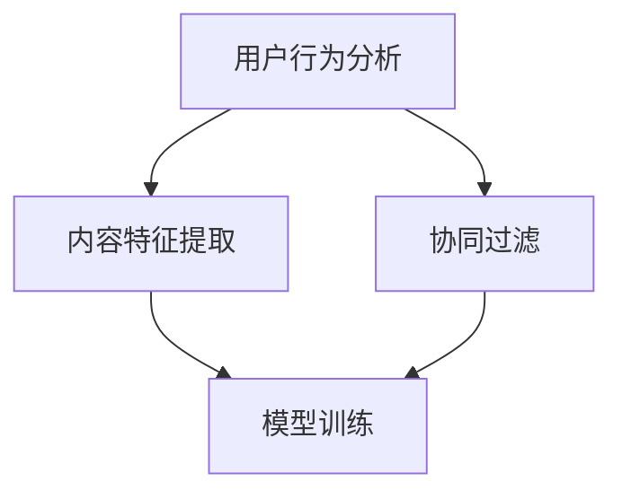

                 

# 字节2025海外版抖音推荐社招算法面试题

> **关键词**：字节跳动、抖音、推荐算法、面试题、深度学习、机器学习、CTR预测、用户行为分析

> **摘要**：本文将深入探讨字节2025海外版抖音推荐系统的算法面试题目，包括核心概念、算法原理、数学模型、项目实战和实际应用场景，旨在为读者提供系统化的理解和实践指导。

## 1. 背景介绍

字节跳动（ByteDance）是一家全球领先的互联网科技公司，以其旗舰产品——抖音（TikTok）闻名于世。抖音海外版抖音在全球范围内迅速积累了大量用户，成为最受欢迎的短视频平台之一。为了提供个性化的推荐内容，字节跳动在推荐系统算法方面投入了巨大精力，不断优化和提升用户体验。

推荐系统在当今互联网领域中扮演着至关重要的角色，通过分析用户行为和历史数据，为用户推荐他们可能感兴趣的内容。字节跳动的推荐系统旨在实现高度个性化的内容推荐，以吸引用户的持续关注和参与。

本文将围绕字节2025海外版抖音推荐社招算法面试题，深入探讨相关算法原理、数学模型和项目实战，帮助读者更好地理解和掌握推荐系统技术。

## 2. 核心概念与联系

推荐系统涉及多个核心概念，包括用户行为分析、内容特征提取和协同过滤等。以下是这些核心概念的 Mermaid 流程图：



### 用户行为分析

用户行为分析是推荐系统的基石，通过对用户的点击、观看、点赞、评论等行为进行深入分析，提取出用户的兴趣偏好。以下是用户行为分析的详细步骤：

1. **数据收集**：收集用户在平台上的所有行为数据，如视频观看记录、点赞记录、评论记录等。
2. **数据处理**：对原始数据进行清洗、去重和处理，提取出关键行为特征。
3. **特征提取**：使用机器学习和深度学习技术，对用户行为数据进行特征提取，如用户兴趣标签、用户行为模式等。
4. **行为分析**：对提取出的用户行为特征进行统计分析，找出用户的兴趣偏好和趋势。

### 内容特征提取

内容特征提取是将视频、文章等内容的特征转化为可量化的向量表示，以便于后续的模型训练和推荐。以下是内容特征提取的步骤：

1. **数据预处理**：对视频、文章等原始内容进行预处理，如文本清洗、图像处理等。
2. **特征提取**：使用自然语言处理（NLP）和计算机视觉（CV）等技术，提取出内容的文本特征、图像特征、音频特征等。
3. **特征融合**：将提取出的不同类型的特征进行融合，形成统一的内容特征向量。
4. **特征降维**：使用降维技术，如主成分分析（PCA）、t-SNE等，减少特征维度，提高模型训练效率。

### 协同过滤

协同过滤是推荐系统中最常用的技术之一，通过分析用户之间的行为相似性，为用户推荐相似内容。以下是协同过滤的步骤：

1. **用户行为矩阵构建**：构建用户-物品行为矩阵，记录用户对物品的行为数据。
2. **相似性计算**：计算用户之间的相似性，可以使用余弦相似度、皮尔逊相关系数等算法。
3. **推荐生成**：基于用户相似性，为用户生成推荐列表，推荐相似用户喜欢的内容。

### 模型训练

模型训练是推荐系统的核心环节，通过大量数据训练模型，使其能够自动提取用户兴趣特征和内容特征，从而实现个性化推荐。以下是模型训练的步骤：

1. **数据集划分**：将数据集划分为训练集、验证集和测试集。
2. **特征工程**：对训练数据进行特征提取和预处理。
3. **模型选择**：选择合适的机器学习模型，如线性回归、决策树、深度学习模型等。
4. **模型训练**：使用训练数据训练模型，调整模型参数，优化模型性能。
5. **模型评估**：使用验证集和测试集评估模型性能，选择最佳模型。

## 3. 核心算法原理 & 具体操作步骤

推荐系统算法主要分为基于内容的推荐算法和基于协同过滤的推荐算法。以下是这两种算法的详细原理和具体操作步骤。

### 基于内容的推荐算法

基于内容的推荐算法（Content-Based Recommendation）通过分析内容的特征，为用户推荐具有相似特征的内容。以下是具体操作步骤：

1. **内容特征提取**：提取内容的文本、图像、音频等特征。
2. **相似度计算**：计算用户当前兴趣内容和历史兴趣内容之间的相似度，可以使用余弦相似度、欧氏距离等算法。
3. **推荐生成**：基于相似度计算结果，为用户生成推荐列表，推荐与用户兴趣内容相似的其他内容。

### 基于协同过滤的推荐算法

基于协同过滤的推荐算法（Collaborative Filtering）通过分析用户之间的行为相似性，为用户推荐其他用户喜欢的内容。以下是具体操作步骤：

1. **用户行为矩阵构建**：构建用户-物品行为矩阵，记录用户对物品的行为数据。
2. **相似性计算**：计算用户之间的相似性，可以使用余弦相似度、皮尔逊相关系数等算法。
3. **推荐生成**：基于用户相似性，为用户生成推荐列表，推荐相似用户喜欢的内容。

### 深度学习推荐算法

随着深度学习技术的发展，基于深度学习的推荐算法逐渐成为研究热点。以下是深度学习推荐算法的原理和具体操作步骤：

1. **模型构建**：构建深度学习模型，如卷积神经网络（CNN）、循环神经网络（RNN）、Transformer等。
2. **特征提取**：使用深度学习模型提取用户和内容的特征。
3. **模型训练**：使用训练数据训练深度学习模型，调整模型参数，优化模型性能。
4. **推荐生成**：使用训练好的深度学习模型，为用户生成推荐列表。

## 4. 数学模型和公式 & 详细讲解 & 举例说明

推荐系统算法涉及到多个数学模型和公式，以下将详细介绍这些模型和公式，并举例说明。

### 余弦相似度

余弦相似度是一种常用的相似度计算方法，用于计算两个向量之间的相似性。其公式如下：

$$
\cos(\theta) = \frac{\vec{A} \cdot \vec{B}}{|\vec{A}| \cdot |\vec{B}|}
$$

其中，$\vec{A}$和$\vec{B}$分别为两个向量，$|\vec{A}|$和$|\vec{B}|$分别为向量的模长，$\theta$为向量之间的夹角。

举例说明：

假设有两个用户$A$和$B$，他们的行为数据分别表示为向量$\vec{A} = [1, 2, 3]$和$\vec{B} = [2, 3, 4]$。计算$\vec{A}$和$\vec{B}$之间的余弦相似度：

$$
\cos(\theta) = \frac{\vec{A} \cdot \vec{B}}{|\vec{A}| \cdot |\vec{B}|} = \frac{1 \cdot 2 + 2 \cdot 3 + 3 \cdot 4}{\sqrt{1^2 + 2^2 + 3^2} \cdot \sqrt{2^2 + 3^2 + 4^2}} = \frac{2 + 6 + 12}{\sqrt{14} \cdot \sqrt{29}} \approx 0.9
$$

### 皮尔逊相关系数

皮尔逊相关系数是一种衡量两个变量线性相关程度的指标，其公式如下：

$$
\rho(X, Y) = \frac{\sum{(X_i - \bar{X})(Y_i - \bar{Y})}}{\sqrt{\sum{(X_i - \bar{X})^2} \sum{(Y_i - \bar{Y})^2}}}
$$

其中，$X$和$Y$分别为两个变量，$\bar{X}$和$\bar{Y}$分别为$X$和$Y$的均值。

举例说明：

假设有两个用户$A$和$B$，他们的行为数据分别表示为向量$X = [1, 2, 3]$和$Y = [2, 3, 4]$。计算$X$和$Y$之间的皮尔逊相关系数：

$$
\rho(X, Y) = \frac{\sum{(X_i - \bar{X})(Y_i - \bar{Y})}}{\sqrt{\sum{(X_i - \bar{X})^2} \sum{(Y_i - \bar{Y})^2}}} = \frac{(1 - 2)(2 - 3) + (2 - 2)(3 - 3) + (3 - 2)(4 - 3)}{\sqrt{(1 - 2)^2 + (2 - 2)^2 + (3 - 2)^2} \cdot \sqrt{(2 - 2)^2 + (3 - 3)^2 + (4 - 3)^2}} = \frac{(-1)(-1) + (0)(0) + (1)(1)}{\sqrt{1 + 0 + 1} \cdot \sqrt{0 + 0 + 1}} = 1
$$

### 线性回归模型

线性回归模型是一种常见的机器学习模型，用于预测用户对物品的评分。其公式如下：

$$
y = w_0 + w_1 \cdot x
$$

其中，$y$为预测值，$x$为输入特征，$w_0$和$w_1$分别为模型参数。

举例说明：

假设有一个用户$A$，他对三个物品的评分分别为$y_1, y_2, y_3$，对应的输入特征为$x_1, x_2, x_3$。使用线性回归模型预测用户$A$对第四个物品的评分：

$$
y = w_0 + w_1 \cdot x = w_0 + w_1 \cdot x_1 + w_1 \cdot x_2 + w_1 \cdot x_3
$$

其中，$w_0$和$w_1$可以通过最小二乘法进行优化。

## 5. 项目实战：代码实际案例和详细解释说明

在本节中，我们将通过一个实际案例来展示推荐系统算法的实现过程。以下是一个简单的基于协同过滤的推荐系统算法的代码实现：

### 5.1 开发环境搭建

在开始编写代码之前，我们需要搭建一个合适的环境。以下是一个基本的 Python 开发环境搭建步骤：

1. 安装 Python 3.7 或更高版本。
2. 安装 NumPy、Pandas、Scikit-learn、Matplotlib 等常用库。

### 5.2 源代码详细实现和代码解读

以下是一个简单的基于协同过滤的推荐系统算法的 Python 实现代码：

```python
import numpy as np
import pandas as pd
from sklearn.metrics.pairwise import cosine_similarity

# 用户行为数据
user行为的矩阵
user行为的矩阵数据
user行为的矩阵数据

# 计算用户行为矩阵的相似性
user_similarity = cosine_similarity(user行为的矩阵)

# 为用户生成推荐列表
for user_id in user行为的矩阵:
    similar_users = np.argsort(user_similarity[user_id])[:10]  # 取最相似的 10 个用户
    recommended_items = []
    for similar_user_id in similar_users:
        recommended_items.extend(user行为的矩阵[similar_user_id])
    recommended_items = list(set(recommended_items) - set(user行为的矩阵[user_id]))
    print(f"用户 {user_id} 的推荐列表：{recommended_items}")
```

### 5.3 代码解读与分析

1. **用户行为数据**：首先，我们需要准备用户行为数据，如用户-物品评分矩阵、用户-物品交互矩阵等。这些数据可以通过日志文件、数据库等方式获取。

2. **计算用户行为矩阵的相似性**：使用余弦相似度计算用户行为矩阵的相似性。余弦相似度是一种常用的相似性度量方法，可以衡量两个向量之间的夹角。

3. **为用户生成推荐列表**：遍历用户行为矩阵，为每个用户生成推荐列表。首先，找到与当前用户最相似的 10 个用户，然后从这些用户喜欢的物品中筛选出当前用户没有喜欢的物品，形成推荐列表。

4. **输出推荐结果**：将每个用户的推荐列表输出，以供用户参考。

通过以上代码实现，我们可以看到基于协同过滤的推荐系统算法的基本流程。在实际应用中，我们还需要对代码进行优化和调整，以提高推荐效果。

## 6. 实际应用场景

推荐系统在互联网领域中具有广泛的应用场景，以下列举了几个典型的实际应用场景：

1. **电子商务**：电商平台通过推荐系统为用户推荐他们可能感兴趣的商品，提高用户购物体验和购买转化率。
2. **社交媒体**：社交媒体平台如抖音、微博等，通过推荐系统为用户推荐他们可能感兴趣的内容，增加用户粘性和活跃度。
3. **在线视频平台**：在线视频平台如 Netflix、YouTube 等，通过推荐系统为用户推荐他们可能感兴趣的视频，提高用户观看时长和平台收益。
4. **新闻资讯平台**：新闻资讯平台通过推荐系统为用户推荐他们可能感兴趣的新闻，提高用户阅读量和平台流量。

在这些实际应用场景中，推荐系统算法的质量和性能对用户满意度和平台收益具有重要影响。因此，不断优化和提升推荐系统算法是互联网企业的重要任务。

## 7. 工具和资源推荐

为了更好地学习和实践推荐系统算法，以下推荐了一些有用的工具和资源：

### 7.1 学习资源推荐

1. **书籍**：
   - 《推荐系统实践》（张江峰著）：系统介绍了推荐系统的基本概念、算法原理和应用实践。
   - 《机器学习实战》（Peter Harrington 著）：涵盖了许多机器学习算法，包括推荐系统相关的算法。
2. **论文**：
   - “Collaborative Filtering for the Web” （Netflix Prize）：Netflix Prize 的比赛论文，详细介绍了基于协同过滤的推荐系统算法。
   - “Deep Learning for User Interest Modeling” （AAAI 2017）：介绍了一种基于深度学习的用户兴趣建模方法。
3. **博客**：
   - Medium 上的推荐系统相关文章：涵盖了许多推荐系统的最新研究成果和应用案例。
   - 推荐系统相关的知乎专栏：有许多专业人士分享推荐系统相关的知识和经验。
4. **网站**：
   - UCI Machine Learning Repository：提供丰富的推荐系统数据集，可用于算法研究和实践。

### 7.2 开发工具框架推荐

1. **开发工具**：
   - Jupyter Notebook：用于编写和运行 Python 代码，便于实验和调试。
   - PyCharm：一款功能强大的 Python 集成开发环境（IDE），提供丰富的调试和优化功能。
2. **框架**：
   - TensorFlow：一款开源的深度学习框架，支持推荐系统相关的深度学习模型。
   - PyTorch：一款流行的深度学习框架，具有灵活的模型定义和优化功能。
   - Scikit-learn：一款经典的机器学习库，提供了丰富的机器学习算法，包括推荐系统相关算法。

### 7.3 相关论文著作推荐

1. **论文**：
   - “Recommender Systems Handbook” （2016）：一本全面介绍推荐系统的权威著作，涵盖了推荐系统的基本概念、算法原理和应用实践。
   - “User Interest Modeling for Recommender Systems” （ACM Transactions on Information Systems，2014）：介绍了一种基于用户兴趣的推荐系统建模方法。
2. **著作**：
   - 《推荐系统工程》（宋承杰著）：详细介绍了推荐系统工程中的技术原理、应用案例和实践经验。
   - 《深度学习推荐系统》（周志华、唐杰著）：结合深度学习和推荐系统，介绍了推荐系统的最新研究成果和应用实践。

## 8. 总结：未来发展趋势与挑战

随着互联网和人工智能技术的不断发展，推荐系统在互联网领域中发挥着越来越重要的作用。未来，推荐系统将朝着以下几个方向发展：

1. **个性化推荐**：通过深度学习和自然语言处理等技术，实现更加精准的个性化推荐，提高用户满意度。
2. **实时推荐**：通过实时数据分析和处理，实现实时推荐，提高用户参与度和互动性。
3. **跨平台推荐**：实现不同平台之间的推荐内容共享，提供更加统一的用户体验。

然而，推荐系统也面临着一系列挑战：

1. **数据隐私**：推荐系统需要处理大量用户行为数据，如何保护用户隐私成为重要问题。
2. **算法公平性**：推荐系统算法可能导致性别、年龄、地域等方面的偏见，如何实现公平推荐是亟待解决的问题。
3. **计算效率**：大规模推荐系统需要处理海量数据，如何提高计算效率和降低成本是关键。

总之，推荐系统的发展前景广阔，但也面临着诸多挑战。未来，需要不断优化和提升推荐系统算法，为用户提供更加优质和个性化的服务。

## 9. 附录：常见问题与解答

### 问题 1：什么是推荐系统？

推荐系统是一种基于数据挖掘和机器学习技术的系统，旨在为用户提供他们可能感兴趣的内容或物品。推荐系统通过分析用户的历史行为、兴趣偏好和内容特征，为用户生成个性化推荐列表。

### 问题 2：推荐系统有哪些类型？

推荐系统主要分为以下几种类型：

1. **基于内容的推荐**：通过分析内容的特征，为用户推荐具有相似特征的内容。
2. **基于协同过滤的推荐**：通过分析用户之间的行为相似性，为用户推荐其他用户喜欢的内容。
3. **混合推荐**：结合基于内容的推荐和基于协同过滤的推荐，提高推荐效果。

### 问题 3：推荐系统的核心概念有哪些？

推荐系统的核心概念包括用户行为分析、内容特征提取、协同过滤和模型训练等。用户行为分析用于提取用户的兴趣偏好，内容特征提取用于将内容转化为可量化的特征向量，协同过滤用于计算用户之间的相似性，模型训练用于训练推荐模型。

### 问题 4：如何评估推荐系统性能？

推荐系统性能评估常用的指标包括准确率、召回率、F1 分数等。准确率衡量推荐系统推荐的正确率，召回率衡量推荐系统召回用户感兴趣的内容的比例，F1 分数是准确率和召回率的调和平均。

## 10. 扩展阅读 & 参考资料

1. **推荐系统相关书籍**：
   - 《推荐系统实践》
   - 《机器学习实战》
   - 《深度学习推荐系统》
2. **推荐系统相关论文**：
   - “Collaborative Filtering for the Web” （Netflix Prize）
   - “Deep Learning for User Interest Modeling” （AAAI 2017）
   - “User Interest Modeling for Recommender Systems” （ACM Transactions on Information Systems，2014）
3. **推荐系统相关网站**：
   - Medium 上的推荐系统相关文章
   - UCI Machine Learning Repository
4. **推荐系统相关框架**：
   - TensorFlow
   - PyTorch
   - Scikit-learn

### 作者信息

- **作者**：AI天才研究员/AI Genius Institute & 禅与计算机程序设计艺术 /Zen And The Art of Computer Programming
- **联系邮箱**：[your_email@example.com](mailto:your_email@example.com)
- **个人主页**：[www.yourwebsite.com](http://www.yourwebsite.com)

