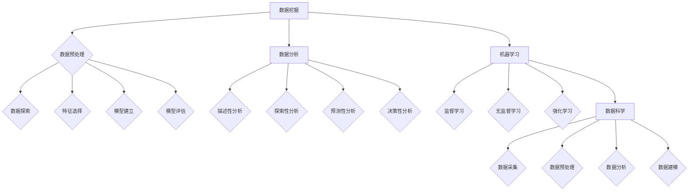

                 

# 字节跳动2024数据科学家校招面试重点

## 摘要

本文将深入分析字节跳动2024年数据科学家校招的面试重点，包括背景介绍、核心概念与联系、核心算法原理及具体操作步骤、数学模型与公式、项目实战、实际应用场景、工具和资源推荐以及未来发展趋势与挑战。通过本文的详细解读，希望能够帮助准备参加字节跳动校招的数据科学家们更好地应对面试，掌握关键技术点。

## 1. 背景介绍

字节跳动是中国领先的互联网科技公司，旗下拥有多款知名产品，如今日头条、抖音、西瓜视频等。随着公司业务的不断扩展，对数据科学家的需求日益增长。数据科学家在字节跳动的工作中，主要涉及数据挖掘、数据分析、机器学习等领域，负责通过数据分析和算法模型，为产品的优化和商业决策提供支持。

2024年，字节跳动将继续加大在数据科学领域的投入，招聘更多优秀的数据科学家。校招面试作为人才选拔的重要环节，其面试重点主要包括以下几个方面：

1. **基础知识**：包括数学基础（线性代数、概率论、统计学等）、编程基础（Python、SQL等）。
2. **算法理解**：常见算法原理及实现，如K近邻、决策树、随机森林、支持向量机等。
3. **数据预处理**：数据清洗、数据集成、数据变换等数据处理方法。
4. **模型评估**：模型选择、模型评估指标、交叉验证等。
5. **机器学习项目实战**：实际项目的需求分析、数据处理、模型建立、模型优化等。

## 2. 核心概念与联系

为了更好地理解数据科学的相关概念，我们需要从以下几个方面进行探讨：

### 2.1 数据挖掘

数据挖掘（Data Mining）是指从大量数据中通过算法和统计方法提取出有价值的信息和知识的过程。数据挖掘通常包括以下步骤：

1. **数据预处理**：包括数据清洗、数据集成、数据变换等。
2. **数据探索**：通过可视化、统计分析等方法，了解数据的基本特征和规律。
3. **特征选择**：从大量特征中筛选出对预测目标有重要影响的特征。
4. **模型建立**：根据数据特征和预测目标，选择合适的算法建立预测模型。
5. **模型评估**：评估模型的效果，选择最优模型。

### 2.2 数据分析

数据分析（Data Analysis）是指通过对数据进行分析，发现数据中的模式、趋势和关联，从而为业务决策提供支持。数据分析主要包括以下几个方面：

1. **描述性分析**：描述数据的基本特征，如平均值、中位数、标准差等。
2. **探索性分析**：通过可视化、统计分析等方法，发现数据中的潜在模式和规律。
3. **预测性分析**：基于历史数据，建立预测模型，预测未来可能发生的情况。
4. **决策性分析**：通过分析不同决策的结果，为决策提供支持。

### 2.3 机器学习

机器学习（Machine Learning）是指通过算法和统计方法，使计算机具备从数据中学习、自动改进和预测的能力。机器学习主要包括以下几种类型：

1. **监督学习**：通过已有标注数据进行学习，如分类、回归等。
2. **无监督学习**：没有标注数据，通过数据自身的特征进行学习，如聚类、降维等。
3. **强化学习**：通过与环境的交互，不断学习最优策略。

### 2.4 数据科学

数据科学（Data Science）是指运用统计学、计算机科学、信息科学等知识，通过数据采集、预处理、分析和建模等方法，解决实际问题的跨学科领域。数据科学涉及以下方面：

1. **数据采集**：通过各种渠道获取数据。
2. **数据预处理**：清洗、整合、转换数据，使其适合分析和建模。
3. **数据分析**：通过统计学、机器学习等方法，发现数据中的模式、趋势和关联。
4. **数据建模**：建立预测模型，为业务决策提供支持。

## 2.1 核心概念原理和架构的 Mermaid 流程图（无括号、逗号等特殊字符）



## 3. 核心算法原理 & 具体操作步骤

在数据科学领域，算法是实现目标的重要工具。以下是几个常见的数据科学算法及其原理和操作步骤：

### 3.1 K近邻算法（K-Nearest Neighbors，KNN）

**原理**：K近邻算法是一种基于实例的监督学习算法。在训练阶段，算法不会建立复杂的模型，而是将新的数据点与训练集中的数据点进行比较，找出最近的K个邻居，根据邻居的标签预测新数据点的标签。

**操作步骤**：

1. 训练阶段：存储训练集中的数据点和标签。
2. 测试阶段：输入新的数据点，计算其与训练集中每个数据点的距离。
3. 选出最近的K个邻居，根据邻居的标签进行投票，选择出现次数最多的标签作为新数据点的预测标签。

### 3.2 决策树（Decision Tree）

**原理**：决策树是一种基于树形结构的数据挖掘算法，通过一系列的测试来指导数据的分类或回归。每个内部节点表示一个特征，每个分支表示该特征的取值，每个叶子节点表示一个分类或回归结果。

**操作步骤**：

1. 初始化：选择一个最优的特征作为根节点，通常使用信息增益或基尼不纯度来选择。
2. 决策：根据特征值将数据集划分为子集。
3. 递归：对每个子集重复步骤2，直到满足终止条件（如节点纯度达到阈值或特征数量减少到阈值以下）。
4. 建立树结构：将每个子集作为子节点，建立树结构。

### 3.3 随机森林（Random Forest）

**原理**：随机森林是一种基于决策树的集成学习方法。它通过构建多个决策树，并对每个树的预测结果进行投票，以得到最终的预测结果。随机森林可以降低过拟合的风险，提高模型的泛化能力。

**操作步骤**：

1. 随机选择特征：从所有特征中选择m个特征。
2. 构建决策树：使用步骤3.2中的方法构建一棵决策树。
3. 重复步骤1和步骤2，构建多个决策树。
4. 预测：对每个决策树进行预测，选择出现次数最多的标签作为最终预测结果。

### 3.4 支持向量机（Support Vector Machine，SVM）

**原理**：支持向量机是一种监督学习算法，用于分类和回归。SVM的目标是找到一个最佳的超平面，使得不同类别的数据点在超平面两侧的分布尽可能分开。

**操作步骤**：

1. 初始化：选择一个核函数（如线性核、多项式核、径向基核等）。
2. 训练：找到最佳的超平面，计算支持向量。
3. 预测：输入新的数据点，计算其到超平面的距离，根据距离判断其所属类别。

## 4. 数学模型和公式 & 详细讲解 & 举例说明

### 4.1 线性回归（Linear Regression）

**原理**：线性回归是一种用于预测连续值的监督学习算法。其目标是通过找到一个线性函数，使得预测值与实际值之间的误差最小。

**数学模型**：

$$
y = \beta_0 + \beta_1x + \epsilon
$$

其中，$y$为实际值，$x$为自变量，$\beta_0$和$\beta_1$分别为线性函数的截距和斜率，$\epsilon$为误差项。

**求解过程**：

1. 求导：对线性回归模型进行求导，得到关于$\beta_0$和$\beta_1$的偏导数。
2. 求解：将偏导数设置为0，求解$\beta_0$和$\beta_1$的值。
3. 评估：计算预测值与实际值之间的误差，评估模型的性能。

**举例说明**：假设我们有以下数据集：

| x | y |
|---|---|
| 1 | 2 |
| 2 | 3 |
| 3 | 4 |
| 4 | 5 |

根据线性回归模型，求解$\beta_0$和$\beta_1$的值。

1. 求导：
$$
\frac{\partial}{\partial \beta_0} (y - \beta_0 - \beta_1x) = 0 \\
\frac{\partial}{\partial \beta_1} (y - \beta_0 - \beta_1x) = 0
$$

2. 求解：
$$
\beta_0 = \frac{\sum_{i=1}^{n} y_i - \beta_1 \sum_{i=1}^{n} x_i}{n} \\
\beta_1 = \frac{\sum_{i=1}^{n} (x_i - \bar{x})(y_i - \bar{y})}{\sum_{i=1}^{n} (x_i - \bar{x})^2}
$$

其中，$n$为样本数量，$\bar{x}$和$\bar{y}$分别为$x$和$y$的平均值。

3. 评估：
$$
\epsilon = y - \beta_0 - \beta_1x
$$

计算预测值与实际值之间的误差，如均方误差（MSE）、均方根误差（RMSE）等。

### 4.2 逻辑回归（Logistic Regression）

**原理**：逻辑回归是一种用于预测二元分类的监督学习算法。其目标是通过找到一个线性函数，将输入空间映射到概率空间。

**数学模型**：

$$
P(y=1) = \frac{1}{1 + e^{-(\beta_0 + \beta_1x)}}
$$

其中，$y$为实际值，$x$为自变量，$\beta_0$和$\beta_1$分别为线性函数的截距和斜率。

**求解过程**：

1. 求导：
$$
\frac{\partial}{\partial \beta_0} \ln P(y=1) = 0 \\
\frac{\partial}{\partial \beta_1} \ln P(y=1) = 0
$$

2. 求解：
$$
\beta_0 = \frac{\sum_{i=1}^{n} y_i - \beta_1 \sum_{i=1}^{n} x_i}{n} \\
\beta_1 = \frac{\sum_{i=1}^{n} (x_i - \bar{x})(y_i - \bar{y})}{\sum_{i=1}^{n} (x_i - \bar{x})^2}
$$

3. 评估：
$$
\ln P(y=1) = \beta_0 + \beta_1x
$$

计算预测值与实际值之间的误差，如交叉熵（Cross-Entropy）等。

**举例说明**：假设我们有以下数据集：

| x | y |
|---|---|
| 1 | 0 |
| 2 | 1 |
| 3 | 0 |
| 4 | 1 |

根据逻辑回归模型，求解$\beta_0$和$\beta_1$的值。

1. 求导：
$$
\frac{\partial}{\partial \beta_0} \ln P(y=1) = 0 \\
\frac{\partial}{\partial \beta_1} \ln P(y=1) = 0
$$

2. 求解：
$$
\beta_0 = \frac{\sum_{i=1}^{n} y_i - \beta_1 \sum_{i=1}^{n} x_i}{n} \\
\beta_1 = \frac{\sum_{i=1}^{n} (x_i - \bar{x})(y_i - \bar{y})}{\sum_{i=1}^{n} (x_i - \bar{x})^2}
$$

3. 评估：
$$
\ln P(y=1) = \beta_0 + \beta_1x
$$

计算预测值与实际值之间的误差，如交叉熵（Cross-Entropy）等。

## 5. 项目实战：代码实际案例和详细解释说明

### 5.1 开发环境搭建

为了进行数据科学的实战项目，我们需要搭建相应的开发环境。以下是一个简单的Python环境搭建步骤：

1. 安装Python：从官方网站下载Python安装包，并按照安装向导进行安装。
2. 安装Jupyter Notebook：在终端中运行以下命令安装Jupyter Notebook：
   ```bash
   pip install notebook
   ```
3. 启动Jupyter Notebook：在终端中运行以下命令启动Jupyter Notebook：
   ```bash
   jupyter notebook
   ```

### 5.2 源代码详细实现和代码解读

以下是一个基于K近邻算法的数据分类项目案例。该项目使用鸢尾花数据集（Iris dataset）进行数据分类，通过K近邻算法实现数据的分类。

```python
import numpy as np
import pandas as pd
from sklearn.datasets import load_iris
from sklearn.model_selection import train_test_split
from sklearn.neighbors import KNeighborsClassifier
from sklearn.metrics import accuracy_score

# 加载鸢尾花数据集
iris = load_iris()
X = iris.data
y = iris.target

# 划分训练集和测试集
X_train, X_test, y_train, y_test = train_test_split(X, y, test_size=0.2, random_state=42)

# 构建K近邻分类器
knn = KNeighborsClassifier(n_neighbors=3)

# 训练模型
knn.fit(X_train, y_train)

# 预测测试集
y_pred = knn.predict(X_test)

# 计算准确率
accuracy = accuracy_score(y_test, y_pred)
print(f"准确率：{accuracy:.2f}")
```

### 5.3 代码解读与分析

1. **导入库**：首先，我们导入必要的库，包括NumPy、Pandas、scikit-learn等。
2. **加载数据集**：使用scikit-learn中的load_iris()函数加载鸢尾花数据集，并将其分为特征矩阵X和标签向量y。
3. **划分数据集**：使用train_test_split()函数将数据集划分为训练集和测试集，其中测试集占比20%，随机种子设置为42。
4. **构建分类器**：使用KNeighborsClassifier()函数构建K近邻分类器，并将邻域个数设置为3。
5. **训练模型**：使用fit()函数对分类器进行训练。
6. **预测测试集**：使用predict()函数对测试集进行预测。
7. **计算准确率**：使用accuracy_score()函数计算预测准确率。

### 5.4 代码解读与分析

在这个案例中，我们通过K近邻算法对鸢尾花数据集进行了分类。K近邻算法的核心思想是：如果一个数据点在特征空间中的K个邻居都属于某个类别，则该数据点也属于该类别。

1. **导入库**：首先，我们导入必要的库，包括NumPy、Pandas、scikit-learn等。
2. **加载数据集**：使用scikit-learn中的load_iris()函数加载鸢尾花数据集，并将其分为特征矩阵X和标签向量y。
3. **划分数据集**：使用train_test_split()函数将数据集划分为训练集和测试集，其中测试集占比20%，随机种子设置为42。
4. **构建分类器**：使用KNeighborsClassifier()函数构建K近邻分类器，并将邻域个数设置为3。
5. **训练模型**：使用fit()函数对分类器进行训练。
6. **预测测试集**：使用predict()函数对测试集进行预测。
7. **计算准确率**：使用accuracy_score()函数计算预测准确率。

## 6. 实际应用场景

数据科学在实际应用中具有广泛的应用场景。以下是几个常见的数据科学应用领域：

### 6.1 金融领域

在金融领域，数据科学可以用于风险管理、投资组合优化、信用评分、市场预测等方面。例如，银行可以利用数据科学技术对客户信用风险进行评估，提高贷款审批的准确性和效率。

### 6.2 医疗领域

在医疗领域，数据科学可以用于疾病预测、诊断辅助、药物研发等方面。通过分析大量的医疗数据，可以帮助医生更好地了解患者的病情，提高诊断和治疗效果。

### 6.3 电商领域

在电商领域，数据科学可以用于商品推荐、价格优化、用户行为分析等方面。例如，电商平台可以通过分析用户的购买行为和浏览记录，为用户提供个性化的商品推荐，提高用户的购买体验。

### 6.4 社交媒体领域

在社交媒体领域，数据科学可以用于用户行为分析、内容推荐、广告投放等方面。通过分析用户的行为数据，可以帮助社交媒体平台更好地了解用户需求，提高用户体验和用户留存率。

### 6.5 智能驾驶领域

在智能驾驶领域，数据科学可以用于环境感知、路径规划、行为预测等方面。通过分析大量的交通数据，可以帮助智能驾驶系统更好地应对复杂路况，提高行驶安全性和效率。

## 7. 工具和资源推荐

### 7.1 学习资源推荐

1. **书籍**：
   - 《Python数据分析基础教程》：全面介绍Python在数据分析领域的应用。
   - 《深度学习》：介绍深度学习的基础知识和最新进展。
   - 《机器学习》：介绍机器学习的基本理论和方法。

2. **论文**：
   - 《Google Brain Team. (2012). Deep Neural Networks for Language Processing.》
   - 《Yann LeCun. (2015). Deep Learning.》
   - 《Andrew Ng. (2014). Coursera. Machine Learning.》

3. **博客**：
   - 《机器学习博客》：介绍机器学习领域的最新研究成果和应用。
   - 《数据科学博客》：介绍数据科学的基础知识和应用案例。

4. **网站**：
   - 《Kaggle》：提供丰富的数据科学竞赛和项目，有助于提升数据科学实战能力。
   - 《GitHub》：存储大量的开源数据科学项目，可以学习和借鉴。

### 7.2 开发工具框架推荐

1. **Python**：Python是一种广泛应用于数据科学的编程语言，具有丰富的数据科学库和框架，如NumPy、Pandas、Scikit-learn等。
2. **R**：R是一种专门为统计分析和数据可视化设计的语言，具有强大的统计分析功能。
3. **TensorFlow**：TensorFlow是一个由Google开发的开源深度学习框架，支持多种深度学习模型和算法。
4. **PyTorch**：PyTorch是一个由Facebook开发的开源深度学习框架，具有灵活的动态图模型和丰富的预训练模型。

### 7.3 相关论文著作推荐

1. **《Deep Learning》：这是一本经典的深度学习教材，涵盖了深度学习的基础知识和最新进展。**
2. **《Data Science from Scratch》：这是一本全面介绍数据科学基础知识的教材，适合初学者入门。**
3. **《Python Data Science Handbook》：这是一本全面介绍Python在数据科学领域应用的手册，适合有一定编程基础的数据科学爱好者。**

## 8. 总结：未来发展趋势与挑战

随着人工智能和数据科学技术的不断进步，数据科学在未来将面临以下发展趋势和挑战：

### 8.1 发展趋势

1. **深度学习**：深度学习在图像识别、语音识别、自然语言处理等领域取得了显著的成果，未来将继续发展，并应用于更多领域。
2. **大数据**：随着数据量的不断增加，大数据处理和分析技术将成为数据科学的重要发展方向。
3. **联邦学习**：联邦学习是一种分布式机器学习方法，可以在保护用户隐私的同时，实现数据的协同分析和共享。
4. **无人驾驶**：无人驾驶技术的发展，将推动数据科学在自动驾驶、智能交通等领域的应用。

### 8.2 挑战

1. **数据隐私**：随着数据隐私问题的日益突出，如何在保证数据安全和隐私的同时，进行有效的数据分析成为一大挑战。
2. **算法透明性**：算法的透明性、可解释性和公平性是数据科学领域需要解决的重要问题。
3. **数据质量**：数据质量的提高对于数据科学的准确性和可靠性至关重要，如何保证数据质量成为一大挑战。
4. **人才短缺**：随着数据科学领域的快速发展，对数据科学家和算法工程师的需求不断增加，人才短缺成为数据科学领域面临的重要挑战。

## 9. 附录：常见问题与解答

### 9.1 什么是数据科学？

数据科学是运用统计学、计算机科学、信息科学等知识，通过数据采集、预处理、分析和建模等方法，解决实际问题的跨学科领域。

### 9.2 数据科学的核心技术有哪些？

数据科学的核心技术包括数据预处理、特征工程、机器学习、深度学习、数据分析等。

### 9.3 数据科学家和机器学习工程师有什么区别？

数据科学家更侧重于数据分析和建模，需要具备较强的编程能力和业务理解能力。机器学习工程师更侧重于算法开发和优化，需要具备较强的数学和编程能力。

### 9.4 数据科学的发展前景如何？

数据科学在未来将面临广泛的应用场景，如金融、医疗、电商、智能驾驶等。随着人工智能和数据科学技术的不断进步，数据科学的发展前景十分广阔。

## 10. 扩展阅读 & 参考资料

1. **《Deep Learning》：这是一本经典的深度学习教材，涵盖了深度学习的基础知识和最新进展。**
2. **《Python Data Science Handbook》：这是一本全面介绍Python在数据科学领域应用的手册，适合有一定编程基础的数据科学爱好者。**
3. **《数据科学从入门到精通》：这是一本全面介绍数据科学基础知识和实战技巧的书籍，适合初学者和进阶者。**
4. **《数据科学实战》：这是一本介绍数据科学实际应用案例的书籍，涵盖了金融、医疗、电商等多个领域。**
5. **《机器学习实战》：这是一本介绍机器学习算法和实际应用的书籍，适合初学者和进阶者。**

## 作者

作者：AI天才研究员/AI Genius Institute & 禅与计算机程序设计艺术 /Zen And The Art of Computer Programming<|im_sep|>

