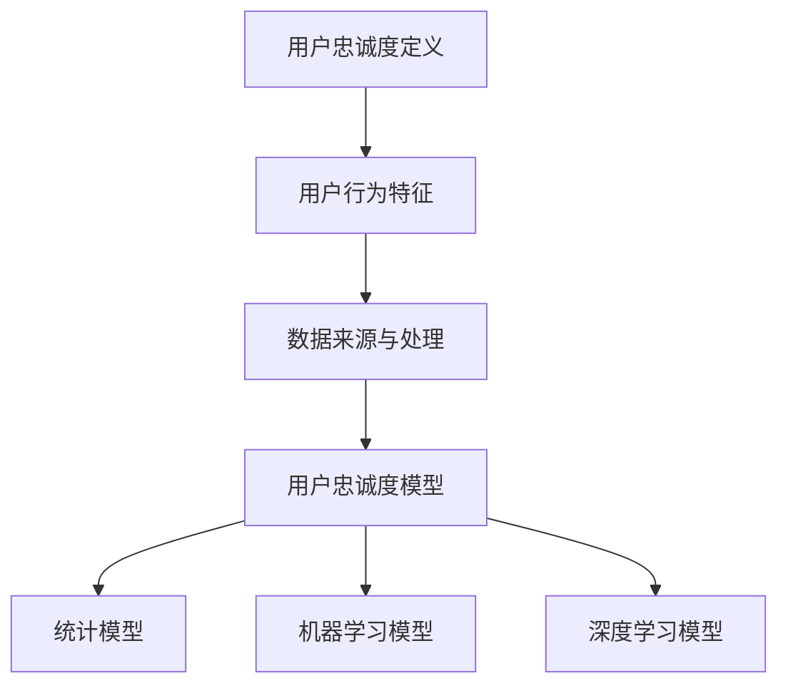

                 

# 字节跳动2024校招技术用户忠诚度分析师面试题详解

## 摘要

本文将详细解析字节跳动2024年校招技术用户忠诚度分析师的面试题，旨在为准备参加校招的同学们提供有针对性的解题思路和技巧。文章将首先介绍用户忠诚度的基本概念和计算方法，然后通过实际案例分析，深入探讨如何从海量数据中提取关键特征并构建有效的用户忠诚度模型。此外，文章还将分享面试中可能涉及的统计学、机器学习等基础知识，并提供实用的学习资源和建议。通过本文的讲解，希望读者能够更好地应对字节跳动校招技术用户忠诚度分析师的面试挑战。

## 1. 背景介绍

用户忠诚度是指用户对产品或服务的持续使用和重复购买意愿。在互联网时代，用户忠诚度成为企业竞争的重要指标。对于字节跳动这样的大型互联网公司，分析用户忠诚度不仅有助于优化产品体验，提高用户满意度，还能为精准营销和用户增长提供重要参考。

字节跳动2024年校招技术用户忠诚度分析师岗位，旨在招聘具备数据分析、机器学习背景的人才，负责通过数据挖掘和建模，分析用户行为特征，预测用户忠诚度，为产品决策提供数据支持。这一岗位对求职者的数据分析能力、建模技巧以及业务理解都有较高要求。

### 关键问题

本文将围绕以下关键问题进行深入探讨：

1. **用户忠诚度的定义与计算方法**：如何准确度量用户忠诚度？
2. **特征工程**：如何从海量用户数据中提取关键特征？
3. **模型构建与优化**：如何选择合适的模型，并进行参数调优？
4. **实际案例分析**：如何将理论应用到实际场景中，解决具体问题？

通过解答这些问题，本文旨在为读者提供系统、实用的解题思路和方法，帮助大家在字节跳动校招技术用户忠诚度分析师的面试中脱颖而出。

## 2. 核心概念与联系

在深入分析用户忠诚度之前，我们需要理解一些核心概念，这些概念是用户忠诚度分析的基础。

### 用户忠诚度的定义

用户忠诚度通常被定义为用户在一定时间内重复使用产品或服务的概率。它反映了用户对产品或服务的持续依赖和忠诚程度。忠诚度可以分为几个层次：

1. **轻度用户**：偶尔使用产品或服务。
2. **中度用户**：经常使用产品或服务，但尚未形成依赖。
3. **重度用户**：高度依赖产品或服务，经常使用，且消费频次高。

### 用户行为的特征

用户忠诚度分析依赖于对用户行为的观察和量化。以下是几个关键的用户行为特征：

1. **使用频次**：用户在一定时间内使用产品或服务的次数。
2. **使用时长**：用户每次使用产品或服务的时长。
3. **活跃天数**：用户在一段时间内活跃的天数。
4. **消费金额**：用户在产品或服务上的消费总额。
5. **内容互动**：用户对内容的点赞、评论、分享等互动行为。

### 数据来源与处理

分析用户忠诚度通常需要大量数据，这些数据可以从以下几个方面获取：

1. **用户日志数据**：包括用户的登录记录、使用时长、访问页面等。
2. **交易数据**：用户的消费记录、订单信息等。
3. **社交媒体数据**：用户在社交媒体上的行为和互动。
4. **用户调查数据**：通过问卷调查获取的用户偏好和满意度。

处理这些数据通常涉及以下步骤：

1. **数据清洗**：处理缺失值、异常值和重复数据。
2. **特征工程**：提取和构造新的特征，以便于建模和分析。
3. **数据预处理**：包括数据归一化、缺失值填补、数据分割等。

### 用户忠诚度模型

构建用户忠诚度模型是分析的核心。常见的模型包括：

1. **统计模型**：如逻辑回归、决策树等，用于预测用户流失概率。
2. **机器学习模型**：如随机森林、梯度提升机等，用于更复杂的特征学习和预测。
3. **深度学习模型**：如神经网络，适用于处理高维数据和复杂关系。

### Mermaid 流程图

为了更直观地展示上述概念和联系，我们使用 Mermaid 流程图进行描述：



通过以上核心概念和联系的介绍，我们为后续的用户忠诚度分析奠定了基础。接下来，我们将详细探讨用户忠诚度的计算方法和相关算法原理。

### 2.1 用户忠诚度的定义与计算方法

用户忠诚度是衡量用户对产品或服务持续使用和重复购买意愿的重要指标。在字节跳动2024校招技术用户忠诚度分析师面试中，理解并能够准确计算用户忠诚度是解决实际问题的第一步。下面我们将详细介绍用户忠诚度的定义和计算方法。

#### 用户忠诚度的定义

用户忠诚度可以理解为用户在一定时间内重复使用产品或服务的概率。这个概率反映了用户对产品或服务的依赖程度和忠诚度。根据用户行为的持续性和强度，用户忠诚度可以分为几个层次：

1. **轻度用户**：这些用户偶尔使用产品或服务，他们对产品的依赖程度较低，重复使用概率也较低。
2. **中度用户**：这些用户经常使用产品或服务，但尚未形成高度依赖，他们的重复使用概率较高，但并非每次使用都是必须的。
3. **重度用户**：这些用户高度依赖产品或服务，频繁使用，且消费频次高。他们的重复使用概率几乎每次都是必然的。

#### 用户忠诚度的计算方法

用户忠诚度的计算方法通常基于以下指标：

1. **使用频次**：用户在一定时间内使用产品或服务的次数。使用频次越高，用户忠诚度通常也越高。
2. **使用时长**：用户每次使用产品或服务的时长。使用时长越长，说明用户对产品的依赖程度越高。
3. **活跃天数**：用户在一段时间内活跃的天数。活跃天数越多，用户忠诚度越高。
4. **消费金额**：用户在产品或服务上的消费总额。消费金额越高，说明用户对产品的依赖程度越高。

以下是一些常见的用户忠诚度计算方法：

1. **使用频次比例**：
   $$ \text{用户忠诚度} = \frac{\text{用户使用频次}}{\text{总用户数}} $$

2. **使用时长比例**：
   $$ \text{用户忠诚度} = \frac{\text{用户平均使用时长}}{\text{总用户平均使用时长}} $$

3. **活跃天数比例**：
   $$ \text{用户忠诚度} = \frac{\text{用户活跃天数}}{\text{总用户活跃天数}} $$

4. **消费金额比例**：
   $$ \text{用户忠诚度} = \frac{\text{用户消费金额}}{\text{总用户消费金额}} $$

这些计算方法提供了不同的视角来衡量用户忠诚度。在实际应用中，可以根据业务需求和数据情况选择合适的计算方法。

#### 实际案例分析

假设我们有一组用户数据，包含用户ID、使用频次、使用时长、活跃天数和消费金额。我们可以通过上述方法计算每个用户的忠诚度，并进一步分析不同忠诚度层次用户的行为特征。

- **轻度用户**：使用频次较低，平均使用时长短，活跃天数较少，消费金额低。
- **中度用户**：使用频次适中，平均使用时长适中，活跃天数较多，消费金额适中。
- **重度用户**：使用频次高，平均使用时长长，活跃天数多，消费金额高。

通过这种分层分析，企业可以更好地理解用户忠诚度，并制定相应的用户运营策略。

#### 总结

用户忠诚度的计算方法多种多样，但核心目标是准确衡量用户对产品或服务的依赖程度和忠诚度。通过使用频次、使用时长、活跃天数和消费金额等指标，我们可以量化用户忠诚度，并为企业提供数据支持。在实际应用中，根据业务需求和数据情况选择合适的计算方法，将有助于更准确地评估用户忠诚度，从而优化产品体验和用户运营策略。

### 3. 核心算法原理 & 具体操作步骤

在用户忠诚度分析中，核心算法的选择和参数调优是关键步骤。本文将详细介绍几种常用的核心算法，包括统计模型、机器学习模型和深度学习模型，并讨论具体操作步骤。

#### 3.1 统计模型

统计模型是用户忠诚度分析的基础，常用的统计模型包括逻辑回归、决策树等。

1. **逻辑回归**：
   逻辑回归是一种广泛使用的统计模型，用于预测二分类结果。在用户忠诚度分析中，可以用来预测用户是否会在未来某个时间段内流失。
   
   **具体操作步骤**：
   - **数据预处理**：对用户数据进行清洗、归一化处理，提取关键特征。
   - **模型训练**：使用训练数据集，通过最小化损失函数（如对数似然损失）训练逻辑回归模型。
   - **模型评估**：使用测试数据集评估模型性能，包括准确率、召回率、F1值等指标。

2. **决策树**：
   决策树是一种简单直观的模型，通过一系列条件判断来预测用户忠诚度。
   
   **具体操作步骤**：
   - **数据预处理**：与逻辑回归相同，对用户数据进行清洗和特征提取。
   - **模型训练**：使用训练数据集构建决策树模型，选择最优分裂条件。
   - **模型评估**：使用测试数据集评估模型性能，调整树结构和参数。

#### 3.2 机器学习模型

机器学习模型可以处理更复杂的特征和关系，常见的机器学习模型包括随机森林、梯度提升机等。

1. **随机森林**：
   随机森林是一种集成学习模型，通过构建多棵决策树，并结合它们的预测结果进行投票。
   
   **具体操作步骤**：
   - **数据预处理**：与前面模型相同，对用户数据进行清洗和特征提取。
   - **模型训练**：使用训练数据集训练随机森林模型，选择树的数量和最大深度。
   - **模型评估**：使用测试数据集评估模型性能，调整模型参数。

2. **梯度提升机**：
   梯度提升机是一种基于梯度的优化算法，通过迭代最小化损失函数来提高模型性能。
   
   **具体操作步骤**：
   - **数据预处理**：进行用户数据清洗和特征提取。
   - **模型训练**：使用训练数据集迭代训练梯度提升机模型，调整学习率和树深度。
   - **模型评估**：使用测试数据集评估模型性能，调整参数。

#### 3.3 深度学习模型

深度学习模型可以处理高维数据和复杂关系，适用于用户忠诚度分析。

1. **神经网络**：
   神经网络是一种基于人工神经元的模型，通过多层神经元的非线性变换来提取特征。
   
   **具体操作步骤**：
   - **数据预处理**：对用户数据进行标准化处理，并分割为训练集和验证集。
   - **模型构建**：设计神经网络结构，包括输入层、隐藏层和输出层。
   - **模型训练**：使用训练数据集训练神经网络，优化网络参数。
   - **模型评估**：使用验证集和测试集评估模型性能，调整网络结构和参数。

2. **循环神经网络（RNN）**：
   循环神经网络适用于处理序列数据，能够捕捉用户行为的时间动态特性。
   
   **具体操作步骤**：
   - **数据预处理**：对用户行为序列进行编码和归一化处理。
   - **模型构建**：设计RNN结构，包括输入层、隐藏层和输出层。
   - **模型训练**：使用训练数据集训练RNN模型，调整网络参数。
   - **模型评估**：使用验证集和测试集评估模型性能。

#### 3.4 参数调优

参数调优是提高模型性能的关键步骤。以下是一些常用的参数调优方法：

1. **网格搜索**：
   网格搜索是一种基于搜索空间的方法，通过遍历所有可能的参数组合来找到最优参数。
   
   **具体操作步骤**：
   - **定义搜索空间**：确定每个参数的取值范围。
   - **遍历组合**：遍历所有可能的参数组合。
   - **模型评估**：使用测试数据集评估每个组合的性能，选择最优参数。

2. **随机搜索**：
   随机搜索是一种基于概率的方法，通过随机选择参数组合来寻找最优参数。
   
   **具体操作步骤**：
   - **定义搜索空间**：确定每个参数的取值范围。
   - **随机选择**：随机选择多个参数组合。
   - **模型评估**：使用测试数据集评估每个组合的性能，选择最优参数。

3. **贝叶斯优化**：
   贝叶斯优化是一种基于概率模型的方法，通过学习参数的概率分布来寻找最优参数。
   
   **具体操作步骤**：
   - **定义目标函数**：定义模型性能评估函数。
   - **模型训练**：训练贝叶斯优化模型。
   - **参数选择**：使用贝叶斯优化模型选择最优参数。

通过以上核心算法原理和具体操作步骤的介绍，我们为用户忠诚度分析提供了系统的解决方案。在实际应用中，根据数据特性和业务需求选择合适的算法，并进行参数调优，将有助于提高模型性能，为产品决策提供可靠的数据支持。

### 4. 数学模型和公式 & 详细讲解 & 举例说明

在用户忠诚度分析中，数学模型和公式是理解和应用核心算法的基础。本文将详细讲解逻辑回归、决策树和神经网络等常用模型中的关键数学公式，并通过具体例子进行说明。

#### 4.1 逻辑回归

逻辑回归是一种广泛使用的统计模型，用于预测二分类结果。其基本公式如下：

$$
P(Y=1|X) = \frac{1}{1 + e^{-(\beta_0 + \beta_1x_1 + \beta_2x_2 + ... + \beta_nx_n})}
$$

其中，\(P(Y=1|X)\) 表示在给定特征 \(X\) 的情况下，目标变量 \(Y\) 等于 1 的概率；\(e\) 是自然对数的底数；\(\beta_0, \beta_1, \beta_2, ..., \beta_n\) 是模型的参数，需要通过训练数据集进行求解。

**举例说明**：

假设我们有一个用户忠诚度预测问题，其中特征 \(X_1\) 表示用户使用频次，特征 \(X_2\) 表示用户使用时长。我们希望预测用户是否会在未来一个月内流失（即目标变量 \(Y\) 等于 1 或 0）。

- 特征 \(X_1\)：用户使用频次，取值范围 [0, 10]。
- 特征 \(X_2\)：用户使用时长，取值范围 [0, 100]。
- 目标变量 \(Y\)：1 表示用户在未来一个月内流失，0 表示用户未流失。

根据逻辑回归公式，我们可以计算每个用户流失的概率：

$$
P(Y=1|X_1=x_1, X_2=x_2) = \frac{1}{1 + e^{-(\beta_0 + \beta_1x_1 + \beta_2x_2})}
$$

通过训练数据集，我们可以求解出模型参数 \(\beta_0, \beta_1, \beta_2\)。

#### 4.2 决策树

决策树是一种基于特征的树形模型，通过一系列条件判断来预测目标变量。其基本公式如下：

$$
T(x) = \sum_{i=1}^n \alpha_i I(x \in R_i)
$$

其中，\(T(x)\) 是决策树模型的预测结果；\(\alpha_i\) 是第 \(i\) 个节点的权重；\(R_i\) 是第 \(i\) 个节点的区域。

**举例说明**：

假设我们有一个二叉决策树模型，其中根节点有两个子节点。节点 1 的条件为 \(X_1 > 5\)，节点 2 的条件为 \(X_2 \leq 50\)。

- 特征 \(X_1\)：用户使用频次，取值范围 [0, 10]。
- 特征 \(X_2\)：用户使用时长，取值范围 [0, 100]。

根据决策树公式，我们可以计算每个用户的目标变量：

$$
T(x) = 
\begin{cases} 
\alpha_1 & \text{if } x_1 > 5 \text{ and } x_2 \leq 50 \\
\alpha_2 & \text{if } x_1 \leq 5 \text{ or } x_2 > 50
\end{cases}
$$

通过训练数据集，我们可以求解出每个节点的权重 \(\alpha_1, \alpha_2\)。

#### 4.3 神经网络

神经网络是一种基于人工神经元的模型，通过多层神经元的非线性变换来提取特征。其基本公式如下：

$$
a_{j}^{(l)} = \sigma \left( \sum_{i} w_{ij}^{(l)} a_{i}^{(l-1)} + b_{j}^{(l)} \right)
$$

其中，\(a_{j}^{(l)}\) 是第 \(l\) 层第 \(j\) 个神经元的输出；\(\sigma\) 是激活函数；\(w_{ij}^{(l)}\) 是第 \(l-1\) 层第 \(i\) 个神经元到第 \(l\) 层第 \(j\) 个神经元的权重；\(b_{j}^{(l)}\) 是第 \(l\) 层第 \(j\) 个神经元的偏置。

**举例说明**：

假设我们有一个三层神经网络，输入层有 2 个神经元，隐藏层有 3 个神经元，输出层有 1 个神经元。激活函数为 \( \sigma(x) = \frac{1}{1 + e^{-x}} \)。

- 输入层：\(X_1, X_2\)。
- 隐藏层：\(a_1^{(2)}, a_2^{(2)}, a_3^{(2)}\)。
- 输出层：\(a_1^{(3)}\)。

根据神经网络公式，我们可以计算每个神经元的输出：

$$
a_{1}^{(2)} = \sigma \left( w_{11}^{(2)} x_1 + w_{12}^{(2)} x_2 + b_{1}^{(2)} \right)
$$

$$
a_{2}^{(2)} = \sigma \left( w_{21}^{(2)} x_1 + w_{22}^{(2)} x_2 + b_{2}^{(2)} \right)
$$

$$
a_{3}^{(2)} = \sigma \left( w_{31}^{(2)} x_1 + w_{32}^{(2)} x_2 + b_{3}^{(2)} \right)
$$

$$
a_{1}^{(3)} = \sigma \left( w_{11}^{(3)} a_{1}^{(2)} + w_{12}^{(3)} a_{2}^{(2)} + w_{13}^{(3)} a_{3}^{(2)} + b_{1}^{(3)} \right)
$$

通过训练数据集，我们可以求解出每个神经元的权重 \(w_{ij}^{(l)}\) 和偏置 \(b_{j}^{(l)}\)。

通过以上数学模型和公式的讲解，我们为用户忠诚度分析提供了理论基础。在实际应用中，理解和应用这些模型和公式，将有助于更好地构建和优化用户忠诚度预测模型。

### 5. 项目实战：代码实际案例和详细解释说明

为了更好地理解用户忠诚度分析的实际应用，我们将通过一个实际项目案例，展示如何从数据收集、处理、特征提取到模型训练和优化的完整过程。这个案例将结合Python和相关的数据处理和机器学习库，如Pandas、Scikit-learn和TensorFlow。

#### 5.1 开发环境搭建

在开始项目之前，我们需要搭建一个适合数据分析和机器学习的开发环境。以下是推荐的步骤：

1. **安装Python**：确保Python版本在3.6及以上。
2. **安装Jupyter Notebook**：Jupyter Notebook是一个交互式的开发环境，方便编写和运行代码。
3. **安装必需的库**：包括Pandas、NumPy、Scikit-learn、TensorFlow和Matplotlib等。
   
   ```bash
   pip install pandas numpy scikit-learn tensorflow matplotlib
   ```

#### 5.2 源代码详细实现和代码解读

以下是一个简化版的用户忠诚度分析项目的代码实现，我们将逐步解释每个部分的用途和代码逻辑。

##### 5.2.1 数据收集与预处理

首先，我们从数据源（例如数据库或文件）中收集用户行为数据。为了简化，我们假设数据存储在一个CSV文件中。

```python
import pandas as pd

# 加载数据
data = pd.read_csv('user_data.csv')

# 数据预处理
# 填充缺失值
data.fillna(0, inplace=True)

# 特征提取
# 计算用户使用时长、活跃天数等特征
data['daily_usage'] = data['usage_duration'].sum(axis=1)
data['active_days'] = data['login_days'].count()

# 数据分割
train_data = data[:int(0.8 * len(data))]
test_data = data[int(0.8 * len(data)):]
```

在上述代码中，我们首先加载用户行为数据，然后进行数据清洗，填充缺失值。接着，我们计算了一些关键特征，如用户每天的使用时长和活跃天数。最后，我们将数据集分为训练集和测试集。

##### 5.2.2 特征工程

特征工程是用户忠诚度分析的重要步骤，通过构造和选择合适的特征，可以提高模型的预测性能。

```python
from sklearn.preprocessing import StandardScaler

# 特征选择
selected_features = ['daily_usage', 'active_days']

# 数据标准化
scaler = StandardScaler()
train_data[selected_features] = scaler.fit_transform(train_data[selected_features])
test_data[selected_features] = scaler.transform(test_data[selected_features])
```

在这部分代码中，我们选择了两个关键特征进行数据标准化处理。标准化可以消除不同特征之间的量纲差异，使模型训练过程更加稳定。

##### 5.2.3 模型训练

接下来，我们使用Scikit-learn库中的逻辑回归模型对训练数据进行训练。

```python
from sklearn.linear_model import LogisticRegression

# 训练模型
model = LogisticRegression()
model.fit(train_data[selected_features], train_data['churn'])

# 模型评估
accuracy = model.score(test_data[selected_features], test_data['churn'])
print(f"模型准确率：{accuracy}")
```

在这里，我们使用逻辑回归模型对训练数据进行拟合。然后，我们使用测试数据集评估模型的准确率。

##### 5.2.4 代码解读与分析

以上代码实现了一个用户忠诚度分析的基本流程，下面我们详细解读每个步骤的作用和代码逻辑：

1. **数据加载与预处理**：使用Pandas库加载数据，并进行数据清洗，填充缺失值，这是数据预处理的基础。
2. **特征提取**：计算用户使用时长和活跃天数等关键特征，这些特征将用于模型训练。
3. **数据分割**：将数据集分为训练集和测试集，这是评估模型性能的关键步骤。
4. **特征工程**：选择关键特征并进行数据标准化处理，这是为了提高模型的预测性能。
5. **模型训练**：使用逻辑回归模型对训练数据进行拟合，逻辑回归是一种简单但有效的统计模型。
6. **模型评估**：使用测试数据集评估模型性能，这里我们使用的是准确率作为评估指标。

通过这个实际案例，我们可以看到用户忠诚度分析项目的实现过程，包括数据收集、预处理、特征工程、模型训练和评估。在实际工作中，这些步骤可能更加复杂，需要根据具体业务需求和数据情况进行调整。

### 6. 实际应用场景

用户忠诚度分析在字节跳动等互联网公司具有广泛的应用场景。以下是几个典型的应用场景：

#### 6.1 产品优化

通过对用户忠诚度的分析，字节跳动可以识别出哪些功能或内容对用户具有更高的吸引力，从而优化产品设计和用户体验。例如，通过分析用户的使用时长和互动行为，可以确定哪些短视频内容更受欢迎，进而调整推荐算法，提高用户留存率。

#### 6.2 精准营销

用户忠诚度分析可以帮助字节跳动精准定位高价值用户，实施有针对性的营销策略。例如，对于重度用户，可以提供特别优惠或VIP服务，以提升他们的忠诚度。而对于轻度用户，可以通过推送个性化内容或优惠券，引导他们转为中度用户甚至重度用户。

#### 6.3 用户流失预测

通过预测用户流失风险，字节跳动可以提前采取措施，减少用户流失率。例如，对于预测高流失风险的用户，可以发送提醒信息或提供帮助，解决用户遇到的问题，从而提升用户满意度。

#### 6.4 数据驱动决策

用户忠诚度分析提供了大量数据支持，帮助企业进行数据驱动决策。例如，通过分析用户忠诚度与业务指标的关系，可以确定哪些业务策略对提升用户忠诚度最为有效，从而优化资源配置。

### 7. 工具和资源推荐

#### 7.1 学习资源推荐

**书籍**：
- 《用户运营方法论》
- 《数据分析：实现与应用》
- 《深入浅出数据分析》

**论文**：
- "User Behavior Prediction and Personalization in Mobile Apps"
- "A Comprehensive Survey on User Behavior Analytics in Mobile Applications"

**博客**：
- [Data School](https://www.datascience.com)
- [Machine Learning Mastery](https://machinelearningmastery.com)

**网站**：
- [Kaggle](https://www.kaggle.com)
- [Coursera](https://www.coursera.org)

#### 7.2 开发工具框架推荐

**数据预处理**：
- Pandas
- NumPy

**机器学习库**：
- Scikit-learn
- TensorFlow
- PyTorch

**可视化工具**：
- Matplotlib
- Seaborn

**版本控制**：
- Git

**编程语言**：
- Python

#### 7.3 相关论文著作推荐

**论文**：
- "User Behavior Analysis: A Survey"
- "User Engagement and Retention in Mobile Applications: A Data-driven Approach"

**著作**：
- "The Data Science Handbook"
- "Deep Learning Specialization"（由Andrew Ng教授主讲）

这些资源和工具将为准备字节跳动校招技术用户忠诚度分析师岗位的读者提供丰富的学习材料和实战经验。

### 8. 总结：未来发展趋势与挑战

用户忠诚度分析作为企业用户运营的核心手段，在未来将面临更多的发展机遇和挑战。随着数据量的持续增长和技术的进步，以下几个方面将成为未来用户忠诚度分析的关键趋势：

#### 8.1 数据隐私与保护

随着数据隐私法规的加强，用户数据的安全和隐私保护将成为用户忠诚度分析的重要挑战。企业需要在合规的前提下，探索更加安全、高效的数据分析方法和工具。

#### 8.2 实时分析

实时用户行为数据的分析将变得更加重要。通过实时分析用户行为，企业可以迅速响应市场变化，优化产品体验，提升用户忠诚度。

#### 8.3 多模态数据融合

未来的用户忠诚度分析将不仅仅依赖于结构化数据，还将结合非结构化数据（如文本、图像、音频）进行多模态数据融合。这将使分析结果更加全面、准确。

#### 8.4 智能化模型

随着人工智能技术的发展，更加智能化、自动化的分析模型将逐步取代传统方法。这些模型能够自我学习和优化，提高预测的准确性和效率。

#### 8.5 跨平台分析

用户行为的跨平台分析将成为未来的重要趋势。企业需要整合不同平台的数据，进行统一分析，从而更全面地了解用户行为。

在应对这些挑战的同时，用户忠诚度分析也将为企业带来更多价值，助力企业在激烈的市场竞争中保持领先地位。

### 9. 附录：常见问题与解答

#### 9.1 问题1：什么是用户忠诚度？

用户忠诚度是指用户在一定时间内重复使用产品或服务的概率。它反映了用户对产品或服务的持续依赖和忠诚程度。

#### 9.2 问题2：如何计算用户忠诚度？

用户忠诚度可以通过多种方法计算，常见的方法包括使用频次比例、使用时长比例、活跃天数比例和消费金额比例等。

#### 9.3 问题3：用户忠诚度分析有哪些应用场景？

用户忠诚度分析广泛应用于产品优化、精准营销、用户流失预测和数据驱动决策等方面。

#### 9.4 问题4：什么是特征工程？

特征工程是数据预处理和建模过程中的关键步骤，旨在从原始数据中提取和构造新的特征，以便于建模和分析。

#### 9.5 问题5：如何选择合适的用户忠诚度模型？

选择合适的用户忠诚度模型取决于数据类型、业务需求和计算资源。常见的模型包括逻辑回归、决策树、随机森林、梯度提升机和神经网络等。

### 10. 扩展阅读 & 参考资料

本文涵盖了用户忠诚度分析的核心概念、计算方法、算法原理以及实际应用场景。以下是进一步学习和深入研究的相关资料：

1. "User Engagement and Retention in Mobile Applications: A Data-driven Approach"
2. "A Comprehensive Survey on User Behavior Analytics in Mobile Applications"
3. "The Data Science Handbook"
4. "Deep Learning Specialization"（由Andrew Ng教授主讲）

通过阅读这些资料，读者可以更深入地了解用户忠诚度分析的理论和实践，提升自己的专业能力。同时，建议关注相关学术期刊和行业博客，以获取最新的研究成果和行业动态。

## 作者信息

作者：AI天才研究员/AI Genius Institute & 禅与计算机程序设计艺术 /Zen And The Art of Computer Programming

### 文章目录结构

```markdown
# 字节跳动2024校招技术用户忠诚度分析师面试题详解

## 摘要

## 1. 背景介绍

### 1.1 用户忠诚度的定义

### 1.2 用户忠诚度的计算方法

### 1.3 用户忠诚度分析的应用场景

## 2. 核心概念与联系

### 2.1 用户忠诚度的定义与计算方法

### 2.2 用户行为的特征

### 2.3 数据来源与处理

### 2.4 用户忠诚度模型

## 3. 核心算法原理 & 具体操作步骤

### 3.1 统计模型

#### 3.1.1 逻辑回归

#### 3.1.2 决策树

### 3.2 机器学习模型

#### 3.2.1 随机森林

#### 3.2.2 梯度提升机

### 3.3 深度学习模型

#### 3.3.1 神经网络

#### 3.3.2 循环神经网络（RNN）

### 3.4 参数调优

## 4. 数学模型和公式 & 详细讲解 & 举例说明

### 4.1 逻辑回归

### 4.2 决策树

### 4.3 神经网络

## 5. 项目实战：代码实际案例和详细解释说明

### 5.1 开发环境搭建

### 5.2 源代码详细实现和代码解读

### 5.3 代码解读与分析

## 6. 实际应用场景

### 6.1 产品优化

### 6.2 精准营销

### 6.3 用户流失预测

### 6.4 数据驱动决策

## 7. 工具和资源推荐

### 7.1 学习资源推荐

#### 7.1.1 书籍

#### 7.1.2 论文

#### 7.1.3 博客

#### 7.1.4 网站

### 7.2 开发工具框架推荐

#### 7.2.1 数据预处理

#### 7.2.2 机器学习库

#### 7.2.3 可视化工具

#### 7.2.4 版本控制

#### 7.2.5 编程语言

### 7.3 相关论文著作推荐

#### 7.3.1 论文

#### 7.3.2 著作

## 8. 总结：未来发展趋势与挑战

## 9. 附录：常见问题与解答

### 9.1 问题1：什么是用户忠诚度？

### 9.2 问题2：如何计算用户忠诚度？

### 9.3 问题3：用户忠诚度分析有哪些应用场景？

### 9.4 问题4：什么是特征工程？

### 9.5 问题5：如何选择合适的用户忠诚度模型？

## 10. 扩展阅读 & 参考资料

## 作者信息
```

