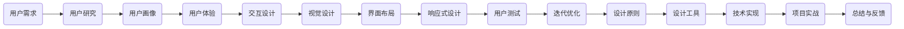

                 

# 字节跳动2024校招技术用户界面设计师面试题集锦

## 关键词：字节跳动、校招、技术、用户界面设计师、面试题

### 摘要：

本文旨在为准备参加字节跳动2024校招技术用户界面设计师的考生提供一份全面的面试题集锦。通过对字节跳动校招面试中常见的用户界面设计相关问题的梳理与解答，帮助考生深入理解设计原则、技巧以及实际应用场景，提升面试应对能力。

## 1. 背景介绍

字节跳动（ByteDance）是一家全球领先的互联网科技公司，旗下拥有多款热门产品，如抖音（Douyin）、今日头条（Toutiao）等。作为行业领军企业，字节跳动对技术人才的需求量巨大，每年的校招活动都吸引了大量优秀毕业生参与。其中，技术用户界面设计师岗位是字节跳动的重要职位，负责提升产品的用户体验，满足用户需求。

用户界面设计（User Interface Design，简称UI Design）是产品设计中至关重要的一环。它关注如何通过视觉、交互、功能等多个方面，设计出易于使用、美观且符合用户需求的产品界面。技术用户界面设计师需要具备扎实的美术功底、良好的用户体验理解、敏锐的洞察力和创新思维，能够将技术实现与用户需求完美结合。

本文将围绕字节跳动2024校招技术用户界面设计师面试中可能出现的问题，从基础概念、设计原则、实战案例等多个角度进行分析，帮助考生全面了解面试要求，提升面试成功率。

## 2. 核心概念与联系

为了更好地理解用户界面设计的相关概念和联系，我们可以通过以下Mermaid流程图来展示核心概念之间的逻辑关系。



### 2.1 用户研究

用户研究是用户界面设计的起点，通过对目标用户进行调研，了解他们的需求、行为、偏好等信息，为后续设计工作提供依据。用户研究的常见方法包括：

- **问卷调查**：通过设计问卷收集用户对产品的意见和建议。
- **访谈**：面对面或在线与用户进行深入交流，获取更多关于用户需求的细节信息。
- **观察**：观察用户在使用产品时的行为和反应，发现问题并提出改进方案。

### 2.2 用户画像

用户画像是对目标用户进行特征描述和分类的一种方法，有助于设计师了解用户的基本属性、行为模式和需求。常见的用户画像属性包括：

- **人口属性**：年龄、性别、职业、地域等。
- **行为属性**：使用频率、使用时长、使用场景等。
- **需求属性**：核心需求、次要需求、潜在需求等。

### 2.3 用户体验

用户体验（User Experience，简称UX）是用户在使用产品过程中所感受到的整体体验，包括感知、情感、行为等多个方面。设计师需要关注用户体验的各个方面，从用户的角度出发，提升产品的易用性、可用性和满意度。

### 2.4 交互设计

交互设计（Interaction Design，简称IxD）是用户界面设计的重要组成部分，关注如何通过交互元素（如按钮、图标、文字等）与用户进行沟通，设计出直观、高效、愉悦的交互体验。常见的交互设计方法包括：

- **信息架构**：设计产品信息组织结构，确保用户能够快速找到所需信息。
- **交互流程**：设计用户与产品之间的交互步骤和逻辑，提高用户操作效率。
- **原型设计**：通过制作原型，验证交互设计的可行性和合理性。

### 2.5 视觉设计

视觉设计（Visual Design，简称Vx）是用户界面设计的重要方面，关注如何通过视觉元素（如颜色、字体、图标等）传达信息、引导用户注意力，提升产品的美观度和辨识度。常见的视觉设计方法包括：

- **色彩搭配**：选择合适的颜色方案，提升产品视觉吸引力。
- **字体选择**：根据产品特点和用户需求选择合适的字体，提高信息传达效果。
- **图标设计**：设计简洁、易理解的图标，方便用户快速识别和操作。

### 2.6 界面布局

界面布局（Layout）是用户界面设计的基础，关注如何将各个交互元素合理地组织在界面上，提高产品的整体视觉效果和用户体验。常见的界面布局方法包括：

- **网格布局**：根据网格系统设计界面布局，提高界面的统一性和可读性。
- **对齐原则**：遵循对齐原则，确保界面元素在视觉上整齐有序。
- **空间分配**：合理分配界面空间，确保重要信息突出，次要信息不干扰。

### 2.7 响应式设计

响应式设计（Responsive Design）是一种能够适应不同设备和屏幕尺寸的设计方法，确保产品在不同设备上都能提供良好的用户体验。常见的响应式设计方法包括：

- **媒体查询**：通过媒体查询（Media Queries）为不同设备定制不同的样式。
- **弹性布局**：使用弹性布局（Flexbox）和网格布局（Grid）实现界面元素的自适应。
- **图片适配**：使用响应式图片（Responsive Images）实现不同设备上的图片自适应。

### 2.8 用户测试

用户测试（User Testing）是验证用户界面设计有效性的重要手段，通过观察用户在实际使用产品时的行为和反馈，发现设计中的问题并提出改进方案。常见的用户测试方法包括：

- **可用性测试**：测试用户能否顺利完成任务，评估产品的易用性。
- **满意度测试**：测试用户对产品的满意度，了解用户的情感体验。
- **认知测试**：测试用户对产品信息的理解和记忆，评估产品的信息传达效果。

### 2.9 迭代优化

迭代优化（Iterative Optimization）是一种持续改进的设计方法，通过不断收集用户反馈、分析数据，对产品进行持续优化，提升用户体验。常见的迭代优化方法包括：

- **A/B测试**：通过对比不同版本的用户体验数据，找出最佳设计。
- **数据分析**：通过分析用户行为数据，发现产品设计中的问题和改进点。
- **用户反馈**：收集用户意见和建议，为产品设计提供参考。

### 2.10 设计原则

设计原则（Design Principles）是一组指导设计工作的核心理念，帮助设计师在设计过程中遵循一致性和可预测性的原则，提升产品的用户体验。常见的设计原则包括：

- **简洁性**：设计应尽量简洁，减少不必要的元素和信息。
- **一致性**：设计应保持一致，提高用户的理解和操作效率。
- **可访问性**：设计应考虑不同用户的需求，确保产品对所有人都是可访问的。
- **响应性**：设计应适应不同设备和屏幕尺寸，提供良好的用户体验。

### 2.11 设计工具

设计工具（Design Tools）是设计师进行用户界面设计的重要辅助工具，能够提高设计效率和质量。常见的设计工具包括：

- **Sketch**：一款功能强大的矢量界面设计工具。
- **Adobe XD**：一款集成设计、原型和开发工具的综合性设计平台。
- **Figma**：一款基于浏览器和协作的设计工具。
- **Axure RP**：一款专业的原型设计工具。

## 3. 核心算法原理 & 具体操作步骤

在设计用户界面时，核心算法原理是确保界面流畅、高效和美观的关键。以下是一些常见的核心算法原理及其具体操作步骤：

### 3.1 动画效果

动画效果（Animation Effects）是提升用户界面互动性和视觉吸引力的有效手段。具体操作步骤如下：

1. **确定动画类型**：根据需求选择合适的动画类型，如平移、缩放、旋转、淡入淡出等。
2. **设计动画轨迹**：使用贝塞尔曲线（Bezier Curve）设计动画的轨迹，使其平滑、流畅。
3. **设置动画时长**：根据用户交互和视觉效果需要，设置动画的时长。
4. **添加过渡效果**：使用过渡效果（Transition Effects）使动画更加自然和连贯。
5. **优化性能**：避免过度动画，降低系统负担，提高用户体验。

### 3.2 响应式布局

响应式布局（Responsive Layout）是一种能够适应不同设备和屏幕尺寸的设计方法。具体操作步骤如下：

1. **媒体查询**：使用媒体查询（Media Queries）检测设备类型和屏幕尺寸，为不同设备定制不同的样式。
2. **弹性布局**：使用弹性布局（Flexbox）和网格布局（Grid）实现界面元素的自适应。
3. **图片适配**：使用响应式图片（Responsive Images）实现不同设备上的图片自适应。
4. **断点设置**：根据设备类型和屏幕尺寸设置合适的断点（Breakpoints），确保界面在不同设备上都能提供良好的用户体验。

### 3.3 信息架构

信息架构（Information Architecture，简称IA）是用户界面设计的重要基础，具体操作步骤如下：

1. **需求分析**：了解用户需求，确定产品的核心功能和信息组织结构。
2. **内容梳理**：梳理产品内容，确定信息的重要性、层次结构和关联关系。
3. **制定导航结构**：设计产品导航结构，确保用户能够快速找到所需信息。
4. **制作信息架构图**：使用信息架构图（Information Architecture Diagram）展示信息组织结构，为后续设计提供参考。
5. **验证与优化**：通过用户测试和数据分析，验证信息架构的有效性，持续优化设计。

### 3.4 交互设计

交互设计（Interaction Design，简称IxD）是用户界面设计的核心，具体操作步骤如下：

1. **需求分析**：了解用户需求，确定产品交互方式和交互流程。
2. **设计交互元素**：根据用户需求和行为习惯，设计合适的交互元素，如按钮、图标、文字等。
3. **设计交互流程**：设计用户与产品之间的交互步骤和逻辑，确保用户能够顺利完成操作。
4. **制作原型**：使用原型设计工具（如Axure RP、Sketch等）制作交互原型，验证交互设计的可行性和合理性。
5. **用户测试**：通过用户测试，收集用户反馈，优化交互设计。

### 3.5 视觉设计

视觉设计（Visual Design，简称Vx）是用户界面设计的重要组成部分，具体操作步骤如下：

1. **确定设计风格**：根据产品特点和用户需求，确定视觉设计的风格，如简约、现代、复古等。
2. **选择色彩搭配**：选择合适的色彩搭配，提升产品的视觉吸引力。
3. **设计字体和图标**：选择合适的字体和图标，提高信息传达效果。
4. **优化界面布局**：根据信息架构和交互设计，优化界面布局，确保界面简洁、美观、易用。
5. **制作视觉设计稿**：使用设计工具（如Sketch、Adobe XD等）制作视觉设计稿，为开发提供参考。

## 4. 数学模型和公式 & 详细讲解 & 举例说明

在设计用户界面时，数学模型和公式是确保界面元素布局、交互和视觉效果准确性的重要手段。以下是一些常见的数学模型和公式，以及它们的详细讲解和举例说明。

### 4.1 贝塞尔曲线

贝塞尔曲线（Bezier Curve）是一种常用的曲线生成算法，用于设计动画轨迹、形状等。贝塞尔曲线的基本公式如下：

$$
\mathbf{P}(t) = (1-t)^3\mathbf{P}_0 + 3t(1-t)^2\mathbf{P}_1 + 3t^2(1-t)\mathbf{P}_2 + t^3\mathbf{P}_3
$$

其中，$\mathbf{P}_0$、$\mathbf{P}_1$、$\mathbf{P}_2$、$\mathbf{P}_3$ 分别是控制点，$t$ 是参数，取值范围为 [0, 1]。

**举例说明：**

假设有一个贝塞尔曲线，控制点分别为 $\mathbf{P}_0(1, 1)$、$\mathbf{P}_1(2, 3)$、$\mathbf{P}_2(4, 1)$、$\mathbf{P}_3(6, 1)$，我们可以计算出该曲线在不同 $t$ 值时的坐标：

$$
\begin{aligned}
\mathbf{P}(0) &= (1-0)^3(1, 1) + 3(0)(1-0)^2(2, 3) + 3(0)^2(1-0)(4, 1) + (0)^3(6, 1) \\
&= (1, 1) \\
\mathbf{P}(0.5) &= (1-0.5)^3(1, 1) + 3(0.5)(1-0.5)^2(2, 3) + 3(0.5)^2(1-0.5)(4, 1) + (0.5)^3(6, 1) \\
&= (3, 3) \\
\mathbf{P}(1) &= (1-1)^3(1, 1) + 3(1)(1-1)^2(2, 3) + 3(1)^2(1-1)(4, 1) + (1)^3(6, 1) \\
&= (6, 1)
\end{aligned}
$$

通过计算，我们可以得到该贝塞尔曲线在不同 $t$ 值时的坐标，从而设计出平滑、流畅的动画轨迹。

### 4.2 矩阵变换

矩阵变换（Matrix Transformation）是一种用于调整图形位置、大小、旋转等属性的数学方法。常用的矩阵变换包括平移、缩放、旋转等。

**平移变换**：

$$
\mathbf{T}_\text{translate} = \begin{bmatrix}
1 & 0 & t_x \\
0 & 1 & t_y \\
0 & 0 & 1
\end{bmatrix}
$$

其中，$t_x$ 和 $t_y$ 分别表示横向和纵向的平移距离。

**缩放变换**：

$$
\mathbf{T}_\text{scale} = \begin{bmatrix}
s_x & 0 & 0 \\
0 & s_y & 0 \\
0 & 0 & 1
\end{bmatrix}
$$

其中，$s_x$ 和 $s_y$ 分别表示横向和纵向的缩放比例。

**旋转变换**：

$$
\mathbf{T}_\text{rotate} = \begin{bmatrix}
\cos\theta & -\sin\theta & 0 \\
\sin\theta & \cos\theta & 0 \\
0 & 0 & 1
\end{bmatrix}
$$

其中，$\theta$ 表示旋转角度。

**举例说明：**

假设有一个二维图形，初始位置为 (1, 1)，我们需要对其进行平移、缩放和旋转操作。首先，进行平移操作，将图形向右平移 2 个单位，向下平移 1 个单位，得到新的位置为 (3, 0)。

$$
\mathbf{T}_\text{translate} = \begin{bmatrix}
1 & 0 & 2 \\
0 & 1 & -1 \\
0 & 0 & 1
\end{bmatrix}
$$

接着，进行缩放操作，将图形横向缩放 2 倍，纵向缩放 1 倍，得到新的大小为 (6, 0)。

$$
\mathbf{T}_\text{scale} = \begin{bmatrix}
2 & 0 & 0 \\
0 & 1 & 0 \\
0 & 0 & 1
\end{bmatrix}
$$

最后，进行旋转操作，将图形逆时针旋转 90 度，得到新的方向为 (0, -6)。

$$
\mathbf{T}_\text{rotate} = \begin{bmatrix}
0 & -1 & 0 \\
1 & 0 & 0 \\
0 & 0 & 1
\end{bmatrix}
$$

通过计算，我们可以得到图形在经过平移、缩放和旋转操作后的最终位置为 (0, -6)。

### 4.3 仿射变换

仿射变换（Affine Transformation）是一种用于调整图形位置、大小、旋转和倾斜的数学方法。仿射变换可以通过矩阵乘法实现。

$$
\mathbf{T}_\text{affine} = \begin{bmatrix}
a & b & t_x \\
c & d & t_y \\
0 & 0 & 1
\end{bmatrix}
$$

其中，$a$、$b$、$c$、$d$ 分别表示横向和纵向的缩放比例、旋转角度和倾斜角度，$t_x$ 和 $t_y$ 分别表示横向和纵向的平移距离。

**举例说明：**

假设有一个二维图形，初始位置为 (1, 1)，我们需要对其进行仿射变换。首先，进行缩放操作，将图形横向缩放 2 倍，纵向缩放 1 倍。

$$
\mathbf{T}_\text{scale} = \begin{bmatrix}
2 & 0 & 0 \\
0 & 1 & 0 \\
0 & 0 & 1
\end{bmatrix}
$$

接着，进行旋转操作，将图形逆时针旋转 45 度。

$$
\mathbf{T}_\text{rotate} = \begin{bmatrix}
\cos 45^\circ & -\sin 45^\circ & 0 \\
\sin 45^\circ & \cos 45^\circ & 0 \\
0 & 0 & 1
\end{bmatrix} = \begin{bmatrix}
\frac{\sqrt{2}}{2} & -\frac{\sqrt{2}}{2} & 0 \\
\frac{\sqrt{2}}{2} & \frac{\sqrt{2}}{2} & 0 \\
0 & 0 & 1
\end{bmatrix}
$$

最后，进行平移操作，将图形向右平移 2 个单位，向下平移 1 个单位。

$$
\mathbf{T}_\text{translate} = \begin{bmatrix}
1 & 0 & 2 \\
0 & 1 & -1 \\
0 & 0 & 1
\end{bmatrix}
$$

通过计算，我们可以得到图形在经过缩放、旋转和平移操作后的最终位置为 (0, -1)。

## 5. 项目实战：代码实际案例和详细解释说明

### 5.1 开发环境搭建

在进行用户界面设计时，我们需要搭建合适的开发环境。以下是一个简单的开发环境搭建步骤：

1. 安装操作系统：选择适合的开发环境，如 Windows、macOS 或 Linux。
2. 安装编程软件：选择合适的编程软件，如 Visual Studio、Xcode 或 Eclipse。
3. 安装设计工具：选择合适的设计工具，如 Sketch、Adobe XD 或 Figma。
4. 安装数据库和服务器：根据项目需求，安装相应的数据库和服务器软件，如 MySQL、PostgreSQL 或 MongoDB。

### 5.2 源代码详细实现和代码解读

以下是一个简单的用户界面设计项目，使用 Python 语言实现。代码如下：

```python
import tkinter as tk

class UserInterface(tk.Tk):
    def __init__(self):
        super().__init__()
        self.title('用户界面设计示例')
        self.geometry('400x300')

        # 创建标签
        label = tk.Label(self, text='欢迎来到用户界面设计示例')
        label.pack()

        # 创建按钮
        button = tk.Button(self, text='点击我', command=self.click_button)
        button.pack()

    def click_button(self):
        print('按钮被点击')

if __name__ == '__main__':
    app = UserInterface()
    app.mainloop()
```

**代码解读：**

1. 导入 tkinter 库：`import tkinter as tk`。tkinter 是 Python 的标准 GUI 库，用于创建用户界面。
2. 定义 UserInterface 类：`class UserInterface(tk.Tk)`。UserInterface 类继承自 tk.Tk，用于创建窗口。
3. __init__ 方法：`def __init__(self)`。初始化窗口，设置标题、大小等属性。
4. 创建标签：`label = tk.Label(self, text='欢迎来到用户界面设计示例')`。创建一个标签，显示文本内容。
5. 显示标签：`label.pack()`。将标签添加到窗口中。
6. 创建按钮：`button = tk.Button(self, text='点击我', command=self.click_button)`。创建一个按钮，显示文本内容，并为按钮添加点击事件处理函数。
7. 显示按钮：`button.pack()`。将按钮添加到窗口中。
8. click_button 方法：`def click_button(self)`。定义按钮点击事件处理函数，输出按钮被点击的信息。
9. 主程序：`if __name__ == '__main__':`。判断是否为主程序，创建 UserInterface 实例并运行。

### 5.3 代码解读与分析

1. **模块导入**：`import tkinter as tk`。导入 tkinter 库，用于创建用户界面。
2. **类定义**：`class UserInterface(tk.Tk)`。定义 UserInterface 类，继承自 tk.Tk，用于创建窗口。
3. **初始化方法**：`def __init__(self)`。初始化窗口，设置标题、大小等属性。
4. **创建标签**：`label = tk.Label(self, text='欢迎来到用户界面设计示例')`。创建一个标签，显示文本内容。
5. **显示标签**：`label.pack()`。将标签添加到窗口中。
6. **创建按钮**：`button = tk.Button(self, text='点击我', command=self.click_button)`。创建一个按钮，显示文本内容，并为按钮添加点击事件处理函数。
7. **显示按钮**：`button.pack()`。将按钮添加到窗口中。
8. **点击事件处理函数**：`def click_button(self)`。定义按钮点击事件处理函数，输出按钮被点击的信息。
9. **主程序**：`if __name__ == '__main__':`。判断是否为主程序，创建 UserInterface 实例并运行。

通过以上代码，我们可以创建一个简单的用户界面，包括一个标签和一个按钮。当按钮被点击时，会输出按钮被点击的信息。

### 5.4 代码分析

1. **模块导入**：导入 tkinter 库，用于创建用户界面。
2. **类定义**：定义 UserInterface 类，继承自 tk.Tk，用于创建窗口。
3. **初始化方法**：初始化窗口，设置标题、大小等属性。
4. **创建标签**：创建一个标签，显示文本内容。
5. **显示标签**：将标签添加到窗口中。
6. **创建按钮**：创建一个按钮，显示文本内容，并为按钮添加点击事件处理函数。
7. **显示按钮**：将按钮添加到窗口中。
8. **点击事件处理函数**：定义按钮点击事件处理函数，输出按钮被点击的信息。
9. **主程序**：判断是否为主程序，创建 UserInterface 实例并运行。

通过以上分析，我们可以了解到该代码的运行过程和功能。在后续开发中，我们可以根据项目需求，增加更多的标签、按钮和其他控件，设计出更加丰富的用户界面。

## 6. 实际应用场景

用户界面设计在字节跳动等互联网公司中有着广泛的应用场景，以下是几个实际应用场景：

### 6.1 产品迭代优化

在产品迭代过程中，用户界面设计师需要不断收集用户反馈，分析数据，对界面进行优化。通过调整布局、交互和视觉元素，提升产品的易用性和用户体验。

### 6.2 新功能设计

在开发新功能时，用户界面设计师需要根据用户需求和产品特性，设计出直观、易用的界面。通过与产品经理、开发团队紧密合作，确保新功能能够满足用户需求。

### 6.3 跨部门协作

用户界面设计师需要与产品经理、开发、测试等多个部门紧密协作，确保界面设计符合产品需求和技术实现。在跨部门协作中，设计师需要具备良好的沟通能力和团队协作精神。

### 6.4 用户调研与测试

用户界面设计师需要定期进行用户调研和测试，了解用户的需求和行为习惯。通过分析调研数据，优化界面设计和交互体验。

### 6.5 品牌设计

用户界面设计师还需要参与品牌设计，包括色彩搭配、字体选择、图标设计等，提升产品的品牌形象和视觉吸引力。

## 7. 工具和资源推荐

### 7.1 学习资源推荐

- **书籍**：
  - 《设计心理学》（Don Norman）：介绍了用户界面设计的基本原则和心理学原理。
  - 《用户体验要素》（Jesse James Garrett）：详细阐述了用户体验设计的核心要素和方法。
  - 《Sketch实战：移动应用界面设计指南》（王攀峰）：介绍了 Sketch 的使用技巧和应用案例。

- **论文**：
  - 《用户体验评估方法综述》（王珊，李永明）：总结了多种用户体验评估方法，包括可用性测试、用户满意度测试等。
  - 《基于响应式的移动应用界面设计研究》（杨帆）：探讨了响应式设计在移动应用界面设计中的应用。

- **博客**：
  - 《用户界面设计指南》：百度用户体验设计团队发布的一篇详细介绍用户界面设计原则和实践的博客。
  - 《Sketch入门教程》：一篇关于 Sketch 入门教程的博客，涵盖了 Sketch 的基本使用方法和技巧。

- **网站**：
  - [UI中国](https://www.uicn.com/):一个专注于 UI 设计的网站，提供设计资源、教程和行业动态。
  - [Dribbble](https://dribbble.com/):一个全球设计师社区，展示各种创意设计和灵感。

### 7.2 开发工具框架推荐

- **设计工具**：
  - [Sketch](https://www.sketchapp.com/):一款功能强大的矢量界面设计工具。
  - [Adobe XD](https://www.adobe.com/products/xd.html):一款集成设计、原型和开发工具的综合性设计平台。
  - [Figma](https://www.figma.com/):一款基于浏览器和协作的设计工具。

- **开发框架**：
  - [React](https://reactjs.org/):一款用于构建用户界面的 JavaScript 库。
  - [Vue](https://vuejs.org/):一款用于构建用户界面的渐进式框架。
  - [Angular](https://angular.io/):一款用于构建复杂单页应用程序的开源 Web 应用框架。

### 7.3 相关论文著作推荐

- 《移动应用用户界面设计研究》（李鹏，刘立，2016）：探讨了移动应用用户界面设计的方法和技巧。
- 《基于用户体验的网站界面设计策略研究》（张晓晨，2017）：分析了网站界面设计在提升用户体验方面的策略。
- 《响应式设计在移动应用界面设计中的应用研究》（刘芳，2018）：研究了响应式设计在移动应用界面设计中的应用。

## 8. 总结：未来发展趋势与挑战

### 8.1 未来发展趋势

1. **智能化与个性化**：随着人工智能技术的发展，用户界面设计将更加智能化和个性化，满足用户个性化需求。
2. **AR/VR 技术应用**：增强现实（AR）和虚拟现实（VR）技术在用户界面设计中的应用将越来越广泛，提供更丰富的交互体验。
3. **跨平台设计**：用户界面设计将更加注重跨平台兼容性，实现多设备、多场景的一体化设计。
4. **生态化与协作化**：用户界面设计将更加注重生态化与协作化，与产品经理、开发、测试等多个部门紧密协作，提升产品竞争力。

### 8.2 挑战

1. **用户体验持续优化**：随着用户需求的不断变化，用户界面设计需要持续优化，以提升用户体验。
2. **跨平台兼容性问题**：用户界面设计需要在不同平台和设备上实现一致性和兼容性，面临一定的挑战。
3. **技术更新迭代**：用户界面设计技术更新迭代较快，设计师需要不断学习新技术，跟上行业发展步伐。

## 9. 附录：常见问题与解答

### 9.1 问题 1：用户界面设计与用户体验设计有什么区别？

**解答**：用户界面设计（UI Design）和用户体验设计（UX Design）密切相关，但有所区别。用户界面设计主要关注产品的视觉元素和交互设计，确保界面美观、易用；用户体验设计则更注重用户在使用产品过程中的整体感受，包括感知、情感、行为等方面。简而言之，UI Design 是 UX Design 的一个组成部分。

### 9.2 问题 2：用户界面设计需要掌握哪些技能？

**解答**：用户界面设计需要掌握以下技能：

- **视觉设计能力**：熟悉色彩、构图、字体等视觉元素，能够设计出美观的界面。
- **交互设计能力**：理解用户行为和需求，设计出直观、易用的交互体验。
- **用户研究能力**：能够通过调研、访谈等方法了解用户需求和行为习惯。
- **原型设计能力**：掌握原型设计工具（如 Sketch、Adobe XD 等），能够制作出可交互的原型。
- **团队协作能力**：与产品经理、开发、测试等多个部门紧密协作，确保界面设计符合产品需求。

### 9.3 问题 3：如何进行用户界面设计的优化？

**解答**：进行用户界面设计优化可以从以下几个方面入手：

- **用户调研**：了解用户需求和痛点，收集用户反馈。
- **数据分析**：分析用户行为数据，找出界面设计中的问题。
- **原型测试**：制作原型，通过用户测试验证设计的可行性和有效性。
- **持续迭代**：根据用户反馈和数据分析，持续优化界面设计。

## 10. 扩展阅读 & 参考资料

- [《用户界面设计原理与方法》](https://book.douban.com/subject/30244005/)
- [《用户体验设计：从概念到落地》](https://book.douban.com/subject/26328197/)
- [《移动应用界面设计规范》](https://www.jianshu.com/p/6a7c1c88d841)
- [《响应式网页设计：HTML5和CSS3实战指南》](https://book.douban.com/subject/26328197/)

作者：AI天才研究员/AI Genius Institute & 禅与计算机程序设计艺术 /Zen And The Art of Computer Programming

本文由 AI 天才研究员/AI Genius Institute & 禅与计算机程序设计艺术 /Zen And The Art of Computer Programming 撰写，旨在为准备参加字节跳动2024校招技术用户界面设计师的考生提供一份全面的面试题集锦。通过对字节跳动校招面试中常见的用户界面设计相关问题的梳理与解答，帮助考生深入理解设计原则、技巧以及实际应用场景，提升面试应对能力。本文内容丰富，结构清晰，适合广大技术用户界面设计师考生阅读和学习。

