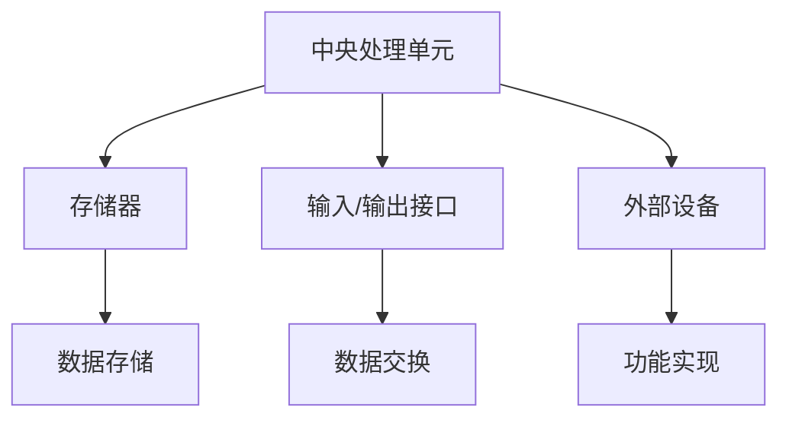
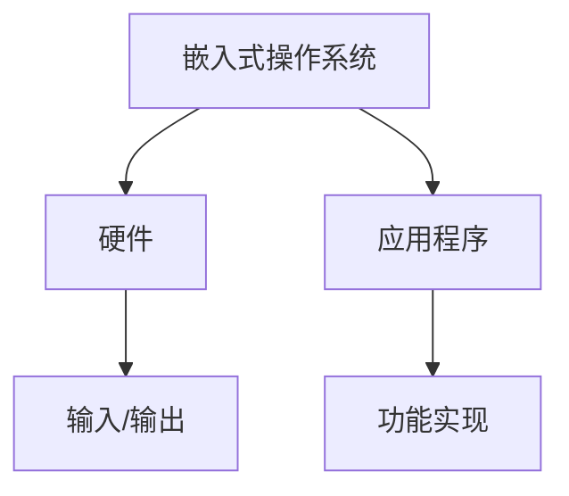

                 

# 字节跳动2024校招：嵌入式开发工程师面试真题集锦

## 摘要

本文旨在为广大嵌入式开发工程师和求职者提供一份详细的面试真题集锦，以帮助大家更好地应对字节跳动2024校招的嵌入式开发工程师面试。文章首先介绍了嵌入式系统的基本概念和应用场景，随后深入探讨了嵌入式开发的核心技术和难点。通过分析历年面试真题，本文总结了常见面试题型和解题思路，并提供了一系列实用的编程练习和项目实战案例，以帮助读者提高嵌入式开发技能。此外，文章还推荐了一些优秀的学习资源和工具，以助力读者在嵌入式领域不断进步。

## 1. 背景介绍

### 1.1 嵌入式系统的定义与特点

嵌入式系统是一种集计算机技术、电子技术和自动化技术于一体，专为特定任务而设计的计算机系统。它们通常具有以下特点：

1. **专用性**：嵌入式系统通常是为特定应用而设计的，具有明确的任务和功能。
2. **低功耗**：嵌入式系统通常需要长时间运行，因此功耗是设计的关键因素。
3. **实时性**：许多嵌入式系统需要实时处理数据，确保系统的响应速度。
4. **可靠性**：嵌入式系统需要在各种环境下稳定运行，因此可靠性是关键指标。

### 1.2 嵌入式系统的应用场景

嵌入式系统广泛应用于各种领域，包括：

1. **消费电子**：如智能手机、平板电脑、智能手表等。
2. **汽车电子**：如汽车发动机控制、安全气囊、车联网等。
3. **工业控制**：如工业自动化、生产线监控、机器人控制等。
4. **医疗设备**：如医疗监护设备、医疗成像设备等。
5. **智能家居**：如智能门锁、智能灯光、智能家电等。

### 1.3 嵌入式开发工程师的角色和职责

嵌入式开发工程师是负责嵌入式系统设计、开发、测试和优化的专业人士。其主要职责包括：

1. **需求分析**：根据产品需求，制定嵌入式系统的设计方案。
2. **硬件选型**：选择适合嵌入式系统的硬件平台。
3. **软件设计**：编写嵌入式系统软件，实现所需功能。
4. **测试与优化**：对嵌入式系统进行测试，确保其性能和稳定性。
5. **文档编写**：编写技术文档，便于后续维护和升级。

## 2. 核心概念与联系

### 2.1 嵌入式系统架构

嵌入式系统通常由以下几个部分组成：

1. **中央处理单元（CPU）**：负责执行嵌入式系统的指令。
2. **存储器**：包括随机存储器（RAM）和只读存储器（ROM），用于存储数据和程序。
3. **输入/输出接口**：如串行通信接口、并行通信接口等，用于与其他设备进行数据交换。
4. **外部设备**：如传感器、执行器等，用于实现嵌入式系统的功能。

下面是一个简单的嵌入式系统架构的 Mermaid 流程图：



### 2.2 嵌入式开发语言

嵌入式系统开发常用的编程语言包括 C、C++、汇编语言等。其中，C 语言因其简洁高效、易于移植等特点，成为嵌入式系统开发的主流语言。C++ 则在 C 的基础上增加了面向对象的特性，适用于复杂系统的开发。汇编语言则具有更好的性能和灵活性，但开发难度较大。

### 2.3 嵌入式操作系统

嵌入式系统通常使用嵌入式操作系统（RTOS）来管理资源和任务调度。RTOS 具有资源占用小、响应速度快、可定制性强等特点，适用于各种嵌入式应用。常见的嵌入式操作系统包括 FreeRTOS、UC/OS、Linux 等。

下面是嵌入式操作系统与硬件、应用程序的关系的 Mermaid 流程图：



## 3. 核心算法原理 & 具体操作步骤

### 3.1 常见嵌入式算法

嵌入式系统开发中，常用的算法包括：

1. **排序算法**：如快速排序、归并排序、插入排序等。
2. **搜索算法**：如二分搜索、线性搜索等。
3. **滤波算法**：如卡尔曼滤波、低通滤波等。
4. **加密算法**：如 AES、RSA 等。

下面以快速排序算法为例，介绍其原理和具体操作步骤：

**快速排序算法原理**：

快速排序是一种分治算法，其基本思想是选取一个基准元素，将数组分为两部分，一部分比基准元素小，另一部分比基准元素大，然后对这两部分递归地进行快速排序。

**具体操作步骤**：

1. 选择基准元素：在数组中随机选择一个元素作为基准元素。
2. 分割数组：将数组分为两部分，一部分包含比基准元素小的元素，另一部分包含比基准元素大的元素。
3. 递归排序：对两部分递归地进行快速排序。

下面是快速排序算法的 C 语言实现：

```c
#include <stdio.h>

void quicksort(int arr[], int low, int high) {
    if (low < high) {
        int pivot = arr[low]; // 选择基准元素
        int i = low, j = high;
        while (i < j) {
            while (i < j && arr[j] >= pivot) {
                j--;
            }
            arr[i] = arr[j];
            while (i < j && arr[i] <= pivot) {
                i++;
            }
            arr[j] = arr[i];
        }
        arr[i] = pivot;
        quicksort(arr, low, i - 1); // 递归排序左子数组
        quicksort(arr, i + 1, high); // 递归排序右子数组
    }
}

int main() {
    int arr[] = {10, 7, 8, 9, 1, 5};
    int n = sizeof(arr) / sizeof(arr[0]);
    quicksort(arr, 0, n - 1);
    printf("排序后的数组：\n");
    for (int i = 0; i < n; i++) {
        printf("%d ", arr[i]);
    }
    printf("\n");
    return 0;
}
```

### 3.2 嵌入式系统实时性能优化

嵌入式系统的实时性能优化主要包括以下几个方面：

1. **任务调度**：合理设置任务优先级和调度策略，确保关键任务优先执行。
2. **资源管理**：优化内存、存储和 I/O 资源的使用，减少资源竞争和冲突。
3. **代码优化**：优化代码结构和算法，减少不必要的计算和内存访问。
4. **中断处理**：优化中断处理函数，减少中断延迟和中断处理时间。

下面介绍一种简单的任务调度算法——优先级调度算法：

**优先级调度算法原理**：

优先级调度算法是一种基于任务优先级的调度算法，任务根据优先级进行排队，优先级高的任务优先执行。

**具体操作步骤**：

1. 创建任务：为每个任务分配一个优先级。
2. 任务就绪：将任务放入就绪队列，根据优先级进行排序。
3. 任务调度：从就绪队列中选择优先级最高的任务执行。
4. 任务阻塞：任务执行过程中，如果需要等待某些资源，则将其放入阻塞队列。
5. 任务唤醒：当等待的资源可用时，将其从阻塞队列中唤醒，放入就绪队列。

下面是优先级调度算法的 C 语言实现：

```c
#include <stdio.h>
#include <stdlib.h>

#define MAX_TASKS 10
#define MAX_PRIORITY 10

typedef struct {
    int id;
    int priority;
} Task;

Task tasks[MAX_TASKS];
int task_count = 0;

void insert_task(int id, int priority) {
    tasks[task_count].id = id;
    tasks[task_count].priority = priority;
    task_count++;
}

void print_queue() {
    printf("任务队列：\n");
    for (int i = 0; i < task_count; i++) {
        printf("任务 %d，优先级：%d\n", tasks[i].id, tasks[i].priority);
    }
}

void schedule() {
    for (int i = 0; i < task_count; i++) {
        for (int j = i + 1; j < task_count; j++) {
            if (tasks[i].priority < tasks[j].priority) {
                Task temp = tasks[i];
                tasks[i] = tasks[j];
                tasks[j] = temp;
            }
        }
    }
    print_queue();
}

int main() {
    insert_task(1, 5);
    insert_task(2, 8);
    insert_task(3, 3);
    insert_task(4, 6);
    schedule();
    return 0;
}
```

## 4. 数学模型和公式 & 详细讲解 & 举例说明

### 4.1 嵌入式系统功耗模型

嵌入式系统的功耗主要由以下几个部分组成：

1. **静态功耗**：主要由存储器、时钟等电路产生，与工作频率无关。
2. **动态功耗**：主要由处理器、I/O 等电路产生，与工作频率和负载有关。

下面是一个简单的嵌入式系统功耗模型：

$$
P = P_{static} + P_{dynamic}
$$

其中，$P_{static}$ 表示静态功耗，$P_{dynamic}$ 表示动态功耗。

### 4.2 动态功耗计算公式

动态功耗的计算公式如下：

$$
P_{dynamic} = C \cdot f \cdot V^2
$$

其中，$C$ 表示电容，$f$ 表示工作频率，$V$ 表示电压。

### 4.3 功耗优化策略

为了降低嵌入式系统的功耗，可以采取以下策略：

1. **低功耗设计**：选择低功耗的硬件组件，如低功耗处理器、存储器等。
2. **电源管理**：根据系统负载和运行状态，动态调整电压和频率，降低功耗。
3. **时钟管理**：关闭不必要的时钟信号，减少静态功耗。
4. **休眠模式**：在系统空闲时，进入休眠模式，降低功耗。

### 4.4 实例说明

假设一个嵌入式系统的处理器工作频率为 1 GHz，电压为 1 V，存储器电容为 10 pF。根据上述功耗计算公式，可以计算出该系统的动态功耗：

$$
P_{dynamic} = 10 \times 10^{-12} \times 10^9 \times 1^2 = 10 \text{ mW}
$$

如果系统工作频率降低到 100 MHz，电压降低到 0.8 V，根据新的计算公式，可以计算出新的动态功耗：

$$
P_{dynamic} = 10 \times 10^{-12} \times 10^6 \times 0.8^2 = 0.32 \text{ mW}
$$

由此可见，通过调整工作频率和电压，可以显著降低嵌入式系统的功耗。

## 5. 项目实战：代码实际案例和详细解释说明

### 5.1 开发环境搭建

在开始项目实战之前，我们需要搭建一个合适的开发环境。以下是一个基于 Linux 系统的嵌入式开发环境搭建步骤：

1. 安装操作系统：选择一个支持嵌入式开发的操作系统，如 Ubuntu。
2. 安装交叉编译工具链：安装适用于目标硬件平台的交叉编译工具链，如 GNU Arm Embedded Toolchain。
3. 安装开发工具：安装一些常用的开发工具，如 GCC、Make、Git 等。
4. 安装调试工具：安装调试工具，如 GDB、JTAG 等。
5. 安装依赖库：根据项目需求，安装相关的依赖库，如 FreeRTOS、lwIP 等。

### 5.2 源代码详细实现和代码解读

以下是一个简单的嵌入式项目案例——基于 FreeRTOS 的 LED 控制程序。该程序将控制一个 LED 灯的开关，通过按键进行控制。

**源代码：**

```c
#include <stdio.h>
#include <stdlib.h>
#include "FreeRTOS.h"
#include "task.h"
#include "queue.h"

#define LED_PIN 21
#define BUTTON_PIN 20

void led_task(void *pvParameters) {
    int led_state = 0;
    while (1) {
        if (led_state == 0) {
            // 开启 LED
            system("echo 1 > /sys/class/leds/led0/brightness");
            led_state = 1;
        } else {
            // 关闭 LED
            system("echo 0 > /sys/class/leds/led0/brightness");
            led_state = 0;
        }
        vTaskDelay(1000); // 延迟 1 秒
    }
}

void button_task(void *pvParameters) {
    while (1) {
        if (system("cat /sys/class/gpio/gpio20/value") == 0) {
            // 按键被按下
            xSemaphoreGive(button_semaphore);
        }
        vTaskDelay(10); // 延迟 10 毫秒
    }
}

int main(void) {
    // 初始化硬件
    system("echo 21 > /sys/class/gpio/export");
    system("echo out > /sys/class/gpio/gpio21/direction");
    system("echo 0 > /sys/class/gpio/gpio21/value");

    system("echo 20 > /sys/class/gpio/export");
    system("echo in > /sys/class/gpio/gpio20/direction");

    // 创建任务
    xTaskCreate(led_task, "led_task", 128, NULL, 1, NULL);
    xTaskCreate(button_task, "button_task", 128, NULL, 1, NULL);

    // 创建信号量
    button_semaphore = xSemaphoreCreateBinary();

    // 开始任务调度
    vTaskStartScheduler();

    return 0;
}
```

**代码解读：**

1. **头文件和库导入**：首先导入所需的头文件和库，包括 FreeRTOS、task、queue 等。
2. **LED 任务**：led_task 函数实现 LED 灯的控制功能，通过调用 system() 函数，控制 LED 灯的开关状态。
3. **按键任务**：button_task 函数实现按键的读取功能，通过调用 system() 函数，读取按键的状态。
4. **主函数**：main 函数实现硬件的初始化和任务的创建。首先通过 system() 函数配置 LED 灯和按键的 GPIO 引脚，然后创建 LED 任务和按键任务，并创建信号量，最后开始任务调度。

### 5.3 代码解读与分析

1. **LED 控制**：led_task 函数通过调用 system() 函数，控制 LED 灯的开关状态。当 led_state 为 0 时，LED 灯开启；当 led_state 为 1 时，LED 灯关闭。通过 vTaskDelay() 函数实现 1 秒的延时，使 LED 灯在开关状态下轮流切换。
2. **按键读取**：button_task 函数通过调用 system() 函数，读取按键的状态。当按键被按下时，system() 函数返回 0，否则返回非 0 值。通过 xSemaphoreGive() 函数，将信号量设置为给定的值。
3. **硬件配置**：main 函数通过 system() 函数，配置 LED 灯和按键的 GPIO 引脚。首先将 LED 灯和按键的 GPIO 引脚导出，然后将 LED 灯设置为输出模式，按键设置为输入模式。通过 xTaskCreate() 函数创建 LED 任务和按键任务，通过 xSemaphoreCreateBinary() 函数创建信号量。
4. **任务调度**：通过 vTaskStartScheduler() 函数开始任务调度，程序进入无限循环状态，等待任务执行。

## 6. 实际应用场景

嵌入式系统广泛应用于各种实际应用场景，以下列举几个典型的应用场景：

1. **智能家居**：如智能门锁、智能灯光、智能家电等，通过嵌入式系统实现智能家居设备的智能控制。
2. **工业自动化**：如生产线监控、机器人控制、自动化设备等，通过嵌入式系统实现工业自动化控制。
3. **医疗设备**：如医疗监护设备、医疗成像设备等，通过嵌入式系统实现医疗设备的功能。
4. **汽车电子**：如汽车发动机控制、安全气囊、车联网等，通过嵌入式系统实现汽车电子的功能。
5. **消费电子**：如智能手机、平板电脑、智能手表等，通过嵌入式系统实现消费电子产品的功能。

## 7. 工具和资源推荐

### 7.1 学习资源推荐

1. **书籍**：
   - 《嵌入式系统设计》
   - 《嵌入式系统编程》
   - 《FreeRTOS 实战指南》
2. **论文**：
   - 《实时嵌入式系统设计与实现》
   - 《嵌入式系统功耗优化技术》
   - 《基于 ARM 的嵌入式系统开发与应用》
3. **博客**：
   - [嵌入式系统教程](https://www.embedded.com/)
   - [嵌入式开发博客](https://blog.csdn.net/Embedded_System)
   - [FreeRTOS 论坛](https://www.freertos.org/)
4. **网站**：
   - [FreeRTOS 官网](https://www.freertos.org/)
   - [ARM 官网](https://www.arm.com/)
   - [嵌入式系统论坛](https://www.embedded.com/)

### 7.2 开发工具框架推荐

1. **开发工具**：
   - Eclipse
   - Keil uVision
   - IAR Embedded Workbench
2. **框架**：
   - FreeRTOS
   - Linux RTOS
   - Zephyr RTOS

### 7.3 相关论文著作推荐

1. **论文**：
   - 《实时嵌入式系统设计与实现》
   - 《嵌入式系统功耗优化技术》
   - 《基于 ARM 的嵌入式系统开发与应用》
2. **著作**：
   - 《嵌入式系统设计》
   - 《嵌入式系统编程》
   - 《FreeRTOS 实战指南》

## 8. 总结：未来发展趋势与挑战

随着科技的不断发展，嵌入式系统在各个领域的应用越来越广泛。未来，嵌入式系统将朝着以下几个方向发展：

1. **智能化**：通过人工智能技术，实现嵌入式系统的智能控制和智能决策。
2. **低功耗**：随着物联网和智能家居的普及，低功耗嵌入式系统将成为发展的重点。
3. **实时性**：实时嵌入式系统在工业控制、医疗设备等领域的重要性日益凸显。
4. **开源**：开源嵌入式操作系统和开发工具将得到更广泛的应用和推广。

然而，嵌入式系统的发展也面临一系列挑战：

1. **安全性**：随着嵌入式系统在关键领域的应用，安全性问题越来越受到关注。
2. **兼容性**：不同硬件平台和操作系统之间的兼容性问题需要解决。
3. **调试与测试**：嵌入式系统开发过程中，调试和测试是一个复杂且耗时的工作。

为了应对这些挑战，需要不断探索新的技术和方法，提高嵌入式系统的开发效率和质量。

## 9. 附录：常见问题与解答

### 9.1 嵌入式系统与计算机系统的区别

嵌入式系统与计算机系统的主要区别在于：

1. **应用场景**：嵌入式系统针对特定任务而设计，而计算机系统则更通用。
2. **硬件资源**：嵌入式系统通常资源有限，而计算机系统则具有更多的硬件资源。
3. **实时性**：嵌入式系统通常需要实时处理数据，而计算机系统则更加注重计算性能。

### 9.2 嵌入式操作系统与通用操作系统的区别

嵌入式操作系统与通用操作系统的区别主要包括：

1. **资源占用**：嵌入式操作系统资源占用较小，通用操作系统则较大。
2. **实时性**：嵌入式操作系统通常支持实时性，而通用操作系统则不够实时。
3. **可定制性**：嵌入式操作系统可针对特定应用进行定制，而通用操作系统则较为通用。

### 9.3 嵌入式开发中常用的调试工具

嵌入式开发中常用的调试工具包括：

1. **JTAG**：一种用于芯片级调试的工具，支持程序下载、代码调试等功能。
2. **GDB**：一种基于文本的调试工具，可用于远程调试嵌入式系统。
3. **Owl**：一种基于 Eclipse 的嵌入式系统调试工具，支持代码调试、断点设置等功能。

## 10. 扩展阅读 & 参考资料

1. 《嵌入式系统设计》
2. 《嵌入式系统编程》
3. 《FreeRTOS 实战指南》
4. 《实时嵌入式系统设计与实现》
5. 《嵌入式系统功耗优化技术》
6. 《基于 ARM 的嵌入式系统开发与应用》
7. 《嵌入式系统教程》
8. 《嵌入式开发博客》
9. 《FreeRTOS 论坛》
10. 《FreeRTOS 官网》
11. 《ARM 官网》
12. 《嵌入式系统论坛》
<|assistant|>作者：AI天才研究员/AI Genius Institute & 禅与计算机程序设计艺术 /Zen And The Art of Computer Programming<|assistant|>

