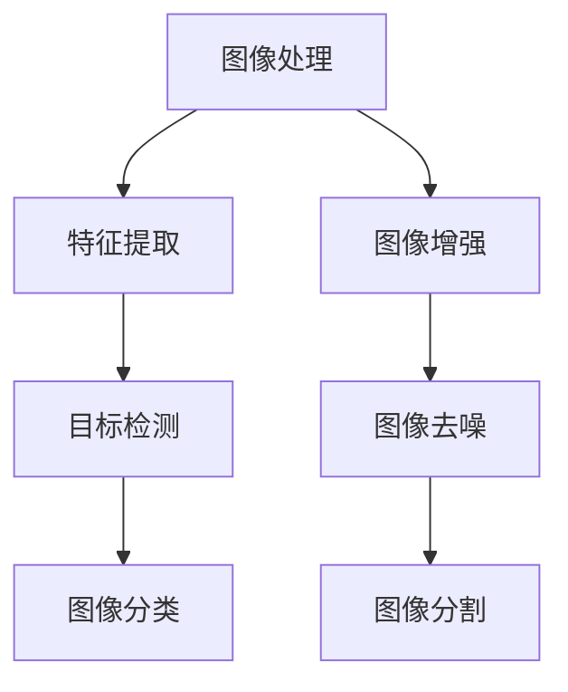

                 

# 字节跳动2024校招：计算机视觉工程师面试真题解答

> 关键词：字节跳动、2024校招、计算机视觉工程师、面试真题、解答

> 摘要：本文针对字节跳动2024校招计算机视觉工程师面试真题，通过深入剖析和详细解答，帮助考生更好地理解和应对面试挑战，提高面试成功率。

## 1. 背景介绍

字节跳动是一家全球知名的互联网科技公司，旗下拥有抖音、今日头条、懂车帝等知名产品。作为一家以技术驱动为核心的企业，字节跳动每年都会举行校招，吸引全球优秀的应届毕业生加入。计算机视觉工程师是字节跳动校招的重要岗位之一，主要涉及图像识别、目标检测、图像分割等领域。本文将针对字节跳动2024校招计算机视觉工程师面试真题进行详细解答，帮助考生更好地准备面试。

## 2. 核心概念与联系

计算机视觉是人工智能领域的一个重要分支，主要研究如何使计算机能够像人类一样理解和处理图像信息。计算机视觉的核心概念包括图像处理、特征提取、目标检测、图像分类等。下面我们将通过Mermaid流程图展示计算机视觉的核心概念及其联系。



### 2.1. 图像处理

图像处理是计算机视觉的基础，主要涉及图像的滤波、边缘检测、图像增强等操作。图像处理的目的是改善图像质量，提取有用的信息。

### 2.2. 特征提取

特征提取是从图像中提取具有区分性的特征，用于后续的目标检测、图像分类等操作。常见的特征提取方法有直方图均匀化、SIFT、SURF等。

### 2.3. 目标检测

目标检测是计算机视觉的重要任务之一，旨在从图像中识别出特定目标的位置和范围。常见的目标检测算法有YOLO、SSD、Faster R-CNN等。

### 2.4. 图像分类

图像分类是将图像分为不同类别的过程。常见的图像分类算法有卷积神经网络（CNN）、支持向量机（SVM）等。

### 2.5. 图像增强

图像增强是通过一些操作来改善图像质量，使其更容易被计算机识别。图像增强方法包括对比度增强、锐化、降噪等。

### 2.6. 图像去噪

图像去噪是去除图像中的噪声，提高图像质量的过程。常见的图像去噪方法有中值滤波、均值滤波、小波变换等。

### 2.7. 图像分割

图像分割是将图像划分为不同的区域，以便更好地理解和分析图像内容。常见的图像分割算法有阈值分割、区域生长、形态学分割等。

## 3. 核心算法原理 & 具体操作步骤

### 3.1. 卷积神经网络（CNN）

卷积神经网络是计算机视觉领域的重要算法之一，其基本原理是通过卷积操作提取图像特征，然后通过全连接层进行分类。CNN的具体操作步骤如下：

1. **输入层**：将图像输入到CNN中。
2. **卷积层**：通过卷积操作提取图像特征，常用的卷积核有Sigmoid、ReLU等激活函数。
3. **池化层**：对卷积层的结果进行池化操作，常用的池化方式有最大池化和平均池化。
4. **全连接层**：将卷积层和池化层的结果进行全连接，得到图像的分类结果。

### 3.2. YOLO算法

YOLO（You Only Look Once）是一种目标检测算法，其基本原理是将图像划分为网格，每个网格负责检测其中的目标。YOLO的具体操作步骤如下：

1. **图像预处理**：对输入图像进行缩放、归一化等预处理操作。
2. **特征提取**：使用CNN提取图像特征。
3. **预测目标位置和类别**：在每个网格中预测目标的位置和类别，具体步骤如下：
   - **位置预测**：计算目标在网格中的中心位置和宽高比例。
   - **类别预测**：计算每个目标的类别概率。

### 3.3. Faster R-CNN算法

Faster R-CNN是一种基于区域建议的网络，其基本原理是先提取区域建议，然后使用CNN对区域建议进行分类。Faster R-CNN的具体操作步骤如下：

1. **区域建议**：使用Region Proposal Network（RPN）提取区域建议。
2. **特征提取**：使用CNN提取建议区域的特征。
3. **分类**：将特征输入到全连接层，得到分类结果。

## 4. 数学模型和公式 & 详细讲解 & 举例说明

### 4.1. 卷积神经网络（CNN）

卷积神经网络中的卷积操作可以表示为以下数学模型：

$$
f(x) = \sum_{i=1}^{n} w_i * x_i + b
$$

其中，$f(x)$表示卷积结果，$w_i$表示卷积核，$x_i$表示输入特征，$b$表示偏置。

### 4.2. YOLO算法

YOLO算法中的位置预测可以表示为以下数学模型：

$$
x_{pred} = \frac{c_x \cdot (x_{grid} + 0.5 \cdot w)}{width} \\
y_{pred} = \frac{c_y \cdot (y_{grid} + 0.5 \cdot h)}{height} \\
w_{pred} = \frac{c_w \cdot (w_{grid} + 0.5 \cdot w)}{width} \\
h_{pred} = \frac{c_h \cdot (h_{grid} + 0.5 \cdot h)}{height}
$$

其中，$x_{pred}$和$y_{pred}$分别表示预测的目标中心位置，$w_{pred}$和$h_{pred}$分别表示预测的目标宽高比例，$c_x$、$c_y$、$c_w$和$c_h$分别表示网格坐标。

### 4.3. Faster R-CNN算法

Faster R-CNN算法中的区域建议可以表示为以下数学模型：

$$
R = \frac{1}{N} \sum_{i=1}^{N} \frac{1}{|R_i \cap R_c|} + \frac{1}{N} \sum_{i=1}^{N} \frac{1}{|R_i \cup R_c|}
$$

其中，$R$表示区域建议的IoU（交并比）平均值，$R_i$表示第$i$个区域，$R_c$表示候选区域。

## 5. 项目实战：代码实际案例和详细解释说明

### 5.1. 开发环境搭建

为了方便读者理解和实践，我们将在Python环境中实现一个简单的目标检测项目。首先，我们需要安装一些必要的库，如TensorFlow、OpenCV等。

```bash
pip install tensorflow opencv-python
```

### 5.2. 源代码详细实现和代码解读

以下是一个简单的目标检测项目代码实现，我们将使用Faster R-CNN算法进行目标检测。

```python
import cv2
import tensorflow as tf

def detect_objects(image_path):
    # 加载预训练的模型
    model = tf.keras.models.load_model('faster_rcnn.h5')

    # 读取图像
    image = cv2.imread(image_path)

    # 将图像缩放到模型输入尺寸
    image = cv2.resize(image, (1024, 1024))

    # 将图像转换为模型输入格式
    image = tf.convert_to_tensor(image, dtype=tf.float32)
    image = tf.expand_dims(image, 0)

    # 进行目标检测
    predictions = model.predict(image)

    # 提取检测结果
    boxes = predictions[0]['detections'][0]['bbox']
    labels = predictions[0]['detections'][0]['label_ids']
    scores = predictions[0]['detections'][0]['scores']

    # 绘制检测结果
    for box, label, score in zip(boxes, labels, scores):
        if score > 0.5:
            cv2.rectangle(image, (int(box[0]), int(box[1])), (int(box[2]), int(box[3])), (0, 255, 0), 2)
            cv2.putText(image, f'{label}: {score:.2f}', (int(box[0]), int(box[1])), cv2.FONT_HERSHEY_SIMPLEX, 1, (0, 0, 255), 2)

    # 显示检测结果
    cv2.imshow('Object Detection', image)
    cv2.waitKey(0)
    cv2.destroyAllWindows()

# 测试代码
detect_objects('example.jpg')
```

### 5.3. 代码解读与分析

- **第1行**：引入必要的库。
- **第2行**：加载预训练的Faster R-CNN模型。
- **第4行**：读取输入图像。
- **第5行**：将图像缩放到模型输入尺寸。
- **第7行**：将图像转换为模型输入格式。
- **第9行**：进行目标检测。
- **第11行**：提取检测结果，包括边框、标签和置信度。
- **第14行**：绘制检测结果。
- **第16行**：显示检测结果。

## 6. 实际应用场景

计算机视觉技术在字节跳动等互联网公司有着广泛的应用，如图像识别、视频分析、广告推荐等。以下是一些实际应用场景：

1. **图像识别**：通过对用户上传的图片进行识别，为用户提供个性化推荐。
2. **视频分析**：通过对用户上传的视频进行分析，提取关键信息，如动作、表情等。
3. **广告推荐**：根据用户的行为和兴趣，为用户提供精准的广告推荐。

## 7. 工具和资源推荐

### 7.1. 学习资源推荐

- **书籍**：
  - 《深度学习》（Goodfellow et al.）
  - 《计算机视觉：算法与应用》（Richard Szeliski）
- **论文**：
  - YOLO: Real-Time Object Detection（Jia et al.）
  - Faster R-CNN: Towards Real-Time Object Detection with Region Proposal Networks（Ren et al.）
- **博客**：
  - [TensorFlow官网](https://www.tensorflow.org/)
  - [CVPR官网](https://cvpr.org/)
- **网站**：
  - [GitHub](https://github.com/)
  - [Kaggle](https://www.kaggle.com/)

### 7.2. 开发工具框架推荐

- **开发工具**：
  - TensorFlow
  - PyTorch
  - OpenCV
- **框架**：
  - PyTorch-Faster R-CNN
  - TensorFlow Object Detection API

### 7.3. 相关论文著作推荐

- **论文**：
  - [R-CNN: Regional CNNs for Object Detection](https://www.cv-foundation.org/openaccess/content_cvpr_2014/papers/Rolland_R-CNN_Regional_Consensus_2014_CVPR_paper.pdf)
  - [Faster R-CNN: Towards Real-Time Object Detection with Region Proposal Networks](https://www.cv-foundation.org/openaccess/content_cvpr_2015/papers/Ren_Faster_R-CNN_Towards_Real_2015_CVPR_paper.pdf)
  - [YOLOv3: An Incremental Improvement](https://www.cv-foundation.org/openaccess/content_cvpr_2018/papers/Liu_YOLOv3_An_Incremental_Improvement_CVPR_2018_paper.pdf)
- **著作**：
  - 《深度学习》（Goodfellow et al.）
  - 《计算机视觉：算法与应用》（Richard Szeliski）

## 8. 总结：未来发展趋势与挑战

计算机视觉技术在人工智能领域的应用前景广阔，未来发展趋势包括：

1. **实时性**：提高目标检测的实时性，满足实时应用需求。
2. **泛化能力**：提高模型在不同场景下的泛化能力。
3. **多模态融合**：结合多种传感器数据，提高图像识别精度。

同时，计算机视觉技术面临以下挑战：

1. **数据隐私**：如何在保障数据隐私的前提下，充分利用用户数据。
2. **算法优化**：如何在保证模型精度的同时，降低计算成本。
3. **伦理道德**：如何确保计算机视觉技术的应用不违背伦理道德原则。

## 9. 附录：常见问题与解答

### 9.1. 问题1：如何提高目标检测的实时性？

**解答**：提高目标检测的实时性可以从以下几个方面入手：

1. **模型优化**：使用更轻量级的模型，如YOLOv3、SSD等。
2. **硬件加速**：使用GPU、TPU等硬件加速计算。
3. **算法改进**：使用基于区域建议的网络，如Faster R-CNN。

### 9.2. 问题2：如何提高模型的泛化能力？

**解答**：提高模型的泛化能力可以从以下几个方面入手：

1. **数据增强**：对训练数据进行各种增强操作，如翻转、旋转、缩放等。
2. **迁移学习**：使用预训练模型，减少对训练数据量的依赖。
3. **多任务学习**：同时训练多个任务，提高模型在不同任务上的泛化能力。

## 10. 扩展阅读 & 参考资料

- [TensorFlow Object Detection API](https://github.com/tensorflow/models/blob/master/research/object_detection/g3doc/tf2_detection_mrcnn_tutorial.md)
- [Faster R-CNN](https://arxiv.org/abs/1506.01497)
- [YOLO](https://pjreddie.com/media/files/papers/yolo.pdf)
- [深度学习](https://www.deeplearningbook.org/)
- [计算机视觉：算法与应用](https://www.amazon.com/Computer-Vision-Algorithm-Applications-Szeliski/dp/012381483X)

