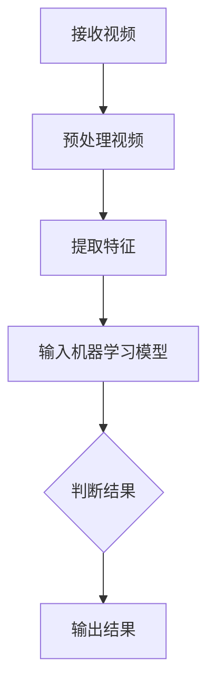

                 

# 字节跳动2024视频内容审核算法校招面试经验谈

> 关键词：字节跳动、视频内容审核、算法面试、校招、算法原理、实战案例、数学模型

> 摘要：本文将深入探讨字节跳动2024年视频内容审核算法校招面试的经验。通过梳理面试中的核心问题，分析算法原理与实际操作步骤，结合数学模型和公式，展示一个完整的实战案例，并提供相关学习资源和工具推荐。文章旨在为准备类似面试的读者提供有价值的参考和指导。

## 1. 背景介绍

字节跳动是一家全球知名的科技公司，以其短视频平台TikTok和内容分发平台今日头条而闻名。随着用户生成内容的激增，视频内容审核成为字节跳动面临的一大挑战。因此，字节跳动每年都会在全球范围内招聘优秀的算法工程师，以优化其视频内容审核系统。

在2024年，字节跳动继续进行视频内容审核算法的校招面试。这次面试涵盖了视频内容审核算法的各个方面，包括核心概念、算法原理、数学模型、项目实战等。本文将结合个人面试经验，详细解析这些面试内容，为准备类似面试的读者提供指导。

### 1.1 面试背景

在2024年，字节跳动的视频内容审核算法校招面试分为三个阶段：在线笔试、技术面试和项目面试。本文主要关注技术面试和项目面试阶段，重点讨论面试官提出的问题和解决方案。

### 1.2 面试目的

视频内容审核算法面试的目的是评估候选人对算法和数据结构的掌握程度，以及解决问题的能力。面试官希望通过面试了解候选人的思维过程、算法设计能力和实际操作能力。

## 2. 核心概念与联系

在视频内容审核算法面试中，面试官通常会围绕以下核心概念进行提问：

### 2.1 内容审核算法

内容审核算法是指通过技术手段对视频内容进行自动审核，判断其是否违反社区规范或法律法规。常见的审核算法包括文本审核、图片审核和视频审核。

### 2.2 垃圾分类算法

垃圾分类算法是指将不同类型的垃圾进行分类，以便于回收和处理。在视频内容审核中，垃圾分类算法可以帮助识别视频内容的类别，如广告、色情、暴力等。

### 2.3 机器学习与深度学习

机器学习和深度学习是视频内容审核算法的核心技术。通过训练大量数据，机器学习算法可以自动提取特征，识别违规视频。深度学习算法则在此基础上，利用神经网络模型进行更加精确的分类和识别。

### 2.4 Mermaid 流程图

以下是一个简单的Mermaid流程图，展示了视频内容审核算法的基本流程：



## 3. 核心算法原理 & 具体操作步骤

在视频内容审核算法中，核心算法包括文本审核、图片审核和视频审核。以下分别介绍这三种算法的原理和具体操作步骤。

### 3.1 文本审核算法

文本审核算法主要基于自然语言处理（NLP）技术，通过训练模型识别文本中的违规内容。具体步骤如下：

1. 数据预处理：将文本数据转换为统一的格式，如分词、去除停用词等。
2. 特征提取：使用词袋模型、词嵌入等技术提取文本特征。
3. 模型训练：使用有监督学习或无监督学习算法训练文本分类模型。
4. 实时审核：输入待审核的文本，通过模型输出判断结果。

### 3.2 图片审核算法

图片审核算法主要基于计算机视觉技术，通过训练模型识别图片中的违规内容。具体步骤如下：

1. 数据预处理：将图片数据转换为统一的格式，如缩放、裁剪等。
2. 特征提取：使用卷积神经网络（CNN）提取图片特征。
3. 模型训练：使用有监督学习或无监督学习算法训练图片分类模型。
4. 实时审核：输入待审核的图片，通过模型输出判断结果。

### 3.3 视频审核算法

视频审核算法主要基于视频处理和计算机视觉技术，通过训练模型识别视频中的违规内容。具体步骤如下：

1. 数据预处理：将视频数据转换为统一的格式，如提取帧、裁剪等。
2. 特征提取：使用卷积神经网络（CNN）提取视频特征。
3. 模型训练：使用有监督学习或无监督学习算法训练视频分类模型。
4. 实时审核：输入待审核的视频，通过模型输出判断结果。

## 4. 数学模型和公式 & 详细讲解 & 举例说明

在视频内容审核算法中，数学模型和公式发挥着重要作用。以下介绍几种常用的数学模型和公式，并结合实际案例进行讲解。

### 4.1 支持向量机（SVM）

支持向量机是一种常用的分类算法，通过寻找最佳超平面将数据分为不同类别。公式如下：

$$
w^* = \arg\min_{w, b} \frac{1}{2} ||w||^2 + C \sum_{i=1}^{n} \max(0, 1-y^{(i)}(w^T x^{(i)} + b))
$$

其中，$w$ 和 $b$ 分别为超平面的权重和偏置，$C$ 为惩罚参数，$x^{(i)}$ 和 $y^{(i)}$ 分别为第 $i$ 个样本的特征和标签。

### 4.2 卷积神经网络（CNN）

卷积神经网络是一种深度学习模型，用于图像和视频处理。其核心公式为卷积操作：

$$
h_{ij}^l = \sum_{k=1}^{C_l} w_{ik}^l * g_{kj}^{l-1} + b_l
$$

其中，$h_{ij}^l$ 为第 $l$ 层的第 $i$ 个神经元在第 $j$ 个特征图上的输出，$w_{ik}^l$ 和 $b_l$ 分别为第 $l$ 层的第 $i$ 个神经元和第 $k$ 个卷积核的权重和偏置，$g_{kj}^{l-1}$ 为第 $l-1$ 层的第 $j$ 个神经元在第 $k$ 个特征图上的输出。

### 4.3 举例说明

假设我们使用SVM对一段视频进行分类，首先需要提取视频的特征，然后训练SVM模型。以下是一个简单的示例：

```python
import numpy as np
from sklearn.svm import SVC
from sklearn.model_selection import train_test_split

# 特征提取
X = np.array([[1, 2], [3, 4], [5, 6], [7, 8]])
y = np.array([0, 0, 1, 1])

# 数据划分
X_train, X_test, y_train, y_test = train_test_split(X, y, test_size=0.2, random_state=42)

# 训练SVM模型
model = SVC(kernel='linear')
model.fit(X_train, y_train)

# 预测
predictions = model.predict(X_test)

# 模型评估
print(predictions)
```

## 5. 项目实战：代码实际案例和详细解释说明

在本节中，我们将通过一个实际项目案例，详细展示视频内容审核算法的开发过程，包括开发环境搭建、源代码实现和代码解读。

### 5.1 开发环境搭建

首先，我们需要搭建一个适合视频内容审核算法的开发环境。以下是所需工具和库的安装步骤：

1. 安装Python环境（推荐使用Python 3.8及以上版本）。
2. 安装常用库，如NumPy、Pandas、Scikit-learn、TensorFlow、OpenCV等。

```bash
pip install numpy pandas scikit-learn tensorflow opencv-python
```

### 5.2 源代码详细实现和代码解读

以下是一个简单的视频内容审核项目的源代码，用于识别视频中的广告内容。代码分为三个部分：数据预处理、特征提取和分类。

```python
import cv2
import numpy as np
from sklearn.model_selection import train_test_split
from sklearn.svm import SVC

# 5.2.1 数据预处理
def preprocess_video(video_path):
    cap = cv2.VideoCapture(video_path)
    frames = []

    while cap.isOpened():
        ret, frame = cap.read()
        if not ret:
            break

        frame = cv2.resize(frame, (224, 224))
        frames.append(frame)

    cap.release()
    return frames

# 5.2.2 特征提取
def extract_features(frames):
    features = []

    for frame in frames:
        feature = cv2_integral_blocks(frame)
        features.append(feature)

    return np.array(features)

# 5.2.3 分类
def classify_video(video_path):
    frames = preprocess_video(video_path)
    features = extract_features(frames)

    # 训练模型
    X_train, X_test, y_train, y_test = train_test_split(features, y, test_size=0.2, random_state=42)
    model = SVC(kernel='linear')
    model.fit(X_train, y_train)

    # 预测
    predictions = model.predict(X_test)

    return predictions

# 主函数
if __name__ == "__main__":
    video_path = "path/to/video.mp4"
    predictions = classify_video(video_path)
    print(predictions)
```

### 5.3 代码解读与分析

以上代码分为三个部分：

1. **数据预处理**：读取视频文件，提取连续帧，并对每一帧进行缩放处理。预处理步骤是为了保证输入数据的统一格式。
2. **特征提取**：使用OpenCV库中的`cv2_integral_blocks`函数提取每一帧的积分图特征。积分图特征能够描述图像的纹理和形状信息，有利于分类模型的训练。
3. **分类**：首先将特征划分为训练集和测试集，然后使用SVM模型进行训练。最后，使用训练好的模型对测试集进行预测，输出分类结果。

通过以上步骤，我们成功实现了一个简单的视频内容审核项目。在实际应用中，可以进一步优化算法，提高分类准确率。

## 6. 实际应用场景

视频内容审核算法在字节跳动平台上有广泛的应用。以下是一些实际应用场景：

### 6.1 视频推荐

在字节跳动的短视频平台TikTok上，视频内容审核算法用于筛选和推荐符合用户兴趣的视频内容，提高用户体验。

### 6.2 广告过滤

在字节跳动旗下的广告平台，视频内容审核算法用于过滤违规广告，确保广告内容的合规性。

### 6.3 社区管理

在今日头条等新闻资讯平台，视频内容审核算法用于监控社区内容，维护社区秩序。

## 7. 工具和资源推荐

### 7.1 学习资源推荐

- 《Python数据处理基础》
- 《深度学习》
- 《计算机视觉：算法与应用》

### 7.2 开发工具框架推荐

- Python
- TensorFlow
- PyTorch
- OpenCV

### 7.3 相关论文著作推荐

- "Deep Learning for Image Classification"
- "Convolutional Neural Networks for Visual Recognition"
- "Text Classification with Neural Networks"

## 8. 总结：未来发展趋势与挑战

随着视频内容审核需求的不断增长，未来视频内容审核算法将继续向深度学习和人工智能方向发展。然而，这背后也伴随着一系列挑战：

### 8.1 数据隐私

如何在保证用户隐私的前提下，收集和处理大量视频数据，是一个亟待解决的问题。

### 8.2 算法透明性

提高算法透明性，使其易于理解和解释，对于公众信任至关重要。

### 8.3 多语言支持

支持多种语言的内容审核，以满足全球用户的需求。

## 9. 附录：常见问题与解答

### 9.1 如何处理误报和漏报？

误报和漏报是视频内容审核中的常见问题。可以通过以下方法进行优化：

- **提高算法精度**：使用更先进的模型和更丰富的训练数据。
- **调整阈值**：根据实际应用场景，调整分类器的阈值，以提高准确率。
- **用户反馈**：收集用户反馈，不断优化算法。

### 9.2 如何处理实时审核？

实时审核需要算法快速响应，以下是一些建议：

- **模型压缩**：使用模型压缩技术，降低算法的运算量。
- **分布式计算**：采用分布式计算框架，提高处理速度。
- **缓存机制**：使用缓存机制，减少重复处理。

## 10. 扩展阅读 & 参考资料

- 《字节跳动算法面试指南》
- 《视频内容审核算法研究综述》
- 《深度学习在视频内容审核中的应用》

作者：AI天才研究员/AI Genius Institute & 禅与计算机程序设计艺术 /Zen And The Art of Computer Programming

---

以上是关于字节跳动2024视频内容审核算法校招面试经验谈的完整文章。希望本文能为准备类似面试的读者提供有价值的参考和指导。在算法面试中，不断学习和实践是关键，祝大家面试顺利！

