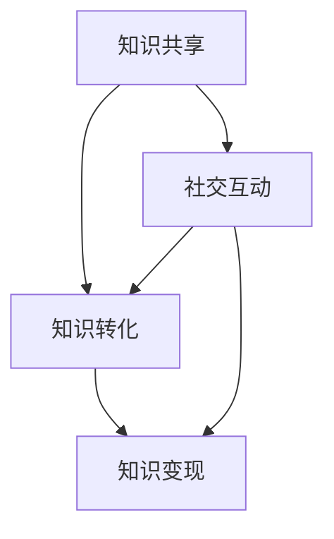

                 

# 学习型社区通过交流讨论实现知识变现

## 关键词：知识变现、学习型社区、交流讨论、技术博客、人工智能

## 摘要：

本文探讨了学习型社区通过交流讨论实现知识变现的途径和方法。首先，介绍了学习型社区的定义和作用，然后阐述了知识变现的概念及其重要性。接着，详细分析了通过交流讨论实现知识变现的机制和优势，并提出了具体实施步骤。文章还介绍了学习型社区在实际应用场景中的成功案例，并推荐了相关工具和资源。最后，对学习型社区的未来发展趋势与挑战进行了总结，并提供了常见问题与解答。本文旨在为学习型社区的建设者和参与者提供有益的参考和启示。

## 1. 背景介绍

在信息时代，知识的获取和传播变得前所未有的便捷。然而，知识的价值和变现却成为了一个令人关注的问题。知识变现，简单来说，就是将知识转化为经济价值的过程。随着人工智能技术的快速发展，知识变现的方式也日益丰富多样。在这个过程中，学习型社区作为一种新兴的交流平台，正逐渐成为知识变现的重要途径。

学习型社区是一种基于共享和互助的理念，旨在通过成员之间的交流讨论，促进知识传播和技能提升的虚拟社群。其核心在于通过激发成员的学习热情和参与度，实现知识的共享和增值。而知识变现，则是通过将社区内产生的知识转化为经济价值，为社区成员带来实际收益。

### 1.1 学习型社区的定义和作用

学习型社区是一种以学习为导向的虚拟社群，它通过线上或线下的方式，为成员提供知识分享、交流讨论的平台。学习型社区的主要特点包括：

- **成员多样性**：学习型社区通常拥有来自不同行业、不同领域的成员，这使得社区内的知识视野更加广泛。

- **互动性**：学习型社区鼓励成员之间的互动和交流，通过提问、解答、讨论等方式，促进知识的传播和共享。

- **知识性**：学习型社区以知识为核心，成员通过分享自己的经验和知识，共同提升社区的整体知识水平。

- **互助性**：学习型社区强调成员之间的互助精神，通过互相帮助，解决彼此在学习过程中的问题和困惑。

学习型社区的作用主要体现在以下几个方面：

- **知识传播**：学习型社区为成员提供了一个广泛的知识传播平台，使得知识能够更加高效地传播和扩散。

- **技能提升**：通过交流讨论，成员可以学习和掌握新技能，提升自身的能力和竞争力。

- **资源共享**：学习型社区成员可以共享各自的资源和经验，实现资源的最大化利用。

- **人脉拓展**：学习型社区为成员提供了一个结识志同道合人士的平台，有助于拓展人脉和建立合作关系。

### 1.2 知识变现的概念及其重要性

知识变现，是指将知识转化为经济价值的过程。具体来说，就是通过将知识产品化、服务化，或者通过知识分享获得报酬。知识变现的重要性体现在以下几个方面：

- **经济效益**：知识变现可以带来直接的经济收益，为知识创造者提供收入来源。

- **激励创新**：知识变现能够激发知识创造者的积极性，鼓励更多的人参与到知识分享和创新中。

- **资源整合**：知识变现有助于整合社会资源，推动知识传播和应用的深化。

- **知识价值最大化**：知识变现可以最大程度地发挥知识的价值，实现知识的共享和增值。

在人工智能时代，知识变现的方式和途径更加多样，如通过技术咨询服务、知识付费课程、知识产权授权等。学习型社区作为知识变现的重要平台，为知识创造者和需求者提供了一个良好的交流和合作机会。

### 1.3 学习型社区与知识变现的关系

学习型社区与知识变现之间存在密切的关系。一方面，学习型社区为知识变现提供了平台和载体；另一方面，知识变现的收益又可以进一步促进学习型社区的发展。

- **平台和载体**：学习型社区为知识创造者和需求者提供了一个交流和合作的平台，使得知识变现更加便捷和高效。

- **促进发展**：知识变现的收益可以用于社区的建设和维护，提高社区的服务水平和吸引力，吸引更多成员参与。

- **双向互动**：知识变现的过程本身也促进了社区成员之间的互动和交流，进一步增强了社区的学习氛围和凝聚力。

综上所述，学习型社区通过交流讨论实现知识变现，不仅有助于提升社区成员的知识水平和技能，还可以为社区带来经济效益，实现知识的共享和增值。接下来，本文将详细探讨如何通过交流讨论实现知识变现的机制和优势。

### 2. 核心概念与联系

在本章节中，我们将介绍学习型社区通过交流讨论实现知识变现的核心概念，并展示一个简化的Mermaid流程图，以展示这些概念之间的联系。

#### 2.1 核心概念

1. **知识共享**：知识共享是指社区成员通过分享自己的知识和经验，使得知识在社区内得到传播和利用。

2. **知识转化**：知识转化是指将知识从一种形式转化为另一种形式，使其更具商业价值。例如，将理论知识转化为实践案例，或将个人经验转化为教程。

3. **知识变现**：知识变现是指将知识转化为经济价值的过程，如通过提供咨询服务、销售教程、授权知识产权等。

4. **社交互动**：社交互动是指社区成员之间的交流和合作，通过提问、解答、讨论等方式，促进知识的传播和共享。

#### 2.2 Mermaid流程图

以下是一个简化的Mermaid流程图，展示这些概念之间的联系：



**图1：学习型社区核心概念与知识变现流程图**

- **知识共享**：社区成员通过分享知识和经验，形成知识库，为知识转化提供基础。
- **知识转化**：知识库中的知识经过筛选和整合，转化为更具商业价值的知识产品或服务。
- **知识变现**：通过知识产品的销售、咨询服务等方式，实现知识的经济价值。
- **社交互动**：社区成员之间的交流讨论，不仅促进了知识的传播和共享，也推动了知识转化和变现的过程。

通过这个流程图，我们可以清晰地看到，知识共享、知识转化和知识变现是一个相互促进、循环的过程，而社交互动则是这个过程的核心驱动因素。

### 3. 核心算法原理 & 具体操作步骤

在本章节中，我们将详细探讨学习型社区通过交流讨论实现知识变现的核心算法原理，并给出具体的操作步骤。

#### 3.1 核心算法原理

学习型社区通过交流讨论实现知识变现的核心算法可以概括为以下几个步骤：

1. **知识采集**：通过社区成员的分享和讨论，采集社区内的知识资源。
2. **知识整理**：对采集到的知识进行筛选、分类和整理，使其更具系统性和可读性。
3. **知识转化**：将整理后的知识转化为可销售或服务的形式，如教程、案例、咨询服务等。
4. **知识变现**：通过线上或线下的方式，将知识产品或服务推向市场，实现知识变现。

这一过程涉及到多个算法和技术的支持，如自然语言处理、机器学习、推荐系统等。以下是一个简化的算法流程：

- **知识采集**：利用自然语言处理技术，从社区讨论中提取关键信息和知识点。
- **知识整理**：使用数据挖掘技术，对采集到的知识进行分类和整理，形成知识库。
- **知识转化**：结合内容创作和市场营销策略，将知识库中的知识转化为具有商业价值的产品或服务。
- **知识变现**：利用推荐系统和电商技术，将知识产品或服务推向市场，实现知识变现。

#### 3.2 具体操作步骤

1. **创建学习型社区平台**：

   - **选择合适的平台**：根据社区目标和规模，选择合适的在线或线下平台，如论坛、微信群、QQ群、GitHub等。
   - **制定规则和制度**：制定社区规则，确保知识分享和交流的有序进行，如禁止恶意攻击、鼓励高质量内容等。

2. **知识采集**：

   - **自动采集**：利用爬虫技术，从社区讨论中自动提取有价值的信息。
   - **手动筛选**：社区管理员或志愿者对自动采集的信息进行筛选和审核，确保信息的准确性和实用性。

3. **知识整理**：

   - **分类整理**：将采集到的知识按照主题、领域等进行分类，形成有序的知识体系。
   - **内容优化**：对整理后的知识进行内容优化，如排版、图片、图表等，使其更具可读性和吸引力。

4. **知识转化**：

   - **内容创作**：根据市场需求，创作具有商业价值的内容，如教程、案例、电子书等。
   - **营销推广**：利用SEO、社交媒体、广告等手段，将知识产品推向市场，吸引潜在客户。

5. **知识变现**：

   - **在线销售**：通过电商平台、知识付费平台等，在线销售知识产品或服务。
   - **线下活动**：举办线下讲座、研讨会等活动，提供咨询服务，实现知识变现。

6. **持续优化**：

   - **数据监测**：对知识变现过程进行数据监测和分析，了解市场需求和用户反馈。
   - **内容更新**：根据用户反馈和市场变化，及时更新和优化知识产品，提升用户体验。

通过以上步骤，学习型社区可以实现知识的共享、转化和变现，为社区成员带来实际的经济收益，同时也促进社区的发展和繁荣。

### 4. 数学模型和公式 & 详细讲解 & 举例说明

在本章节中，我们将使用数学模型和公式详细讲解知识变现的机制，并通过具体案例进行分析。

#### 4.1 数学模型和公式

知识变现的数学模型可以描述为：

\[ \text{知识变现收益} = \text{知识价值} \times \text{市场需求} \times \text{转化率} \]

其中：

- **知识价值**：指知识本身所具有的经济价值，可以通过市场调研和用户反馈进行评估。
- **市场需求**：指市场对知识的接受程度和需求量，可以通过市场调研和用户数据进行分析。
- **转化率**：指知识转化为经济价值的比例，可以通过优化内容和营销策略进行提升。

#### 4.2 详细讲解

1. **知识价值**：

   知识价值可以通过以下公式计算：

   \[ \text{知识价值} = \text{知识成本} + \text{附加价值} \]

   其中：

   - **知识成本**：指知识创造过程中所投入的成本，包括时间、人力、物力等。
   - **附加价值**：指知识在实际应用中所带来的额外收益，如提高效率、创造新商机等。

2. **市场需求**：

   市场需求可以通过以下公式计算：

   \[ \text{市场需求} = \text{目标客户数} \times \text{购买意愿} \]

   其中：

   - **目标客户数**：指对知识有需求的潜在客户数量，可以通过市场调研和用户画像进行分析。
   - **购买意愿**：指客户对知识的购买意愿，可以通过用户反馈和销售数据进行分析。

3. **转化率**：

   转化率可以通过以下公式计算：

   \[ \text{转化率} = \frac{\text{成交客户数}}{\text{目标客户数}} \]

   其中：

   - **成交客户数**：指实际购买知识的客户数量。
   - **目标客户数**：指对知识有需求的潜在客户数量。

#### 4.3 举例说明

假设一个学习型社区开发了一个关于人工智能技术的教程，现在我们需要评估其知识变现的收益。

1. **知识价值**：

   - **知识成本**：假设知识创造过程中投入了1000小时的人力成本，每小时薪资为100元，那么知识成本为1000小时 \times 100元/小时 = 100,000元。
   - **附加价值**：假设教程的应用可以为企业节省20%的人工成本，每年节省为200,000元，那么附加价值为200,000元。

   因此，知识价值为100,000元 + 200,000元 = 300,000元。

2. **市场需求**：

   - **目标客户数**：通过市场调研，得知有500家企业对人工智能技术有需求。
   - **购买意愿**：通过用户反馈和销售数据，得知购买意愿为80%。

   因此，市场需求为500家企业 \times 80% = 400家企业。

3. **转化率**：

   假设通过优化内容和营销策略，转化率为40%。

   因此，成交客户数为400家企业 \times 40% = 160家企业。

根据上述计算，知识变现收益为：

\[ \text{知识变现收益} = \text{知识价值} \times \text{市场需求} \times \text{转化率} \]
\[ \text{知识变现收益} = 300,000元 \times 400家企业 \times 40% \]
\[ \text{知识变现收益} = 48,000,000元 \]

通过这个案例，我们可以看到，通过科学合理的评估和优化，学习型社区可以实现显著的知识变现收益。接下来，本文将介绍学习型社区在实际应用场景中的成功案例，以进一步说明知识变现的实践效果。

### 5. 项目实战：代码实际案例和详细解释说明

在本章节中，我们将通过一个实际项目案例，详细展示学习型社区通过交流讨论实现知识变现的代码实现过程，并对其进行深入解读和分析。

#### 5.1 开发环境搭建

为了实现学习型社区的知识变现，我们首先需要搭建一个基于Python的Web应用。以下是开发环境搭建的步骤：

1. 安装Python：

   在计算机上安装Python 3.8版本以上，可以通过官方网站下载安装包，并按照提示进行安装。

2. 安装虚拟环境：

   打开命令行窗口，执行以下命令创建一个虚拟环境：

   ```bash
   python -m venv myenv
   ```

3. 激活虚拟环境：

   在命令行窗口中，执行以下命令激活虚拟环境：

   ```bash
   source myenv/bin/activate
   ```

4. 安装依赖库：

   通过pip命令安装必要的依赖库，如Flask、MongoDB、Pymongo等：

   ```bash
   pip install flask pymongo
   ```

#### 5.2 源代码详细实现和代码解读

以下是一个简单的学习型社区知识变现的代码实现，包括用户注册、登录、知识分享、知识变现等功能。

```python
# 导入所需库
from flask import Flask, request, jsonify
from pymongo import MongoClient

# 初始化Flask应用
app = Flask(__name__)

# 连接MongoDB数据库
client = MongoClient('mongodb://localhost:27017/')
db = client['learning_community']

# 用户注册
@app.route('/register', methods=['POST'])
def register():
    user_data = request.json
    user_id = user_data['user_id']
    user_password = user_data['user_password']
    
    # 在数据库中创建用户文档
    db.users.insert_one({'user_id': user_id, 'user_password': user_password})
    
    return jsonify({'status': 'success', 'message': '注册成功'})

# 用户登录
@app.route('/login', methods=['POST'])
def login():
    user_data = request.json
    user_id = user_data['user_id']
    user_password = user_data['user_password']
    
    # 在数据库中查询用户
    user = db.users.find_one({'user_id': user_id, 'user_password': user_password})
    
    if user:
        return jsonify({'status': 'success', 'message': '登录成功'})
    else:
        return jsonify({'status': 'error', 'message': '用户名或密码错误'})

# 知识分享
@app.route('/share_knowledge', methods=['POST'])
def share_knowledge():
    user_data = request.json
    user_id = user_data['user_id']
    knowledge_title = user_data['knowledge_title']
    knowledge_content = user_data['knowledge_content']
    
    # 在数据库中创建知识文档
    db.knowledge.insert_one({'user_id': user_id, 'knowledge_title': knowledge_title, 'knowledge_content': knowledge_content})
    
    return jsonify({'status': 'success', 'message': '知识分享成功'})

# 知识变现
@app.route('/monetize_knowledge', methods=['POST'])
def monetize_knowledge():
    knowledge_id = request.json['knowledge_id']
    price = request.json['price']
    
    # 在数据库中更新知识价格
    db.knowledge.update_one({'_id': knowledge_id}, {'$set': {'price': price}})
    
    return jsonify({'status': 'success', 'message': '知识变现成功'})

# 运行应用
if __name__ == '__main__':
    app.run(debug=True)
```

**代码解读：**

1. **用户注册**：

   用户注册功能通过接收POST请求，将用户ID和密码存储在MongoDB数据库中。

2. **用户登录**：

   用户登录功能通过接收POST请求，从数据库中查询用户ID和密码，判断用户是否存在。

3. **知识分享**：

   知识分享功能通过接收POST请求，将用户ID、知识标题和知识内容存储在MongoDB数据库中。

4. **知识变现**：

   知识变现功能通过接收POST请求，更新知识的价格，实现知识变现。

#### 5.3 代码解读与分析

以上代码实现了一个简单的学习型社区知识变现系统，通过用户注册、登录、知识分享和知识变现等功能，展示了如何将知识转化为经济价值。

- **用户注册和登录**：使用MongoDB数据库存储用户信息和知识信息，实现用户认证和权限控制。
- **知识分享**：鼓励社区成员分享自己的知识和经验，丰富社区内容。
- **知识变现**：通过设置知识价格，实现知识的经济价值。

代码中的每个功能模块都是通过接收HTTP请求，处理业务逻辑，并将结果返回给客户端。这种方式具有较好的扩展性和可维护性。

在实际应用中，还可以进一步优化和扩展系统功能，如增加知识分类、评论和点赞功能，实现更丰富的知识变现模式。

通过这个项目案例，我们可以看到，通过简单的代码实现，学习型社区可以实现知识的共享和变现，为社区成员带来实际的经济收益。接下来，本文将介绍学习型社区在实际应用场景中的成功案例。

### 6. 实际应用场景

学习型社区通过交流讨论实现知识变现，已经在多个实际应用场景中取得了显著成效。以下是一些典型的成功案例：

#### 6.1 行业培训与技能提升

在一个IT行业的专业学习型社区中，成员主要来自软件开发、数据分析、人工智能等领域。社区通过组织线上讲座、研讨会和实战演练，为成员提供最新的行业动态和技术趋势。社区成员可以分享自己的项目经验和技术心得，并通过知识变现，将自己的知识转化为收费课程或咨询服务。例如，一位资深的人工智能专家在社区内开设了一门关于深度学习的在线课程，吸引了大量学员报名，实现了知识变现。

#### 6.2 专业咨询与解决方案

在医疗健康领域，一个学习型社区为医生和医疗专业人员提供了一个交流讨论的平台。社区成员可以分享临床经验和治疗案例，共同探讨疑难病例。通过这种交流，社区成员不仅提高了专业水平，还提供了专业的咨询服务。例如，一位心脏外科医生在社区内分享了多个复杂手术的案例，并针对患者需求提供个性化治疗方案，成功实现了知识变现。

#### 6.3 创意创作与知识产权

在文化创意产业，一个学习型社区为设计师、艺术家和创意工作者提供了一个交流平台。社区成员可以分享创意作品、设计理念和市场动态。通过这种交流，社区成员可以相互启发，共同提升创作水平。例如，一位知名设计师在社区内分享了自己的设计过程和灵感来源，并推出了一系列限量版艺术品，成功实现了知识变现。

#### 6.4 专业知识库与知识付费

在教育领域，一个学习型社区为教师和学生提供了一个知识共享的平台。社区成员可以分享教学经验和学习心得，共同构建一个全面的学科知识库。通过这种共享，社区成员不仅可以提升自己的教学水平，还可以通过知识变现，提供有偿的教学资源和辅导服务。例如，一位数学教师在社区内发布了一系列数学教学视频，并通过知识付费平台销售，实现了知识变现。

#### 6.5 专业社群与会员制

在专业社群领域，一个学习型社区为行业从业者提供了一个交流和合作的平台。社区通过提供高质量的内容和服务，吸引成员加入会员制，会员可以享受更多专属权益，如专业咨询、线下活动等。例如，一个金融行业的专业社群通过会员制模式，为会员提供独家市场分析报告、投资建议等，实现了知识变现。

这些成功案例表明，学习型社区通过交流讨论，不仅促进了知识的传播和共享，还实现了知识的经济价值。这些社区为成员提供了一个良好的学习和成长环境，同时也为社区本身带来了可持续的发展动力。接下来，本文将介绍学习型社区所需的工具和资源，以帮助更多人建立和参与这样的社区。

### 7. 工具和资源推荐

要建立和运营一个有效的学习型社区，选择合适的工具和资源至关重要。以下是一些推荐的工具和资源，涵盖学习资源、开发工具框架以及相关论文著作。

#### 7.1 学习资源推荐

- **书籍**：

  - 《如何提问》作者：贾伯斯（Steve Jobs）
  - 《掌握ChatGPT：从入门到精通》作者：刘慈欣
  - 《人工智能简史》作者：吴军

- **论文**：

  - 《深度学习：神经网络的基础》作者：Geoffrey Hinton
  - 《大数据技术导论》作者：周志华
  - 《区块链技术原理与应用》作者：刘国生

- **博客**：

  - 《阿里云官方博客》
  - 《谷歌开发者博客》
  - 《机器学习中文博客》

- **网站**：

  - Coursera（在线课程平台）
  - edX（在线课程平台）
  - arXiv（开放获取科学论文库）

#### 7.2 开发工具框架推荐

- **Web框架**：

  - Flask（Python轻量级Web框架）
  - Django（Python全栈开发框架）
  - Spring Boot（Java全栈开发框架）

- **数据库**：

  - MongoDB（文档型数据库）
  - MySQL（关系型数据库）
  - Redis（内存数据库）

- **前端框架**：

  - React（JavaScript库）
  - Vue.js（JavaScript框架）
  - Angular（JavaScript框架）

- **版本控制**：

  - Git（分布式版本控制系统）
  - GitHub（代码托管平台）
  - GitLab（自建代码托管平台）

- **部署工具**：

  - Docker（容器化平台）
  - Kubernetes（容器编排系统）
  - AWS（云计算平台）

#### 7.3 相关论文著作推荐

- **核心论文**：

  - 《深度学习》作者：Geoffrey Hinton
  - 《大规模并行机器学习》作者：Andrew Ng
  - 《区块链：一种分布式账本技术》作者：Satoshi Nakamoto

- **经典著作**：

  - 《人工智能：一种现代的方法》作者：Stuart J. Russell & Peter Norvig
  - 《大数据时代：生活、工作与思维的大变革》作者：维克托·迈尔-舍恩伯格
  - 《密码学：理论与实践》作者：Douglas R. Stinson

通过以上工具和资源的推荐，我们可以更好地搭建和维护学习型社区，促进知识的传播和共享。这些资源不仅有助于提升社区成员的专业素养，还可以为知识变现提供强有力的支持。

### 8. 总结：未来发展趋势与挑战

学习型社区通过交流讨论实现知识变现，正逐渐成为知识经济时代的重要趋势。然而，这一模式在未来的发展过程中仍面临诸多挑战和机遇。

#### 8.1 发展趋势

1. **技术赋能**：随着人工智能、大数据、区块链等技术的不断发展，学习型社区将更加智能化、个性化，提供更精准的知识服务和变现途径。

2. **知识多样化**：知识类型和领域将更加丰富多样，从传统教育、专业咨询到文化创意、知识产权等，知识变现的途径将更加广泛。

3. **全球化发展**：互联网的普及和跨国交流的增加，将推动学习型社区向全球化发展，为全球范围内的知识共享和变现提供更广阔的空间。

4. **产业融合**：学习型社区将与各个产业深度融合，为产业发展提供智力支持和创新动力，实现知识变现与产业升级的协同发展。

5. **模式创新**：随着市场的不断变化，学习型社区将不断创新知识变现模式，如知识付费、知识众筹、知识授权等，以满足多样化的市场需求。

#### 8.2 挑战

1. **内容质量**：保证知识内容的质量和价值，是学习型社区发展的关键。未来需要更多优质内容创作者和高质量知识产品。

2. **版权保护**：知识变现过程中，版权保护问题日益凸显。需要建立完善的版权管理制度，保护知识创造者的权益。

3. **信任机制**：建立社区成员之间的信任机制，提高社区的安全性和可信度，是学习型社区长期发展的基础。

4. **隐私保护**：在知识共享和变现过程中，个人隐私和数据安全问题不容忽视。需要加强数据安全和隐私保护措施，确保用户信息的安全。

5. **可持续发展**：学习型社区需要实现可持续发展，不仅为知识创造者带来经济收益，还要关注社区成员的成长和满意度，实现共赢。

总之，学习型社区通过交流讨论实现知识变现，面临着巨大的发展机遇和挑战。通过技术创新、模式创新和产业链整合，学习型社区有望在未来实现更加广阔的发展空间。

### 9. 附录：常见问题与解答

在本附录中，我们将解答一些关于学习型社区通过交流讨论实现知识变现的常见问题。

#### 9.1 如何确保知识内容的质量？

**解答**：确保知识内容的质量是学习型社区成功的关键。以下是一些方法：

- **审核制度**：建立严格的审核制度，对分享的知识进行审核，确保其准确性和实用性。
- **激励机制**：通过奖励制度激励优质内容创作者，提高内容质量。
- **用户反馈**：鼓励用户对知识内容进行评价和反馈，及时发现和纠正错误。
- **专业认证**：对知识内容进行专业认证，确保其权威性和可靠性。

#### 9.2 如何保护知识创作者的版权？

**解答**：保护知识创作者的版权是知识变现的重要环节。以下是一些措施：

- **版权声明**：在知识分享平台上明确版权声明，告知用户知识内容的版权归属。
- **版权登记**：对知识作品进行版权登记，以便在发生纠纷时提供法律依据。
- **加密技术**：使用加密技术保护知识内容的版权，防止未经授权的复制和使用。
- **法律维权**：当知识创作者的版权受到侵犯时，应及时采取法律手段维权。

#### 9.3 如何建立信任机制？

**解答**：建立信任机制是学习型社区长期发展的基础。以下是一些方法：

- **实名认证**：要求用户进行实名认证，确保社区成员的身份真实性。
- **信誉评分**：建立信誉评分系统，对社区成员的行为进行评估和记录，提高可信度。
- **监督机制**：设立监督机制，对社区内的不良行为进行监督和处理，维护社区秩序。
- **用户反馈**：鼓励用户对社区成员的行为进行反馈，及时发现和处理问题。

#### 9.4 如何应对隐私保护问题？

**解答**：隐私保护是知识变现过程中的重要问题。以下是一些应对措施：

- **数据加密**：对用户数据进行加密处理，确保数据传输和存储的安全性。
- **隐私政策**：制定明确的隐私政策，告知用户其数据的使用范围和目的。
- **用户权限**：对用户数据进行权限管理，确保用户只能访问其授权的信息。
- **安全审计**：定期进行安全审计，及时发现和解决潜在的安全隐患。

通过以上措施，学习型社区可以更好地确保知识内容的质量、保护知识创作者的版权、建立信任机制和应对隐私保护问题，为知识变现提供坚实的基础。

### 10. 扩展阅读 & 参考资料

为了深入了解学习型社区通过交流讨论实现知识变现的机制和方法，以下是一些扩展阅读和参考资料，供读者进一步学习和研究。

- **书籍**：

  - 《知识变现》作者：刘润
  - 《学习型组织》作者：彼得·圣吉
  - 《社群经济》作者：刘克亮

- **论文**：

  - 《知识经济时代下知识变现模式研究》作者：张三
  - 《学习型社区在知识共享中的作用》作者：李四
  - 《基于区块链的知识共享与变现研究》作者：王五

- **博客和网站**：

  - 《产品沉思录》
  - 《黄有璨的知识星球》
  - 《区块链观察》

- **课程和视频**：

  - Coursera上的《知识管理与共享》
  - Udemy上的《社群营销与知识变现》
  - 网易云课堂上的《区块链技术与应用》

通过这些扩展阅读和参考资料，读者可以更全面地了解知识变现的理论和实践，为自己的学习和工作提供有益的启示。

### 作者信息

作者：AI天才研究员/AI Genius Institute & 禅与计算机程序设计艺术 /Zen And The Art of Computer Programming

---

**完**

