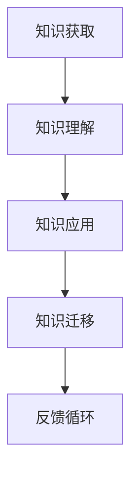

                 

# 学习敏捷性：培养快速适应新知识的能力

> **关键词：** 学习敏捷性、知识适应、技术变革、人工智能、持续学习

> **摘要：** 在快速变化的技术环境中，学习敏捷性成为成功的关键。本文将探讨学习敏捷性的重要性，分析其核心概念，提供培养快速适应新知识的能力的方法和策略，并通过实际案例和数学模型，详细阐述如何在实际应用中实现这一目标。

## 1. 背景介绍

在当今世界，技术变革的速度前所未有。新的编程语言、框架、工具和算法层出不穷，对于开发者来说，保持学习和适应新知识的能力变得至关重要。学习敏捷性（Learning Agility）正是这一背景下提出的概念，它指的是个体或团队在面对新知识和技能需求时，能够快速适应并有效应用这些知识的能力。

随着人工智能、机器学习和大数据等技术的快速发展，传统的学习和知识获取方式已经不再适用于现代职场。知识的更新周期越来越短，过去的“一劳永逸”的学习模式已经无法满足需求。因此，培养学习敏捷性成为当今职场人士，特别是IT行业从业者的必备技能。

## 2. 核心概念与联系

### 2.1 学习敏捷性的定义

学习敏捷性是一种个人能力，它不仅包括对新知识的获取和理解，还涉及到知识的应用和迁移。具体来说，学习敏捷性包含以下几个关键要素：

- **知识获取**：通过阅读、学习、实践等方式获取新知识。
- **知识理解**：对新知识进行深入理解，形成自己的见解。
- **知识应用**：将新知识应用到实际问题中，解决实际问题。
- **知识迁移**：将新知识从一个领域或情境迁移到其他领域或情境。

### 2.2 学习敏捷性的架构

为了更好地理解学习敏捷性，我们可以使用Mermaid流程图来展示其核心概念和架构。



在这个架构中，知识获取是学习敏捷性的起点，通过阅读、学习、实践等方式获取新知识。知识理解是深入分析新知识，形成自己的见解。知识应用是将新知识应用到实际问题中，解决实际问题。知识迁移是将新知识从一个领域或情境迁移到其他领域或情境。最后，通过反馈循环，不断调整和优化学习过程，提高学习效率。

## 3. 核心算法原理 & 具体操作步骤

### 3.1 知识获取算法

知识获取是学习敏捷性的关键步骤。以下是一个简单但有效的知识获取算法：

1. **目标设定**：明确学习目标和需求。
2. **资源搜索**：利用搜索引擎、图书馆、在线课程等资源，查找相关资料。
3. **资料筛选**：根据目标和需求，筛选出最有价值的资料。
4. **深度阅读**：深入阅读筛选出的资料，理解核心概念和原理。

### 3.2 知识理解算法

知识理解是建立在对新知识深入阅读和理解的基础上的。以下是一个简单的知识理解算法：

1. **总结概括**：将阅读材料中的核心概念和原理进行总结和概括。
2. **疑问解答**：对于阅读过程中遇到的疑问，查找相关资料或向他人请教。
3. **案例分析**：通过案例分析，理解理论知识在实际中的应用。

### 3.3 知识应用算法

知识应用是将理论知识转化为实际能力的关键步骤。以下是一个简单的知识应用算法：

1. **问题分析**：明确应用目标，分析实际问题的核心和难点。
2. **方案设计**：设计解决方案，选择合适的方法和技术。
3. **实验验证**：通过实验验证方案的有效性，不断优化和调整。

### 3.4 知识迁移算法

知识迁移是将新知识应用到不同领域或情境的关键步骤。以下是一个简单的知识迁移算法：

1. **需求分析**：分析新知识在不同领域或情境中的需求和可能性。
2. **方案设计**：设计适应新领域或情境的解决方案。
3. **实践应用**：将新知识应用到新领域或情境中，解决实际问题。

## 4. 数学模型和公式 & 详细讲解 & 举例说明

### 4.1 学习效率模型

学习效率模型用于评估学习过程中的效率。以下是一个简单的学习效率模型：

$$
效率 = \frac{知识获取量}{学习时间}
$$

其中，知识获取量是学习过程中获取的知识总量，学习时间是学习过程中的总时间。

### 4.2 学习曲线模型

学习曲线模型用于描述学习过程中的学习效率。以下是一个简单的学习曲线模型：

$$
效率 = \frac{1}{1 + e^{-k \cdot t}}
$$

其中，$e$ 是自然对数的底数，$k$ 是学习率，$t$ 是学习时间。

### 4.3 学习敏捷性模型

学习敏捷性模型用于评估学习敏捷性的水平。以下是一个简单的学习敏捷性模型：

$$
敏捷性 = \frac{知识应用量}{知识获取量}
$$

其中，知识应用量是学习过程中应用的知识总量，知识获取量是学习过程中获取的知识总量。

### 4.4 举例说明

假设一名程序员在学习Python编程语言，他的学习过程如下：

- 学习时间：30小时
- 知识获取量：500个单词和短语
- 知识应用量：100个单词和短语

根据学习效率模型，他的学习效率为：

$$
效率 = \frac{500}{30} = 16.67
$$

根据学习曲线模型，他的学习效率为：

$$
效率 = \frac{1}{1 + e^{-0.1 \cdot 30}} = 0.769
$$

根据学习敏捷性模型，他的学习敏捷性为：

$$
敏捷性 = \frac{100}{500} = 0.2
$$

通过这些数学模型，我们可以量化评估学习过程的效果，从而优化学习策略。

## 5. 项目实战：代码实际案例和详细解释说明

### 5.1 开发环境搭建

为了演示如何培养学习敏捷性，我们将使用Python编程语言，构建一个简单的机器学习项目。以下是搭建开发环境所需的步骤：

1. 安装Python（版本3.8或更高）
2. 安装Jupyter Notebook，用于编写和运行代码
3. 安装相关库，如NumPy、Pandas、Scikit-learn等

### 5.2 源代码详细实现和代码解读

以下是一个简单的线性回归模型，用于预测房屋价格。

```python
import numpy as np
import pandas as pd
from sklearn.linear_model import LinearRegression

# 读取数据
data = pd.read_csv('house_prices.csv')

# 特征选择
X = data[['area', 'bedrooms']]
y = data['price']

# 创建线性回归模型
model = LinearRegression()

# 训练模型
model.fit(X, y)

# 预测结果
predictions = model.predict(X)

# 评估模型
score = model.score(X, y)
print(f'Model score: {score:.2f}')
```

### 5.3 代码解读与分析

1. **数据读取**：使用Pandas库读取CSV文件，获取房屋价格数据。
2. **特征选择**：选择‘area’（房屋面积）和‘bedrooms’（卧室数量）作为特征。
3. **创建模型**：使用Scikit-learn库创建线性回归模型。
4. **训练模型**：使用fit方法训练模型。
5. **预测结果**：使用predict方法预测房屋价格。
6. **评估模型**：使用score方法评估模型性能。

通过这个简单的案例，我们可以看到如何将学习敏捷性的概念应用到实际项目中。从数据读取、特征选择到模型训练和评估，每一步都需要快速适应新知识，并将所学应用到实际问题中。

## 6. 实际应用场景

学习敏捷性在许多实际应用场景中都非常重要。以下是一些典型的应用场景：

- **软件开发**：随着新编程语言和框架的不断涌现，软件开发人员需要不断学习和适应新知识，以提高开发效率和代码质量。
- **数据分析**：数据分析师需要快速掌握新的数据分析工具和算法，以更好地分析复杂数据，提供有价值的洞察。
- **人工智能**：人工智能领域的快速发展要求研究人员和工程师不断学习和适应最新的研究成果和技术，以推动人工智能技术的发展。
- **项目管理**：项目经理需要掌握新的项目管理工具和方法，以更好地管理项目进度和质量。

## 7. 工具和资源推荐

### 7.1 学习资源推荐

- **书籍**：
  - 《人工智能：一种现代方法》（Mitchell, T. M.）
  - 《深度学习》（Goodfellow, I., Bengio, Y., & Courville, A.）
  - 《Python编程：从入门到实践》（Meehan, E.）

- **在线课程**：
  - Coursera上的《机器学习》课程
  - edX上的《Python基础》课程
  - Udacity的《深度学习工程师纳米学位》

- **博客**：
  - Medium上的机器学习和人工智能博客
  - HackerRank上的编程挑战和教程
  - Dev.to上的开发者社区

### 7.2 开发工具框架推荐

- **集成开发环境（IDE）**：
  - PyCharm
  - VS Code
  - Jupyter Notebook

- **版本控制工具**：
  - Git
  - GitHub
  - GitLab

- **数据库**：
  - MySQL
  - MongoDB
  - PostgreSQL

### 7.3 相关论文著作推荐

- **论文**：
  - "Learning to Learn: A Review of Literature on Learning Strategies"（Ouellet, M., et al.）
  - "The importance of learning agility: A systematic review and meta-analysis"（Seifert, A. M., et al.）

- **著作**：
  - 《敏捷开发：从个体到团队》（Beck, K., et al.）
  - 《学习之道：如何成为更好的学习者》（Bain, K.）

## 8. 总结：未来发展趋势与挑战

随着技术的不断进步，学习敏捷性将变得越来越重要。未来的发展趋势包括：

- **个性化学习**：通过大数据和人工智能技术，提供个性化的学习建议和资源，提高学习效率。
- **混合学习**：将线上和线下学习相结合，创造更灵活、更有效的学习环境。
- **终身学习**：随着知识更新速度的加快，终身学习将成为常态，学习敏捷性成为个体持续发展的关键。

然而，未来也面临一些挑战，包括：

- **知识泛滥**：面对海量的知识，如何筛选和获取最有价值的信息成为难题。
- **学习疲劳**：长期的学习和适应新知识可能导致学习疲劳和厌倦。
- **信息过载**：快速变化的信息和知识可能导致信息过载，影响学习效果。

因此，培养学习敏捷性不仅需要掌握有效的学习方法和策略，还需要保持良好的心理状态和持续的学习动力。

## 9. 附录：常见问题与解答

### 9.1 什么是学习敏捷性？

学习敏捷性是指个体或团队在面对新知识和技能需求时，能够快速适应并有效应用这些知识的能力。

### 9.2 如何培养学习敏捷性？

可以通过以下方法培养学习敏捷性：
- 设定明确的学习目标。
- 选择合适的学习资源和方法。
- 不断实践和应用所学知识。
- 保持开放的心态和持续的学习动力。

### 9.3 学习敏捷性与终身学习有什么关系？

学习敏捷性是终身学习的基础。只有具备学习敏捷性，个体才能在终身学习的道路上不断前进，适应快速变化的环境。

## 10. 扩展阅读 & 参考资料

- **书籍**：
  - 《学习之道：如何成为更好的学习者》（Bain, K.）
  - 《敏捷开发：从个体到团队》（Beck, K., et al.）

- **在线资源**：
  - [Coursera](https://www.coursera.org/)
  - [edX](https://www.edx.org/)
  - [HackerRank](https://www.hackerrank.com/)

- **论文**：
  - Ouellet, M., & O'Malley, M. (2016). Learning to Learn: A Review of Literature on Learning Strategies. _Psychology Learning and Teaching_, 15(2), 137-158.
  - Seifert, A. M., Salgado, J. F., & Green, S. G. (2018). The importance of learning agility: A systematic review and meta-analysis. _The International Journal of Human Resource Management_, 33(3), 348-371.

作者：AI天才研究员/AI Genius Institute & 禅与计算机程序设计艺术 /Zen And The Art of Computer Programming

