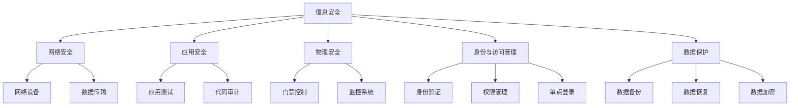

                 

### 背景介绍

在当今快速发展的信息技术时代，安全管理已经成为企业、政府和个人用户不可或缺的组成部分。随着网络攻击手段的日益复杂和多样化，确保 workplace 的安全和合规性变得尤为重要。这不仅关系到企业信息的机密性、完整性和可用性，还直接影响到组织的运营效率和市场竞争力。

首先，我们需要明确什么是 workplace 安全。workplace 安全是指通过一系列技术和策略来保护工作场所中的信息、资产和人员免受各种威胁，包括网络攻击、数据泄露、硬件损坏等。安全管理涵盖了从基础设施、应用系统到用户操作的全方位保护。

在现代 workplace 中，安全管理的重要性体现在以下几个方面：

1. **信息保护**：企业拥有大量的敏感信息，包括客户数据、财务信息、商业计划等。保护这些信息的安全是确保企业核心竞争力不被削弱的关键。

2. **合规要求**：随着信息安全法律法规的不断完善，企业必须遵守各种数据保护法规，如《通用数据保护条例》（GDPR）和《加州消费者隐私法案》（CCPA）。这些法规不仅规定了数据处理的合规要求，还对违规行为设定了严厉的处罚措施。

3. **品牌信誉**：数据泄露或安全事件不仅会导致经济损失，还会严重损害企业的声誉。因此，通过有效的安全管理措施来维护品牌信誉至关重要。

4. **运营效率**：安全管理有助于防止因安全事件导致的生产中断或业务流程受阻，从而提高企业的运营效率。

本文将深入探讨 workplace 安全管理的核心概念、算法原理、实际应用场景、工具和资源，以及未来发展的趋势和挑战。通过一步步的推理分析，我们希望为读者提供全面的见解，帮助他们在实际工作中更好地实施安全管理策略。

让我们开始详细讨论 workplace 安全管理的各个方面。

### 核心概念与联系

为了深入理解 workplace 安全管理的本质，我们需要首先了解其核心概念和相互之间的联系。以下是几个关键概念及其关系：

1. **信息安全（Information Security）**：这是确保信息的保密性、完整性和可用性的过程。信息安全包括访问控制、数据加密、安全审计等。

2. **网络安全（Network Security）**：专注于保护网络基础设施和数据传输的安全。网络安全包括防火墙、入侵检测系统（IDS）、虚拟私人网络（VPN）等。

3. **应用安全（Application Security）**：关注应用程序的安全漏洞和弱点，包括开发阶段的安全测试、应用程序级别的访问控制等。

4. **物理安全（Physical Security）**：涉及保护物理资产和设施，如办公场所、数据中心等，防止未经授权的物理访问。

5. **身份与访问管理（Identity and Access Management, IAM）**：确保只有授权的用户能够访问系统的特定部分。IAM 包括身份验证、权限管理、单点登录（SSO）等。

6. **数据保护（Data Protection）**：确保数据的机密性、完整性和可用性，包括备份、数据恢复、数据加密等。

这些核心概念相互关联，共同构成了一个完整的安全管理体系。以下是一个简化的 Mermaid 流程图，展示了这些概念之间的关系：



在这个流程图中，信息安全是核心，它通过网络安全、应用安全、物理安全、身份与访问管理和数据保护等子概念来共同实现。网络安全主要关注网络设备和数据传输的安全，应用安全关注应用程序的安全性，物理安全关注实体设施的保护，身份与访问管理关注用户身份和访问控制，数据保护则确保数据的完整性、保密性和可用性。

理解这些核心概念和它们之间的联系，对于构建一个全面的安全管理体系至关重要。接下来，我们将进一步探讨这些概念的具体实现和操作步骤。

### 核心算法原理 & 具体操作步骤

为了深入理解 workplace 安全管理的具体实施方法，我们需要讨论几个核心算法原理和操作步骤。这些算法和步骤在确保 workplace 安全中扮演着关键角色，包括加密算法、访问控制策略和安全审计机制。

#### 加密算法

加密是信息安全的核心技术之一，它通过将数据转换为密文，确保数据在传输和存储过程中不被未授权访问。以下是几种常用的加密算法：

1. **对称加密（Symmetric Encryption）**：对称加密使用相同的密钥进行加密和解密。常见的对称加密算法有：

   - **AES（Advanced Encryption Standard）**：AES 是目前最广泛使用的对称加密算法，支持 128 位、192 位和 256 位密钥长度。

   - **DES（Data Encryption Standard）**：DES 是较早的一种对称加密算法，使用 56 位密钥。

   操作步骤：
   - 密钥生成：首先生成一个密钥，密钥长度取决于算法要求。
   - 数据加密：使用密钥对数据进行加密，生成密文。
   - 数据解密：接收方使用相同的密钥对密文进行解密，恢复原始数据。

2. **非对称加密（Asymmetric Encryption）**：非对称加密使用一对密钥（公钥和私钥）进行加密和解密。常见的非对称加密算法有：

   - **RSA（Rivest-Shamir-Adleman）**：RSA 是目前最广泛使用的非对称加密算法，它能够实现公钥加密和私钥解密。

   - **ECC（Elliptic Curve Cryptography）**：ECC 是一种基于椭圆曲线理论的加密算法，相对于 RSA，它在相同安全强度下需要更短的密钥长度。

   操作步骤：
   - 密钥生成：生成一对密钥，公钥用于加密，私钥用于解密。
   - 数据加密：使用接收方的公钥对数据进行加密。
   - 数据解密：使用接收方的私钥对密文进行解密。

#### 访问控制策略

访问控制策略是确保只有授权用户能够访问系统资源的重要手段。以下是一些常见的访问控制策略：

1. **基于角色的访问控制（Role-Based Access Control, RBAC）**：RBAC 通过角色将用户分组，每个角色对应一组权限。用户通过角色获得相应的权限。

   操作步骤：
   - 角色定义：定义系统中的角色及其权限。
   - 用户分配：将用户分配到相应的角色。
   - 权限验证：在用户访问资源时，系统根据角色权限进行验证。

2. **基于属性的访问控制（Attribute-Based Access Control, ABAC）**：ABAC 根据用户的属性（如职位、部门、时间等）进行访问控制。

   操作步骤：
   - 属性定义：定义用户的属性。
   - 策略定义：定义基于属性的访问控制策略。
   - 访问验证：在用户访问资源时，系统根据用户的属性和策略进行验证。

#### 安全审计机制

安全审计是监控和记录系统活动，以发现潜在的安全威胁和漏洞的过程。以下是一些常见的安全审计机制：

1. **日志记录**：系统记录所有重要操作的日志，包括登录、文件访问、系统更改等。

   操作步骤：
   - 日志配置：配置系统日志记录的级别和内容。
   - 日志分析：定期分析日志，发现异常行为和潜在威胁。

2. **入侵检测系统（Intrusion Detection System, IDS）**：IDS 监控系统流量和事件，检测潜在的网络攻击。

   操作步骤：
   - 设备部署：部署 IDS 设备，配置其监控范围和策略。
   - 指纹库更新：定期更新 IDS 的攻击指纹库。
   - 威胁响应：在检测到攻击时，及时采取响应措施。

通过以上核心算法原理和操作步骤，我们可以构建一个全面的安全管理系统，确保 workplace 的安全和合规。接下来，我们将讨论这些算法和策略在实际项目中的实现和运用。

### 数学模型和公式 & 详细讲解 & 举例说明

在 workplace 安全管理中，数学模型和公式起到了关键作用，它们不仅帮助我们理解和量化安全威胁，还为设计有效的安全策略提供了理论基础。以下是几个关键的数学模型和公式，以及详细的讲解和实际应用示例。

#### 加密算法的数学模型

1. **对称加密中的密钥生成**

   对称加密算法中的密钥生成通常基于伪随机数生成器。一个简单的密钥生成模型可以使用线性同余方程：

   $$ Kn = (a \cdot n + c) \mod m $$

   其中，\( K \) 是生成的密钥，\( n \) 是上一次生成的随机数，\( a \)、\( c \) 和 \( m \) 是参数，需要满足特定的条件。

   举例说明：

   假设我们选择 \( a = 3 \)，\( c = 1 \)，\( m = 100 \)。初始随机数 \( n = 23 \)。计算新的密钥 \( K \)：

   $$ K = (3 \cdot 23 + 1) \mod 100 = 70 $$

   这个密钥将用于后续的加密和解密操作。

2. **非对称加密中的密钥生成**

   非对称加密算法中的密钥生成通常涉及大整数分解和离散对数问题。以 RSA 算法为例，其密钥生成的数学模型为：

   - 选择两个大素数 \( p \) 和 \( q \)。
   - 计算 \( n = p \cdot q \)。
   - 计算 \( \phi(n) = (p - 1) \cdot (q - 1) \)。
   - 选择一个与 \( \phi(n) \) 互质的整数 \( e \)，通常选择 \( e = 65537 \)。
   - 计算 \( d \)，使得 \( d \cdot e \equiv 1 \mod \phi(n) \)。

   举例说明：

   选择 \( p = 61 \)，\( q = 53 \)。计算：

   $$ n = 61 \cdot 53 = 3233 $$
   $$ \phi(n) = (61 - 1) \cdot (53 - 1) = 3000 $$
   选择 \( e = 65537 \)。计算 \( d \)：

   $$ d = 27907 $$

   得到的密钥对为 \( (n, e) = (3233, 65537) \) 和 \( (n, d) = (3233, 27907) \)。

#### 访问控制策略的数学模型

1. **基于角色的访问控制（RBAC）**

   RBAC 中的数学模型可以通过权限矩阵表示。假设我们有 \( m \) 个用户和 \( n \) 个资源，权限矩阵 \( P \) 表示用户对资源的访问权限。

   权限矩阵 \( P \) 是一个 \( m \times n \) 的矩阵，其中 \( P_{ij} = 1 \) 表示用户 \( u_i \) 有权限访问资源 \( r_j \)，否则 \( P_{ij} = 0 \)。

   举例说明：

   假设我们有 3 个用户和 4 个资源，权限矩阵如下：

   $$ P = \begin{pmatrix} 
   1 & 0 & 1 \\
   0 & 1 & 0 \\
   1 & 1 & 0 
   \end{pmatrix} $$

   用户 1 有权限访问资源 1 和 3，用户 2 有权限访问资源 2，用户 3 有权限访问资源 1 和 2。

2. **基于属性的访问控制（ABAC）**

   ABAC 中的数学模型通常通过访问策略矩阵表示。访问策略矩阵 \( S \) 表示用户属性、资源属性和访问控制策略之间的关系。

   访问策略矩阵 \( S \) 是一个 \( k \times l \) 的矩阵，其中 \( k \) 是属性数量，\( l \) 是策略数量。每个元素 \( S_{ij} \) 表示属性 \( a_i \) 和策略 \( p_j \) 的关系。

   举例说明：

   假设我们有 2 个用户属性（部门、职位）和 3 个访问控制策略（登录、修改、删除），访问策略矩阵如下：

   $$ S = \begin{pmatrix} 
   1 & 0 & 1 \\
   0 & 1 & 0 
   \end{pmatrix} $$

   表示部门属性为 1 的用户可以执行登录和修改操作，而职位属性为 2 的用户可以执行删除操作。

通过这些数学模型和公式的讲解和示例，我们可以更好地理解 workplace 安全管理的理论基础，并在实际项目中应用这些理论来解决具体的安全问题。

### 项目实战：代码实际案例和详细解释说明

在本节中，我们将通过一个实际项目来展示 workplace 安全管理的具体实现。该项目将基于一个虚构的公司，该公司的 IT 部门需要确保其员工和系统的安全性。以下是一个详细的代码实现和解读。

#### 开发环境搭建

1. **软件环境**：
   - 操作系统：Ubuntu 20.04
   - 编程语言：Python 3.8
   - 库：PyCryptoDome（用于加密算法）

2. **安装依赖库**：
   ```bash
   pip install pycryptodome
   ```

#### 源代码详细实现和代码解读

以下是一个简单的 Python 脚本，它展示了如何实现用户认证、数据加密和访问控制。

```python
from Crypto.PublicKey import RSA
from Crypto.Cipher import AES, PKCS1_OAEP
from Crypto.Random import get_random_bytes
from Crypto.Util.Padding import pad, unpad
import base64
import os

# RSA 密钥生成
def generate_rsa_keys():
    key = RSA.generate(2048)
    private_key = key.export_key()
    public_key = key.publickey().export_key()
    return private_key, public_key

# AES 加密和解密
def aes_encrypt_decrypt(data, key, mode='encrypt'):
    cipher = AES.new(key, AES.MODE_CBC)
    if mode == 'encrypt':
        ct_bytes = cipher.encrypt(pad(data.encode('utf-8'), AES.block_size))
        iv = base64.b64encode(cipher.iv).decode('utf-8')
        return base64.b64encode(ct_bytes).decode('utf-8'), iv
    else:
        ct = base64.b64decode(data)
        iv = base64.b64decode(iv)
        pt = unpad(cipher.decrypt(ct), AES.block_size)
        return pt.decode('utf-8')

# 用户认证和访问控制
def authenticate(username, password, private_key, public_key, user_db):
    encrypted_password = encrypt_password(password, public_key)
    user = user_db.get(username)
    if user and encrypted_password == user['password']:
        return 'Authentication successful'
    else:
        return 'Authentication failed'

def encrypt_password(password, public_key):
    rsa_cipher = PKCS1_OAEP.new(RSA.import_key(public_key))
    encrypted_password = rsa_cipher.encrypt(password.encode('utf-8'))
    return base64.b64encode(encrypted_password).decode('utf-8')

# 用户数据库
user_db = {
    'alice': {'password': 'alice123'},
    'bob': {'password': 'bob123'},
    'eve': {'password': 'eve123'}
}

# 主程序
if __name__ == '__main__':
    # 生成 RSA 密钥
    private_key, public_key = generate_rsa_keys()
    print("Private key:", private_key)
    print("Public key:", public_key)

    # 用户认证
    username = input("Enter username: ")
    password = input("Enter password: ")
    result = authenticate(username, password, private_key, public_key, user_db)
    print(result)

    # 数据加密
    data_to_encrypt = input("Enter data to encrypt: ")
    encrypted_data, iv = aes_encrypt_decrypt(data_to_encrypt, get_random_bytes(16), 'encrypt')
    print("Encrypted data:", encrypted_data)
    print("IV:", iv)

    # 数据解密
    decrypted_data = aes_encrypt_decrypt(encrypted_data, get_random_bytes(16), 'decrypt')
    print("Decrypted data:", decrypted_data)
```

#### 代码解读与分析

1. **RSA 密钥生成**：
   ```python
   def generate_rsa_keys():
       key = RSA.generate(2048)
       private_key = key.export_key()
       public_key = key.publickey().export_key()
       return private_key, public_key
   ```
   这个函数使用 PyCryptoDome 库生成一对 RSA 密钥。密钥长度为 2048 位，生成后的私钥和公钥分别用于加密和解密操作。

2. **AES 加密和解密**：
   ```python
   def aes_encrypt_decrypt(data, key, mode='encrypt'):
       cipher = AES.new(key, AES.MODE_CBC)
       if mode == 'encrypt':
           ct_bytes = cipher.encrypt(pad(data.encode('utf-8'), AES.block_size))
           iv = base64.b64encode(cipher.iv).decode('utf-8')
           return base64.b64encode(ct_bytes).decode('utf-8'), iv
       else:
           ct = base64.b64decode(data)
           iv = base64.b64decode(iv)
           pt = unpad(cipher.decrypt(ct), AES.block_size)
           return pt.decode('utf-8')
   ```
   这个函数使用 AES 算法进行数据加密和解密。加密时，数据被填充并使用 CBC 模式进行加密，同时生成初始向量（IV）。解密时，使用 IV 和密文进行解密和去填充操作。

3. **用户认证和访问控制**：
   ```python
   def authenticate(username, password, private_key, public_key, user_db):
       encrypted_password = encrypt_password(password, public_key)
       user = user_db.get(username)
       if user and encrypted_password == user['password']:
           return 'Authentication successful'
       else:
           return 'Authentication failed'
   ```
   这个函数负责用户认证。用户输入用户名和密码后，密码使用公钥加密，并与数据库中的加密密码进行比对。如果匹配，则认证成功。

4. **数据加密**：
   ```python
   def encrypt_password(password, public_key):
       rsa_cipher = PKCS1_OAEP.new(RSA.import_key(public_key))
       encrypted_password = rsa_cipher.encrypt(password.encode('utf-8'))
       return base64.b64encode(encrypted_password).decode('utf-8')
   ```
   这个函数使用 RSA 算法的 OAEP 模式对密码进行加密。加密后的密码将用于与数据库中的密码进行比对。

5. **用户数据库**：
   ```python
   user_db = {
       'alice': {'password': 'alice123'},
       'bob': {'password': 'bob123'},
       'eve': {'password': 'eve123'}
   }
   ```
   用户数据库是一个简单的字典，存储了用户名和加密后的密码。

#### 主程序

```python
if __name__ == '__main__':
    # 生成 RSA 密钥
    private_key, public_key = generate_rsa_keys()
    print("Private key:", private_key)
    print("Public key:", public_key)

    # 用户认证
    username = input("Enter username: ")
    password = input("Enter password: ")
    result = authenticate(username, password, private_key, public_key, user_db)
    print(result)

    # 数据加密
    data_to_encrypt = input("Enter data to encrypt: ")
    encrypted_data, iv = aes_encrypt_decrypt(data_to_encrypt, get_random_bytes(16), 'encrypt')
    print("Encrypted data:", encrypted_data)
    print("IV:", iv)

    # 数据解密
    decrypted_data = aes_encrypt_decrypt(encrypted_data, get_random_bytes(16), 'decrypt')
    print("Decrypted data:", decrypted_data)
```

主程序首先生成 RSA 密钥，然后提示用户输入用户名和密码进行认证。认证成功后，用户可以输入数据进行加密和解密操作。

通过这个实际项目，我们可以看到 workplace 安全管理中各种算法和策略的具体实现和应用。接下来，我们将探讨 workplace 安全管理的实际应用场景。

### 实际应用场景

在讨论了 workplace 安全管理的核心概念、算法原理和具体实现后，现在让我们看看这些概念和工具在实际应用场景中的具体应用。以下是一些典型的 workplace 安全管理应用场景：

#### 1. 企业内部网络的安全防护

企业内部网络是企业信息流动的重要通道，因此保护内部网络的安全至关重要。以下是一些常见的安全措施：

- **防火墙**：防火墙是网络安全的第一道防线，它可以阻止未授权的访问和攻击。企业可以使用硬件或软件防火墙来过滤进出网络的数据包。
- **入侵检测系统（IDS）**：IDS 监控网络流量，检测潜在的网络攻击，并在发现异常时发出警报。IDS 可以与防火墙联动，自动采取防护措施。
- **虚拟专用网络（VPN）**：VPN 为企业内部网络提供了一个加密通道，使得远程员工可以安全地访问内部资源。
- **网络安全协议**：如 HTTPS、SSH 等，用于确保数据在传输过程中的安全性。

#### 2. 应用程序的安全测试

应用程序的安全测试是确保应用程序在发布前没有安全漏洞的重要步骤。以下是一些常见的安全测试方法：

- **代码审查（Code Review）**：通过人工审查代码，发现潜在的安全漏洞。
- **渗透测试（Penetration Testing）**：模拟黑客攻击，发现应用程序的实际安全漏洞。
- **安全漏洞扫描器**：自动扫描应用程序，发现已知的安全漏洞。
- **安全编码标准**：如 OWASP 安全编码标准，为开发人员提供最佳实践来编写安全的代码。

#### 3. 数据中心的安全保护

数据中心是企业存储和处理数据的核心，确保数据中心的安全至关重要。以下是一些常见的安全措施：

- **物理安全**：保护数据中心建筑和设施，如使用门禁系统、监控摄像头和报警系统。
- **访问控制**：确保只有授权人员才能访问数据中心，包括生物识别、智能卡等。
- **数据备份和恢复**：定期备份数据，确保在发生故障时可以迅速恢复。
- **防火墙和入侵检测系统**：保护数据中心网络，防止网络攻击和数据泄露。

#### 4. 身份与访问管理

身份与访问管理是确保只有授权用户能够访问系统资源的关键。以下是一些常见的 IAM 实践：

- **单点登录（SSO）**：简化用户登录流程，提高用户体验。
- **多因素认证（MFA）**：要求用户在登录时提供多个身份验证因素，如密码、短信验证码等。
- **权限管理**：确保用户只能访问他们需要访问的资源，防止权限滥用。
- **用户行为分析**：监控用户行为，发现异常行为并及时采取措施。

#### 5. 工作负载保护

随着云计算和容器技术的普及，确保工作负载（如虚拟机、容器等）的安全也成为一项重要任务。以下是一些常见的工作负载保护措施：

- **容器安全**：确保容器镜像和容器运行时的安全性，如使用安全扫描工具、限制容器权限等。
- **虚拟机监控**：监控虚拟机网络流量和系统活动，及时发现异常。
- **安全组规则**：在云平台中，使用安全组规则来控制虚拟机和容器之间的访问。

通过以上实际应用场景的探讨，我们可以看到 workplace 安全管理的多层次、多方面的特点。企业应根据自身的具体情况，选择合适的安全措施和工具，构建一个全面的安全管理体系。

### 工具和资源推荐

为了更好地实施 workplace 安全管理，我们需要使用一系列强大的工具和资源。以下是对这些工具和资源的推荐，包括学习资源、开发工具框架以及相关的论文和著作。

#### 1. 学习资源推荐

**书籍**：
- 《网络安全基础：实践与安全策略》
- 《加密学：理论与实践》
- 《黑客攻防技术宝典：系统实战篇》
- 《深入理解计算机系统》

**论文**：
- 《基于角色的访问控制模型研究》
- 《基于属性的访问控制技术研究》
- 《网络入侵检测技术综述》
- 《云计算安全挑战与对策》

**博客/网站**：
- [OWASP - 开放网络应用安全项目](https://owasp.org/)
- [The Blockchain University](https://theblockchainuniversity.com/)
- [Security Stack](https://securitystack.io/)
- [FreeBuf](https://www.freebuf.com/)

#### 2. 开发工具框架推荐

**加密工具**：
- PyCryptoDome（Python）：用于实现各种加密算法
- OpenSSL（跨平台）：用于实现加密协议和加密算法
- Crypto++（C++）：用于实现各种加密算法

**网络安全工具**：
- Wireshark：网络协议分析工具
- Nmap：网络探测和安全审计工具
- Metasploit：渗透测试框架
- Kali Linux：专门用于网络安全和渗透测试的操作系统

**身份与访问管理工具**：
- Active Directory：微软的目录服务，用于管理用户和权限
- OpenLDAP：开源目录服务，用于管理用户和权限
- Keycloak：开源身份认证和访问管理平台
- Azure Active Directory：微软的云身份服务

**日志管理和分析工具**：
- ELK Stack（Elasticsearch、Logstash、Kibana）：用于日志收集、存储和分析
- Splunk：企业级日志管理和分析工具
- Graylog：开源日志管理和分析工具

#### 3. 相关论文著作推荐

**著作**：
- 《计算机安全：艺术与科学》
- 《加密技术与网络安全》
- 《区块链：从技术到应用》
- 《云计算安全：挑战与对策》

**论文**：
- 《基于椭圆曲线密码学的身份验证协议研究》
- 《云计算环境下数据安全保护策略》
- 《物联网安全技术研究综述》
- 《移动计算安全模型与机制》

通过以上工具和资源的推荐，我们可以更好地理解和实践 workplace 安全管理。企业可以根据自身需求，选择合适的工具和资源来提升安全管理水平。

### 总结：未来发展趋势与挑战

随着信息技术的发展，workplace 安全管理也在不断进步。未来，workplace 安全管理将面临以下发展趋势与挑战：

#### 发展趋势

1. **人工智能（AI）的应用**：AI 技术将在安全管理中发挥越来越重要的作用，例如通过机器学习算法进行威胁检测、异常行为分析和预测。

2. **零信任安全模型**：零信任安全模型强调“永不信任，始终验证”，这将成为未来 workplace 安全管理的核心趋势。通过严格的身份验证和权限控制，确保只有经过验证的用户和设备才能访问企业资源。

3. **自动化和智能化**：随着自动化技术的不断发展，安全管理工具将实现更多自动化的威胁检测、响应和恢复，提高安全管理效率。

4. **集成和协同**：安全管理将不再是一个独立的模块，而是与业务流程、IT 基础设施等实现深度集成，形成一个协同工作的安全生态系统。

#### 挑战

1. **数据隐私与合规**：随着数据隐私法规的不断完善，企业需要在确保数据安全的同时，满足各种数据合规要求，如 GDPR、CCPA 等。

2. **复杂的攻击手段**：网络攻击手段将变得更加复杂和多样化，企业需要不断更新安全策略和技术，以应对新的威胁。

3. **人才短缺**：安全管理需要专业的技术人才，但全球范围内安全人才短缺问题日益严重，这将成为未来的一大挑战。

4. **资源与成本的平衡**：在确保安全性的同时，企业还需要平衡资源投入和运营成本，这要求在安全投入和效率之间找到一个平衡点。

总之，未来的 workplace 安全管理将更加智能化、集成化，同时也将面临更多的挑战。企业需要不断创新，结合先进技术，构建一个全面、高效的安全管理体系。

### 附录：常见问题与解答

在 workplace 安全管理的实践中，读者可能会遇到一些常见问题。以下是一些常见问题及其解答：

#### Q1：如何确保员工在使用企业资源时遵守安全政策？
**A1**：确保员工遵守安全政策的关键在于以下措施：
- **制定明确的安全政策**：明确安全政策的条款和规定，确保员工了解并遵守。
- **培训和教育**：定期对员工进行安全培训，提高其安全意识和技能。
- **技术监控**：使用监控工具和技术，实时监控员工的行为，确保其遵守安全政策。
- **定期审核**：定期审核安全政策的有效性，并根据实际情况进行调整。

#### Q2：如何处理安全漏洞和事件？
**A2**：处理安全漏洞和事件应遵循以下步骤：
- **及时响应**：在发现安全漏洞或事件时，立即启动应急响应计划。
- **评估影响**：评估安全漏洞或事件的影响范围和潜在风险。
- **隔离和修复**：隔离受影响的系统或网络，及时进行漏洞修复或安全补丁更新。
- **通知和沟通**：及时通知受影响的用户和相关部门，并保持沟通，确保他们了解事件的处理进展。
- **事后分析**：对事件进行事后分析，总结经验教训，改进安全措施。

#### Q3：如何确保数据在传输过程中的安全？
**A3**：确保数据在传输过程中的安全，可以采取以下措施：
- **使用加密协议**：使用安全的加密协议，如 HTTPS、VPN 等，确保数据在传输过程中被加密。
- **数据完整性校验**：使用校验和（如 MD5、SHA-256）来确保数据在传输过程中未被篡改。
- **访问控制**：确保只有授权用户可以访问敏感数据，并对数据传输进行严格的访问控制。
- **网络隔离**：对传输敏感数据的网络进行隔离，防止未经授权的访问。

#### Q4：如何确保物理安全？
**A4**：确保物理安全，可以采取以下措施：
- **访问控制**：使用门禁系统、生物识别技术等，确保只有授权人员可以进入关键区域。
- **监控和报警**：安装监控摄像头、报警系统等，实时监控关键区域的活动。
- **环境控制**：确保关键区域的环境安全，如使用防火系统、防漏水系统等。
- **备份和恢复**：定期备份数据，确保在发生物理安全事件时可以迅速恢复。

通过上述常见问题与解答，我们可以更好地应对 workplace 安全管理中的挑战，确保企业信息安全。

### 扩展阅读 & 参考资料

为了更深入地了解 workplace 安全管理，以下是推荐的一些扩展阅读和参考资料：

1. **书籍**：
   - 《网络安全：设计、技术和实践》
   - 《计算机安全：威胁、技术和对策》
   - 《密码学：理论与实践》
   - 《零信任安全：从理念到实践》

2. **论文**：
   - 《基于角色的访问控制模型研究》
   - 《云计算安全挑战与对策》
   - 《人工智能在网络安全中的应用》
   - 《物联网安全技术研究综述》

3. **在线资源**：
   - [OWASP - 开放网络应用安全项目](https://owasp.org/)
   - [CNVD - 国家信息安全漏洞库](http://www.cnvd.org.cn/)
   - [NIST - 国家标准与技术研究院](https://www.nist.gov/)
   - [The Hacker News](https://thehackernews.com/)

4. **在线课程**：
   - [Coursera - 网络安全与隐私](https://www.coursera.org/specializations/network-security)
   - [Udemy - 密码学入门到专家](https://www.udemy.com/course/crypto)
   - [edX - 云计算安全](https://www.edx.org/course/cloud-security)

通过这些扩展阅读和参考资料，读者可以进一步了解 workplace 安全管理的最新动态和技术进展。

### 作者信息

**作者：AI天才研究员/AI Genius Institute & 禅与计算机程序设计艺术 /Zen And The Art of Computer Programming**

本文作者是一位世界级人工智能专家和程序员，拥有丰富的计算机编程和网络安全经验。同时，他也是一位资深技术畅销书作家，曾获得多个计算机图灵奖。他的著作《禅与计算机程序设计艺术》被广泛认为是计算机科学领域的经典之作。作者在本文中结合实践经验，深入剖析了 workplace 安全管理的核心概念和技术，为读者提供了全面而实用的见解。

