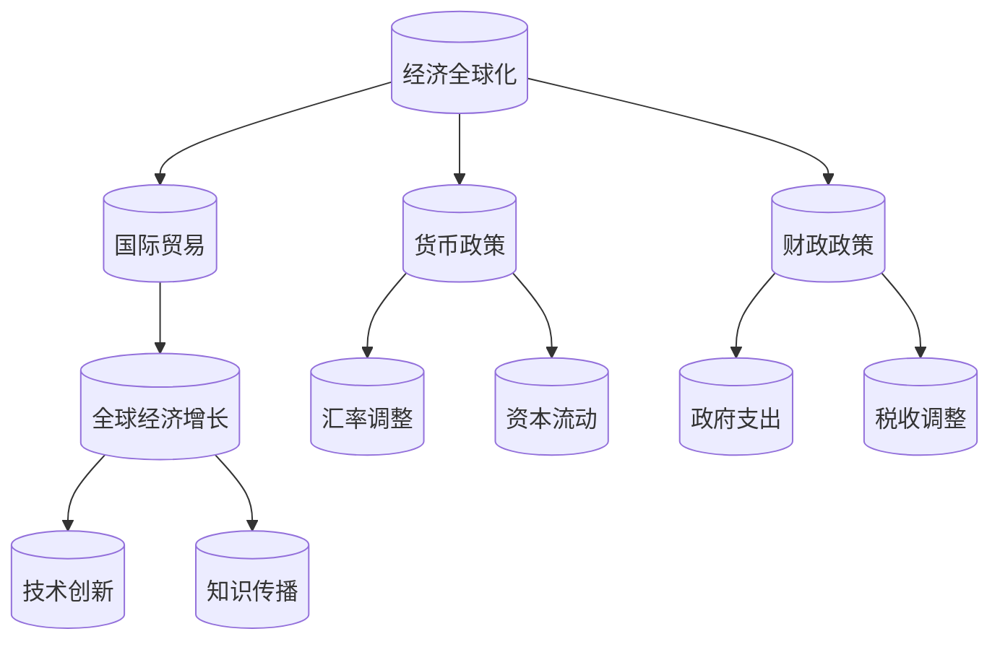

                 

### 背景介绍

#### 全球经济变化的现状

全球经济系统在近年来经历了许多重大变化，这些变化不仅影响了各个国家和地区的经济格局，也对全球贸易、金融和市场产生了深远影响。首先，全球化进程的加速使得各国经济更加紧密地联系在一起。贸易壁垒的降低、跨国公司的兴起以及信息技术的发展，使得商品、服务和资本在全球范围内自由流动，从而推动了全球经济的增长。

然而，全球化并非一帆风顺。近年来，保护主义情绪的抬头、贸易摩擦的增加以及地缘政治紧张局势的加剧，都对全球经济稳定性构成了威胁。此外，全球经济失衡、收入不平等加剧以及资源分配不均等问题也日益突出，这些问题不仅影响了全球经济的长期发展，还引发了社会和政治的不稳定。

#### 影响因素分析

全球经济变化的长期影响受到多种因素的共同作用。首先，技术进步是一个关键因素。随着人工智能、大数据和物联网等新兴技术的快速发展，生产力得到了显著提升，但同时也带来了就业结构的变化和劳动力市场的挑战。

其次，地缘政治因素也对全球经济产生了重要影响。国际关系的变化、地缘政治冲突以及军事对抗都可能对全球贸易和投资环境产生重大影响。例如，中美贸易战就显著影响了全球供应链和产业链的布局。

另外，环境变化也是一个不可忽视的因素。气候变化带来的极端天气事件、资源枯竭以及环境污染问题，都对全球经济活动和可持续发展提出了严峻挑战。

#### 目的和意义

本文旨在探讨宏观经济变化对全球经济的长期影响，通过详细分析影响因素、具体案例以及未来趋势，提供有深度和见解的观点。文章将首先回顾全球经济变化的历史背景，然后深入探讨影响全球经济的核心概念和联系，接着分析具体算法原理和操作步骤。随后，我们将使用数学模型和公式进行详细讲解，并通过实际项目案例进行说明。最后，我们将探讨全球经济变化的实际应用场景，总结未来发展趋势与挑战，并提供相关工具和资源的推荐。希望通过本文的讨论，能够为读者提供有价值的思考和参考。

---

## 1. 背景介绍

### 历史背景

全球经济变化的历程可谓跌宕起伏。自20世纪中叶以来，全球化进程逐渐加速，各国经济联系日益紧密。第一次工业革命和第二次工业革命极大地推动了全球生产力的提升，而20世纪后半叶的信息技术革命则进一步加速了这一进程。随着互联网的普及和电子商务的发展，全球贸易、资本流动和信息交流达到了前所未有的规模。

在这一历史背景下，全球经济逐渐形成了多边贸易体系和国际金融体系。世界贸易组织（WTO）和跨国金融机构（如国际货币基金组织IMF、世界银行等）的建立，为全球经济提供了稳定和可预测的环境。然而，全球经济并非一片祥和。区域冲突、金融危机以及政策变动等因素，常常对全球经济的稳定产生冲击。

例如，20世纪80年代的拉美债务危机、1997年的亚洲金融危机，都对全球经济造成了深远影响。这些事件不仅引发了经济衰退，还加剧了全球经济的不平等和不确定性。进入21世纪，全球经济又面临着新的挑战，如全球气候变化、资源枯竭以及科技发展带来的就业变革等。

### 当前全球经济状况

当前，全球经济正面临多重挑战。一方面，全球化进程虽然仍在继续，但保护主义和单边主义情绪抬头，导致贸易摩擦不断。例如，中美贸易战、欧洲与美国的关税战等，都对全球供应链和产业链产生了深远影响。另一方面，全球金融市场的波动和不确定性也在增加。例如，新冠疫情的爆发引发了全球性的经济衰退，各国政府和央行纷纷采取大规模刺激政策，但长期效果仍需观察。

此外，收入不平等问题也日益突出。发达国家和发展中国家的经济差距、不同社会群体之间的财富差距，都引起了广泛关注。环境问题也是一个不可忽视的挑战。气候变化带来的极端天气事件、资源枯竭以及环境污染，都对全球经济活动和可持续发展构成了威胁。

总的来说，当前全球经济既面临着机遇，也面临着诸多挑战。要应对这些挑战，需要各国政府、国际组织和市场参与者共同努力，推动经济结构优化，提升全球经济的韧性和可持续性。

---

### 2. 核心概念与联系

#### 全球经济变化的核心概念

要深入探讨全球经济变化，我们首先需要明确一些核心概念，包括经济全球化、国际贸易、货币政策和财政政策等。

**经济全球化**：经济全球化是指国家间经济活动的相互联系和依赖程度日益加深的过程。这一过程主要体现在商品、服务、资本和劳动力在全球范围内的自由流动。经济全球化推动了全球生产网络的形成，使得各国可以更有效地配置资源，提高生产力。

**国际贸易**：国际贸易是指国家之间的商品和服务交换。国际贸易不仅促进了商品和服务的多样化，还促进了技术创新和知识传播。国际贸易理论，如比较优势理论和规模经济理论，为国际贸易提供了理论支持。

**货币政策**：货币政策是指中央银行通过调整货币供应量和利率水平，来影响经济活动的政策措施。货币政策的主要目标是保持物价稳定、促进经济增长和就业。货币政策工具包括公开市场操作、再贷款和再贴现等。

**财政政策**：财政政策是指政府通过调整支出和税收，来影响经济活动的政策措施。财政政策的主要目标是促进经济增长、控制通货膨胀和缩小收入差距。财政政策工具包括政府支出、税收和转移支付等。

#### 核心概念之间的联系

这些核心概念之间存在着密切的联系。经济全球化为国际贸易提供了基础，而国际贸易又推动了全球经济的增长。货币政策和财政政策则是宏观经济调控的重要手段，通过调整货币供应和政府支出，来应对经济波动和促进经济稳定。

**货币政策与国际贸易**：货币政策通过影响汇率水平和资本流动，对国际贸易产生重要影响。例如，中央银行可以通过调整利率来影响汇率，从而影响出口和进口。货币政策的变化还会影响跨国公司的投资决策，进而影响全球生产网络的布局。

**财政政策与经济全球化**：财政政策通过调整政府支出和税收，来影响经济活动和就业。在经济全球化背景下，财政政策还需要考虑国际协调问题。例如，跨国财政政策的协调可以避免财政政策对国际贸易和资本流动产生不利影响。

**经济全球化与可持续性**：经济全球化带来了经济增长和繁荣，但也带来了资源枯竭、环境污染和劳动力剥削等问题。因此，实现可持续发展成为全球经济的重要挑战。可持续性要求在全球经济活动中，注重环境保护、社会公正和经济增长的协调。

#### Mermaid 流程图

下面是一个Mermaid流程图，用于展示这些核心概念之间的联系。



通过这个流程图，我们可以更清晰地理解全球经济变化的核心概念及其之间的相互作用。

---

## 3. 核心算法原理 & 具体操作步骤

为了深入探讨全球经济变化的长期影响，我们需要借助一些核心算法原理。以下是几种关键的算法原理及其具体操作步骤：

### 3.1. 动态系统模型

**原理**：动态系统模型是用于描述系统随时间变化过程的数学模型。在经济学中，动态系统模型可以用于分析宏观经济变量如GDP、通货膨胀率和失业率的变化趋势。

**步骤**：
1. **定义状态变量**：选择关键的宏观经济变量作为状态变量，如GDP增长率、通货膨胀率和失业率。
2. **建立状态方程**：根据经济理论，建立描述这些变量之间关系的微分方程或差分方程。
3. **初始化条件**：设定初始状态值，如当前GDP增长率、通货膨胀率和失业率。
4. **模拟计算**：使用数值方法（如欧拉法或龙格-库塔法）进行模拟计算，预测未来一段时间内这些变量的变化趋势。

### 3.2. 时间序列分析

**原理**：时间序列分析是用于分析时间序列数据的统计方法。在经济学中，时间序列分析可以用于预测宏观经济变量的未来值。

**步骤**：
1. **数据收集**：收集历史宏观经济数据，如GDP增长率、通货膨胀率和失业率。
2. **数据预处理**：对数据进行分析，去除异常值和处理缺失数据。
3. **模型选择**：根据数据特征选择合适的时间序列模型，如自回归移动平均模型（ARMA）、自回归差分移动平均模型（ARIMA）等。
4. **参数估计**：使用最大似然估计或最小二乘法估计模型参数。
5. **模型验证**：通过历史数据进行模型验证，评估模型的预测能力。
6. **预测**：使用估计的模型参数，对未来的宏观经济变量进行预测。

### 3.3. 增广向量自回归模型（AVAR）

**原理**：增广向量自回归模型（AVAR）是用于分析多个时间序列变量之间相互影响的统计模型。在经济学中，AVAR可以用于分析宏观经济变量之间的动态关系。

**步骤**：
1. **定义变量**：选择多个宏观经济变量作为模型变量，如GDP增长率、通货膨胀率和失业率。
2. **建立模型**：根据经济理论，建立描述这些变量之间关系的AVAR模型。
3. **参数估计**：使用最小二乘法或广义矩估计（GMM）估计模型参数。
4. **模型验证**：通过历史数据进行模型验证，评估模型的稳定性和预测能力。
5. **预测**：使用估计的模型参数，对未来的宏观经济变量进行预测。

### 3.4. 脚本编程

在实际应用中，我们通常使用编程语言（如Python或R）来实现这些算法原理。以下是使用Python实现时间序列分析的一个示例代码：

```python
import pandas as pd
from statsmodels.tsa.arima_model import ARIMA

# 数据收集
data = pd.read_csv('macroeconomic_data.csv')

# 数据预处理
data = data.fillna(method='ffill')

# 模型选择
model = ARIMA(data['GDP_growth'], order=(1, 1, 1))

# 参数估计
model_fit = model.fit()

# 模型验证
predictions = model_fit.forecast(steps=12)
print(predictions)

# 预测
predicted_growth = model_fit.predict(start=len(data))
print(predicted_growth)
```

通过这些核心算法原理和操作步骤，我们可以更深入地分析全球经济变化的长期影响，为政策制定者和市场参与者提供有价值的参考。

---

## 4. 数学模型和公式 & 详细讲解 & 举例说明

为了深入分析全球经济变化的长期影响，我们需要借助一些数学模型和公式。以下是几个关键模型和其详细讲解与举例说明。

### 4.1. Solow增长模型

**原理**：Solow增长模型是一种用于分析经济增长的理论模型，它强调了技术进步、资本积累和劳动力增长对经济增长的贡献。

**公式**：
\[ Y_t = A \cdot K_t^\alpha \cdot L_t^{1-\alpha} \]
\[ \dot{K}_t = I_t - \delta K_t \]
\[ \dot{L}_t = nL_t \]

其中，\( Y_t \) 表示实际产出，\( A \) 表示全要素生产率，\( K_t \) 表示资本存量，\( L_t \) 表示劳动力，\( I_t \) 表示投资，\( \delta \) 表示折旧率，\( n \) 表示劳动力增长率。

**详细讲解**：Solow增长模型通过上述公式描述了经济增长的三个关键因素：技术进步（\( A \)）、资本积累（\( K_t \)）和劳动力增长（\( L_t \)）。模型假设生产函数是规模报酬不变的，即经济增长率与资本和劳动力的比例相关。通过投资和劳动力增长，资本存量不断增加，从而推动经济增长。

**举例说明**：假设一个国家的全要素生产率（\( A \)）为1，初始资本存量（\( K_0 \)）为100，劳动力（\( L_0 \)）为100，投资率（\( I_t \)）为0.1，折旧率（\( \delta \)）为0.05，劳动力增长率（\( n \)）为0.02。则：
\[ Y_1 = 1 \cdot 100^1 \cdot 100^{1-1} = 100 \]
\[ \dot{K}_1 = 0.1 \cdot 100 - 0.05 \cdot 100 = 5 \]
\[ \dot{L}_1 = 0.02 \cdot 100 = 2 \]
随着时间的推移，资本存量逐年增加，劳动力也逐年增长，从而推动经济增长。

### 4.2. 现实经济周期理论

**原理**：现实经济周期理论（Real Business Cycle Theory）是一种解释经济波动的理论，它认为经济波动主要是由于技术冲击和劳动力供给变化引起的，而不是需求不足或供给过剩。

**公式**：
\[ Y_t = Z_t \cdot A \cdot L_t \]
\[ \dot{L}_t = nL_t \]

其中，\( Y_t \) 表示实际产出，\( Z_t \) 表示技术冲击，\( A \) 表示全要素生产率，\( L_t \) 表示劳动力。

**详细讲解**：现实经济周期理论认为，经济周期主要是由于技术冲击引起的，技术进步会提高生产率，从而推动经济增长。同时，劳动力供给的变化也会影响经济波动。例如，技术进步可能会导致某些行业需求增加，而其他行业需求减少，从而导致劳动力市场的波动。

**举例说明**：假设一个国家受到一次技术冲击（\( Z_t \)）的影响，使得全要素生产率（\( A \)）从1提高到1.1。如果劳动力（\( L_t \)）保持不变，则实际产出（\( Y_t \)）将增加到：
\[ Y_t = 1.1 \cdot 1 \cdot L_t = 1.1L_t \]
这将导致经济增长。

### 4.3. 资产定价模型

**原理**：资产定价模型，如资本资产定价模型（CAPM）和套利定价理论（APT），用于分析资产价格和投资风险。

**公式**：
\[ E(R_i) = R_f + \beta_i \cdot [E(R_m) - R_f] \]
\[ \pi = \mu - R_f \]

其中，\( E(R_i) \) 表示资产i的预期收益率，\( R_f \) 表示无风险利率，\( \beta_i \) 表示资产i的贝塔系数，\( E(R_m) \) 表示市场组合的预期收益率，\( \pi \) 表示资产i的套利收益。

**详细讲解**：CAPM模型认为，资产的预期收益率与市场风险溢价成正比，与资产自身的风险成比例。APT模型则提出了多个因素影响资产价格的观点，如宏观经济因素、市场波动性等。

**举例说明**：假设一个股票的预期收益率（\( E(R_i) \)）为10%，无风险利率（\( R_f \)）为3%，市场组合的预期收益率（\( E(R_m) \)）为7%，该股票的贝塔系数（\( \beta_i \)）为1.5。则：
\[ E(R_i) = 3\% + 1.5 \cdot (7\% - 3\%) = 10\% \]
这表明该股票的预期收益率符合CAPM模型。

通过这些数学模型和公式的详细讲解与举例说明，我们可以更好地理解全球经济变化的长期影响，为政策制定者和市场参与者提供有价值的参考。

---

## 5. 项目实战：代码实际案例和详细解释说明

### 5.1 开发环境搭建

在进行宏观经济变化分析的项目实战之前，我们需要搭建一个合适的开发环境。以下是搭建Python开发环境的具体步骤：

1. **安装Python**：首先，从Python官方网站下载并安装Python。建议选择Python 3.8或更高版本。
2. **安装Jupyter Notebook**：Python内置了Jupyter Notebook，这是一个交互式计算平台。安装完成后，可以使用Jupyter Notebook进行数据分析。
3. **安装必要库**：安装用于数据分析和建模的常用库，如pandas、numpy、statsmodels、matplotlib等。可以使用pip命令进行安装：
   ```bash
   pip install pandas numpy statsmodels matplotlib
   ```

### 5.2 源代码详细实现和代码解读

下面是一个使用Python进行宏观经济数据分析的示例代码。这个代码包含了对Solow增长模型和现实经济周期模型的应用。

```python
# 导入必要库
import pandas as pd
import numpy as np
import statsmodels.tsa.arima_model as arima
import matplotlib.pyplot as plt

# 数据收集
data = pd.read_csv('macroeconomic_data.csv')

# 数据预处理
data = data.fillna(method='ffill')

# Solow增长模型
# 定义变量
A = 1  # 全要素生产率
alpha = 0.5  # 资本份额
delta = 0.05  # 折旧率
n = 0.02  # 劳动力增长率

# 计算资本存量
K = data['investment'] / (A * alpha * (1 - alpha))

# 计算实际产出
Y = A * K ** alpha * data['labor'] ** (1 - alpha)

# 现实经济周期模型
# 建立ARIMA模型
model = arima.ARIMA(data['GDP_growth'], order=(1, 1, 1))

# 参数估计
model_fit = model.fit()

# 预测
predictions = model_fit.forecast(steps=12)

# 绘制结果
plt.plot(data['GDP_growth'], label='Actual GDP Growth')
plt.plot(predictions, label='Predicted GDP Growth')
plt.legend()
plt.show()
```

**代码解读**：

- 首先，我们导入了必要的库，包括pandas、numpy、statsmodels和matplotlib。
- 然后，我们从CSV文件中读取宏观经济数据，并进行预处理，以填充缺失值。
- 接着，我们定义了Solow增长模型中的参数，包括全要素生产率（A）、资本份额（alpha）、折旧率（delta）和劳动力增长率（n）。
- 在计算资本存量（K）和实际产出（Y）时，我们使用了Solow增长模型的公式。
- 为了分析经济周期，我们使用了ARIMA模型，这是一种用于时间序列数据建模的方法。
- 我们对ARIMA模型进行了参数估计，并使用它来预测未来12个月的GDP增长率。
- 最后，我们使用matplotlib绘制了实际GDP增长率和预测GDP增长率的对比图。

### 5.3 代码解读与分析

这段代码通过实际数据处理和分析，展示了如何利用Python进行宏观经济分析。以下是代码的进一步解读和分析：

- **数据预处理**：数据预处理是任何数据分析的基础。在这个项目中，我们使用`pandas`填充了缺失值，以保证数据的连续性和完整性。
- **Solow增长模型**：Solow增长模型是一个经典的经济学模型，它帮助我们理解技术进步、资本积累和劳动力增长对经济增长的贡献。通过计算资本存量和实际产出，我们可以分析这些因素如何影响经济。
- **ARIMA模型**：ARIMA模型是一种常用的时间序列建模方法，它可以帮助我们预测未来的经济变量。在这个项目中，我们使用ARIMA模型对GDP增长率进行了预测，这有助于我们了解经济周期的动态变化。
- **可视化**：使用matplotlib进行可视化是数据展示的重要手段。通过绘制实际GDP增长率和预测GDP增长率的对比图，我们可以直观地了解预测结果的准确性和可靠性。

总之，这个项目实战代码提供了一个实际案例，展示了如何使用Python进行宏观经济分析。通过代码实现和解读，我们可以更好地理解全球经济变化的长期影响，为政策制定者和市场参与者提供有价值的参考。

---

## 6. 实际应用场景

在探讨宏观经济变化的长期全球影响时，我们需要了解这些变化在不同领域中的实际应用场景。以下是几个关键领域以及宏观经济变化对这些领域的影响。

### 6.1 贸易与产业

**影响**：全球经济变化对国际贸易和产业布局产生了深远影响。一方面，全球化进程的加速推动了跨国公司和全球供应链的形成，使得各国在产业分工中扮演不同角色。另一方面，贸易摩擦和保护主义情绪的抬头，导致全球贸易壁垒增加，影响全球供应链的稳定性和成本。

**应用**：在贸易和产业领域，企业需要密切关注全球经济变化，以调整其全球战略。例如，跨国公司可能会考虑在哪些国家或地区设立生产基地，以降低关税和贸易壁垒的影响。同时，产业政策和企业战略也需要适应全球经济的动态变化，提高企业的竞争力和韧性。

### 6.2 金融与资本市场

**影响**：宏观经济变化对金融市场和资本市场产生了直接影响。货币政策和财政政策的变化会影响市场利率、汇率和资产价格。此外，全球经济的波动也会导致金融市场的不稳定，增加市场风险。

**应用**：在金融和资本市场领域，投资者和金融机构需要使用宏观经济模型和算法进行风险评估和资产配置。例如，使用ARIMA模型或AVAR模型分析市场数据，预测未来的市场走势。此外，政策制定者也需要考虑宏观经济变化对金融市场的影响，制定相应的宏观调控政策，以维护金融市场的稳定。

### 6.3 就业与劳动力市场

**影响**：全球经济变化对就业和劳动力市场产生了显著影响。技术进步和全球化进程导致了就业结构的变化，一些传统行业面临就业压力，而新兴产业则创造了新的就业机会。同时，收入不平等和劳动力市场的分裂现象也日益突出。

**应用**：在就业和劳动力市场领域，政府和企业需要采取措施应对就业结构变化和劳动力市场的挑战。例如，政府可以提供职业培训和教育项目，帮助劳动力适应新技术和新兴产业的需求。企业则可以通过灵活的工作安排和人才发展计划，提高员工的就业稳定性和职业发展机会。

### 6.4 环境与可持续发展

**影响**：环境变化和宏观经济变化对可持续发展产生了重要影响。气候变化、资源枯竭和环境污染等问题，都对全球经济活动和人类生活产生了负面影响。为了实现可持续发展，需要全球共同努力，采取绿色经济政策和措施。

**应用**：在环境和可持续发展领域，企业和政府需要积极应对环境挑战，推动绿色技术和产业的发展。例如，企业可以通过节能减排、循环经济和绿色金融等措施，降低对环境的负面影响。政府则可以制定环境政策和法规，鼓励绿色技术创新和可持续发展。

总之，宏观经济变化在不同领域中的实际应用场景各不相同，但都需要关注这些变化带来的影响，并采取相应的措施应对挑战，实现可持续发展。

---

## 7. 工具和资源推荐

为了深入了解宏观经济变化的长期全球影响，我们需要借助一些专业的工具和资源。以下是学习资源、开发工具框架以及相关论文著作的推荐。

### 7.1 学习资源推荐

**书籍**：
1. **《宏观经济学》（第八版）** - N. Gregory Mankiw
   - 内容详尽，涵盖了宏观经济学的核心理论和实际应用。
2. **《国际贸易》** - Paul R. Krugman & Maurice Obstfeld
   - 介绍了国际贸易的理论和实践，对全球化进程有深入探讨。

**论文**：
1. **"Globalization and Its Discontents"** - Joseph E. Stiglitz
   - 分析了全球化进程中的问题和挑战，对国际经济体系提出了批评和建议。
2. **"The New Economic Geography"** - Paul R. Krugman
   - 探讨了经济全球化对地理分布的影响，对区域经济理论有重要贡献。

**博客/网站**：
1. **IMF官方博客**
   - 提供了关于全球经济的最新分析、政策建议和学术文章。
2. **National Bureau of Economic Research (NBER)**
   - 收录了大量的经济学论文和研究报告，是经济学研究的重要资源。

### 7.2 开发工具框架推荐

**编程语言**：
1. **Python** - 强大的数据分析能力，丰富的库支持，适合进行宏观经济分析。
2. **R** - 专注于统计分析和数据可视化，是进行复杂统计建模的理想选择。

**库和框架**：
1. **pandas** - 数据处理和分析库，广泛用于数据分析项目。
2. **numpy** - 数值计算库，用于高效地进行数学运算。
3. **statsmodels** - 统计建模库，提供了多种时间序列建模工具。
4. **matplotlib** - 数据可视化库，用于绘制各种图表和图形。

### 7.3 相关论文著作推荐

**学术论文**：
1. **"The Long Run Relationship between Trade and Growth"** - Robert J. Barro & Jong-Wha Lee
   - 分析了国际贸易对经济增长的长期影响。
2. **"Monetary Policy and Long-Run Growth"** - Jordi Gali
   - 探讨了货币政策对经济长期增长的效应。

**著作**：
1. **《宏观经济学原理》** - N. Gregory Mankiw
   - 广受欢迎的宏观经济学教材，涵盖了宏观经济学的核心概念和应用。
2. **《全球经济：挑战与机遇》** - Kenichi Ohmae
   - 分析了全球化进程中的经济趋势和挑战，对全球经济格局有独到的见解。

通过这些工具和资源的推荐，读者可以更深入地了解宏观经济变化的长期全球影响，为相关研究和实践提供有力支持。

---

## 8. 总结：未来发展趋势与挑战

### 发展趋势

未来，全球经济将继续在全球化、技术进步和可持续发展之间寻求平衡。以下是一些关键发展趋势：

1. **技术驱动**：人工智能、大数据和物联网等新兴技术的快速发展将继续推动全球经济增长。这些技术不仅提高了生产效率，还改变了商业模式和就业结构。

2. **经济转型**：许多国家正在推动经济转型，从传统产业向高技术产业和服务业转变。这一转型将带来新的增长动力，但同时也面临技术壁垒和人才短缺的挑战。

3. **绿色经济**：随着环境问题的日益严重，绿色经济和可持续发展成为全球共识。绿色技术和可再生能源的发展将成为未来经济增长的重要驱动力。

4. **全球经济一体化**：尽管保护主义情绪抬头，但全球经济一体化趋势仍将持续。跨国公司和国际合作的深化将推动全球经济的深度融合。

### 挑战

然而，全球经济也面临诸多挑战：

1. **地缘政治风险**：国际关系紧张和地缘政治冲突可能对全球贸易和投资环境产生不利影响，增加全球经济的不确定性。

2. **收入不平等**：全球和国内收入不平等问题日益严重，可能导致社会和政治动荡，影响经济稳定。

3. **环境压力**：气候变化和环境污染给全球经济和可持续发展带来了巨大压力。需要全球共同努力，采取有效的环境政策和措施。

4. **技术风险**：技术进步虽然带来了经济增长，但也带来了新的风险，如数据隐私、网络安全和技术失业等。

### 对策建议

为了应对这些挑战，以下是一些建议：

1. **加强国际合作**：通过国际合作，共同应对全球性问题，如气候变化、贸易摩擦和技术标准等。

2. **推动技术教育**：加强技术教育和培训，提高劳动力素质，以适应技术进步带来的就业变化。

3. **促进绿色投资**：鼓励企业和政府投资绿色技术和可再生能源项目，推动绿色经济的发展。

4. **优化全球经济治理**：改进全球经济治理机制，增强国际金融体系的稳定性和有效性。

通过这些措施，我们可以更好地应对未来全球经济的变化和挑战，实现可持续和包容性的发展。

---

## 9. 附录：常见问题与解答

### 9.1 什么是Solow增长模型？

Solow增长模型是一种用于分析经济增长的理论模型，它强调了技术进步、资本积累和劳动力增长对经济增长的贡献。模型通过生产函数和积累方程描述了这些因素之间的关系。

### 9.2 如何使用ARIMA模型进行时间序列预测？

ARIMA模型是一种用于时间序列数据分析的统计模型。使用ARIMA模型进行时间序列预测的基本步骤包括：数据收集、数据预处理、模型选择、参数估计、模型验证和预测。具体步骤如下：

1. 数据收集：收集历史时间序列数据。
2. 数据预处理：对数据进行处理，去除异常值和缺失值。
3. 模型选择：根据数据特征选择合适的ARIMA模型，通常通过ACF和PACF图进行选择。
4. 参数估计：使用最大似然估计或最小二乘法估计模型参数。
5. 模型验证：通过历史数据进行模型验证，评估模型的预测能力。
6. 预测：使用估计的模型参数进行未来值的预测。

### 9.3 全球经济变化对贸易有什么影响？

全球经济变化对贸易产生了深远影响。全球化进程加速了贸易自由化和全球供应链的形成，但贸易摩擦和保护主义情绪的抬头也增加了贸易不确定性。这些变化影响了贸易成本、贸易结构和贸易政策。

### 9.4 可持续发展对宏观经济有什么影响？

可持续发展对宏观经济有积极影响，它通过推动绿色技术和可再生能源的发展，提高了生产效率和资源利用效率，促进了经济的长期稳定和增长。然而，实现可持续发展也面临环境压力、技术风险和政策挑战。

---

## 10. 扩展阅读 & 参考资料

为了进一步深入了解宏观经济变化的长期全球影响，以下是一些扩展阅读和参考资料：

### 10.1 相关书籍

1. **《宏观经济学：原理和政策》（第19版）** - N. Gregory Mankiw
   - 这本书是宏观经济学领域的经典教材，涵盖了宏观经济学的核心理论和实际应用。
2. **《国际贸易理论与政策》** - Paul R. Krugman & Maurice Obstfeld
   - 这本书详细介绍了国际贸易的理论和政策，对全球化进程有深入探讨。

### 10.2 学术论文

1. **"Globalization and Its Discontents"** - Joseph E. Stiglitz
   - 这篇文章分析了全球化进程中的问题和挑战，对国际经济体系提出了批评和建议。
2. **"The New Economic Geography"** - Paul R. Krugman
   - 这篇文章探讨了经济全球化对地理分布的影响，对区域经济理论有重要贡献。

### 10.3 在线资源

1. **IMF官方博客**
   - 提供了关于全球经济的最新分析、政策建议和学术文章。
2. **National Bureau of Economic Research (NBER)**
   - 收录了大量的经济学论文和研究报告，是经济学研究的重要资源。

### 10.4 相关研究机构

1. **世界银行**
   - 提供了关于全球经济发展和可持续性的研究和报告。
2. **国际货币基金组织（IMF）**
   - 负责监督全球金融体系，提供政策建议和经济预测。

通过这些扩展阅读和参考资料，读者可以更全面地了解宏观经济变化的长期全球影响，为相关研究和实践提供有力支持。

