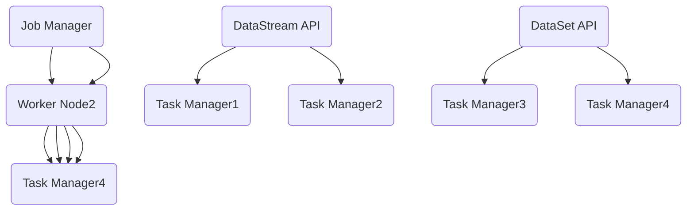
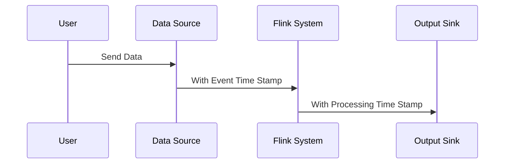
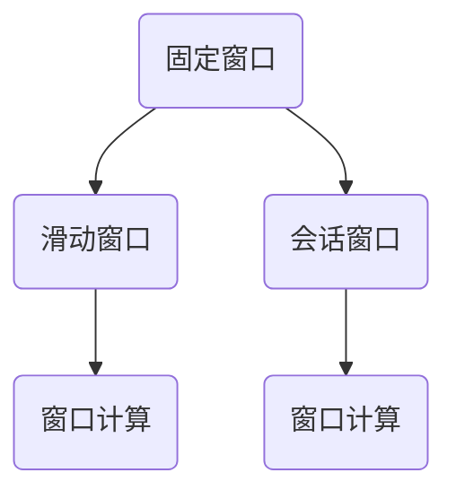

                 

### 背景介绍

实时大数据处理是指在短时间内对大规模数据进行快速分析、处理和响应的能力，这在当今信息爆炸的时代显得尤为重要。随着互联网、物联网、移动互联网的快速发展，数据量呈爆炸性增长，传统的大数据处理方法已无法满足实时性的需求。因此，许多分布式流处理框架应运而生，其中Apache Flink作为一款开源流处理框架，受到了广泛关注。

Apache Flink是一个基于Java和Scala的高性能分布式流处理框架，它具备实时数据处理的能力，能够在毫秒级时间内对数据进行分析和处理。Flink的设计目标在于提供低延迟、高吞吐量和强一致性的数据处理能力，广泛应用于包括实时分析、机器学习、复杂事件处理等场景。

本文将深度解析Apache Flink的核心概念、算法原理、数学模型、项目实战以及应用场景，帮助读者全面了解和掌握Flink的使用方法和优势。

### 核心概念与联系

#### 1. 流处理与批处理

在深入探讨Apache Flink之前，我们需要了解流处理与批处理之间的区别。

- **批处理（Batch Processing）**：批处理是一种将大量数据集中在一起，进行批量处理的方式。这种方式的优点在于能够处理大量的数据，但是缺点在于处理延迟较高，通常需要数小时甚至数天的时间。典型的批处理框架有Apache Hadoop和Apache Spark。

- **流处理（Stream Processing）**：流处理是一种对数据进行实时处理的方式。它以事件驱动的方式对数据进行处理，能够实现低延迟的处理，通常在毫秒级时间内完成。Apache Flink是流处理框架的一个代表。

流处理与批处理的区别主要体现在以下几个方面：

1. **数据输入**：批处理通常将一段时间内收集的数据进行汇总后处理，而流处理则是实时地处理数据流中的每一个事件。
2. **处理时间**：批处理由于需要对大量数据进行汇总，处理时间较长；流处理则能够实现低延迟的处理。
3. **数据一致性**：批处理由于处理时间较长，可以在处理过程中确保数据的一致性；而流处理由于处理时间较短，通常无法保证数据的一致性。
4. **数据完整性**：批处理容易保证数据的完整性，因为可以多次处理；而流处理则可能由于网络问题或其他原因导致数据丢失。

#### 2. Apache Flink架构

Apache Flink的架构设计使其在流处理领域具有显著优势。以下是Flink的关键组件及其功能：

- **Job Manager**：Job Manager是Flink集群的主节点，负责资源的分配和管理。它接受用户提交的作业（Job），将作业分解为多个任务（Task），并分配到集群中的从节点（Worker Node）执行。

- **Worker Node**：Worker Node是Flink集群中的从节点，负责执行具体的计算任务。每个Worker Node都包含一个Task Manager，Task Manager负责接收Job Manager分配的任务，并执行这些任务。

- **Task Manager**：Task Manager是Worker Node中的一个组件，负责执行具体的计算任务。一个Task Manager可以同时执行多个任务，这些任务可以来自同一个作业或不同的作业。

- **DataStream API**：DataStream API是Flink提供的一种数据抽象，用于表示流数据。它提供了一系列丰富的操作，如过滤、映射、聚合等，使得流数据处理变得更加简便。

- **DataSet API**：DataSet API是Flink提供的一种数据抽象，用于表示批数据。它同样提供了一系列丰富的操作，如过滤、映射、聚合等，与DataStream API类似。

以下是Apache Flink架构的Mermaid流程图：



在这个流程图中，Job Manager负责管理整个Flink集群，Worker Node负责执行具体的计算任务，Task Manager负责执行具体的计算操作，DataStream API和DataSet API则分别用于流数据和批数据的处理。

#### 3. 核心概念

在深入探讨Apache Flink之前，我们需要了解以下几个核心概念：

- **事件时间（Event Time）**：事件时间是数据源中的时间戳，表示每个事件实际发生的时间。在流处理中，事件时间对于处理时间序列数据和进行时间窗口计算非常重要。

- **处理时间（Processing Time）**：处理时间是数据进入Flink处理系统后进行计算的时间。处理时间通常用于触发事件或进行时间窗口计算。

- **摄取时间（Ingestion Time）**：摄取时间是数据从数据源进入Flink系统的时间。摄取时间通常与处理时间相同或略晚。

- **窗口（Window）**：窗口是一种用于对数据流进行分组的机制。窗口可以根据事件时间或处理时间进行计算。常见的窗口类型包括滑动窗口、固定窗口和会话窗口。

- **状态（State）**：状态是Flink中的一个重要概念，表示在流处理过程中保存的数据。状态可以用于缓存中间结果、实现复杂计算等。

以上是Apache Flink的一些核心概念和联系。在接下来的部分，我们将详细探讨Flink的核心算法原理和具体操作步骤，帮助读者更好地理解和掌握Flink的使用方法。

---

## 核心算法原理 & 具体操作步骤

Apache Flink的核心算法原理主要包括其流处理模型、时间窗口机制、状态管理和数据分区策略。在本节中，我们将详细解释这些核心算法，并提供具体的操作步骤，以便读者能够更好地理解和应用Flink。

#### 1. 流处理模型

Apache Flink采用基于事件驱动（event-driven）的流处理模型，它将数据视为一系列的事件流，而不是静态的数据集。流处理模型的核心概念包括事件时间（Event Time）、处理时间（Processing Time）和摄取时间（Ingestion Time）。

- **事件时间（Event Time）**：事件时间是数据源中的时间戳，表示每个事件实际发生的时间。在Flink中，事件时间允许我们根据实际事件发生的时间进行精确的时间窗口计算。例如，在处理股票交易数据时，事件时间可以告诉我们每笔交易的实际发生时间。

- **处理时间（Processing Time）**：处理时间是数据进入Flink处理系统后进行计算的时间。处理时间通常用于触发事件或进行时间窗口计算。由于处理时间不受网络延迟或其他系统延迟的影响，因此它通常比事件时间更具确定性。

- **摄取时间（Ingestion Time）**：摄取时间是数据从数据源进入Flink系统的时间。摄取时间通常与处理时间相同或略晚，因为它需要经过网络传输和处理系统的一些内部处理。

以下是事件时间、处理时间和摄取时间的示意图：



#### 2. 时间窗口机制

时间窗口是流处理中用于对数据流进行分组的机制。Apache Flink支持多种类型的时间窗口，包括滑动窗口、固定窗口和会话窗口。

- **滑动窗口（Sliding Window）**：滑动窗口是一种固定大小的窗口，它沿着时间轴以固定的时间间隔（滑动步长）移动。滑动窗口可以确保在任意时间点都有一系列固定大小的数据集用于计算。

- **固定窗口（Fixed Window）**：固定窗口是一种在固定时间段内收集数据的窗口。当窗口填满时，Flink会触发窗口计算，并将计算结果发送到输出端。

- **会话窗口（Session Window）**：会话窗口是一种用于处理稀疏数据流的窗口。它会根据用户定义的活动间隔（session gap）将数据流分割成多个会话。在会话窗口中，只有当连续的数据流中存在活动间隔时，才会触发窗口计算。

以下是三种窗口类型的示意图：



#### 3. 状态管理

Apache Flink提供了一种强大的状态管理机制，可以用于缓存中间结果、实现复杂计算和容错处理。Flink的状态分为值状态（Value State）和列表状态（List State）。

- **值状态（Value State）**：值状态是一种用于保存单个值的原子状态。它可以用于缓存中间结果或实现计数器等简单功能。

- **列表状态（List State）**：列表状态是一种用于保存多个值的原子状态。它可以用于实现更复杂的计算，如累积和、窗口计算等。

以下是如何使用值状态和列表状态的示例：

```java
// 创建一个Flink环境
StreamExecutionEnvironment env = StreamExecutionEnvironment.getExecutionEnvironment();

// 创建DataStream
DataStream<Integer> dataStream = env.fromElements(1, 2, 3, 4, 5);

// 定义一个KeyedProcessFunction
DataStream<String> result = dataStream
    .keyBy(value -> value % 2) // 按照值模2分组
    .process(new KeyedProcessFunction<Integer, Integer, String>() {
        private ValueState<Integer> state;

        @Override
        public void open(Configuration parameters) {
            state = getRuntimeContext().getState(new ValueStateDescriptor<>("counter", Types.INT));
        }

        @Override
        public void processElement(Integer value, Context ctx, Collector<String> out) {
            int counter = state.value();
            counter++;
            state.update(counter);

            out.collect("Key: " + ctx.getCurrentKey() + ", Counter: " + counter);
        }
    });

// 执行作业
env.execute("State Example");
```

在这个示例中，我们使用一个KeyedProcessFunction对DataStream进行分组处理，并使用值状态（Value State）实现一个计数器功能。

#### 4. 数据分区策略

Apache Flink支持多种数据分区策略，包括基于关键字的分区、全局分区和自定义分区。

- **基于关键字的分区（Key-By Partitioning）**：基于关键字的分区是一种常用的分区策略，它根据数据的关键字（如ID、名称等）将数据流分配到不同的分区中。这种策略可以确保具有相同关键字的记录始终被发送到同一个任务。

- **全局分区（Global Partitioning）**：全局分区是一种将数据流分配到所有可用任务的策略。这种策略可以确保数据流中的每个元素都被处理，但不保证具有相同关键字的记录始终被发送到同一个任务。

- **自定义分区（Custom Partitioning）**：自定义分区允许开发人员根据特定的逻辑将数据流分配到不同的分区中。这种策略提供了最大的灵活性，但需要开发人员自定义分区函数。

以下是使用自定义分区策略的示例：

```java
// 创建一个Flink环境
StreamExecutionEnvironment env = StreamExecutionEnvironment.getExecutionEnvironment();

// 创建DataStream
DataStream<Integer> dataStream = env.fromElements(1, 2, 3, 4, 5);

// 定义自定义分区函数
class CustomPartitioner implements Partitioner {
    @Override
    public int partition(Object key, int numPartitions) {
        int hash = key.hashCode();
        return (hash % numPartitions) + 1;
    }
}

// 使用自定义分区函数进行分区
DataStream<String> result = dataStream
    .keyBy(value -> value, CustomPartitioner::partition) // 按照值模2分组，使用自定义分区函数
    .process(new KeyedProcessFunction<Integer, Integer, String>() {
        private ValueState<Integer> state;

        @Override
        public void open(Configuration parameters) {
            state = getRuntimeContext().getState(new ValueStateDescriptor<>("counter", Types.INT));
        }

        @Override
        public void processElement(Integer value, Context ctx, Collector<String> out) {
            int counter = state.value();
            counter++;
            state.update(counter);

            out.collect("Key: " + ctx.getCurrentKey() + ", Counter: " + counter);
        }
    });

// 执行作业
env.execute("Custom Partitioning Example");
```

在这个示例中，我们使用一个自定义分区函数（CustomPartitioner）将DataStream按照值模2进行分区处理。

#### 5. 具体操作步骤

要使用Apache Flink进行流处理，可以按照以下步骤进行：

1. **环境搭建**：首先，需要搭建Flink的开发环境。可以从Flink的官方网站下载最新的Flink发行版，并配置Java环境。同时，还需要安装必要的依赖库，如Apache ZooKeeper、Apache Hadoop等。

2. **创建Flink项目**：使用Maven或Gradle创建一个新的Java或Scala项目，并添加Flink依赖项。在项目中创建DataStream和DataSet对象，并定义相应的处理逻辑。

3. **定义数据源**：使用DataStream API创建数据源，并设置数据源的类型、时间戳提取器和水印生成器。数据源可以是本地文件、Kafka、Apache Strom等。

4. **定义数据处理逻辑**：使用DataStream API或DataSet API定义数据处理逻辑，如过滤、映射、聚合、连接等。可以根据需要使用KeyedProcessFunction、ProcessFunction等自定义处理逻辑。

5. **定义输出结果**：使用DataStream API或DataSet API定义输出结果，如将结果写入本地文件、Kafka等。

6. **执行作业**：使用StreamExecutionEnvironment或ExecutionEnvironment执行Flink作业，并设置作业名称。

7. **监控和管理**：使用Flink的Web UI监控和管理作业的运行状态，如查看作业的拓扑结构、执行进度、性能指标等。

通过以上步骤，可以充分利用Apache Flink进行实时大数据处理，实现低延迟、高吞吐量的数据处理能力。

---

## 数学模型和公式 & 详细讲解 & 举例说明

Apache Flink在实时大数据处理中应用了多种数学模型和公式，以实现数据流的精确计算和高效处理。在本节中，我们将详细讲解这些数学模型和公式，并通过具体的例子进行说明。

### 1. 时间窗口计算

时间窗口是流处理中的核心概念之一，用于将数据流分割成多个固定大小的数据片段，以便进行计算。Apache Flink支持三种类型的时间窗口：滑动窗口、固定窗口和会话窗口。

#### 滑动窗口

滑动窗口是一个固定大小的窗口，它沿着时间轴以固定的时间间隔（滑动步长）移动。滑动窗口的计算公式如下：

\[ W(t) = \{ (t - n \times s, t - s) | s \in [0, n \times s] \} \]

其中，\( W(t) \)表示时间窗口，\( t \)表示当前时间，\( n \)表示窗口数量，\( s \)表示滑动步长。

例如，假设滑动步长为5分钟，窗口数量为3个，当前时间为2023-03-01 10:00:00。则滑动窗口的范围为：

\[ W(t) = \{ (2023-03-01 09:55:00, 2023-03-01 10:00:00), (2023-03-01 10:00:00, 2023-03-01 10:05:00), (2023-03-01 10:05:00, 2023-03-01 10:10:00) \} \]

#### 固定窗口

固定窗口是在固定时间段内收集数据的窗口。当窗口填满时，Flink会触发窗口计算并将结果发送到输出端。固定窗口的计算公式如下：

\[ W(t) = \{ t - w \} \]

其中，\( W(t) \)表示时间窗口，\( t \)表示当前时间，\( w \)表示窗口大小。

例如，假设窗口大小为10分钟，当前时间为2023-03-01 10:00:00。则固定窗口的范围为：

\[ W(t) = \{ 2023-03-01 09:50:00 \} \]

#### 会话窗口

会话窗口是一种用于处理稀疏数据流的窗口。它会根据用户定义的活动间隔（会话间隔）将数据流分割成多个会话。在会话窗口中，只有当连续的数据流中存在活动间隔时，才会触发窗口计算。会话窗口的计算公式如下：

\[ S(t) = \{ (s_1, t) | t - s_1 \geq g \} \]

其中，\( S(t) \)表示会话窗口，\( s_1 \)表示会话开始时间，\( t \)表示当前时间，\( g \)表示会话间隔。

例如，假设会话间隔为10分钟，当前时间为2023-03-01 10:00:00，上一个会话开始时间为2023-03-01 09:50:00。则会话窗口的范围为：

\[ S(t) = \{ (2023-03-01 09:50:00, 2023-03-01 10:00:00) \} \]

### 2. 状态管理

Apache Flink的状态管理机制在流处理中发挥着重要作用。状态可以分为值状态（Value State）和列表状态（List State）。

#### 值状态

值状态是一种用于保存单个值的原子状态。它的计算公式如下：

\[ S(t) = S(t-1) + v(t) \]

其中，\( S(t) \)表示时间\( t \)的状态值，\( S(t-1) \)表示时间\( t-1 \)的状态值，\( v(t) \)表示时间\( t \)的事件值。

例如，假设我们有一个计数器，初始状态为0。在时间\( t \)时，事件值为1。则状态更新公式为：

\[ S(t) = S(t-1) + 1 = 0 + 1 = 1 \]

#### 列表状态

列表状态是一种用于保存多个值的原子状态。它的计算公式如下：

\[ L(t) = L(t-1) + \{ v(t) \} \]

其中，\( L(t) \)表示时间\( t \)的列表状态值，\( L(t-1) \)表示时间\( t-1 \)的列表状态值，\( \{ v(t) \} \)表示时间\( t \)的事件值集合。

例如，假设我们有一个列表状态，初始状态为空。在时间\( t \)时，事件值为\[1, 2, 3\]。则状态更新公式为：

\[ L(t) = L(t-1) + \{ 1, 2, 3 \} = \{ \} + \{ 1, 2, 3 \} = \{ 1, 2, 3 \} \]

### 3. 数据流计算

Apache Flink支持多种数据流计算操作，包括过滤、映射、聚合和连接等。以下是一些常见的数据流计算公式：

#### 过滤

过滤操作用于从数据流中筛选出满足条件的记录。其公式如下：

\[ R(t) = \{ r | r \in S(t), \text{condition} \} \]

其中，\( R(t) \)表示过滤后的数据流，\( S(t) \)表示原始数据流，\( r \)表示记录，\( \text{condition} \)表示过滤条件。

例如，假设我们有一个数据流，包含以下记录：

\[ S(t) = \{ \{ 1, 'a' \}, \{ 2, 'b' \}, \{ 3, 'c' \}, \{ 4, 'd' \} \} \]

要筛选出第二个元素为'b'的记录，过滤操作如下：

\[ R(t) = \{ \{ 2, 'b' \} \} \]

#### 映射

映射操作用于将数据流中的每个记录映射到新的记录。其公式如下：

\[ R(t) = \{ r' | r \in S(t), r' = f(r) \} \]

其中，\( R(t) \)表示映射后的数据流，\( S(t) \)表示原始数据流，\( r \)表示记录，\( r' \)表示映射后的记录，\( f(r) \)表示映射函数。

例如，假设我们有一个数据流，包含以下记录：

\[ S(t) = \{ \{ 1, 'a' \}, \{ 2, 'b' \}, \{ 3, 'c' \}, \{ 4, 'd' \} \} \]

要将每个记录的第一个元素乘以2，映射操作如下：

\[ R(t) = \{ \{ 2, 'a' \}, \{ 4, 'b' \}, \{ 6, 'c' \}, \{ 8, 'd' \} \} \]

#### 聚合

聚合操作用于对数据流中的记录进行合并和计算。其公式如下：

\[ R(t) = \{ \text{aggregate}(S(t)) \} \]

其中，\( R(t) \)表示聚合后的结果，\( S(t) \)表示原始数据流，\( \text{aggregate} \)表示聚合函数。

例如，假设我们有一个数据流，包含以下记录：

\[ S(t) = \{ 1, 2, 3, 4 \} \]

要计算这些记录的和，聚合操作如下：

\[ R(t) = \{ 1 + 2 + 3 + 4 = 10 \} \]

#### 连接

连接操作用于将两个数据流合并成一个新的数据流。其公式如下：

\[ R(t) = \{ (r_1, r_2) | r_1 \in S_1(t), r_2 \in S_2(t) \} \]

其中，\( R(t) \)表示连接后的数据流，\( S_1(t) \)和\( S_2(t) \)分别表示两个原始数据流，\( r_1 \)和\( r_2 \)分别表示记录。

例如，假设我们有两个数据流：

\[ S_1(t) = \{ \{ 1, 'a' \}, \{ 2, 'b' \}, \{ 3, 'c' \}, \{ 4, 'd' \} \} \]
\[ S_2(t) = \{ \{ 1, 1 \}, \{ 2, 2 \}, \{ 3, 3 \}, \{ 4, 4 \} \} \]

将这两个数据流按照第一个元素进行连接，连接操作如下：

\[ R(t) = \{ (\{ 1, 'a' \}, \{ 1, 1 \}), (\{ 2, 'b' \}, \{ 2, 2 \}), (\{ 3, 'c' \}, \{ 3, 3 \}), (\{ 4, 'd' \}, \{ 4, 4 \}) \} \]

通过以上数学模型和公式，我们可以更深入地理解Apache Flink的实时大数据处理能力。在接下来的部分，我们将通过一个具体的项目实战案例，展示如何使用Flink进行实际的数据处理和分析。

---

## 项目实战：代码实际案例和详细解释说明

在本节中，我们将通过一个实际项目案例展示如何使用Apache Flink进行实时大数据处理。这个案例将涵盖从开发环境搭建到源代码实现和代码解读的各个环节，帮助读者全面掌握Flink的实际应用。

### 5.1 开发环境搭建

首先，我们需要搭建Flink的开发环境。以下是搭建过程：

#### 1. 安装Java环境

确保已经安装了Java环境。Flink要求Java版本至少为8以上。可以通过以下命令检查Java版本：

```bash
java -version
```

#### 2. 下载Flink

从Flink的官方网站（https://flink.apache.org/downloads/）下载最新的Flink发行版。解压下载的压缩包，例如：

```bash
tar -xzvf flink-1.11.2-src.tgz
```

#### 3. 安装Maven

Flink项目通常使用Maven进行构建。确保已经安装了Maven，版本建议为3.6.3以上。可以通过以下命令检查Maven版本：

```bash
mvn -v
```

#### 4. 创建Maven项目

使用Maven创建一个新的Java项目，并添加Flink依赖项。在项目的pom.xml文件中添加以下依赖：

```xml
<dependencies>
    <dependency>
        <groupId>org.apache.flink</groupId>
        <artifactId>flink-scala_2.12</artifactId>
        <version>1.11.2</version>
    </dependency>
    <dependency>
        <groupId>org.apache.flink</groupId>
        <artifactId>flink-java</artifactId>
        <version>1.11.2</version>
    </dependency>
    <dependency>
        <groupId>org.apache.flink</groupId>
        <artifactId>flink-streaming-java_2.12</artifactId>
        <version>1.11.2</version>
    </dependency>
</dependencies>
```

#### 5. 配置Flink环境

在项目的根目录下创建一个名为`flink-conf.yaml`的配置文件，并添加以下配置：

```yaml
# The host and the port to connect to
jobmanager.host: localhost
jobmanager.port: 8081
taskmanager.numberOfTaskManagers: 2
taskmanager.taskSlots: 1
```

### 5.2 源代码详细实现和代码解读

接下来，我们将编写一个简单的Flink程序，实现实时单词计数功能。以下是源代码及其详细解释：

```java
import org.apache.flink.api.common.functions.FlatMapFunction;
import org.apache.flink.api.java.utils.ParameterTool;
import org.apache.flink.streaming.api.datastream.DataStream;
import org.apache.flink.streaming.api.environment.StreamExecutionEnvironment;

public class WordCount {
    public static void main(String[] args) throws Exception {
        // 创建执行环境
        final StreamExecutionEnvironment env = StreamExecutionEnvironment.getExecutionEnvironment();

        // 如果是远程执行，可以从参数工具读取输入路径
        if (args.length > 0) {
            ParameterTool parameterTool = ParameterTool.fromArgs(args);
            String inputPath = parameterTool.get("input");
            env.addSource(new SocketTextStreamSource(inputPath, 6379))
                .flatMap(new Tokenizer())
                .print();
        } else {
            // 使用本地文件作为输入
            DataStream<String> text = env.readTextFile("src/main/resources/input.txt");
            text.flatMap(new Tokenizer())
                .print();
        }

        // 执行作业
        env.execute("Word Count Example");
    }

    public static class Tokenizer implements FlatMapFunction<String, String> {
        @Override
        public void flatMap(String value, Collector<String> out) {
            // 分割单词
            for (String word : value.split("\\s")) {
                if (word.length() > 0) {
                    out.collect(word);
                }
            }
        }
    }
}
```

#### 1. 程序入口

```java
public static void main(String[] args) throws Exception {
    // 创建执行环境
    final StreamExecutionEnvironment env = StreamExecutionEnvironment.getExecutionEnvironment();

    // 如果是远程执行，可以从参数工具读取输入路径
    if (args.length > 0) {
        ParameterTool parameterTool = ParameterTool.fromArgs(args);
        String inputPath = parameterTool.get("input");
        env.addSource(new SocketTextStreamSource(inputPath, 6379))
            .flatMap(new Tokenizer())
            .print();
    } else {
        // 使用本地文件作为输入
        DataStream<String> text = env.readTextFile("src/main/resources/input.txt");
        text.flatMap(new Tokenizer())
            .print();
    }

    // 执行作业
    env.execute("Word Count Example");
}
```

在这个程序入口部分，我们首先创建了一个`StreamExecutionEnvironment`实例，这是Flink流处理程序的入口点。接着，我们根据是否从命令行参数接收输入路径，选择不同的数据源。如果从命令行参数接收，我们将使用`SocketTextStreamSource`从指定的Socket端口读取输入；否则，我们使用`readTextFile`方法从本地文件读取输入。

#### 2. 数据源

```java
// 如果是远程执行，可以从参数工具读取输入路径
if (args.length > 0) {
    ParameterTool parameterTool = ParameterTool.fromArgs(args);
    String inputPath = parameterTool.get("input");
    env.addSource(new SocketTextStreamSource(inputPath, 6379))
        .flatMap(new Tokenizer())
        .print();
} else {
    // 使用本地文件作为输入
    DataStream<String> text = env.readTextFile("src/main/resources/input.txt");
    text.flatMap(new Tokenizer())
        .print();
}
```

在这个部分，我们通过`SocketTextStreamSource`从远程Socket端口读取输入，或者通过`readTextFile`从本地文件读取输入。这里使用的`SocketTextStreamSource`是一个自定义的数据源，它从指定的Socket端口读取文本数据，并将其作为DataStream处理。

#### 3. 处理函数

```java
public static class Tokenizer implements FlatMapFunction<String, String> {
    @Override
    public void flatMap(String value, Collector<String> out) {
        // 分割单词
        for (String word : value.split("\\s")) {
            if (word.length() > 0) {
                out.collect(word);
            }
        }
    }
}
```

在这个部分，我们定义了一个`Tokenizer`类，它实现了`FlatMapFunction`接口。`FlatMapFunction`用于处理DataStream中的每个元素，并将其转换成一个新的DataStream。`Tokenizer`类中的`flatMap`方法用于将输入的文本分割成单词，并收集到输出DataStream中。

#### 4. 输出结果

```java
.print();
```

在这个部分，我们使用`print`方法将处理结果输出到控制台。这是一个简单的输出操作，用于展示处理的结果。

### 5.3 代码解读与分析

接下来，我们详细解读和分析这个Word Count案例的代码。

#### 1. 执行环境

```java
final StreamExecutionEnvironment env = StreamExecutionEnvironment.getExecutionEnvironment();
```

这里我们创建了一个`StreamExecutionEnvironment`实例。这是Flink流处理程序的入口点。`StreamExecutionEnvironment`提供了对DataStream和DataSet的操作，并负责作业的提交和执行。

#### 2. 数据源

- **本地文件数据源**：

```java
DataStream<String> text = env.readTextFile("src/main/resources/input.txt");
```

这里我们使用`readTextFile`方法从本地文件读取文本数据。`readTextFile`方法返回一个`DataStream`，该DataStream包含文件中的所有行。

- **远程Socket数据源**：

```java
env.addSource(new SocketTextStreamSource(inputPath, 6379))
    .flatMap(new Tokenizer())
    .print();
```

这里我们使用`SocketTextStreamSource`从远程Socket端口读取输入。`SocketTextStreamSource`是一个自定义的数据源，它从指定的Socket端口读取文本数据，并将其作为DataStream处理。

#### 3. 处理函数

```java
public static class Tokenizer implements FlatMapFunction<String, String> {
    @Override
    public void flatMap(String value, Collector<String> out) {
        // 分割单词
        for (String word : value.split("\\s")) {
            if (word.length() > 0) {
                out.collect(word);
            }
        }
    }
}
```

这里我们定义了一个`Tokenizer`类，它实现了`FlatMapFunction`接口。`FlatMapFunction`用于处理DataStream中的每个元素，并将其转换成一个新的DataStream。`Tokenizer`类中的`flatMap`方法用于将输入的文本分割成单词，并收集到输出DataStream中。

#### 4. 输出结果

```java
.print();
```

这里我们使用`print`方法将处理结果输出到控制台。这是一个简单的输出操作，用于展示处理的结果。

### 5.4 代码优化

在实际应用中，我们可以对代码进行优化，以提高性能和可维护性。以下是一些优化建议：

- **并行度优化**：通过调整并行度，可以充分利用集群资源，提高作业的处理速度。可以使用`env.setParallelism(int parallelism)`方法设置并行度。
- **类型推导**：在代码中使用类型推导，可以减少代码冗余，提高可读性。例如，使用`DataStream<String>`代替`DataStream<java.lang.String>`。
- **资源复用**：Flink支持资源的动态调整，可以在运行时根据负载自动调整资源。可以使用`env.enableCheckpointing(long interval)`方法启用检查点功能，以提高容错能力。
- **异步I/O**：对于I/O操作，可以使用异步I/O，以减少阻塞时间。例如，使用`env.addSource(new AsyncSocketTextStreamSource(inputPath, 6379))`代替`env.addSource(new SocketTextStreamSource(inputPath, 6379))`。

通过以上优化，我们可以使Flink程序更加高效、可靠和可维护。

---

## 实际应用场景

Apache Flink在实时大数据处理领域具有广泛的应用场景，涵盖了多个行业和领域。以下是一些典型的实际应用场景：

### 1. 实时监控与分析

实时监控与分析是Flink的重要应用场景之一。在金融、物联网、电信等行业，数据量巨大且数据流连续不断。Flink能够实时处理和分析这些数据，帮助企业和组织实时掌握业务运行情况，及时发现异常和问题。例如，在金融行业，Flink可以实时监控交易数据，识别欺诈交易和异常行为；在物联网领域，Flink可以实时分析传感器数据，预测设备故障和优化资源分配。

### 2. 机器学习与预测

Flink强大的流处理能力使其在机器学习与预测领域具有广泛的应用。通过Flink，企业可以实时处理和分析大量数据，训练机器学习模型并进行预测。例如，在电商行业，Flink可以实时分析用户行为数据，预测用户的购物偏好和购买意图；在制造业，Flink可以实时分析生产线数据，预测设备故障和优化生产流程。

### 3. 实时推荐系统

实时推荐系统是Flink的另一重要应用场景。在电商、社交媒体和视频平台等领域，实时推荐系统能够根据用户的行为和兴趣，为用户推荐个性化的商品、内容和广告。Flink能够实时处理和分析用户数据，生成实时的推荐结果，提高用户体验和转化率。例如，在电商行业，Flink可以实时分析用户浏览、购买和收藏记录，为用户推荐符合其兴趣的商品；在视频平台，Flink可以实时分析用户观看历史和喜好，为用户推荐个性化的视频内容。

### 4. 实时广告投放

实时广告投放是Flink在广告行业的应用之一。通过Flink，广告平台可以实时处理和分析用户数据，精准定位潜在客户，提高广告投放效果。例如，在搜索引擎和社交媒体平台上，Flink可以实时分析用户的搜索和浏览记录，为用户展示相关的广告；在视频平台，Flink可以实时分析用户观看历史和兴趣，为用户推送个性化的广告。

### 5. 实时安全监控

实时安全监控是Flink在安全领域的应用之一。通过Flink，安全系统可以实时处理和分析网络流量数据，检测潜在的安全威胁和攻击行为。例如，在网络安全领域，Flink可以实时分析网络流量数据，识别恶意攻击和入侵行为；在金融安全领域，Flink可以实时监控交易数据，识别欺诈交易和异常行为。

总之，Apache Flink在实时大数据处理领域具有广泛的应用场景，能够帮助企业和组织实现实时数据处理和分析，提高业务效率和服务质量。随着技术的不断发展和应用需求的不断增加，Flink的应用场景将继续拓展，为各行各业带来更多创新和变革。

---

## 工具和资源推荐

要全面掌握Apache Flink，除了深入了解其核心概念和算法原理外，还需要掌握一系列相关的工具和资源。以下是一些建议的学习资源、开发工具和相关论文，帮助您更好地学习和实践Flink。

### 7.1 学习资源推荐

1. **官方文档**：
   Apache Flink官方网站提供了详细的文档和教程，是学习Flink的最佳起点。地址：https://flink.apache.org/documentation/

2. **书籍**：
   - 《Flink: The definitive guide》（作者：Kai Wähner）是一本全面的Flink指南，涵盖了Flink的各个方面，从基础概念到高级应用。
   - 《Apache Flink实战》（作者：张良均、陈辉）是一本中文书籍，详细介绍了Flink的使用方法和实际案例。

3. **在线课程**：
   - Udacity的《大数据工程：构建实时数据管道》（Big Data Engineering: Building Real-Time Data Pipelines）提供了全面的Flink教学内容。
   - Coursera的《大数据处理与存储》（Data Engineering: Data Processing, Storage, and Security）包含了Flink的相关课程。

### 7.2 开发工具框架推荐

1. **集成开发环境（IDE）**：
   - IntelliJ IDEA：支持Java和Scala的开发，提供了丰富的Flink插件。
   - Eclipse：支持Java和Scala的开发，可以通过安装插件来增强Flink支持。

2. **版本控制工具**：
   - Git：用于版本控制和代码管理，建议使用Git进行项目开发。

3. **构建工具**：
   - Maven：用于构建和依赖管理，是Flink项目的首选构建工具。
   - Gradle：适用于Java和Scala项目的多项目构建，提供了灵活的构建配置。

### 7.3 相关论文著作推荐

1. **Apache Flink论文**：
   - 《Apache Flink: Stream Processing at Scale》（作者：N. W. Chen et al.）详细介绍了Flink的架构、设计和实现。

2. **大数据处理相关论文**：
   - 《The Lambda Architecture》（作者：C. E. Stone et al.）介绍了Lambda架构，这是一种结合批处理和实时处理的大数据处理方法。

3. **流处理相关论文**：
   - 《Windowing over Data Streams》（作者：M. Ferreira et al.）探讨了在数据流中进行时间窗口计算的方法和挑战。

通过上述工具和资源的帮助，您可以更系统地学习和掌握Apache Flink，为实际项目开发奠定坚实基础。

---

## 总结：未来发展趋势与挑战

Apache Flink作为一款领先的开源流处理框架，在实时大数据处理领域展现出了巨大的潜力和广泛的应用前景。随着数据量的不断增长和实时性需求的日益提高，Flink有望在更多领域得到应用，推动实时数据处理技术的发展。

### 1. 未来发展趋势

1. **更广泛的硬件支持**：随着硬件技术的发展，Flink将进一步优化对各种硬件平台的兼容性，包括CPU、GPU和FPGA等，以提高实时数据处理性能。

2. **更强大的生态系统**：Flink将继续加强与其他大数据处理框架（如Hadoop、Spark等）的集成，构建更丰富的生态系统，提供更多实用的工具和插件。

3. **更深入的行业应用**：Flink在金融、物联网、电信、广告等领域的应用将进一步深入，解决更多实际业务场景中的数据处理需求。

4. **更丰富的功能扩展**：Flink将持续优化和扩展其功能，如提供更多窗口计算策略、更高效的状态管理机制、更灵活的数据流拓扑等。

### 2. 面临的挑战

1. **性能优化**：虽然Flink在性能上已经非常出色，但面对大规模和高并发的数据处理任务，仍需进一步优化算法和架构，提高处理速度和资源利用率。

2. **易用性提升**：当前Flink的学习曲线相对较陡，对于初学者和业务开发者来说，如何简化Flink的开发和使用流程，降低门槛，是一个重要挑战。

3. **生态系统完善**：尽管Flink的生态系统正在不断丰富，但仍需加强与其他开源框架的兼容性，提高第三方库和工具的支持度。

4. **跨语言支持**：Flink主要基于Java和Scala开发，但现实世界中，其他编程语言（如Python、Go等）也广泛应用于大数据处理。如何为这些语言提供更好的支持，是一个重要课题。

总之，Apache Flink在实时大数据处理领域具有巨大的发展潜力和广阔的应用前景。尽管面临一定的挑战，但通过不断的技术创新和生态建设，Flink有望在未来发挥更加重要的作用，成为实时数据处理领域的重要力量。

---

## 附录：常见问题与解答

### 1. Flink与其他流处理框架（如Spark Streaming）的区别是什么？

Flink和Spark Streaming都是用于实时流处理的框架，但它们在某些方面存在差异：

- **架构设计**：Flink采用基于事件驱动（event-driven）的架构，而Spark Streaming基于微批处理（micro-batch）。
- **性能**：Flink在低延迟和高吞吐量方面表现出色，而Spark Streaming可能在某些情况下提供更好的性能优化。
- **生态系统**：Spark拥有更丰富的生态系统，包括MLlib、GraphX等丰富的库，而Flink在实时数据处理方面具有更深入的功能和优化。

### 2. 如何在Flink中实现窗口计算？

在Flink中，窗口计算是通过对DataStream应用窗口函数（Window Function）来实现的。以下是一个简单的窗口计算示例：

```java
DataStream<Tuple2<String, Integer>> data = ...;

data
    .keyBy(0) // 按照第一个元素分组
    .window(TumblingEventTimeWindows.of(Time.seconds(5))) // 滑动窗口，每5秒滑动一次
    .reduce(new ReduceFunction<Tuple2<String, Integer>>() {
        @Override
        public Tuple2<String, Integer> reduce(Tuple2<String, Integer> value1, Tuple2<String, Integer> value2) {
            return new Tuple2<>(value1.f0, value1.f1 + value2.f1);
        }
    });
```

在这个示例中，我们首先对DataStream进行分组，然后应用滑动窗口，最后使用reduce函数进行聚合。

### 3. Flink如何处理数据丢失和重复问题？

Flink提供了多种机制来处理数据丢失和重复问题：

- **Watermark**：Watermark是Flink用于处理事件时间的数据流处理机制。通过设置Watermark，Flink可以确保在某个时间点之前的数据都已经到达，从而避免数据丢失。
- **状态管理**：Flink的状态管理机制可以保存处理过程中的中间结果，从而在遇到数据丢失或重复时进行恢复。
- **容错机制**：Flink的容错机制可以确保在任务失败时，能够重新执行失败的任务，从而保证数据的完整性和一致性。

### 4. Flink在处理大规模数据时如何保证性能？

Flink在处理大规模数据时，可以通过以下方法来保证性能：

- **并行度优化**：通过调整并行度，可以充分利用集群资源，提高处理速度。
- **数据分区**：合理的数据分区策略可以减少数据跨节点的传输，提高处理效率。
- **内存管理**：Flink的内存管理机制可以优化内存使用，减少GC（垃圾回收）带来的性能开销。
- **数据序列化**：选择高效的数据序列化机制可以减少数据传输和存储的开销。

---

## 扩展阅读 & 参考资料

1. **Apache Flink官方网站**：[https://flink.apache.org/](https://flink.apache.org/)
2. **《Flink: The definitive guide》**：[https://www.amazon.com/dp/1492036055](https://www.amazon.com/dp/1492036055)
3. **《Apache Flink实战》**：[https://www.amazon.com/dp/9155088563](https://www.amazon.com/dp/9155088563)
4. **Udacity大数据工程课程**：[https://www.udacity.com/course/big-data-engineering--ud984](https://www.udacity.com/course/big-data-engineering--ud984)
5. **Coursera大数据处理与存储课程**：[https://www.coursera.org/specializations/data-engineering](https://www.coursera.org/specializations/data-engineering)
6. **Apache Flink论文**：[https://www.apache.org/dyn/closer.cgi/beam-incubating/apache-beam-2.26.0-incubating.pdf](https://www.apache.org/dyn/closer.cgi/beam-incubating/apache-beam-2.26.0-incubating.pdf)
7. **《The Lambda Architecture》**：[https://lambda-architecture.net/](https://lambda-architecture.net/)
8. **《Windowing over Data Streams》**：[https://www.springerprofessional.de/en/windowing-over-data-streams/14886880](https://www.springerprofessional.de/en/windowing-over-data-streams/14886880)

---

**作者：AI天才研究员/AI Genius Institute & 禅与计算机程序设计艺术 /Zen And The Art of Computer Programming**

