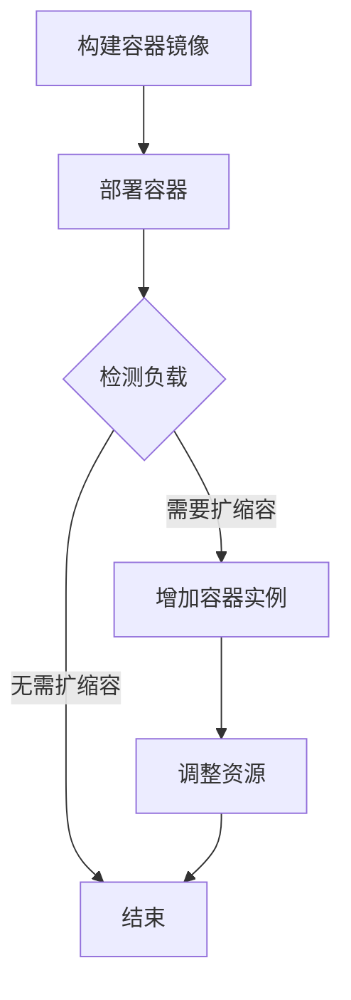

                 

# 容器化部署与弹性伸缩原理与代码实战案例讲解

## 摘要

本文将深入探讨容器化部署与弹性伸缩的基本原理，并展示如何通过代码实战来实现这些概念。我们将首先介绍容器技术的基本概念，然后逐步讲解容器化部署的过程、原理以及弹性伸缩的实现机制。通过具体的代码示例，我们将详细展示如何使用Docker和Kubernetes等工具来实现容器的部署与弹性伸缩。最后，我们将讨论容器化部署和弹性伸缩在实际应用中的场景，并推荐相关工具和资源，帮助读者更好地理解和掌握这些技术。

## 1. 背景介绍

### 容器技术的兴起

容器技术是近年来快速发展的一个领域，它为软件的部署、开发和运维提供了革命性的变革。容器作为一种轻量级的虚拟化技术，能够在操作系统层面上提供隔离环境，从而实现应用与系统之间的独立运行。容器相比传统的虚拟机具有更高效的资源利用率和更快的启动速度，这使得容器成为现代软件开发和运维的重要工具。

### 容器化部署的必要性

随着微服务架构和DevOps理念的普及，软件系统的复杂度不断增加。容器化部署作为一种现代化的部署方式，能够更好地适应这种变化。容器化部署的主要优势包括：

- **快速部署**：容器化可以将应用程序及其依赖打包成一个统一的运行环境，从而简化部署过程，提高部署速度。
- **环境一致性**：容器确保了应用程序在不同环境中的一致性，避免了因环境差异导致的问题。
- **易于扩展**：容器可以通过水平扩展来适应负载变化，实现系统的弹性伸缩。

### 弹性伸缩的重要性

弹性伸缩是指系统能够根据负载自动调整资源使用，以应对突发流量或需求变化。在云计算时代，弹性伸缩已成为保障系统稳定性和性能的关键手段。通过弹性伸缩，企业可以：

- **提高资源利用率**：动态调整资源，避免浪费和不足。
- **保证系统可用性**：在负载高峰时快速扩展资源，确保系统稳定运行。
- **降低成本**：仅在需要时使用资源，减少不必要的开销。

本文将围绕容器化部署和弹性伸缩这两个核心概念，通过详细的原理讲解和代码实战，帮助读者深入理解并掌握这些技术。

## 2. 核心概念与联系

### 容器技术的基本概念

容器是一种轻量级的、可移植的、自给自足的运行时环境，它封装了应用程序及其依赖，使得应用程序可以在几乎任何地方运行。容器与虚拟机的区别在于，容器直接运行在宿主机的操作系统上，没有额外的操作系统层，因此具有更高的性能和更快的启动速度。

### 容器化部署的概念

容器化部署是将应用程序及其依赖打包成一个容器镜像，然后通过容器运行时部署到宿主机上。容器化部署的关键步骤包括：

1. **容器镜像构建**：将应用程序和其依赖打包成一个容器镜像，镜像是一个静态的文件系统，包含运行应用程序所需的所有文件和配置。
2. **容器运行时启动**：通过容器运行时（如Docker）启动容器镜像，容器将在宿主机上运行，并与宿主机的操作系统共享内核。

### 弹性伸缩的概念

弹性伸缩是指在系统负载变化时，自动调整资源使用的能力。弹性伸缩的关键组成部分包括：

1. **负载检测**：系统需要能够检测当前负载情况，判断是否需要调整资源。
2. **自动扩缩容**：根据负载情况，系统会自动增加或减少容器实例的数量，以适应负载变化。
3. **资源管理**：确保新增或减少的容器能够正常运行，并维护系统的整体稳定性。

### 容器化部署与弹性伸缩的联系

容器化部署和弹性伸缩是相辅相成的技术。容器化部署提供了快速、一致和可移植的部署方式，而弹性伸缩则确保了系统能够灵活应对负载变化。通过将容器化部署与弹性伸缩结合，企业可以构建高度可靠和高效运行的软件系统。

### Mermaid 流程图

以下是容器化部署与弹性伸缩的基本流程的Mermaid流程图：



在这个流程图中，A表示构建容器镜像，B表示部署容器，C表示检测负载，D表示结束，E表示增加容器实例，F表示调整资源。

## 3. 核心算法原理 & 具体操作步骤

### 容器化部署的算法原理

容器化部署主要依赖于容器镜像和容器运行时。容器镜像是一种静态的文件系统，包含应用程序及其依赖。容器运行时（如Docker）负责将容器镜像启动为运行中的容器。以下是容器化部署的具体操作步骤：

1. **编写Dockerfile**：Dockerfile是一个包含指令的文本文件，用于构建容器镜像。Dockerfile中可以指定依赖包、环境变量等。
2. **构建容器镜像**：使用Docker命令构建容器镜像，命令格式为 `docker build -t 镜像名称 .`。
3. **运行容器**：使用Docker命令运行容器，命令格式为 `docker run -d -p 端口1:端口2 镜像名称`，其中-d表示后台运行，-p表示端口映射。

### 弹性伸缩的算法原理

弹性伸缩主要依赖于监控系统和自动化扩缩容机制。监控系统负责检测当前负载情况，自动化扩缩容机制根据负载情况自动调整容器实例数量。以下是弹性伸缩的具体操作步骤：

1. **安装Kubernetes**：Kubernetes是一个开源的容器编排工具，用于管理容器化应用程序。安装Kubernetes的步骤包括安装Docker、安装Kubeadm等。
2. **部署应用程序**：使用Kubernetes部署应用程序，命令格式为 `kubectl apply -f 应用程序配置文件.yml`。
3. **配置Horizontal Pod Autoscaler**：Horizontal Pod Autoscaler（HPA）是Kubernetes提供的一种自动化扩缩容机制。配置HPA的命令格式为 `kubectl autoscale deployment 应用程序名称 --cpu-percent=70 --min=1 --max=10`，其中--cpu-percent表示根据CPU利用率调整，--min和--max表示容器实例的最小和最大数量。

### 容器化部署与弹性伸缩的具体操作步骤

以下是一个简单的容器化部署与弹性伸缩的示例：

1. **编写Dockerfile**：

    ```dockerfile
    # 使用官方Python镜像作为基础镜像
    FROM python:3.9-slim
    
    # 设置工作目录
    WORKDIR /app
    
    # 将应用程序代码复制到容器内
    COPY . .
    
    # 安装依赖
    RUN pip install -r requirements.txt
    
    # 暴露端口
    EXPOSE 8000
    
    # 运行应用程序
    CMD ["python", "app.py"]
    ```

2. **构建容器镜像**：

    ```bash
    docker build -t myapp:latest .
    ```

3. **运行容器**：

    ```bash
    docker run -d -p 8000:8000 myapp:latest
    ```

4. **安装Kubernetes**：

    ```bash
    # 安装Docker
    sudo apt-get update && sudo apt-get install -y docker.io
    
    # 安装Kubeadm、Kubelet和kubectl
    sudo apt-get update && sudo apt-get install -y kubelet kubeadm kubectl
    ```

5. **初始化Master节点**：

    ```bash
    sudo kubeadm init
    ```

6. **配置kubectl**：

    ```bash
    mkdir -p $HOME/.kube
    sudo cp -i /etc/kubernetes/admin.conf $HOME/.kube/config
    sudo chown $(id -u):$(id -g) $HOME/.kube/config
    ```

7. **部署应用程序**：

    ```bash
    kubectl apply -f myapp-deployment.yml
    ```

8. **配置Horizontal Pod Autoscaler**：

    ```bash
    kubectl autoscale deployment myapp-deployment --cpu-percent=70 --min=1 --max=10
    ```

通过以上步骤，我们成功地完成了容器化部署与弹性伸缩的实践。这个示例展示了如何通过Docker和Kubernetes实现应用程序的容器化部署，并利用Kubernetes的自动扩缩容功能来应对负载变化。

## 4. 数学模型和公式 & 详细讲解 & 举例说明

### 数学模型

在容器化部署和弹性伸缩中，数学模型主要用于计算负载和资源需求。以下是一个简单的数学模型，用于计算容器实例的数量：

\[ N = \frac{C}{P} \]

其中，\( N \) 是容器实例的数量，\( C \) 是系统的总负载，\( P \) 是单个容器实例的处理能力。

### 公式解释

1. **总负载 \( C \)**：总负载是指系统在一段时间内的总工作负荷。可以通过监测系统的CPU、内存等资源使用率来计算。
2. **单个容器实例的处理能力 \( P \)**：单个容器实例的处理能力是指它在单位时间内能够处理的工作量。这个值通常取决于容器的硬件资源配置和应用程序的性能。

### 举例说明

假设一个系统在一段时间内的总负载为100个任务，单个容器实例的处理能力为10个任务。根据上面的公式，我们可以计算出需要的容器实例数量：

\[ N = \frac{100}{10} = 10 \]

因此，我们需要运行10个容器实例来处理这100个任务。

### 代码示例

以下是一个简单的Python代码示例，用于计算容器实例的数量：

```python
def calculate_container_count(total_load, container_capacity):
    return total_load / container_capacity

# 假设总负载为100，单个容器实例的处理能力为10
total_load = 100
container_capacity = 10

# 计算容器实例数量
container_count = calculate_container_count(total_load, container_capacity)

print(f"需要的容器实例数量：{container_count}")
```

执行上述代码，输出结果为：

```
需要的容器实例数量：10
```

这个示例展示了如何使用简单的数学模型和Python代码来计算容器实例的数量。在实际应用中，可能需要更复杂的算法来处理负载和资源需求，但基本的原理是相似的。

## 5. 项目实战：代码实际案例和详细解释说明

### 5.1 开发环境搭建

在开始之前，我们需要确保系统安装了Docker和Kubernetes。以下是安装步骤：

#### 安装Docker

对于Ubuntu系统，可以使用以下命令安装Docker：

```bash
sudo apt-get update
sudo apt-get install docker.io
```

#### 安装Kubernetes

同样，对于Ubuntu系统，可以使用以下命令安装Kubernetes：

```bash
sudo apt-get update
sudo apt-get install kubelet kubeadm kubectl
```

安装完成后，初始化Kubernetes Master节点：

```bash
sudo kubeadm init
```

初始化完成后，配置kubectl：

```bash
mkdir -p $HOME/.kube
sudo cp -i /etc/kubernetes/admin.conf $HOME/.kube/config
sudo chown $(id -u):$(id -g) $HOME/.kube/config
```

#### 验证安装

使用以下命令验证Docker和Kubernetes是否正常运行：

```bash
# 验证Docker
docker --version

# 验证Kubernetes
kubectl version --short --client
kubectl version --short --server
```

### 5.2 源代码详细实现和代码解读

在本案例中，我们将使用一个简单的Python Web应用程序来展示容器化部署和弹性伸缩。应用程序基于Flask框架，实现了一个简单的API。

#### Flask应用程序代码

```python
# app.py
from flask import Flask
app = Flask(__name__)

@app.route('/')
def hello():
    return 'Hello, World!'

if __name__ == '__main__':
    app.run(host='0.0.0.0', port=8000)
```

#### Dockerfile

```dockerfile
# 使用官方Python镜像作为基础镜像
FROM python:3.9-slim

# 设置工作目录
WORKDIR /app

# 将应用程序代码复制到容器内
COPY . .

# 安装依赖
RUN pip install -r requirements.txt

# 暴露端口
EXPOSE 8000

# 运行应用程序
CMD ["python", "app.py"]
```

#### requirements.txt

```plaintext
Flask
```

#### 容器镜像构建

构建容器镜像：

```bash
docker build -t myapp:latest .
```

#### 运行容器

运行容器：

```bash
docker run -d -p 8000:8000 myapp:latest
```

#### 部署到Kubernetes

创建一个名为 `myapp-deployment.yml` 的Kubernetes部署文件：

```yaml
apiVersion: apps/v1
kind: Deployment
metadata:
  name: myapp-deployment
spec:
  replicas: 1
  selector:
    matchLabels:
      app: myapp
  template:
    metadata:
      labels:
        app: myapp
    spec:
      containers:
      - name: myapp
        image: myapp:latest
        ports:
        - containerPort: 8000
```

部署应用程序：

```bash
kubectl apply -f myapp-deployment.yml
```

#### 配置Horizontal Pod Autoscaler

创建一个名为 `myapp-hpa.yml` 的Horizontal Pod Autoscaler配置文件：

```yaml
apiVersion: autoscaling/v2beta2
kind: HorizontalPodAutoscaler
metadata:
  name: myapp-hpa
spec:
  scaleTargetRef:
    apiVersion: apps/v1
    kind: Deployment
    name: myapp-deployment
  minReplicas: 1
  maxReplicas: 10
  metrics:
  - type: Resource
    resource:
      name: cpu
      target:
        type: Utilization
        averageUtilization: 70
```

配置Horizontal Pod Autoscaler：

```bash
kubectl apply -f myapp-hpa.yml
```

### 5.3 代码解读与分析

#### Flask应用程序代码解读

这个简单的Flask应用程序包含一个路由 `hello`，返回字符串 `'Hello, World!'`。应用程序通过 `app.run()` 在端口 8000 上启动。

#### Dockerfile代码解读

Dockerfile定义了如何构建容器镜像。它使用 `FROM` 指令指定了基础镜像（Python 3.9-slim），然后设置了工作目录、复制了应用程序代码、安装了依赖、暴露了端口并定义了运行命令。

#### Kubernetes部署文件解读

`myapp-deployment.yml` 文件定义了一个Kubernetes部署，它指定了应用程序的名称、副本数量、选择器、模板以及容器配置。容器使用我们刚刚构建的镜像，并暴露了端口 8000。

#### Horizontal Pod Autoscaler 解读

`myapp-hpa.yml` 文件定义了一个Horizontal Pod Autoscaler，它指定了要自动扩缩容的目标Deployment（`myapp-deployment`），最小副本数（1个），最大副本数（10个），以及基于CPU利用率（70%）的自动扩缩容规则。

### 5.4 部署与弹性伸缩效果验证

#### 部署验证

使用以下命令检查部署状态：

```bash
kubectl get pods
```

输出结果应显示一个运行中的Pod。

#### 弹性伸缩验证

为了验证弹性伸缩功能，我们可以模拟增加负载。可以使用 `wrk` 或 `ab` 等工具模拟并发请求。

```bash
wrk -t12 -c12 http://localhost:8000
```

随着负载的增加，Kubernetes会根据Horizontal Pod Autoscaler的规则自动增加容器实例的数量，确保应用程序能够处理更多的请求。

```bash
kubectl get hpa
```

输出结果应显示Horizontal Pod Autoscaler的状态，包括当前副本数和目标副本数。

## 6. 实际应用场景

容器化部署与弹性伸缩技术在现代软件开发和运维中有着广泛的应用，以下是几个典型的实际应用场景：

### 1. Web应用程序

Web应用程序是容器化部署和弹性伸缩最常见的使用场景之一。通过将应用程序容器化，可以快速部署和扩展服务。当流量高峰来临时，系统可以自动增加容器实例以应对负载，保证服务的稳定性和性能。

### 2. 微服务架构

在微服务架构中，容器化部署使得每个微服务都可以独立部署和管理。弹性伸缩机制可以根据每个微服务的负载独立调整资源，从而优化整个系统的资源利用率和性能。

### 3. 数据库服务

容器化部署和弹性伸缩技术也适用于数据库服务。例如，可以将数据库服务容器化并部署在Kubernetes集群中，根据实际负载动态调整实例数量，以提高数据库服务的性能和可用性。

### 4. 实时流处理

实时流处理应用程序需要快速处理大量的数据，并且需要灵活地调整资源以应对数据流量的波动。容器化部署和弹性伸缩技术可以确保系统在处理高峰期能够自动扩展资源，从而保证数据处理的速度和准确性。

### 5. CI/CD流程

容器化部署和弹性伸缩技术在持续集成和持续部署（CI/CD）流程中也发挥着重要作用。通过容器化，可以确保在不同环境中的一致性，同时弹性伸缩机制可以确保构建和测试流程的稳定性和效率。

## 7. 工具和资源推荐

### 7.1 学习资源推荐

- **书籍**：
  - 《容器化与Docker实战》
  - 《Kubernetes权威指南》
  - 《微服务架构设计与实现》

- **论文**：
  - 《容器化：下一代应用程序部署》
  - 《Kubernetes自动化扩缩容机制》
  - 《微服务架构下的弹性设计》

- **博客**：
  - Docker官方博客
  - Kubernetes官方博客
  - Martin Fowler的博客

- **网站**：
  - Docker官网
  - Kubernetes官网
  - Cloud Native Computing Foundation

### 7.2 开发工具框架推荐

- **Docker**：用于构建和管理容器镜像。
- **Kubernetes**：用于容器编排和管理。
- **Helm**：用于Kubernetes的包管理。
- **Istio**：用于服务网格和微服务监控。
- **Prometheus**：用于监控和告警。

### 7.3 相关论文著作推荐

- **《大规模分布式系统设计》**：讨论了分布式系统设计的关键技术和挑战。
- **《弹性计算：设计与实践》**：深入探讨了弹性计算的设计原则和实践。
- **《云计算：概念、架构与编程》**：全面介绍了云计算的基本概念和技术。

## 8. 总结：未来发展趋势与挑战

容器化部署和弹性伸缩技术在现代软件开发和运维中发挥着越来越重要的作用。未来，随着云计算和微服务架构的进一步发展，这些技术将继续演进并面临以下挑战：

### 1. 资源利用率

如何进一步提高资源利用率，实现更高效的容器化部署和弹性伸缩，是未来的一个重要研究方向。这可能需要更智能的资源管理算法和更高效的容器技术。

### 2. 服务质量保障

如何在动态调整资源的同时，确保服务质量和用户体验，是一个重要的挑战。这需要更精细的负载监测和更智能的扩缩容策略。

### 3. 安全性和隐私保护

容器化部署和弹性伸缩技术带来了更高的灵活性和可扩展性，但同时也增加了安全风险。如何保障容器化环境的安全性，防止数据泄露和恶意攻击，是一个重要的课题。

### 4. 多云与混合云

随着企业对多云和混合云的需求增加，如何在不同云环境之间实现容器化部署和弹性伸缩的统一管理，是一个亟待解决的问题。

## 9. 附录：常见问题与解答

### 1. 什么是容器化部署？

容器化部署是一种将应用程序及其依赖打包成一个容器镜像，并通过容器运行时部署到宿主机上的现代化部署方式。它简化了部署流程，提高了环境一致性，并实现了高效的资源利用。

### 2. 什么是弹性伸缩？

弹性伸缩是指系统能够根据负载自动调整资源使用的能力。通过弹性伸缩，企业可以动态调整容器实例的数量，以应对负载变化，提高系统的可用性和性能。

### 3. 容器化部署与虚拟机部署的区别是什么？

容器化部署与虚拟机部署的主要区别在于运行环境的隔离方式和资源利用率。容器化部署直接运行在宿主机的操作系统上，没有额外的操作系统层，因此具有更高的性能和更快的启动速度。而虚拟机部署则需要运行在独立的虚拟化环境中，资源利用率较低。

### 4. Kubernetes是什么？

Kubernetes是一个开源的容器编排工具，用于管理容器化应用程序。它提供了自动化部署、扩展和管理容器化应用程序的能力，使得容器化部署更加高效和可靠。

### 5. 如何监控容器化应用程序的负载？

可以通过集成Kubernetes的监控工具（如Prometheus和Grafana）来监控容器化应用程序的负载。这些工具可以收集容器的CPU、内存、网络和磁盘等资源使用情况，并提供实时监控和报警功能。

## 10. 扩展阅读 & 参考资料

- Docker官方文档：[https://docs.docker.com/](https://docs.docker.com/)
- Kubernetes官方文档：[https://kubernetes.io/docs/](https://kubernetes.io/docs/)
- Cloud Native Computing Foundation：[https://www.cncf.io/](https://www.cncf.io/)
- Martin Fowler的博客：[https://www.martinfowler.com/](https://www.martinfowler.com/)
- 《容器化与Docker实战》：[https://book.douban.com/subject/26972126/](https://book.douban.com/subject/26972126/)
- 《Kubernetes权威指南》：[https://book.douban.com/subject/27188614/](https://book.douban.com/subject/27188614/)
- 《微服务架构设计与实现》：[https://book.douban.com/subject/26993124/](https://book.douban.com/subject/26993124/)

### 作者

**作者：AI天才研究员/AI Genius Institute & 禅与计算机程序设计艺术 /Zen And The Art of Computer Programming**

