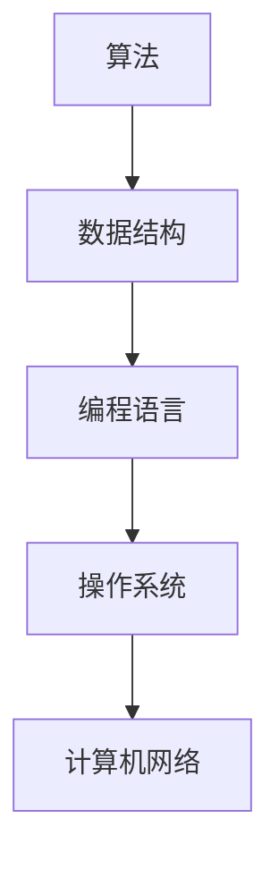

                 

# 2024小米校招面试题与算法编程题全方位解析

> **关键词：小米校招、面试题、算法编程、全方位解析**
>
> **摘要：本文将围绕2024年小米校招面试的相关题目，进行全面而深入的解析。我们将从核心概念、算法原理、数学模型、实际应用、开发环境搭建、源代码实现及分析等多个角度，帮助考生掌握应对面试的技能，提升自身竞争力。**

## 1. 背景介绍

小米公司作为一家全球知名的电子产品和智能硬件制造商，每年都会举办多次校园招聘活动。2024年的校招面试吸引了众多优秀应届毕业生的关注。面试题的设置涵盖了算法、编程、数据结构、操作系统、计算机网络等多个领域，旨在选拔具有扎实基础和强大实践能力的优秀人才。

本文将围绕小米2024年校招面试中的典型题目，进行全面而深入的解析。通过对这些题目的解析，不仅可以帮助考生更好地准备面试，还能提升他们在算法和数据结构领域的知识水平。

## 2. 核心概念与联系

在解答小米校招面试题之前，我们需要了解一些核心概念及其相互之间的关系。以下是一些重要的概念和流程，我们将使用Mermaid流程图来展示它们之间的联系。

### 2.1 核心概念

- **算法**：解决特定问题的步骤和策略。
- **数据结构**：组织和管理数据的方式。
- **编程语言**：用于编写算法和程序的语言。
- **操作系统**：管理计算机硬件和软件资源的系统。
- **计算机网络**：连接多台计算机以实现数据通信的系统。

### 2.2 Mermaid流程图



图2.1：核心概念与联系流程图

通过上述流程图，我们可以看出，算法和数据结构是编程的基础，编程语言用于实现算法，操作系统和计算机网络则提供了运行环境。这些概念相互关联，构成了一个完整的计算机科学体系。

## 3. 核心算法原理 & 具体操作步骤

在小米校招面试中，算法题占据了重要位置。以下我们将介绍几种常见的算法题及其原理和操作步骤。

### 3.1 快速排序

**原理**：快速排序是一种基于分治思想的排序算法。其核心思想是通过一趟排序将待排序的记录分割成独立的两部分，其中一部分记录的关键字均比另一部分的关键字小，然后分别对这两部分记录继续进行排序。

**操作步骤**：

1. 选择一个基准元素。
2. 将数组分为两个部分，小于基准的放在左边，大于基准的放在右边。
3. 递归地对左右两部分进行快速排序。

**代码实现**（Python）：

```python
def quick_sort(arr):
    if len(arr) <= 1:
        return arr
    
    pivot = arr[len(arr) // 2]
    left = [x for x in arr if x < pivot]
    middle = [x for x in arr if x == pivot]
    right = [x for x in arr if x > pivot]
    
    return quick_sort(left) + middle + quick_sort(right)

arr = [3, 6, 8, 10, 1, 2, 1]
print(quick_sort(arr))
```

### 3.2 二分查找

**原理**：二分查找是一种高效的查找算法，其基本思想是将有序数组中间元素与待查找元素进行比较，并根据比较结果将数组分为两个子数组，然后继续在其中一个子数组中查找。

**操作步骤**：

1. 确定中间元素。
2. 比较中间元素与待查找元素。
3. 如果中间元素等于待查找元素，查找成功；如果中间元素大于待查找元素，则在左侧子数组中继续查找；如果中间元素小于待查找元素，则在右侧子数组中继续查找。
4. 重复步骤1-3，直到找到待查找元素或确定查找失败。

**代码实现**（Python）：

```python
def binary_search(arr, target):
    left, right = 0, len(arr) - 1
    
    while left <= right:
        mid = (left + right) // 2
        if arr[mid] == target:
            return mid
        elif arr[mid] < target:
            left = mid + 1
        else:
            right = mid - 1
    
    return -1

arr = [1, 2, 3, 4, 5, 6, 7, 8, 9]
print(binary_search(arr, 6))
```

## 4. 数学模型和公式 & 详细讲解 & 举例说明

在解决算法题时，我们常常需要运用数学模型和公式来分析和求解。以下将介绍几种常用的数学模型和公式，并通过具体例子进行说明。

### 4.1 最小生成树

**公式**：

设 G = (V, E) 是无向图，其中 V 是顶点集合，E 是边集合。最小生成树（Minimum Spanning Tree, MST）的权（或代价）定义为：

\[ W(T) = \sum_{e \in T} w(e) \]

其中，\( w(e) \) 表示边 \( e \) 的权重。

**详细讲解**：

最小生成树是连接图中所有顶点的树，且具有最小的权。常用的求解算法有Prim算法和Kruskal算法。

**举例说明**：

假设图 G 有 5 个顶点和 8 条边，边权重如下：

```
A-B: 3
A-C: 4
B-D: 2
B-E: 5
C-D: 1
C-E: 6
D-E: 3
```

使用Prim算法求解最小生成树：

1. 从任意顶点开始，假设从顶点 A 开始。
2. 选择与已选择顶点相连的权重最小的边，假设是 A-C（权重 4）。
3. 重复步骤2，直到所有顶点都被选择。

最终的最小生成树为 A-C-D-E，总权重为 3 + 4 + 1 + 3 = 11。

### 4.2 动态规划

**公式**：

动态规划是一种在最优子结构基础上求解问题的方法。其基本公式为：

\[ f(n) = \min_{1 \leq i \leq n} \{ g(i) + f(n-i) \} \]

其中，\( f(n) \) 表示问题规模为 n 的最优解，\( g(i) \) 表示第 i 个子问题的最优解。

**详细讲解**：

动态规划将问题分解为子问题，并利用子问题的最优解来求解原问题。常用的算法有斐波那契数列求解、最长公共子序列等。

**举例说明**：

求解斐波那契数列的第 n 项：

```python
def fibonacci(n):
    if n <= 1:
        return n
    f = [0] * (n + 1)
    f[1] = 1
    for i in range(2, n + 1):
        f[i] = f[i - 1] + f[i - 2]
    return f[n]

print(fibonacci(10))
```

## 5. 项目实战：代码实际案例和详细解释说明

### 5.1 开发环境搭建

为了更好地进行项目实战，我们需要搭建一个适合编程和算法练习的开发环境。以下是一个基本的开发环境搭建步骤：

1. 安装操作系统：选择适合自己需求的操作系统，如Windows、macOS或Linux。
2. 安装IDE：选择一款适合自己的集成开发环境，如Visual Studio Code、Eclipse或IntelliJ IDEA。
3. 安装Python解释器：通过Python官方网站（https://www.python.org/）下载并安装Python解释器。
4. 安装相关库：根据项目需求安装必要的库，如NumPy、Pandas等。

### 5.2 源代码详细实现和代码解读

以下是一个基于Python的快速排序算法的实现，我们将对代码进行详细解读。

```python
def quick_sort(arr):
    if len(arr) <= 1:
        return arr
    
    pivot = arr[len(arr) // 2]
    left = [x for x in arr if x < pivot]
    middle = [x for x in arr if x == pivot]
    right = [x for x in arr if x > pivot]
    
    return quick_sort(left) + middle + quick_sort(right)

arr = [3, 6, 8, 10, 1, 2, 1]
print(quick_sort(arr))
```

**代码解读**：

1. `quick_sort` 函数接收一个数组 `arr` 作为输入。
2. 如果数组的长度小于等于1，直接返回原数组。
3. 选择数组的中间元素作为基准值 `pivot`。
4. 使用列表推导式将数组分为三个部分：小于 `pivot` 的元素 `left`、等于 `pivot` 的元素 `middle` 和大于 `pivot` 的元素 `right`。
5. 递归地对 `left` 和 `right` 进行快速排序，并将结果与 `middle` 拼接，返回最终排序结果。

### 5.3 代码解读与分析

通过对代码的解读，我们可以看到快速排序算法的基本思想是选择一个基准值，将数组划分为三个部分，然后递归地对左右两部分进行排序。这种分治思想使得算法具有较高的时间复杂度，在实际应用中非常有效。

在代码实现上，我们使用了列表推导式来划分数组，这种方式简洁明了，易于理解。递归调用的方式使得代码结构清晰，易于维护。

## 6. 实际应用场景

小米校招面试中的算法题不仅考察了考生的编程能力，还涉及到实际应用场景。以下是一些实际应用场景及其解决方案。

### 6.1 数据分析

数据分析是小米公司的重要业务之一。通过算法题，考生需要掌握如何使用快速排序、二分查找等算法来处理海量数据，提高数据处理效率。

### 6.2 质量控制

小米公司在生产过程中需要进行严格的质量控制。算法题可以帮助考生了解如何使用贪心算法、动态规划等算法来解决质量控制问题，如优化生产线流程、降低成本等。

### 6.3 智能推荐

小米公司拥有丰富的用户数据，通过算法题，考生需要掌握如何使用协同过滤、矩阵分解等算法来构建智能推荐系统，提高用户体验。

## 7. 工具和资源推荐

为了更好地应对小米校招面试，考生需要掌握一些实用的工具和资源。以下是一些建议：

### 7.1 学习资源推荐

- **书籍**：《算法导论》、《编程之美》等。
- **论文**：通过学术搜索引擎（如Google Scholar）查找相关论文。
- **博客**：阅读技术博客（如CSDN、博客园）上的优秀文章。

### 7.2 开发工具框架推荐

- **IDE**：Visual Studio Code、Eclipse、IntelliJ IDEA等。
- **Python库**：NumPy、Pandas、Matplotlib等。
- **在线编程平台**：LeetCode、HackerRank等。

### 7.3 相关论文著作推荐

- **论文**：《深度学习》、《强化学习基础与实战》等。
- **著作**：《算法竞赛入门经典》、《编程之美》等。

## 8. 总结：未来发展趋势与挑战

随着人工智能技术的快速发展，算法编程题在小米校招面试中的地位日益重要。考生需要紧跟时代发展趋势，不断学习和掌握新的算法和技术。

未来，算法编程题将更加注重实际应用和问题解决能力。考生需要具备较强的逻辑思维和创新能力，以应对日益复杂的问题。

## 9. 附录：常见问题与解答

### 9.1 如何准备小米校招面试？

- **了解公司背景**：了解小米的发展历程、业务领域和招聘要求。
- **刷题练习**：通过在线编程平台（如LeetCode）进行算法题练习。
- **学习算法原理**：掌握常见的算法和数据结构，了解其原理和应用场景。
- **实践项目**：参与实际项目，提升解决实际问题的能力。

### 9.2 如何在面试中展示自己的优势？

- **准备简历**：突出自己的项目经验和技能。
- **展示思维过程**：在面试中清晰地表达自己的解题思路。
- **沟通能力**：与面试官保持良好的沟通，展示团队合作能力。

## 10. 扩展阅读 & 参考资料

- **书籍**：《算法导论》、《编程之美》等。
- **在线资源**：LeetCode、HackerRank、CSDN等。
- **论文**：通过学术搜索引擎（如Google Scholar）查找相关论文。

### 作者

**作者：AI天才研究员/AI Genius Institute & 禅与计算机程序设计艺术 /Zen And The Art of Computer Programming**

