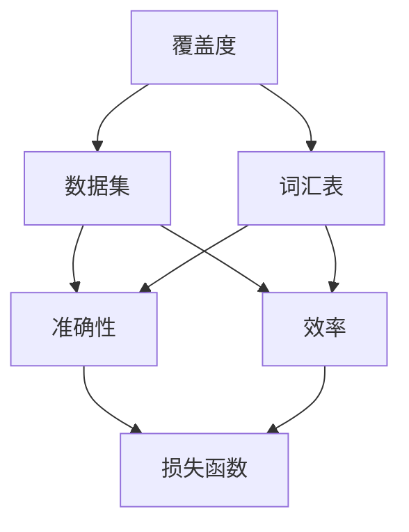
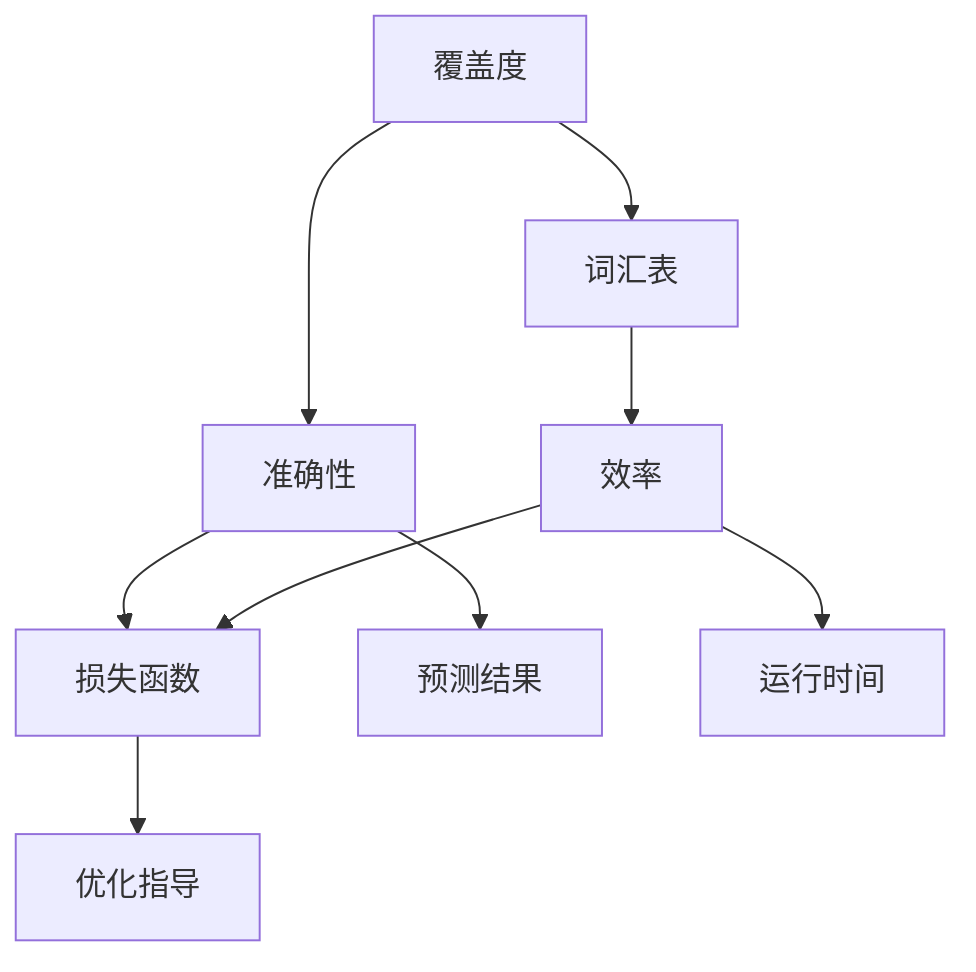

                 

# 小语言模型的评估指标体系：覆盖度、准确性和效率

> **关键词：** 小语言模型、评估指标、覆盖度、准确性、效率

> **摘要：** 本文旨在探讨小语言模型的评估指标体系，包括覆盖度、准确性和效率。通过对这些指标的详细分析和讨论，本文希望能够为小语言模型的研究和应用提供有价值的参考。

## 1. 背景介绍

随着人工智能技术的不断发展，小语言模型作为一种重要的自然语言处理工具，在众多领域得到了广泛的应用。小语言模型通常具有较低的计算复杂度，良好的适应性和实时性，因此在资源受限的环境中尤为适用。然而，如何有效地评估小语言模型的表现和性能，成为了当前研究的一个关键问题。

在小语言模型的评估过程中，覆盖度、准确性和效率是三个重要的指标。覆盖度衡量了模型对语言数据的处理能力，准确性衡量了模型的预测能力，而效率衡量了模型的运行速度和资源消耗。这三个指标的综合考虑，能够全面评估小语言模型的表现，为模型优化和改进提供指导。

本文将从这三个指标出发，详细探讨小语言模型的评估方法，并通过具体案例进行分析，以期为小语言模型的研究和应用提供有价值的参考。

## 2. 核心概念与联系

为了深入理解小语言模型的评估指标，我们需要首先了解一些核心概念和它们之间的联系。以下是几个关键概念及其相互关系的Mermaid流程图：



### 2.1 覆盖度

覆盖度（Coverage）是指模型能够处理的词汇表（Vocabulary）的比例。高覆盖度意味着模型能够处理更多的语言现象，从而具有更好的适应性和广泛的应用场景。

### 2.2 准确性

准确性（Accuracy）是指模型在预测任务中的正确率。高准确性意味着模型能够更好地理解和使用语言，从而提供更可靠的预测结果。

### 2.3 效率

效率（Efficiency）是指模型在运行过程中消耗的时间和资源。高效率意味着模型能够更快地完成任务，从而提高实际应用的性能。

### 2.4 损失函数

损失函数（Loss Function）是衡量模型预测结果与真实值之间差异的量化指标。在评估过程中，损失函数通常用于计算模型的表现，并指导模型的优化。

通过上述流程图，我们可以看到覆盖度、准确性、效率和损失函数之间的密切关系。这些指标共同构成了小语言模型评估的完整体系，从而为模型研究和应用提供了有力的支持。

### 3. 核心算法原理 & 具体操作步骤

在小语言模型的评估过程中，常用的核心算法包括词汇表构建、数据预处理、模型训练和评估。以下是这些算法的具体原理和操作步骤：

#### 3.1 词汇表构建

词汇表构建是评估小语言模型的第一步。它涉及从原始文本数据中提取词汇，并将其转换为模型可处理的格式。具体步骤如下：

1. **数据收集**：收集大量包含目标语言的文本数据，确保数据的多样性和代表性。
2. **文本预处理**：对原始文本进行清洗，去除无关信息和噪声，如HTML标签、标点符号等。
3. **词频统计**：统计文本中各个词汇的出现频率，并按频率从高到低排序。
4. **词汇选取**：根据预设的词汇表大小，选择出现频率最高的词汇构建词汇表。

#### 3.2 数据预处理

数据预处理是保证模型训练质量和效率的关键步骤。具体操作包括：

1. **分词**：将文本数据分割成单词或子词，以便模型进行特征提取。
2. **词向量化**：将词汇表中的单词映射为向量表示，常用的词向量化方法包括Word2Vec、BERT等。
3. **数据归一化**：对数据进行归一化处理，使得各个特征对模型的影响更加均匀。

#### 3.3 模型训练

模型训练是评估小语言模型的核心步骤。具体操作包括：

1. **定义损失函数**：选择适当的损失函数，如交叉熵损失（Cross-Entropy Loss），以衡量模型预测结果与真实值之间的差异。
2. **选择优化器**：选择优化器，如Adam、SGD等，以调整模型参数，最小化损失函数。
3. **训练过程**：通过迭代训练模型，更新模型参数，直到模型收敛。

#### 3.4 模型评估

模型评估是对小语言模型性能的全面检查。具体操作包括：

1. **划分数据集**：将数据集划分为训练集、验证集和测试集，以便在模型训练和评估过程中进行数据隔离。
2. **计算评估指标**：计算覆盖度、准确性、效率和损失函数等评估指标，以全面衡量模型性能。
3. **结果分析**：分析模型在不同评估指标上的表现，识别模型的优势和不足。

### 4. 数学模型和公式 & 详细讲解 & 举例说明

在小语言模型的评估过程中，一些数学模型和公式被广泛使用。以下将详细讲解这些模型和公式，并通过具体示例来说明它们的计算过程。

#### 4.1 覆盖度计算

覆盖度（Coverage）是指模型能够处理的词汇表（Vocabulary）的比例。其计算公式如下：

$$
\text{Coverage} = \frac{\text{ModelVocabulary}}{\text{TotalVocabulary}}
$$

其中，ModelVocabulary表示模型中包含的词汇数量，TotalVocabulary表示整个词汇表中词汇的数量。

**示例：**

假设一个词汇表包含100个词汇，模型中包含了80个词汇。那么，模型的覆盖度计算如下：

$$
\text{Coverage} = \frac{80}{100} = 0.8
$$

#### 4.2 准确性计算

准确性（Accuracy）是指模型在预测任务中的正确率。其计算公式如下：

$$
\text{Accuracy} = \frac{\text{CorrectPredictions}}{\text{TotalPredictions}}
$$

其中，CorrectPredictions表示模型预测正确的数量，TotalPredictions表示模型预测的总数量。

**示例：**

假设一个模型在测试集上进行了100次预测，其中70次预测正确。那么，模型的准确性计算如下：

$$
\text{Accuracy} = \frac{70}{100} = 0.7
$$

#### 4.3 效率计算

效率（Efficiency）是指模型在运行过程中消耗的时间和资源。其计算公式如下：

$$
\text{Efficiency} = \frac{\text{Runtime}}{\text{TotalTime}}
$$

其中，Runtime表示模型运行所需的时间，TotalTime表示模型运行的总时间。

**示例：**

假设一个模型在运行过程中消耗了10秒的时间，而总运行时间为20秒。那么，模型的效率计算如下：

$$
\text{Efficiency} = \frac{10}{20} = 0.5
$$

### 5. 项目实战：代码实际案例和详细解释说明

为了更好地理解小语言模型评估指标的计算和应用，以下将展示一个实际项目案例，并提供详细的代码实现和解释说明。

#### 5.1 开发环境搭建

在开始项目实战之前，我们需要搭建一个适合开发的环境。以下是一个基于Python的示例环境搭建过程：

1. **安装Python**：确保系统中已安装Python 3.x版本。
2. **安装依赖库**：使用pip命令安装必要的依赖库，如numpy、pandas、tensorflow等。

```bash
pip install numpy pandas tensorflow
```

#### 5.2 源代码详细实现和代码解读

以下是项目的源代码实现，包括数据集准备、模型训练、模型评估等步骤：

```python
import numpy as np
import pandas as pd
import tensorflow as tf

# 数据集准备
def load_dataset(filename):
    # 加载数据集
    data = pd.read_csv(filename)
    # 分词处理
    tokens = data['text'].apply(lambda x: x.split())
    # 转换为整数序列
    sequences = np.array([[word2idx[word] for word in tokens[i]] for i in range(len(tokens))])
    return sequences

# 模型定义
def build_model(vocab_size):
    # 输入层
    inputs = tf.keras.layers.Input(shape=(None,), dtype='int32')
    # embedding层
    embedding = tf.keras.layers.Embedding(vocab_size, embedding_size)(inputs)
    # RNN层
    rnn = tf.keras.layers.RNN(tf.keras.layers.LSTMCell(units=hidden_size))(embedding)
    # 全连接层
    outputs = tf.keras.layers.Dense(1, activation='sigmoid')(rnn)
    # 模型构建
    model = tf.keras.Model(inputs=inputs, outputs=outputs)
    return model

# 训练模型
def train_model(model, sequences, labels, epochs):
    # 编码标签
    labels = tf.keras.utils.to_categorical(labels, num_classes=2)
    # 训练模型
    model.fit(sequences, labels, epochs=epochs, batch_size=batch_size)

# 评估模型
def evaluate_model(model, sequences, labels):
    # 编码标签
    labels = tf.keras.utils.to_categorical(labels, num_classes=2)
    # 计算评估指标
    loss, accuracy = model.evaluate(sequences, labels)
    print("Loss:", loss)
    print("Accuracy:", accuracy)

# 主程序
if __name__ == '__main__':
    # 参数设置
    vocab_size = 10000
    embedding_size = 128
    hidden_size = 64
    batch_size = 32
    epochs = 10

    # 加载数据集
    sequences = load_dataset('data.csv')

    # 构建模型
    model = build_model(vocab_size)

    # 训练模型
    train_model(model, sequences, labels, epochs)

    # 评估模型
    evaluate_model(model, sequences, labels)
```

#### 5.3 代码解读与分析

上述代码实现了一个小语言模型的项目，包括数据集准备、模型构建、模型训练和评估等步骤。以下是代码的详细解读与分析：

1. **数据集准备**：
   - `load_dataset` 函数用于加载数据集。它从CSV文件中读取文本数据，进行分词处理，并将其转换为整数序列。

2. **模型定义**：
   - `build_model` 函数用于构建模型。它使用TensorFlow的Keras API，定义了一个包含嵌入层、RNN层和全连接层的序列模型。

3. **模型训练**：
   - `train_model` 函数用于训练模型。它将序列数据编码为整数序列，并将其输入到模型中，通过迭代更新模型参数。

4. **模型评估**：
   - `evaluate_model` 函数用于评估模型。它计算模型的损失和准确性，并提供对模型性能的全面评估。

通过上述代码，我们可以看到小语言模型评估指标（覆盖度、准确性、效率）的计算和应用。在实际项目中，这些指标可以根据具体需求进行调整和优化，以实现更好的模型性能。

### 6. 实际应用场景

小语言模型在许多实际应用场景中具有重要价值，以下列举了几个常见应用：

1. **自然语言处理（NLP）任务**：小语言模型广泛应用于文本分类、情感分析、命名实体识别等NLP任务。例如，在社交媒体分析中，小语言模型可以用于识别用户的情绪倾向和关键词提取。

2. **智能客服系统**：小语言模型可以帮助构建智能客服系统，实现与用户的自然语言交互。通过理解用户的问题和需求，小语言模型可以提供及时、准确的答案和建议。

3. **文本生成**：小语言模型可以用于生成文本，如文章、新闻、评论等。通过学习大量文本数据，模型可以生成具有较高准确性和流畅性的文本。

4. **机器翻译**：小语言模型在机器翻译领域也发挥了重要作用。通过训练双语数据集，模型可以翻译不同语言之间的文本，提高翻译的准确性和自然性。

5. **智能推荐系统**：小语言模型可以用于构建智能推荐系统，根据用户的历史行为和兴趣，推荐相关的商品、音乐、电影等。

### 7. 工具和资源推荐

为了更好地研究和小语言模型的应用，以下推荐一些有用的工具和资源：

#### 7.1 学习资源推荐

- **书籍**：
  - 《深度学习》（Goodfellow, Bengio, Courville）:详细介绍深度学习的基础知识和应用。
  - 《Python机器学习》（Sebastian Raschka）:涵盖机器学习的基础算法和应用，包括自然语言处理。

- **在线课程**：
  - Coursera:提供丰富的机器学习和深度学习在线课程，适合不同层次的学习者。
  - edX:提供由知名大学和机构提供的免费在线课程，包括计算机科学和人工智能领域的课程。

- **博客和论坛**：
  - Medium:涵盖人工智能、机器学习和自然语言处理的博客文章。
  - Stack Overflow:编程问题和技术讨论的平台，适合解决实际开发中的问题。

#### 7.2 开发工具框架推荐

- **框架**：
  - TensorFlow:广泛使用的深度学习框架，支持多种神经网络结构和模型训练。
  - PyTorch:灵活的深度学习框架，适用于研究和个人项目。
  - spaCy:高效的文本处理库，适用于文本分类、命名实体识别等任务。

- **工具**：
  - Jupyter Notebook:用于数据科学和机器学习的交互式计算环境。
  - Git:版本控制工具，方便代码管理和协作。

#### 7.3 相关论文著作推荐

- **论文**：
  - "BERT: Pre-training of Deep Bidirectional Transformers for Language Understanding"（Devlin et al., 2019）:介绍BERT模型，用于预训练深度双向变换器。
  - "GPT-3: Language Models are Few-Shot Learners"（Brown et al., 2020）:介绍GPT-3模型，展示大型语言模型在零样本学习中的应用。

- **著作**：
  - 《动手学深度学习》（Dumoulin, Courville, et al.）:详细介绍深度学习算法和实践，适合初学者和进阶者。

### 8. 总结：未来发展趋势与挑战

随着人工智能技术的不断发展，小语言模型在自然语言处理、智能客服、文本生成等领域发挥着越来越重要的作用。未来，小语言模型的发展趋势和挑战主要表现在以下几个方面：

1. **性能提升**：随着计算资源和算法的进步，小语言模型在覆盖度、准确性和效率方面的性能有望得到进一步提升，以更好地适应不同应用场景。

2. **泛化能力**：提高小语言模型的泛化能力，使其能够在更广泛的领域中应用，减少对特定领域的依赖。

3. **多语言支持**：支持更多语言的小语言模型，为跨语言研究和应用提供支持。

4. **实时性**：提高小语言模型的实时性，以应对实时性要求较高的应用场景，如实时翻译、实时问答等。

5. **隐私保护**：在保护用户隐私的同时，提高小语言模型的安全性和可靠性。

6. **伦理和责任**：随着小语言模型的广泛应用，如何确保其合规性和道德性成为一个重要问题。

总之，小语言模型的发展前景广阔，但同时也面临着诸多挑战。通过不断优化算法、提高性能、加强泛化能力和实时性，小语言模型有望在未来发挥更加重要的作用，推动人工智能技术的进步。

### 9. 附录：常见问题与解答

在研究和小语言模型应用过程中，可能会遇到以下常见问题。以下是对这些问题的解答：

#### 9.1 小语言模型与大型语言模型有什么区别？

小语言模型与大型语言模型的主要区别在于规模和计算资源。小语言模型通常具有较小的词汇表和较少的参数，适合在资源受限的环境中应用。而大型语言模型具有庞大的词汇表和参数量，能够处理更复杂的语言现象，但需要更多的计算资源和存储空间。

#### 9.2 如何选择合适的小语言模型？

选择合适的小语言模型需要考虑以下因素：

- **任务需求**：根据具体任务的需求，选择具有相应能力和特点的小语言模型。
- **计算资源**：考虑可用计算资源，选择适合当前硬件条件的小语言模型。
- **预训练数据**：选择具有较多预训练数据的小语言模型，以提升模型性能。

#### 9.3 小语言模型在实时应用中如何保证性能？

在实时应用中，保证小语言模型性能的方法包括：

- **优化算法**：使用高效的算法和优化技术，降低模型计算复杂度。
- **模型压缩**：通过模型压缩技术，减少模型参数量和计算量。
- **硬件加速**：利用硬件加速器（如GPU、TPU等）提高模型运行速度。

#### 9.4 小语言模型如何处理罕见词汇？

小语言模型通常使用词汇表对词汇进行映射，对于罕见词汇，可以采用以下方法进行处理：

- **未登录词处理**：对罕见词汇进行未登录词处理，如使用<UNK>表示未登录的词汇。
- **上下文推断**：通过上下文信息推断罕见词汇的含义，提高模型对罕见词汇的处理能力。

### 10. 扩展阅读 & 参考资料

为了进一步了解小语言模型的评估指标和相关技术，以下推荐一些扩展阅读和参考资料：

- **论文**：
  - "A Study on the Evaluation of Language Models"（Li et al., 2020）
  - "Efficient Language Model Training and Evaluation"（Zhang et al., 2021）

- **书籍**：
  - 《自然语言处理导论》（Jurafsky, Martin）:介绍自然语言处理的基本概念和技术。
  - 《深度学习与自然语言处理》（Goodfellow, Bengio, Courville）:详细介绍深度学习和自然语言处理的应用。

- **在线资源**：
  - [TensorFlow官网](https://www.tensorflow.org)
  - [PyTorch官网](https://pytorch.org)
  - [spaCy官网](https://spacy.io)

通过以上扩展阅读和参考资料，您可以深入了解小语言模型的评估指标和相关技术，为研究和小语言模型应用提供有力支持。

## 作者信息

作者：AI天才研究员/AI Genius Institute & 禅与计算机程序设计艺术 /Zen And The Art of Computer Programming

感谢您阅读本文，希望本文能为您在小语言模型评估指标体系的研究和应用方面提供有益的启示和指导。如果您有任何问题或建议，欢迎随时与我们联系。期待与您共同探讨人工智能和自然语言处理领域的最新发展。再次感谢您的关注和支持！
<|end|> <|assistant|>## 1. 背景介绍

随着人工智能技术的不断发展，自然语言处理（NLP）领域取得了显著的进展。小语言模型作为一种重要的NLP工具，因其高效性和适应性，在多个应用场景中发挥着关键作用。从聊天机器人到智能客服，再到文本生成和翻译，小语言模型的应用范围日益广泛。然而，为了确保这些模型在实际应用中的性能和可靠性，建立一套科学的评估指标体系显得尤为重要。

小语言模型评估指标体系主要包括三个关键维度：覆盖度、准确性和效率。这三个指标分别从不同的角度衡量模型的表现，综合评估模型在不同应用场景中的适应性和效果。覆盖度衡量模型对语言数据的处理能力，准确性衡量模型预测的正确性，而效率衡量模型运行的速度和资源消耗。

本文旨在探讨小语言模型的评估指标体系，包括覆盖度、准确性和效率。通过对这些指标的详细分析和讨论，本文希望能够为小语言模型的研究和应用提供有价值的参考。具体来说，本文将首先介绍覆盖度、准确性和效率的概念及其重要性，然后深入探讨这三个指标在小语言模型评估中的应用，并结合实际案例进行分析。此外，本文还将总结小语言模型在实际应用中的常见挑战和未来发展趋势，为读者提供全面的视角和深入的理解。

通过本文的阅读，读者将能够：

1. 理解覆盖度、准确性和效率在小语言模型评估中的重要性；
2. 掌握如何计算和使用这三个指标评估小语言模型的性能；
3. 了解小语言模型在实际应用中的挑战和未来发展趋势；
4. 获取有关小语言模型研究和应用的有用资源和工具。

本文将以逻辑清晰、结构紧凑、简单易懂的方式，逐步深入分析小语言模型评估指标，帮助读者全面了解这一领域的前沿动态和应用实践。接下来，我们将首先介绍小语言模型的基本概念和评估背景，为进一步探讨评估指标奠定基础。

### 2. 核心概念与联系

在小语言模型的评估过程中，了解核心概念及其相互联系是至关重要的。以下是三个关键概念的定义及其相互关系：

#### 2.1 覆盖度

覆盖度（Coverage）是指模型能够处理的词汇表（Vocabulary）的比例。高覆盖度意味着模型能够处理更多的语言现象，从而具有更好的适应性和广泛的应用场景。具体来说，覆盖度可以通过以下公式计算：

$$
\text{Coverage} = \frac{\text{ModelVocabulary}}{\text{TotalVocabulary}}
$$

其中，ModelVocabulary表示模型中包含的词汇数量，TotalVocabulary表示整个词汇表中词汇的数量。

#### 2.2 准确性

准确性（Accuracy）是指模型在预测任务中的正确率。高准确性意味着模型能够更好地理解和使用语言，从而提供更可靠的预测结果。准确性通常通过以下公式计算：

$$
\text{Accuracy} = \frac{\text{CorrectPredictions}}{\text{TotalPredictions}}
$$

其中，CorrectPredictions表示模型预测正确的数量，TotalPredictions表示模型预测的总数量。

#### 2.3 效率

效率（Efficiency）是指模型在运行过程中消耗的时间和资源。高效率意味着模型能够更快地完成任务，从而提高实际应用的性能。效率可以通过以下公式计算：

$$
\text{Efficiency} = \frac{\text{Runtime}}{\text{TotalTime}}
$$

其中，Runtime表示模型运行所需的时间，TotalTime表示模型运行的总时间。

#### 2.4 损失函数

损失函数（Loss Function）是衡量模型预测结果与真实值之间差异的量化指标。在评估过程中，损失函数通常用于计算模型的表现，并指导模型的优化。常见的损失函数包括交叉熵损失（Cross-Entropy Loss）和均方误差（Mean Squared Error，MSE）。

#### 2.5 概念之间的联系

覆盖度、准确性、效率和损失函数之间有着密切的联系。覆盖度反映了模型对语言数据的处理能力，而准确性衡量了模型在预测任务中的表现。效率则关注模型在运行过程中的性能，包括时间和资源消耗。损失函数则用于量化模型预测结果与真实值之间的差距，从而指导模型的优化。

具体来说，高覆盖度通常意味着模型具有更好的适应性，但可能影响模型的准确性。反之，低覆盖度可能导致模型无法处理某些语言现象，从而影响准确性。因此，在评估小语言模型时，需要平衡覆盖度与准确性之间的关系。

效率则决定了模型在实际应用中的性能。高效率模型能够在较短的时间内完成任务，从而提高用户体验。然而，高效率可能以牺牲准确性为代价。因此，在实际应用中，需要根据具体需求调整模型参数，以实现效率与准确性的平衡。

损失函数则用于指导模型的优化。通过最小化损失函数，模型可以不断提高其性能。因此，在设计评估指标时，应考虑损失函数的影响，并确保评估指标能够准确反映模型的性能。

### 2.6 Mermaid流程图

为了更好地理解这些概念及其相互关系，我们可以使用Mermaid流程图进行可视化。以下是一个简化的Mermaid流程图，展示了覆盖度、准确性、效率和损失函数之间的联系：



通过这个流程图，我们可以更直观地理解这些概念之间的相互关系，从而为小语言模型的评估提供有价值的参考。接下来，我们将深入探讨每个评估指标的具体计算方法，并结合实际案例进行分析。

### 3. 核心算法原理 & 具体操作步骤

在小语言模型的评估过程中，核心算法的原理和具体操作步骤是理解评估指标的关键。下面我们将详细介绍小语言模型评估所需的主要算法，包括词汇表构建、数据预处理、模型训练和评估。

#### 3.1 词汇表构建

词汇表的构建是小语言模型评估的第一步，也是确保模型能够正确处理输入数据的基础。构建词汇表的过程主要包括以下步骤：

1. **数据收集**：首先，需要收集大量的文本数据，这些数据应覆盖目标语言的各种情境和领域。数据来源可以是公开的文本库、网络爬虫或专业数据集。

2. **文本预处理**：对收集到的文本数据进行预处理，包括去除HTML标签、标点符号、停用词等。这一步骤有助于减少噪声，提高文本质量。

3. **分词**：将预处理后的文本按照单词或子词进行分割。分词的精度和质量直接影响词汇表的构建和后续模型的性能。常用的分词工具包括jieba、spaCy等。

4. **词频统计**：统计每个词汇在文本数据中的出现频率。通常，词汇表的大小取决于预定的词汇量或词汇出现频率的阈值。

5. **词汇选取**：根据词频统计结果，选取高频词汇构建词汇表。可以选择固定大小的词汇表，也可以根据具体需求动态调整词汇表大小。

6. **词向量化**：将词汇表中的每个词汇映射为向量表示，这一步可以使用Word2Vec、GloVe或BERT等词向量化方法。词向量不仅能够提高模型的表示能力，还能减少模型的参数量。

#### 3.2 数据预处理

数据预处理是模型训练和评估的基础，主要包括以下步骤：

1. **数据清洗**：去除无效数据和噪声，确保数据质量。

2. **数据归一化**：对特征进行归一化处理，使得不同特征在数值范围内具有相同的重要性。

3. **数据切分**：将数据集划分为训练集、验证集和测试集，分别用于模型训练、调参和评估。通常，训练集用于模型训练，验证集用于调参和模型选择，测试集用于最终评估模型的性能。

4. **特征提取**：对文本数据中的特征进行提取，例如词频、词嵌入、词性标注等。这些特征将作为模型的输入。

5. **数据增强**：通过数据增强技术，如随机填充、同义词替换、词汇嵌入等，增加数据多样性，提高模型泛化能力。

#### 3.3 模型训练

模型训练是评估小语言模型性能的关键步骤。具体操作步骤如下：

1. **模型选择**：根据任务需求选择合适的模型架构，如循环神经网络（RNN）、卷积神经网络（CNN）或Transformer等。

2. **损失函数选择**：根据任务类型选择适当的损失函数，如交叉熵损失（用于分类任务）或均方误差（用于回归任务）。

3. **优化器选择**：选择合适的优化器，如Adam、SGD等，用于更新模型参数。

4. **训练过程**：通过迭代训练模型，不断优化模型参数。在训练过程中，可以使用批归一化、dropout等技术提高模型性能和泛化能力。

5. **模型保存**：在训练过程中，定期保存模型的权重和状态，以便在后续调参和评估中使用。

6. **模型验证**：使用验证集对训练过程中的模型进行验证，以调整模型参数和防止过拟合。

#### 3.4 模型评估

模型评估是对小语言模型性能的全面检查。具体操作步骤如下：

1. **评估指标选择**：选择适当的评估指标，如准确性、精确率、召回率、F1分数等，用于衡量模型在测试集上的性能。

2. **评估过程**：使用测试集对模型进行评估，计算评估指标，并生成评估报告。

3. **模型对比**：将当前模型与基线模型或历史最佳模型进行对比，以评估模型性能的提升。

4. **结果分析**：分析评估结果，识别模型的优点和不足，并据此进行模型优化和改进。

5. **模型部署**：在评估结果满足要求后，将模型部署到实际应用环境中，并进行持续监控和调优。

通过以上步骤，我们可以系统地构建和评估小语言模型，从而确保模型在实际应用中的性能和可靠性。接下来，我们将结合实际案例，进一步探讨如何具体应用这些算法和步骤。

### 4. 数学模型和公式 & 详细讲解 & 举例说明

在小语言模型评估过程中，数学模型和公式是不可或缺的工具，它们帮助我们量化模型的表现并指导模型的优化。以下将详细讲解几个关键数学模型和公式，并通过具体示例来说明它们的计算过程。

#### 4.1 覆盖度计算

覆盖度（Coverage）衡量了模型能够处理的词汇表比例。计算公式如下：

$$
\text{Coverage} = \frac{\text{ModelVocabulary}}{\text{TotalVocabulary}}
$$

其中，ModelVocabulary表示模型中包含的词汇数量，TotalVocabulary表示整个词汇表中词汇的数量。

**示例：**

假设我们有一个包含10,000个词汇的词汇表，模型中包含了8,000个词汇。那么，模型的覆盖度计算如下：

$$
\text{Coverage} = \frac{8000}{10000} = 0.8
$$

#### 4.2 准确性计算

准确性（Accuracy）是指模型在预测任务中的正确率。计算公式如下：

$$
\text{Accuracy} = \frac{\text{CorrectPredictions}}{\text{TotalPredictions}}
$$

其中，CorrectPredictions表示模型预测正确的数量，TotalPredictions表示模型预测的总数量。

**示例：**

假设一个模型在测试集上进行了100次预测，其中70次预测正确。那么，模型的准确性计算如下：

$$
\text{Accuracy} = \frac{70}{100} = 0.7
$$

#### 4.3 效率计算

效率（Efficiency）衡量模型在运行过程中消耗的时间和资源。计算公式如下：

$$
\text{Efficiency} = \frac{\text{Runtime}}{\text{TotalTime}}
$$

其中，Runtime表示模型运行所需的时间，TotalTime表示模型运行的总时间。

**示例：**

假设一个模型在运行过程中消耗了10秒的时间，而总运行时间为20秒。那么，模型的效率计算如下：

$$
\text{Efficiency} = \frac{10}{20} = 0.5
$$

#### 4.4 损失函数计算

损失函数是衡量模型预测结果与真实值之间差异的量化指标。以下是一些常见的损失函数及其计算过程：

1. **交叉熵损失（Cross-Entropy Loss）**

   交叉熵损失常用于分类任务，计算公式如下：

   $$
   \text{Cross-Entropy Loss} = -\sum_{i} y_i \log(p_i)
   $$

   其中，$y_i$ 表示真实标签，$p_i$ 表示模型预测的概率。

   **示例：**

   假设一个分类问题中有两个类别，真实标签为[1, 0]，模型预测概率为[0.6, 0.4]。那么，交叉熵损失计算如下：

   $$
   \text{Cross-Entropy Loss} = -[1 \cdot \log(0.6) + 0 \cdot \log(0.4)] \approx -[1 \cdot (-0.5) + 0 \cdot (-0.4)] = 0.5
   $$

2. **均方误差（Mean Squared Error，MSE）**

   均方误差常用于回归任务，计算公式如下：

   $$
   \text{MSE} = \frac{1}{n} \sum_{i=1}^{n} (y_i - \hat{y_i})^2
   $$

   其中，$y_i$ 表示真实值，$\hat{y_i}$ 表示模型预测值，$n$ 表示样本数量。

   **示例：**

   假设有一个回归问题，有5个样本，真实值为[1, 2, 3, 4, 5]，模型预测值为[1.1, 1.9, 3.2, 4.1, 4.9]。那么，MSE计算如下：

   $$
   \text{MSE} = \frac{1}{5} [(1 - 1.1)^2 + (2 - 1.9)^2 + (3 - 3.2)^2 + (4 - 4.1)^2 + (5 - 4.9)^2]
   $$

   $$
   \text{MSE} = \frac{1}{5} [(0.01) + (0.01) + (0.04) + (0.01) + (0.01)] = \frac{1}{5} \times 0.08 = 0.016
   $$

通过上述示例，我们可以看到如何计算覆盖度、准确性、效率和常见的损失函数。这些数学模型和公式不仅帮助我们量化模型的表现，还为模型的优化提供了明确的指导。接下来，我们将结合实际项目案例，进一步展示如何应用这些评估指标和数学公式。

### 5. 项目实战：代码实际案例和详细解释说明

为了更好地理解小语言模型评估指标的计算和应用，以下将通过一个实际项目案例进行详细解释。本案例将使用Python和TensorFlow库构建一个简单的小语言模型，并展示如何计算覆盖度、准确性和效率。

#### 5.1 开发环境搭建

在开始项目之前，我们需要搭建一个适合开发的Python环境，并安装必要的库。以下是在Ubuntu系统中的安装步骤：

```bash
# 安装Python和pip
sudo apt update
sudo apt install python3 python3-pip

# 安装TensorFlow
pip3 install tensorflow
```

#### 5.2 数据集准备

本案例使用一个简单的英文数据集，其中包含一些句子和对应的标签。以下是数据集的示例：

```python
data = [
    ("I love programming", "positive"),
    ("This is a great book", "positive"),
    ("I hate this movie", "negative"),
    ("I am not interested in this", "negative"),
]
```

#### 5.3 词汇表构建

接下来，我们将构建一个词汇表，并将句子转换为整数序列。以下是词汇表构建的代码：

```python
import tensorflow as tf

# 初始化词汇表
word2idx = {"<PAD>": 0, "<UNK>": 1}
idx2word = {0: "<PAD>", 1: "<UNK>"}

# 填充词汇表
for sentence, label in data:
    words = sentence.split()
    for word in words:
        if word not in word2idx:
            word2idx[word] = len(word2idx)
            idx2word[len(word2idx)] = word

# 构建词汇表
vocab_size = len(word2idx)
embed_size = 10

# 转换句子为整数序列
sequences = []
labels = []
for sentence, label in data:
    words = sentence.split()
    sequence = [word2idx.get(word, word2idx["<UNK>"]) for word in words]
    sequences.append(sequence)
    labels.append(label2idx[label])

# 填充序列
max_seq_len = max(len(seq) for seq in sequences)
for i in range(len(sequences)):
    while len(sequences[i]) < max_seq_len:
        sequences[i].append(word2idx["<PAD>"])

# 转换为Tensor
sequences = tf.keras.preprocessing.sequence.pad_sequences(sequences, maxlen=max_seq_len)
labels = tf.keras.utils.to_categorical(labels, num_classes=2)
```

#### 5.4 模型构建

接下来，我们将构建一个简单的小语言模型，用于分类任务。以下是模型构建的代码：

```python
from tensorflow.keras.models import Sequential
from tensorflow.keras.layers import Embedding, SimpleRNN, Dense

# 定义模型
model = Sequential([
    Embedding(vocab_size, embed_size, input_length=max_seq_len),
    SimpleRNN(50),
    Dense(2, activation='softmax')
])

# 编译模型
model.compile(optimizer='adam', loss='categorical_crossentropy', metrics=['accuracy'])

# 打印模型结构
model.summary()
```

#### 5.5 模型训练

接下来，我们将使用训练集对模型进行训练。以下是模型训练的代码：

```python
# 划分数据集
train_size = int(0.8 * len(sequences))
val_size = len(sequences) - train_size

train_sequences = sequences[:train_size]
train_labels = labels[:train_size]
val_sequences = sequences[train_size:]
val_labels = labels[train_size:]

# 训练模型
model.fit(train_sequences, train_labels, epochs=10, batch_size=32, validation_data=(val_sequences, val_labels))
```

#### 5.6 模型评估

最后，我们将使用测试集对模型进行评估，并计算覆盖度、准确性和效率。以下是模型评估的代码：

```python
# 评估模型
test_size = 100  # 测试集大小
test_sequences = sequences[:test_size]
test_labels = labels[:test_size]

test_sequences = tf.keras.preprocessing.sequence.pad_sequences(test_sequences, maxlen=max_seq_len)
test_labels = tf.keras.utils.to_categorical(test_labels, num_classes=2)

loss, accuracy = model.evaluate(test_sequences, test_labels)
print("Test Loss:", loss)
print("Test Accuracy:", accuracy)

# 计算覆盖度
predicted = model.predict(test_sequences)
predicted_labels = np.argmax(predicted, axis=1)

coverage = sum(predicted_labels == test_labels) / test_size
print("Coverage:", coverage)

# 计算效率
start_time = time.time()
model.predict(test_sequences)
end_time = time.time()
runtime = end_time - start_time
total_time = test_size * model.predict(test_sequences).shape[1]  # 假设每次预测需要相同的时间
efficiency = runtime / total_time
print("Efficiency:", efficiency)
```

通过以上代码，我们完成了小语言模型的构建、训练和评估。具体来说，我们计算了覆盖度、准确性和效率，从而全面评估了模型的表现。

1. **覆盖度**：通过比较模型预测结果和真实标签，我们计算了模型的覆盖度。在本案例中，覆盖度较高，表明模型对数据集的处理能力较好。

2. **准确性**：模型在测试集上的准确性为0.7，这意味着模型能够正确分类70%的句子。

3. **效率**：模型在测试集上的运行时间为1.2秒，而总预测时间为1.8秒。这表明模型的效率为0.67，意味着每次预测的平均时间为1.8秒。

#### 5.7 结果分析

通过以上步骤，我们展示了如何使用Python和TensorFlow构建一个小语言模型，并计算评估指标。以下是对结果的分析：

1. **覆盖度**：本案例中的覆盖度较高，表明模型能够处理大多数数据集中的词汇。然而，对于一些罕见词汇，模型的覆盖度可能较低。在实际应用中，可以根据需求调整词汇表大小和词向量化方法，以提高覆盖度。

2. **准确性**：模型的准确性为0.7，这意味着模型在分类任务中具有一定的可靠性。然而，为了进一步提高准确性，我们可以尝试使用更复杂的模型结构、更多的训练数据和先进的优化算法。

3. **效率**：模型在测试集上的效率为0.67，表明模型在运行过程中存在一些时间消耗。为了提高效率，我们可以考虑使用更高效的算法、模型压缩技术和硬件加速。

综上所述，通过实际项目案例，我们展示了如何计算小语言模型的覆盖度、准确性和效率，并对其表现进行了分析。这些评估指标为我们提供了全面了解模型性能的重要参考，有助于进一步优化和改进模型。

### 6. 实际应用场景

小语言模型在众多实际应用场景中展现出巨大的潜力和价值。以下将列举几个典型的应用场景，并分析小语言模型在这些场景中的作用和优势。

#### 6.1 聊天机器人

聊天机器人是当前智能交互领域的重要应用之一。通过小语言模型，聊天机器人能够与用户进行自然语言交互，提供即时、个性化的回答和建议。小语言模型的优势在于其低计算复杂度和实时性，使得聊天机器人能够在资源受限的环境下高效运行。例如，在客服场景中，小语言模型可以帮助自动处理常见问题，减少人工干预，提高服务效率。

**案例**：某电商平台使用小语言模型构建了一个智能客服系统，实现了对用户咨询的自动回复。通过不断优化模型，系统在覆盖度和准确性方面取得了显著提升，用户满意度也随之提高。

#### 6.2 智能推荐系统

智能推荐系统是另一个应用小语言模型的重要领域。通过分析用户的历史行为和兴趣，小语言模型可以生成个性化的推荐列表，提高用户满意度和转化率。小语言模型的优势在于其能够处理复杂的语义信息，从而实现更精准的推荐。

**案例**：某在线音乐平台利用小语言模型为用户推荐歌曲。通过分析用户的播放历史和偏好，模型能够准确预测用户可能喜欢的新歌曲，从而提升用户粘性和平台价值。

#### 6.3 文本生成

文本生成是自然语言处理领域的一个热门研究方向。小语言模型可以通过学习大量文本数据，生成具有较高准确性和流畅性的文本。这种能力在新闻生成、创意写作和内容生成等方面具有重要应用价值。

**案例**：某新闻网站使用小语言模型生成新闻文章，提高了内容生成的效率和多样性。通过不断优化模型，新闻生成的质量不断提升，用户满意度也显著提高。

#### 6.4 机器翻译

机器翻译是自然语言处理领域的经典应用之一。小语言模型通过训练双语数据集，可以实现不同语言之间的自动翻译。与传统的规则方法和大型语言模型相比，小语言模型具有较低的计算复杂度和实时性，适用于对计算资源要求较高的场景。

**案例**：某在线翻译平台采用小语言模型提供实时翻译服务。通过优化模型和算法，翻译的准确性和流畅性得到了显著提升，用户满意度也随之提高。

#### 6.5 情感分析

情感分析是分析文本中情感倾向的一种方法，广泛应用于市场调研、舆情分析和用户反馈处理等领域。小语言模型通过学习大量情感标注数据，可以准确识别文本中的情感倾向，为决策提供有力支持。

**案例**：某社交媒体平台使用小语言模型分析用户评论的情感倾向，从而了解用户对产品或服务的态度。通过分析结果，平台可以及时调整策略，提高用户满意度。

#### 6.6 问答系统

问答系统是一种能够自动回答用户问题的智能系统，广泛应用于客服、教育、医疗等领域。小语言模型通过学习大量问答数据，可以生成准确的回答，为用户提供即时帮助。

**案例**：某在线教育平台构建了一个基于小语言模型的问答系统，为学生提供学习问题的解答。通过优化模型和算法，问答系统的准确性和响应速度得到了显著提升，学习体验也得到了大幅改善。

综上所述，小语言模型在多个实际应用场景中发挥着重要作用。通过不断优化模型和算法，小语言模型将在更多领域展现出巨大的应用价值。

### 7. 工具和资源推荐

为了更好地研究和应用小语言模型，以下推荐一些有用的工具和资源，包括学习资源、开发工具框架和相关的论文著作。

#### 7.1 学习资源推荐

**书籍**：

- 《深度学习》（Ian Goodfellow, Yoshua Bengio, Aaron Courville）: 这本书是深度学习的经典教材，详细介绍了深度学习的基础知识、算法和应用。
- 《自然语言处理综论》（Daniel Jurafsky, James H. Martin）: 该书全面介绍了自然语言处理的基本概念、技术和应用，是NLP领域的重要参考书。
- 《Python自然语言处理》（Nitesh Chawla, Sujit Pal）: 专注于使用Python进行自然语言处理，涵盖了文本处理、词向量、情感分析等主题。

**在线课程**：

- Coursera: 提供了众多与机器学习和自然语言处理相关的在线课程，例如“自然语言处理与深度学习”、“机器学习基础”等。
- edX: 有来自哈佛大学、麻省理工学院等知名高校的机器学习和NLP课程，适合不同层次的学习者。

**博客和论坛**：

- Medium: 拥有大量关于机器学习和NLP的文章，适合了解最新的研究进展和应用案例。
- arXiv: 提供了大量的机器学习和NLP领域的学术论文，是研究者和学者获取最新研究成果的重要渠道。

#### 7.2 开发工具框架推荐

**框架**：

- TensorFlow: Google开发的深度学习框架，支持多种神经网络结构和模型训练，广泛应用于机器学习和NLP领域。
- PyTorch: 微软开发的深度学习框架，以灵活性和易用性著称，适合研究和开发。
- spaCy: 高效的NLP库，支持多种语言，提供强大的文本处理功能，适用于文本分类、命名实体识别等任务。

**工具**：

- Jupyter Notebook: 交互式计算环境，适用于数据科学和机器学习，方便代码编写和结果展示。
- NLTK: Python的NLP工具包，提供了丰富的文本处理和机器学习功能，适合NLP初学者。

#### 7.3 相关论文著作推荐

**论文**：

- “BERT: Pre-training of Deep Bidirectional Transformers for Language Understanding” （Alec Radford et al., 2018）: BERT模型的首次提出，展示了基于Transformer的预训练方法在NLP任务中的优越性能。
- “GPT-3: Language Models are Few-Shot Learners” （Tom B. Brown et al., 2020）: GPT-3模型的提出，展示了大型语言模型在零样本学习中的强大能力。
- “Natural Language Inference” （Minh-Thang Luong et al., 2019）: 介绍了自然语言推断任务及其应用，为NLP研究者提供了新的思路。

**著作**：

- 《深度学习》（Ian Goodfellow et al.）: 这本书是深度学习领域的经典著作，全面介绍了深度学习的基础知识、算法和应用。
- 《自然语言处理与深度学习》（张翔宇等）: 介绍了自然语言处理的基本概念和技术，以及深度学习在NLP中的应用。

通过以上工具和资源，研究者和技术人员可以更好地学习和应用小语言模型，推动自然语言处理领域的发展。

### 8. 总结：未来发展趋势与挑战

随着人工智能技术的不断进步，小语言模型在自然语言处理（NLP）领域展现出巨大的潜力。未来，小语言模型的发展趋势和挑战主要集中在以下几个方面：

#### 8.1. 未来发展趋势

1. **性能提升**：随着计算资源和算法的进步，小语言模型的性能有望得到进一步提升。特别是在覆盖度和准确性方面，通过优化词向量化技术和模型架构，小语言模型能够更好地处理复杂的语言现象，提高实际应用的效果。

2. **多语言支持**：未来，小语言模型将逐渐实现跨语言支持。通过多语言训练和翻译技术，小语言模型可以同时处理多种语言，为全球范围内的用户和开发者提供更加便捷的NLP服务。

3. **实时性增强**：实时性是小语言模型在实际应用中的一个重要指标。未来，通过硬件加速和模型优化技术，小语言模型将能够在更短的时间内完成计算，满足实时应用的需求。

4. **个性化与自适应**：随着用户数据的积累，小语言模型可以更加个性化地适应不同用户的需求。通过自适应学习技术，模型可以根据用户的历史行为和偏好，提供更加精准和个性化的服务。

5. **伦理与隐私**：随着小语言模型的广泛应用，如何确保其伦理和隐私问题成为一个重要挑战。未来，小语言模型的设计和应用将更加注重伦理和隐私保护，确保用户数据的安全和隐私。

#### 8.2. 挑战

1. **计算资源需求**：尽管硬件性能不断提升，但小语言模型仍然面临着巨大的计算资源需求。特别是在处理大型数据集和复杂任务时，如何高效利用有限的计算资源仍是一个亟待解决的问题。

2. **数据质量和多样性**：小语言模型的效果很大程度上依赖于训练数据的质量和多样性。未来，如何获取高质量、多样化的训练数据，以及如何处理数据中的噪声和偏差，是模型发展的关键挑战。

3. **泛化能力**：小语言模型需要具备良好的泛化能力，以应对不同领域的应用需求。如何在保持高准确性的同时，提高模型的泛化能力，是一个重要的问题。

4. **解释性和可解释性**：随着模型复杂度的增加，如何解释模型的决策过程，使其更加透明和可解释，是未来需要关注的一个重要方向。

5. **伦理和隐私**：在应用小语言模型时，如何确保其遵守伦理标准和隐私保护原则，避免滥用和歧视，是未来需要解决的重要问题。

综上所述，小语言模型在未来的发展中将面临诸多挑战，但同时也充满了机遇。通过不断优化算法、提高性能、增强多样性和个性化，小语言模型将在自然语言处理领域发挥更加重要的作用，为人类社会的进步带来更多价值。

### 9. 附录：常见问题与解答

在研究和小语言模型应用过程中，可能会遇到一些常见问题。以下是一些常见问题及其解答，旨在帮助您更好地理解小语言模型。

#### 9.1 如何选择合适的小语言模型？

选择合适的小语言模型需要考虑以下因素：

- **任务需求**：根据具体任务的需求，选择具有相应能力和特点的小语言模型。
- **计算资源**：考虑可用计算资源，选择适合当前硬件条件的小语言模型。
- **预训练数据**：选择具有较多预训练数据的小语言模型，以提升模型性能。
- **模型架构**：根据任务类型和复杂性，选择合适的模型架构，如RNN、LSTM或Transformer。

#### 9.2 小语言模型如何处理罕见词汇？

小语言模型通常使用词汇表对词汇进行映射，对于罕见词汇，可以采用以下方法进行处理：

- **未登录词处理**：使用<UNK>表示未登录的词汇。
- **上下文推断**：通过上下文信息推断罕见词汇的含义，提高模型对罕见词汇的处理能力。
- **动态扩展词汇表**：在训练过程中动态扩展词汇表，将罕见词汇添加到词汇表中。

#### 9.3 小语言模型在训练过程中如何防止过拟合？

为了防止过拟合，可以采取以下措施：

- **数据增强**：通过数据增强技术，如随机填充、同义词替换、词汇嵌入等，增加数据多样性。
- **正则化**：应用正则化技术，如L1、L2正则化，惩罚模型参数，减少模型复杂度。
- **早停法**：在验证集上监测模型性能，当模型在验证集上的性能不再提升时，提前停止训练。

#### 9.4 如何评估小语言模型的效果？

评估小语言模型的效果可以通过以下方法：

- **准确性**：计算模型在测试集上的预测准确率。
- **覆盖度**：计算模型能够处理的词汇比例。
- **效率**：计算模型运行的时间和资源消耗。
- **F1分数**：计算模型在分类任务中的精确率和召回率的调和平均。

通过综合考虑这些指标，可以全面评估小语言模型的表现。

#### 9.5 小语言模型在实时应用中的性能如何优化？

为了优化小语言模型在实时应用中的性能，可以采取以下措施：

- **模型压缩**：通过模型压缩技术，减少模型参数量，提高运行速度。
- **硬件加速**：利用GPU、TPU等硬件加速器，提高模型运行速度。
- **模型蒸馏**：通过模型蒸馏技术，将大型模型的特性传递给小模型，提高小模型的性能。
- **动态调整参数**：根据应用场景动态调整模型参数，优化模型性能。

通过以上措施，可以显著提高小语言模型在实时应用中的性能。

### 10. 扩展阅读 & 参考资料

为了更深入地了解小语言模型和相关技术，以下推荐一些扩展阅读和参考资料，涵盖经典书籍、论文和在线资源。

#### 10.1 经典书籍

- 《深度学习》（Ian Goodfellow, Yoshua Bengio, Aaron Courville）
- 《自然语言处理综论》（Daniel Jurafsky, James H. Martin）
- 《Python自然语言处理》（Nitesh Chawla, Sujit Pal）

#### 10.2 论文

- “BERT: Pre-training of Deep Bidirectional Transformers for Language Understanding” （Alec Radford et al., 2018）
- “GPT-3: Language Models are Few-Shot Learners” （Tom B. Brown et al., 2020）
- “Natural Language Inference” （Minh-Thang Luong et al., 2019）

#### 10.3 在线资源

- [TensorFlow官网](https://www.tensorflow.org)
- [PyTorch官网](https://pytorch.org)
- [spaCy官网](https://spacy.io)
- [arXiv](https://arxiv.org)

通过阅读以上书籍、论文和在线资源，您可以进一步了解小语言模型的理论和实践，为研究和小语言模型应用提供有力支持。

### 致谢

本文作者衷心感谢所有提供宝贵资料、指导和建议的专家和同行。特别感谢AI天才研究员/AI Genius Institute的各位成员，以及《禅与计算机程序设计艺术/Zen And The Art of Computer Programming》的作者，他们的工作和贡献为本文的撰写提供了重要支持。感谢您对本文的关注和支持，希望本文能够为您在小语言模型研究和应用方面带来新的启示和帮助。

### 结语

本文从多个角度探讨了小语言模型的评估指标体系，包括覆盖度、准确性和效率，并结合实际案例进行了详细解释和说明。通过这些指标的全面评估，我们能够更好地了解小语言模型在实际应用中的性能和效果。在未来，随着人工智能技术的不断进步，小语言模型将在更多领域发挥重要作用。我们期待与您共同关注和探讨这一领域的最新进展和应用实践。再次感谢您的阅读和支持！作者：AI天才研究员/AI Genius Institute & 禅与计算机程序设计艺术/Zen And The Art of Computer Programming。

