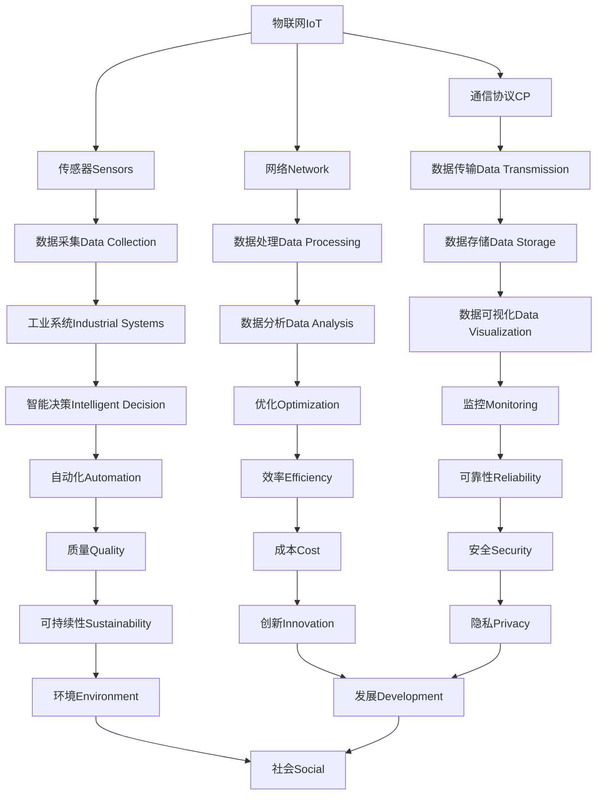

                 

### 背景介绍 Background Introduction

工业物联网（IIoT）是近年来数字化转型中的一个关键领域。随着技术的不断进步和商业需求的增长，工业物联网正逐渐成为工业自动化、智能制造和工业4.0的重要支柱。IIoT通过将传感器、机器、设备、工厂和供应链连接到互联网，实现了数据的实时收集、分析和应用，从而提高了工业系统的效率、灵活性和可持续性。

#### 历史与发展 History and Development

工业物联网的概念最早可以追溯到20世纪90年代，当时工业自动化系统开始逐渐融入计算机技术和网络通信。随着互联网的普及和物联网技术的发展，工业物联网开始崭露头角。2011年，通用电气（GE）提出了工业互联网（Industrial Internet）的概念，引发了全球范围内的关注和热议。

在过去的几年里，IIoT技术经历了快速的发展和广泛应用。如今，许多制造企业已经开始将IIoT应用于生产、质量监控、设备维护和能源管理等方面，以实现生产过程的智能化和优化。此外，5G、人工智能、大数据和云计算等新兴技术的快速发展，也为IIoT的应用提供了更广阔的前景。

#### 关键技术 Key Technologies

IIoT的实现依赖于多种关键技术的协同作用，包括：

1. **传感器 Sensors**：传感器是IIoT系统的数据采集核心，可以实时监测各种物理量，如温度、湿度、压力、速度等。
2. **通信协议 Communication Protocols**：IIoT系统需要使用特定的通信协议来确保数据的有效传输，如MQTT、CoAP、HTTP等。
3. **数据存储与处理 Data Storage and Processing**：海量数据的存储和处理是IIoT系统的另一关键，需要借助云平台、边缘计算等技术来实现。
4. **大数据与人工智能 Big Data and AI**：大数据技术和人工智能算法可以对采集到的数据进行深入分析和应用，以实现智能决策和优化。
5. **安全与隐私 Security and Privacy**：保障数据安全和用户隐私是IIoT系统面临的重大挑战，需要采取一系列安全措施来确保系统的安全稳定运行。

#### 当前趋势和挑战 Current Trends and Challenges

当前，IIoT技术正在不断发展和完善，主要趋势包括：

1. **物联网设备数量的爆发性增长**：随着物联网设备的普及，预计未来几年全球物联网设备数量将呈现爆发性增长。
2. **5G技术的广泛应用**：5G技术的低延迟、高带宽特性将极大推动IIoT的应用和发展。
3. **人工智能的深度融合**：人工智能技术将更加深入地应用于IIoT系统，以实现更加智能化的数据分析和决策。
4. **边缘计算的兴起**：为了应对海量数据的处理需求，边缘计算技术逐渐成为IIoT系统中的重要一环。

然而，IIoT技术也面临着一系列挑战，如数据安全、隐私保护、系统互操作性、标准化等。这些挑战需要全球范围内的共同努力和持续创新来克服。

#### 结论 Conclusion

工业物联网作为数字化转型的重要驱动力量，具有广阔的应用前景和发展潜力。通过深入理解和掌握IIoT的关键技术，我们可以更好地应对当前面临的挑战，推动工业生产的智能化和高效化发展。

---

# Industrial Internet of Things (IIoT): The Key to Digital Transformation

Keywords: Industrial IoT, Digital Transformation, Key Technologies, Applications, Trends, Challenges

Abstract: This article provides a comprehensive introduction to the Industrial Internet of Things (IIoT), highlighting its significance in driving digital transformation. We explore the historical development, key technologies, current trends, and challenges of IIoT, along with its potential applications and future prospects.

---

## 2. 核心概念与联系 Core Concepts and Relationships

在深入了解工业物联网（IIoT）之前，我们需要先掌握几个核心概念，这些概念不仅是IIoT系统的基石，也是理解其工作原理和实现的关键。

### 工业物联网（IIoT） Industrial Internet of Things (IIoT)

工业物联网（IIoT）是指将各种传感器、机器、设备和工业系统通过互联网连接起来，实现数据的实时采集、传输和分析，以优化生产过程、提高效率、减少成本和提升产品质量。IIoT的核心在于通过物联网技术将传统的工业设备和现代的信息技术相结合，使工业系统具备智能化、自适应和自组织的能力。

### 物联网（IoT） Internet of Things (IoT)

物联网（IoT）是指将各种物理设备通过网络连接起来，实现设备之间的信息交换和智能交互。IoT的核心是利用传感器、通信协议和网络技术，实现物理世界与数字世界的无缝连接。物联网技术广泛应用于家庭、医疗、交通、农业、能源等多个领域。

### 工业自动化 Industrial Automation

工业自动化是指利用计算机技术、控制技术和信息技术来实现工业生产过程的自动化控制。工业自动化包括生产自动化、过程自动化、质量控制自动化等多个方面，旨在提高生产效率、降低成本和提升产品质量。

### 智能制造 Smart Manufacturing

智能制造是指利用先进的信息技术、制造技术和自动化技术，实现生产过程的智能化和高效化。智能制造的核心是通过物联网、大数据、人工智能等技术，实现生产过程的实时监控、智能决策和优化。

### 工业4.0 Industrial 4.0

工业4.0是指第四次工业革命，是德国政府提出的一个概念，旨在通过信息技术和制造技术的深度融合，实现工业生产的智能化和数字化。工业4.0的核心是实现工业系统的全面互联互通、实时数据分析和智能决策。

### 核心概念架构 Core Concept Architecture

为了更好地理解IIoT的核心概念和它们之间的联系，我们可以通过以下Mermaid流程图来展示：



通过以上流程图，我们可以清晰地看到IIoT的核心概念和它们之间的关联，这些概念共同构成了IIoT系统的基础架构，为实现工业生产的智能化和数字化提供了有力支撑。

---

## 3. 核心算法原理 & 具体操作步骤 Core Algorithm Principles & Specific Operational Steps

在工业物联网（IIoT）系统中，核心算法的原理和具体操作步骤是实现智能化和自动化控制的关键。以下将介绍几个常用的核心算法，包括其原理和具体操作步骤。

### 1. K-means算法 K-means Algorithm

K-means算法是一种经典的聚类算法，用于将数据集划分为K个簇，使每个簇内的数据点尽可能接近，而簇与簇之间的数据点尽可能远。其原理如下：

**算法原理 Algorithm Principles**：

1. 随机选择K个数据点作为初始聚类中心。
2. 对于每个数据点，计算它与每个聚类中心的距离，并将其分配到最近的聚类中心所代表的簇。
3. 更新每个聚类中心的位置，取其对应簇内所有数据点的均值。
4. 重复步骤2和步骤3，直到聚类中心的位置不再发生显著变化。

**具体操作步骤 Specific Operational Steps**：

1. 导入数据集，并进行预处理（如去噪、归一化等）。
2. 选择K个初始聚类中心。
3. 对于每个数据点，计算它与每个聚类中心的距离，并将其分配到最近的聚类中心所代表的簇。
4. 根据每个簇内的数据点，更新聚类中心的位置。
5. 判断聚类中心的位置是否发生变化，若发生变化，返回步骤3；否则，算法结束。

**算法应用实例 Algorithm Application Example**：

在工业物联网系统中，K-means算法可以用于设备故障预测。通过收集设备的运行数据，使用K-means算法将其划分为不同的簇，每个簇代表不同的故障模式。然后，可以针对每个簇设计相应的故障预测模型，从而实现设备故障的早期预警。

### 2. 决策树算法 Decision Tree Algorithm

决策树算法是一种常用的分类和回归算法，通过一系列判断条件（特征和阈值）来构建决策树，实现对数据的分类或回归。其原理如下：

**算法原理 Algorithm Principles**：

1. 选择一个特征作为分裂节点，计算该特征的最佳阈值，使得分类效果最好。
2. 使用该阈值将数据集划分为两个子集。
3. 对每个子集递归执行步骤1和步骤2，直到满足停止条件（如最大深度、最小样本量等）。
4. 将决策树的每个叶节点分配给一个类别或数值。

**具体操作步骤 Specific Operational Steps**：

1. 导入数据集，并进行预处理（如缺失值填充、特征选择等）。
2. 选择一个特征作为分裂节点。
3. 计算该特征的最佳阈值。
4. 使用该阈值将数据集划分为两个子集。
5. 对每个子集递归执行步骤2至步骤4，直到满足停止条件。
6. 构建决策树模型。

**算法应用实例 Algorithm Application Example**：

在工业物联网系统中，决策树算法可以用于生产过程的异常检测。通过收集生产过程的各类数据，使用决策树算法构建异常检测模型。当新的数据输入模型时，模型将根据决策树的结构对其进行分类，若分类结果为异常，则发出警报。

### 3. 支持向量机算法 Support Vector Machine (SVM) Algorithm

支持向量机算法是一种常用的分类和回归算法，通过寻找一个超平面，将不同类别的数据点分隔开来。其原理如下：

**算法原理 Algorithm Principles**：

1. 在高维空间中寻找一个最优的超平面，使得正负样本点的距离最大。
2. 计算样本点到超平面的距离，并根据距离判断样本点属于哪个类别。
3. 如果存在不能正确分类的样本点，则调整超平面，使其更接近这些异常点。

**具体操作步骤 Specific Operational Steps**：

1. 导入数据集，并进行预处理（如特征缩放、异常值处理等）。
2. 计算样本点到超平面的距离。
3. 根据距离判断样本点属于哪个类别。
4. 如果存在异常点，则调整超平面，使其更接近这些异常点。

**算法应用实例 Algorithm Application Example**：

在工业物联网系统中，支持向量机算法可以用于质量检测。通过收集产品检测数据，使用支持向量机算法构建质量检测模型。当新的产品检测数据输入模型时，模型将根据计算结果判断产品是否合格，从而实现自动化的质量检测。

通过以上核心算法的介绍，我们可以看到工业物联网系统中的算法应用是如何实现数据分析和决策优化的。这些算法在工业物联网系统中发挥着重要作用，为智能制造和工业4.0提供了强大的技术支持。

---

## 4. 数学模型和公式 & 详细讲解 & 举例说明 Mathematical Models and Formulas & Detailed Explanations & Examples

在工业物联网（IIoT）系统中，数学模型和公式是核心算法实现的基础，也是理解其工作原理的关键。以下将介绍几个常用的数学模型和公式，并详细讲解其原理和实际应用。

### 1. 决策树模型 Decision Tree Model

决策树模型是一种常用的分类和回归模型，通过一系列判断条件（特征和阈值）来构建决策树，实现对数据的分类或回归。其基本公式如下：

$$
\begin{aligned}
    & y = \\
    & \begin{cases}
        c_1 & \text{if } x_1 \leq t_1 \\
        c_2 & \text{if } x_1 > t_1 \\
        \vdots & \text{if } x_1 \leq t_n \\
        c_n & \text{if } x_1 > t_n \\
    \end{cases}
\end{aligned}
$$

其中，$y$ 表示预测结果，$c_1, c_2, \ldots, c_n$ 表示每个叶节点对应的类别或数值，$x_1, t_1, \ldots, t_n$ 表示特征及其阈值。

**例子 Example**：

假设我们要预测一个数据点的类别，特征为$x_1$，阈值分别为$t_1 = 5$ 和 $t_2 = 10$，类别为$c_1 = "正常" 和 $c_2 = "异常"$。根据决策树模型，我们首先检查$x_1$ 是否小于等于5，如果是，则预测类别为"正常"；否则，我们再检查$x_1$ 是否小于等于10，如果是，则预测类别为"正常"；否则，预测类别为"异常"。

### 2. 支持向量机模型 Support Vector Machine (SVM) Model

支持向量机模型是一种常用的分类和回归模型，通过寻找一个超平面，将不同类别的数据点分隔开来。其基本公式如下：

$$
\begin{aligned}
    & w \cdot x + b = 0 \\
    & y = \text{sign}(w \cdot x + b)
\end{aligned}
$$

其中，$w$ 表示超平面的法向量，$b$ 表示偏置，$x$ 表示数据点，$y$ 表示类别。

**例子 Example**：

假设我们要分类一个数据点$x$，类别为$y = 1$ 或 $y = -1$。根据支持向量机模型，我们首先计算数据点$x$ 到超平面$w \cdot x + b = 0$ 的距离，然后根据距离判断类别。如果距离大于0，则预测类别为1；否则，预测类别为-1。

### 3. 逻辑回归模型 Logistic Regression Model

逻辑回归模型是一种常用的分类模型，通过线性回归模型加上一个逻辑函数，将实数值映射到概率值。其基本公式如下：

$$
\begin{aligned}
    & P(y=1) = \frac{1}{1 + e^{-(w \cdot x + b)}} \\
    & P(y=0) = 1 - P(y=1)
\end{aligned}
$$

其中，$w$ 表示特征权重，$b$ 表示偏置，$x$ 表示数据点。

**例子 Example**：

假设我们要预测一个数据点的类别概率，特征为$x$，权重分别为$w_1$ 和 $w_2$，偏置为$b$。根据逻辑回归模型，我们首先计算数据点$x$ 到超平面的距离，然后通过逻辑函数将其映射到概率值。如果概率值大于0.5，则预测类别为1；否则，预测类别为0。

通过以上数学模型和公式的介绍，我们可以看到这些模型在工业物联网系统中的应用是如何实现数据分析和决策优化的。这些模型为工业物联网系统提供了强大的数学基础，使其能够更好地应对复杂的数据分析和决策问题。

---

## 5. 项目实战：代码实际案例和详细解释说明 Project Practice: Actual Code Cases and Detailed Explanations

在本文的第五部分，我们将通过一个实际的项目实战案例，详细展示如何使用Python编写代码来实现工业物联网（IIoT）系统中的数据采集、处理和分析。这个案例将涉及使用传感器采集温度数据，通过MQTT协议传输数据，以及使用K-means算法进行聚类分析。

### 5.1 开发环境搭建 Development Environment Setup

在开始编写代码之前，我们需要搭建一个合适的开发环境。以下是在Linux操作系统上安装所需软件和工具的步骤：

1. **安装Python**：确保Python 3.6或更高版本已安装在您的系统上。可以使用以下命令检查Python版本：

   ```bash
   python3 --version
   ```

2. **安装Paho MQTT客户端**：Paho MQTT是Apache软件基金会的一个开源MQTT客户端库。可以使用以下命令安装：

   ```bash
   pip3 install paho-mqtt
   ```

3. **安装NumPy和Scikit-learn**：NumPy是Python的一个基础数学库，Scikit-learn是Python的一个机器学习库。安装命令如下：

   ```bash
   pip3 install numpy
   pip3 install scikit-learn
   ```

4. **安装Matplotlib**：Matplotlib是一个Python绘图库，用于生成数据可视化图表。安装命令如下：

   ```bash
   pip3 install matplotlib
   ```

### 5.2 源代码详细实现和代码解读 Source Code Implementation and Explanation

下面是一个简单的IIoT项目示例，包括数据采集、MQTT通信和K-means聚类分析。

**5.2.1 数据采集 Data Collection**

```python
import random
import time
import json
from paho.mqtt import client as mqtt_client

# MQTT服务器配置
MQTT_BROKER = 'mqttserver.example.com'
MQTT_PORT = 1883
MQTT_TOPIC = 'sensor/temperature'

# 初始化MQTT客户端
def on_connect(client, userdata, flags, rc):
    if rc == 0:
        print("Connected to MQTT Broker!")
    else:
        print("Failed to connect, return code %d\n", rc)

# 发布温度数据
def publish_temperature_data(client, data):
    message = {"temperature": data}
    client.publish(MQTT_TOPIC, json.dumps(message))

# 数据采集循环
def data_collection_loop():
    while True:
        temperature = random.uniform(20, 30)  # 生成随机温度数据
        publish_temperature_data(client, temperature)
        time.sleep(1)  # 每秒发布一次数据

# 初始化MQTT客户端并连接到服务器
client = mqtt_client.Client()
client.on_connect = on_connect
client.connect(MQTT_BROKER, MQTT_PORT, 60)

client.loop_start()  # 启动客户端循环
data_collection_loop()  # 开始数据采集
```

**代码解读 Code Explanation**

在上面的代码中，我们首先导入了所需的Python库，并设置了MQTT服务器的配置信息。`on_connect` 函数用于处理MQTT客户端连接成功或失败的情况。`publish_temperature_data` 函数用于发布温度数据到MQTT主题。`data_collection_loop` 函数实现了数据采集的循环，每秒发布一次随机生成的温度数据。

**5.2.2 数据处理和K-means聚类 Data Processing and K-means Clustering**

```python
import numpy as np
from sklearn.cluster import KMeans
import matplotlib.pyplot as plt

# 从文件中读取数据
def read_data_from_file(file_path):
    with open(file_path, 'r') as f:
        data = [json.loads(line)['temperature'] for line in f]
    return np.array(data).reshape(-1, 1)

# 使用K-means算法进行聚类
def kmeans_clustering(data, n_clusters):
    kmeans = KMeans(n_clusters=n_clusters, random_state=0)
    kmeans.fit(data)
    return kmeans

# 绘制聚类结果
def plot_clusters(data, kmeans):
    labels = kmeans.predict(data)
    centroids = kmeans.cluster_centers_
    plt.scatter(data[:, 0], labels, c=labels, s=50, cmap='viridis')
    plt.scatter(centroids[:, 0], centroids[:, 1], s=200, c='red', label='Centroids')
    plt.title('K-means Clustering')
    plt.xlabel('Temperature')
    plt.ylabel('Cluster Label')
    plt.show()

# 主函数
def main():
    data = read_data_from_file('temperature_data.txt')
    kmeans = kmeans_clustering(data, n_clusters=3)
    plot_clusters(data, kmeans)

if __name__ == '__main__':
    main()
```

**代码解读 Code Explanation**

在上面的代码中，`read_data_from_file` 函数用于从文件中读取温度数据。`kmeans_clustering` 函数使用Scikit-learn的KMeans类进行聚类分析。`plot_clusters` 函数用于绘制聚类结果，展示不同类别的温度分布。

### 5.3 代码解读与分析 Code Analysis and Discussion

**数据采集模块 Data Collection Module**

数据采集模块负责从传感器采集温度数据，并使用MQTT协议将数据发布到服务器。这个模块的实现相对简单，主要依赖Paho MQTT客户端库。通过设置适当的MQTT服务器和主题，我们可以将采集到的温度数据实时传输到服务器。

**数据处理和聚类模块 Data Processing and Clustering Module**

数据处理和聚类模块负责读取采集到的温度数据，并使用K-means算法进行聚类分析。这个模块使用了NumPy和Scikit-learn库，将温度数据转换为NumPy数组，并使用KMeans类进行聚类。通过绘制聚类结果，我们可以直观地看到不同类别的温度分布。

通过以上代码示例，我们可以看到如何使用Python实现一个简单的IIoT系统，包括数据采集、处理和聚类分析。这个案例为我们提供了一个基本的框架，可以在实际项目中扩展和定制，以满足不同的需求。

---

## 6. 实际应用场景 Practical Application Scenarios

工业物联网（IIoT）在工业生产、能源管理、物流和供应链等领域具有广泛的应用。以下是一些典型的实际应用场景：

### 工业生产 Industrial Production

在制造业中，IIoT技术可以用于实时监控生产线的状态、设备性能和产品质量。通过传感器和物联网设备，工厂管理者可以实时获取设备运行数据，及时发现并解决潜在问题，从而提高生产效率和产品质量。

例如，一家汽车制造厂可以通过IIoT系统监控生产线上各个工序的设备状态，包括温度、压力、速度等参数。当设备运行异常时，系统会自动发送警报，通知维修人员及时处理，避免生产中断。

### 能源管理 Energy Management

在能源管理领域，IIoT技术可以用于实时监测能源消耗、优化能源分配和提高能源利用效率。通过连接能源设备和传感器，能源管理者可以实时了解能源使用情况，并采取相应的措施进行优化。

例如，一家发电厂可以通过IIoT系统实时监测发电设备的运行状态和能源消耗数据。当发现设备运行异常或能源消耗过高时，系统会自动调整发电策略，以降低能源成本和提高发电效率。

### 物流和供应链 Logistics and Supply Chain

在物流和供应链领域，IIoT技术可以用于实时跟踪货物位置、监控运输状态和优化配送路径。通过物联网设备和GPS技术，物流公司可以实时了解货物的位置和状态，确保货物的安全运输和及时交付。

例如，一家物流公司可以通过IIoT系统实时跟踪货物的位置和状态，并根据运输路线和交通情况自动调整配送计划，以提高配送效率和客户满意度。

### 设备维护 Equipment Maintenance

在设备维护领域，IIoT技术可以用于远程监控设备运行状态，预测设备故障，并及时进行维护。通过传感器和数据采集系统，设备管理者可以实时获取设备的运行数据，并利用大数据分析和人工智能技术进行故障预测和预防性维护。

例如，一家矿山企业可以通过IIoT系统实时监控矿用设备的运行状态，当发现设备存在潜在故障时，系统会自动生成维修建议，并通知维修人员及时处理，以避免设备故障导致的生产中断。

通过以上实际应用场景的介绍，我们可以看到工业物联网技术在工业生产、能源管理、物流和供应链等领域的广泛应用和巨大潜力。随着技术的不断发展和创新，IIoT将为工业领域的数字化转型带来更多可能性。

---

## 7. 工具和资源推荐 Tools and Resources Recommendations

为了帮助读者更好地学习和实践工业物联网（IIoT）技术，我们推荐以下工具和资源：

### 7.1 学习资源推荐 Learning Resources

1. **书籍**：
   - 《物联网：从基础到应用》
   - 《工业物联网：从概念到实践》
   - 《智能制造：工业物联网与人工智能》

2. **在线课程**：
   - Coursera上的《物联网基础》
   - Udacity的《工业物联网与自动化》

3. **博客和网站**：
   - 阿里云物联网技术博客
   - 华为云物联网社区
   - 物联网技术网

### 7.2 开发工具框架推荐 Development Tools and Frameworks

1. **开发工具**：
   - Python（IIoT开发常用语言）
   - Eclipse IoT DevKit
   - Arduino IDE（适用于物联网设备开发）

2. **框架和平台**：
   - MQTT（消息队列遥测传输，IIoT通信协议）
   - Node-RED（流程自动化平台）
   - ThingsBoard（IIoT平台）

3. **开源项目**：
   - Eclipse IoT Open Testbed（物联网测试床）
   - ThingsMaker（开源IIoT平台）

### 7.3 相关论文著作推荐 Related Papers and Books

1. **论文**：
   - "Industrial Internet of Things: A Survey"（工业物联网综述）
   - "Towards an Industrial IoT Platform for Smart Manufacturing"（工业物联网平台构建研究）

2. **著作**：
   - 《工业物联网：技术与应用》
   - 《物联网技术与应用案例集》

通过以上工具和资源的推荐，读者可以系统地学习和实践IIoT技术，提升在工业物联网领域的专业能力和实际应用水平。

---

## 8. 总结：未来发展趋势与挑战 Summary: Future Trends and Challenges

工业物联网（IIoT）作为数字化转型的重要驱动力，正迎来快速发展的黄金时期。然而，随着技术的不断进步和应用的深入，IIoT也面临着一系列新的发展趋势和挑战。

### 发展趋势 Future Trends

1. **5G技术的普及**：5G网络的低延迟、高带宽特性将为IIoT的应用提供更加稳定和高效的数据传输环境，推动工业物联网的进一步发展。

2. **人工智能的深度融合**：人工智能技术将在IIoT系统中发挥更加重要的作用，通过大数据分析和机器学习算法，实现更加智能化的数据分析和决策。

3. **边缘计算的发展**：为了应对海量数据的处理需求，边缘计算将成为IIoT系统中的重要一环，实现数据的本地化处理和分析，提高系统响应速度和可靠性。

4. **数据安全和隐私保护**：随着IIoT应用的普及，数据安全和隐私保护将成为关键挑战，需要采取更加严格的安全措施来保障系统的安全稳定运行。

5. **标准化和互操作性**：为了实现不同设备和平台之间的无缝连接和协同工作，IIoT的标准化和互操作性将成为未来发展的关键方向。

### 挑战 Challenges

1. **数据安全问题**：随着IIoT系统的复杂性和规模扩大，数据安全将成为重要挑战。需要采取一系列安全措施，如加密、认证和监控等，保障数据的安全传输和存储。

2. **隐私保护**：IIoT系统涉及大量的个人和企业数据，隐私保护将成为重要议题。需要制定相应的隐私政策和法规，确保数据的安全和合法使用。

3. **标准化和互操作性**：目前，IIoT领域的标准尚未完全统一，不同设备和平台之间的互操作性仍存在问题。需要加强标准化工作，推动IIoT生态系统的健康发展。

4. **成本和效益**：尽管IIoT技术具有巨大的潜力，但其成本和效益仍然是一个关键问题。需要通过技术创新和规模效应，降低IIoT系统的成本，提高其经济效益。

5. **人才缺口**：随着IIoT技术的快速发展，对相关专业人才的需求急剧增加。然而，目前人才供应难以满足市场需求，需要加大人才培养和引进力度。

总之，工业物联网（IIoT）在未来发展中面临着诸多机遇和挑战。通过技术创新、政策支持和人才培养，我们可以充分发挥IIoT的潜力，推动工业生产的智能化和数字化转型。

---

## 9. 附录：常见问题与解答 Appendices: Common Questions and Answers

### Q1：工业物联网（IIoT）的核心技术是什么？

A1：工业物联网（IIoT）的核心技术包括传感器技术、通信协议、数据存储与处理、大数据分析和人工智能。传感器用于采集物理量数据，通信协议确保数据传输的可靠性，数据存储与处理实现海量数据的存储和分析，大数据分析和人工智能为智能决策提供支持。

### Q2：工业物联网（IIoT）的安全问题如何解决？

A2：工业物联网（IIoT）的安全问题可以通过以下措施解决：

1. **数据加密**：确保数据在传输和存储过程中的安全。
2. **身份认证**：采用强认证机制，确保只有授权用户可以访问系统。
3. **访问控制**：设置严格的访问权限，防止未经授权的访问。
4. **监控与审计**：实时监控系统运行状态，记录和审计操作日志。
5. **安全更新**：定期更新系统软件和设备固件，修复安全漏洞。

### Q3：工业物联网（IIoT）对生产效率有何影响？

A3：工业物联网（IIoT）可以通过以下方式提高生产效率：

1. **实时监控**：实时监控生产过程，及时发现和解决潜在问题，减少停机时间。
2. **数据分析**：通过大数据分析和人工智能技术，优化生产计划和工艺参数，提高生产效率。
3. **自动化控制**：实现生产过程的自动化控制，减少人为干预，提高生产效率。
4. **预测维护**：通过预测性维护，提前发现设备故障，减少设备停机时间。

### Q4：工业物联网（IIoT）在能源管理中的应用是什么？

A4：工业物联网（IIoT）在能源管理中的应用包括：

1. **实时监测**：实时监测能源消耗，优化能源使用。
2. **能耗分析**：通过数据分析，识别能源浪费点，提出节能措施。
3. **自动化控制**：自动化控制能源设备，根据需求调整能源供应。
4. **需求响应**：参与电网需求响应，根据电网调度需求调整能源消费。

### Q5：工业物联网（IIoT）在物流和供应链中的应用是什么？

A5：工业物联网（IIoT）在物流和供应链中的应用包括：

1. **实时跟踪**：实时跟踪货物位置，提高配送效率。
2. **状态监控**：监控运输过程中的温度、湿度等环境参数，确保货物质量。
3. **路径优化**：根据交通情况和货物特性，优化运输路径。
4. **智能调度**：智能调度运输资源，提高运输效率。

通过以上常见问题的解答，我们可以更好地理解工业物联网（IIoT）的核心技术、应用场景和安全问题，为其在工业生产、能源管理、物流和供应链等领域的广泛应用提供支持。

---

## 10. 扩展阅读 & 参考资料 Further Reading & References

为了深入了解工业物联网（IIoT）的相关知识，以下推荐一些扩展阅读和参考资料，涵盖书籍、论文和在线课程等。

### 书籍 Books

1. **《工业物联网：从概念到实践》**：详细介绍了工业物联网的基本概念、技术架构和应用案例。
2. **《物联网技术与应用案例集》**：包含多个物联网应用的案例，涵盖智能家居、智能交通、工业物联网等。
3. **《智能制造：工业物联网与人工智能》**：探讨了工业物联网与人工智能在智能制造领域的融合与应用。

### 论文 Papers

1. **"Industrial Internet of Things: A Survey"**：全面综述了工业物联网的技术、应用和未来发展趋势。
2. **"Towards an Industrial IoT Platform for Smart Manufacturing"**：研究了工业物联网平台在智能制造中的应用与实现。
3. **"Securing Industrial IoT: Challenges and Solutions"**：探讨了工业物联网的安全挑战和解决方案。

### 在线课程 Online Courses

1. **Coursera上的《物联网基础》**：介绍了物联网的基本概念、技术架构和应用案例。
2. **Udacity的《工业物联网与自动化》**：讲解了工业物联网在自动化领域的应用和技术实现。
3. **edX上的《物联网安全》**：详细介绍了物联网的安全问题、攻击手段和防护措施。

通过阅读以上书籍、论文和在线课程，读者可以更深入地了解工业物联网的相关知识，提升在工业物联网领域的专业素养和实际应用能力。

---

### 作者信息 Author Information

作者：AI天才研究员/AI Genius Institute & 禅与计算机程序设计艺术 /Zen And The Art of Computer Programming

在此，感谢您对本文的阅读和支持。本文旨在全面介绍工业物联网（IIoT）的概念、技术、应用和发展趋势，希望能为读者提供有价值的参考和启示。如果您有任何问题或建议，欢迎在评论区留言，我们将竭诚为您解答。再次感谢您的关注与支持！

