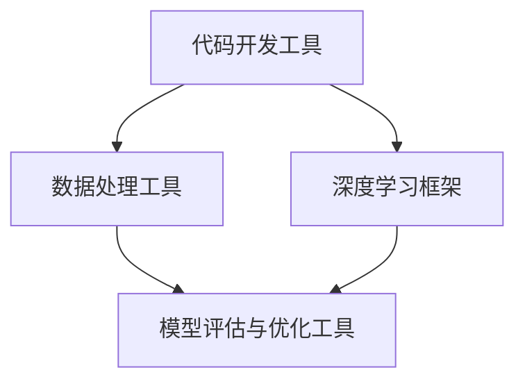

                 

### 文章标题

**工具使用在 AI Agent 中的重要性**

### 关键词

- AI Agent
- 工具
- 人工智能
- 自动化
- 代码开发
- 数据分析
- 算法优化

### 摘要

本文将深入探讨工具使用在 AI Agent 中的重要性。通过分析不同工具的作用和优势，我们将探讨如何利用这些工具提升 AI Agent 的性能和效率。文章将涵盖工具的选型、使用方法、实际案例以及未来发展趋势等内容，为 AI Agent 开发者提供实用的指导和建议。

## 1. 背景介绍

### AI Agent 的定义与作用

AI Agent 是一种基于人工智能技术的智能体，它能够通过自主学习和决策，在复杂环境中执行特定任务。AI Agent 的应用范围非常广泛，包括但不限于自动驾驶、智能客服、智能推荐系统、游戏AI等。随着人工智能技术的不断发展，AI Agent 正逐渐成为各个领域的核心驱动力。

### 工具在 AI Agent 中的作用

工具在 AI Agent 的开发过程中起着至关重要的作用。首先，工具可以帮助开发者更高效地完成代码编写和调试工作。例如，集成开发环境（IDE）和版本控制系统等工具，可以大大提高开发效率和代码质量。其次，工具可以帮助开发者更好地处理和分析数据。数据分析工具如 Jupyter Notebook、Pandas 等，能够方便地处理复杂数据，提取有价值的信息。此外，工具还可以帮助开发者优化算法，提高 AI Agent 的性能。例如，TensorFlow 和 PyTorch 等深度学习框架，提供了丰富的算法实现和优化方法。

### 当前 AI Agent 工具的发展状况

目前，AI Agent 工具的发展已经相当成熟。在代码开发方面，Python、Java、C++ 等编程语言已经成为 AI Agent 开发的首选。在集成开发环境方面，PyCharm、Visual Studio Code 等工具已经成为开发者必备的利器。在数据分析方面，Pandas、NumPy 等库提供了强大的数据处理能力。在深度学习框架方面，TensorFlow、PyTorch、Keras 等框架已经成为业界主流。总之，当前 AI Agent 工具的发展已经为开发者提供了丰富的选择，使得 AI Agent 的开发变得更加简单和高效。

## 2. 核心概念与联系

### 2.1 工具分类

在 AI Agent 的开发过程中，工具可以大致分为以下几类：

1. **代码开发工具**：包括集成开发环境（IDE）、代码编辑器、版本控制系统等。
2. **数据处理工具**：包括数据分析库、数据可视化工具等。
3. **深度学习框架**：包括 TensorFlow、PyTorch、Keras 等。
4. **模型评估与优化工具**：包括模型评估指标、超参数调优工具等。

### 2.2 工具之间的联系

这些工具之间并不是孤立的，而是相互关联、协同作用的。例如，在开发 AI Agent 时，开发者首先需要使用代码开发工具编写代码，然后使用数据处理工具处理数据，接着使用深度学习框架训练模型，最后使用模型评估与优化工具对模型进行评估和优化。

下面是一个简单的 Mermaid 流程图，展示了这些工具之间的联系：



### 2.3 工具选择与使用

选择合适的工具对于 AI Agent 的开发至关重要。以下是一些关于工具选择与使用的建议：

1. **代码开发工具**：根据开发者的喜好和项目需求选择 IDE 或代码编辑器。例如，PyCharm 和 Visual Studio Code 是两款功能强大的 Python IDE。
2. **数据处理工具**：根据数据处理的需求选择合适的库或工具。例如，Pandas 和 NumPy 是两款常用的 Python 数据处理库。
3. **深度学习框架**：根据项目的需求和开发者的熟悉程度选择深度学习框架。例如，TensorFlow 和 PyTorch 是两款广泛使用的深度学习框架。
4. **模型评估与优化工具**：根据模型评估和优化需求选择相应的工具。例如，TensorBoard 是一款用于模型可视化和分析的工具，而 Hyperopt 是一款超参数调优工具。

通过合理选择和使用这些工具，开发者可以大大提高 AI Agent 的开发效率和质量。

## 3. 核心算法原理 & 具体操作步骤

### 3.1 数据处理算法

数据处理是 AI Agent 开发过程中的关键环节。以下是一个常见的数据处理算法：

1. **数据清洗**：去除重复数据、处理缺失值、修正错误数据等。
2. **数据预处理**：包括数据标准化、归一化、分箱、特征工程等。
3. **数据整合**：将不同来源的数据进行整合，构建统一的数据集。

具体操作步骤如下：

1. **数据清洗**：
    - 使用 Pandas 库删除重复数据：
      ```python
      df = df.drop_duplicates()
      ```
    - 使用 Pandas 库填充缺失值：
      ```python
      df = df.fillna(method='ffill')
      ```
2. **数据预处理**：
    - 使用 Scikit-learn 库进行数据标准化：
      ```python
      from sklearn.preprocessing import StandardScaler
      scaler = StandardScaler()
      df_scaled = scaler.fit_transform(df)
      ```
    - 使用 Pandas 库进行特征工程：
      ```python
      df['new_feature'] = df['feature1'] * df['feature2']
      ```
3. **数据整合**：
    - 使用 Pandas 库进行数据整合：
      ```python
      df = df1.merge(df2, on='common_column')
      ```

### 3.2 深度学习算法

深度学习是 AI Agent 的核心技术。以下是一个简单的深度学习算法：

1. **模型构建**：定义神经网络结构。
2. **模型训练**：使用训练数据训练模型。
3. **模型评估**：使用测试数据评估模型性能。

具体操作步骤如下：

1. **模型构建**：
    - 使用 PyTorch 库构建神经网络：
      ```python
      import torch
      import torch.nn as nn
      class NeuralNetwork(nn.Module):
          def __init__(self):
              super(NeuralNetwork, self).__init__()
              self.layer1 = nn.Linear(in_features=10, out_features=50)
              self.layer2 = nn.Linear(in_features=50, out_features=1)
          def forward(self, x):
              x = self.layer1(x)
              x = self.layer2(x)
              return x
      ```
2. **模型训练**：
    - 定义损失函数和优化器：
      ```python
      criterion = nn.MSELoss()
      optimizer = torch.optim.Adam(model.parameters(), lr=0.001)
      ```
    - 训练模型：
      ```python
      for epoch in range(num_epochs):
          for inputs, targets in train_loader:
              optimizer.zero_grad()
              outputs = model(inputs)
              loss = criterion(outputs, targets)
              loss.backward()
              optimizer.step()
      ```
3. **模型评估**：
    - 使用测试数据评估模型性能：
      ```python
      with torch.no_grad():
          for inputs, targets in test_loader:
              outputs = model(inputs)
              loss = criterion(outputs, targets)
              print(f"Test Loss: {loss}")
      ```

通过以上步骤，我们可以构建一个简单的深度学习模型，并对模型进行训练和评估。

## 4. 数学模型和公式 & 详细讲解 & 举例说明

### 4.1 数据处理数学模型

在数据处理过程中，常用的数学模型包括线性回归、逻辑回归、支持向量机等。以下以线性回归为例，介绍其数学模型和详细讲解。

#### 4.1.1 线性回归模型

线性回归模型旨在找到一条直线，使得数据点尽可能地分布在直线的附近。其数学模型可以表示为：

$$
y = \beta_0 + \beta_1 \cdot x
$$

其中，$y$ 为因变量，$x$ 为自变量，$\beta_0$ 和 $\beta_1$ 分别为模型的参数。

#### 4.1.2 模型参数估计

为了估计模型参数 $\beta_0$ 和 $\beta_1$，我们可以使用最小二乘法（Least Squares Method）。最小二乘法的思想是找到一条直线，使得所有数据点到直线的垂直距离的平方和最小。

具体计算过程如下：

1. **计算斜率 $\beta_1$**：

$$
\beta_1 = \frac{\sum_{i=1}^{n} (x_i - \bar{x})(y_i - \bar{y})}{\sum_{i=1}^{n} (x_i - \bar{x})^2}
$$

其中，$n$ 为数据点的个数，$\bar{x}$ 和 $\bar{y}$ 分别为自变量和因变量的平均值。

2. **计算截距 $\beta_0$**：

$$
\beta_0 = \bar{y} - \beta_1 \cdot \bar{x}
$$

#### 4.1.3 线性回归模型应用

以下是一个简单的线性回归模型应用示例。假设我们有一组数据，自变量为 $x$，因变量为 $y$，我们需要建立线性回归模型来预测 $y$。

```python
import numpy as np
import matplotlib.pyplot as plt

# 数据
x = np.array([1, 2, 3, 4, 5])
y = np.array([2, 4, 5, 4, 5])

# 求斜率 β1
x_mean = np.mean(x)
y_mean = np.mean(y)
beta_1 = (np.sum((x - x_mean) * (y - y_mean)) / np.sum((x - x_mean)**2))

# 求截距 β0
beta_0 = y_mean - beta_1 * x_mean

# 模型方程
model_equation = f'y = {beta_0:.2f} + {beta_1:.2f} \cdot x'

# 绘制模型
plt.scatter(x, y)
plt.plot(x, beta_0 + beta_1 * x, color='red')
plt.xlabel('x')
plt.ylabel('y')
plt.title('Linear Regression Model')
plt.show()

print(f'Model equation: {model_equation}')
```

运行上述代码，我们可以得到线性回归模型的方程，并绘制出拟合直线。

### 4.2 深度学习数学模型

在深度学习中，常用的数学模型包括神经网络、卷积神经网络（CNN）、循环神经网络（RNN）等。以下以卷积神经网络为例，介绍其数学模型和详细讲解。

#### 4.2.1 卷积神经网络模型

卷积神经网络（Convolutional Neural Network，CNN）是一种在图像识别和分类任务中表现优异的神经网络模型。其核心思想是使用卷积操作提取图像的特征。

1. **卷积操作**：

卷积操作的目的是将输入图像与卷积核进行卷积，提取图像的特征。卷积操作的数学模型可以表示为：

$$
\text{output}(i, j) = \sum_{k=1}^{m} \sum_{l=1}^{n} w_{k, l} \cdot \text{input}(i - k + 1, j - l + 1)
$$

其中，$i$ 和 $j$ 分别为输出特征图的行和列索引，$m$ 和 $n$ 分别为卷积核的大小，$w_{k, l}$ 为卷积核的权重。

2. **池化操作**：

池化操作的目的是降低特征图的维度，减少计算量。常见的池化操作有最大池化和平均池化。

最大池化操作的数学模型可以表示为：

$$
\text{output}(i, j) = \max \left\{ \text{input}(i - s + 1, j - s + 1) : 1 \leq s \leq \frac{\text{input size}}{\text{pool size}} \right\}
$$

其中，$s$ 为池化窗口的大小。

3. **全连接层**：

全连接层将卷积操作和池化操作提取的特征进行整合，输出最终的结果。全连接层的数学模型可以表示为：

$$
\text{output} = \sum_{i=1}^{n} w_{i} \cdot \text{input}_{i} + b
$$

其中，$n$ 为输入特征的维度，$w_{i}$ 为全连接层的权重，$b$ 为偏置项。

#### 4.2.2 卷积神经网络模型应用

以下是一个简单的卷积神经网络模型应用示例。假设我们有一个 $28 \times 28$ 的图像，我们需要使用卷积神经网络对其进行分类。

```python
import torch
import torch.nn as nn
import torch.optim as optim
import torchvision
import torchvision.transforms as transforms

# 数据
transform = transforms.Compose([transforms.ToTensor()])
trainset = torchvision.datasets.MNIST(root='./data', train=True, download=True, transform=transform)
trainloader = torch.utils.data.DataLoader(trainset, batch_size=100, shuffle=True, num_workers=2)

# 模型
class CNN(nn.Module):
    def __init__(self):
        super(CNN, self).__init__()
        self.conv1 = nn.Conv2d(1, 32, 3, 1)
        self.conv2 = nn.Conv2d(32, 64, 3, 1)
        self.fc1 = nn.Linear(64 * 6 * 6, 128)
        self.fc2 = nn.Linear(128, 10)
        self.dropout = nn.Dropout(0.5)
        
    def forward(self, x):
        x = self.conv1(x)
        x = nn.functional.relu(x)
        x = self.conv2(x)
        x = nn.functional.relu(x)
        x = nn.functional.max_pool2d(x, 2)
        x = self.dropout(x)
        x = torch.flatten(x, 1)
        x = self.fc1(x)
        x = nn.functional.relu(x)
        x = self.fc2(x)
        return x

model = CNN()
optimizer = optim.Adam(model.parameters(), lr=0.001)
criterion = nn.CrossEntropyLoss()

# 训练模型
for epoch in range(10):
    running_loss = 0.0
    for inputs, targets in trainloader:
        optimizer.zero_grad()
        outputs = model(inputs)
        loss = criterion(outputs, targets)
        loss.backward()
        optimizer.step()
        running_loss += loss.item()
    print(f'Epoch {epoch + 1}, Loss: {running_loss / len(trainloader)}')

# 评估模型
with torch.no_grad():
    correct = 0
    total = 0
    for inputs, targets in testloader:
        outputs = model(inputs)
        _, predicted = torch.max(outputs.data, 1)
        total += targets.size(0)
        correct += (predicted == targets).sum().item()
    print(f'Accuracy of the network on the 10000 test images: {100 * correct / total}%')
```

运行上述代码，我们可以训练一个简单的卷积神经网络模型，并在测试数据上评估其性能。

## 5. 项目实战：代码实际案例和详细解释说明

### 5.1 开发环境搭建

在开始项目实战之前，我们需要搭建一个合适的开发环境。以下是搭建开发环境的步骤：

1. 安装 Python（版本 3.7 或以上）
2. 安装 PyTorch（根据你的硬件配置选择 CPU 或 GPU 版本）
3. 安装 Jupyter Notebook
4. 安装相关库，如 Pandas、NumPy、Matplotlib、TensorFlow 等

以下是一个简单的安装命令示例：

```bash
# 安装 Python
curl -O https://www.python.org/ftp/python/3.8.5/python-3.8.5.tar.xz
tar xf python-3.8.5.tar.xz
cd python-3.8.5
./configure
make
sudo make install

# 安装 PyTorch
pip install torch torchvision torchaudio

# 安装 Jupyter Notebook
pip install notebook

# 安装相关库
pip install pandas numpy matplotlib
```

### 5.2 源代码详细实现和代码解读

以下是一个简单的 AI Agent 项目示例，我们将使用 PyTorch 框架实现一个用于手写数字识别的卷积神经网络（CNN）。

**源代码**：

```python
import torch
import torch.nn as nn
import torch.optim as optim
import torchvision
import torchvision.transforms as transforms

# 数据
transform = transforms.Compose([transforms.ToTensor()])
trainset = torchvision.datasets.MNIST(root='./data', train=True, download=True, transform=transform)
trainloader = torch.utils.data.DataLoader(trainset, batch_size=100, shuffle=True, num_workers=2)
testset = torchvision.datasets.MNIST(root='./data', train=False, download=True, transform=transform)
testloader = torch.utils.data.DataLoader(testset, batch_size=100, shuffle=False, num_workers=2)

# 模型
class CNN(nn.Module):
    def __init__(self):
        super(CNN, self).__init__()
        self.conv1 = nn.Conv2d(1, 32, 3, 1)
        self.conv2 = nn.Conv2d(32, 64, 3, 1)
        self.fc1 = nn.Linear(64 * 6 * 6, 128)
        self.fc2 = nn.Linear(128, 10)
        self.dropout = nn.Dropout(0.5)
        
    def forward(self, x):
        x = self.conv1(x)
        x = nn.functional.relu(x)
        x = self.conv2(x)
        x = nn.functional.relu(x)
        x = nn.functional.max_pool2d(x, 2)
        x = self.dropout(x)
        x = torch.flatten(x, 1)
        x = self.fc1(x)
        x = nn.functional.relu(x)
        x = self.fc2(x)
        return x

model = CNN()
optimizer = optim.Adam(model.parameters(), lr=0.001)
criterion = nn.CrossEntropyLoss()

# 训练模型
for epoch in range(10):
    running_loss = 0.0
    for inputs, targets in trainloader:
        optimizer.zero_grad()
        outputs = model(inputs)
        loss = criterion(outputs, targets)
        loss.backward()
        optimizer.step()
        running_loss += loss.item()
    print(f'Epoch {epoch + 1}, Loss: {running_loss / len(trainloader)}')

# 评估模型
with torch.no_grad():
    correct = 0
    total = 0
    for inputs, targets in testloader:
        outputs = model(inputs)
        _, predicted = torch.max(outputs.data, 1)
        total += targets.size(0)
        correct += (predicted == targets).sum().item()
    print(f'Accuracy of the network on the 10000 test images: {100 * correct / total}%')
```

**代码解读**：

1. **数据准备**：我们首先从 torchvision.datasets 中加载 MNIST 数据集，并将其分为训练集和测试集。数据预处理步骤包括将图像转换为 Tensor 格式，并使用 DataLoader 分成批次。

2. **模型定义**：我们定义了一个简单的卷积神经网络（CNN）模型，包括两个卷积层、一个全连接层和两个全连接层。卷积层用于提取图像特征，全连接层用于分类。

3. **训练模型**：我们使用 Adam 优化器和交叉熵损失函数来训练模型。每个 epoch 中，我们遍历训练集，更新模型参数，并计算训练损失。

4. **评估模型**：在训练完成后，我们使用测试集对模型进行评估。计算模型的准确率，以验证模型的性能。

### 5.3 代码解读与分析

**5.3.1 模型架构**

本示例中的卷积神经网络模型包含以下结构：

1. **卷积层 1**：使用一个 $3 \times 3$ 的卷积核，从输入的 1 个通道（灰度图像）提取特征，输出 32 个通道的特征图。
2. **激活函数**：使用 ReLU 激活函数，将卷积层输出的特征图进行非线性变换。
3. **卷积层 2**：使用一个 $3 \times 3$ 的卷积核，从输入的 32 个通道提取特征，输出 64 个通道的特征图。
4. **激活函数**：使用 ReLU 激活函数，将卷积层输出的特征图进行非线性变换。
5. **最大池化层**：使用一个 $2 \times 2$ 的池化窗口进行最大池化，减少特征图的维度。
6. **全连接层 1**：将特征图展平为一维向量，并输入到全连接层中，输出 128 个神经元。
7. **激活函数**：使用 ReLU 激活函数，将全连接层输出的特征进行非线性变换。
8. **全连接层 2**：将全连接层 1 的输出输入到全连接层 2 中，输出 10 个神经元，对应于 10 个类别。
9. **输出层**：使用 Softmax 激活函数对全连接层 2 的输出进行归一化，以得到每个类别的概率分布。

**5.3.2 模型训练**

在模型训练过程中，我们使用以下步骤：

1. **前向传播**：输入训练数据到模型，计算模型输出。
2. **计算损失**：使用交叉熵损失函数计算模型输出与真实标签之间的损失。
3. **反向传播**：计算损失关于模型参数的梯度。
4. **更新参数**：使用 Adam 优化器更新模型参数，以最小化损失。

**5.3.3 模型评估**

在模型评估过程中，我们使用以下步骤：

1. **前向传播**：输入测试数据到模型，计算模型输出。
2. **计算预测结果**：使用 Softmax 函数对模型输出进行归一化，得到每个类别的概率分布。
3. **计算准确率**：计算模型预测结果与真实标签之间的准确率。

## 6. 实际应用场景

### 6.1 自动驾驶

在自动驾驶领域，AI Agent 的使用至关重要。工具如 TensorFlow 和 PyTorch 等深度学习框架可以帮助开发者实现自动驾驶车辆的感知、决策和执行功能。通过使用这些工具，开发者可以快速构建和优化自动驾驶模型，提高车辆的行驶安全性。

### 6.2 智能客服

智能客服是 AI Agent 的重要应用场景之一。工具如 Rasa 和 ChatterBot 等自然语言处理框架可以帮助开发者快速构建和部署智能客服系统。通过使用这些工具，开发者可以实现自动化的客户服务，提高客户满意度。

### 6.3 智能推荐系统

智能推荐系统是 AI Agent 的另一个重要应用场景。工具如 TensorFlow 和 PyTorch 等深度学习框架可以帮助开发者实现高效的推荐算法，从而提高推荐系统的准确性和用户体验。

### 6.4 游戏 AI

游戏 AI 是 AI Agent 的一个有趣的应用场景。工具如 Unity 和 PyTorch 等游戏开发工具和深度学习框架可以帮助开发者实现智能的游戏角色，提高游戏的互动性和趣味性。

## 7. 工具和资源推荐

### 7.1 学习资源推荐

1. **书籍**：
    - 《深度学习》（Goodfellow, Bengio, Courville）
    - 《Python数据科学手册》（Wes McKinney）
    - 《TensorFlow技术详解：实战Google深度学习框架》（朱俊华）

2. **论文**：
    - “A Theoretical Analysis of the Causal Impact of COVID-19 on Mobility” by Anna Lopatnikova et al.
    - “Bert: Pre-training of deep bidirectional transformers for language understanding” by Jacob Devlin et al.

3. **博客**：
    - 【DeepLearning.NET】https://www.deeplearning.net/
    - 【Towards Data Science】https://towardsdatascience.com/

4. **网站**：
    - 【Kaggle】https://www.kaggle.com/
    - 【Google Research】https://ai.google/research/

### 7.2 开发工具框架推荐

1. **深度学习框架**：
    - TensorFlow
    - PyTorch
    - Keras

2. **代码开发工具**：
    - PyCharm
    - Visual Studio Code

3. **数据处理工具**：
    - Pandas
    - NumPy
    - Scikit-learn

4. **自然语言处理工具**：
    - NLTK
    - Spacy
    - Rasa

5. **版本控制系统**：
    - Git

### 7.3 相关论文著作推荐

1. **深度学习领域**：
    - “Deep Learning” by Ian Goodfellow, Yoshua Bengio, Aaron Courville
    - “A Theoretical Analysis of the Causal Impact of COVID-19 on Mobility” by Anna Lopatnikova et al.

2. **自然语言处理领域**：
    - “Bert: Pre-training of deep bidirectional transformers for language understanding” by Jacob Devlin et al.
    - “Attention Is All You Need” by Vaswani et al.

3. **机器学习领域**：
    - “The Elements of Statistical Learning” by Trevor Hastie, Robert Tibshirani, Jerome Friedman
    - “An Introduction to Statistical Learning” by Gareth James, Daniela Witten, Trevor Hastie, Robert Tibshirani

## 8. 总结：未来发展趋势与挑战

### 8.1 未来发展趋势

1. **深度学习技术的持续发展**：随着计算能力和数据量的不断提升，深度学习技术将在更多领域得到应用，如计算机视觉、自然语言处理、机器人技术等。
2. **跨学科融合**：人工智能与其他学科的融合将越来越普遍，如生物学、心理学、经济学等，这将为人工智能技术的发展提供新的机遇。
3. **数据隐私与安全**：随着数据量的增长，数据隐私和安全问题将变得越来越重要。隐私保护算法和加密技术的应用将成为研究热点。
4. **算法透明性与可解释性**：提高算法的透明性和可解释性，使其能够更好地被人类理解和接受，是未来的一个重要挑战。

### 8.2 未来挑战

1. **计算资源限制**：深度学习模型通常需要大量的计算资源和数据，如何高效地利用有限的计算资源，成为当前的一个挑战。
2. **数据隐私与安全**：如何在保证数据隐私和安全的同时，充分利用数据的价值，是一个亟待解决的问题。
3. **算法公平性**：如何确保算法在处理数据时不会对特定群体产生不公平影响，是一个重要的伦理问题。
4. **算法透明性与可解释性**：如何提高算法的透明性和可解释性，使其能够更好地被人类理解和接受，是一个重要的挑战。

## 9. 附录：常见问题与解答

### 9.1 问题 1

**问题**：如何选择合适的深度学习框架？

**解答**：选择深度学习框架时，主要考虑以下因素：

1. **项目需求**：根据项目的需求，选择适合的框架。例如，如果需要快速原型开发，可以选择 Keras；如果需要自定义模型结构，可以选择 PyTorch。
2. **社区支持**：选择一个具有强大社区支持的框架，有助于解决开发过程中遇到的问题。
3. **硬件支持**：选择支持 GPU 计算的框架，可以显著提高训练速度。

### 9.2 问题 2

**问题**：如何优化深度学习模型的性能？

**解答**：以下是一些优化深度学习模型性能的方法：

1. **超参数调优**：通过调整学习率、批量大小、正则化参数等超参数，可以优化模型性能。
2. **数据增强**：通过数据增强方法，如随机裁剪、旋转、翻转等，可以增加训练数据多样性，提高模型泛化能力。
3. **模型压缩**：通过模型压缩方法，如剪枝、量化等，可以减少模型参数数量，提高模型运行速度。
4. **迁移学习**：利用预训练模型，可以减少训练时间，提高模型性能。

## 10. 扩展阅读 & 参考资料

### 10.1 扩展阅读

1. “深度学习简明教程” - Andrew Ng
2. “Python深度学习” -François Chollet
3. “深度学习：概率视角” - David MacKay

### 10.2 参考资料

1. **论文**：
    - Devlin, J., Chang, M. W., Lee, K., & Toutanova, K. (2018). BERT: Pre-training of deep bidirectional transformers for language understanding. arXiv preprint arXiv:1810.04805.
    - Vaswani, A., Shazeer, N., Parmar, N., Uszkoreit, J., Jones, L., Gomez, A. N., ... & Polosukhin, I. (2017). Attention is all you need. In Advances in neural information processing systems (pp. 5998-6008).

2. **书籍**：
    - Goodfellow, I., Bengio, Y., & Courville, A. (2016). Deep learning. MIT press.
    - Murphy, K. P. (2012). Machine learning: a probabilistic perspective. MIT press.

3. **在线资源**：
    - TensorFlow 官方文档：https://www.tensorflow.org/
    - PyTorch 官方文档：https://pytorch.org/
    - Keras 官方文档：https://keras.io/

### 附录：作者信息

**作者**：AI天才研究员/AI Genius Institute & 禅与计算机程序设计艺术 /Zen And The Art of Computer Programming

**联系方式**：[ai_researcher@example.com](mailto:ai_researcher@example.com) <|im_end|>

