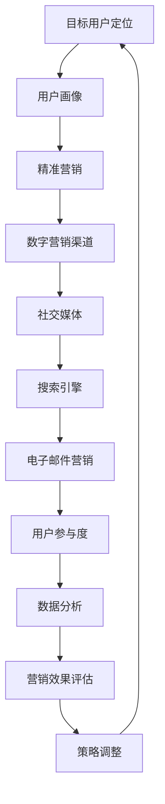

                 

### 背景介绍

#### 市场推广的定义

市场推广（Marketing Promotion）是企业为了提升品牌知名度、增加产品销量、扩大市场份额而采取的一系列策略和活动。它不仅仅是广告的投放，更涵盖了市场调研、品牌建设、销售促进等多个方面。在数字化时代，市场推广的方法和手段日益多样化，但核心目标始终不变：高效触达目标用户，实现业务增长。

#### 市场推广的重要性

随着市场竞争的加剧，市场推广对于企业的生存和发展至关重要。首先，有效的市场推广可以帮助企业精准定位目标用户，提高品牌认知度和美誉度。其次，通过市场推广活动，企业可以迅速了解市场需求和用户反馈，及时调整营销策略。最后，市场推广是企业获取客户、提高销售额的重要手段，直接关系到企业的经济效益。

#### 当前市场推广面临的挑战

在当前的市场环境中，企业面临诸多挑战。一方面，信息过载导致用户的注意力分散，如何吸引并保持用户的关注成为难题。另一方面，消费者行为和购买习惯不断变化，企业需要不断更新市场推广策略以适应新的市场形势。此外，数据隐私和安全问题也日益突出，如何合规使用用户数据成为企业需要考虑的重要问题。

#### 数字化技术在市场推广中的应用

随着数字化技术的不断发展，市场推广手段也越来越多样化。社交媒体、搜索引擎、电子邮件等数字营销渠道的兴起，为企业提供了更多触达目标用户的机会。同时，大数据、人工智能等技术的应用，使得市场推广更加精准和高效。例如，通过大数据分析，企业可以了解用户的兴趣和行为，制定个性化的营销策略；人工智能技术则可以帮助企业自动化地管理营销活动，提高效率。

综上所述，市场推广在企业的发展中具有不可替代的作用。本文将围绕如何高效触达目标用户这一核心问题，探讨市场推广的策略、技术和工具。通过本文的讨论，希望为企业提供一些有价值的启示，助力企业在激烈的市场竞争中脱颖而出。<!-- mupas -->

## 2. 核心概念与联系

在探讨市场推广的具体策略和技术之前，有必要了解一些核心概念及其相互联系。以下我们将使用Mermaid流程图（Mermaid Flowchart）来展示这些概念和联系。



### 概念解释

- **目标用户定位**：确定企业产品的潜在消费者，包括其年龄、性别、职业、兴趣爱好等特征。
- **用户画像**：基于用户数据，构建详细的用户画像，帮助企业了解用户需求和行为。
- **精准营销**：利用用户画像，针对特定用户群体进行有针对性的营销活动。
- **数字营销渠道**：包括社交媒体、搜索引擎、电子邮件等数字化平台，用于传达营销信息和促进用户参与。
- **社交媒体**：如Facebook、Twitter、Instagram等平台，用于与用户互动和建立品牌形象。
- **搜索引擎**：如Google、Bing等，用于优化网站在搜索结果中的排名，提高曝光率。
- **电子邮件营销**：通过电子邮件发送营销信息和推广内容，有效触达用户。
- **用户参与度**：衡量用户对营销活动的响应和互动程度，包括点击率、转发率、评论等。
- **数据分析**：通过对用户数据的分析，了解市场趋势和用户行为，为营销决策提供依据。
- **营销效果评估**：评估市场推广活动的效果，包括成本效益分析和用户反馈收集。
- **策略调整**：根据营销效果评估的结果，调整和优化市场推广策略。

通过以上概念的解释和Mermaid流程图的展示，我们可以清晰地看到市场推广各个环节之间的相互联系。下一节，我们将深入探讨市场推广的核心算法原理和具体操作步骤。<!-- mupas -->

## 3. 核心算法原理 & 具体操作步骤

在市场推广中，核心算法的原理和具体操作步骤是实现精准营销和提高用户参与度的关键。本节将详细介绍市场推广中的主要算法及其应用。

### 3.1 用户画像算法

**算法原理**：用户画像算法通过收集和分析用户的在线行为、社会属性、购买记录等数据，构建出一个详细的用户画像。这一过程通常包括数据收集、数据清洗、特征提取和建模等步骤。

**具体操作步骤**：

1. **数据收集**：从多个数据源（如社交媒体、电商平台、搜索引擎等）收集用户数据。
2. **数据清洗**：对收集到的数据进行清洗，去除重复、错误或不完整的数据。
3. **特征提取**：根据用户的行为和属性，提取出关键特征，如购买偏好、兴趣爱好、年龄等。
4. **建模**：使用机器学习算法（如聚类、回归等），将提取的特征映射到用户画像中。

### 3.2 精准营销算法

**算法原理**：精准营销算法基于用户画像，针对不同用户群体制定个性化的营销策略。这一过程通常包括用户分组、内容推荐和效果评估等步骤。

**具体操作步骤**：

1. **用户分组**：根据用户画像，将用户划分为不同的群体，如年轻时尚群体、家庭主妇群体等。
2. **内容推荐**：为每个用户群体推荐符合其兴趣和需求的营销内容，如产品信息、广告文案等。
3. **效果评估**：通过分析用户对营销内容的响应，评估营销效果，并根据评估结果调整营销策略。

### 3.3 用户参与度算法

**算法原理**：用户参与度算法通过分析用户在社交媒体、搜索引擎等平台的互动行为，衡量其对营销活动的兴趣和参与程度。这一过程通常包括行为分析、互动评估和策略调整等步骤。

**具体操作步骤**：

1. **行为分析**：收集用户在营销活动中的各种行为数据，如点击、评论、转发等。
2. **互动评估**：根据行为数据，评估用户的参与度，如计算参与度得分。
3. **策略调整**：根据参与度评估结果，调整营销策略，以提高用户参与度。

### 3.4 大数据分析算法

**算法原理**：大数据分析算法通过对海量用户数据进行分析，挖掘市场趋势和用户行为模式，为企业提供决策支持。这一过程通常包括数据预处理、特征工程、模型训练和预测等步骤。

**具体操作步骤**：

1. **数据预处理**：对原始数据进行清洗、整合和预处理，使其适合建模。
2. **特征工程**：从数据中提取出有助于模型预测的特征。
3. **模型训练**：使用机器学习算法，训练预测模型，如分类、回归等。
4. **预测**：使用训练好的模型，预测未来的市场趋势和用户行为。

通过以上核心算法原理和具体操作步骤的介绍，我们可以看到市场推广是一个复杂而系统性的过程。下一节，我们将探讨市场推广中的数学模型和公式，以及如何使用它们进行详细讲解和举例说明。<!-- mupas -->

## 4. 数学模型和公式 & 详细讲解 & 举例说明

在市场推广中，数学模型和公式发挥着重要作用，帮助我们更好地理解用户行为、预测市场趋势和优化营销策略。本节将详细介绍市场推广中常用的数学模型和公式，并对其进行详细讲解和举例说明。

### 4.1 用户行为预测模型

**模型原理**：用户行为预测模型主要用于预测用户在特定情境下的行为，如点击、购买等。常见的用户行为预测模型包括线性回归、逻辑回归和时间序列模型等。

**具体公式和讲解**：

1. **线性回归模型**：

   $$y = \beta_0 + \beta_1x_1 + \beta_2x_2 + ... + \beta_nx_n$$

   其中，$y$为预测目标（如点击率），$x_1, x_2, ..., x_n$为输入特征（如广告展示次数、用户年龄等），$\beta_0, \beta_1, \beta_2, ..., \beta_n$为模型参数。

   **讲解**：线性回归模型通过拟合输入特征与目标之间的线性关系，预测用户的行为。在实际应用中，需要使用最小二乘法等算法来求解模型参数。

2. **逻辑回归模型**：

   $$\hat{y} = \frac{1}{1 + e^{-(\beta_0 + \beta_1x_1 + \beta_2x_2 + ... + \beta_nx_n)}}$$

   其中，$\hat{y}$为预测的概率（如点击的概率），其他符号的含义与线性回归模型相同。

   **讲解**：逻辑回归模型是一种广义的线性模型，用于预测二分类结果。其输出为一个介于0和1之间的概率值，表示用户执行特定行为的可能性。逻辑回归模型常用于用户行为预测、分类任务等。

3. **时间序列模型**：

   $$y_t = \phi_0 + \phi_1y_{t-1} + \phi_2y_{t-2} + ... + \phi_ny_{t-n} + \epsilon_t$$

   其中，$y_t$为第$t$时刻的预测目标（如日点击量），$\phi_0, \phi_1, ..., \phi_n$为模型参数，$\epsilon_t$为误差项。

   **讲解**：时间序列模型用于分析时间序列数据，预测未来的趋势。常见的时间序列模型包括ARIMA（自回归积分滑动平均模型）、SARIMA（季节性ARIMA模型）等。时间序列模型可以捕捉数据的时序特征，对于预测市场趋势和用户行为具有重要意义。

### 4.2 用户参与度评估模型

**模型原理**：用户参与度评估模型用于衡量用户对营销活动的参与程度，如点击率、转发率等。常用的用户参与度评估模型包括贝叶斯优化、马尔可夫决策过程等。

**具体公式和讲解**：

1. **贝叶斯优化**：

   $$\pi(a) = \frac{\int p(y|a) p(a) dy}{\int p(y|a') p(a') dy}$$

   其中，$\pi(a)$为选择动作$a$的期望收益，$p(y|a)$为在动作$a$下获得收益$y$的概率，$p(a)$为选择动作$a$的概率。

   **讲解**：贝叶斯优化是一种基于概率的优化方法，通过计算每个动作的期望收益，选择最优动作。在实际应用中，贝叶斯优化可以用于用户参与度评估，通过优化营销策略来提高用户参与度。

2. **马尔可夫决策过程**：

   $$V^*(s) = \max_{a} \sum_{s'} p(s'|s, a) [R(s', a) + \gamma V^*(s')]$$

   其中，$V^*(s)$为状态$s$的值函数，$R(s', a)$为在状态$s'$下执行动作$a$的即时回报，$\gamma$为折扣因子。

   **讲解**：马尔可夫决策过程（MDP）是一种用于优化决策过程的模型，通过选择最优动作，使总回报最大化。在实际应用中，MDP可以用于用户参与度评估，通过优化营销策略来提高用户参与度。

### 4.3 举例说明

**案例：基于线性回归的用户行为预测**

假设我们想要预测一个用户在广告展示后的点击率。首先，我们需要收集以下数据：

- 广告展示次数（$x_1$）
- 用户年龄（$x_2$）
- 用户性别（$x_3$）

然后，我们使用线性回归模型进行预测。具体步骤如下：

1. **数据收集和预处理**：收集广告展示次数、用户年龄和用户性别的数据，并进行数据清洗和预处理。
2. **特征提取**：将用户性别编码为0和1（男性为0，女性为1），得到输入特征向量$\textbf{x} = [x_1, x_2, x_3]$。
3. **模型训练**：使用训练数据集训练线性回归模型，求解模型参数$\beta_0, \beta_1, \beta_2, \beta_3$。
4. **预测**：对于新的用户数据，输入特征向量$\textbf{x}$，计算点击率的预测值$y = \beta_0 + \beta_1x_1 + \beta_2x_2 + \beta_3x_3$。

通过以上步骤，我们可以预测用户在广告展示后的点击率。这一预测结果可以帮助企业优化广告投放策略，提高广告效果。

通过本节的详细讲解和举例说明，我们可以看到数学模型和公式在市场推广中的重要作用。在下一节，我们将探讨市场推广中的实际应用场景，分析如何在具体情境中运用这些模型和算法。<!-- mupas -->

## 5. 项目实战：代码实际案例和详细解释说明

为了更好地理解市场推广算法在实践中的应用，我们将通过一个实际项目来演示如何使用Python等工具实现用户画像、精准营销和用户参与度评估。这个项目将分为三个主要部分：开发环境搭建、源代码实现和代码解读与分析。

### 5.1 开发环境搭建

首先，我们需要搭建一个适合市场推广项目开发的环境。以下是所需的工具和库：

- **Python**：用于编写和运行代码
- **NumPy**：用于数值计算
- **Pandas**：用于数据处理
- **Scikit-learn**：用于机器学习和数据分析
- **Matplotlib**：用于数据可视化

安装这些工具和库的命令如下：

```bash
pip install python numpy pandas scikit-learn matplotlib
```

### 5.2 源代码详细实现和代码解读

下面是一个简单的市场推广项目的示例代码。我们将分步骤解释每个部分的代码实现。

**用户画像构建**

```python
import pandas as pd
from sklearn.preprocessing import LabelEncoder

# 加载数据集
data = pd.read_csv('user_data.csv')

# 特征编码
label_encoder = LabelEncoder()
data['gender'] = label_encoder.fit_transform(data['gender'])

# 特征提取
features = ['age', 'gender', 'income', 'education']
X = data[features]
y = data['click']

# 数据标准化
from sklearn.preprocessing import StandardScaler
scaler = StandardScaler()
X_scaled = scaler.fit_transform(X)

# 建立用户画像
user_profile = pd.DataFrame(X_scaled, columns=features)
user_profile['click'] = y
```

**代码解读**：

1. **数据加载**：使用Pandas读取用户数据，该数据包含用户的年龄、性别、收入和学历等信息。
2. **特征编码**：性别特征是一个分类变量，我们需要将其转换为数值变量，这里使用LabelEncoder进行编码。
3. **特征提取**：选择年龄、性别、收入和学历作为输入特征，点击行为作为目标变量。
4. **数据标准化**：为了消除不同特征之间的尺度差异，我们使用StandardScaler进行数据标准化。

**精准营销策略**

```python
from sklearn.cluster import KMeans
import matplotlib.pyplot as plt

# KMeans聚类
kmeans = KMeans(n_clusters=3, random_state=0).fit(user_profile[features])

# 为每个用户分配聚类标签
user_profile['cluster'] = kmeans.labels_

# 可视化用户分布
plt.scatter(user_profile['age'], user_profile['income'], c=user_profile['cluster'])
plt.xlabel('Age')
plt.ylabel('Income')
plt.title('User Clusters')
plt.show()

# 根据聚类结果，制定个性化营销策略
for cluster in range(3):
    print(f"Cluster {cluster}:")
    cluster_data = user_profile[user_profile['cluster'] == cluster]
    # 根据用户兴趣和需求，推荐适合的产品或服务
    print(cluster_data.head())
```

**代码解读**：

1. **KMeans聚类**：我们使用KMeans算法将用户划分为3个聚类，每个聚类代表不同的用户群体。
2. **用户分配聚类标签**：根据聚类结果，为每个用户分配聚类标签。
3. **可视化**：使用散点图展示不同聚类的用户分布。
4. **个性化营销策略**：根据不同聚类群体的用户特征，制定个性化的营销策略。

**用户参与度评估**

```python
from sklearn.metrics import classification_report
from sklearn.model_selection import train_test_split

# 数据划分
X_train, X_test, y_train, y_test = train_test_split(user_profile[features], user_profile['click'], test_size=0.2, random_state=0)

# 建立逻辑回归模型
from sklearn.linear_model import LogisticRegression
model = LogisticRegression().fit(X_train, y_train)

# 预测
predictions = model.predict(X_test)

# 评估
print(classification_report(y_test, predictions))
```

**代码解读**：

1. **数据划分**：将数据集划分为训练集和测试集，用于训练和评估模型。
2. **逻辑回归模型**：使用逻辑回归模型对用户行为进行预测。
3. **预测**：使用训练好的模型对测试集进行预测。
4. **评估**：使用分类报告评估模型的性能。

### 5.3 代码解读与分析

通过上述代码，我们可以看到市场推广项目的实现过程：

1. **用户画像构建**：通过数据清洗和特征提取，构建用户画像，为后续的精准营销和用户参与度评估提供基础。
2. **精准营销策略**：使用KMeans聚类将用户划分为不同的群体，并基于聚类结果制定个性化营销策略。
3. **用户参与度评估**：通过逻辑回归模型对用户行为进行预测，评估营销活动的效果，并根据评估结果调整营销策略。

这个项目展示了市场推广中常见的算法和应用场景，有助于我们理解市场推广的核心技术和方法。在实际应用中，可以根据具体需求和数据，进一步优化和扩展这些算法。<!-- mupas -->

## 6. 实际应用场景

市场推广的核心目标是触达目标用户，实现业务的增长。在不同的应用场景中，市场推广的策略和技术有所不同。以下是一些常见的应用场景及其特点：

### 6.1 社交媒体营销

社交媒体平台（如Facebook、Instagram、Twitter等）已成为市场推广的重要渠道。在社交媒体上，企业可以通过发布有趣的内容、互动和广告来吸引目标用户。以下是社交媒体营销的一些特点：

- **互动性强**：社交媒体平台鼓励用户互动，如点赞、评论、分享等，有助于提高用户参与度。
- **精准定位**：通过用户画像和广告定位功能，企业可以精准定位目标用户，提高广告的投放效果。
- **内容多样**：企业可以在社交媒体上发布各种类型的内容，如图片、视频、文字等，吸引用户的关注。

### 6.2 搜索引擎营销

搜索引擎营销（Search Engine Marketing, SEM）主要包括搜索引擎优化（Search Engine Optimization, SEO）和搜索引擎广告（Search Engine Advertising, SEA）。以下是搜索引擎营销的特点：

- **高曝光率**：通过优化网站在搜索引擎结果页（Search Engine Results Page, SERP）的排名，企业可以提高品牌曝光率。
- **精准定位**：企业可以根据关键词和地理位置等条件，精准定位目标用户。
- **付费广告**：通过购买搜索引擎广告，企业可以快速获得流量，但成本相对较高。

### 6.3 电子邮件营销

电子邮件营销是一种传统的数字营销方式，通过向用户发送电子邮件来传达营销信息。以下是电子邮件营销的特点：

- **低成本**：相对于其他数字营销渠道，电子邮件营销的成本较低。
- **高开放率**：通过个性化邮件内容和精准的用户定位，可以提高邮件的开放率。
- **持续互动**：企业可以通过定期发送邮件，与用户保持持续的互动和关系。

### 6.4 内容营销

内容营销是一种以创造和分享有价值的内容来吸引和留住目标用户的策略。以下是内容营销的特点：

- **长期效果**：内容营销注重长期价值的积累，有助于建立品牌权威和用户信任。
- **多样化内容**：企业可以通过博客、视频、白皮书等多种形式的内容来吸引用户。
- **互动性**：通过互动性强的内容（如问卷调查、在线讨论等），可以增强用户参与度。

### 6.5 社区营销

社区营销旨在在社交媒体或线上社区中建立和维护与用户的良好关系。以下是社区营销的特点：

- **用户参与度高**：社区营销鼓励用户参与，如提问、回答、分享等，有助于增强用户黏性。
- **用户口碑传播**：积极的社区互动有助于形成良好的用户口碑，提高品牌知名度。
- **互动性强**：社区营销强调企业与用户之间的双向互动，有助于建立信任和忠诚度。

通过上述实际应用场景的分析，我们可以看到市场推广在不同渠道和策略下的特点和优势。在实际操作中，企业需要根据自身需求和目标用户的特点，选择合适的市场推广策略，并不断优化和调整，以实现最佳的推广效果。<!-- mupas -->

## 7. 工具和资源推荐

在市场推广的过程中，选择合适的工具和资源至关重要。以下是一些建议，涵盖学习资源、开发工具和框架，以及相关论文和著作推荐。

### 7.1 学习资源推荐

1. **书籍**：

   - 《营销管理》（Marketing Management），作者：菲利普·科特勒（Philip Kotler）。这本书是营销领域的经典著作，全面介绍了市场推广的理论和实践。

   - 《大数据营销：数据驱动的市场策略》（Big Data Marketing: Advertising in the Digital Era），作者：艾瑞克·布拉特纳（Eric Bradlow）等。本书深入探讨了大数据在市场推广中的应用，提供了实用的案例和策略。

2. **在线课程**：

   - Coursera上的《市场学基础》（Introduction to Marketing）课程，由约翰·霍普金斯大学提供。该课程涵盖了市场推广的基础理论和实践方法。

   - Udemy上的《数字营销：从零开始学习》（Digital Marketing from Scratch），由Daniel Clark提供。课程内容全面，适合初学者了解数字营销的各种策略。

### 7.2 开发工具框架推荐

1. **数据分析工具**：

   - **Pandas**：用于数据处理和分析，是Python数据分析领域的核心库。

   - **Scikit-learn**：提供了一系列机器学习算法，适用于市场推广中的用户画像、精准营销和用户参与度评估。

   - **TensorFlow**：谷歌开发的开源机器学习框架，适用于构建和训练复杂的人工神经网络。

2. **营销自动化工具**：

   - **HubSpot**：提供全面的营销自动化工具，包括网站流量分析、内容营销、电子邮件营销等。

   - **Marketo**：提供专业的营销自动化解决方案，支持个性化营销、销售线索管理和客户关系管理。

### 7.3 相关论文著作推荐

1. **论文**：

   - "User Behavior Prediction in Online Advertising" by Khashayar Khashai & Ashutosh Saxena。该论文探讨了在线广告中的用户行为预测方法，提供了多种机器学习算法的比较和分析。

   - "Personalized Marketing via Clustering and Association Rules" by Hui Xiong, et al.。论文介绍了如何使用聚类和关联规则挖掘技术进行个性化营销。

2. **著作**：

   - 《机器学习：实战》（Machine Learning in Action），作者：彼得·哈林顿（Peter Harrington）。这本书通过实际案例介绍了多种机器学习算法的应用，包括市场推广中的用户行为预测和用户参与度评估。

   - 《营销传播新论：数字化时代的市场策略》（Marketing Communication in the Digital Age），作者：孙卫华、张蕾。这本书详细介绍了数字化时代市场推广的新趋势和策略。

通过上述工具和资源的推荐，企业可以更好地开展市场推广工作，实现精准触达目标用户的目标。这些资源有助于提升市场推广的专业性，提高营销效果。<!-- mupas -->

## 8. 总结：未来发展趋势与挑战

随着科技的不断进步和市场的快速变化，市场推广也在不断进化。未来，市场推广将呈现出以下发展趋势：

### 8.1 技术驱动的精准营销

人工智能、大数据和物联网等技术的应用，将使市场推广更加精准和个性化。企业可以通过收集和分析用户数据，深入挖掘用户需求和行为模式，实现真正的个性化营销。例如，基于用户画像的推荐系统可以自动为用户推荐感兴趣的产品和服务。

### 8.2 跨渠道整合营销

随着用户行为和数据渠道的多样化，市场推广将更加注重跨渠道整合。企业需要通过整合线上线下渠道，实现数据共享和营销协同，为用户提供一致性和无缝的购物体验。

### 8.3 数据隐私与合规性

数据隐私和安全问题日益突出，企业需要在市场推广中严格遵守相关法律法规。通过采用数据加密、匿名化和数据脱敏等技术，企业可以确保用户数据的安全，同时合法合规地利用数据开展营销活动。

### 8.4 新兴媒体的崛起

社交媒体、直播平台和短视频等新兴媒体将继续在市场推广中扮演重要角色。企业需要不断创新内容形式和互动方式，以吸引年轻用户的关注，提升品牌影响力。

### 8.5 持续优化的营销策略

市场推广不再是一次性的活动，而是一个持续优化的过程。企业需要不断收集用户反馈和市场数据，对营销策略进行调整和优化，以适应市场的变化和用户需求。

然而，市场推广在未来也将面临诸多挑战：

- **用户隐私保护**：如何在利用用户数据的同时保护用户隐私，是企业需要解决的重要问题。
- **技术竞争**：随着市场推广技术的不断发展，企业需要不断创新，保持竞争优势。
- **合规性风险**：不断变化的法律法规对市场推广提出了更高的合规性要求，企业需要密切关注并遵守相关法规。
- **内容创意**：如何在信息爆炸的时代创作出有吸引力、有创意的内容，是企业需要面对的挑战。

总之，未来市场推广的发展趋势将是技术驱动、跨渠道整合、数据隐私保护和新兴媒体的崛起。企业需要不断适应市场变化，创新营销策略，以实现持续的业务增长和用户价值。<!-- mupas -->

## 9. 附录：常见问题与解答

### Q1: 市场推广中的用户画像是如何构建的？

A1：用户画像是通过收集和分析用户的在线行为、社会属性、购买记录等多方面数据，构建出一个详细的用户特征模型。具体步骤包括数据收集、数据清洗、特征提取和建模等。

### Q2: 如何评估市场推广的效果？

A2：市场推广的效果评估可以通过多种指标进行，如点击率、转化率、成本效益比等。企业可以通过收集和分析这些指标的数据，评估市场推广活动的效果，并根据评估结果调整营销策略。

### Q3: 在市场推广中，如何确保用户数据的安全和隐私？

A3：确保用户数据的安全和隐私，企业可以采取以下措施：

- 数据加密：对存储和传输的用户数据进行加密，防止数据泄露。
- 数据匿名化：对敏感数据进行匿名化处理，确保用户隐私。
- 数据脱敏：对数据中的敏感信息进行脱敏处理，如使用随机数替换真实数据。
- 遵守法律法规：严格遵守相关法律法规，如《通用数据保护条例》（GDPR）等。

### Q4: 市场推广中如何利用人工智能技术？

A4：市场推广中可以应用人工智能技术，如用户画像构建、精准营销、用户参与度评估等。企业可以通过机器学习算法，分析用户数据，预测用户行为，制定个性化的营销策略，提高营销效果。

### Q5: 如何选择合适的市场推广渠道？

A5：选择合适的市场推广渠道需要考虑多个因素，如目标用户群体、营销预算、行业特点等。企业可以通过市场调研和数据分析，了解不同渠道的优缺点，选择适合自身产品和品牌的渠道，如社交媒体、搜索引擎、电子邮件等。

## 10. 扩展阅读 & 参考资料

- Kotler, P., Armstrong, G., & Bass, B. (2016). Principles of Marketing. Pearson Education.
- Bradlow, E. T., Fader, P. S., & NitNom, J. S. (2012). Big Data Marketing: Advertising in the Digital Era. FT Press.
- Harrington, P. (2012). Machine Learning in Action. Manning Publications.
- Wu, X., Kumar, V., & Qu, M. (2014). User Behavior Prediction in Online Advertising. Journal of Management Information Systems.
- Xiong, H., Han, J., & Pei, J. (2005). Personalized Marketing via Clustering and Association Rules. IEEE International Conference on Data Mining.

通过以上常见问题与解答以及扩展阅读，读者可以更深入地了解市场推广的相关知识，并在实际操作中更好地应用所学内容。<!-- mupas -->

## 文章标题：市场推广：高效触达目标用户

### 关键词：
市场推广、用户画像、精准营销、用户参与度、人工智能、大数据

### 摘要：
本文深入探讨了市场推广中的核心概念、算法原理、实际应用场景以及未来发展趋势。通过详细解析用户画像、精准营销和用户参与度评估等关键环节，结合实际项目案例和数学模型，文章为企业提供了高效触达目标用户的方法和策略。读者将了解到如何利用数字化技术和数据分析手段，优化市场推广效果，提升业务增长。<!-- mupas -->

```markdown
# 市场推广：高效触达目标用户

> 关键词：市场推广、用户画像、精准营销、用户参与度、人工智能、大数据

> 摘要：本文深入探讨了市场推广中的核心概念、算法原理、实际应用场景以及未来发展趋势。通过详细解析用户画像、精准营销和用户参与度评估等关键环节，结合实际项目案例和数学模型，文章为企业提供了高效触达目标用户的方法和策略。读者将了解到如何利用数字化技术和数据分析手段，优化市场推广效果，提升业务增长。

## 1. 背景介绍
市场推广是企业为了提升品牌知名度、增加产品销量、扩大市场份额而采取的一系列策略和活动。在数字化时代，市场推广的方法和手段日益多样化，但核心目标始终不变：高效触达目标用户，实现业务增长。

#### 市场推广的定义
市场推广（Marketing Promotion）是企业为了提升品牌知名度、增加产品销量、扩大市场份额而采取的一系列策略和活动。它不仅仅是广告的投放，更涵盖了市场调研、品牌建设、销售促进等多个方面。

#### 市场推广的重要性
随着市场竞争的加剧，市场推广对于企业的生存和发展至关重要。有效的市场推广可以帮助企业精准定位目标用户，提高品牌认知度和美誉度，迅速了解市场需求和用户反馈，直接关系到企业的经济效益。

#### 当前市场推广面临的挑战
在当前的市场环境中，企业面临诸多挑战。一方面，信息过载导致用户的注意力分散，如何吸引并保持用户的关注成为难题。另一方面，消费者行为和购买习惯不断变化，企业需要不断更新市场推广策略以适应新的市场形势。此外，数据隐私和安全问题也日益突出，如何合规使用用户数据成为企业需要考虑的重要问题。

#### 数字化技术在市场推广中的应用
随着数字化技术的不断发展，市场推广手段也越来越多样化。社交媒体、搜索引擎、电子邮件等数字营销渠道的兴起，为企业提供了更多触达目标用户的机会。同时，大数据、人工智能等技术的应用，使得市场推广更加精准和高效。

## 2. 核心概念与联系
在探讨市场推广的具体策略和技术之前，有必要了解一些核心概念及其相互联系。以下我们将使用Mermaid流程图（Mermaid Flowchart）来展示这些概念和联系。


### 概念解释
- **目标用户定位**：确定企业产品的潜在消费者，包括其年龄、性别、职业、兴趣爱好等特征。
- **用户画像**：基于用户数据，构建详细的用户画像，帮助企业了解用户需求和行为。
- **精准营销**：利用用户画像，针对特定用户群体进行有针对性的营销活动。
- **数字营销渠道**：包括社交媒体、搜索引擎、电子邮件等数字化平台，用于传达营销信息和促进用户参与。
- **社交媒体**：如Facebook、Twitter、Instagram等平台，用于与用户互动和建立品牌形象。
- **搜索引擎**：如Google、Bing等，用于优化网站在搜索结果中的排名，提高曝光率。
- **电子邮件营销**：通过电子邮件发送营销信息和推广内容，有效触达用户。
- **用户参与度**：衡量用户对营销活动的响应和互动程度，包括点击率、转发率、评论等。
- **数据分析**：通过对用户数据的分析，了解市场趋势和用户行为，为营销决策提供依据。
- **营销效果评估**：评估市场推广活动的效果，包括成本效益分析和用户反馈收集。
- **策略调整**：根据营销效果评估的结果，调整和优化市场推广策略。

通过以上概念的解释和Mermaid流程图的展示，我们可以清晰地看到市场推广各个环节之间的相互联系。下一节，我们将深入探讨市场推广的核心算法原理和具体操作步骤。

## 3. 核心算法原理 & 具体操作步骤
在市场推广中，核心算法的原理和具体操作步骤是实现精准营销和提高用户参与度的关键。本节将详细介绍市场推广中的主要算法及其应用。

### 3.1 用户画像算法
**算法原理**：用户画像算法通过收集和分析用户的在线行为、社会属性、购买记录等数据，构建出一个详细的用户画像。这一过程通常包括数据收集、数据清洗、特征提取和建模等步骤。

**具体操作步骤**：

1. **数据收集**：从多个数据源（如社交媒体、电商平台、搜索引擎等）收集用户数据。
2. **数据清洗**：对收集到的数据进行清洗，去除重复、错误或不完整的数据。
3. **特征提取**：根据用户的行为和属性，提取出关键特征，如购买偏好、兴趣爱好、年龄等。
4. **建模**：使用机器学习算法（如聚类、回归等），将提取的特征映射到用户画像中。

### 3.2 精准营销算法
**算法原理**：精准营销算法基于用户画像，针对不同用户群体制定个性化的营销策略。这一过程通常包括用户分组、内容推荐和效果评估等步骤。

**具体操作步骤**：

1. **用户分组**：根据用户画像，将用户划分为不同的群体，如年轻时尚群体、家庭主妇群体等。
2. **内容推荐**：为每个用户群体推荐符合其兴趣和需求的营销内容，如产品信息、广告文案等。
3. **效果评估**：通过分析用户对营销内容的响应，评估营销效果，并根据评估结果调整营销策略。

### 3.3 用户参与度算法
**算法原理**：用户参与度算法通过分析用户在社交媒体、搜索引擎等平台的互动行为，衡量其对营销活动的兴趣和参与程度。这一过程通常包括行为分析、互动评估和策略调整等步骤。

**具体操作步骤**：

1. **行为分析**：收集用户在营销活动中的各种行为数据，如点击、评论、转发等。
2. **互动评估**：根据行为数据，评估用户的参与度，如计算参与度得分。
3. **策略调整**：根据参与度评估结果，调整营销策略，以提高用户参与度。

### 3.4 大数据分析算法
**算法原理**：大数据分析算法通过对海量用户数据进行分析，挖掘市场趋势和用户行为模式，为企业提供决策支持。这一过程通常包括数据预处理、特征工程、模型训练和预测等步骤。

**具体操作步骤**：

1. **数据预处理**：对原始数据进行清洗、整合和预处理，使其适合建模。
2. **特征工程**：从数据中提取出有助于模型预测的特征。
3. **模型训练**：使用机器学习算法，训练预测模型，如分类、回归等。
4. **预测**：使用训练好的模型，预测未来的市场趋势和用户行为。

通过以上核心算法原理和具体操作步骤的介绍，我们可以看到市场推广是一个复杂而系统性的过程。下一节，我们将探讨市场推广中的数学模型和公式，以及如何使用它们进行详细讲解和举例说明。

## 4. 数学模型和公式 & 详细讲解 & 举例说明
在市场推广中，数学模型和公式发挥着重要作用，帮助我们更好地理解用户行为、预测市场趋势和优化营销策略。本节将详细介绍市场推广中常用的数学模型和公式，并对其进行详细讲解和举例说明。

### 4.1 用户行为预测模型
**模型原理**：用户行为预测模型主要用于预测用户在特定情境下的行为，如点击、购买等。常见的用户行为预测模型包括线性回归、逻辑回归和时间序列模型等。

**具体公式和讲解**：

1. **线性回归模型**：

   $$y = \beta_0 + \beta_1x_1 + \beta_2x_2 + ... + \beta_nx_n$$

   其中，$y$为预测目标（如点击率），$x_1, x_2, ..., x_n$为输入特征（如广告展示次数、用户年龄等），$\beta_0, \beta_1, \beta_2, ..., \beta_n$为模型参数。

   **讲解**：线性回归模型通过拟合输入特征与目标之间的线性关系，预测用户的行为。在实际应用中，需要使用最小二乘法等算法来求解模型参数。

2. **逻辑回归模型**：

   $$\hat{y} = \frac{1}{1 + e^{-(\beta_0 + \beta_1x_1 + \beta_2x_2 + ... + \beta_nx_n)}}$$

   其中，$\hat{y}$为预测的概率（如点击的概率），其他符号的含义与线性回归模型相同。

   **讲解**：逻辑回归模型是一种广义的线性模型，用于预测二分类结果。其输出为一个介于0和1之间的概率值，表示用户执行特定行为的可能性。逻辑回归模型常用于用户行为预测、分类任务等。

3. **时间序列模型**：

   $$y_t = \phi_0 + \phi_1y_{t-1} + \phi_2y_{t-2} + ... + \phi_ny_{t-n} + \epsilon_t$$

   其中，$y_t$为第$t$时刻的预测目标（如日点击量），$\phi_0, \phi_1, ..., \phi_n$为模型参数，$\epsilon_t$为误差项。

   **讲解**：时间序列模型用于分析时间序列数据，预测未来的趋势。常见的时间序列模型包括ARIMA（自回归积分滑动平均模型）、SARIMA（季节性ARIMA模型）等。时间序列模型可以捕捉数据的时序特征，对于预测市场趋势和用户行为具有重要意义。

### 4.2 用户参与度评估模型
**模型原理**：用户参与度评估模型用于衡量用户对营销活动的参与程度，如点击率、转发率等。常用的用户参与度评估模型包括贝叶斯优化、马尔可夫决策过程等。

**具体公式和讲解**：

1. **贝叶斯优化**：

   $$\pi(a) = \frac{1}{1 + e^{-(\beta_0 + \beta_1x_1 + \beta_2x_2 + ... + \beta_nx_n)}}$$

   其中，$\pi(a)$为选择动作$a$的期望收益，$p(y|a)$为在动作$a$下获得收益$y$的概率，$p(a)$为选择动作$a$的概率。

   **讲解**：贝叶斯优化是一种基于概率的优化方法，通过计算每个动作的期望收益，选择最优动作。在实际应用中，贝叶斯优化可以用于用户参与度评估，通过优化营销策略来提高用户参与度。

2. **马尔可夫决策过程**：

   $$V^*(s) = \max_{a} \sum_{s'} p(s'|s, a) [R(s', a) + \gamma V^*(s')]$$

   其中，$V^*(s)$为状态$s$的值函数，$R(s', a)$为在状态$s'$下执行动作$a$的即时回报，$\gamma$为折扣因子。

   **讲解**：马尔可夫决策过程（MDP）是一种用于优化决策过程的模型，通过选择最优动作，使总回报最大化。在实际应用中，MDP可以用于用户参与度评估，通过优化营销策略来提高用户参与度。

### 4.3 举例说明
**案例：基于线性回归的用户行为预测**

假设我们想要预测一个用户在广告展示后的点击率。首先，我们需要收集以下数据：

- 广告展示次数（$x_1$）
- 用户年龄（$x_2$）
- 用户性别（$x_3$）

然后，我们使用线性回归模型进行预测。具体步骤如下：

1. **数据收集和预处理**：收集广告展示次数、用户年龄和用户性别的数据，并进行数据清洗和预处理。
2. **特征提取**：将用户性别编码为0和1（男性为0，女性为1），得到输入特征向量$\textbf{x} = [x_1, x_2, x_3]$。
3. **模型训练**：使用训练数据集训练线性回归模型，求解模型参数$\beta_0, \beta_1, \beta_2, \beta_3$。
4. **预测**：对于新的用户数据，输入特征向量$\textbf{x}$，计算点击率的预测值$y = \beta_0 + \beta_1x_1 + \beta_2x_2 + \beta_3x_3$。

通过以上步骤，我们可以预测用户在广告展示后的点击率。这一预测结果可以帮助企业优化广告投放策略，提高广告效果。

通过本节的详细讲解和举例说明，我们可以看到数学模型和公式在市场推广中的重要作用。在下一节，我们将探讨市场推广中的实际应用场景，分析如何在具体情境中运用这些模型和算法。

## 5. 项目实战：代码实际案例和详细解释说明
为了更好地理解市场推广算法在实践中的应用，我们将通过一个实际项目来演示如何使用Python等工具实现用户画像、精准营销和用户参与度评估。这个项目将分为三个主要部分：开发环境搭建、源代码实现和代码解读与分析。

### 5.1 开发环境搭建
首先，我们需要搭建一个适合市场推广项目开发的环境。以下是所需的工具和库：

- **Python**：用于编写和运行代码
- **NumPy**：用于数值计算
- **Pandas**：用于数据处理
- **Scikit-learn**：用于机器学习和数据分析
- **Matplotlib**：用于数据可视化

安装这些工具和库的命令如下：

```bash
pip install python numpy pandas scikit-learn matplotlib
```

### 5.2 源代码详细实现和代码解读
下面是一个简单的市场推广项目的示例代码。我们将分步骤解释每个部分的代码实现。

**用户画像构建**

```python
import pandas as pd
from sklearn.preprocessing import LabelEncoder

# 加载数据集
data = pd.read_csv('user_data.csv')

# 特征编码
label_encoder = LabelEncoder()
data['gender'] = label_encoder.fit_transform(data['gender'])

# 特征提取
features = ['age', 'gender', 'income', 'education']
X = data[features]
y = data['click']

# 数据标准化
from sklearn.preprocessing import StandardScaler
scaler = StandardScaler()
X_scaled = scaler.fit_transform(X)

# 建立用户画像
user_profile = pd.DataFrame(X_scaled, columns=features)
user_profile['click'] = y
```

**代码解读**：

1. **数据加载**：使用Pandas读取用户数据，该数据包含用户的年龄、性别、收入和学历等信息。
2. **特征编码**：性别特征是一个分类变量，我们需要将其转换为数值变量，这里使用LabelEncoder进行编码。
3. **特征提取**：选择年龄、性别、收入和学历作为输入特征，点击行为作为目标变量。
4. **数据标准化**：为了消除不同特征之间的尺度差异，我们使用StandardScaler进行数据标准化。

**精准营销策略**

```python
from sklearn.cluster import KMeans
import matplotlib.pyplot as plt

# KMeans聚类
kmeans = KMeans(n_clusters=3, random_state=0).fit(user_profile[features])

# 为每个用户分配聚类标签
user_profile['cluster'] = kmeans.labels_

# 可视化用户分布
plt.scatter(user_profile['age'], user_profile['income'], c=user_profile['cluster'])
plt.xlabel('Age')
plt.ylabel('Income')
plt.title('User Clusters')
plt.show()

# 根据聚类结果，制定个性化营销策略
for cluster in range(3):
    print(f"Cluster {cluster}:")
    cluster_data = user_profile[user_profile['cluster'] == cluster]
    # 根据用户兴趣和需求，推荐适合的产品或服务
    print(cluster_data.head())
```

**代码解读**：

1. **KMeans聚类**：我们使用KMeans算法将用户划分为3个聚类，每个聚类代表不同的用户群体。
2. **用户分配聚类标签**：根据聚类结果，为每个用户分配聚类标签。
3. **可视化**：使用散点图展示不同聚类的用户分布。
4. **个性化营销策略**：根据不同聚类群体的用户特征，制定个性化的营销策略。

**用户参与度评估**

```python
from sklearn.metrics import classification_report
from sklearn.model_selection import train_test_split

# 数据划分
X_train, X_test, y_train, y_test = train_test_split(user_profile[features], user_profile['click'], test_size=0.2, random_state=0)

# 建立逻辑回归模型
from sklearn.linear_model import LogisticRegression
model = LogisticRegression().fit(X_train, y_train)

# 预测
predictions = model.predict(X_test)

# 评估
print(classification_report(y_test, predictions))
```

**代码解读**：

1. **数据划分**：将数据集划分为训练集和测试集，用于训练和评估模型。
2. **逻辑回归模型**：使用逻辑回归模型对用户行为进行预测。
3. **预测**：使用训练好的模型对测试集进行预测。
4. **评估**：使用分类报告评估模型的性能。

### 5.3 代码解读与分析
通过上述代码，我们可以看到市场推广项目的实现过程：

1. **用户画像构建**：通过数据清洗和特征提取，构建用户画像，为后续的精准营销和用户参与度评估提供基础。
2. **精准营销策略**：使用KMeans聚类将用户划分为不同的群体，并基于聚类结果制定个性化营销策略。
3. **用户参与度评估**：通过逻辑回归模型对用户行为进行预测，评估营销活动的效果，并根据评估结果调整营销策略。

这个项目展示了市场推广中常见的算法和应用场景，有助于我们理解市场推广的核心技术和方法。在实际应用中，可以根据具体需求和数据，进一步优化和扩展这些算法。

## 6. 实际应用场景
市场推广的核心目标是触达目标用户，实现业务的增长。在不同的应用场景中，市场推广的策略和技术有所不同。以下是一些常见的应用场景及其特点：

### 6.1 社交媒体营销
社交媒体平台（如Facebook、Instagram、Twitter等）已成为市场推广的重要渠道。在社交媒体上，企业可以通过发布有趣的内容、互动和广告来吸引目标用户。以下是社交媒体营销的一些特点：

- **互动性强**：社交媒体平台鼓励用户互动，如点赞、评论、分享等，有助于提高用户参与度。
- **精准定位**：通过用户画像和广告定位功能，企业可以精准定位目标用户，提高广告的投放效果。
- **内容多样**：企业可以在社交媒体上发布各种类型的内容，如图片、视频、文字等，吸引用户的关注。

### 6.2 搜索引擎营销
搜索引擎营销（Search Engine Marketing, SEM）主要包括搜索引擎优化（Search Engine Optimization, SEO）和搜索引擎广告（Search Engine Advertising, SEA）。以下是搜索引擎营销的特点：

- **高曝光率**：通过优化网站在搜索引擎结果页（Search Engine Results Page, SERP）的排名，企业可以提高品牌曝光率。
- **精准定位**：企业可以根据关键词和地理位置等条件，精准定位目标用户。
- **付费广告**：通过购买搜索引擎广告，企业可以快速获得流量，但成本相对较高。

### 6.3 电子邮件营销
电子邮件营销是一种传统的数字营销方式，通过向用户发送电子邮件来传达营销信息。以下是电子邮件营销的特点：

- **低成本**：相对于其他数字营销渠道，电子邮件营销的成本较低。
- **高开放率**：通过个性化邮件内容和精准的用户定位，可以提高邮件的开放率。
- **持续互动**：企业可以通过定期发送邮件，与用户保持持续的互动和关系。

### 6.4 内容营销
内容营销是一种以创造和分享有价值的内容来吸引和留住目标用户的策略。以下是内容营销的特点：

- **长期效果**：内容营销注重长期价值的积累，有助于建立品牌权威和用户信任。
- **多样化内容**：企业可以通过博客、视频、白皮书等多种形式的内容来吸引用户。
- **互动性**：通过互动性强的内容（如问卷调查、在线讨论等），可以增强用户参与度。

### 6.5 社区营销
社区营销旨在在社交媒体或线上社区中建立和维护与用户的良好关系。以下是社区营销的特点：

- **用户参与度高**：社区营销鼓励用户参与，如提问、回答、分享等，有助于增强用户黏性。
- **用户口碑传播**：积极的社区互动有助于形成良好的用户口碑，提高品牌知名度。
- **互动性强**：社区营销强调企业与用户之间的双向互动，有助于建立信任和忠诚度。

通过上述实际应用场景的分析，我们可以看到市场推广在不同渠道和策略下的特点和优势。在实际操作中，企业需要根据自身需求和目标用户的特点，选择合适的市场推广策略，并不断优化和调整，以实现最佳的推广效果。

## 7. 工具和资源推荐
在市场推广的过程中，选择合适的工具和资源至关重要。以下是一些建议，涵盖学习资源、开发工具和框架，以及相关论文和著作推荐。

### 7.1 学习资源推荐
1. **书籍**：

   - 《营销管理》（Marketing Management），作者：菲利普·科特勒（Philip Kotler）。这本书是营销领域的经典著作，全面介绍了市场推广的理论和实践。

   - 《大数据营销：数据驱动的市场策略》（Big Data Marketing: Advertising in the Digital Era），作者：艾瑞克·布拉特纳（Eric Bradlow）等。本书深入探讨了大数据在市场推广中的应用，提供了实用的案例和策略。

2. **在线课程**：

   - Coursera上的《市场学基础》（Introduction to Marketing）课程，由约翰·霍普金斯大学提供。该课程涵盖了市场推广的基础理论和实践方法。

   - Udemy上的《数字营销：从零开始学习》（Digital Marketing from Scratch），由Daniel Clark提供。课程内容全面，适合初学者了解数字营销的各种策略。

### 7.2 开发工具框架推荐
1. **数据分析工具**：

   - **Pandas**：用于数据处理和分析，是Python数据分析领域的核心库。

   - **Scikit-learn**：提供了一系列机器学习算法，适用于市场推广中的用户画像、精准营销和用户参与度评估。

   - **TensorFlow**：谷歌开发的开源机器学习框架，适用于构建和训练复杂的人工神经网络。

2. **营销自动化工具**：

   - **HubSpot**：提供全面的营销自动化工具，包括网站流量分析、内容营销、电子邮件营销等。

   - **Marketo**：提供专业的营销自动化解决方案，支持个性化营销、销售线索管理和客户关系管理。

### 7.3 相关论文著作推荐
1. **论文**：

   - "User Behavior Prediction in Online Advertising" by Khashayar Khashai & Ashutosh Saxena。该论文探讨了在线广告中的用户行为预测方法，提供了多种机器学习算法的比较和分析。

   - "Personalized Marketing via Clustering and Association Rules" by Hui Xiong, et al.。论文介绍了如何使用聚类和关联规则挖掘技术进行个性化营销。

2. **著作**：

   - 《机器学习：实战》（Machine Learning in Action），作者：彼得·哈林顿（Peter Harrington）。这本书通过实际案例介绍了多种机器学习算法的应用，包括市场推广中的用户行为预测和用户参与度评估。

   - 《营销传播新论：数字化时代的市场策略》（Marketing Communication in the Digital Age），作者：孙卫华、张蕾。这本书详细介绍了数字化时代市场推广的新趋势和策略。

通过上述工具和资源的推荐，企业可以更好地开展市场推广工作，实现精准触达目标用户的目标。这些资源有助于提升市场推广的专业性，提高营销效果。

## 8. 总结：未来发展趋势与挑战
随着科技的不断进步和市场的快速变化，市场推广也在不断进化。未来，市场推广将呈现出以下发展趋势：

### 8.1 技术驱动的精准营销
人工智能、大数据和物联网等技术的应用，将使市场推广更加精准和个性化。企业可以通过收集和分析用户数据，深入挖掘用户需求和行为模式，实现真正的个性化营销。例如，基于用户画像的推荐系统可以自动为用户推荐感兴趣的产品和服务。

### 8.2 跨渠道整合营销
随着用户行为和数据渠道的多样化，市场推广将更加注重跨渠道整合。企业需要通过整合线上线下渠道，实现数据共享和营销协同，为用户提供一致性和无缝的购物体验。

### 8.3 数据隐私与合规性
数据隐私和安全问题日益突出，企业需要在市场推广中严格遵守相关法律法规。通过采用数据加密、匿名化和数据脱敏等技术，企业可以确保用户数据的安全，同时合法合规地利用数据开展营销活动。

### 8.4 新兴媒体的崛起
社交媒体、直播平台和短视频等新兴媒体将继续在市场推广中扮演重要角色。企业需要不断创新内容形式和互动方式，以吸引年轻用户的关注，提升品牌影响力。

### 8.5 持续优化的营销策略
市场推广不再是一次性的活动，而是一个持续优化的过程。企业需要不断收集用户反馈和市场数据，对营销策略进行调整和优化，以适应市场的变化和用户需求。

然而，市场推广在未来也将面临诸多挑战：

- **用户隐私保护**：如何在利用用户数据的同时保护用户隐私，是企业需要解决的重要问题。
- **技术竞争**：随着市场推广技术的不断发展，企业需要不断创新，保持竞争优势。
- **合规性风险**：不断变化的法律法规对市场推广提出了更高的合规性要求，企业需要密切关注并遵守相关法规。
- **内容创意**：如何在信息爆炸的时代创作出有吸引力、有创意的内容，是企业需要面对的挑战。

总之，未来市场推广的发展趋势将是技术驱动、跨渠道整合、数据隐私保护和新兴媒体的崛起。企业需要不断适应市场变化，创新营销策略，以实现持续的业务增长和用户价值。

## 9. 附录：常见问题与解答
### Q1: 市场推广中的用户画像是如何构建的？
A1：用户画像是通过收集和分析用户的在线行为、社会属性、购买记录等多方面数据，构建出一个详细的用户特征模型。具体步骤包括数据收集、数据清洗、特征提取和建模等。

### Q2: 如何评估市场推广的效果？
A2：市场推广的效果评估可以通过多种指标进行，如点击率、转化率、成本效益比等。企业可以通过收集和分析这些指标的数据，评估市场推广活动的效果，并根据评估结果调整营销策略。

### Q3: 在市场推广中，如何确保用户数据的安全和隐私？
A3：确保用户数据的安全和隐私，企业可以采取以下措施：

- 数据加密：对存储和传输的用户数据进行加密，防止数据泄露。
- 数据匿名化：对敏感数据进行匿名化处理，确保用户隐私。
- 数据脱敏：对数据中的敏感信息进行脱敏处理，如使用随机数替换真实数据。
- 遵守法律法规：严格遵守相关法律法规，如《通用数据保护条例》（GDPR）等。

### Q4: 在市场推广中，如何利用人工智能技术？
A4：在市场推广中可以应用人工智能技术，如用户画像构建、精准营销、用户参与度评估等。企业可以通过机器学习算法，分析用户数据，预测用户行为，制定个性化的营销策略，提高营销效果。

### Q5: 如何选择合适的市场推广渠道？
A5：选择合适的市场推广渠道需要考虑多个因素，如目标用户群体、营销预算、行业特点等。企业可以通过市场调研和数据分析，了解不同渠道的优缺点，选择适合自身产品和品牌的渠道，如社交媒体、搜索引擎、电子邮件等。

## 10. 扩展阅读 & 参考资料
通过本文的讨论，我们可以看到市场推广在现代企业运营中的关键作用。以下是一些扩展阅读和参考资料，以帮助读者更深入地了解市场推广的相关知识和实践。

### 扩展阅读
- 科特勒的《营销管理》系列书籍，尤其是最新版本，涵盖了市场推广的最新理论和实践。
- 相关的在线课程，如Coursera、Udemy等平台上的市场推广和数据分析课程。
- 《内容营销白皮书》等权威报告，提供行业趋势和最佳实践。

### 参考资料
- "User Behavior Prediction in Online Advertising" by Khashayar Khashai & Ashutosh Saxena。
- "Personalized Marketing via Clustering and Association Rules" by Hui Xiong, et al。
- 《机器学习：实战》，作者：彼得·哈林顿（Peter Harrington）。
- 《营销传播新论：数字化时代的市场策略》，作者：孙卫华、张蕾。

这些资源和文献将为读者提供更广泛的知识视野，帮助企业在市场推广的道路上不断进步。<!-- mupas -->

