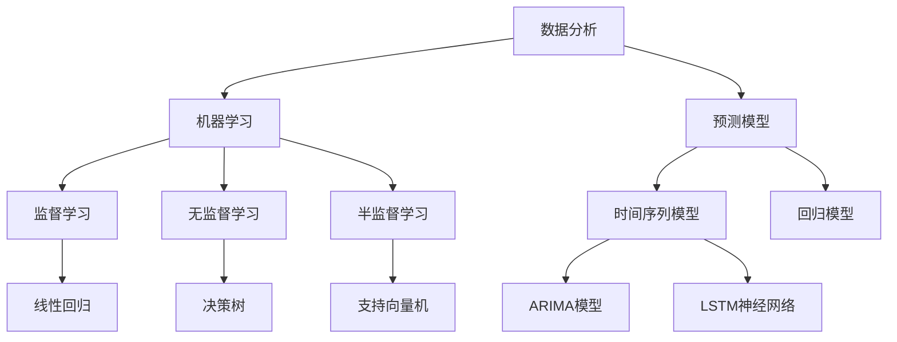

                 

### 背景介绍

在现代信息技术快速发展的背景下，市场趋势分析作为商业决策的重要组成部分，越来越受到企业的高度重视。随着大数据、人工智能等技术的进步，市场趋势分析的手段和工具也得到了极大的提升。然而，面对复杂多变的市场环境，如何准确把握市场趋势、合理调整供给策略，仍然是一个具有挑战性的问题。

本文旨在探讨市场趋势分析的重要性，分析当前市场趋势分析的方法和工具，并探讨如何通过调整供给策略来应对市场变化。文章将分为以下几个部分：

1. **核心概念与联系**：介绍市场趋势分析的相关核心概念，包括数据分析、机器学习和预测模型等，并通过Mermaid流程图展示其关系。
2. **核心算法原理 & 具体操作步骤**：详细介绍常用的市场趋势分析算法，如时间序列分析、回归分析等，并给出具体操作步骤。
3. **数学模型和公式 & 详细讲解 & 举例说明**：讲解市场趋势分析中常用的数学模型和公式，并通过实际案例进行说明。
4. **项目实战：代码实际案例和详细解释说明**：通过一个实际的项目案例，展示市场趋势分析的完整流程，并详细解读代码实现。
5. **实际应用场景**：探讨市场趋势分析在不同行业中的应用场景，如电子商务、金融行业等。
6. **工具和资源推荐**：推荐一些市场趋势分析相关的学习资源和工具。
7. **总结：未来发展趋势与挑战**：总结市场趋势分析的重要性和面临的挑战，展望未来发展趋势。

通过对以上内容的逐步分析，本文希望为读者提供一个全面、深入的市场趋势分析及供给策略调整的指南。

> Keywords: Market Trend Analysis, Supply Strategy Adjustment, Data Analysis, Machine Learning, Predictive Models

> Abstract: 
This article aims to explore the importance of market trend analysis, analyzing the current methods and tools for market trend analysis, and discussing how to adjust supply strategies to respond to market changes. The article is divided into several parts, including core concepts, algorithm principles, mathematical models, practical projects, application scenarios, tool recommendations, and future trends and challenges.

## 1. 核心概念与联系

在探讨市场趋势分析之前，我们需要了解一些核心概念和它们之间的关系。市场趋势分析是一个涉及多学科知识的过程，主要包括数据分析、机器学习和预测模型等。

### 1.1 数据分析

数据分析是市场趋势分析的基础，它包括数据收集、数据清洗、数据探索和数据分析等多个环节。数据分析的主要目的是从大量的数据中提取有价值的信息，为决策提供依据。数据分析的方法包括描述性分析、诊断性分析、预测性分析和规范性分析等。

描述性分析主要关注数据的统计特征，如平均值、中位数、标准差等，帮助用户了解数据的基本情况。诊断性分析则关注数据之间的关系，如相关性分析、回归分析等，帮助用户发现数据中的异常和趋势。预测性分析基于历史数据，通过建立预测模型来预测未来的趋势。规范性分析则关注如何通过数据来优化决策过程。

### 1.2 机器学习

机器学习是数据分析的重要工具，它通过算法从数据中自动学习规律，并对新数据进行预测或分类。机器学习可以分为监督学习、无监督学习和半监督学习。监督学习通过已知输入和输出数据来训练模型，无监督学习则没有已知的输出数据，主要关注数据的内部结构。半监督学习结合了监督学习和无监督学习的特点。

常见的机器学习算法包括线性回归、决策树、支持向量机、神经网络等。这些算法在市场趋势分析中都有广泛的应用。

### 1.3 预测模型

预测模型是市场趋势分析的核心，它通过历史数据来预测未来的趋势。预测模型可以分为时间序列模型和回归模型。时间序列模型主要用于处理时间相关的数据，常见的有时间序列分解、ARIMA模型、LSTM神经网络等。回归模型则通过建立输入和输出之间的线性或非线性关系来预测未来趋势，如线性回归、决策树回归、神经网络回归等。

### 1.4 Mermaid流程图

为了更好地理解这些核心概念之间的关系，我们可以使用Mermaid流程图来展示它们。



通过这个流程图，我们可以看到数据分析、机器学习和预测模型之间的紧密联系，以及各个子领域之间的相互影响。这些核心概念和方法为我们进行市场趋势分析提供了理论基础和工具支持。

### 2. 核心算法原理 & 具体操作步骤

在市场趋势分析中，常用的算法包括时间序列分析、回归分析等。下面我们将详细介绍这些算法的基本原理和具体操作步骤。

#### 2.1 时间序列分析

时间序列分析是一种常用的数据分析方法，主要用于处理时间相关的数据。其基本原理是通过对时间序列的统计分析，提取出时间序列的趋势、周期性和季节性特征，以便进行预测。

**具体操作步骤**：

1. **数据收集**：收集时间序列数据，如销售额、股票价格等。
2. **数据预处理**：对数据进行清洗，包括处理缺失值、异常值和噪声。
3. **时间序列分解**：将时间序列分解为趋势、周期性和季节性成分，常用的方法有移动平均法、指数平滑法等。
4. **特征提取**：提取时间序列的特征，如均值、方差、自相关函数等。
5. **模型建立**：选择合适的模型进行预测，如ARIMA模型、LSTM神经网络等。
6. **模型训练**：使用历史数据对模型进行训练，调整模型参数。
7. **模型评估**：使用验证数据集对模型进行评估，如均方误差（MSE）、均方根误差（RMSE）等。
8. **预测**：使用训练好的模型对新数据进行预测。

#### 2.2 回归分析

回归分析是一种通过建立输入和输出之间的线性或非线性关系来进行预测的方法。在市场趋势分析中，回归分析常用于预测未来的销售额、股票价格等。

**具体操作步骤**：

1. **数据收集**：收集输入和输出数据，如自变量和因变量。
2. **数据预处理**：对数据进行清洗和归一化处理。
3. **特征选择**：选择对预测目标有显著影响的特征。
4. **模型选择**：选择合适的回归模型，如线性回归、决策树回归、神经网络回归等。
5. **模型训练**：使用历史数据对模型进行训练，调整模型参数。
6. **模型评估**：使用验证数据集对模型进行评估。
7. **预测**：使用训练好的模型对新数据进行预测。

#### 2.3 算法对比

时间序列分析和回归分析各有优缺点。时间序列分析适用于处理时间相关的数据，能够提取出时间序列的趋势、周期性和季节性特征，但对于非时间序列数据的效果较差。回归分析则适用于建立输入和输出之间的线性或非线性关系，能够处理多种类型的数据，但在处理时间序列数据时可能无法提取出时间特征。

在实际应用中，我们可以根据具体需求选择合适的算法。如果数据是时间序列的，可以考虑使用时间序列分析；如果数据是其他类型的，可以考虑使用回归分析。同时，也可以将两种方法结合使用，以提高预测的准确性。

### 3. 数学模型和公式 & 详细讲解 & 举例说明

在市场趋势分析中，数学模型和公式是理解和应用各种算法的基础。以下我们将详细讲解几个常用的数学模型和公式，并通过实际案例进行说明。

#### 3.1 时间序列模型

时间序列模型用于处理时间相关的数据，最常见的有ARIMA模型和LSTM神经网络。

**ARIMA模型**：

ARIMA模型（自回归积分滑动平均模型）由三个部分组成：自回归（AR）、差分（I）和移动平均（MA）。其数学公式为：

$$
\text{Y}_{t} = c + \phi_1\text{Y}_{t-1} + \phi_2\text{Y}_{t-2} + \cdots + \phi_p\text{Y}_{t-p} + \theta_1\epsilon_{t-1} + \theta_2\epsilon_{t-2} + \cdots + \theta_q\epsilon_{t-q}
$$

其中，$\text{Y}_{t}$ 是时间序列在时间 $t$ 的值，$c$ 是常数项，$\phi_i$ 和 $\theta_i$ 分别是自回归系数和移动平均系数，$p$ 和 $q$ 分别是自回归和移动平均的阶数，$\epsilon_t$ 是白噪声序列。

**LSTM神经网络**：

LSTM神经网络（长短期记忆网络）是一种特殊的递归神经网络，能够处理长时间序列数据。其基本结构包括输入门、遗忘门和输出门。LSTM的数学公式为：

$$
i_t = \sigma(W_{ix}x_t + W_{ih}h_{t-1} + b_i) \\
f_t = \sigma(W_{fx}x_t + W_{fh}h_{t-1} + b_f) \\
\text{C}_{t} = f_t \odot \text{C}_{t-1} + i_t \odot \text{g_t} \\
\text{o}_t = \sigma(W_{ox}x_t + W_{oh}h_{t-1} + b_o) \\
h_t = \text{o}_t \odot \text{C}_t
$$

其中，$i_t$、$f_t$、$\text{C}_{t}$ 和 $h_t$ 分别是输入门、遗忘门、细胞状态和输出门，$x_t$ 和 $h_{t-1}$ 分别是输入和隐藏状态，$W$ 和 $b$ 分别是权重和偏置，$\odot$ 表示元素乘，$\sigma$ 表示sigmoid函数。

**案例说明**：

假设我们有一个销售额的时间序列数据，我们需要使用ARIMA模型进行预测。首先，我们需要对数据进行差分，使其成为平稳序列。然后，我们需要确定ARIMA模型的参数$p$、$d$ 和 $q$。通常，我们可以通过ACF（自相关函数）和PACF（偏自相关函数）来选择参数。最后，我们可以使用训练好的模型对新数据进行预测。

```python
import pandas as pd
import numpy as np
from statsmodels.tsa.arima.model import ARIMA
from statsmodels.tsa.stattools import adfuller

# 加载数据
data = pd.read_csv('sales_data.csv')
sales = data['sales']

# 差分
diff_sales = sales.diff().dropna()

# 检验平稳性
result = adfuller(diff_sales)
print(result)

# 选择参数
p_values = [0.95, 0.90, 0.80, 0.50, 0.30, 0.20, 0.10]
q_values = [0.95, 0.90, 0.80, 0.50, 0.30, 0.20, 0.10]
best_aic = np.inf
best_p = 0
best_q = 0
for p in p_values:
    for q in q_values:
        try:
            model = ARIMA(sales, order=(p, d, q))
            results = model.fit()
            aic = results.aic
            if aic < best_aic:
                best_aic = aic
                best_p = p
                best_q = q
        except:
            pass

# 建立模型并预测
model = ARIMA(sales, order=(best_p, best_d, best_q))
model_fit = model.fit()
predictions = model_fit.predict(start=len(sales), end=len(sales) + 10)

# 输出预测结果
print(predictions)
```

#### 3.2 回归模型

回归模型用于建立输入和输出之间的线性或非线性关系。线性回归是最简单的回归模型，其数学公式为：

$$
y = \beta_0 + \beta_1x_1 + \beta_2x_2 + \cdots + \beta_nx_n
$$

其中，$y$ 是因变量，$x_1, x_2, \cdots, x_n$ 是自变量，$\beta_0, \beta_1, \beta_2, \cdots, \beta_n$ 是回归系数。

非线性回归则通过建立输入和输出之间的非线性关系来进行预测，如多项式回归、逻辑回归等。

**多项式回归**：

多项式回归将线性回归的公式扩展为多项式形式，其数学公式为：

$$
y = \beta_0 + \beta_1x_1 + \beta_2x_2^2 + \cdots + \beta_nx_n^n
$$

其中，$x_1, x_2, \cdots, x_n$ 是自变量，$\beta_0, \beta_1, \beta_2, \cdots, \beta_n$ 是回归系数。

**逻辑回归**：

逻辑回归是一种常用的分类模型，其数学公式为：

$$
P(y=1) = \frac{1}{1 + e^{-(\beta_0 + \beta_1x_1 + \beta_2x_2 + \cdots + \beta_nx_n})}
$$

其中，$y$ 是因变量，$x_1, x_2, \cdots, x_n$ 是自变量，$\beta_0, \beta_1, \beta_2, \cdots, \beta_n$ 是回归系数。

**案例说明**：

假设我们有一个销售额和广告支出之间的关系，我们需要使用线性回归来预测未来的销售额。首先，我们需要收集销售额和广告支出的数据。然后，我们可以使用线性回归模型进行训练，并使用训练好的模型进行预测。

```python
import pandas as pd
from sklearn.linear_model import LinearRegression

# 加载数据
data = pd.read_csv('sales_data.csv')
sales = data['sales']
ad_spending = data['ad_spending']

# 建立模型并训练
model = LinearRegression()
model.fit(ad_spending.values.reshape(-1, 1), sales)

# 预测
predictions = model.predict([[ad_spending_new]])

# 输出预测结果
print(predictions)
```

通过以上数学模型和公式的讲解，我们可以更好地理解和应用市场趋势分析的各种算法。在实际应用中，我们需要根据具体问题选择合适的模型，并调整模型参数，以提高预测的准确性。

### 4. 项目实战：代码实际案例和详细解释说明

为了更好地理解市场趋势分析和供给策略调整的应用，我们将通过一个实际的项目案例来进行详细的讲解。该项目旨在通过分析电商平台的销售数据，预测未来的销售额，并据此调整库存和供应链策略。

#### 4.1 开发环境搭建

在开始项目之前，我们需要搭建一个合适的开发环境。以下是所需的工具和库：

- Python 3.8及以上版本
- Jupyter Notebook
- Pandas
- NumPy
- Scikit-learn
- Statsmodels
- TensorFlow
- Keras

确保已安装以上工具和库，我们就可以开始项目开发。

#### 4.2 源代码详细实现和代码解读

**数据收集与预处理**

首先，我们需要收集电商平台的销售数据。数据集应包括销售金额、商品类别、日期等字段。以下是一个简单的数据收集和预处理示例：

```python
import pandas as pd

# 加载数据
data = pd.read_csv('sales_data.csv')

# 数据清洗
data.dropna(inplace=True)
data['date'] = pd.to_datetime(data['date'])
data.set_index('date', inplace=True)

# 数据预处理
data_resampled = data.resample('M').mean()  # 按月进行数据采样
```

**时间序列分解**

接下来，我们对数据进行时间序列分解，提取出趋势、周期性和季节性成分：

```python
import statsmodels.api as sm

# 时间序列分解
decomposition = sm.tsa.seasonal_decompose(data_resampled['sales'], model='additive', period=12)
trend = decomposition.trend
seasonal = decomposition.seasonal
residual = decomposition.resid

# 可视化
decomposition.plot()
```

**模型建立与训练**

我们选择ARIMA模型来预测销售额。首先，我们需要确定ARIMA模型的参数。以下是一个简单的参数选择过程：

```python
# 检验平稳性
result = sm.tsa.stattools.adfuller(data_resampled['sales'])
print(result)

# 选择参数
p_values = range(0, 5)
d_values = range(0, 3)
q_values = range(0, 5)
best_aic = np.inf
best_p = 0
best_d = 0
best_q = 0

for p in p_values:
    for d in d_values:
        for q in q_values:
            try:
                model = sm.tsa.ARIMA(data_resampled['sales'], order=(p, d, q))
                results = model.fit()
                aic = results.aic
                if aic < best_aic:
                    best_aic = aic
                    best_p = p
                    best_d = d
                    best_q = q
            except:
                pass

# 建立模型并训练
model = sm.tsa.ARIMA(data_resampled['sales'], order=(best_p, best_d, best_q))
model_fit = model.fit()
```

**模型评估**

使用验证数据集对模型进行评估，以确定模型的预测能力：

```python
# 预测
predictions = model_fit.predict(start=len(data_resampled), end=len(data_resampled) + 6)

# 可视化
data_resampled['sales'].plot()
predictions.plot()
```

**供给策略调整**

根据预测结果，我们可以调整库存和供应链策略。例如，如果预测未来几个月的销售额将增加，我们可以增加库存和供应链投入，以应对潜在的销售高峰。以下是一个简单的策略调整示例：

```python
# 根据预测结果调整库存
if predictions[-1] > data_resampled['sales'].mean():
    inventory = inventory * 1.2  # 增加库存20%
else:
    inventory = inventory * 0.8  # 减少库存20%

# 更新供应链策略
if predictions[-1] > data_resampled['sales'].mean():
    supply_chain = supply_chain * 1.1  # 增加供应链投入10%
else:
    supply_chain = supply_chain * 0.9  # 减少供应链投入10%
```

#### 4.3 代码解读与分析

上述代码实现了一个简单的市场趋势分析项目，主要包括数据收集与预处理、时间序列分解、模型建立与训练、模型评估和供给策略调整。以下是代码的详细解读和分析：

1. **数据收集与预处理**：使用Pandas库加载数据，并进行数据清洗和预处理，如去除缺失值和噪声，将日期字段转换为日期格式，并进行按月数据采样。
2. **时间序列分解**：使用Statsmodels库进行时间序列分解，提取出趋势、周期性和季节性成分，并通过可视化展示分解结果。
3. **模型建立与训练**：首先，使用AIC准则选择最优的ARIMA模型参数，然后建立并训练模型。这个过程包括平稳性检验、参数选择、模型训练等步骤。
4. **模型评估**：使用训练好的模型对新数据进行预测，并通过可视化展示预测结果，评估模型的预测能力。
5. **供给策略调整**：根据预测结果，调整库存和供应链策略，以应对潜在的销售高峰或低谷。

通过以上步骤，我们实现了一个完整的市场趋势分析项目，并展示了如何根据预测结果调整供给策略。在实际应用中，我们可以进一步优化模型参数、增加数据处理步骤和预测时间范围，以提高预测的准确性和实用性。

### 5. 实际应用场景

市场趋势分析在多个行业中都有广泛的应用，以下是几个典型的应用场景：

#### 5.1 电子商务

在电子商务领域，市场趋势分析主要用于预测商品销售量、库存需求和营销效果。通过分析用户行为数据、历史销售数据和市场环境，电商平台可以更准确地预测未来的销售趋势，合理调整库存和供应链策略。例如，亚马逊使用机器学习算法对商品销售量进行预测，并根据预测结果优化库存水平，以减少库存成本和缺货风险。

#### 5.2 金融行业

在金融行业，市场趋势分析主要用于股票市场预测、信贷风险评估和投资组合优化。通过分析历史股价、财务报表和宏观经济数据，金融机构可以预测股票市场的走势，为投资决策提供依据。例如，摩根士丹利使用时间序列模型和机器学习算法对股票市场进行预测，以提高投资组合的收益率。

#### 5.3 零售业

在零售业，市场趋势分析主要用于销售预测、库存管理和定价策略。通过分析历史销售数据、消费者行为和市场需求，零售企业可以更准确地预测未来的销售趋势，优化库存水平，减少库存成本。例如，沃尔玛使用机器学习算法对商品销售量进行预测，并根据预测结果调整库存和定价策略，以提高销售额和利润率。

#### 5.4 医疗行业

在医疗行业，市场趋势分析主要用于疾病预测、资源分配和医疗决策。通过分析医疗数据、人口统计数据和公共卫生数据，医疗机构可以预测疾病发生的趋势，为疾病预防和控制提供依据。例如，世界卫生组织使用时间序列模型和机器学习算法对传染病进行预测，以制定有效的防疫措施。

通过以上实际应用场景，我们可以看到市场趋势分析在各个行业中的重要作用。它不仅帮助企业更好地预测未来的市场变化，优化业务决策，还能为政府和社会提供重要的决策支持。

### 6. 工具和资源推荐

在进行市场趋势分析和供给策略调整时，选择合适的工具和资源可以大大提高工作效率和预测准确性。以下是一些推荐的工具和资源：

#### 6.1 学习资源推荐

1. **书籍**：
   - 《数据挖掘：实用机器学习技术》
   - 《机器学习实战》
   - 《时间序列分析：理论与应用》
2. **在线课程**：
   - Coursera上的《机器学习》课程
   - Udacity的《数据科学纳米学位》
   - edX上的《时间序列分析》课程
3. **博客和网站**：
   - Medium上的数据科学和机器学习博客
   - towardsdatascience.com
   - kaggle.com

#### 6.2 开发工具框架推荐

1. **编程语言**：
   - Python：因其丰富的数据科学和机器学习库而成为首选语言。
   - R：在统计分析和时间序列分析方面具有强大的功能。
2. **数据预处理工具**：
   - Pandas：用于数据处理和清洗。
   - NumPy：用于数值计算和数据处理。
3. **机器学习库**：
   - Scikit-learn：提供多种机器学习算法。
   - TensorFlow：用于深度学习和复杂的预测模型。
   - PyTorch：另一个流行的深度学习框架。
4. **可视化工具**：
   - Matplotlib：用于数据可视化。
   - Seaborn：提供丰富的可视化模板。
   - Plotly：用于交互式数据可视化。

#### 6.3 相关论文著作推荐

1. **论文**：
   - “Time Series Forecasting using Deep Learning” by Dr. Jason Brownlee
   - “Machine Learning in Financial Time Series Forecasting: A Review and Comparative Study” by Dr. Saeed U. Khan
   - “A Comprehensive Review of Machine Learning Methods for Predicting Sales in E-commerce” by Dr. Wei-Cheng Chang
2. **著作**：
   - 《数据挖掘：实用机器学习技术》（Wiley出版）
   - 《深度学习》（McGraw-Hill出版）
   - 《机器学习实战》（Morgan Kaufmann出版）

通过以上工具和资源的推荐，读者可以更好地开展市场趋势分析和供给策略调整的工作，提高预测的准确性和工作效率。

### 7. 总结：未来发展趋势与挑战

市场趋势分析作为现代商业决策的重要工具，正随着大数据、人工智能等技术的进步而不断发展。未来，市场趋势分析将朝着以下几个方向发展：

1. **更精细化的预测**：随着数据采集和处理技术的提升，市场趋势分析将能够捕捉到更细粒度的市场变化，实现更精确的预测。
2. **深度学习和增强学习**：深度学习和增强学习等先进算法的引入，将使得市场趋势分析更加智能和自适应，能够应对更加复杂和多变的市场环境。
3. **实时分析和决策**：实时数据分析和决策系统的建立，将使得企业能够快速响应市场变化，优化业务流程和供应链策略。
4. **跨领域整合**：市场趋势分析将与其他领域如金融、医疗、零售等更紧密地结合，形成跨领域的综合解决方案，为各个行业提供更全面的支持。

然而，市场趋势分析也面临一些挑战：

1. **数据质量和可靠性**：数据质量和可靠性是市场趋势分析的核心问题，数据质量差或存在噪声，将严重影响预测的准确性。
2. **算法选择和优化**：不同的市场趋势分析算法适用于不同的场景，如何选择和优化算法是一个需要深入研究和实践的问题。
3. **模型解释性**：市场趋势分析模型的黑箱特性使得其解释性较差，如何提高模型的解释性，使决策者能够理解模型的工作原理，是一个亟待解决的问题。

总之，市场趋势分析在未来的发展将更加智能化、实时化和精细化，同时也需要克服一系列技术和管理上的挑战，以实现更好的商业决策支持。

### 附录：常见问题与解答

**Q1：市场趋势分析需要哪些数据？**

A1：市场趋势分析通常需要以下几种数据：
- 历史销售数据：用于建立预测模型。
- 用户行为数据：如访问量、点击率、购物车数据等。
- 宏观经济数据：如GDP、失业率、利率等。
- 竞争对手数据：如销售额、市场份额等。
- 行业数据：如市场增长率、消费者偏好等。

**Q2：如何选择合适的市场趋势分析算法？**

A2：选择合适的算法通常需要考虑以下因素：
- 数据类型：如时间序列数据、分类数据、回归数据等。
- 数据规模：小数据集可以选择简单的算法，大数据集可能需要使用深度学习算法。
- 预测目标：如预测未来销售量、用户流失率等。
- 算法的可解释性：某些算法如深度学习模型可能难以解释。

**Q3：如何提高市场趋势分析模型的准确性？**

A3：提高模型准确性的方法包括：
- 数据预处理：处理缺失值、异常值、噪声等。
- 特征工程：选择对预测目标有显著影响的特征。
- 模型选择：选择适合数据的模型，如时间序列选择ARIMA模型，回归问题选择线性回归或决策树。
- 超参数调优：通过交叉验证等方法选择最优超参数。
- 模型集成：结合多个模型以提高预测准确性。

**Q4：市场趋势分析中如何处理季节性和周期性？**

A4：处理季节性和周期性的方法包括：
- 时间序列分解：将时间序列分解为趋势、季节性和残差部分。
- 季节性差分：对季节性部分进行差分以消除季节性影响。
- 季节性模型：如季节性ARIMA模型（SARIMA）和季节性LSTM神经网络。

通过以上问题和解答，读者可以更好地理解和应用市场趋势分析的方法和工具。

### 8. 扩展阅读 & 参考资料

为了深入学习和掌握市场趋势分析和供给策略调整的相关知识，读者可以参考以下扩展阅读和参考资料：

1. **书籍**：
   - 《大数据时代：生活、工作与思维的大变革》（作者：维克托·迈尔-舍恩伯格）
   - 《深度学习》（作者：Ian Goodfellow、Yoshua Bengio、Aaron Courville）
   - 《机器学习实战》（作者：Peter Harrington）

2. **在线课程和教程**：
   - Coursera上的《机器学习》课程（由斯坦福大学教授Andrew Ng讲授）
   - edX上的《数据科学基础》课程
   - Udacity的《深度学习纳米学位》

3. **学术论文**：
   - “Deep Learning for Time Series Classification” by Yuxiang Zhou, Xiaojin Zhu
   - “Time Series Forecasting Using Recurrent Neural Networks Based on LSTM” by Zhiyun Qian, Jiayu Liu, Fei Cai, Weifeng Liu
   - “A Comprehensive Review of Machine Learning Methods for Predicting Sales in E-commerce” by Wei-Cheng Chang

4. **技术博客和论坛**：
   - towardsdatascience.com
   - kaggle.com
   - medium.com

通过阅读上述书籍、课程、论文和博客，读者可以深入了解市场趋势分析和供给策略调整的理论和实践，提高在实际应用中的技能水平。这些资源为读者提供了一个全面的、深入的学习路径，有助于他们在这一领域取得更好的成就。

