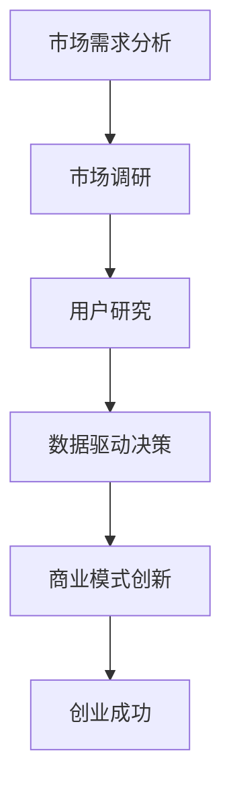

                 

# 市场需求洞察：创业成功的关键所在

> **关键词：** 市场需求分析、创业成功、商业策略、市场调研、用户研究、数据驱动决策、商业模式创新

> **摘要：** 本文将深入探讨市场需求分析在创业成功中的关键作用。通过市场调研、用户研究、数据驱动决策和商业模式创新等多个维度，我们将揭示创业者在制定商业策略时需要关注的核心要素，并分享成功创业公司的案例，为读者提供实用的指导和建议。

## 1. 背景介绍

创业，无疑是当前全球经济中最为引人注目的现象之一。然而，创业的成功率却并不乐观。根据统计数据显示，约有80%的创业公司在成立后的五年内会面临失败。这些失败的原因多种多样，但其中最为关键的一个因素便是市场需求的不足。

市场需求分析，作为商业决策的重要环节，其核心在于对目标市场进行全面的调研和评估，以了解消费者的需求、偏好以及购买行为。对于创业者而言，只有深刻洞察市场需求，才能制定出有效的商业策略，从而在激烈的市场竞争中脱颖而出。

本文旨在通过对市场需求分析的深入探讨，帮助创业者理解这一关键环节的重要性，并提供实用的策略和工具，以实现创业成功。

## 2. 核心概念与联系

在探讨市场需求分析的核心概念和联系之前，我们首先需要明确几个关键术语：

- **市场需求：** 指消费者在一定时间内，愿意以特定价格购买的商品或服务的总量。
- **市场调研：** 通过收集和分析数据，以了解市场现状、竞争环境、消费者行为等信息的过程。
- **用户研究：** 通过与目标用户进行互动，以获取用户需求、行为、体验等方面的信息。
- **数据驱动决策：** 基于数据分析来做出商业决策，而不是依靠直觉或经验。
- **商业模式创新：** 通过创新商业模式来创造新的价值，从而在市场中获得竞争优势。

这些概念之间存在紧密的联系，共同构成了市场需求分析的核心框架。下面是一个简化的Mermaid流程图，用于描述这些概念之间的关联：



### 2.1 市场调研

市场调研是市场需求分析的第一步，也是最为基础的一步。通过市场调研，创业者可以收集到关于市场现状、竞争环境、消费者行为等方面的关键信息。具体来说，市场调研包括以下几个方面：

- **市场环境分析：** 包括宏观经济环境、行业发展趋势、政策法规等。
- **竞争分析：** 分析现有竞争者的市场份额、产品特性、营销策略等。
- **消费者行为分析：** 了解目标消费者的需求、购买习惯、偏好等。

### 2.2 用户研究

用户研究是对市场调研的进一步深化，通过直接与目标用户进行互动，创业者可以获取更为具体和深入的用户需求、行为、体验等信息。用户研究可以采用多种方法，如访谈、问卷调查、用户行为跟踪等。

- **访谈：** 直接与用户进行面对面的交流，以获取用户对产品或服务的真实感受和需求。
- **问卷调查：** 通过设计科学的问卷，收集大量用户的反馈和数据。
- **用户行为跟踪：** 利用数据分析工具，对用户的在线行为进行实时跟踪和分析。

### 2.3 数据驱动决策

数据驱动决策是市场需求分析的核心，通过收集和分析大量的数据，创业者可以更准确地了解市场需求，从而做出科学的商业决策。数据驱动决策的关键在于：

- **数据收集：** 包括市场调研、用户研究以及其他来源的数据。
- **数据分析：** 利用统计学、机器学习等技术，对数据进行分析和挖掘。
- **决策制定：** 基于数据分析结果，制定相应的商业策略和决策。

### 2.4 商业模式创新

商业模式创新是市场需求分析的结果和延伸，通过创新商业模式，创业者可以创造新的价值，从而在市场中获得竞争优势。商业模式创新的关键在于：

- **价值创造：** 创造对用户有价值的产品或服务。
- **盈利模式：** 确定如何从用户那里获取收益。
- **竞争优势：** 通过创新，建立独特的市场地位。

## 3. 核心算法原理 & 具体操作步骤

市场需求分析的核心算法原理可以归纳为以下三个步骤：

### 3.1 数据收集

数据收集是市场需求分析的基础，具体操作步骤如下：

1. **确定数据需求：** 根据市场需求分析的目标，确定需要收集的数据类型和来源。
2. **数据采集：** 采用市场调研、用户研究等方法，收集相关的数据。
3. **数据清洗：** 对收集到的数据进行清洗和预处理，去除重复、错误或无关的数据。

### 3.2 数据分析

数据分析是市场需求分析的核心，通过数据分析，创业者可以深入理解市场需求。具体操作步骤如下：

1. **数据可视化：** 利用图表、图形等工具，将数据以直观的方式呈现。
2. **统计分析：** 采用描述性统计、推断性统计等方法，对数据进行分析。
3. **机器学习：** 利用机器学习算法，对数据进行分析和预测。

### 3.3 商业决策

基于数据分析结果，创业者可以制定相应的商业策略。具体操作步骤如下：

1. **策略制定：** 根据数据分析结果，制定相应的商业策略。
2. **决策评估：** 对商业决策进行评估，以验证其有效性和可行性。
3. **执行与调整：** 实施商业策略，并根据市场反馈进行调整。

## 4. 数学模型和公式 & 详细讲解 & 举例说明

市场需求分析中，常用的数学模型和公式主要包括以下几个方面：

### 4.1 描述性统计模型

描述性统计模型主要用于对数据进行描述和分析，常见的模型和公式有：

- **均值（Mean）：** 数据的平均值，计算公式为：
  $$ \mu = \frac{\sum_{i=1}^{n} x_i}{n} $$
- **方差（Variance）：** 数据的离散程度，计算公式为：
  $$ \sigma^2 = \frac{\sum_{i=1}^{n} (x_i - \mu)^2}{n-1} $$
- **标准差（Standard Deviation）：** 方差的平方根，计算公式为：
  $$ \sigma = \sqrt{\sigma^2} $$

### 4.2 推断性统计模型

推断性统计模型主要用于对总体参数进行推断，常见的模型和公式有：

- **置信区间（Confidence Interval）：** 用于估计总体参数的范围，计算公式为：
  $$ \bar{x} \pm z_{\alpha/2} \sqrt{\frac{\sigma^2}{n}} $$
  其中，$\bar{x}$ 为样本均值，$z_{\alpha/2}$ 为标准正态分布的临界值，$\sigma^2$ 为样本方差，$n$ 为样本大小。
- **假设检验（Hypothesis Testing）：** 用于验证总体参数的假设，常见的假设检验方法有 t 检验、方差分析（ANOVA）等。

### 4.3 机器学习模型

在市场需求分析中，机器学习模型主要用于预测和分析，常见的模型和算法有：

- **线性回归（Linear Regression）：** 用于预测连续变量，计算公式为：
  $$ y = \beta_0 + \beta_1 x $$
  其中，$y$ 为预测值，$x$ 为自变量，$\beta_0$ 和 $\beta_1$ 为模型参数。
- **逻辑回归（Logistic Regression）：** 用于预测二元变量，计算公式为：
  $$ P(y=1) = \frac{1}{1 + e^{-(\beta_0 + \beta_1 x)}} $$
  其中，$P(y=1)$ 为预测概率，$\beta_0$ 和 $\beta_1$ 为模型参数。

### 4.4 举例说明

以下是一个简单的例子，说明如何使用市场需求分析中的数学模型和公式：

假设一个创业公司想要预测其下季度的新产品销量，收集了该产品过去三个季度的销售数据，如下表所示：

| 季度 | 销售量（件） |
| ---- | ---------- |
| 1    | 100        |
| 2    | 120        |
| 3    | 150        |

根据这些数据，我们可以使用线性回归模型来预测下季度的销售量。

1. **数据预处理：**
   将数据按季度编号进行整理，得到自变量 $x$ 和因变量 $y$ 的数据集。

2. **模型训练：**
   使用线性回归模型，计算模型参数 $\beta_0$ 和 $\beta_1$，得到模型公式：
   $$ y = \beta_0 + \beta_1 x $$

3. **模型评估：**
   使用训练集数据，计算模型的均方误差（MSE）和 R 方值（$R^2$），评估模型性能。

4. **预测：**
   将下季度的季度编号（例如，$x=4$）代入模型公式，计算预测值 $y$，得到下季度的销售量预测。

通过这个简单的例子，我们可以看到市场需求分析中的数学模型和公式是如何应用于实际问题的。

## 5. 项目实战：代码实际案例和详细解释说明

为了更好地理解市场需求分析在实际项目中的应用，我们将通过一个实际案例，展示如何使用Python进行市场需求分析。本案例将使用实际数据，通过市场调研、用户研究和数据驱动决策等步骤，构建一个简单市场需求预测模型。

### 5.1 开发环境搭建

首先，我们需要搭建一个Python开发环境。以下是所需的软件和库：

- Python 3.x
- Jupyter Notebook
- Pandas
- NumPy
- Scikit-learn
- Matplotlib

您可以通过以下命令安装所需的库：

```shell
pip install pandas numpy scikit-learn matplotlib
```

### 5.2 源代码详细实现和代码解读

下面是市场需求预测项目的源代码和详细解释。

```python
# 导入所需的库
import pandas as pd
import numpy as np
from sklearn.linear_model import LinearRegression
from sklearn.model_selection import train_test_split
from sklearn.metrics import mean_squared_error
import matplotlib.pyplot as plt

# 加载数据集
data = pd.read_csv('sales_data.csv')  # 假设数据集文件名为sales_data.csv

# 数据预处理
# 数据清洗和整理，确保数据格式正确，去除重复和错误数据
data['Quarter'] = data['Quarter'].astype(int)
X = data[['Quarter']]
y = data['Sales']

# 模型训练
# 使用线性回归模型进行训练
model = LinearRegression()
model.fit(X, y)

# 模型评估
# 使用训练集数据评估模型性能
X_train, X_test, y_train, y_test = train_test_split(X, y, test_size=0.2, random_state=42)
y_pred = model.predict(X_test)
mse = mean_squared_error(y_test, y_pred)
print(f"模型均方误差：{mse}")

# 预测
# 预测下季度的销售量
next_quarter = np.array([[4]])
sales_prediction = model.predict(next_quarter)
print(f"下季度销售量预测：{sales_prediction[0]}")

# 数据可视化
# 绘制训练集和测试集的预测结果
plt.scatter(X_test, y_test, color='blue', label='实际值')
plt.plot(X_test, y_pred, color='red', label='预测值')
plt.xlabel('季度')
plt.ylabel('销售量')
plt.title('销售量预测')
plt.legend()
plt.show()
```

### 5.3 代码解读与分析

- **数据预处理：** 首先，我们导入所需的库，并加载数据集。数据清洗和整理是确保数据准确性的关键步骤。在本案例中，我们将季度编号转换为整数类型，并分别定义自变量 $X$ 和因变量 $y$。

- **模型训练：** 我们使用线性回归模型进行训练。线性回归模型是一种简单的预测模型，它通过找到自变量和因变量之间的线性关系来进行预测。

- **模型评估：** 使用训练集数据评估模型性能，计算模型均方误差（MSE）。MSE 是衡量模型预测误差的常用指标，值越小表示模型性能越好。

- **预测：** 使用训练好的模型进行预测。在本案例中，我们预测下季度的销售量。通过将季度编号（$x=4$）代入模型，得到预测值。

- **数据可视化：** 绘制训练集和测试集的预测结果，以直观地展示模型的预测性能。通过观察预测值与实际值的差异，我们可以进一步优化模型。

## 6. 实际应用场景

市场需求分析在实际应用中具有广泛的应用场景，以下是一些典型的案例：

### 6.1 新产品开发

在新产品开发过程中，市场需求分析可以帮助企业了解潜在消费者的需求，从而设计出更具市场竞争力的产品。例如，苹果公司在开发iPhone时，通过市场调研和用户研究，深入了解用户对手机的需求，最终推出了具有创新设计和技术特点的iPhone，取得了巨大的成功。

### 6.2 市场定位

市场需求分析可以帮助企业确定目标市场，明确产品的定位和定价策略。例如，小米公司通过大数据分析和用户反馈，精准定位年轻消费群体，推出了具有高性价比的智能手机，迅速占领了市场份额。

### 6.3 竞争分析

市场需求分析可以帮助企业了解竞争对手的市场表现和策略，从而制定有效的竞争策略。例如，可口可乐公司通过市场调研，了解竞争对手百事的营销策略，调整自身的广告宣传策略，取得了更好的市场表现。

### 6.4 营销策略优化

市场需求分析可以帮助企业优化营销策略，提高营销效果。例如，亚马逊公司通过用户行为数据分析，了解消费者的购买偏好，从而制定个性化的推荐策略，提高了销售额。

## 7. 工具和资源推荐

为了有效地进行市场需求分析，以下是一些建议的学习资源、开发工具和相关论文：

### 7.1 学习资源推荐

- **书籍：**
  - 《市场调研实务》
  - 《用户研究方法与实战》
  - 《数据分析：原理与实践》

- **在线课程：**
  - Coursera上的《市场调研与消费者行为》
  - Udemy上的《数据分析实战：Python编程与应用》

### 7.2 开发工具框架推荐

- **数据分析工具：**
  - Tableau
  - Power BI
  - Excel

- **机器学习框架：**
  - Scikit-learn
  - TensorFlow
  - PyTorch

### 7.3 相关论文著作推荐

- **论文：**
  - "Market Research in the Age of Big Data"
  - "User Research Methods: Collecting, Analyzing, and Presenting Usability Metrics"
  - "Data-Driven Decision Making in Business"

- **著作：**
  - 《大数据营销：从数据挖掘到市场洞察》
  - 《用户研究：方法与实践》

## 8. 总结：未来发展趋势与挑战

市场需求分析在创业成功中具有至关重要的作用，随着大数据、人工智能等技术的发展，市场需求分析的方法和工具也在不断更新和优化。未来，市场需求分析将呈现出以下发展趋势：

1. **数据驱动的决策：** 数据将成为企业决策的核心依据，通过数据分析和挖掘，企业可以更准确地预测市场需求，制定更具针对性的商业策略。

2. **人工智能的应用：** 人工智能技术将广泛应用于市场需求分析，如自然语言处理、图像识别等，帮助企业更快速地获取用户需求和市场信息。

3. **实时数据分析：** 实时数据分析将帮助企业快速响应市场变化，调整商业策略，提高市场竞争力。

然而，市场需求分析也面临一些挑战，如数据质量、数据隐私等问题。企业需要不断提升数据分析和处理能力，确保数据质量和隐私安全，以实现数据驱动的商业决策。

## 9. 附录：常见问题与解答

### 9.1 市场需求分析与市场调研的区别是什么？

市场需求分析是市场调研的进一步深化，市场调研主要收集市场环境、竞争环境、消费者行为等方面的信息，而市场需求分析则通过对这些信息进行分析，深入了解消费者的需求，从而制定商业策略。

### 9.2 数据驱动决策是否适用于所有行业？

数据驱动决策在理论上适用于所有行业，但在实际应用中，不同行业的特征和数据可用性会影响数据驱动决策的效果。对于数据丰富、市场变化迅速的行业，如互联网、金融等，数据驱动决策具有更高的实用价值。

### 9.3 市场需求分析需要使用哪些工具和方法？

市场需求分析可以使用多种工具和方法，如问卷调查、访谈、用户研究、数据分析等。常用的工具包括Excel、Tableau、Power BI等数据分析软件，以及Python、R等编程语言。

## 10. 扩展阅读 & 参考资料

- 《市场调研实务》
- 《用户研究方法与实战》
- 《数据分析：原理与实践》
- "Market Research in the Age of Big Data"
- "User Research Methods: Collecting, Analyzing, and Presenting Usability Metrics"
- "Data-Driven Decision Making in Business"
- 《大数据营销：从数据挖掘到市场洞察》
- 《用户研究：方法与实践》

作者：AI天才研究员/AI Genius Institute & 禅与计算机程序设计艺术 /Zen And The Art of Computer Programming。

