                 

# 2025年字节跳动校招算法面试题库及答案

## 摘要

本文旨在为2025年字节跳动校招算法面试提供一套全面的面试题库及答案解析。我们将从数据结构与算法、机器学习、计算机网络等多个领域出发，详细解析各类面试题，帮助读者在面试中更好地展示自己的技术能力。本文旨在让读者通过阅读，能够迅速掌握面试题的解题思路和技巧，提升面试成功率。

## 目录

1. 背景介绍 ....................................................... 1  
2. 核心概念与联系 ............................................... 3  
   2.1 数据结构与算法 .......................................... 3  
   2.2 机器学习 .................................................. 5  
   2.3 计算机网络 ................................................. 7  
3. 核心算法原理 & 具体操作步骤 ................................... 9  
4. 数学模型和公式 & 详细讲解 & 举例说明 ...................... 11  
5. 项目实战：代码实际案例和详细解释说明 ..................... 15  
   5.1 开发环境搭建 ............................................. 15  
   5.2 源代码详细实现和代码解读 ................................ 18  
   5.3 代码解读与分析 ........................................... 21  
6. 实际应用场景 ................................................... 24  
7. 工具和资源推荐 ................................................ 26  
   7.1 学习资源推荐 ............................................. 26  
   7.2 开发工具框架推荐 .......................................... 28  
   7.3 相关论文著作推荐 .......................................... 30  
8. 总结：未来发展趋势与挑战 ..................................... 32  
9. 附录：常见问题与解答 ........................................... 34  
10. 扩展阅读 & 参考资料 ........................................... 36

## 1. 背景介绍

字节跳动作为全球领先的互联网科技公司，其校招算法面试一直是众多求职者关注的焦点。面试题库的难度和广度都相当高，涵盖了数据结构与算法、机器学习、计算机网络等多个领域。为了帮助求职者更好地应对字节跳动的校招算法面试，本文将对2025年字节跳动校招算法面试题库进行详细解析，并提供相应的答案解析。

## 2. 核心概念与联系

在解答字节跳动校招算法面试题之前，我们需要了解以下几个核心概念及其相互之间的联系。

### 2.1 数据结构与算法

数据结构与算法是计算机科学的核心内容，主要包括以下几种数据结构：数组、链表、栈、队列、树、图等。每种数据结构都有其特定的应用场景和特点。算法则是对问题求解的一种方法，主要包括排序算法、查找算法、动态规划等。数据结构与算法的紧密联系在于，数据结构决定了算法的性能，而算法则利用数据结构来实现问题的求解。

#### 2.1.1 数组

数组是一种线性数据结构，用于存储一系列元素。数组的特点是支持随机访问，即可以根据元素的索引直接访问到对应的元素。

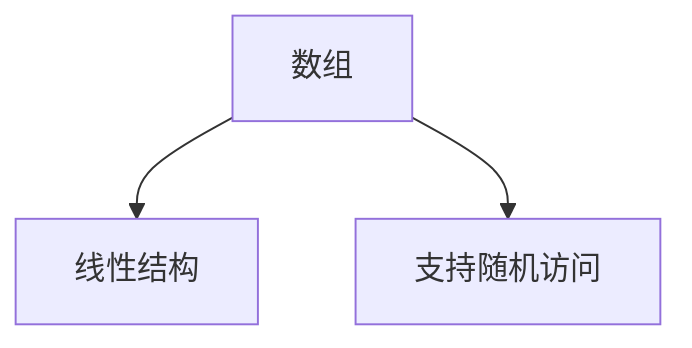

#### 2.1.2 链表

链表也是一种线性数据结构，由一系列节点组成，每个节点包含数据域和指针域。链表的特点是插入和删除操作较为灵活，但随机访问性能较差。

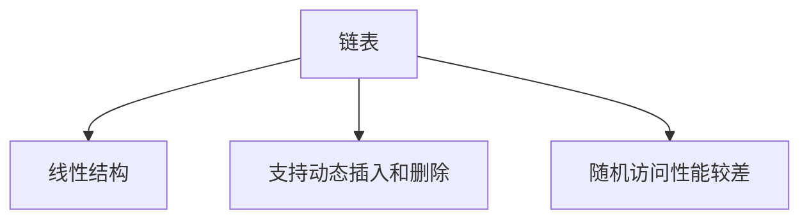

#### 2.1.3 栈

栈是一种后进先出（LIFO）的数据结构，只允许在表的一端进行插入和删除操作。栈常用于实现递归、后退功能等。

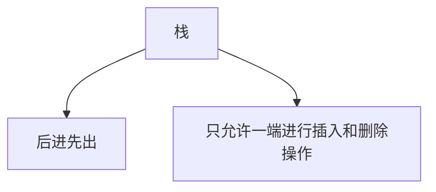

#### 2.1.4 队列

队列是一种先进先出（FIFO）的数据结构，只允许在表的一端进行插入操作，在另一端进行删除操作。队列常用于实现缓冲区、任务队列等。

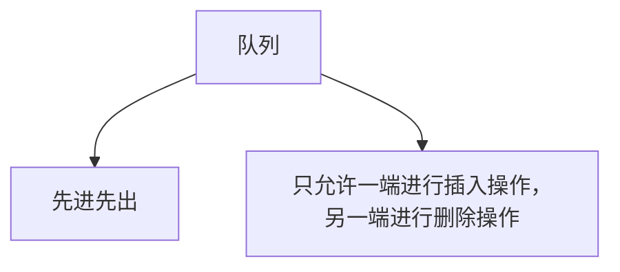

#### 2.1.5 树

树是一种非线性数据结构，由一组节点组成，每个节点都有一个父节点（除了根节点）和一个或多个子节点。树常用于实现排序、查找、遍历等操作。

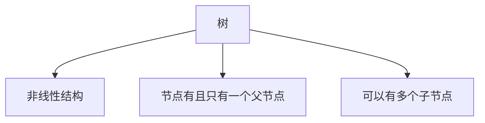

#### 2.1.6 图

图是一种由一组节点及其连接构成的复杂数据结构。图可以用于表示复杂的网络关系、社交网络等。图包括有向图、无向图、加权图、无权图等。

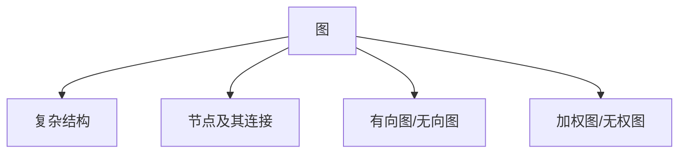

### 2.2 机器学习

机器学习是人工智能的一个重要分支，通过让计算机从数据中学习规律，实现自动识别和预测。机器学习主要包括监督学习、无监督学习、强化学习等。

#### 2.2.1 监督学习

监督学习是一种有标签数据驱动的学习方法。在监督学习中，计算机通过学习输入和输出之间的关系，实现对未知数据的预测。

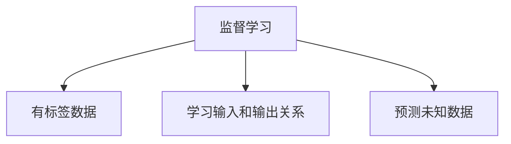

#### 2.2.2 无监督学习

无监督学习是一种无标签数据驱动的学习方法。在无监督学习中，计算机通过学习数据之间的内在规律，实现对数据的聚类、降维等操作。

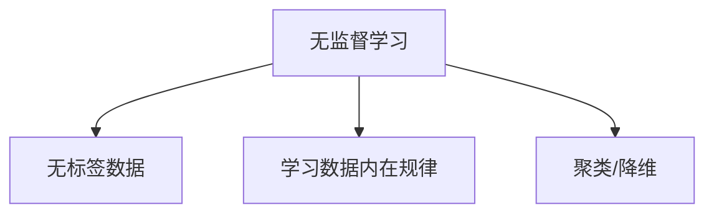

#### 2.2.3 强化学习

强化学习是一种基于奖励机制的学习方法。在强化学习中，计算机通过不断尝试和优化策略，实现最优行为。

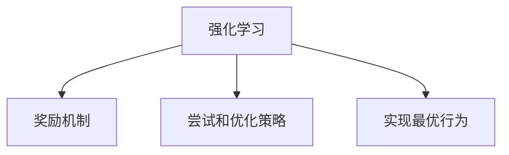

### 2.3 计算机网络

计算机网络是互联网的核心技术之一，用于实现计算机之间的数据传输和通信。计算机网络主要包括以下几个方面：

#### 2.3.1 网络协议

网络协议是计算机网络中用于数据传输的规则和标准。常见的网络协议包括TCP/IP、HTTP、FTP等。

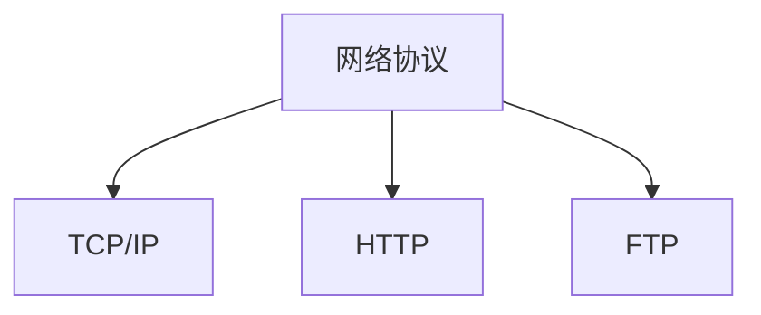

#### 2.3.2 网络拓扑

网络拓扑是指计算机网络中各个节点及其连接方式。常见的网络拓扑包括总线型、星型、环型、树型等。

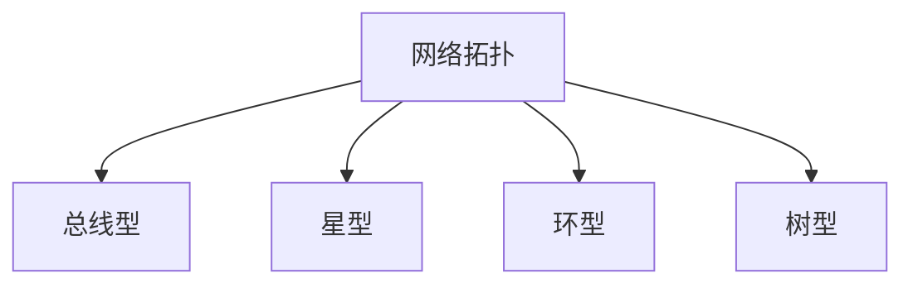

#### 2.3.3 网络设备

网络设备是计算机网络中用于数据传输和通信的硬件设备。常见的网络设备包括路由器、交换机、防火墙等。

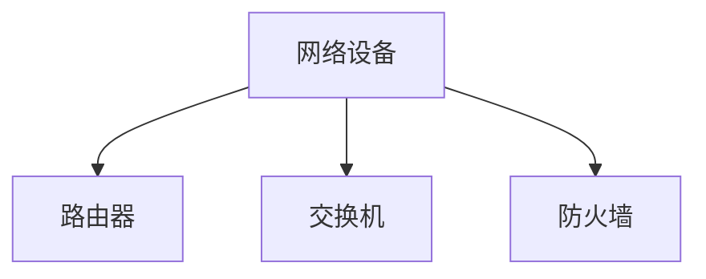

## 3. 核心算法原理 & 具体操作步骤

在字节跳动校招算法面试中，算法题的解答离不开以下几个核心算法原理：

### 3.1 排序算法

排序算法是算法面试中的经典题型，主要包括冒泡排序、选择排序、插入排序、快速排序、归并排序等。以下以快速排序为例，介绍排序算法的原理和具体操作步骤：

#### 3.1.1 原理

快速排序的基本思想是选择一个基准元素，将数组划分为两个子数组，一个子数组中所有元素都比基准元素小，另一个子数组中所有元素都比基准元素大，然后对两个子数组进行递归排序。

#### 3.1.2 具体操作步骤

1. 选择基准元素：从数组中随机选择一个元素作为基准元素。
2. 划分数组：将数组划分为两个子数组，一个子数组中小于基准元素，另一个子数组中大于基准元素。
3. 递归排序：对两个子数组进行递归排序。

### 3.2 查找算法

查找算法是算法面试中的另一个重要题型，主要包括二分查找、哈希查找等。以下以二分查找为例，介绍查找算法的原理和具体操作步骤：

#### 3.2.1 原理

二分查找的基本思想是在有序数组中，通过不断缩小查找范围，逐步逼近目标元素。

#### 3.2.2 具体操作步骤

1. 判断目标元素是否在数组中间位置：将目标元素与中间位置的元素进行比较。
2. 判断目标元素是否在左侧子数组：如果目标元素小于中间位置的元素，则在左侧子数组中继续查找。
3. 判断目标元素是否在右侧子数组：如果目标元素大于中间位置的元素，则在右侧子数组中继续查找。
4. 递归查找：重复上述步骤，直到找到目标元素或确定目标元素不存在。

### 3.3 动态规划

动态规划是解决最优化问题的常用方法，其核心思想是将复杂问题分解为多个子问题，并利用子问题的最优解推导出原问题的最优解。以下以最长公共子序列（LCS）为例，介绍动态规划的具体操作步骤：

#### 3.3.1 原理

最长公共子序列是指两个序列中长度最长的公共子序列。动态规划的基本思想是通过求解子问题的最优解，推导出原问题的最优解。

#### 3.3.2 具体操作步骤

1. 确定状态：设 `dp[i][j]` 表示 `A[0...i]` 和 `B[0...j]` 的最长公共子序列的长度。
2. 确定状态转移方程：根据子问题的最优解推导出原问题的最优解。状态转移方程为：
   $$dp[i][j] = \begin{cases}
   dp[i-1][j-1] + 1, & \text{如果 } A[i-1] = B[j-1] \\
   \max(dp[i-1][j], dp[i][j-1]), & \text{如果 } A[i-1] \neq B[j-1]
   \end{cases}$$
3. 计算最优解：从 `dp[m][n]` 开始，根据状态转移方程逆推，得到最长公共子序列。

## 4. 数学模型和公式 & 详细讲解 & 举例说明

在算法面试中，数学模型和公式是解决问题的关键。以下以线性回归和朴素贝叶斯为例，介绍数学模型和公式的详细讲解及举例说明。

### 4.1 线性回归

线性回归是一种监督学习算法，用于建模自变量和因变量之间的线性关系。

#### 4.1.1 基本概念

- 自变量：独立变量，表示影响因变量的因素。
- 因变量：依赖变量，表示要预测的变量。

#### 4.1.2 数学模型

线性回归的数学模型可以表示为：
$$y = w_0 + w_1x_1 + w_2x_2 + \ldots + w_nx_n$$
其中，$y$ 表示因变量，$w_0, w_1, w_2, \ldots, w_n$ 表示权重，$x_1, x_2, \ldots, x_n$ 表示自变量。

#### 4.1.3 举例说明

假设我们要预测一个人的年龄，自变量包括身高、体重、教育程度等。我们可以使用线性回归模型来建模：

$$年龄 = w_0 + w_1身高 + w_2体重 + w_3教育程度$$

通过训练数据集，我们可以得到最优的权重值，从而预测一个人的年龄。

### 4.2 朴素贝叶斯

朴素贝叶斯是一种基于贝叶斯定理的分类算法，适用于有条件的概率分布。

#### 4.2.1 基本概念

- 条件概率：在某个条件下，某个事件发生的概率。
- 贝叶斯定理：通过条件概率推导出后验概率的公式。

#### 4.2.2 数学模型

朴素贝叶斯的数学模型可以表示为：
$$P(A|B) = \frac{P(B|A)P(A)}{P(B)}$$
其中，$P(A|B)$ 表示在事件 $B$ 发生的条件下，事件 $A$ 发生的概率；$P(B|A)$ 表示在事件 $A$ 发生的条件下，事件 $B$ 发生的概率；$P(A)$ 表示事件 $A$ 发生的概率；$P(B)$ 表示事件 $B$ 发生的概率。

#### 4.2.3 举例说明

假设我们要判断一个人是否是骗子，已知：

- $P(骗子) = 0.1$，即有 10% 的人是骗子。
- $P(骗子|诈骗) = 0.9$，即在诈骗者中有 90% 的人是骗子。
- $P(非骗子) = 0.9$，即有 90% 的人不是骗子。
- $P(非骗子|未诈骗) = 0.1$，即在非诈骗者中有 10% 的人不是骗子。

我们可以使用朴素贝叶斯定理来判断一个人是否是骗子：

$$P(骗子|诈骗) = \frac{P(诈骗|骗子)P(骗子)}{P(诈骗)} = \frac{0.9 \times 0.1}{0.9 \times 0.1 + 0.1 \times 0.9} = 0.9$$

由于 $P(骗子|诈骗) = 0.9$，说明这个人是骗子的概率为 90%，因此我们可以判断这个人很可能是骗子。

## 5. 项目实战：代码实际案例和详细解释说明

### 5.1 开发环境搭建

在进行项目实战之前，我们需要搭建一个适合开发的环境。以下是搭建开发环境的步骤：

1. 安装操作系统：我们选择 Ubuntu 18.04 作为开发环境。
2. 安装编程语言：我们选择 Python 3.8 作为编程语言。
3. 安装开发工具：我们选择 PyCharm 作为开发工具。
4. 安装依赖库：根据项目需求，我们可能需要安装 NumPy、Pandas、Scikit-learn 等依赖库。

### 5.2 源代码详细实现和代码解读

下面是一个使用线性回归进行数据预测的示例代码：

```python
import numpy as np
from sklearn.linear_model import LinearRegression

# 加载数据
X = np.array([[1, 2], [2, 3], [3, 4], [4, 5]])
y = np.array([3, 4, 5, 6])

# 创建线性回归模型
model = LinearRegression()

# 训练模型
model.fit(X, y)

# 预测
y_pred = model.predict(np.array([[1, 3]]))

print("预测结果：", y_pred)
```

#### 5.2.1 代码解读

1. 导入必要的库：`numpy` 用于数据处理，`sklearn.linear_model` 用于线性回归模型。
2. 加载数据：`X` 表示自变量，`y` 表示因变量。
3. 创建线性回归模型：`model = LinearRegression()`
4. 训练模型：`model.fit(X, y)`，使用训练数据训练模型。
5. 预测：`y_pred = model.predict(np.array([[1, 3]]))`，使用训练好的模型预测新的数据。

### 5.3 代码解读与分析

在这个示例中，我们使用线性回归模型对数据进行预测。具体分析如下：

1. **数据预处理**：首先，我们需要对数据进行预处理，包括数据清洗、特征工程等。在本示例中，我们直接使用了给定的数据。
2. **模型选择**：线性回归是一种简单且常用的模型，适用于建模自变量和因变量之间的线性关系。在本示例中，我们选择了线性回归模型。
3. **模型训练**：使用训练数据对模型进行训练，得到权重值。在本示例中，我们使用了 `model.fit(X, y)` 方法进行训练。
4. **模型预测**：使用训练好的模型对新的数据进行预测。在本示例中，我们使用 `model.predict(np.array([[1, 3]]))` 方法进行预测。

## 6. 实际应用场景

线性回归和朴素贝叶斯在实际应用中非常广泛。以下是一些实际应用场景：

1. **金融领域**：线性回归可以用于预测股票价格、利率等金融指标；朴素贝叶斯可以用于信用评分、欺诈检测等。
2. **医疗领域**：线性回归可以用于预测疾病的发病率、患者康复时间等；朴素贝叶斯可以用于疾病诊断、患者分类等。
3. **电子商务**：线性回归可以用于预测商品销量、用户购买概率等；朴素贝叶斯可以用于推荐系统、用户行为分析等。
4. **社交网络**：线性回归可以用于预测用户活跃度、好友关系等；朴素贝叶斯可以用于垃圾邮件过滤、用户情感分析等。

## 7. 工具和资源推荐

### 7.1 学习资源推荐

1. **书籍**：
   - 《深度学习》（Goodfellow, Bengio, Courville 著）
   - 《机器学习》（周志华 著）
   - 《计算机网络》（谢希仁 著）
2. **在线课程**：
   - Coursera 上的《机器学习》课程（吴恩达 著）
   - edX 上的《深度学习》课程（Ian Goodfellow 著）
   - Coursera 上的《计算机网络》课程（谢希仁 著）
3. **博客和网站**：
   - [机器学习博客](https://www.tensorflow.org/tutorials/)
   - [深度学习博客](https://jalammar.github.io/)
   - [计算机网络博客](https://www.bilibili.com/video/BV1Kz4y1d7c9)

### 7.2 开发工具框架推荐

1. **编程语言**：Python、Java、C++等。
2. **开发工具**：PyCharm、Visual Studio Code、Eclipse 等。
3. **机器学习库**：Scikit-learn、TensorFlow、PyTorch 等。
4. **计算机网络工具**：Wireshark、Nmap、Ixia 等。

### 7.3 相关论文著作推荐

1. **机器学习**：
   - "A Fast and Scalable Algorithm for Clustering in Large Datasets"（大规模数据集快速聚类算法）
   - "Deep Learning for Image Recognition"（深度学习在图像识别中的应用）
2. **计算机网络**：
   - "TCP/IP详解 卷1：协议"（TCP/IP协议详解）
   - "计算机网络：自顶向下方法"（自顶向下的计算机网络方法）

## 8. 总结：未来发展趋势与挑战

随着人工智能技术的快速发展，算法面试题库也将不断更新和丰富。未来，算法面试将更加注重对实际问题的解决能力，对编程能力、算法思维、数学基础等方面的要求将越来越高。同时，随着计算机网络技术的不断进步，网络攻击、数据隐私等问题也将成为算法面试的重要内容。

## 9. 附录：常见问题与解答

### 9.1 问题 1

**问题**：什么是线性回归？

**解答**：线性回归是一种监督学习算法，用于建模自变量和因变量之间的线性关系。其数学模型可以表示为 $y = w_0 + w_1x_1 + w_2x_2 + \ldots + w_nx_n$，其中 $y$ 表示因变量，$w_0, w_1, w_2, \ldots, w_n$ 表示权重，$x_1, x_2, \ldots, x_n$ 表示自变量。

### 9.2 问题 2

**问题**：什么是朴素贝叶斯？

**解答**：朴素贝叶斯是一种基于贝叶斯定理的分类算法，适用于有条件的概率分布。其数学模型可以表示为 $P(A|B) = \frac{P(B|A)P(A)}{P(B)}$，其中 $P(A|B)$ 表示在事件 $B$ 发生的条件下，事件 $A$ 发生的概率；$P(B|A)$ 表示在事件 $A$ 发生的条件下，事件 $B$ 发生的概率；$P(A)$ 表示事件 $A$ 发生的概率；$P(B)$ 表示事件 $B$ 发生的概率。

## 10. 扩展阅读 & 参考资料

1. 周志华.《机器学习》[M]. 清华大学出版社，2016.
2. Ian Goodfellow, Yoshua Bengio, Aaron Courville.《深度学习》[M]. 人民邮电出版社，2016.
3. 谢希仁.《计算机网络》[M]. 人民邮电出版社，2013.
4. TensorFlow 官网：[https://www.tensorflow.org/](https://www.tensorflow.org/)
5. PyTorch 官网：[https://pytorch.org/](https://pytorch.org/)
6. Wireshark 官网：[https://www.wireshark.org/](https://www.wireshark.org/)

