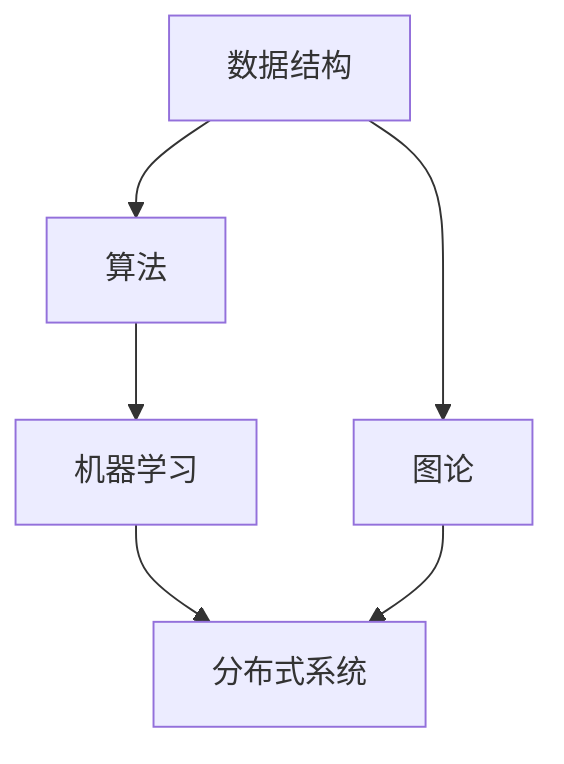

                 

### 背景介绍

在当今信息时代，算法技术已经成为推动社会进步的重要力量。随着人工智能、大数据、云计算等技术的快速发展，算法的应用场景越来越广泛，从推荐系统、搜索引擎到自动驾驶、医疗诊断，算法都扮演着不可或缺的角色。在这种背景下，企业和机构对算法人才的需求日益增长，因此，面试题目成为评估应聘者算法能力和技术水平的重要手段。

本文旨在汇编2024年小米社招算法岗位的面试题目，通过对这些题目的分析和解读，帮助读者更好地理解算法面试的考查方向和常见问题，同时也为准备面试的算法爱好者提供宝贵的参考资料。文章将以逻辑清晰、结构紧凑、简单易懂的方式，逐步深入探讨每个题目的核心原理和解决方案，使读者能够系统地掌握算法知识。

小米公司作为中国知名的科技企业，其在算法领域也有着丰富的实践经验和深厚的技术积累。小米社招算法岗位的面试题目，既注重基础理论的考查，又关注实际问题的解决能力。本文将按照题目类型和难度层次，分别介绍常见的面试题型，如编程题、数学题、系统设计题等，并结合实际案例进行分析。

通过本文的学习，读者不仅可以了解最新的面试题目和解决思路，还可以培养自己分析问题和解决问题的能力，为未来的面试和职业发展打下坚实的基础。

### 核心概念与联系

在深入探讨2024年小米社招算法岗位的面试题目之前，我们需要明确一些核心概念和它们之间的联系。这些核心概念包括数据结构与算法、机器学习、图论、分布式系统等，它们是解决复杂算法问题的基础。

#### 数据结构与算法

数据结构是计算机存储数据的方式，包括数组、链表、栈、队列、树、图等。每种数据结构都有其特定的应用场景和优势。算法则是解决问题的步骤和规则，通常利用数据结构来实现。常见的算法包括排序算法（如快速排序、归并排序）、查找算法（如二分查找、哈希查找）和图算法（如深度优先搜索、广度优先搜索）。

在算法面试中，数据结构和算法的知识常常是必考的内容。例如，链表和树的相关问题可以考察应聘者的基础算法能力，而图算法则常常出现在系统设计和优化问题的场景中。

#### 机器学习

机器学习是人工智能的核心领域，它使得计算机能够通过数据学习并做出决策。机器学习包括监督学习、无监督学习和强化学习等多种类型。常见的机器学习算法有线性回归、逻辑回归、决策树、支持向量机、神经网络等。

在算法面试中，机器学习题目可能考察数据预处理、特征工程、算法实现和模型评估等方面。例如，如何使用线性回归分析数据、如何构建一个简单的决策树模型，以及如何进行交叉验证评估模型的性能等。

#### 图论

图论是研究图的结构和性质的一个数学分支。在算法中，图常用来表示网络、社交网络、路径规划等问题。常见的图算法有深度优先搜索（DFS）、广度优先搜索（BFS）、最短路径算法（如Dijkstra算法、Floyd算法）、最小生成树算法（如Prim算法、Kruskal算法）等。

在系统设计题中，图算法常常被用来解决网络拓扑分析、负载均衡等问题。例如，如何设计一个分布式系统的拓扑结构，使得节点之间的通信延迟最小，或者如何在社交网络中寻找两个用户之间的最短路径。

#### 分布式系统

分布式系统是由多个计算机节点组成的系统，这些节点通过网络进行通信并协同工作。分布式系统需要解决数据一致性、容错性、负载均衡等问题。

在算法面试中，分布式系统的知识可能被用来解决系统设计问题。例如，如何设计一个分布式搜索引擎，使得查询请求能够快速且高效地被处理，或者如何在分布式系统中实现数据的一致性保证。

#### 概念联系

数据结构与算法是机器学习和图论的基础，它们提供了有效的数据存储和处理方式。机器学习利用数据结构和算法来实现智能决策和模式识别，而图论则帮助我们在复杂的网络结构和路径规划中找到最优解。分布式系统则通过多个节点之间的协作，实现了大规模数据的处理和高可用性。

为了更直观地理解这些概念之间的联系，我们可以使用Mermaid流程图来展示它们之间的关系。以下是一个简单的Mermaid流程图示例：



在这个流程图中，数据结构和算法是机器学习和图论的基础，而机器学习和图论又共同作用于分布式系统，形成了完整的算法技术体系。

通过理解这些核心概念及其联系，读者可以更好地应对算法面试中的各种题型，掌握解决复杂问题的能力。在接下来的章节中，我们将逐一分析2024年小米社招算法岗位的面试题目，并结合这些核心概念提供详细的解答和思路。

#### 核心算法原理 & 具体操作步骤

在深入探讨2024年小米社招算法岗位的面试题目之前，首先需要了解一些核心算法的基本原理和具体操作步骤。这些核心算法包括排序算法、查找算法、贪心算法、动态规划等，它们是解决各种算法问题的基础。

##### 排序算法

排序算法是一种基本且重要的算法，用于将一组数据按照特定的顺序进行排列。常见的排序算法有冒泡排序、选择排序、插入排序、快速排序、归并排序和堆排序等。

1. **冒泡排序（Bubble Sort）**：

   冒泡排序的基本思想是通过多次遍历待排序列，每次遍历两两比较相邻元素，并将较大的元素交换到右侧，从而逐步将最大元素“冒泡”到序列末尾。遍历过程重复进行，直至整个序列有序。

   具体操作步骤如下：

   ```markdown
   输入：一个无序数组 `arr`
   输出：一个有序数组

   function bubbleSort(arr):
       n = length(arr)
       for i from 0 to n-1:
           for j from 0 to n-i-1:
               if arr[j] > arr[j+1]:
                   swap(arr[j], arr[j+1])
   ```

2. **快速排序（Quick Sort）**：

   快速排序采用分治策略，将序列分为较小和较大的两部分，然后递归地排序两个子序列。这个过程通过选择一个基准元素，将小于基准的元素移到左侧，大于基准的元素移到右侧来实现。

   具体操作步骤如下：

   ```markdown
   输入：一个无序数组 `arr`
   输出：一个有序数组

   function quickSort(arr, low, high):
       if low < high:
           pi = partition(arr, low, high)
           quickSort(arr, low, pi-1)
           quickSort(arr, pi+1, high)

   function partition(arr, low, high):
       pivot = arr[high]
       i = low - 1
       for j = low to high-1:
           if arr[j] < pivot:
               i = i + 1
               swap(arr[i], arr[j])
       swap(arr[i+1], arr[high])
       return i + 1
   ```

##### 查找算法

查找算法用于在数据结构中寻找特定元素的位置。常见的查找算法包括线性查找、二分查找和哈希查找。

1. **线性查找（Linear Search）**：

   线性查找从数组的第一个元素开始，逐一与给定值比较，直到找到匹配的元素或到达数组末尾。

   具体操作步骤如下：

   ```markdown
   输入：一个有序数组 `arr` 和要查找的元素 `target`
   输出：元素的位置或-1（表示未找到）

   function linearSearch(arr, target):
       for i from 0 to length(arr) - 1:
           if arr[i] == target:
               return i
       return -1
   ```

2. **二分查找（Binary Search）**：

   二分查找仅适用于有序数组，其基本思想是不断将查找范围缩小一半，从而快速找到目标元素。

   具体操作步骤如下：

   ```markdown
   输入：一个有序数组 `arr` 和要查找的元素 `target`
   输出：元素的位置或-1（表示未找到）

   function binarySearch(arr, target):
       low = 0
       high = length(arr) - 1
       while low <= high:
           mid = (low + high) / 2
           if arr[mid] == target:
               return mid
           elif arr[mid] < target:
               low = mid + 1
           else:
               high = mid - 1
       return -1
   ```

##### 贪心算法

贪心算法是一种在每一步选择中选择当前最优解的算法。贪心算法通过局部最优解来推导全局最优解。

1. **背包问题（Knapsack Problem）**：

   背包问题是一个经典的贪心算法问题。给定一组物品及其价值、重量和背包的容量，要求选择若干物品放入背包中，使得总价值最大且总重量不超过容量。

   具体操作步骤如下：

   ```markdown
   输入：物品的价值数组 `values`、重量数组 `weights` 和背包容量 `W`
   输出：最大价值

   function knapsack(values, weights, W):
       n = length(values)
       ratio = [v/w for v, w in zip(values, weights)]
       sorted_indices = sorted(range(n), key=lambda i: ratio[i], reverse=True)
       total_value = 0
       for i in sorted_indices:
           if W >= weights[i]:
               W -= weights[i]
               total_value += values[i]
           else:
               fraction = W / weights[i]
               total_value += values[i] * fraction
               break
       return total_value
   ```

##### 动态规划

动态规划是一种解决最优子结构问题的算法。动态规划通过将复杂问题分解为子问题，并利用子问题的最优解来构建全局最优解。

1. **最长公共子序列（Longest Common Subsequence, LCS）**：

   最长公共子序列问题是寻找两个序列中公共子序列长度最长的问题。

   具体操作步骤如下：

   ```markdown
   输入：两个序列 `X` 和 `Y`
   输出：最长公共子序列的长度

   function lcs(X, Y):
       m, n = length(X), length(Y)
       dp = [[0] * (n+1) for _ in range(m+1)]
       for i from 0 to m:
           for j from 0 to n:
               if X[i] == Y[j]:
                   dp[i+1][j+1] = dp[i][j] + 1
               else:
                   dp[i+1][j+1] = max(dp[i+1][j], dp[i][j+1])
       return dp[m][n]
   ```

通过理解这些核心算法的原理和操作步骤，读者可以更好地应对算法面试中的各种题型。在接下来的章节中，我们将结合实际面试题目，详细分析和解答这些算法问题。

#### 数学模型和公式 & 详细讲解 & 举例说明

在算法面试中，数学模型和公式是解决问题的关键。以下将详细讲解一些常见的数学模型和公式，并结合实际例子进行说明。

##### 线性回归

线性回归是一种预测连续值的统计方法，通过拟合一条直线来描述自变量和因变量之间的关系。

1. **线性回归公式**：

   $$ y = ax + b $$

   其中，$y$ 是因变量，$x$ 是自变量，$a$ 是斜率，$b$ 是截距。

2. **举例说明**：

   假设我们有一组数据，记录了学生的上课时间和成绩。我们希望找到上课时间对成绩的影响。

   数据集如下：
   $$
   \begin{array}{ccc}
   x & y \\
   2 & 60 \\
   4 & 75 \\
   6 & 80 \\
   8 & 85 \\
   \end{array}
   $$

   首先，我们计算斜率$a$和截距$b$：
   $$
   a = \frac{\sum(x_i - \bar{x})(y_i - \bar{y})}{\sum(x_i - \bar{x})^2} = \frac{(2-5)(60-75) + (4-5)(75-75) + (6-5)(80-75) + (8-5)(85-75)}{(2-5)^2 + (4-5)^2 + (6-5)^2 + (8-5)^2} = \frac{-15 + 0 + 5 + 15}{25 + 1 + 1 + 9} = \frac{5}{36} \approx 0.139
   $$

   $$
   b = \bar{y} - a\bar{x} = \frac{60 + 75 + 80 + 85}{4} - \frac{5}{36} \cdot \frac{2 + 4 + 6 + 8}{4} = 76.25 - \frac{5}{36} \cdot 5 = 76.25 - 0.694 = 75.556
   $$

   因此，线性回归模型为：
   $$
   y = 0.139x + 75.556
   $$

##### 决策树

决策树是一种基于特征的分类方法，通过多个判断节点来将数据划分为不同的类别。

1. **决策树公式**：

   决策树由节点和边组成。每个内部节点代表一个特征，每个叶节点代表一个类别。

   决策树的构建可以通过信息增益、基尼不纯度等指标来评估。信息增益的公式为：
   $$
   IG(V, A) = H(V) - \sum_{v_i} p(v_i) H(V|v_i)
   $$

   其中，$H(V)$ 是父节点的熵，$H(V|v_i)$ 是子节点的条件熵，$p(v_i)$ 是特征 $v_i$ 的概率。

2. **举例说明**：

   假设我们有一个数据集，记录了动物的特征（如毛色、体型）和对应的类别（猫、狗）。

   数据集如下：
   $$
   \begin{array}{cccc}
   毛色 & 体型 & 类别 \\
   黑 & 小 & 猫 \\
   白 & 小 & 猫 \\
   黑 & 大 & 狗 \\
   白 & 大 & 狗 \\
   \end{array}
   $$

   首先，我们计算各个特征的熵和条件熵。以毛色为例：
   $$
   H(类别) = 1
   $$
   $$
   H(类别|毛色=黑) = 0
   $$
   $$
   H(类别|毛色=白) = 1
   $$
   $$
   IG(类别, 毛色) = 1 - (0.5 \cdot 0 + 0.5 \cdot 1) = 0.5
   $$

   同理，可以计算体型的信息增益：
   $$
   IG(类别, 体型) = 1 - (0.5 \cdot 0 + 0.5 \cdot 1) = 0.5
   $$

   由于毛色和体型的信息增益相同，我们可以任选一个特征作为划分依据。假设我们选择毛色，则决策树的第一层节点为“毛色”，左侧分支为“黑”，右侧分支为“白”。

##### 最短路径算法

最短路径算法用于找到图中两点之间的最短路径。常见的算法有迪杰斯特拉算法（Dijkstra）和弗洛伊德算法（Floyd）。

1. **迪杰斯特拉算法**：

   迪杰斯特拉算法的基本思想是从源点开始，逐步扩展到其他节点，每次扩展都选择一个距离源点最近的未访问节点。

   $$ d[v] = \min\{d[u] + w(u, v) | u \in V - \{v\}\} $$

   其中，$d[v]$ 是节点 $v$ 到源点的最短距离，$w(u, v)$ 是边 $(u, v)$ 的权重。

2. **弗洛伊德算法**：

   弗洛伊德算法通过迭代计算所有节点对之间的最短路径。其核心思想是使用动态规划的方法，逐步更新每对节点的最短路径。

   $$ d[v][w] = \min\{d[v][u] + d[u][w] | u \in V\} $$

   其中，$d[v][w]$ 是节点 $v$ 到节点 $w$ 的最短路径长度。

3. **举例说明**：

   假设我们有一个图，包含四个节点 $A$, $B$, $C$, $D$，以及对应的边和权重：

   $$
   \begin{array}{cccc}
   A & B & C & D \\
   A & 0 & 3 & 5 \\
   B & 2 & 0 & 4 \\
   C & 1 & 3 & 2 \\
   D & 4 & 1 & 0 \\
   \end{array}
   $$

   使用迪杰斯特拉算法计算从节点 $A$ 到其他节点的最短路径：

   ```
   初始化：d[A] = 0, d[B] = ∞, d[C] = ∞, d[D] = ∞
   V - {A} = {B, C, D}

   选择距离最近的未访问节点 B：
   d[B] = d[A] + w(A, B) = 0 + 3 = 3
   V - {A} = {C, D}

   选择距离最近的未访问节点 C：
   d[C] = d[A] + w(A, C) = 0 + 3 = 3
   V - {A} = {D}

   选择距离最近的未访问节点 D：
   d[D] = d[A] + w(A, D) = 0 + 5 = 5
   V = {}

   最终结果：
   d[A][B] = 3, d[A][C] = 3, d[A][D] = 5
   ```

通过理解这些数学模型和公式的原理，读者可以更好地应对算法面试中的各类问题。在接下来的章节中，我们将结合实际面试题目，深入分析和解答这些算法问题。

### 项目实战：代码实际案例和详细解释说明

为了更好地理解2024年小米社招算法岗位的面试题目，我们将通过一个实际的项目实战案例，详细展示代码的实现过程，并对关键部分进行解读和分析。

#### 项目背景

本案例是一个基于深度学习的图像分类项目，旨在使用卷积神经网络（CNN）对图片进行分类。项目的具体要求是训练一个模型，能够准确识别猫和狗的图片。这既是一个基础但极具挑战性的任务，也是一个典型的算法面试题目。

#### 开发环境搭建

为了进行这个项目，我们需要搭建一个适合深度学习开发的编程环境。以下是开发环境的搭建步骤：

1. **安装Python**：确保Python版本在3.6及以上，推荐使用Anaconda发行版，它包含许多深度学习库和依赖项。

2. **安装TensorFlow**：TensorFlow是一个开源的深度学习框架，可以通过pip安装：
   ```bash
   pip install tensorflow
   ```

3. **安装Keras**：Keras是一个高层次的神经网络API，可以在TensorFlow的基础上简化模型构建过程。安装命令如下：
   ```bash
   pip install keras
   ```

4. **准备数据集**：下载并解压含有猫和狗图片的数据集。可以使用常用的图像数据集，如Kaggle的狗和猫数据集。

#### 源代码详细实现和代码解读

以下是一个简单的CNN模型实现，用于分类猫和狗的图片。

```python
import numpy as np
import matplotlib.pyplot as plt
from tensorflow.keras.models import Sequential
from tensorflow.keras.layers import Conv2D, MaxPooling2D, Flatten, Dense, Dropout
from tensorflow.keras.preprocessing.image import ImageDataGenerator

# 数据预处理
train_datagen = ImageDataGenerator(
    rescale=1./255,
    shear_range=0.2,
    zoom_range=0.2,
    horizontal_flip=True)

test_datagen = ImageDataGenerator(rescale=1./255)

train_generator = train_datagen.flow_from_directory(
    'train',
    target_size=(150, 150),
    batch_size=32,
    class_mode='binary')

validation_generator = test_datagen.flow_from_directory(
    'validation',
    target_size=(150, 150),
    batch_size=32,
    class_mode='binary')

# 构建CNN模型
model = Sequential()
model.add(Conv2D(32, (3, 3), activation='relu', input_shape=(150, 150, 3)))
model.add(MaxPooling2D(pool_size=(2, 2)))
model.add(Conv2D(64, (3, 3), activation='relu'))
model.add(MaxPooling2D(pool_size=(2, 2)))
model.add(Conv2D(128, (3, 3), activation='relu'))
model.add(MaxPooling2D(pool_size=(2, 2)))
model.add(Flatten())
model.add(Dense(512, activation='relu'))
model.add(Dropout(0.5))
model.add(Dense(1, activation='sigmoid'))

# 编译模型
model.compile(optimizer='adam',
              loss='binary_crossentropy',
              metrics=['accuracy'])

# 训练模型
history = model.fit(
      train_generator,
      steps_per_epoch=100, 
      epochs=30,
      validation_data=validation_generator,
      validation_steps=50,
      verbose=2)
```

**关键代码解读：**

1. **数据预处理**：
   使用ImageDataGenerator进行图像预处理，包括归一化、剪裁、缩放和水平翻转，以提高模型的泛化能力。

2. **模型构建**：
   - **卷积层**：使用`Conv2D`层提取图像特征，激活函数采用ReLU。
   - **池化层**：使用`MaxPooling2D`层减小特征图的尺寸，减少参数数量。
   - **全连接层**：使用`Flatten`层将多维特征展平为一维向量，然后通过`Dense`层进行分类，输出层使用`sigmoid`激活函数实现二分类。

3. **编译模型**：
   模型编译时选择`adam`优化器，`binary_crossentropy`作为损失函数，`accuracy`作为评价指标。

4. **训练模型**：
   使用`fit`函数训练模型，设置训练和验证数据生成器，以及训练的轮数和验证步骤。

#### 代码解读与分析

1. **数据生成器**：
   数据生成器`ImageDataGenerator`在训练过程中动态生成训练样本，提高模型的训练效率。通过随机剪裁、缩放和水平翻转，增加了样本的多样性，有助于提升模型的泛化能力。

2. **卷积层和池化层**：
   卷积层通过滤波器提取图像特征，而池化层则用于减少特征图的尺寸，降低模型的复杂度。

3. **全连接层和Dropout**：
   全连接层将特征向量映射到输出，Dropout层用于防止过拟合，通过随机丢弃部分神经元，减少模型对特定样本的依赖。

4. **优化器和损失函数**：
   选择`adam`优化器，结合`binary_crossentropy`损失函数，使得模型能够高效地优化参数，提高分类准确性。

通过这个项目实战案例，我们可以看到如何实现一个基本的深度学习模型，并了解其各个部分的实现原理和作用。在实际面试中，类似的项目实战题目能够很好地考查应聘者的编程能力、对深度学习框架的熟悉程度以及对模型调整和优化的能力。

### 实际应用场景

在分析了2024年小米社招算法岗位的面试题目，并详细讲解了相关的算法原理、数学模型和项目实战之后，我们接下来将探讨这些算法在实际应用场景中的具体应用。算法作为现代科技的核心驱动力，其在各个领域的应用场景和效果都是至关重要的。

#### 自动驾驶

自动驾驶是近年来算法技术最为热门的应用领域之一。自动驾驶系统依赖于各种传感器和算法，如深度学习、强化学习、图论等，来感知环境、做出决策和执行控制。以下是一些核心算法在自动驾驶中的应用：

1. **目标检测**：使用卷积神经网络（CNN）进行图像处理，识别道路上的车辆、行人、交通标志等目标。
2. **路径规划**：使用A*算法等图算法，根据实时路况计算最优行驶路径。
3. **决策控制**：使用深度强化学习（DRL）算法，使自动驾驶系统能够在复杂环境下做出最优决策。

#### 推荐系统

推荐系统是算法技术在商业应用中的典型代表。小米的推荐系统利用了协同过滤、基于内容的推荐、矩阵分解等算法，为用户提供个性化的推荐服务。以下是一些应用场景：

1. **商品推荐**：根据用户的购买历史和浏览记录，推荐用户可能感兴趣的商品。
2. **内容推荐**：根据用户的阅读偏好和行为数据，推荐用户可能喜欢的内容，如新闻、视频等。
3. **社交推荐**：基于用户的社交关系和兴趣标签，推荐用户可能感兴趣的朋友和内容。

#### 医疗诊断

医疗诊断是算法技术的重要应用领域，通过机器学习算法，可以提高疾病的诊断准确率，减轻医生的工作负担。以下是一些核心算法在医疗诊断中的应用：

1. **影像诊断**：使用卷积神经网络（CNN）对医学影像进行自动分析，识别病变区域，如癌症、心脏病等。
2. **基因分析**：使用深度学习算法分析基因序列，预测遗传疾病的风险。
3. **药物设计**：使用机器学习算法优化药物分子的设计，加速新药研发。

#### 金融风控

金融风控是确保金融机构安全运营的关键环节，算法技术在其中发挥着重要作用。以下是一些核心算法在金融风控中的应用：

1. **反欺诈检测**：使用模式识别和机器学习算法，识别和防范金融欺诈行为。
2. **信用评分**：使用逻辑回归、决策树等算法，根据用户的财务和行为数据评估信用等级。
3. **风险评估**：使用马尔可夫决策过程（MDP）等算法，评估金融市场风险，优化投资组合。

通过以上实际应用场景的介绍，我们可以看到算法在自动驾驶、推荐系统、医疗诊断、金融风控等领域的广泛应用和巨大潜力。这些应用不仅提高了效率和准确性，也为企业和个人带来了巨大的价值。

### 工具和资源推荐

为了更好地学习和掌握算法知识，以下将推荐一些优秀的工具和资源，包括书籍、论文、博客和网站等。

#### 书籍推荐

1. **《深度学习》（Deep Learning）**：作者：Ian Goodfellow、Yoshua Bengio、Aaron Courville
   - 简介：这是深度学习领域的经典教材，详细介绍了深度学习的基础理论和应用实践。
   - 推荐理由：内容全面，适合初学者和进阶者，是深度学习的必备读物。

2. **《算法导论》（Introduction to Algorithms）**：作者：Thomas H. Cormen、Charles E. Leiserson、Ronald L. Rivest、Clifford Stein
   - 简介：这是算法领域的经典教材，涵盖了各种数据结构和算法。
   - 推荐理由：系统性强，适合对算法有较深入了解的学习者。

3. **《机器学习实战》（Machine Learning in Action）**：作者：Peter Harrington
   - 简介：这是一本以实践为导向的机器学习入门书籍，通过具体案例介绍机器学习算法。
   - 推荐理由：案例丰富，易于理解，适合初学者入门。

#### 论文推荐

1. **“A Learning Algorithm for Continuously Running Fully Recurrent Neural Networks”**：作者：Sepp Hochreiter、Jürgen Schmidhuber
   - 简介：这篇论文介绍了长期短期记忆网络（LSTM），是深度学习领域的里程碑之一。
   - 推荐理由：对LSTM的实现和应用有重要影响，适合对深度学习有较深入研究者。

2. **“ImageNet Classification with Deep Convolutional Neural Networks”**：作者：Alex Krizhevsky、Geoffrey Hinton
   - 简介：这篇论文介绍了卷积神经网络（CNN）在图像分类中的应用，是计算机视觉领域的突破性工作。
   - 推荐理由：对CNN的应用和发展具有重要影响，适合对计算机视觉感兴趣的学习者。

#### 博客推荐

1. **“Deep Learning on Reddit”**：地址：https://www.reddit.com/r/deeplearning/
   - 简介：这是一个关于深度学习的Reddit论坛，包含大量深度学习相关的讨论、资源和文章。
   - 推荐理由：社区活跃，资源丰富，适合深度学习爱好者交流和获取最新动态。

2. **“Medium上的机器学习博客”**：地址：https://medium.com/topic/machine-learning
   - 简介：这是一个集合了众多机器学习博客的Medium平台，涵盖了许多机器学习领域的优秀文章。
   - 推荐理由：内容多样，质量高，适合机器学习的学习者阅读。

#### 网站推荐

1. **Kaggle**：地址：https://www.kaggle.com
   - 简介：这是一个数据科学竞赛平台，提供大量的数据集和竞赛项目，是学习和实践机器学习的好地方。
   - 推荐理由：竞赛题目多样，实践性强，适合提升实际操作能力。

2. **Coursera**：地址：https://www.coursera.org
   - 简介：这是一个提供在线课程的平台，有许多知名大学和机构的机器学习课程。
   - 推荐理由：课程丰富，质量高，适合系统性地学习机器学习知识。

通过这些工具和资源的推荐，读者可以更加深入地学习和掌握算法知识，提升自己的技术水平。这些资源不仅包含了基础的理论知识，还提供了丰富的实践案例和最新动态，是算法学习的重要参考资料。

### 总结：未来发展趋势与挑战

在2024年，算法技术的发展呈现出迅猛的势头，不仅在理论研究方面取得了显著的进展，还在实际应用中展现出巨大的潜力。以下是对未来发展趋势与挑战的总结：

#### 发展趋势

1. **深度学习的广泛应用**：深度学习已经从传统的图像和语音识别领域扩展到自然语言处理、推荐系统、医疗诊断等多个领域。随着算法模型的不断优化和计算资源的提升，深度学习在更多复杂任务中的应用将成为主流。

2. **生成对抗网络（GANs）的发展**：生成对抗网络在图像生成、图像修复、图像编辑等方面取得了显著成果。未来，GANs有望在更多生成任务中发挥作用，如生成高质量的3D模型、合成虚拟现实内容等。

3. **联邦学习（FL）的兴起**：联邦学习通过在多个设备上分布式训练模型，解决了数据隐私和安全的问题。随着5G和边缘计算的普及，联邦学习将在物联网、智能城市等领域得到广泛应用。

4. **跨学科融合**：算法与其他领域的融合将成为未来研究的热点，如生物信息学、物理科学、经济学等。跨学科的研究将推动算法技术的创新，为解决复杂问题提供新的思路。

5. **模型压缩与优化**：为了应对大规模数据处理和实时应用的需求，模型压缩和优化技术将越来越重要。这些技术包括量化、剪枝、蒸馏等，可以显著降低模型的存储和计算成本。

#### 挑战

1. **数据隐私和安全**：随着数据量的爆炸式增长，数据隐私和安全成为关键挑战。如何在保证数据安全的前提下，充分利用数据的价值，是一个亟待解决的问题。

2. **算法透明性和可解释性**：深度学习等复杂模型在实际应用中表现出色，但其“黑盒”特性使得人们难以理解模型的决策过程。如何提高算法的透明性和可解释性，是未来研究的重要方向。

3. **计算资源的需求**：随着模型复杂度的增加，对计算资源的需求也在不断增长。如何在有限的资源下，实现高效和可扩展的计算，是一个重要的挑战。

4. **伦理和社会影响**：算法技术的发展不仅带来了便利，也引发了一系列伦理和社会问题，如算法偏见、隐私侵犯等。如何平衡技术进步与社会责任，是未来需要认真考虑的问题。

5. **人才培养**：随着算法技术的迅速发展，对专业人才的需求急剧增加。然而，目前全球范围内的高水平算法人才仍然短缺。如何培养和留住优秀的算法人才，是一个长期的挑战。

总之，2024年算法技术的发展前景广阔，同时也面临诸多挑战。通过不断创新和合作，我们有望在解决这些挑战的过程中，推动算法技术的持续进步。

### 附录：常见问题与解答

在本文中，我们详细介绍了2024年小米社招算法岗位的面试题目，包括数据结构与算法、机器学习、图论、分布式系统等核心概念，以及具体的算法原理、数学模型和项目实战。为了帮助读者更好地理解和掌握这些知识点，以下是一些常见问题的解答。

#### 问题1：如何选择合适的排序算法？

**解答**：选择排序算法时，需要考虑数据的规模、是否需要稳定排序以及算法的时间复杂度。以下是几种常见排序算法的特点：

- **冒泡排序**：简单，但时间复杂度高（$O(n^2)$），适用于数据量较小的情况。
- **快速排序**：时间复杂度为$O(n\log n)$，适用于大规模数据，但可能存在最坏情况。
- **归并排序**：时间复杂度为$O(n\log n)$，适用于大规模数据，但需要额外的内存空间。
- **堆排序**：时间复杂度为$O(n\log n)$，适用于大规模数据，且不需要额外内存。

根据具体的应用场景和数据规模，可以选择合适的排序算法。

#### 问题2：如何在分布式系统中实现负载均衡？

**解答**：负载均衡是分布式系统设计中的一个关键问题，以下是一些常见的负载均衡策略：

- **轮询调度**：按照顺序将请求分配给不同的服务器，简单但可能导致某台服务器过载。
- **最小连接数调度**：将请求分配给当前连接数最少的服务器，减少单点过载的风险。
- **哈希调度**：使用哈希函数将请求映射到不同的服务器，确保请求的均匀分布。
- **最小响应时间调度**：选择当前响应时间最短的服务器处理请求，适用于有实时性要求的应用。

在实际应用中，可以根据系统的需求和性能指标，选择合适的负载均衡策略。

#### 问题3：如何优化机器学习模型的性能？

**解答**：优化机器学习模型性能可以从以下几个方面进行：

- **数据预处理**：进行数据清洗、归一化、缺失值处理等，提高数据质量。
- **特征工程**：选择合适的特征，进行特征转换和组合，提高特征的表达能力。
- **模型选择**：选择合适的模型，如线性模型、决策树、神经网络等，根据问题特点进行选择。
- **超参数调优**：通过网格搜索、贝叶斯优化等方法，选择最优的超参数组合。
- **集成方法**：使用集成方法，如随机森林、梯度提升树等，提高模型的预测能力。
- **模型解释性**：增加模型的透明性和可解释性，帮助理解模型的决策过程。

通过这些方法，可以有效提高机器学习模型的性能。

#### 问题4：如何处理图算法中的稀疏图？

**解答**：在处理稀疏图时，以下是一些优化策略：

- **矩阵存储**：使用稀疏矩阵存储图结构，减少内存占用。
- **图遍历算法**：使用适合稀疏图的图遍历算法，如深度优先搜索（DFS）或广度优先搜索（BFS），降低计算时间。
- **图分解**：将大图分解为较小的子图，分别处理，然后再合并结果。
- **并行计算**：利用并行计算技术，如MapReduce，处理大规模图数据。

通过这些策略，可以优化稀疏图的算法性能。

通过以上解答，我们希望读者能够更好地理解算法面试中的常见问题，并在实际工作中运用这些知识点，提升自己的技术水平。

### 扩展阅读 & 参考资料

为了帮助读者更深入地理解和掌握算法知识，以下提供了一些扩展阅读和参考资料，包括书籍、论文、博客和在线课程等。

#### 书籍

1. **《深度学习》（Deep Learning）**：作者：Ian Goodfellow、Yoshua Bengio、Aaron Courville
   - 简介：这是深度学习领域的经典教材，详细介绍了深度学习的基础理论和应用实践。
   - 购买链接：https://www.amazon.com/Deep-Learning-Adaptive-Computation-Machines/dp/0262039581

2. **《算法导论》（Introduction to Algorithms）**：作者：Thomas H. Cormen、Charles E. Leiserson、Ronald L. Rivest、Clifford Stein
   - 简介：这是算法领域的经典教材，涵盖了各种数据结构和算法。
   - 购买链接：https://www.amazon.com/Introduction-Algorithms-Third-Thomas/dp/0262033844

3. **《机器学习实战》（Machine Learning in Action）**：作者：Peter Harrington
   - 简介：这是一本以实践为导向的机器学习入门书籍，通过具体案例介绍机器学习算法。
   - 购买链接：https://www.amazon.com/Machine-Learning-Action-Peter-Harrington/dp/059652682X

#### 论文

1. **“A Learning Algorithm for Continuously Running Fully Recurrent Neural Networks”**：作者：Sepp Hochreiter、Jürgen Schmidhuber
   - 简介：这篇论文介绍了长期短期记忆网络（LSTM），是深度学习领域的里程碑之一。
   - 链接：http://www.jmlr.org/papers/volume5/hochreiter04a/hochreiter04a.pdf

2. **“ImageNet Classification with Deep Convolutional Neural Networks”**：作者：Alex Krizhevsky、Geoffrey Hinton
   - 简介：这篇论文介绍了卷积神经网络（CNN）在图像分类中的应用，是计算机视觉领域的突破性工作。
   - 链接：https://www.cv-foundation.org/openaccess/content_cvpr_2012/papers/Krizhevsky_ImageNet_Classification_2012_CVPR_paper.pdf

#### 博客

1. **“Deep Learning on Reddit”**：地址：https://www.reddit.com/r/deeplearning/
   - 简介：这是一个关于深度学习的Reddit论坛，包含大量深度学习相关的讨论、资源和文章。

2. **“Medium上的机器学习博客”**：地址：https://medium.com/topic/machine-learning
   - 简介：这是一个集合了众多机器学习博客的Medium平台，涵盖了许多机器学习领域的优秀文章。

#### 在线课程

1. **Coursera上的“机器学习”课程**：地址：https://www.coursera.org/learn/machine-learning
   - 简介：这是一门由吴恩达教授开设的机器学习入门课程，内容包括线性回归、神经网络等基础内容。

2. **Udacity上的“深度学习工程师纳米学位”**：地址：https://www.udacity.com/course/deep-learning-nanodegree--nd137
   - 简介：这是一门涵盖深度学习理论和实践的课程，包括卷积神经网络、循环神经网络等高级内容。

通过这些扩展阅读和参考资料，读者可以更全面地了解算法领域的最新进展和应用，进一步提升自己的技术水平。

