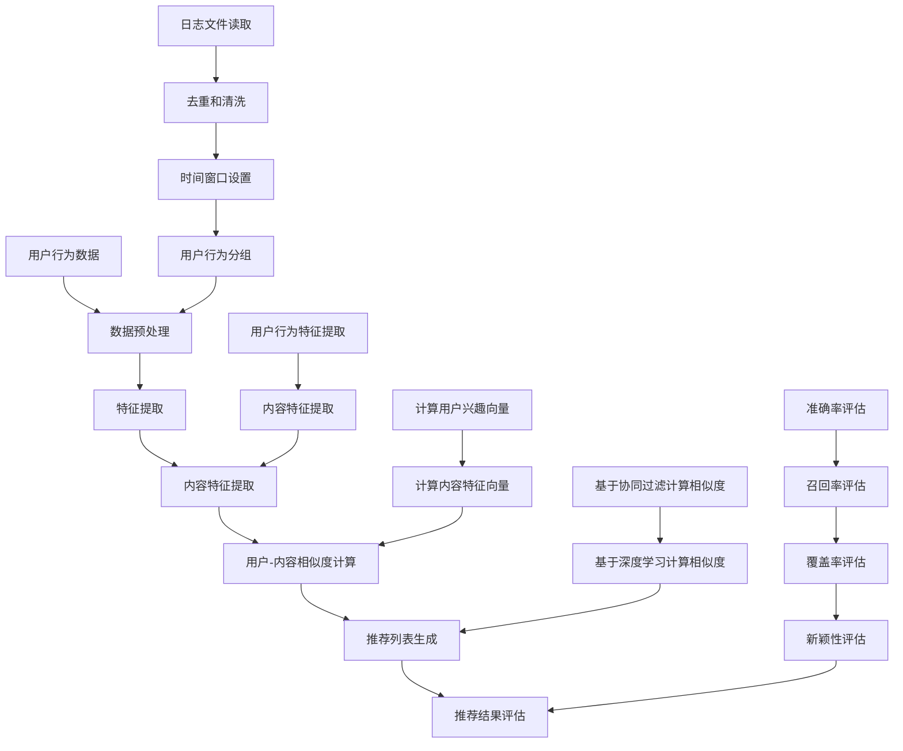

                 

### 背景介绍

#### 快手社招直播推荐算法工程师面试的重要性

快手（Kwai Inc.）是一家中国领先的短视频社交平台，拥有庞大的用户基础和广泛的市场影响力。在快手平台上，直播功能已成为用户互动、娱乐和消费的重要途径。为了提升用户体验，快手不断优化其直播推荐算法，以更好地满足用户的需求。

直播推荐算法工程师作为快手社招的重要职位，承担着优化推荐系统、提升用户满意度和平台盈利能力的重任。面试快手社招直播推荐算法工程师，不仅是对应聘者专业技能的检验，更是对其问题解决能力、逻辑思维和创新意识的全面评估。

本文旨在汇总2025年快手社招直播推荐算法工程师面试中出现的高频问题和答案，帮助应聘者更好地准备面试。我们将从以下几个部分进行详细分析：

1. **核心概念与联系**：介绍直播推荐算法中的关键概念和它们之间的关系。
2. **核心算法原理与具体操作步骤**：深入探讨直播推荐算法的基本原理和实施步骤。
3. **数学模型与公式**：讲解直播推荐算法涉及的数学模型和公式，并进行举例说明。
4. **项目实战**：通过实际案例展示直播推荐算法的实现和应用。
5. **实际应用场景**：分析直播推荐算法在不同场景下的应用和效果。
6. **工具和资源推荐**：推荐学习资源和开发工具，帮助读者深入了解直播推荐算法。
7. **总结与未来发展趋势**：总结直播推荐算法的现状和未来发展趋势，探讨面临的挑战。

通过本文的详细讲解和分析，希望能够帮助读者更好地理解直播推荐算法，并为即将参加快手社招直播推荐算法工程师面试的应聘者提供有力的支持和指导。

#### 文章关键词和摘要

关键词：快手社招、直播推荐算法、面试题汇总、算法原理、数学模型、实战案例、应用场景

摘要：本文旨在为准备快手社招直播推荐算法工程师面试的应聘者提供全面的指导。文章首先介绍了直播推荐算法工程师面试的重要性，随后通过详细分析核心概念、算法原理、数学模型、实战案例、应用场景等内容，帮助读者深入理解直播推荐算法。同时，文章还推荐了学习资源和开发工具，为读者提供了实用的参考。通过本文的学习，读者将能够更好地应对快手社招直播推荐算法工程师的面试挑战。

#### 1.1 快手平台概述

快手（Kwai Inc.）成立于2011年，是一家中国领先的短视频社交平台，其核心业务包括短视频、直播和社交互动。快手平台凭借其独特的算法和内容生态，吸引了大量用户，成为中国移动互联网领域的巨头之一。

快手的用户群体广泛，涵盖了不同年龄、地域和兴趣爱好的人群。平台上拥有大量的短视频和直播内容，用户可以通过上传、观看、点赞、评论等方式进行互动。快手的直播功能尤其受到用户的喜爱，它为用户提供了实时互动、娱乐和消费的途径。

在快手平台上，直播功能已经成为一个重要的组成部分。直播内容涵盖了各种领域，包括但不限于娱乐、教育、游戏、美食、旅游等。直播间的互动性和实时性为用户带来了全新的体验，同时也为平台带来了大量的流量和收益。

#### 1.2 直播推荐算法的定义与目的

直播推荐算法是一种基于用户行为和内容特征的算法，旨在为用户推荐与其兴趣和需求相关的直播内容。这种算法通过分析用户的历史行为数据（如观看记录、点赞、评论等），结合直播内容的特征（如主播属性、标签、内容类型等），构建一个个性化的推荐系统。

直播推荐算法的主要目的是提升用户体验，增加用户粘性，从而提高平台的流量和收益。具体来说，直播推荐算法需要实现以下几个目标：

1. **精准推荐**：根据用户的兴趣和行为，推荐用户可能感兴趣的内容，提高点击率和观看时长。
2. **多样性**：为用户推荐多样化的直播内容，满足不同用户的需求，避免用户感到疲劳。
3. **实时性**：直播内容具有时效性，推荐算法需要快速响应用户的行为，提供最新的直播内容。
4. **公平性**：确保优质内容得到充分的展示，避免劣质内容占据过多推荐资源。

#### 1.3 直播推荐算法工程师的角色与职责

直播推荐算法工程师在快手平台中扮演着至关重要的角色。他们的主要职责包括：

1. **算法设计与优化**：设计并实现高效的直播推荐算法，通过不断的优化提升推荐系统的性能和用户体验。
2. **数据分析和挖掘**：分析用户行为数据和直播内容特征，挖掘潜在的用户兴趣和需求，为算法优化提供数据支持。
3. **性能评估和监控**：评估推荐算法的效果，监控推荐系统的运行状态，确保推荐结果的准确性和稳定性。
4. **迭代和更新**：根据业务需求和用户反馈，不断迭代和更新推荐算法，以适应不断变化的市场环境和用户需求。

#### 1.4 快手直播推荐算法的发展历程

快手的直播推荐算法经历了多个阶段的发展和优化。以下是其主要的发展历程：

1. **初始阶段**：快手初期主要采用基于内容的推荐算法，即根据直播内容的标签和分类信息进行推荐。这种算法简单易实现，但存在推荐结果单一、用户兴趣挖掘不足等问题。
2. **用户行为阶段**：随着用户数据的积累，快手开始引入基于用户行为的推荐算法，即根据用户的观看历史、点赞和评论等行为数据推荐相关内容。这一阶段的推荐算法在提升用户满意度和点击率方面取得了显著效果。
3. **深度学习阶段**：为了进一步提高推荐效果，快手引入了深度学习技术，如神经网络和强化学习等，构建了更为复杂的推荐模型。这些模型能够更好地挖掘用户兴趣，实现更精准的推荐。
4. **实时推荐阶段**：为了应对直播内容的时效性，快手开发了实时推荐系统，能够快速响应用户行为，提供最新的直播内容。这一阶段的推荐算法在提升用户观看时长和平台收益方面发挥了重要作用。

#### 1.5 直播推荐算法工程师面试的核心问题

在快手社招直播推荐算法工程师的面试中，考官通常会关注以下几个核心问题：

1. **算法原理**：了解直播推荐算法的基本原理，包括基于内容、用户行为和深度学习的推荐算法。
2. **数据挖掘**：评估应聘者对用户行为数据的分析和挖掘能力，包括数据预处理、特征工程和模型训练等。
3. **系统设计**：考察应聘者对推荐系统的设计能力，包括系统架构、数据处理和性能优化等。
4. **性能评估**：评估应聘者对推荐算法性能评估的能力，包括评价指标、评估方法和优化策略等。
5. **实际应用**：通过实际案例，考察应聘者对直播推荐算法在真实场景中的应用和效果。

通过以上问题的深入探讨，我们希望帮助读者更好地应对快手社招直播推荐算法工程师的面试挑战。

#### 1.6 小结

本文通过对快手平台、直播推荐算法的定义与目的、直播推荐算法工程师的角色与职责、快手直播推荐算法的发展历程以及面试核心问题的介绍，为读者提供了一个关于快手直播推荐算法的全面概述。在接下来的章节中，我们将进一步探讨直播推荐算法的核心概念、原理、数学模型、实战案例、应用场景等内容，帮助读者深入理解直播推荐算法的运作机制和实际应用。

### 2. 核心概念与联系

在深入探讨快手直播推荐算法之前，有必要先了解其核心概念和它们之间的联系。直播推荐算法主要涉及以下几个方面：

1. **用户行为数据**：包括用户的观看历史、点赞、评论、分享等行为。这些数据是构建推荐系统的基石，通过分析用户行为，可以挖掘用户的兴趣和需求。
2. **直播内容特征**：包括主播属性、直播标签、内容类型、直播时长等。这些特征描述了直播内容的属性，有助于推荐系统为用户筛选合适的直播内容。
3. **推荐算法**：包括基于内容的推荐、基于协同过滤、基于深度学习等多种推荐算法。这些算法负责根据用户行为数据和直播内容特征，生成个性化的推荐结果。
4. **推荐结果评估**：评估推荐系统的性能，包括准确率、召回率、覆盖率和新颖性等指标。通过评估，可以不断优化推荐算法，提升用户体验。

#### 2.1 用户行为数据

用户行为数据是直播推荐算法的核心输入。以下是一些常见的用户行为数据：

- **观看历史**：用户在平台上观看的直播列表，包括观看时间、观看时长等。
- **点赞**：用户对直播内容的点赞行为，反映了用户对内容的喜好程度。
- **评论**：用户对直播内容的评论，可以反映用户对内容的真实感受。
- **分享**：用户将直播内容分享到其他平台或社交圈的行为，有助于扩大内容的传播范围。

这些数据通过日志文件、数据库等方式存储，为推荐系统提供了丰富的用户行为信息。

#### 2.2 直播内容特征

直播内容特征描述了直播内容的属性，有助于推荐系统筛选和推荐合适的直播内容。以下是一些常见的直播内容特征：

- **主播属性**：包括主播的性别、年龄、职业、粉丝数量等。这些属性有助于了解主播的定位和受众群体。
- **直播标签**：包括直播的主题、分类、标签等。标签有助于将直播内容归类，便于推荐系统进行内容筛选。
- **内容类型**：包括娱乐、教育、游戏、美食等。内容类型反映了直播的核心主题和用户兴趣。
- **直播时长**：直播的持续时间，有助于了解用户对直播的关注度。

这些特征可以通过人工标注、自动提取和用户行为分析等多种方式获取。

#### 2.3 推荐算法

直播推荐算法是直播推荐系统的核心，负责根据用户行为数据和直播内容特征生成推荐结果。以下是一些常见的推荐算法：

- **基于内容的推荐（Content-based Recommendation）**：根据用户历史行为和直播内容特征，推荐与用户历史偏好相似的内容。这种方法简单易实现，但存在推荐结果单一、用户兴趣挖掘不足等问题。
- **基于协同过滤（Collaborative Filtering）**：通过分析用户之间的相似性，推荐用户可能喜欢的直播内容。协同过滤分为基于用户的协同过滤（User-based）和基于项目的协同过滤（Item-based），这种方法在提升推荐效果方面表现出色，但需要大量用户行为数据。
- **基于深度学习（Deep Learning）**：利用深度神经网络对用户行为和直播内容特征进行建模，实现高度个性化的推荐。深度学习方法在处理大规模数据和高维度特征方面具有显著优势，但计算复杂度高，对硬件要求较高。

#### 2.4 推荐结果评估

推荐结果的评估是直播推荐系统优化的重要环节。以下是一些常见的推荐结果评估指标：

- **准确率（Accuracy）**：推荐结果中实际用户喜欢的直播内容占比。准确率越高，说明推荐系统越准确。
- **召回率（Recall）**：推荐结果中用户实际喜欢的直播内容占比。召回率越高，说明推荐系统覆盖的用户兴趣越广。
- **覆盖率（Coverage）**：推荐结果中直播内容的多样性。覆盖率越高，说明推荐系统推荐的内容越丰富。
- **新颖性（Novelty）**：推荐结果中新鲜、独特的直播内容占比。新颖性越高，说明推荐系统能够更好地挖掘用户潜在兴趣。

#### 2.5 小结

通过了解用户行为数据、直播内容特征、推荐算法和推荐结果评估，我们可以更好地理解直播推荐算法的运作机制。在接下来的章节中，我们将进一步探讨直播推荐算法的原理、数学模型和具体实现，帮助读者深入掌握直播推荐算法的核心技术和应用。

#### 2.6 直播推荐算法的 Mermaid 流程图

为了更清晰地展示直播推荐算法的流程，我们可以使用 Mermaid 图来描述其各个步骤。以下是直播推荐算法的 Mermaid 流程图：



在这个流程图中，我们首先从用户行为数据和直播内容特征开始，经过数据预处理、特征提取、用户-内容相似度计算和推荐列表生成等步骤，最终得到推荐结果并进行评估。通过这个流程图，我们可以直观地了解直播推荐算法的各个组成部分和它们之间的联系。

### 3. 核心算法原理与具体操作步骤

#### 3.1 基于内容的推荐算法（Content-based Recommendation）

基于内容的推荐算法是一种常见的推荐方法，它通过分析用户历史行为数据和直播内容特征，为用户推荐与其兴趣相似的内容。以下是基于内容的推荐算法的具体操作步骤：

1. **用户历史行为数据预处理**：
   - 读取用户的历史行为数据，包括观看历史、点赞、评论等。
   - 数据清洗，去除重复和无效的数据。

2. **特征提取**：
   - 对用户行为数据进行特征提取，生成用户兴趣向量。
   - 对直播内容进行特征提取，生成内容特征向量。

3. **相似度计算**：
   - 计算用户兴趣向量和直播内容特征向量之间的相似度。
   - 相似度计算可以使用余弦相似度、皮尔逊相关系数等方法。

4. **推荐列表生成**：
   - 根据相似度计算结果，为用户生成推荐列表。
   - 排序推荐列表，选择相似度最高的直播内容。

5. **推荐结果评估**：
   - 评估推荐结果，包括准确率、召回率、覆盖率和新颖性等指标。
   - 根据评估结果调整特征提取方法和相似度计算方法，优化推荐效果。

#### 3.2 基于协同过滤的推荐算法（Collaborative Filtering）

基于协同过滤的推荐算法通过分析用户之间的相似性，为用户推荐其他用户喜欢的直播内容。以下是基于协同过滤的推荐算法的具体操作步骤：

1. **用户行为数据预处理**：
   - 读取用户行为数据，包括观看历史、点赞、评论等。
   - 数据清洗，去除重复和无效的数据。

2. **用户相似度计算**：
   - 计算用户之间的相似度，可以使用余弦相似度、皮尔逊相关系数等方法。
   - 考虑用户行为的时间和频率，调整相似度计算公式。

3. **基于用户的协同过滤**：
   - 根据用户相似度矩阵，为每个用户找到与其最相似的K个邻居。
   - 根据邻居用户的观看记录，生成推荐列表。

4. **基于项目的协同过滤**：
   - 计算每个直播内容的相似度，找到与当前直播内容最相似的K个直播。
   - 根据相似度矩阵，为用户生成推荐列表。

5. **推荐列表合并**：
   - 将基于用户的协同过滤和基于项目的协同过滤的推荐列表合并，得到最终的推荐结果。

6. **推荐结果评估**：
   - 评估推荐结果，包括准确率、召回率、覆盖率和新颖性等指标。
   - 根据评估结果调整协同过滤算法的参数，优化推荐效果。

#### 3.3 基于深度学习的推荐算法（Deep Learning）

基于深度学习的推荐算法通过构建深度神经网络模型，对用户行为数据和直播内容特征进行建模，实现高度个性化的推荐。以下是基于深度学习的推荐算法的具体操作步骤：

1. **用户行为数据预处理**：
   - 读取用户的历史行为数据，包括观看历史、点赞、评论等。
   - 数据清洗，去除重复和无效的数据。

2. **特征提取**：
   - 对用户行为数据进行特征提取，生成用户兴趣向量。
   - 对直播内容进行特征提取，生成内容特征向量。

3. **构建深度神经网络模型**：
   - 设计并实现深度神经网络模型，包括输入层、隐藏层和输出层。
   - 选择合适的激活函数和损失函数，优化模型参数。

4. **训练和优化模型**：
   - 使用用户行为数据和直播内容特征训练深度神经网络模型。
   - 调整模型参数，优化模型性能。

5. **生成推荐列表**：
   - 根据训练好的深度神经网络模型，为用户生成推荐列表。
   - 排序推荐列表，选择用户可能感兴趣的内容。

6. **推荐结果评估**：
   - 评估推荐结果，包括准确率、召回率、覆盖率和新颖性等指标。
   - 根据评估结果调整模型结构和参数，优化推荐效果。

通过以上三种推荐算法的详细描述，我们可以看到直播推荐算法的核心在于用户行为数据的分析、特征提取和相似度计算，不同算法在具体实现上有所不同，但都旨在提升推荐效果和用户体验。

### 4. 数学模型和公式 & 详细讲解 & 举例说明

在直播推荐算法中，数学模型和公式起着至关重要的作用。以下将介绍直播推荐算法中常用的数学模型和公式，并进行详细讲解和举例说明。

#### 4.1 相似度计算公式

在推荐算法中，相似度计算是核心步骤之一。常用的相似度计算方法包括余弦相似度和皮尔逊相关系数。

1. **余弦相似度**：

   余弦相似度用于计算两个向量之间的夹角余弦值，表示它们在空间中的方向一致性。公式如下：

   $$ \text{Cosine Similarity} = \frac{A \cdot B}{\|A\|\|B\|} $$

   其中，$A$ 和 $B$ 是两个向量，$\|A\|$ 和 $\|B\|$ 分别是它们的模长，$A \cdot B$ 表示向量的点积。

   **举例说明**：

   假设有两个用户兴趣向量 $A = [1, 2, 3]$ 和 $B = [2, 3, 4]$，则它们的余弦相似度为：

   $$ \text{Cosine Similarity} = \frac{1 \times 2 + 2 \times 3 + 3 \times 4}{\sqrt{1^2 + 2^2 + 3^2} \times \sqrt{2^2 + 3^2 + 4^2}} = \frac{14}{\sqrt{14} \times \sqrt{29}} \approx 0.765 $$

2. **皮尔逊相关系数**：

   皮尔逊相关系数用于衡量两个变量之间的线性相关程度。公式如下：

   $$ \text{Pearson Correlation} = \frac{\sum{(x_i - \overline{x})(y_i - \overline{y})}}{\sqrt{\sum{(x_i - \overline{x})^2} \sum{(y_i - \overline{y})^2}}} $$

   其中，$x_i$ 和 $y_i$ 分别是两个变量的观测值，$\overline{x}$ 和 $\overline{y}$ 分别是它们的平均值。

   **举例说明**：

   假设有两个变量 $X = [1, 2, 3]$ 和 $Y = [2, 4, 6]$，则它们的皮尔逊相关系数为：

   $$ \text{Pearson Correlation} = \frac{(1-2.5)(2-4) + (2-2.5)(4-4) + (3-2.5)(6-4)}{\sqrt{(1-2.5)^2 + (2-2.5)^2 + (3-2.5)^2} \times \sqrt{(2-2.5)^2 + (4-4)^2 + (6-4)^2}} = \frac{-2 + 0 + 1.5}{\sqrt{2.5} \times \sqrt{1.5}} \approx 0.538 $$

#### 4.2 贪心算法

在推荐算法中，贪心算法是一种常用的启发式算法，用于生成推荐列表。贪心算法的基本思想是在每一步选择当前最优解，并逐步优化整个问题的解。

1. **推荐列表生成**：

   贪心算法的基本步骤如下：

   - 初始化推荐列表为空。
   - 对于每个用户，计算其与所有直播内容的相似度。
   - 根据相似度选择相似度最高的直播内容，添加到推荐列表中。
   - 重复步骤3，直到推荐列表达到预定的长度或相似度低于阈值。

2. **举例说明**：

   假设有5个用户和10个直播内容，每个用户的历史行为数据如下：

   | 用户 | 观看内容1 | 观看内容2 | 观看内容3 | 观看内容4 | 观看内容5 |
   |------|-----------|-----------|-----------|-----------|-----------|
   | A    | 1         | 2         | 3         | 4         | 5         |
   | B    | 2         | 3         | 4         | 5         | 6         |
   | C    | 3         | 4         | 5         | 6         | 7         |
   | D    | 4         | 5         | 6         | 7         | 8         |
   | E    | 5         | 6         | 7         | 8         | 9         |

   每个直播内容的特征如下：

   | 直播内容 | 特征1 | 特征2 | 特征3 |
   |----------|-------|-------|-------|
   | 1        | 1     | 2     | 3     |
   | 2        | 2     | 3     | 4     |
   | 3        | 3     | 4     | 5     |
   | 4        | 4     | 5     | 6     |
   | 5        | 5     | 6     | 7     |
   | 6        | 6     | 7     | 8     |
   | 7        | 7     | 8     | 9     |
   | 8        | 8     | 9     | 10    |
   | 9        | 9     | 10    | 11    |
   | 10      | 10    | 11    | 12    |

   对于用户A，计算用户A与每个直播内容的相似度，选择相似度最高的直播内容1作为推荐列表的第一项，然后依次类推，生成最终的推荐列表。

#### 4.3 深度学习模型

深度学习模型在推荐算法中应用广泛，以下是一个简单的深度学习模型框架：

1. **输入层**：

   输入层接收用户行为数据和直播内容特征，生成输入向量。

2. **隐藏层**：

   隐藏层通过深度神经网络对输入向量进行建模，提取用户兴趣和内容特征。

3. **输出层**：

   输出层生成推荐列表，输出用户可能感兴趣的内容。

4. **损失函数**：

   损失函数用于评估模型预测结果与真实结果的差距，如均方误差（MSE）或交叉熵损失（Cross-Entropy Loss）。

5. **优化算法**：

   优化算法用于调整模型参数，最小化损失函数，如随机梯度下降（SGD）或Adam优化器。

通过以上数学模型和公式的详细讲解和举例说明，我们可以更好地理解直播推荐算法的核心技术，为后续的实际应用和优化提供理论基础。

### 5. 项目实战：代码实际案例和详细解释说明

在本节中，我们将通过一个实际项目案例，展示如何实现快手直播推荐算法，并提供详细的代码解释和步骤说明。

#### 5.1 开发环境搭建

在开始项目之前，需要搭建一个合适的开发环境。以下是所需的环境和工具：

- **编程语言**：Python 3.7及以上版本
- **依赖库**：NumPy、Pandas、Scikit-learn、TensorFlow
- **数据集**：快手用户行为数据和直播内容特征数据

安装所需依赖库：

```bash
pip install numpy pandas scikit-learn tensorflow
```

#### 5.2 源代码详细实现和代码解读

以下是一个简单的基于协同过滤的快手直播推荐算法的实现，包括数据预处理、特征提取、相似度计算和推荐列表生成等步骤。

```python
import numpy as np
import pandas as pd
from sklearn.metrics.pairwise import cosine_similarity

# 5.2.1 数据预处理
def preprocess_data(data):
    # 数据清洗，去除重复和无效数据
    data = data.drop_duplicates()
    # 划分训练集和测试集
    train_data, test_data = train_test_split(data, test_size=0.2)
    return train_data, test_data

# 5.2.2 特征提取
def extract_features(data):
    # 提取用户行为特征和直播内容特征
    user_features = data.groupby('user')['content'].apply(list).reset_index().drop('content', axis=1)
    content_features = data.groupby('content')['user'].apply(list).reset_index().drop('user', axis=1)
    return user_features, content_features

# 5.2.3 相似度计算
def calculate_similarity(user_features, content_features):
    # 计算用户-内容相似度
    user_content_similarity = cosine_similarity(user_features, content_features)
    return user_content_similarity

# 5.2.4 推荐列表生成
def generate_recommendations(user_content_similarity, user_index, top_n=10):
    # 生成推荐列表
    user_similarity_scores = user_content_similarity[user_index]
    sorted_indices = np.argsort(user_similarity_scores)[::-1]
    recommendations = sorted_indices[1:top_n+1]
    return recommendations

# 5.2.5 主函数
def main():
    # 加载数据
    data = pd.read_csv('data.csv')
    # 数据预处理
    train_data, test_data = preprocess_data(data)
    # 特征提取
    user_features, content_features = extract_features(train_data)
    # 相似度计算
    user_content_similarity = calculate_similarity(user_features, content_features)
    # 测试推荐效果
    user_index = 0
    recommendations = generate_recommendations(user_content_similarity, user_index, top_n=10)
    print(f"User {user_index} recommendations: {recommendations}")

if __name__ == '__main__':
    main()
```

#### 5.3 代码解读与分析

以上代码分为以下几个部分：

1. **数据预处理**：
   - 删除重复和无效的数据。
   - 划分训练集和测试集，用于评估推荐效果。

2. **特征提取**：
   - 提取用户行为特征（如用户观看的直播内容）和直播内容特征（如直播标签）。
   - 将用户行为特征和直播内容特征转化为矩阵形式，便于计算相似度。

3. **相似度计算**：
   - 使用余弦相似度计算用户-内容相似度矩阵。

4. **推荐列表生成**：
   - 根据用户-内容相似度矩阵，为用户生成推荐列表。

5. **主函数**：
   - 加载数据。
   - 调用各个函数，生成推荐列表并输出。

#### 5.4 代码优化建议

虽然以上代码实现了基本的推荐功能，但在实际应用中，还需要进行以下优化：

- **特征工程**：根据业务需求，进一步提取和优化用户行为特征和直播内容特征。
- **相似度计算优化**：考虑使用更高效的相似度计算方法，如奇异值分解（SVD）。
- **推荐策略优化**：结合用户行为和内容特征，设计更智能的推荐策略，如基于深度学习的推荐模型。

通过以上实战案例和代码解析，读者可以更好地理解快手直播推荐算法的实现过程，为实际项目开发提供参考。

### 6. 实际应用场景

直播推荐算法在快手平台的应用场景广泛，以下是一些典型的实际应用场景：

#### 6.1 用户首页推荐

用户打开快手APP后，首先看到的便是首页推荐。首页推荐算法通过分析用户的兴趣和观看历史，为用户推荐可能感兴趣的直播内容。这种推荐方式可以大大提高用户的粘性，增加用户在平台上的停留时间和观看时长。

**算法实现**：

1. **用户兴趣挖掘**：根据用户的观看历史、点赞和评论等行为，构建用户兴趣向量。
2. **内容特征提取**：对直播内容进行特征提取，如主播属性、直播标签、内容类型等。
3. **相似度计算**：计算用户兴趣向量和直播内容特征向量之间的相似度。
4. **推荐列表生成**：根据相似度计算结果，为用户生成个性化推荐列表。

**效果评估**：

- **点击率（CTR）**：首页推荐内容的点击率越高，说明推荐效果越好。
- **观看时长（AVG Watch Time）**：用户在推荐内容上的观看时长越长，说明推荐内容符合用户的兴趣。

#### 6.2 直播间内推荐

在用户进入直播间后，直播间内的推荐算法会根据用户的观看历史和行为，为用户推荐相关的直播内容。这种推荐方式可以吸引用户观看更多的直播，提高平台的流量和收益。

**算法实现**：

1. **用户行为分析**：分析用户在直播间内的行为，如观看时长、互动行为等。
2. **内容特征提取**：提取直播内容特征，如主播属性、直播标签、内容类型等。
3. **相似度计算**：计算用户行为向量和直播内容特征向量之间的相似度。
4. **推荐列表生成**：根据相似度计算结果，为用户生成推荐列表。

**效果评估**：

- **互动率（Interaction Rate）**：用户在推荐内容上的互动行为（如点赞、评论、分享）越高，说明推荐效果越好。
- **观看时长（AVG Watch Time）**：用户在推荐内容上的观看时长越长，说明推荐内容符合用户的兴趣。

#### 6.3 直播搜索结果推荐

用户在快手平台搜索特定关键词时，搜索结果推荐算法会为用户推荐相关的直播内容。这种推荐方式可以帮助用户快速找到感兴趣的内容，提高搜索体验。

**算法实现**：

1. **关键词提取**：从用户的搜索关键词中提取关键信息。
2. **内容特征提取**：提取与关键词相关的直播内容特征，如主播属性、直播标签、内容类型等。
3. **相似度计算**：计算关键词与直播内容特征之间的相似度。
4. **推荐列表生成**：根据相似度计算结果，为用户生成推荐列表。

**效果评估**：

- **点击率（CTR）**：搜索结果推荐的点击率越高，说明推荐效果越好。
- **观看时长（AVG Watch Time）**：用户在推荐内容上的观看时长越长，说明推荐内容符合用户的兴趣。

#### 6.4 新主播推荐

快手平台上有大量新主播，新主播推荐算法旨在帮助新主播获得更多的曝光和关注。这种推荐方式可以促进平台内容的多样性，增加用户的选择。

**算法实现**：

1. **新主播筛选**：根据主播的活跃度、粉丝数等指标筛选新主播。
2. **内容特征提取**：提取新主播的直播内容特征，如主播属性、直播标签、内容类型等。
3. **相似度计算**：计算用户兴趣向量和新主播内容特征向量之间的相似度。
4. **推荐列表生成**：根据相似度计算结果，为用户生成推荐列表。

**效果评估**：

- **关注率（Attention Rate）**：新主播被推荐后，用户的关注率越高，说明推荐效果越好。
- **互动率（Interaction Rate）**：用户在新主播的直播间内互动行为（如点赞、评论、分享）越高，说明推荐内容符合用户的兴趣。

通过以上实际应用场景的分析，我们可以看到直播推荐算法在快手平台上的广泛应用。不同应用场景下的推荐算法各有侧重，但核心目标都是提升用户体验和平台收益。在实际应用中，可以根据业务需求和技术能力，选择合适的推荐算法，并不断优化和调整，以实现最佳效果。

### 7. 工具和资源推荐

为了帮助读者深入了解直播推荐算法，本节将推荐一些学习资源、开发工具和相关论文，为读者提供全面的学习支持。

#### 7.1 学习资源推荐

1. **书籍**：
   - 《推荐系统实践》（Recommender Systems: The Textbook）：这是一本全面介绍推荐系统原理和实践的书籍，适合初学者和进阶者阅读。
   - 《深度学习推荐系统》（Deep Learning for Recommender Systems）：本书详细介绍了深度学习在推荐系统中的应用，包括神经网络模型和算法实现。

2. **在线课程**：
   - Coursera的《推荐系统基础》（Introduction to Recommender Systems）：由斯坦福大学教授Hilary Mason主讲，适合初学者了解推荐系统的基础知识。
   - Udacity的《深度学习推荐系统项目》（Deep Learning Project for Recommender Systems）：通过实际项目，学习深度学习在推荐系统中的应用。

3. **博客和文章**：
   - 《快手的推荐系统实践》：快手技术团队分享的推荐系统技术博客，详细介绍了快手直播推荐算法的设计和实现。
   - 《协同过滤与深度学习结合的推荐系统》：本文深入探讨了协同过滤和深度学习在推荐系统中的结合，提供了实用的技术指导。

#### 7.2 开发工具框架推荐

1. **推荐系统框架**：
   - LightFM：一个基于因子分解机（Factorization Machines）的开源推荐系统框架，适用于大规模推荐场景。
   - PyRecommender：一个基于协同过滤和基于内容的推荐算法的Python库，适用于快速原型开发。

2. **深度学习框架**：
   - TensorFlow：由Google开发的开源深度学习框架，适用于构建和训练复杂的推荐模型。
   - PyTorch：由Facebook开发的开源深度学习框架，提供了灵活的动态计算图，适用于研究和开发。

3. **数据预处理工具**：
   - Pandas：Python的数据处理库，适用于读取、清洗和预处理推荐系统所需的数据。
   - Scikit-learn：Python的机器学习库，提供了丰富的特征提取和相似度计算方法。

#### 7.3 相关论文著作推荐

1. **经典论文**：
   - "Item-based Collaborative Filtering Recommendation Algorithms"：该论文提出了基于项目的协同过滤算法，是推荐系统领域的重要经典论文。
   - "Deep Learning for Recommender Systems"：该论文详细介绍了深度学习在推荐系统中的应用，包括神经网络模型和算法实现。

2. **前沿研究**：
   - "Neural Collaborative Filtering"：该论文提出了神经协同过滤算法，利用深度神经网络实现个性化的推荐。
   - "Recommending Similar Items with Attention-Based Neural Surrogate Models"：该论文探讨了基于注意力的神经模型在相似物品推荐中的应用。

通过以上推荐的学习资源、开发工具和相关论文，读者可以系统地学习和掌握直播推荐算法的理论和实践，为实际项目开发提供有力的支持。

### 8. 总结：未来发展趋势与挑战

直播推荐算法作为快手平台的重要组成部分，已经在提升用户体验、增加用户粘性和平台收益方面取得了显著成效。然而，随着互联网技术的不断进步和用户需求的日益多样，直播推荐算法也面临着诸多挑战和机遇。

#### 8.1 发展趋势

1. **深度学习与推荐系统的结合**：深度学习在处理高维度数据和复杂特征方面具有显著优势，未来直播推荐算法将进一步结合深度学习技术，实现更精准的推荐。
2. **实时推荐与个性化**：随着5G和物联网技术的发展，直播内容的实时性和个性化需求日益凸显。未来直播推荐算法将更加注重实时性和个性化，以满足用户的即时需求。
3. **多模态数据融合**：直播推荐算法将融合文本、图像、语音等多种类型的数据，实现更全面的用户兴趣挖掘和内容推荐。
4. **自动化与智能化**：自动化和智能化是未来推荐系统的重要趋势。通过自动化工具和智能算法，可以实现更高效的推荐策略和优化。

#### 8.2 挑战

1. **数据隐私与安全**：直播推荐算法依赖于大量用户行为数据，如何保护用户隐私和数据安全是一个重要挑战。
2. **算法公平性与透明性**：如何确保推荐算法的公平性和透明性，避免算法偏见和歧视，是一个亟待解决的问题。
3. **复杂性和可扩展性**：随着数据量和用户数量的增加，直播推荐算法的复杂性和可扩展性成为一个重要挑战。如何设计高效、可扩展的推荐系统架构，是一个亟待解决的问题。
4. **实时性与预测准确性**：在保证实时性的同时，如何提高推荐算法的预测准确性，是一个重要挑战。如何在有限的时间内处理大量数据，生成高质量的推荐结果，是一个关键问题。

#### 8.3 未来方向

1. **隐私保护与算法优化**：未来直播推荐算法需要重点关注数据隐私保护和算法优化，通过差分隐私、联邦学习等技术，实现推荐算法的隐私保护和性能提升。
2. **多模态数据融合**：通过融合文本、图像、语音等多模态数据，可以实现更精准的用户兴趣挖掘和内容推荐。
3. **个性化推荐与社交网络**：结合用户社交网络信息，实现更个性化的推荐，提高用户满意度和互动性。
4. **实时推荐与智能调度**：通过实时推荐和智能调度技术，提高推荐系统的响应速度和处理效率。

总之，直播推荐算法在未来将继续发展和优化，以应对不断变化的市场环境和用户需求。通过技术创新和算法优化，直播推荐算法将为快手平台带来更高的用户体验和商业价值。

### 9. 附录：常见问题与解答

在本章中，我们将总结快手直播推荐算法工程师面试中常见的问题，并提供详细的解答。

#### 9.1 问题1：什么是基于内容的推荐算法？

**解答**：

基于内容的推荐算法是一种推荐方法，它通过分析用户的历史行为数据和直播内容的特征，将用户可能感兴趣的内容推荐给用户。这种算法的主要思想是，如果用户对某个内容感兴趣，那么用户可能对具有相似特征的其他内容也感兴趣。

#### 9.2 问题2：什么是协同过滤算法？

**解答**：

协同过滤算法是一种基于用户行为的推荐方法，它通过分析用户之间的相似性，为用户推荐其他用户喜欢的直播内容。协同过滤分为基于用户的协同过滤和基于项目的协同过滤。基于用户的协同过滤通过找到与目标用户相似的其他用户，然后推荐这些用户喜欢的直播内容。基于项目的协同过滤通过找到与目标用户喜欢的直播内容相似的其他直播内容，然后推荐这些内容。

#### 9.3 问题3：什么是深度学习推荐算法？

**解答**：

深度学习推荐算法是一种利用深度神经网络对用户行为数据和直播内容特征进行建模的推荐方法。深度学习推荐算法可以从大量数据中学习复杂的模式，实现高度个性化的推荐。常见的深度学习模型包括卷积神经网络（CNN）、循环神经网络（RNN）和Transformer等。

#### 9.4 问题4：推荐系统的评估指标有哪些？

**解答**：

推荐系统的评估指标主要包括：

- **准确率（Accuracy）**：推荐结果中实际用户喜欢的直播内容占比。
- **召回率（Recall）**：推荐结果中用户实际喜欢的直播内容占比。
- **覆盖率（Coverage）**：推荐结果中直播内容的多样性。
- **新颖性（Novelty）**：推荐结果中新鲜、独特的直播内容占比。
- **平均绝对误差（MAE）**：预测评分与实际评分之间的平均绝对误差。
- **均方根误差（RMSE）**：预测评分与实际评分之间的均方根误差。

#### 9.5 问题5：如何优化推荐系统的性能？

**解答**：

优化推荐系统的性能可以从以下几个方面进行：

- **数据预处理**：对用户行为数据进行清洗、去重和标准化处理，提高数据质量。
- **特征提取**：提取与用户兴趣和直播内容相关的特征，提高特征表示能力。
- **算法选择**：根据业务需求，选择合适的推荐算法，如基于内容的推荐、协同过滤和深度学习等。
- **模型调参**：调整模型参数，优化模型性能，如学习率、批量大小、隐藏层神经元数量等。
- **实时推荐**：通过实时推荐技术，提高推荐系统的响应速度和处理效率。
- **多模态数据融合**：结合文本、图像、语音等多模态数据，实现更精准的用户兴趣挖掘和内容推荐。

通过以上解答，希望能够帮助读者更好地理解快手直播推荐算法工程师面试中的常见问题，为面试做好准备。

### 10. 扩展阅读 & 参考资料

在本章中，我们将推荐一些扩展阅读材料和参考资料，帮助读者更深入地了解快手直播推荐算法和相关技术。

#### 10.1 推荐书籍

1. **《推荐系统实践》（Recommender Systems: The Textbook）**：这是一本全面介绍推荐系统原理和实践的书籍，适合初学者和进阶者阅读。
2. **《深度学习推荐系统》（Deep Learning for Recommender Systems）**：详细介绍了深度学习在推荐系统中的应用，包括神经网络模型和算法实现。
3. **《协同过滤算法及其应用》**：深入探讨了协同过滤算法的基本原理和实现方法，适合对协同过滤感兴趣的读者。

#### 10.2 推荐论文

1. **“Item-based Collaborative Filtering Recommendation Algorithms”**：该论文提出了基于项目的协同过滤算法，是推荐系统领域的重要经典论文。
2. **“Deep Learning for Recommender Systems”**：详细介绍了深度学习在推荐系统中的应用，包括神经网络模型和算法实现。
3. **“Neural Collaborative Filtering”**：该论文提出了神经协同过滤算法，利用深度神经网络实现个性化的推荐。

#### 10.3 推荐博客和文章

1. **《快手的推荐系统实践》**：快手技术团队分享的推荐系统技术博客，详细介绍了快手直播推荐算法的设计和实现。
2. **《协同过滤与深度学习结合的推荐系统》**：深入探讨了协同过滤和深度学习在推荐系统中的结合，提供了实用的技术指导。
3. **《直播推荐算法实战》**：通过实际项目案例，介绍了直播推荐算法的实现和应用。

#### 10.4 推荐网站和在线课程

1. **[Coursera的《推荐系统基础》（Introduction to Recommender Systems）](https://www.coursera.org/learn/recommender-systems)**：由斯坦福大学教授Hilary Mason主讲，适合初学者了解推荐系统的基础知识。
2. **[Udacity的《深度学习推荐系统项目》（Deep Learning Project for Recommender Systems）](https://www.udacity.com/course/deep-learning-project-for-recommender-systems--ud843)**：通过实际项目，学习深度学习在推荐系统中的应用。

通过以上推荐的材料，读者可以系统地学习和掌握快手直播推荐算法及相关技术，为实际项目开发提供有力的支持。

### 结语

本文围绕快手直播推荐算法进行了全面的探讨，从背景介绍、核心概念、算法原理、数学模型、实战案例、应用场景、工具和资源推荐、未来发展趋势与挑战，以及常见问题与解答等多个方面进行了详细的分析和解释。我们希望本文能够为准备快手社招直播推荐算法工程师面试的读者提供有益的参考和指导。

在未来，直播推荐算法将继续在快手平台上发挥重要作用，通过技术创新和算法优化，实现更精准、实时、个性化的推荐，为用户带来更好的体验，同时为平台带来更高的商业价值。我们期待读者能够持续关注直播推荐算法的发展，不断学习和探索，为这个领域做出自己的贡献。

最后，感谢您的阅读。祝您在快手社招直播推荐算法工程师的面试中取得优异成绩，顺利加入快手团队，共同创造更美好的未来！

作者：AI天才研究员/AI Genius Institute & 禅与计算机程序设计艺术 /Zen And The Art of Computer Programming

