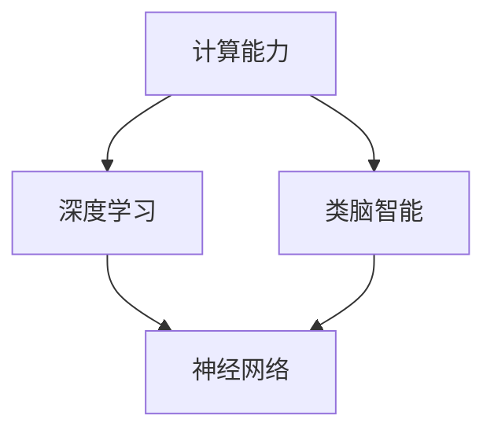

                 

### 背景介绍

人工智能（Artificial Intelligence, AI）作为计算机科学的前沿领域，近年来在多个方面取得了显著的突破。从最初的规则基础系统，到后来的基于统计学的机器学习方法，再到当前的深度学习和类脑智能，人工智能的发展路径清晰而富有挑战性。本文旨在探讨2050年的人工智能可能达到的技术水平，从深度学习到类脑智能的各个关键领域，预测未来的发展方向和可能面临的挑战。

人工智能的历史可以追溯到20世纪50年代，当时科学家们开始尝试通过编写程序让计算机模拟人类的智能行为。早期的AI研究主要集中在规则系统上，例如专家系统和逻辑推理。然而，这些方法在处理复杂问题和海量数据时表现不佳，限制了AI的应用范围。

随着计算能力的提升和数据量的增加，统计学习方法逐渐成为主流，其中包括了支持向量机、决策树、随机森林等算法。这些方法通过对大量数据进行建模和分析，能够在特定任务中达到很高的准确度。

21世纪初，深度学习技术的崛起，特别是在图像识别、自然语言处理和游戏等领域，使人工智能取得了前所未有的成功。深度学习通过多层神经网络进行数据处理和特征提取，大大提高了模型的性能。

然而，深度学习模型在复杂性和计算资源消耗上存在一定的局限性。类脑智能作为一种新的研究方向，试图通过模拟人脑的结构和功能，实现更加高效和智能的人工智能系统。

展望2050年，人工智能技术将继续向前发展。本文将重点讨论深度学习和类脑智能这两个领域，探讨它们的技术原理、实际应用场景以及未来的发展趋势。

### 核心概念与联系

在探讨2050年人工智能的发展之前，有必要明确几个核心概念和它们之间的联系。这些概念包括深度学习、类脑智能、神经网络、计算能力以及算法优化等。通过理解这些概念，我们可以更好地把握人工智能的发展脉络。

#### 深度学习（Deep Learning）

深度学习是机器学习的一个子领域，它基于多层神经网络的结构进行数据处理和特征提取。深度学习模型通过一系列的层次结构，逐步将输入数据转换成具有更高层次语义的信息。例如，在图像识别任务中，深度学习模型可以逐步提取图像中的边缘、纹理和形状特征，最终识别出图像中的物体。

#### 类脑智能（Brain-like Intelligence）

类脑智能是一种模仿人脑结构和功能的智能系统。与传统的计算模型不同，类脑智能试图通过模仿大脑的神经元连接和网络结构，实现更加高效和自适应的智能行为。类脑智能的核心在于神经网络的设计和优化，以及神经元之间的交互和反馈机制。

#### 神经网络（Neural Networks）

神经网络是模仿人脑神经元结构和功能的一种计算模型。它由一系列的神经元（或节点）组成，每个神经元都与其他神经元相连。神经网络通过调整神经元之间的连接权重，学习输入数据与输出结果之间的关系，从而实现智能行为。

#### 计算能力（Computing Power）

计算能力是推动人工智能发展的关键因素。随着计算能力的提升，深度学习模型可以处理更大规模的数据集，更加复杂的任务。例如，图形处理单元（GPU）和专用人工智能芯片（如Tensor Processing Unit, TPU）的发明，大大提高了深度学习模型的计算效率。

#### 算法优化（Algorithm Optimization）

算法优化是提高人工智能性能的重要手段。通过改进算法设计，优化计算过程，可以提高模型的准确度和效率。例如，通过使用更高效的卷积神经网络结构，可以加快图像识别的速度和降低计算资源的消耗。

#### 关系与联系

深度学习和类脑智能之间有着密切的联系。深度学习是类脑智能的一种实现方式，通过多层神经网络模拟大脑的功能。类脑智能则致力于在更高层次上模仿大脑的结构和功能，实现更加通用和高效的智能行为。

计算能力和算法优化是推动深度学习和类脑智能发展的重要基础。随着计算能力的提升，我们可以设计和训练更加复杂的模型；而算法优化则可以提高模型的性能和效率，使其在更广泛的领域得到应用。

#### Mermaid 流程图

为了更好地理解这些核心概念和它们之间的联系，我们可以使用Mermaid流程图进行展示。



在这个流程图中，计算能力是深度学习和类脑智能的基础，神经网络是深度学习和类脑智能的核心，而深度学习和类脑智能则是计算能力的应用。

通过理解这些核心概念和它们之间的联系，我们可以更好地把握人工智能的发展趋势，为未来的研究和技术突破提供指导。在接下来的部分中，我们将深入探讨深度学习和类脑智能的技术原理和具体应用。

### 核心算法原理 & 具体操作步骤

在深度学习和类脑智能领域，核心算法的设计和实现至关重要。以下将详细阐述这些算法的基本原理和具体操作步骤。

#### 深度学习算法原理

深度学习算法的核心是神经网络，特别是多层神经网络（Multilayer Neural Networks）。神经网络由多个层组成，包括输入层、隐藏层和输出层。每一层包含多个神经元，神经元之间通过权重（weights）连接。

1. **输入层（Input Layer）**：接收输入数据，并将其传递到下一层。
2. **隐藏层（Hidden Layers）**：对输入数据进行特征提取和变换。每一层隐藏层都会对上一层的输出进行加权求和，并加上一个偏置项（bias），然后通过激活函数（activation function）进行非线性变换。
3. **输出层（Output Layer）**：生成最终输出。在分类任务中，输出层通常是一个softmax函数，用于计算每个类别的概率。

**具体操作步骤**：

a. **初始化权重和偏置**：随机初始化神经网络中的权重和偏置。

b. **前向传播（Forward Propagation）**：输入数据通过神经网络，从输入层传递到输出层。每个神经元根据其权重和偏置计算输出。

c. **计算损失函数（Compute Loss Function）**：输出层生成预测结果，并与实际标签进行比较，计算损失函数（如交叉熵损失函数）的值。

d. **反向传播（Backpropagation）**：利用梯度下降算法，根据损失函数的梯度更新神经网络的权重和偏置。

e. **迭代训练（Iterative Training）**：重复执行前向传播和反向传播，不断优化神经网络的参数，直到达到预设的损失阈值或迭代次数。

#### 类脑智能算法原理

类脑智能的核心是模拟人脑的神经网络结构和功能，实现自适应和高效的信息处理。类脑智能算法通常基于人工神经网络（Artificial Neural Networks, ANNs）和类脑计算（Brain-like Computing）原理。

1. **神经元模型（Neuron Model）**：类脑智能中的神经元通常采用简化的模型，如LIF（Leaky Integrate-and-Fire）神经元。LIF神经元通过积分输入电流并周期性地触发动作电位。

2. **神经网络结构（Neural Network Structure）**：类脑智能的神经网络通常包含多个层次，每个层次由多个神经元组成。神经元之间的连接可以是全连接或稀疏连接。

3. **学习机制（Learning Mechanism）**：类脑智能通过调整神经元之间的连接权重来学习输入数据与输出结果之间的关系。学习机制可以基于Hebbian学习规则、反向传播算法或其他自适应学习算法。

**具体操作步骤**：

a. **初始化神经网络**：随机初始化神经网络的权重和偏置。

b. **激活函数（Activation Function）**：在每个时间步，根据当前输入计算神经元的状态。激活函数可以是阶跃函数、Sigmoid函数或其他非线性函数。

c. **集成输入（Integrate Input）**：将输入信号通过加权求和，并加上偏置项，计算神经元的活动。

d. **触发动作电位（Trigger Action Potential）**：当神经元的活动达到阈值时，触发动作电位，并传递到下一层。

e. **权重更新（Update Weights）**：根据输出误差和神经元的活动，通过学习算法更新神经元之间的连接权重。

f. **迭代训练（Iterative Training）**：重复执行激活、集成输入和权重更新，不断优化神经网络的参数。

#### 关键技术和挑战

深度学习和类脑智能算法在实现过程中面临一些关键技术和挑战，包括：

- **计算资源消耗**：深度学习算法需要大量的计算资源和存储空间，对硬件性能要求较高。
- **数据需求**：深度学习算法依赖于大量高质量的训练数据，数据获取和标注过程复杂。
- **过拟合问题**：深度学习模型容易受到过拟合的影响，需要通过正则化、dropout等方法进行解决。
- **可解释性**：深度学习模型的黑箱特性使得其预测结果难以解释，限制了在实际应用中的可靠性。

为了解决这些挑战，研究者们不断探索新的算法结构和优化方法，以提升深度学习和类脑智能的性能和应用范围。

通过详细阐述深度学习和类脑智能算法的基本原理和具体操作步骤，我们可以更好地理解这些技术是如何实现的，并为未来的研究和技术创新提供指导。

### 数学模型和公式 & 详细讲解 & 举例说明

在深度学习和类脑智能的研究中，数学模型和公式起到了至关重要的作用。这些模型和公式不仅帮助我们理解算法的基本原理，还可以指导我们进行实际操作和优化。以下将详细讲解一些关键的数学模型和公式，并使用具体的例子进行说明。

#### 深度学习中的前向传播与反向传播

深度学习中的前向传播和反向传播是两个核心步骤。前向传播用于计算模型的输出，而反向传播用于更新模型的参数。

1. **前向传播（Forward Propagation）**：

   前向传播的主要任务是计算模型在给定输入下的输出。具体步骤如下：

   a. **输入层到隐藏层的传播**：

   $$ z^{[l]} = \sum_{i} w^{[l]}_{i} a^{[l-1]}_i + b^{[l]} $$
   
   $$ a^{[l]}_i = \sigma(z^{[l]}) $$
   
   其中，$a^{[l]}$表示第$l$层的激活值，$z^{[l]}$表示第$l$层的加权和，$w^{[l]}$和$b^{[l]}$分别表示第$l$层的权重和偏置，$\sigma$表示激活函数（如Sigmoid函数或ReLU函数）。

   b. **隐藏层到输出层的传播**：

   $$ z^{[L]} = \sum_{i} w^{[L]}_{i} a^{[L-1]}_i + b^{[L]} $$
   
   $$ \hat{y} = \sigma(z^{[L]}) $$
   
   其中，$\hat{y}$表示模型的输出预测。

2. **反向传播（Back Propagation）**：

   反向传播的主要任务是计算损失函数对模型参数的梯度，并更新参数以最小化损失。具体步骤如下：

   a. **计算输出层误差**：

   $$ \delta^{[L]} = (y - \hat{y}) \cdot \sigma'(z^{[L]}) $$
   
   其中，$y$表示实际标签，$\hat{y}$表示模型输出预测，$\sigma'$表示激活函数的导数。

   b. **计算隐藏层误差**：

   对于$l \neq L$，计算：
   
   $$ \delta^{[l]} = (w^{[l+1]T \delta^{[l+1]}) \cdot \sigma'(z^{[l]}) $$
   
   c. **计算权重和偏置的梯度**：

   $$ \frac{\partial J}{\partial w^{[l]}} = \sum_{i} \delta^{[l]}_i a^{[l-1]}_i $$
   $$ \frac{\partial J}{\partial b^{[l]}} = \sum_{i} \delta^{[l]}_i $$
   
   其中，$J$表示损失函数。

   d. **更新权重和偏置**：

   $$ w^{[l]} = w^{[l]} - \alpha \cdot \frac{\partial J}{\partial w^{[l]}} $$
   $$ b^{[l]} = b^{[l]} - \alpha \cdot \frac{\partial J}{\partial b^{[l]}} $$
   
   其中，$\alpha$表示学习率。

#### 类脑智能中的LIF神经元模型

在类脑智能研究中，LIF（Leaky Integrate-and-Fire）神经元模型是一种常用的神经元模型。LIF神经元通过积分输入电流并周期性地触发动作电位。

LIF神经元的数学模型可以表示为：

$$ v(t) = v_0 + \frac{1}{\tau} \int_{t_0}^{t} I(\tau') d\tau' $$

$$ I(t) = \sum_{j} w_{ji} \cdot x_j(t) $$

$$ \text{if } v(t) > V_{th}, \text{ then } v(t) = v_{reset} \text{ and } I(t) = 0 $$

其中，$v(t)$表示神经元在时间$t$的膜电位，$v_0$表示初始电位，$\tau$表示时间常数，$I(t)$表示输入电流，$x_j(t)$表示第$j$个输入信号，$w_{ji}$表示第$j$个输入信号对神经元$i$的权重，$V_{th}$表示动作电位阈值，$v_{reset}$表示复位电位。

**举例说明**：

假设一个LIF神经元在时间$t=0$时刻开始接收输入信号，输入信号为$x_1(t)=1$和$x_2(t)=0.5$，权重分别为$w_{11}=0.2$和$w_{12}=0.3$，时间常数$\tau=5$，阈值$V_{th}=1$，初始电位$v_0=0.1$。计算$t=10$时刻的膜电位。

$$ v(t=10) = v_0 + \frac{1}{\tau} \int_{0}^{10} I(\tau') d\tau' $$

$$ I(t) = 0.2 \cdot x_1(t) + 0.3 \cdot x_2(t) $$

$$ I(t=10) = 0.2 \cdot 1 + 0.3 \cdot 0.5 = 0.35 $$

$$ v(t=10) = 0.1 + \frac{1}{5} \cdot 0.35 \cdot 10 = 0.45 $$

由于$v(t=10) < V_{th}$，神经元不会触发动作电位。

通过详细讲解深度学习和类脑智能中的数学模型和公式，并使用具体的例子进行说明，我们可以更好地理解这些模型在实际操作中的应用，为后续的算法优化和应用提供基础。

### 项目实战：代码实际案例和详细解释说明

在本节中，我们将通过一个实际项目来演示深度学习和类脑智能算法的应用。这个项目是一个简单的图像识别任务，使用卷积神经网络（CNN）进行物体分类。我们将逐步介绍开发环境搭建、源代码实现以及代码解读与分析。

#### 开发环境搭建

1. **安装Python**：确保系统已经安装了Python，推荐使用Python 3.8及以上版本。
2. **安装TensorFlow**：使用pip命令安装TensorFlow库。
   ```bash
   pip install tensorflow
   ```
3. **安装Matplotlib**：用于可视化结果。
   ```bash
   pip install matplotlib
   ```

#### 源代码详细实现和代码解读

以下是一个简单的图像识别项目的代码实现：

```python
import tensorflow as tf
from tensorflow.keras import layers
import matplotlib.pyplot as plt

# 加载MNIST数据集
mnist = tf.keras.datasets.mnist
(train_images, train_labels), (test_images, test_labels) = mnist.load_data()

# 数据预处理
train_images = train_images / 255.0
test_images = test_images / 255.0

# 创建CNN模型
model = tf.keras.Sequential([
    layers.Conv2D(32, (3, 3), activation='relu', input_shape=(28, 28, 1)),
    layers.MaxPooling2D((2, 2)),
    layers.Conv2D(64, (3, 3), activation='relu'),
    layers.MaxPooling2D((2, 2)),
    layers.Conv2D(64, (3, 3), activation='relu'),
    layers.Flatten(),
    layers.Dense(64, activation='relu'),
    layers.Dense(10, activation='softmax')
])

# 编译模型
model.compile(optimizer='adam',
              loss='sparse_categorical_crossentropy',
              metrics=['accuracy'])

# 训练模型
model.fit(train_images, train_labels, epochs=5)

# 评估模型
test_loss, test_acc = model.evaluate(test_images, test_labels)
print(f'测试准确率: {test_acc:.4f}')

# 可视化结果
predictions = model.predict(test_images)
predicted_labels = np.argmax(predictions, axis=1)

plt.figure(figsize=(10, 10))
for i in range(25):
    plt.subplot(5, 5, i+1)
    plt.imshow(test_images[i], cmap=plt.cm.binary)
    plt.xticks([])
    plt.yticks([])
    plt.grid(False)
    plt.xlabel(str(predicted_labels[i]))
plt.show()
```

**代码解读与分析**：

1. **数据加载和预处理**：
   - 加载MNIST数据集，并将其归一化到0到1之间。
   - 数据集包括训练集和测试集，每个数据点都是28x28的灰度图像。

2. **创建CNN模型**：
   - 使用TensorFlow的Keras API创建一个卷积神经网络模型。
   - 模型包括三个卷积层（Conv2D），每个卷积层后跟一个最大池化层（MaxPooling2D）。
   - 在最后一个卷积层后，使用Flatten层将特征图展平为一维数组。
   - 接着是一个全连接层（Dense），最后是一个输出层（softmax）用于多分类。

3. **编译模型**：
   - 使用adam优化器和sparse_categorical_crossentropy损失函数编译模型。
   - 设置评估指标为准确率。

4. **训练模型**：
   - 使用训练集数据训练模型，设置训练轮数（epochs）为5。

5. **评估模型**：
   - 在测试集上评估模型的性能，打印测试准确率。

6. **可视化结果**：
   - 使用模型对测试集数据进行预测，并可视化前25个测试图像及其预测标签。

通过这个简单的图像识别项目，我们可以看到深度学习模型是如何构建、训练和评估的。实际项目中，模型的设计和参数调整会根据具体任务和数据集进行调整，以达到更好的性能。

### 实际应用场景

深度学习和类脑智能技术在多个领域展现出了巨大的应用潜力，以下将详细探讨这些技术在不同应用场景中的实际应用。

#### 医疗领域

在医疗领域，深度学习技术被广泛应用于疾病诊断、医学图像分析和个性化治疗等方面。例如，通过深度学习模型，可以对医学影像进行自动化分析，识别出早期的疾病迹象。例如，AI算法能够从CT扫描中检测出肺癌，从MRI图像中识别出脑肿瘤。此外，深度学习还可以用于辅助医生进行手术规划，提供精确的手术路径和预测术后效果。

类脑智能则可以在医疗诊断中发挥更加高效的作用。通过模拟人脑的学习和认知机制，类脑智能系统能够从大量医疗数据中自动学习和提取特征，为医生提供更加准确的诊断支持。例如，类脑智能系统可以学习大量的病理数据和医学知识，自动诊断疾病，并在诊断过程中不断优化和更新自身的知识库。

#### 金融领域

在金融领域，深度学习技术被广泛应用于风险管理、欺诈检测和个性化投资建议等方面。通过分析大量的交易数据和历史记录，深度学习模型能够预测市场的走势，为投资者提供实时的交易建议。例如，一些金融机构使用深度学习算法进行股票市场预测，通过分析历史价格和交易量等数据，预测未来股票的涨跌。

类脑智能在金融领域也具有广泛的应用潜力。通过模拟人脑的决策过程，类脑智能系统可以在复杂的市场环境中做出快速和准确的决策。例如，类脑智能可以用于风险管理，实时监控市场风险并采取相应的措施，确保金融市场的稳定运行。

#### 智能交通

在智能交通领域，深度学习技术被广泛应用于交通流量预测、自动驾驶和智能交通信号控制等方面。通过分析大量的交通数据，深度学习模型可以预测交通流量和事故发生概率，为交通管理和决策提供支持。例如，一些城市使用深度学习算法来优化交通信号灯的时序设置，提高交通流畅度并减少拥堵。

类脑智能在智能交通领域也有重要应用。通过模拟人脑的交通感知和决策机制，类脑智能系统可以实时感知交通环境，自动规划最优行驶路径并避免交通事故。例如，自动驾驶汽车使用类脑智能系统来识别道路标志、行人和其他车辆，并在复杂交通环境中做出快速反应。

#### 人机交互

在人机交互领域，深度学习技术被广泛应用于自然语言处理、语音识别和手势识别等方面。通过深度学习模型，计算机可以理解和处理人类的语言和动作，提供更加自然和便捷的人机交互体验。例如，智能助手（如Siri、Alexa）使用深度学习技术来理解用户的语音指令，并执行相应的操作。

类脑智能在人机交互中也有重要的应用。通过模拟人脑的学习和认知过程，类脑智能系统可以更好地理解用户的意图和需求，提供更加个性化和精准的服务。例如，类脑智能可以用于智能客服系统，自动识别用户的情绪和需求，并给出合适的回答和建议。

通过在医疗、金融、智能交通和人机交互等领域的实际应用，深度学习和类脑智能技术展示了其强大的功能和广阔的应用前景。未来，随着技术的不断进步和应用的深入，这些技术将在更多领域发挥关键作用，推动人工智能的发展。

### 工具和资源推荐

在深度学习和类脑智能的学习和应用过程中，选择合适的工具和资源是至关重要的。以下将推荐一些常用的学习资源、开发工具和相关论文，以帮助读者更好地掌握相关知识和技术。

#### 学习资源推荐

1. **书籍**：

   - 《深度学习》（Goodfellow, I., Bengio, Y., & Courville, A.）：这是一本经典的深度学习入门书籍，详细介绍了深度学习的理论基础和应用实例。

   - 《神经网络与深度学习》（邱锡鹏）：这本书深入讲解了神经网络和深度学习的基本概念、算法和实现。

   - 《类脑智能：人工智能的未来》（李开复）：这本书探讨了类脑智能的概念、技术和发展趋势，对人工智能的未来进行了展望。

2. **在线课程**：

   - Coursera的“深度学习专项课程”：由吴恩达教授主讲，涵盖了深度学习的理论基础和实际应用。

   - edX的“人工智能基础课程”：由MIT和HARVARD联合开设，提供了全面的深度学习和类脑智能知识。

   - Udacity的“深度学习工程师纳米学位”：提供实际项目和实践，帮助学习者掌握深度学习技能。

#### 开发工具推荐

1. **TensorFlow**：TensorFlow是Google开发的开源深度学习框架，支持多种深度学习模型和算法，适用于各种规模的深度学习项目。

2. **PyTorch**：PyTorch是Facebook开发的开源深度学习框架，具有灵活的动态计算图和强大的GPU加速支持，适用于研究性和应用性深度学习项目。

3. **Keras**：Keras是一个高层次的深度学习API，构建在TensorFlow和Theano之上，提供简单易用的接口，适用于快速原型设计和项目开发。

4. **JAX**：JAX是由Google开发的一个数值计算库，支持自动微分和GPU加速，适用于复杂的深度学习研究和应用。

#### 相关论文推荐

1. “A Guide to Convolutional Neural Networks for Visual Recognition”（Ian J. Goodfellow et al.）：这篇论文详细介绍了卷积神经网络在视觉识别任务中的应用。

2. “Unsupervised Learning of Visual Representations by Solving Jigsaw Puzzles”（Thomas Mensink et al.）：这篇论文探讨了通过解决拼图游戏进行无监督学习的方法，为深度学习提供了新的思路。

3. “Deep Learning with Keras”（François Chollet）：这篇论文介绍了如何使用Keras框架进行深度学习模型设计和训练。

4. “Learning to Learn：Parameter Transfer for Multi-Task Optimization”（Marc'Aurelio Ranzato et al.）：这篇论文探讨了多任务优化中的参数转移方法，为类脑智能的研究提供了新方向。

通过以上推荐的学习资源、开发工具和相关论文，读者可以系统地学习和掌握深度学习和类脑智能的相关知识和技术，为实际应用和研究奠定坚实基础。

### 总结：未来发展趋势与挑战

展望2050年，人工智能（AI）领域将继续迎来前所未有的发展机遇。深度学习和类脑智能作为当前人工智能技术的核心方向，将在未来的技术革新中发挥关键作用。以下是未来发展趋势与挑战的探讨：

#### 发展趋势

1. **计算能力提升**：随着计算硬件的发展，尤其是量子计算、神经形态计算等新技术的崛起，AI模型的计算效率将大幅提升，为解决复杂问题提供强有力的支持。

2. **泛化能力增强**：通过类脑智能和迁移学习等技术的发展，AI系统将具备更强的泛化能力，能够在不同领域和任务中灵活应用，提高实际应用价值。

3. **人机协作**：AI与人类的协作将成为主流，通过人机交互技术的进步，AI系统将能够更好地理解人类意图，实现更高效、更智能的工作流程。

4. **自动化决策**：基于深度学习和强化学习等技术，AI系统将能够在更多场景中实现自动化决策，减少人为干预，提高生产效率和安全性。

5. **隐私保护和数据安全**：随着AI应用范围的扩大，数据隐私和信息安全将成为重要挑战。未来，隐私保护技术如联邦学习、差分隐私等将得到广泛应用，确保数据安全。

#### 挑战

1. **计算资源消耗**：深度学习和类脑智能模型通常需要大量的计算资源和存储空间，如何优化算法和硬件设计，降低计算资源消耗，仍是一个亟待解决的问题。

2. **数据质量和标注**：高质量的数据是AI模型训练的基础，但数据获取、清洗和标注过程复杂且耗时。未来，如何高效地获取和处理数据，将是一个重要挑战。

3. **算法透明性和可解释性**：深度学习模型具有“黑箱”特性，其预测结果难以解释。提高算法的透明性和可解释性，使其符合法律法规和伦理要求，是未来的一项重要任务。

4. **伦理和社会影响**：AI技术的发展可能带来一系列伦理和社会问题，如就业替代、隐私侵犯和数据滥用等。未来，需要制定相应的法律法规和伦理准则，确保AI技术的可持续发展。

5. **类脑智能的生物学基础**：类脑智能的研究需要深入了解人脑的生物学基础，如神经元的工作原理、神经网络的结构和功能等。这一领域仍存在许多未解之谜，需要进一步研究。

总之，2050年的人工智能将是一个更加智能、高效和安全的未来。通过不断创新和解决面临的挑战，深度学习和类脑智能将为人类社会带来更多福祉。未来，我们期待看到更多突破性的技术成果，推动AI领域的持续发展。

### 附录：常见问题与解答

#### 问题1：深度学习和类脑智能的区别是什么？

**回答**：深度学习是一种基于多层神经网络的学习方法，通过模拟人脑的学习过程，对大量数据进行分析和特征提取，以实现智能行为。而类脑智能是一种模仿人脑结构和功能的智能系统，试图通过模拟大脑的神经元连接和网络结构，实现更加高效和自适应的智能行为。深度学习是类脑智能的一种实现方式，但类脑智能涵盖了更广泛的领域，包括神经形态计算、自适应学习和多模态信息处理等。

#### 问题2：深度学习模型的训练过程如何进行？

**回答**：深度学习模型的训练过程主要包括以下几个步骤：

1. **数据预处理**：对训练数据进行归一化、标准化等处理，提高模型的训练效率。

2. **模型构建**：使用框架（如TensorFlow或PyTorch）构建神经网络模型，包括设置输入层、隐藏层和输出层等。

3. **前向传播**：将输入数据传递到模型中，通过网络的层层计算，生成预测输出。

4. **计算损失**：计算预测输出与实际标签之间的损失，常用的损失函数有均方误差（MSE）和交叉熵（CE）等。

5. **反向传播**：利用梯度下降算法，根据损失函数的梯度更新网络中的权重和偏置。

6. **迭代训练**：重复执行前向传播和反向传播，不断优化模型的参数，直到达到预设的损失阈值或迭代次数。

#### 问题3：类脑智能的神经元模型有哪些？

**回答**：类脑智能中的神经元模型主要包括以下几种：

1. **LIF（Leaky Integrate-and-Fire）神经元**：通过积分输入电流并周期性地触发动作电位。

2. **SP（Spiking Neuron）神经元**：具有更复杂的生物学基础，模拟真实神经元的行为。

3. **HTM（Hierarchical Temporal Memory）神经元**：一种自组织神经网络模型，用于处理时间和空间数据。

4. **Hopfield神经元**：用于联想记忆和模式识别。

5. **Pulse-Coupled Neural Networks（PCNN）**：通过脉冲耦合机制实现神经网络之间的同步和协作。

这些神经元模型各有特点，适用于不同的应用场景和任务。

#### 问题4：深度学习和类脑智能在医疗领域的应用有哪些？

**回答**：深度学习和类脑智能在医疗领域有广泛的应用，包括：

1. **医学图像分析**：使用深度学习模型对医学图像（如X光、CT、MRI）进行自动化分析，辅助医生进行诊断。

2. **疾病预测**：通过分析患者的临床数据，使用类脑智能系统预测疾病的发病风险。

3. **个性化治疗**：根据患者的基因信息和病情，使用深度学习模型制定个性化的治疗方案。

4. **药物研发**：通过深度学习模型预测药物与生物分子的相互作用，加速新药研发过程。

5. **智能监护系统**：利用类脑智能技术，实时监控患者的生命体征，提供及时的医疗干预。

这些应用为医疗行业带来了革命性的变化，提高了诊断和治疗的效率。

### 扩展阅读 & 参考资料

1. **书籍**：
   - Goodfellow, I., Bengio, Y., & Courville, A. (2016). *Deep Learning*.
   -邱锡鹏. (2018). *神经网络与深度学习*.
   -李开复. (2017). *类脑智能：人工智能的未来*.

2. **在线课程**：
   - 吴恩达. (2020). Coursera上的“深度学习专项课程”.
   - MIT与HARVARD. (2020). edX上的“人工智能基础课程”.
   - Udacity. (2019). “深度学习工程师纳米学位”。

3. **论文**：
   - Ian J. Goodfellow, et al. (2014). *A Guide to Convolutional Neural Networks for Visual Recognition*.
   - Thomas Mensink, et al. (2016). *Unsupervised Learning of Visual Representations by Solving Jigsaw Puzzles*.
   - François Chollet. (2015). *Deep Learning with Keras*.
   - Marc'Aurelio Ranzato, et al. (2015). *Learning to Learn：Parameter Transfer for Multi-Task Optimization*.

4. **开源框架和工具**：
   - TensorFlow: https://www.tensorflow.org/
   - PyTorch: https://pytorch.org/
   - Keras: https://keras.io/
   - JAX: https://jax.readthedocs.io/

通过阅读这些书籍、课程和论文，以及使用这些开源框架和工具，读者可以更深入地了解深度学习和类脑智能的理论和实践，为未来的研究和应用奠定坚实基础。

