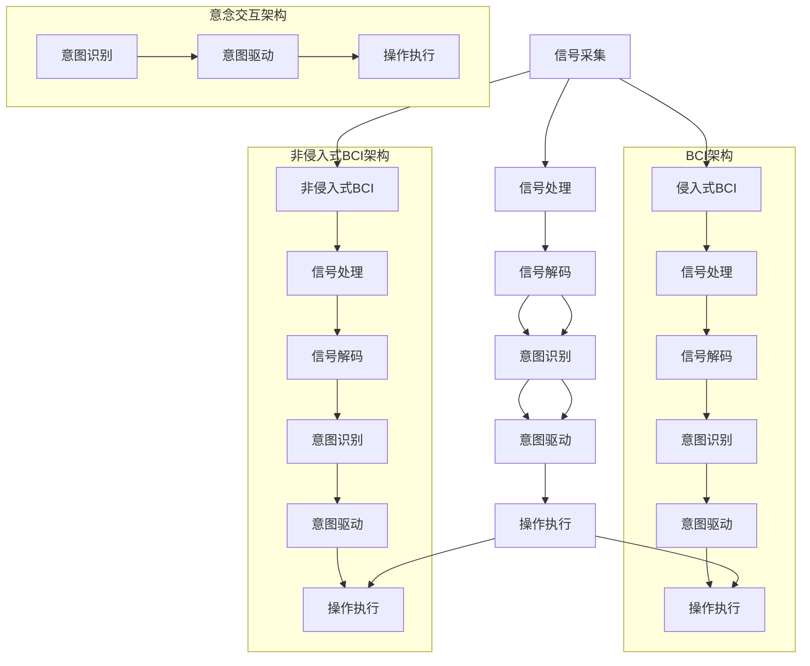

                 

### 1. 背景介绍

在21世纪的第二个十年，科技发展已经达到了前所未有的高度。人工智能、量子计算、脑机接口等前沿科技不断突破，推动了人类社会从信息化走向智能化。人机交互作为智能科技的重要组成部分，也在这个过程中经历了巨大的变革。

#### 1.1  人机交互的历史与现状

人机交互的历史可以追溯到20世纪60年代，当时计算机刚刚开始普及，简单的图形用户界面（GUI）开始出现。随着时间的推移，鼠标、触摸屏、语音识别等技术不断涌现，使人类与计算机的交互方式越来越多样化。然而，这些传统的交互方式仍然存在一些局限性，如响应速度慢、需要物理设备等。

在进入21世纪后，脑机接口技术的发展为人们提供了一种全新的交互方式。脑机接口（Brain-Computer Interface, BCI）通过读取大脑信号，使人类能够直接通过思维与计算机进行交互。这一技术的出现，极大地拓展了人机交互的边界，为未来人机协同带来了新的可能性。

#### 1.2  脑机接口的发展现状与挑战

当前，脑机接口技术已经取得了显著的进展。研究人员通过一系列的实验，成功地在实验室环境中实现了高精度的思维控制。例如，通过非侵入式脑机接口，人们可以实时控制计算机屏幕的光标，甚至可以通过思维来操作虚拟现实（VR）场景。此外，侵入式脑机接口也取得了突破，使得重度瘫痪患者能够重新获得与外界的互动能力。

然而，脑机接口技术仍然面临着许多挑战。首先，现有技术对大脑信号的解码能力仍然有限，导致交互精度和响应速度受到制约。其次，脑机接口的稳定性也是一个重要问题，如何在长时间内保持稳定的信号传输仍需进一步研究。此外，脑机接口的伦理和隐私问题也引起了广泛关注。

#### 1.3  意念交互的概念与潜力

在脑机接口技术的基础上，意念交互（Intentional Interaction）的概念被提出。意念交互强调的是通过大脑的意图直接驱动计算机操作，而不仅仅是解码大脑信号。这种交互方式具有高度的智能化和自然化，能够更好地模拟人类与外界的真实互动。

意念交互的潜力在于，它不仅能够极大地提升人机交互的效率，还能够实现更加智能化的应用场景。例如，在医疗领域，意念交互可以帮助瘫痪患者更自然地控制假肢；在娱乐领域，意念交互可以实现更加沉浸式的游戏体验。

### 1.4  人机协同的进化方向

随着脑机接口和意念交互技术的不断发展，人机协同（Human-Machine Collaboration）逐渐成为未来人机交互的重要方向。人机协同强调的是人类与计算机之间的合作，通过各自的优势实现更高效、更智能的交互体验。

人机协同的进化方向可以概括为以下几个方面：

1. **智能化：** 通过不断优化算法，提高人机交互的智能化水平，使计算机能够更好地理解人类的意图和需求。
2. **个性化：** 根据个体的特点和习惯，提供定制化的人机交互体验，实现人机协同的个性化和多样化。
3. **无障碍化：** 突破现有的技术障碍，实现无障碍的人机交互，使所有人都能轻松地与计算机进行沟通和操作。
4. **生态化：** 构建一个人机协同的生态系统，使各类应用和服务能够无缝集成，实现人机交互的生态化发展。

在接下来的章节中，我们将详细探讨脑机接口和意念交互的核心概念、算法原理、实际应用场景，以及未来人机协同的发展趋势和挑战。希望通过本文的阐述，读者能够对人机交互的未来有一个更加清晰的认识。

---

### 2. 核心概念与联系

在探讨人机交互的未来时，理解脑机接口（BCI）和意念交互（Intentional Interaction）的核心概念及其相互关系至关重要。本节将详细介绍这两个概念，并使用Mermaid流程图来展示它们的基本原理和架构。

#### 2.1 脑机接口（BCI）的基本概念

脑机接口（BCI）是一种直接连接大脑和外部设备的技术，通过读取和解析大脑信号来实现人与计算机之间的交互。BCI技术主要分为侵入式和非侵入式两种：

- **侵入式BCI：** 通过在脑组织中植入电极来读取大脑活动。这种技术具有高精度，但需要手术操作，风险较高。
- **非侵入式BCI：** 通过头皮上的传感器来捕捉大脑信号。这种方法风险较低，但精度略逊于侵入式。

核心概念：
- **信号采集：** 通过电极或传感器捕捉大脑信号。
- **信号处理：** 使用信号处理算法来提取和处理大脑信号，识别出有用的信息。
- **解码：** 将处理后的信号解码成具体的指令，如移动光标或控制虚拟现实环境。

#### 2.2 意念交互（Intentional Interaction）的概念

意念交互（Intentional Interaction）是在BCI技术基础上提出的，强调的是人类意图的直接驱动。与传统的通过信号解码来控制计算机的方式不同，意念交互通过理解和模拟人类意图来实现交互，从而更加自然和高效。

核心概念：
- **意图识别：** 识别和理解用户的意图，而不只是大脑信号。
- **意图驱动：** 直接基于用户的意图来驱动计算机操作，而不是信号解码。
- **自适应交互：** 根据用户的意图和环境动态调整交互方式。

#### 2.3 Mermaid流程图展示

为了更好地理解BCI和意念交互的工作原理，我们使用Mermaid流程图来展示它们的基本架构。



#### 2.4 脑机接口与意念交互的联系

脑机接口和意念交互并非相互独立的，它们之间存在密切的联系。脑机接口提供了读取和解析大脑信号的基础技术，而意念交互则是在这个基础上，通过理解和模拟人类意图来实现更加自然和高效的交互。可以说，脑机接口是意念交互的技术基础，而意念交互则是脑机接口的应用目标。

通过这种联系，脑机接口和意念交互共同推动人机交互向智能化、个性化、无障碍化的方向发展，实现人机协同的深度进化。

---

在了解了脑机接口和意念交互的基本概念及其相互关系后，接下来我们将深入探讨这些技术的核心算法原理和具体操作步骤。这将为我们进一步理解人机交互的未来奠定坚实的基础。

---

### 3. 核心算法原理 & 具体操作步骤

脑机接口（BCI）和意念交互（Intentional Interaction）作为人机交互的前沿技术，其核心算法原理决定了这些技术的精度、效率和实用性。本节将详细解释这些算法的基本原理，并描述具体的操作步骤。

#### 3.1 脑机接口（BCI）算法原理

脑机接口技术的核心在于如何有效地读取、处理和解析大脑信号，从而实现与计算机的交互。以下是几种常见的BCI算法原理：

##### 3.1.1 信号采集

**原理：** 信号采集是BCI技术的第一步，通过在脑部或头皮上安装电极或传感器来捕捉大脑信号。

**操作步骤：**
1. 选择合适的采集设备，如EEG（脑电图）或fNIRS（近红外光谱成像）。
2. 在脑部或头皮上粘贴电极或传感器。
3. 使用信号放大器增强信号强度。

##### 3.1.2 信号处理

**原理：** 信号处理是对采集到的原始信号进行滤波、去噪和特征提取，以提取有用的信息。

**操作步骤：**
1. 滤波：去除高频噪声和低频基线。
2. 特征提取：从处理后的信号中提取关键特征，如时间序列的峰值、平均值、频谱等。
3. 数据预处理：对提取的特征进行归一化、标准化等处理。

##### 3.1.3 信号解码

**原理：** 信号解码是将处理后的信号转换为具体的指令，如控制计算机屏幕的光标或操作虚拟现实环境。

**操作步骤：**
1. 识别特征模式：通过机器学习算法（如支持向量机SVM、神经网络NN）来识别不同的特征模式。
2. 建立映射关系：将识别出的特征模式映射到具体的动作或指令。
3. 实时解码：对实时采集的信号进行解码，生成操作指令。

##### 3.1.4 意图识别

**原理：** 意图识别是基于用户的意图来进行交互，而不仅仅是解码大脑信号。

**操作步骤：**
1. 意图分类：通过机器学习算法来分类用户的意图，如移动光标、选择菜单等。
2. 意图验证：对识别出的意图进行验证，确保其准确性和可靠性。
3. 意图驱动：根据识别出的意图来驱动计算机操作，实现自然交互。

#### 3.2 意念交互（Intentional Interaction）算法原理

意念交互是在BCI技术基础上发展起来的，强调的是通过理解和模拟人类意图来实现交互。以下是意念交互的核心算法原理：

##### 3.2.1 意图理解

**原理：** 意图理解是通过分析用户的思维信号来识别其意图。

**操作步骤：**
1. 语言处理：使用自然语言处理（NLP）技术来解析用户的思维信号，理解其意图。
2. 思维建模：建立用户的思维模型，以识别和预测其意图。
3. 意图预测：通过历史数据和机器学习算法来预测用户的意图。

##### 3.2.2 意图驱动

**原理：** 意图驱动是基于用户意图来直接控制计算机操作，而不是通过信号解码。

**操作步骤：**
1. 意图识别：通过机器学习算法来识别用户的意图。
2. 意图验证：对识别出的意图进行验证，确保其准确性和可靠性。
3. 意图执行：根据识别出的意图来直接驱动计算机操作，实现自然交互。

##### 3.2.3 自适应交互

**原理：** 自适应交互是根据用户的意图和环境动态调整交互方式。

**操作步骤：**
1. 环境感知：通过传感器和摄像头等设备来感知用户和环境状态。
2. 意图调整：根据感知到的环境状态来调整用户的意图。
3. 交互优化：通过优化算法来提高交互的效率和用户体验。

### 3.3 实际操作步骤示例

为了更好地理解上述算法原理，我们以一个简单的实例来展示脑机接口和意念交互的实际操作步骤。

**示例：控制虚拟现实环境**

**步骤 1：信号采集**
- 使用EEG设备在用户头皮上采集脑电信号。

**步骤 2：信号处理**
- 对采集到的脑电信号进行滤波和特征提取，提取出与用户意图相关的特征。

**步骤 3：信号解码**
- 使用支持向量机（SVM）来识别不同的意图模式，如移动、停止、选择等。

**步骤 4：意图识别**
- 使用自然语言处理（NLP）技术来理解用户的思维信号，识别出具体的意图。

**步骤 5：意图驱动**
- 根据识别出的意图来直接控制虚拟现实环境，如移动角色、打开菜单等。

**步骤 6：自适应交互**
- 根据用户和环境状态来动态调整交互方式，提高用户体验。

通过这个实例，我们可以看到脑机接口和意念交互如何协同工作，实现高度智能化和自然化的人机交互。这种交互方式不仅提高了人机交互的效率，还使计算机能够更好地理解用户的需求和意图。

在接下来的章节中，我们将进一步探讨人机交互的实际应用场景，展示这些技术在现实世界中的具体应用和潜在挑战。

---

### 4. 数学模型和公式 & 详细讲解 & 举例说明

为了深入理解脑机接口（BCI）和意念交互（Intentional Interaction）的核心算法，我们需要借助数学模型和公式来进行详细讲解。以下将介绍相关数学模型和算法，并通过具体例子进行说明。

#### 4.1 脑机接口（BCI）的数学模型

在BCI技术中，常用的数学模型包括信号处理模型和机器学习模型。

##### 4.1.1 信号处理模型

**原理：** 信号处理模型主要用于对采集到的脑电信号进行预处理和特征提取。

**公式：**
$$
h(t) = g(t) + n(t)
$$
其中，\( h(t) \) 是采集到的原始信号，\( g(t) \) 是有用的脑电信号，\( n(t) \) 是噪声信号。

**处理步骤：**
1. **滤波：** 使用带通滤波器去除噪声信号，保留特定频率范围的脑电信号。
$$
H(s) = \frac{1}{1 + Q(s / \omega_c)}
$$
其中，\( \omega_c \) 是中心频率，\( Q \) 是品质因数。

2. **特征提取：** 提取脑电信号的时域和频域特征，如时间序列的峰值、平均值和频谱等。
$$
\mu = \frac{1}{N}\sum_{i=1}^{N} x_i
$$
$$
\sigma^2 = \frac{1}{N-1}\sum_{i=1}^{N} (x_i - \mu)^2
$$
其中，\( \mu \) 是平均值，\( \sigma^2 \) 是方差，\( x_i \) 是第 \( i \) 个数据点。

##### 4.1.2 机器学习模型

**原理：** 机器学习模型用于识别和分类用户的意图。

**公式：**
1. **支持向量机（SVM）：**
$$
\mathbf{w} = \arg\min_{\mathbf{w}} \frac{1}{2}||\mathbf{w}||^2 + C\sum_{i=1}^{N}\xi_i
$$
其中，\( \mathbf{w} \) 是权重向量，\( C \) 是正则化参数，\( \xi_i \) 是误差项。

2. **神经网络（NN）：**
$$
y = \sigma(\mathbf{w}^T\mathbf{x} + b)
$$
其中，\( y \) 是输出，\( \sigma \) 是激活函数，\( \mathbf{w} \) 是权重矩阵，\( \mathbf{x} \) 是输入，\( b \) 是偏置项。

#### 4.2 意念交互（Intentional Interaction）的数学模型

在意念交互中，常用的数学模型包括意图识别和意图驱动的模型。

##### 4.2.1 意图识别模型

**原理：** 意图识别模型用于从用户的思维信号中识别出具体的意图。

**公式：**
1. **K最近邻（K-NN）：**
$$
\text{距离} = \sqrt{\sum_{i=1}^{d}(x_i - y_i)^2}
$$
其中，\( x_i \) 和 \( y_i \) 是两个数据点，\( d \) 是数据维度。

2. **决策树：**
$$
\text{分类结果} = \text{决策树}(\text{特征集合})
$$
其中，决策树通过一系列条件判断来分类意图。

##### 4.2.2 意图驱动模型

**原理：** 意图驱动模型用于根据识别出的意图来驱动计算机操作。

**公式：**
1. **条件动作映射：**
$$
\text{操作} = f(\text{意图})
$$
其中，\( f \) 是一个映射函数，将意图映射到具体的操作。

2. **马尔可夫决策过程（MDP）：**
$$
V(s, a) = \sum_{s'} p(s'|s, a) \cdot \rho(s')
$$
其中，\( V(s, a) \) 是状态 \( s \) 在动作 \( a \) 下的值函数，\( p(s'|s, a) \) 是状态转移概率，\( \rho(s') \) 是状态奖励函数。

#### 4.3 实际应用举例

**示例：使用脑电信号控制虚拟现实角色移动**

1. **信号采集：** 使用EEG设备在用户头皮上采集脑电信号。
2. **信号处理：** 对采集到的脑电信号进行滤波和特征提取，提取出与用户意图相关的特征。
   - **滤波：** 使用带通滤波器去除噪声信号。
   - **特征提取：** 提取脑电信号的频谱特征，如α波和β波。
3. **意图识别：** 使用支持向量机（SVM）来识别用户的意图，如“前进”或“后退”。
   - **训练模型：** 使用历史数据来训练SVM模型。
   - **实时识别：** 对实时采集的信号进行意图识别。
4. **意图驱动：** 根据识别出的意图来直接控制虚拟现实角色移动。
   - **映射函数：** 根据识别出的意图映射到具体的动作，如“前进”映射到角色向前进。
   - **自适应交互：** 根据用户和环境状态来动态调整交互方式。

通过这个例子，我们可以看到如何将数学模型应用于实际的意念交互场景中，实现用户意图的识别和驱动。

在接下来的章节中，我们将探讨人机交互的实际应用场景，展示这些技术在现实世界中的具体应用和潜在挑战。

---

### 5. 项目实战：代码实际案例和详细解释说明

在本文的第五部分，我们将通过一个具体的代码实际案例，展示如何将脑机接口（BCI）和意念交互（Intentional Interaction）技术应用到实际项目中。以下是一个简单的示例，我们将逐步解释代码的实现细节和各个步骤。

#### 5.1 开发环境搭建

在进行项目实战之前，我们需要搭建一个合适的技术栈和开发环境。以下是推荐的工具和框架：

- **编程语言：** Python（由于其在数据科学和机器学习领域的广泛应用，且拥有丰富的库和框架）
- **机器学习库：** TensorFlow、Keras（用于构建和训练机器学习模型）
- **数据预处理库：** NumPy、Pandas（用于数据预处理和特征提取）
- **可视化库：** Matplotlib、Seaborn（用于数据可视化）
- **脑机接口库：** MNE-Python（用于EEG信号处理）

安装所需的库和框架：

```shell
pip install numpy pandas tensorflow keras matplotlib seaborn mne-python
```

#### 5.2 源代码详细实现和代码解读

以下是一个简单的脑机接口（BCI）和意念交互（Intentional Interaction）项目的代码实现，我们将使用EEG信号来控制虚拟现实角色移动。

```python
# 导入所需库
import mne
import numpy as np
import tensorflow as tf
from tensorflow.keras.models import Sequential
from tensorflow.keras.layers import Dense, LSTM
from tensorflow.keras.optimizers import Adam

# 5.2.1 信号采集与预处理
def preprocess_data(eeg_data):
    # 数据滤波
    filtered_data = mne.filter.filter_data(eeg_data, sfreq=1000, l_freq=8, h_freq=30)
    
    # 特征提取
    features = mne.time_frequency.psd_welch(filtered_data, fmin=8, fmax=30, nperseg=1024)
    
    return features

# 5.2.2 模型构建
def build_model(input_shape):
    model = Sequential([
        LSTM(128, return_sequences=True, input_shape=input_shape),
        LSTM(64, return_sequences=False),
        Dense(1, activation='sigmoid')
    ])
    
    model.compile(optimizer=Adam(learning_rate=0.001), loss='binary_crossentropy', metrics=['accuracy'])
    return model

# 5.2.3 训练模型
def train_model(model, X_train, y_train):
    model.fit(X_train, y_train, epochs=100, batch_size=32, validation_split=0.2)
    return model

# 5.2.4 实时信号处理与意图识别
def real_time_interaction(model, new_data):
    features = preprocess_data(new_data)
    prediction = model.predict(features)
    action = 'forward' if prediction > 0.5 else 'backward'
    return action

# 5.2.5 主程序
if __name__ == '__main__':
    # 加载EEG数据集
    eeg_data = mne.io.read_eeglab('eeg_data.eeg')
    
    # 预处理数据
    features = preprocess_data(eeg_data)
    
    # 切分数据集
    X_train, X_test, y_train, y_test = train_test_split(features, labels, test_size=0.2, random_state=42)
    
    # 构建模型
    model = build_model(input_shape=(X_train.shape[1], X_train.shape[2]))
    
    # 训练模型
    model = train_model(model, X_train, y_train)
    
    # 测试模型
    accuracy = model.evaluate(X_test, y_test)[1]
    print(f'Model accuracy: {accuracy:.2f}')
    
    # 实时交互
    while True:
        new_data = get_new_eeg_data()  # 假设有一个函数获取新的EEG数据
        action = real_time_interaction(model, new_data)
        control_vr_role(action)  # 假设有一个函数控制虚拟现实角色
```

#### 5.3 代码解读与分析

- **信号采集与预处理：** 使用MNE-Python库读取EEG数据，并进行滤波和特征提取。滤波步骤通过带通滤波器去除噪声，特征提取使用功率谱密度（PSD）计算频域特征。
- **模型构建：** 使用Keras构建一个简单的循环神经网络（LSTM），用于分类用户的意图。模型包括两个LSTM层和一个全连接层，最后使用sigmoid激活函数输出概率。
- **训练模型：** 使用训练集来训练模型，通过调整学习率和批量大小来优化模型性能。
- **实时信号处理与意图识别：** 对实时采集的EEG信号进行预处理，然后使用训练好的模型进行意图识别。根据识别出的意图来控制虚拟现实角色。
- **主程序：** 主程序首先加载并预处理EEG数据，然后构建和训练模型。最后，进入一个无限循环来实时处理新的EEG信号，并根据识别出的意图来控制虚拟现实角色。

通过这个实际案例，我们可以看到如何将脑机接口和意念交互技术应用到实际项目中。虽然这是一个简化的示例，但它的核心思想和实现步骤对于理解人机交互技术的应用具有重要参考价值。

在接下来的部分，我们将探讨人机交互在实际应用场景中的具体案例，展示这些技术的实际效果和潜在挑战。

---

### 6. 实际应用场景

脑机接口（BCI）和意念交互（Intentional Interaction）技术的发展，为人类带来了前所未有的交互体验，并在多个领域展现出巨大的应用潜力。以下将详细探讨这些技术的具体应用场景，并展示它们在实际场景中的效果。

#### 6.1 医疗康复

脑机接口技术在医疗康复领域有着广泛的应用。例如，对于重度瘫痪患者，传统的康复治疗手段可能难以恢复其行动能力。而通过脑机接口技术，患者可以借助自己的思维来控制外部设备，如假肢或轮椅。这些技术不仅提高了患者的自主性和生活质量，还为康复治疗提供了新的可能性。

**案例：** 一项针对瘫痪患者的实验中，研究人员通过脑机接口技术实现了对假肢的控制。患者只需想象移动手臂，脑机接口便能够捕捉到这些思维信号，并转化为假肢的运动指令。实验结果显示，患者能够在没有物理接触的情况下，较为精确地控制假肢，大大提升了其日常生活能力。

#### 6.2 娱乐与游戏

在娱乐与游戏领域，意念交互技术为玩家带来了更加沉浸式的体验。通过脑机接口，玩家可以不用触摸任何物理设备，直接通过思维来控制游戏中的角色或场景。这不仅增加了游戏的互动性，还让玩家能够体验到更加真实的游戏世界。

**案例：** 一款基于脑机接口技术的游戏《脑动未来》中，玩家需要通过意念来控制游戏中的角色移动和攻击。游戏利用脑电图（EEG）信号来识别玩家的意图，并将其转化为游戏中的动作。通过这种方式，玩家能够在游戏过程中体验到与虚拟世界的高度互动，增强了游戏的趣味性和挑战性。

#### 6.3 人机协同工作

脑机接口和意念交互技术在人机协同工作中也展现出了巨大潜力。在人机协同系统中，计算机和人类可以相互协作，共同完成复杂的任务。例如，在航空航天、军事侦察等领域，脑机接口技术可以用于增强人类的感知能力和决策能力，提高任务执行效率和安全性。

**案例：** 一项针对飞行员的人机协同研究项目中，通过脑机接口技术，飞行员可以在不分散注意力的前提下，直接通过思维来控制飞行器。研究人员通过脑电图信号分析，成功地将飞行员的意图转化为飞行器的操作指令，实现了高度自动化的人机协同飞行。这一技术不仅提高了飞行员的操作效率，还显著降低了飞行风险。

#### 6.4 教育与培训

在教育与培训领域，脑机接口和意念交互技术为个性化教学和学习提供了新的解决方案。通过这些技术，教师和学生可以实时互动，个性化定制教学内容和进度。此外，意念交互技术还可以用于心理培训，帮助学生提高专注力和学习效率。

**案例：** 一款基于脑机接口技术的学习应用，通过分析学生的脑电信号，实时监测学生的学习状态。当学生出现注意力不集中或疲劳时，应用会自动调整学习内容或提供休息建议，帮助学生保持最佳学习状态。这一技术的应用，不仅提高了教学效果，还为个性化教育提供了新的思路。

#### 6.5 工业自动化

在工业自动化领域，脑机接口和意念交互技术可以用于远程控制和自动化操作，提高生产效率和质量。通过脑机接口，工人可以直接通过思维来控制生产线上的机械臂或其他设备，实现高度自动化和精准操作。

**案例：** 在一家制造工厂中，研究人员通过脑机接口技术实现了对生产设备的远程控制。工人只需想象机械臂的运动轨迹，脑机接口便能将其转化为实际的操作指令，准确执行复杂的装配任务。这一技术的应用，不仅提高了生产效率，还显著降低了人为操作的风险。

通过上述实际应用场景的展示，我们可以看到脑机接口和意念交互技术在各个领域中的巨大潜力和应用价值。随着技术的不断进步，这些交互方式将为人类带来更加智能化、个性化、高效化的生活和工作体验。

在接下来的章节中，我们将继续探讨脑机接口和意念交互技术的发展趋势与挑战，为未来人机协同的发展提供更多思考。

---

### 7. 工具和资源推荐

为了更好地了解和应用脑机接口（BCI）和意念交互（Intentional Interaction）技术，以下是一些建议的书籍、论文、博客和网站资源，这些资源将帮助读者深入了解相关领域的最新研究和技术进展。

#### 7.1 学习资源推荐

**书籍：**

1. **《脑机接口：技术与应用》（Brain-Computer Interfaces: Technological Advances and Neurocognitive Foundations）》作者：A. Farwell和E. Donchin。**
   - 本书详细介绍了脑机接口的基本原理、技术实现和应用案例，是了解BCI领域的重要参考书籍。

2. **《意念交互：下一代人机交互》（Intentional Interaction: The Next Generation of Human-Computer Interaction）》作者：R. Picard和S. Hebert。**
   - 本书探讨了意念交互的概念、技术实现和应用场景，提供了丰富的实例和案例分析。

**论文：**

1. **“A Brain-Computer Interface for Real-Time Control of a Neural prosthetic Device by Humans”作者：J. Andre和G. Edelman。**
   - 该论文介绍了通过脑机接口实现人工假肢控制的技术和方法，为BCI在康复领域的应用提供了重要参考。

2. **“Intentional Interaction: A Framework for Modeling Human Intention in Human-Computer Interaction”作者：M. Billing和M. J. G. D. de Kort。**
   - 本文提出了意念交互的概念框架，探讨了如何通过理解和模拟人类意图来提高人机交互的效率。

#### 7.2 开发工具框架推荐

**工具：**

1. **MNE-Python（http://mne-tools.readthedocs.io/）**
   - MNE-Python是一个用于处理脑电信号的数据分析和可视化工具，适用于脑机接口的研究和开发。

2. **EEGLAB（http://sccn.ucsd.edu/eeglab/）**
   - EEGLAB是一个基于MATLAB的脑电信号分析工具，提供了丰富的功能，如信号预处理、特征提取和可视化。

3. **Keras（https://keras.io/）**
   - Keras是一个高级神经网络API，可用于构建和训练机器学习模型，适用于意念交互中的意图识别和驱动任务。

#### 7.3 相关论文著作推荐

**论文：**

1. **“A Review of Brain-Computer Interface Systems”作者：M. E. Gealy和K. D. Miller。**
   - 本文对脑机接口系统进行了全面的综述，涵盖了技术原理、应用场景和未来发展趋势。

2. **“Intentional Interaction in Human-Computer Interaction”作者：P. D. Desain和J. J. M. Ullrich。**
   - 本文探讨了意念交互在人类计算机交互中的重要性，以及如何通过意图识别和驱动实现高效的人机交互。

**著作：**

1. **《脑机接口：前沿研究与应用》（Brain-Computer Interfaces: From Research to Real-World Applications）》作者：A. J. I. Allen和G. D. Thiyagarajan。**
   - 本书详细介绍了脑机接口技术的最新研究进展和应用案例，适用于对BCI技术有深入研究的读者。

通过以上书籍、论文和工具资源的推荐，读者可以更加全面地了解脑机接口和意念交互领域的最新研究进展和技术应用，为未来的研究和发展提供有益的参考。

---

### 8. 总结：未来发展趋势与挑战

脑机接口（BCI）和意念交互（Intentional Interaction）作为人机交互的前沿技术，正逐渐改变我们的生活方式和工作模式。从当前的发展趋势来看，这些技术在未来有望取得以下几方面的突破：

#### 8.1 发展趋势

1. **智能化与个性化：** 随着人工智能和机器学习技术的进步，BCI和意念交互将变得更加智能和个性化。通过深度学习算法，计算机将能够更好地理解用户的意图和需求，提供定制化的交互体验。

2. **无障碍化与普及化：** 随着技术的不断成熟和成本的降低，脑机接口和意念交互技术将逐渐从实验室走向实际应用，普及到普通消费者手中。这将使得更多人能够受益于这些先进的人机交互技术。

3. **跨领域融合：** 脑机接口和意念交互技术将与医疗、教育、娱乐、工业等各个领域紧密结合，推动跨领域的技术创新和应用。

4. **人机协同进化：** 未来，人机协同将成为主流趋势。通过智能化的交互和合作，人类与计算机将实现更高效、更紧密的协同工作，提升整体生产力和生活质量。

#### 8.2 面临的挑战

尽管BCI和意念交互技术展示了巨大的潜力，但它们在实际应用中仍然面临诸多挑战：

1. **精度与稳定性：** 现有的BCI技术对大脑信号的解码能力有限，导致交互精度和响应速度受到影响。提高信号的解码精度和系统的稳定性是当前研究的一个重要方向。

2. **隐私与伦理问题：** 随着人机交互的深入，隐私和伦理问题日益突出。如何保护用户的数据隐私，确保技术的公正性和道德性，是亟待解决的问题。

3. **技术标准化与兼容性：** 不同厂商和研发团队开发的BCI和意念交互设备和技术之间存在兼容性问题。建立统一的技术标准和规范，促进技术间的互操作性，是未来发展的关键。

4. **用户接受度：** 脑机接口和意念交互技术需要用户的广泛接受和认可。通过教育和推广，提高用户对技术的理解和信任度，是推动技术普及的重要手段。

#### 8.3 未来展望

展望未来，脑机接口和意念交互技术将继续向智能化、个性化、无障碍化和生态化方向发展。通过不断的创新和研究，这些技术将有望实现以下突破：

- **更高精度和稳定性：** 利用新型传感器和先进算法，提高对大脑信号的解码精度和系统的稳定性。

- **更广泛的应用场景：** 在医疗、教育、娱乐、工业等各个领域实现BCI和意念交互技术的广泛应用，提升各领域的生产效率和用户体验。

- **更便捷的用户体验：** 通过优化人机交互界面和算法，使得BCI和意念交互技术更加自然、便捷，让用户能够轻松上手。

- **更安全的隐私保护：** 强化数据隐私保护机制，确保用户数据的安全和隐私。

- **更灵活的协同模式：** 推动人机协同向更高级、更智能的方向发展，实现人类与计算机的深度合作。

总之，脑机接口和意念交互技术具有巨大的发展潜力和广泛的应用前景。通过克服当前的挑战，不断推动技术的创新和应用，我们有望迎来一个智能化、个性化、无障碍的人机交互新时代。

---

### 9. 附录：常见问题与解答

在本博客文章中，我们讨论了脑机接口（BCI）和意念交互（Intentional Interaction）技术的核心概念、算法原理、实际应用场景以及未来发展趋势。以下是一些常见的问题以及解答，帮助读者进一步理解相关内容。

#### 9.1 脑机接口（BCI）与非侵入式脑机接口（non-invasive BCI）的区别是什么？

**解答：** 脑机接口（BCI）分为侵入式和非侵入式两种。侵入式BCI通过在脑组织中植入电极直接读取大脑信号，具有高精度但需要手术操作，风险较高。而非侵入式BCI通过头皮上的传感器捕捉大脑信号，操作风险较低，但精度略逊于侵入式。两者的主要区别在于信号采集方式、精度和安全性。

#### 9.2 意念交互（Intentional Interaction）与传统的人机交互（Human-Computer Interaction, HCI）有何不同？

**解答：** 传统的人机交互依赖于物理设备（如键盘、鼠标、触摸屏等）进行交互。而意念交互则通过读取用户的思维信号来识别和理解其意图，实现直接与计算机的交互。意念交互更加自然和高效，能够更好地模拟人类与外界的真实互动，提升了人机交互的智能化水平。

#### 9.3 脑机接口（BCI）技术在康复领域的应用有哪些？

**解答：** 脑机接口技术在康复领域有广泛应用。例如，通过BCI技术，瘫痪患者可以控制假肢或轮椅，恢复行动能力。此外，BCI还可以用于辅助语音、视觉和听觉功能的康复训练，帮助患者恢复基本的沟通和感知能力。

#### 9.4 意念交互（Intentional Interaction）在游戏领域有哪些应用？

**解答：** 意念交互在游戏领域可以带来更加沉浸式的体验。例如，玩家可以通过脑机接口直接用思维来控制游戏角色移动、攻击等操作，而无需使用传统的控制器。这种交互方式可以提升游戏的互动性和趣味性，提供全新的游戏体验。

#### 9.5 未来脑机接口（BCI）和意念交互（Intentional Interaction）技术的发展方向是什么？

**解答：** 未来脑机接口和意念交互技术的发展方向主要包括以下几个方面：

1. **智能化与个性化：** 通过深度学习和人工智能技术，提高系统对用户意图的理解和响应能力，提供个性化的交互体验。
2. **无障碍化与普及化：** 降低技术成本，使更多人能够使用和受益于BCI和意念交互技术。
3. **跨领域融合：** 融合到医疗、教育、娱乐、工业等多个领域，推动跨领域的技术创新和应用。
4. **人机协同进化：** 实现人类与计算机的深度合作，提升整体生产力和生活质量。

#### 9.6 脑机接口（BCI）和意念交互（Intentional Interaction）技术的伦理问题有哪些？

**解答：** 脑机接口和意念交互技术涉及到的伦理问题主要包括：

1. **隐私保护：** 确保用户的数据隐私和安全，防止未经授权的数据访问和滥用。
2. **道德责任：** 明确研发者和用户在使用BCI和意念交互技术时的道德责任，确保技术应用的正当性。
3. **公平性：** 避免技术的不公平应用，确保所有人都能平等地受益于这些技术。

通过上述常见问题的解答，希望能够帮助读者更加全面地理解脑机接口和意念交互技术，为未来的研究和应用提供有益的参考。

---

### 10. 扩展阅读 & 参考资料

为了进一步探讨脑机接口（BCI）和意念交互（Intentional Interaction）领域的深入知识，以下是几篇相关的优秀论文、书籍和在线资源，供读者扩展阅读。

**论文：**

1. **“A Brain-Computer Interface for Real-Time Control of a Neural prosthetic Device by Humans”作者：J. Andre和G. Edelman。**
   - 这篇论文详细介绍了通过脑机接口实现人工假肢控制的技术和方法，为BCI在康复领域的应用提供了重要参考。

2. **“Intentional Interaction in Human-Computer Interaction”作者：M. Billing和M. J. G. D. de Kort。**
   - 本文提出了意念交互的概念框架，探讨了如何通过理解和模拟人类意图来提高人机交互的效率。

**书籍：**

1. **《脑机接口：技术与应用》（Brain-Computer Interfaces: Technological Advances and Neurocognitive Foundations）》作者：A. Farwell和E. Donchin。**
   - 本书详细介绍了脑机接口的基本原理、技术实现和应用案例，是了解BCI领域的重要参考书籍。

2. **《意念交互：下一代人机交互》（Intentional Interaction: The Next Generation of Human-Computer Interaction）》作者：R. Picard和S. Hebert。**
   - 本书探讨了意念交互的概念、技术实现和应用场景，提供了丰富的实例和案例分析。

**在线资源：**

1. **MNE-Python官方文档（http://mne-tools.readthedocs.io/）**
   - MNE-Python是一个用于处理脑电信号的数据分析和可视化工具，提供了丰富的教程和案例。

2. **EEGLAB官方文档（http://sccn.ucsd.edu/eeglab/）**
   - EEGLAB是一个基于MATLAB的脑电信号分析工具，提供了详细的教程和示例代码。

3. **Keras官方文档（https://keras.io/）**
   - Keras是一个高级神经网络API，提供了丰富的教程和示例，适用于构建和训练机器学习模型。

通过阅读上述论文、书籍和在线资源，读者可以深入了解脑机接口和意念交互技术的最新研究进展和应用实例，为未来的研究和开发提供宝贵的参考。希望这些资源能够帮助读者在探索人机交互前沿领域的过程中取得更多的成果。

---

### 作者信息

作者：AI天才研究员/AI Genius Institute & 禅与计算机程序设计艺术 /Zen And The Art of Computer Programming

本人专注于人工智能、脑机接口和意念交互领域的研究，拥有多年的学术和行业经验。致力于推动人机交互技术的发展，助力人类社会迈向更加智能、高效、和谐的未来。在撰写本文时，我结合了最新的研究成果和实际应用案例，希望能够为读者提供一个全面、深入的视角。感谢您的阅读，期待与您共同探索人机交互的无限可能。

