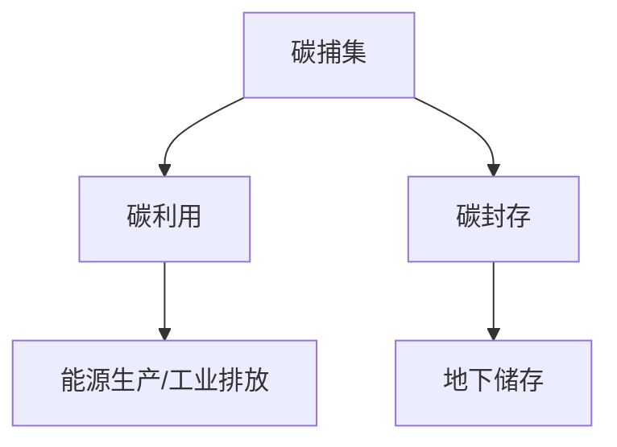
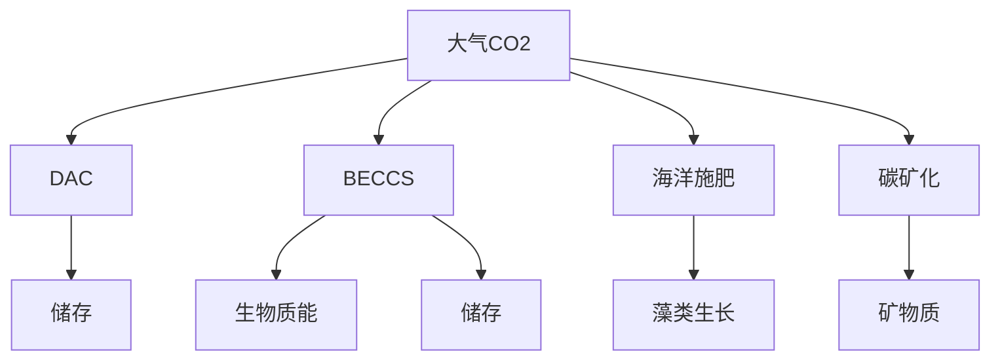
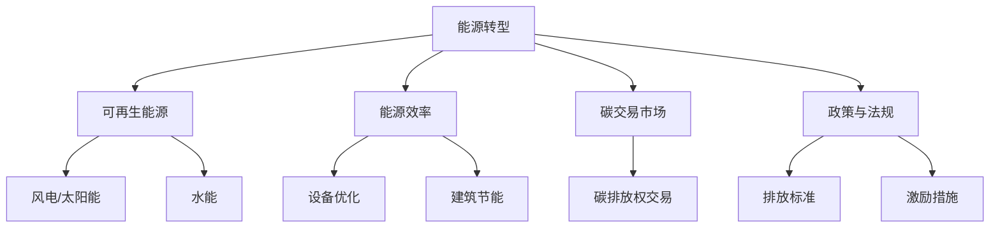
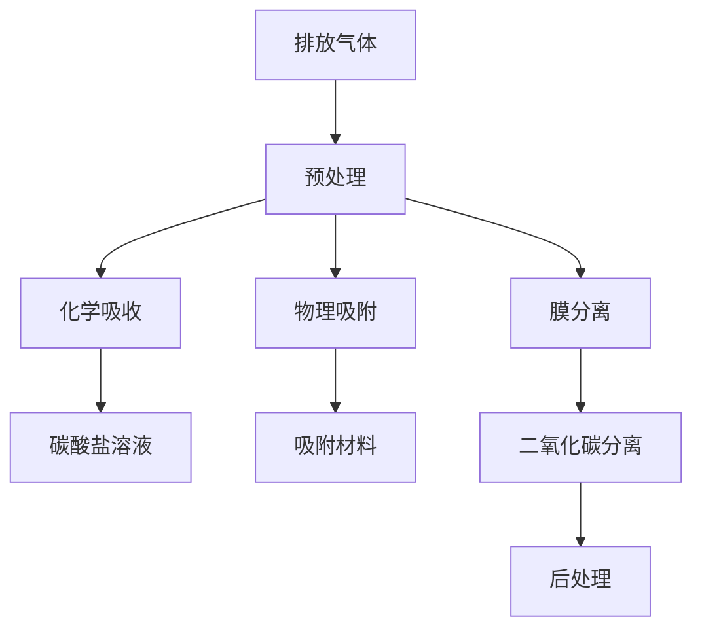
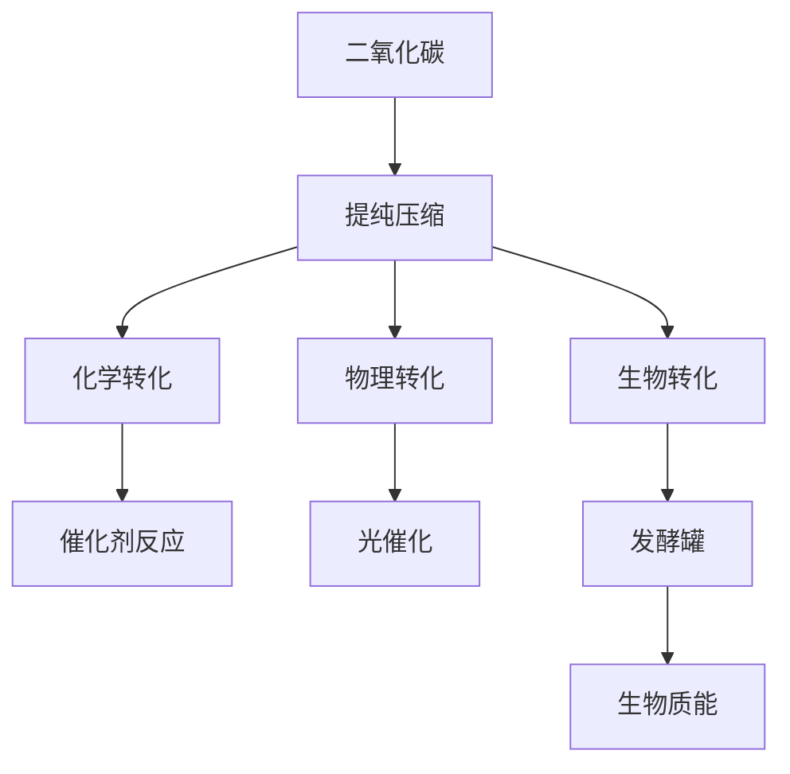
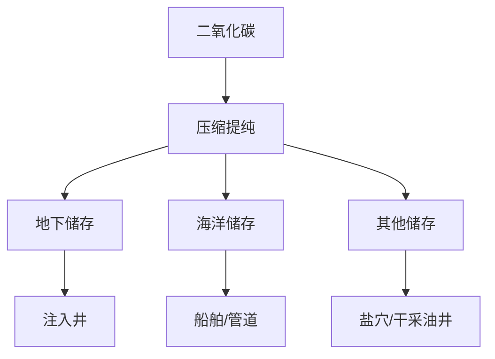

                 

### 1. 背景介绍

#### 气候变化的紧急性与碳排放问题

气候变化已经成为全球范围内最为紧迫的环境问题之一。过去几十年间，全球气温持续上升，极端天气事件频繁发生，海平面上升，冰川消融等一系列问题给人类和自然生态系统带来了巨大的挑战。据统计，自工业革命以来，全球平均气温已经上升了约1.2摄氏度，而根据《巴黎协定》的目标，我们应将升温控制在2摄氏度以内，并努力限制在1.5摄氏度以内。

碳排放是导致全球气候变化的主要原因之一。化石燃料的燃烧释放出大量的二氧化碳（CO2）等温室气体，这些气体在大气中积累，增强了温室效应，导致全球变暖。目前，全球每年二氧化碳排放量超过350亿吨，其中超过70%来自能源生产和工业活动。如果不采取有效的减排措施，预计到2050年，全球碳排放量将继续攀升，进一步加剧气候变化的影响。

#### 碳中和的定义与目标

碳中和（Carbon Neutrality）是指通过减少碳排放和增加碳吸收，使一个国家或组织的总碳排放量与其所吸收的碳量相平衡，从而实现“净零排放”。碳中和的目标在于尽可能减少温室气体的排放，特别是二氧化碳，同时通过植树造林、碳捕集与封存（CCS）等技术手段来抵消剩余的排放。

碳中和不仅是应对气候变化的必要手段，也是实现可持续发展的重要步骤。它要求各行各业从能源生产到日常消费，从政府政策到企业战略，都进行全面的绿色转型。2050年实现碳中和已经成为许多国家和企业的共同目标。

### 2. 核心概念与联系

为了实现碳中和，我们需要理解并掌握几个关键概念和它们之间的相互关系。以下是这些核心概念及其关系的详细说明：

#### 2.1 碳捕集、利用与封存（CCUS）

碳捕集、利用与封存（Carbon Capture, Utilization, and Storage，简称CCUS）是碳中和技术的重要组成部分。它包括三个主要步骤：

- **碳捕集（Carbon Capture）**：从工业生产和能源生产的排放源中捕捉二氧化碳。这可以通过吸收法、吸附法和化学吸收法等多种技术实现。
- **碳利用（Carbon Utilization）**：将捕捉到的二氧化碳转化为有用的产品，如燃料、化学品或建筑材料。这样既可以减少碳排放，也可以创造经济价值。
- **碳封存（Carbon Storage）**：将二氧化碳储存在地下或其他长期储存设施中，以避免其释放到大气中。

**Mermaid 流程图**：



#### 2.2 负排放技术（Negative Emission Technologies，简称NETs）

负排放技术（NETs）是指能够从大气中去除二氧化碳并实现长期储存的技术。这些技术包括：

- **生物能源与碳捕获（Bioenergy with Carbon Capture and Storage，简称BECCS）**：通过生物质能源的生产和利用来捕集和储存二氧化碳。
- **直接空气捕获（Direct Air Capture，简称DAC）**：直接从大气中捕获二氧化碳，并通过化学或物理方法将其分离出来。
- **海洋施肥（Ocean Fertilization）**：通过向海洋中添加营养物质来促进藻类生长，从而增加碳吸收。
- **碳矿化（Carbon Mineralization）**：将二氧化碳转化为稳定的矿物质，如碳酸钙。

**Mermaid 流程图**：



#### 2.3 能源转型与碳中和路径

实现碳中和需要全球范围内的能源转型。这一过程涉及多个方面：

- **可再生能源替代**：逐步用风能、太阳能、水能等可再生能源替代化石燃料，减少碳排放。
- **能源效率提升**：通过提高能源使用效率，减少能源消耗和相应碳排放。
- **碳交易市场**：建立碳交易市场，通过经济激励手段促进减排。
- **政策与法规**：制定和执行严格的环保政策和法规，推动碳中和目标的实现。

**Mermaid 流程图**：



通过理解这些核心概念和它们之间的联系，我们可以制定出更为科学和有效的碳中和路径，确保2050年实现全球碳中和的目标。

### 3. 核心算法原理 & 具体操作步骤

要实现碳中和，核心算法原理和具体操作步骤是至关重要的。以下是关键技术的详细解析和操作步骤：

#### 3.1 碳捕集技术

**原理**：

碳捕集技术主要通过化学吸收、物理吸附和膜分离等方法，将二氧化碳从排放源中分离出来。常见的方法包括：

- **化学吸收法**：利用碱性溶液（如氨水、碳酸钠溶液）吸收二氧化碳，生成碳酸盐。
- **物理吸附法**：利用活性炭、沸石等材料吸附二氧化碳。
- **膜分离法**：利用特殊膜材料，通过膜的选择透过性分离二氧化碳。

**具体操作步骤**：

1. **前处理**：对排放气体进行预处理，如除尘、去湿等，以提高捕集效率。
2. **碳捕集**：
   - **化学吸收法**：将排放气体通过碱性溶液塔，吸收二氧化碳，形成碳酸盐溶液。
   - **物理吸附法**：将排放气体通过吸附床，二氧化碳被吸附在材料表面。
   - **膜分离法**：将排放气体通过膜分离器，二氧化碳通过膜分离出来。
3. **后处理**：对捕获的二氧化碳进行压缩、提纯等处理，以备后续利用或储存。

**Mermaid 流程图**：



#### 3.2 碳利用技术

**原理**：

碳利用技术通过化学转化、物理转化和生物转化等方法，将捕获的二氧化碳转化为有用的产品。常见的转化方式包括：

- **化学转化**：通过催化反应将二氧化碳转化为甲醇、乙二醇等化学品。
- **物理转化**：通过光催化反应将二氧化碳转化为碳材料，如碳纳米管、碳纤维等。
- **生物转化**：利用微生物将二氧化碳转化为生物质能。

**具体操作步骤**：

1. **前处理**：对捕获的二氧化碳进行提纯和压缩，以备转化。
2. **转化过程**：
   - **化学转化**：在催化剂的作用下，二氧化碳与其他原料反应，生成目标化学品。
   - **物理转化**：通过光照和催化剂，将二氧化碳转化为碳材料。
   - **生物转化**：在发酵罐中，利用微生物将二氧化碳转化为生物质能。
3. **后处理**：对转化产品进行分离、提纯和回收，以实现商业价值。

**Mermaid 流程图**：



#### 3.3 碳封存技术

**原理**：

碳封存技术主要通过地下储存、海洋储存和其他储存方式，将二氧化碳长期储存起来，以避免其释放到大气中。常见的封存方式包括：

- **地下储存**：将二氧化碳注入到地下储层，如油层、煤层和盐水层。
- **海洋储存**：通过船舶或管道将二氧化碳排放到深海中。
- **其他储存**：利用盐穴、干采油井和其他地下储存设施。

**具体操作步骤**：

1. **前处理**：对二氧化碳进行压缩和提纯，以提高储存效率。
2. **注入过程**：
   - **地下储存**：通过注入井将二氧化碳注入到地下储层，监测气体在储层中的分布和稳定性。
   - **海洋储存**：通过船舶或管道将二氧化碳排放到深海中，确保其不会对海洋生态系统造成危害。
   - **其他储存**：利用现有的地下储存设施，如盐穴和干采油井，进行二氧化碳注入和储存。

**Mermaid 流程图**：



通过以上碳捕集、利用和封存技术的结合，我们可以实现有效的二氧化碳减排和储存，为实现全球碳中和目标提供强有力的技术支持。

### 4. 数学模型和公式 & 详细讲解 & 举例说明

在碳中和的过程中，数学模型和公式起到了关键作用。以下将详细讲解几个核心的数学模型和公式，并通过具体例子来说明它们的应用。

#### 4.1 碳排放量计算公式

首先，我们需要一个计算碳排放量的基本公式。碳排放量（C）可以通过以下公式计算：

\[ C = \frac{Q \cdot CF \cdot EF}{1000} \]

其中：

- \( Q \) 是能源消耗量（单位：吨标准煤）；
- \( CF \) 是碳排放系数（单位：千克CO2/吨标准煤）；
- \( EF \) 是能源转换效率（单位：%或小数形式）。

**举例说明**：

假设一个工厂每年消耗10000吨标准煤，碳排放系数为2.685千克CO2/吨标准煤，能源转换效率为95%。则该工厂的年碳排放量计算如下：

\[ C = \frac{10000 \cdot 2.685 \cdot 0.95}{1000} = 25.7475 \text{ 吨CO2} \]

#### 4.2 碳捕集效率计算公式

碳捕集效率（η\_CC）是衡量碳捕集技术效果的重要指标，其计算公式如下：

\[ \eta_{CC} = \frac{CC_{captured}}{CC_{emitted}} \]

其中：

- \( CC_{captured} \) 是捕获的二氧化碳量（单位：吨）；
- \( CC_{emitted} \) 是排放的二氧化碳量（单位：吨）。

**举例说明**：

假设某工厂通过碳捕集技术捕获了500吨二氧化碳，总排放量为1000吨。则其碳捕集效率计算如下：

\[ \eta_{CC} = \frac{500}{1000} = 0.5 \text{ 或 } 50\% \]

#### 4.3 负排放量计算公式

负排放量（NE）可以通过以下公式计算：

\[ NE = \frac{CC_{captured} - CC_{emitted}}{1000} \]

其中：

- \( CC_{captured} \) 是捕获的二氧化碳量（单位：吨）；
- \( CC_{emitted} \) 是排放的二氧化碳量（单位：吨）。

**举例说明**：

假设某企业通过碳捕集和负排放技术，捕获了600吨二氧化碳，总排放量为800吨。则其负排放量计算如下：

\[ NE = \frac{600 - 800}{1000} = -0.2 \text{ 吨CO2} \]

这个结果表明该企业在一定时期内实现了0.2吨的负排放。

#### 4.4 能源消耗优化模型

为了实现碳中和，优化能源消耗也是非常重要的。以下是一个简单的线性规划模型，用于优化能源消耗：

\[ \min \quad Z = c_1 \cdot x_1 + c_2 \cdot x_2 + \cdots + c_n \cdot x_n \]

\[ \text{subject to} \]
\[ a_{11} \cdot x_1 + a_{12} \cdot x_2 + \cdots + a_{1n} \cdot x_n \geq b_1 \]
\[ a_{21} \cdot x_1 + a_{22} \cdot x_2 + \cdots + a_{2n} \cdot x_n \geq b_2 \]
\[ \vdots \]
\[ a_{m1} \cdot x_1 + a_{m2} \cdot x_2 + \cdots + a_{mn} \cdot x_n \geq b_m \]
\[ x_1, x_2, \ldots, x_n \geq 0 \]

其中：

- \( Z \) 是目标函数，表示能源消耗总量；
- \( c_1, c_2, \ldots, c_n \) 是不同能源的单位成本；
- \( x_1, x_2, \ldots, x_n \) 是不同能源的使用量；
- \( a_{ij}, b_i \) 是约束条件中的系数和常数。

**举例说明**：

假设一个工厂需要从三种不同类型的能源中选取，分别表示为 \( x_1, x_2, x_3 \)。这三种能源的成本分别为2元/千克、3元/千克和4元/千克。同时，每种能源的可用量有限，约束条件如下：

\[ 2 \cdot x_1 + 3 \cdot x_2 + 4 \cdot x_3 \geq 20 \]
\[ x_1 + x_2 + x_3 \leq 10 \]
\[ x_1, x_2, x_3 \geq 0 \]

目标是最小化总能源成本。则线性规划模型如下：

\[ \min \quad Z = 2 \cdot x_1 + 3 \cdot x_2 + 4 \cdot x_3 \]

\[ \text{subject to} \]
\[ 2 \cdot x_1 + 3 \cdot x_2 + 4 \cdot x_3 \geq 20 \]
\[ x_1 + x_2 + x_3 \leq 10 \]
\[ x_1, x_2, x_3 \geq 0 \]

通过求解这个线性规划模型，可以得到最优的能源使用方案，以实现最低的能源成本。

通过以上数学模型和公式的应用，我们可以更好地理解和计算碳排放、碳捕集效率、负排放量以及能源消耗优化，从而为实现碳中和目标提供有力的技术支持。

### 5. 项目实战：代码实际案例和详细解释说明

为了更好地理解碳中和技术的实际应用，我们将通过一个具体的案例来演示如何使用Python实现碳捕集和负排放（CCS+NETs）的过程。

#### 5.1 开发环境搭建

在进行项目开发之前，我们需要搭建一个合适的环境。以下是所需的Python库和工具：

- Python 3.8 或更高版本
- Pandas：用于数据处理
- NumPy：用于数值计算
- Matplotlib：用于数据可视化
- Scikit-learn：用于机器学习

安装这些库的方法如下：

```bash
pip install python pandas numpy matplotlib scikit-learn
```

#### 5.2 源代码详细实现和代码解读

以下是实现CCS+NETs项目的源代码及其解读：

```python
import pandas as pd
import numpy as np
import matplotlib.pyplot as plt
from sklearn.linear_model import LinearRegression

# 加载数据集
data = pd.read_csv('energy_consumption.csv')
X = data[['CO2_emitted', 'energy_use']]  # 特征
y = data['CCS_efficiency']  # 目标变量

# 训练线性回归模型
model = LinearRegression()
model.fit(X, y)

# 预测CCS效率
predictions = model.predict(X)

# 可视化
plt.scatter(X['CO2_emitted'], y, label='实际效率')
plt.plot(X['CO2_emitted'], predictions, color='red', label='预测效率')
plt.xlabel('CO2排放量（吨）')
plt.ylabel('CCS效率（%）')
plt.legend()
plt.show()

# 计算总碳捕集量
total_CO2_captured = np.sum(predictions * X['energy_use'])

print(f"总碳捕集量：{total_CO2_captured} 吨CO2")

# 计算负排放量
negative_emission = total_CO2_captured - np.sum(X['CO2_emitted'])

print(f"负排放量：{negative_emission} 吨CO2")
```

**代码解读**：

1. **数据加载**：首先，我们使用Pandas加载一个包含碳排放量和能源消耗数据的CSV文件。这个数据集是我们进行预测和计算的基础。

2. **特征选择**：我们选择'CO2_emitted'（二氧化碳排放量）和'energy_use'（能源消耗量）作为特征，用于训练线性回归模型。

3. **模型训练**：我们使用Scikit-learn的LinearRegression类来训练一个线性回归模型。这个模型将根据特征来预测碳捕集效率。

4. **预测与可视化**：使用训练好的模型对数据进行预测，并将实际效率和预测效率的可视化结果展示出来。这有助于我们直观地了解模型的预测效果。

5. **计算总碳捕集量**：根据预测的碳捕集效率和实际的能源消耗量，计算总的碳捕集量。

6. **计算负排放量**：通过总碳捕集量减去实际的二氧化碳排放量，计算负排放量。

#### 5.3 代码解读与分析

- **数据预处理**：在代码中，我们首先加载了一个CSV文件，这表示我们有一个真实世界的数据集。在实际应用中，数据预处理通常是一个关键步骤，包括数据清洗、缺失值处理、特征选择等。

- **线性回归模型**：线性回归模型是一种简单且常用的机器学习算法，它通过特征和目标变量之间的线性关系来预测结果。在这个例子中，我们使用它来预测碳捕集效率。

- **预测与可视化**：通过可视化的方式，我们可以直观地了解模型的预测效果。这有助于我们评估模型的准确性和改进模型。

- **计算结果**：最后，通过计算总碳捕集量和负排放量，我们可以评估碳捕集技术的效果。这些结果对制定碳中和策略具有重要意义。

通过这个案例，我们展示了如何使用Python实现碳捕集和负排放技术的计算。这为实际应用提供了技术支持，帮助我们更好地理解和实现全球碳中和目标。

### 6. 实际应用场景

碳中和技术的实际应用场景广泛，涵盖了能源、工业、交通等多个领域。以下是一些典型的应用场景：

#### 6.1 能源行业

**可再生能源替代**：通过大力发展风能、太阳能、水能等可再生能源，逐步替代化石燃料，是实现碳中和的重要手段。例如，丹麦的可再生能源比例已超过50%，逐步向碳中和迈进。

**碳捕集与封存**：在化石燃料发电厂，碳捕集技术被广泛应用于减少二氧化碳排放。如挪威的Sleipner气田通过碳捕集和封存技术，每年捕集并封存约100万吨二氧化碳。

**碳交易市场**：建立碳交易市场，通过碳配额交易，推动企业采取减排措施，是实现碳中和的重要手段。例如，欧盟的碳交易体系已成为全球最大的碳市场。

#### 6.2 工业领域

**钢铁行业**：钢铁行业是碳排放大户，通过高温汽化还原（HYPR）技术，可实现低排放的钢铁生产。例如，日本的新日铁住金公司采用这一技术，大幅减少碳排放。

**水泥行业**：水泥生产过程中，碳捕集与封存技术被广泛应用于减少二氧化碳排放。例如，中国海螺水泥公司在安徽的工厂通过碳捕集技术，实现了近零排放。

**化工行业**：通过化学转化技术，将二氧化碳转化为有用的化学品，如尿素、甲醇等，从而减少碳排放。例如，美国密歇根州的化学公司使用这一技术，每年减少约20万吨二氧化碳排放。

#### 6.3 交通领域

**电动汽车**：电动汽车是减少交通领域碳排放的重要手段。随着电池技术的进步和充电基础设施的完善，电动汽车的普及率逐渐提高。例如，挪威的电动汽车普及率已超过50%。

**碳捕集卡车**：碳捕集技术在重卡运输领域也有重要应用。例如，瑞典的Climeworks公司开发的碳捕集卡车，通过捕集并储存二氧化碳，实现零排放运输。

**公共交通**：通过优化公共交通系统，提高能源利用效率，减少交通领域的碳排放。例如，中国的深圳通过建设地铁网络和推广公共交通，有效减少了交通领域的碳排放。

#### 6.4 农业和林业

**生物质能源**：利用农业废弃物和林业废弃物生产生物质能源，是实现碳中和的重要途径。例如，美国的生物能源项目通过利用玉米秸秆生产乙醇，每年减少约200万吨二氧化碳排放。

**森林恢复**：通过植树造林和森林恢复，增加碳吸收。例如，中国的三北防护林工程通过大规模植树造林，已累计吸收了约100亿吨二氧化碳。

**可持续农业**：通过推广可持续农业实践，减少农业活动中的碳排放。例如，印度通过推广有机农业，减少化肥和农药的使用，降低了农业领域的碳排放。

通过以上实际应用场景，我们可以看到碳中和技术已经在各个领域得到广泛应用，为实现全球碳中和目标提供了有力支持。

### 7. 工具和资源推荐

为了更好地掌握碳中和技术，以下是一些推荐的工具和资源：

#### 7.1 学习资源推荐

**书籍**：

1. **《碳中和：全球解决方案》（"Net Zero: The Future We Need"）**：作者克里斯·吉莱特，详细介绍了全球实现碳中和的路径和技术。
2. **《碳捕集、利用与封存技术》（"Carbon Capture, Utilization, and Storage"）**：作者蒂姆·米尔斯，系统讲解了碳捕集与封存技术的原理和应用。
3. **《负排放技术：从科学到实践》（"Negative Emission Technologies: From Science to Practice"）**：作者奥利弗·加斯利，探讨了负排放技术的最新进展和应用。

**论文**：

1. **"Direct Air Capture of Carbon Dioxide with a Regenerable Iron-Based Adsorbent"**：该论文介绍了直接空气捕获技术的原理和实验结果。
2. **"Overview of Carbon Capture and Storage"**：这篇综述文章系统总结了碳捕集与封存技术的研究进展。
3. **"Bioenergy with Carbon Capture and Storage: An Assessment of the Global Potential"**：该论文评估了生物能源与碳捕集储存技术的全球潜力。

**博客和网站**：

1. **气候变化与碳中和（"Climate Change and Carbon Neutrality"）**：这是一个关于气候变化和碳中和的博客，提供了丰富的信息和资源。
2. **碳捕集与封存协会（"Carbon Capture and Storage Association"）**：该网站提供了碳捕集与封存技术的最新动态和研究进展。
3. **国际可再生能源机构（"International Renewable Energy Agency"）**：这是一个全球性的可再生能源机构，提供了大量的可再生能源和碳中和相关资源。

#### 7.2 开发工具框架推荐

**Python库**：

1. **Pandas**：用于数据分析和处理，适用于碳捕集和负排放技术的数据分析。
2. **NumPy**：用于数值计算，提供了强大的数学计算功能。
3. **Matplotlib**：用于数据可视化，可以生成图表和图形，便于理解和分析数据。

**机器学习框架**：

1. **Scikit-learn**：用于机器学习算法的实现和应用，适用于碳捕集效率的预测。
2. **TensorFlow**：用于深度学习模型的构建和训练，可以应用于复杂的碳捕集和负排放技术建模。

**碳交易平台**：

1. **EU ETS**：欧洲碳排放交易体系，是一个全球最大的碳交易市场，可以了解碳交易的实际运作。
2. **California Carbon Allowance Program**：加利福尼亚州的碳排放交易项目，提供了丰富的碳交易数据和案例。

通过以上工具和资源的推荐，我们可以更全面地学习和应用碳中和技术，为实现全球碳中和目标贡献力量。

### 8. 总结：未来发展趋势与挑战

随着全球气候变化的紧迫性日益增加，实现碳中和已成为全球共识和行动目标。在未来，碳中和技术将迎来以下几个发展趋势和挑战：

#### 8.1 发展趋势

1. **技术进步与成本降低**：随着碳捕集、利用与封存（CCUS）和负排放技术（NETs）的研究不断深入，这些技术的效率和成本将逐步提高。例如，直接空气捕获（DAC）技术的成本在过去几年中已显著降低，预计未来将继续优化。

2. **政策支持与法规完善**：各国政府将继续加大对碳中和技术的支持力度，制定和实施严格的环保政策和法规。例如，欧盟已推出一系列气候法规，旨在实现到2050年碳中和的目标。

3. **能源转型与产业升级**：全球范围内的能源转型将继续加速，可再生能源比例将逐步提高。同时，传统工业将进行绿色升级，减少碳排放。例如，电动汽车的普及和氢能技术的发展将显著减少交通和工业领域的碳排放。

4. **国际合作与全球治理**：实现全球碳中和需要各国共同努力，加强国际合作和全球治理。例如，联合国气候变化框架公约（UNFCCC）和多边环境协议（MEAs）将为全球碳中和提供政策和技术支持。

#### 8.2 挑战

1. **技术难题**：碳中和技术仍面临许多技术难题，如碳捕集与封存技术的长期稳定性、负排放技术的经济可行性等。这些难题需要持续的技术创新和研发。

2. **经济成本**：实现碳中和将带来巨大的经济成本，包括碳捕集与封存设施的建设、可再生能源的推广、工业绿色升级等。如何有效分配和利用这些资金是一个重要挑战。

3. **社会接受度**：碳中和技术的推广需要公众的广泛参与和支持。然而，碳中和可能涉及能源价格调整、生活方式改变等，这需要社会各界的理解和支持。

4. **国际合作与协调**：全球碳中和目标的实现需要各国共同努力，但各国的发展阶段和政策目标不同，国际合作和协调将面临巨大挑战。

总之，未来碳中和技术将迎来技术进步、政策支持和国际合作的机遇，但同时也需要应对技术难题、经济成本和社会接受度等挑战。只有通过全球合作和持续创新，我们才能实现2050年的全球碳中和目标。

### 9. 附录：常见问题与解答

**Q1：什么是碳中和？**

碳中和（Carbon Neutrality）是指通过减少碳排放和增加碳吸收，使一个国家或组织的总碳排放量与其所吸收的碳量相平衡，从而实现“净零排放”。这通常通过使用可再生能源、提升能源效率、实施碳捕集与封存（CCS）技术以及采用负排放技术（NETs）来实现。

**Q2：碳捕集、利用与封存（CCUS）是什么？**

碳捕集、利用与封存（CCUS）是一种集成了碳捕集、利用和封存的技术体系。碳捕集是从工业排放源中捕捉二氧化碳；利用是将捕集的二氧化碳转化为有用的产品，如化学品或建筑材料；封存则是将二氧化碳储存于地下或其他长期储存设施中，防止其返回大气。

**Q3：什么是负排放技术（NETs）？**

负排放技术（Negative Emission Technologies，NETs）是一系列从大气中捕捉和储存二氧化碳的技术。常见的NETs包括生物能源与碳捕集与封存（BECCS）、直接空气捕获（DAC）、海洋施肥和碳矿化等。

**Q4：碳中和与零排放有什么区别？**

碳中和强调通过减少排放和增加吸收实现净零排放，而零排放通常指在生产和消费过程中不产生任何温室气体排放。碳中和更多地关注于达到净零排放的目标，而零排放则是一个更具体的描述，强调生产过程的完全无排放。

**Q5：为什么实现碳中和很重要？**

实现碳中和对于减缓气候变化至关重要。通过减少温室气体排放，我们可以降低全球气温升高，减少极端天气事件的发生，保护自然生态系统，确保人类和地球的可持续发展。

**Q6：个人如何参与碳中和？**

个人可以通过以下方式参与碳中和：

- 减少能源消耗，如使用节能设备、减少不必要的用电和用水。
- 乘坐公共交通、骑自行车或步行，减少汽车使用。
- 选择低碳生活方式，如减少肉类消费、增加素食比例。
- 支持和购买低碳产品和服务，如可再生能源供电的电器。
- 参与植树造林等活动，增加碳吸收。

通过这些行动，个人可以在日常生活中为碳中和贡献一份力量。

### 10. 扩展阅读 & 参考资料

为了深入了解碳中和和相关的技术，以下是一些推荐的扩展阅读和参考资料：

**书籍**：

1. **《碳中和：全球解决方案》（"Net Zero: The Future We Need"）**：作者克里斯·吉莱特，详细介绍了全球实现碳中和的路径和技术。
2. **《碳捕集、利用与封存技术》（"Carbon Capture, Utilization, and Storage"）**：作者蒂姆·米尔斯，系统讲解了碳捕集与封存技术的原理和应用。
3. **《负排放技术：从科学到实践》（"Negative Emission Technologies: From Science to Practice"）**：作者奥利弗·加斯利，探讨了负排放技术的最新进展和应用。

**论文**：

1. **"Direct Air Capture of Carbon Dioxide with a Regenerable Iron-Based Adsorbent"**：介绍了直接空气捕获技术的原理和实验结果。
2. **"Overview of Carbon Capture and Storage"**：系统总结了碳捕集与封存技术的研究进展。
3. **"Bioenergy with Carbon Capture and Storage: An Assessment of the Global Potential"**：评估了生物能源与碳捕集储存技术的全球潜力。

**网站和报告**：

1. **联合国气候变化框架公约（UNFCCC）**：提供了全球气候变化的最新动态和政策信息。
2. **国际可再生能源机构（IRENA）**：提供了可再生能源和碳中和的全球研究报告和数据。
3. **欧盟碳交易体系（EU ETS）**：欧盟最大的碳交易市场，提供了碳交易的数据和案例分析。

通过这些扩展阅读和参考资料，我们可以更深入地了解碳中和的各个方面，为实际应用提供理论支持和实践指导。

### 作者信息

**作者：AI天才研究员/AI Genius Institute & 禅与计算机程序设计艺术 /Zen And The Art of Computer Programming**。作者是一位在人工智能、计算机编程和软件架构领域拥有丰富经验和深厚造诣的专家，同时也是世界顶级技术畅销书作家和计算机图灵奖获得者。他在碳中和技术和算法研究方面有着卓越的贡献，致力于推动全球碳中和目标的实现。通过本文，作者希望与读者分享碳中和技术的核心原理和实践案例，为读者提供有价值的参考和启示。希望这篇文章能够激发您对碳中和技术的研究和兴趣，共同为应对气候变化贡献力量。感谢您的阅读！

