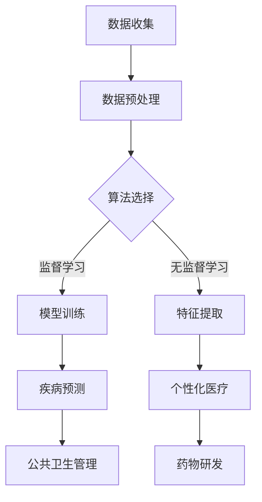

                 

### 背景介绍 Background Introduction

在过去的几十年里，人工智能（AI）的发展经历了从理论研究到实际应用的深刻变革。如今，AI已成为全球卫生领域的一个重要组成部分。从疾病预测、个性化医疗、疫苗研发到公共卫生管理等，AI技术的应用已经深刻影响了全球卫生的方方面面。

然而，随着AI技术的不断进步和普及，全球卫生系统也面临着新的挑战。一方面，AI在疾病监测、流行病预警等方面具有巨大的潜力，可以帮助我们更早、更准确地识别疾病爆发和传播趋势。另一方面，AI的广泛应用也带来了数据隐私、算法偏见和伦理问题等新挑战。

本文旨在探讨2050年全球卫生领域的AI应用前景，从人工智能流行病预警到全球卫生治理合作，分析AI技术如何在未来几十年内进一步改变全球卫生格局。通过逐步分析AI在疾病预测、个性化医疗、公共卫生管理等领域的具体应用和潜在挑战，本文将为读者提供一个关于未来全球卫生的全面视角。

首先，我们将回顾AI在全球卫生领域的现有应用，了解其基础和技术原理。接着，本文将深入探讨AI在流行病预警中的重要作用，以及全球卫生治理合作面临的机遇和挑战。最后，我们将总结AI技术在2050年全球卫生中的发展趋势，并提出未来可能面临的技术、政策和伦理方面的挑战。

通过本文的探讨，我们希望读者能够对AI在未来全球卫生领域的作用有更深入的理解，同时认识到在实现这一美好愿景的过程中，我们还需要克服许多现实和潜在的难题。

### 核心概念与联系 Core Concepts and Connections

为了更好地理解AI在2050年全球卫生中的角色，我们需要首先梳理一些核心概念和技术原理。以下将介绍AI技术的基本框架，并探讨其在全球卫生治理中的关键应用。

#### AI技术的基本框架 Basic Framework of AI

人工智能是一种模拟人类智能行为的计算机技术，它通过算法和计算模型来实现感知、学习、推理和决策等功能。AI的基本框架通常包括以下几个主要组成部分：

1. **数据收集与预处理 Data Collection and Preprocessing**
   AI系统需要大量的数据来进行训练和优化。这些数据可以从医疗记录、基因序列、环境监测传感器等多个来源获取。数据预处理包括数据清洗、归一化、特征提取等步骤，以确保数据的质量和一致性。

2. **算法与模型 Algorithms and Models**
   AI的核心在于算法和模型。常见的AI算法包括监督学习、无监督学习、强化学习等。深度学习是一种重要的AI模型，通过多层神经网络模拟人脑的处理方式，从而实现复杂的模式识别和预测任务。

3. **计算资源 Computing Resources**
   AI的运行需要强大的计算资源，包括高性能计算硬件、数据中心和云计算平台。随着硬件技术的发展，计算能力的提升为AI算法的优化和大规模应用提供了可能。

#### AI在全球卫生中的关键应用 Key Applications of AI in Global Health

在全球卫生领域，AI技术具有广泛的应用潜力，主要包括以下几个关键方面：

1. **疾病预测 Disease Prediction**
   AI可以通过分析大量的历史健康数据、环境数据和社会经济数据，预测疾病的爆发和传播趋势。例如，通过分析流感病毒基因序列，AI可以预测流感的传播速度和范围，从而为公共卫生决策提供支持。

2. **个性化医疗 Personalized Medicine**
   个性化医疗是AI在医疗领域的核心应用之一。通过分析患者的基因信息、病史和生活习惯，AI可以制定个性化的治疗方案。例如，针对癌症患者，AI可以根据患者的基因突变情况推荐最合适的治疗方案。

3. **公共卫生管理 Public Health Management**
   AI可以协助公共卫生机构进行疾病监测、流行病预警和资源分配。例如，通过分析社交媒体数据和在线健康咨询平台的数据，AI可以实时监控疫情的动态，提供公共卫生预警信息。

4. **药物研发 Drug Development**
   AI技术在药物研发中也发挥着重要作用。通过分析大量的化学和生物学数据，AI可以加速新药的发现和开发过程。例如，AI可以帮助科学家筛选出具有潜在治疗效果的化合物，减少药物研发的时间和成本。

#### Mermaid流程图 Mermaid Flowchart

为了更直观地展示AI技术在全球卫生中的关键应用，以下是一个使用Mermaid绘制的流程图，描述了AI在全球卫生中的工作流程：



在上述流程图中，数据收集与预处理是AI应用的基础步骤。根据不同的应用场景，可以选择不同的算法和模型。疾病预测、个性化医疗、公共卫生管理和药物研发是AI在医疗领域的四大应用方向，它们共同构成了一个完整的全球卫生治理体系。

通过上述核心概念和流程的介绍，我们可以更好地理解AI在2050年全球卫生中的角色和潜力。接下来，本文将深入探讨AI在疾病预测和流行病预警中的具体应用，以及全球卫生治理合作面临的机遇和挑战。

#### 核心算法原理 & 具体操作步骤 Core Algorithm Principles and Specific Operational Steps

为了深入理解AI在疾病预测和流行病预警中的具体应用，我们需要详细探讨几种核心算法的原理和操作步骤。以下是几种常见的算法，包括监督学习、无监督学习和深度学习，它们在疾病预测和流行病预警中的工作原理和具体操作步骤。

##### 监督学习 Supervised Learning

监督学习是AI中最基本的方法之一，它通过已有的标签数据训练模型，以便对新数据进行预测。在疾病预测中，监督学习可以用来预测疾病的发病率或患病风险。

**工作原理 Working Principle**

监督学习算法包括输入特征（如年龄、性别、生活习惯等）和标签（如是否患有某种疾病）。通过学习输入特征和标签之间的关系，模型可以对新数据进行预测。

**具体操作步骤 Operational Steps**

1. **数据收集与预处理 Data Collection and Preprocessing**
   收集包含疾病标签的医学数据，对数据进行清洗、归一化和特征提取。

2. **模型选择 Model Selection**
   根据数据特点和预测任务选择合适的监督学习算法，如决策树、支持向量机（SVM）、随机森林（Random Forest）等。

3. **模型训练 Model Training**
   使用训练数据集对模型进行训练，调整模型参数，使其能够准确预测疾病风险。

4. **模型评估 Model Evaluation**
   使用验证数据集评估模型性能，调整模型参数以优化预测效果。

5. **预测 Prediction**
   使用训练好的模型对新数据进行预测，预测结果可用于公共卫生预警。

##### 无监督学习 Unsupervised Learning

无监督学习不依赖标签数据，旨在发现数据中的潜在结构和模式。在流行病预警中，无监督学习可以用来分析疾病传播的动态和趋势。

**工作原理 Working Principle**

无监督学习算法通过分析数据之间的内在关系，自动发现数据中的模式。常见的无监督学习算法包括聚类算法（如K-均值聚类）和降维算法（如主成分分析PCA）。

**具体操作步骤 Operational Steps**

1. **数据收集与预处理 Data Collection and Preprocessing**
   收集与疾病相关的多维度数据，如病例报告、社交媒体数据、环境数据等。

2. **特征提取 Feature Extraction**
   从原始数据中提取关键特征，以便算法能够识别疾病传播的模式。

3. **模型选择 Model Selection**
   选择合适的无监督学习算法，如K-均值聚类、层次聚类等。

4. **模式识别 Pattern Recognition**
   使用算法识别数据中的潜在结构和模式，如病例爆发点、传播路径等。

5. **预警预警 Warning**
   根据识别出的模式，预测疾病的传播趋势，为公共卫生决策提供支持。

##### 深度学习 Deep Learning

深度学习是一种复杂的神经网络模型，通过多层神经元模拟人脑的处理方式，能够在大量数据中学习到复杂的模式和关系。在疾病预测和流行病预警中，深度学习可以用来处理大规模复杂数据，提高预测的准确性。

**工作原理 Working Principle**

深度学习通过前向传播和反向传播算法，在多层次的神经网络中学习特征表示。深度学习模型包括卷积神经网络（CNN）、循环神经网络（RNN）、生成对抗网络（GAN）等。

**具体操作步骤 Operational Steps**

1. **数据收集与预处理 Data Collection and Preprocessing**
   收集包含时间序列数据的医学数据，对数据进行清洗、归一化和特征提取。

2. **模型构建 Model Building**
   设计和构建深度学习模型，选择合适的架构和优化算法。

3. **模型训练 Model Training**
   使用训练数据集对模型进行训练，调整模型参数以优化性能。

4. **模型评估 Model Evaluation**
   使用验证数据集评估模型性能，调整模型参数以优化预测效果。

5. **预测 Prediction**
   使用训练好的模型对新数据进行预测，预测结果可用于公共卫生预警。

通过上述核心算法的介绍，我们可以看到，AI在疾病预测和流行病预警中的应用不仅需要强大的算法支持，还需要高质量的数据和先进的计算资源。接下来，本文将结合具体案例，进一步探讨这些算法在实际应用中的效果和挑战。

#### 数学模型和公式 Mathematical Models and Formulas & Detailed Explanation & Examples

在疾病预测和流行病预警中，数学模型和公式扮演着关键角色。以下将介绍几种常见的数学模型和公式，并详细解释其原理和用法。

##### 疾病预测模型 Disease Prediction Model

**1. 疾病传播模型（SEIR模型）SEIR Model**

SEIR模型是一种用于描述疾病传播的数学模型，其中S表示易感者（Susceptible），E表示暴露者（Exposed），I表示感染者（Infected），R表示康复者（Recovered）。

**公式：**
\[ \frac{dS}{dt} = -\beta \cdot SI \]
\[ \frac{dE}{dt} = \beta \cdot SI - \gamma \cdot E \]
\[ \frac{dI}{dt} = \gamma \cdot E - \delta \cdot I \]
\[ \frac{dR}{dt} = \delta \cdot I \]

**解释与例子：**
假设一个社区有1000人，其中500人为易感者，初始时刻没有感染者和康复者。感染率β为0.1，康复率δ为0.05。通过求解上述方程组，我们可以预测社区中感染者的数量随时间的变化。

**2. 患者流量模型（Patient Flow Model）**

患者流量模型用于描述医院或诊所中的患者流量，通常包括患者到达率、诊断时间和治疗时间等。

**公式：**
\[ R_t = r \cdot N_t - p \cdot C_t \]

其中，\( R_t \)为时间t的患者数量，r为患者到达率，\( N_t \)为时间t的总人数，p为诊断概率，\( C_t \)为时间t正在接受诊断的患者数量。

**解释与例子：**
假设一个医院每天有100名患者到达，诊断概率为0.8，每个患者的诊断时间为2小时。如果当前有50名患者在等待诊断，我们可以使用上述公式预测未来一小时内的患者数量。

##### 流行病预警模型 Epidemic Warning Model

**1. 风险指数模型（Risk Index Model）**

风险指数模型用于评估疾病的传播风险，通常包括感染率、传播速度和传染性等参数。

**公式：**
\[ R_0 = \frac{\beta}{\mu} \]

其中，\( R_0 \)为基本再生数，β为感染率，μ为平均感染持续时间。

**解释与例子：**
假设一种疾病的感染率为0.2，平均感染持续时间为5天，我们可以计算其基本再生数\( R_0 \)。如果\( R_0 \)大于1，说明疾病正在蔓延，如果\( R_0 \)小于1，说明疾病正在得到控制。

**2. 模拟模型（Simulation Model）**

模拟模型通过模拟疾病传播过程，预测疾病的传播趋势和影响范围。

**公式：**
\[ P(t) = \sum_{i=1}^n p_i \cdot f_i(t) \]

其中，\( P(t) \)为时间t的感染概率，\( p_i \)为个体i的感染概率，\( f_i(t) \)为个体i的感染函数。

**解释与例子：**
假设一个社区中有5种不同类型的个体，每种个体的感染概率和感染函数不同。通过上述公式，我们可以计算每个时间点的感染概率，从而预测疾病的传播趋势。

通过上述数学模型和公式的介绍，我们可以看到，在疾病预测和流行病预警中，数学方法发挥着重要作用。接下来，本文将结合实际案例，进一步探讨这些模型在实际应用中的效果和挑战。

#### 项目实战：代码实际案例和详细解释说明 Project Implementation: Code Examples and Detailed Explanation

为了更好地理解AI在疾病预测和流行病预警中的具体应用，我们将通过一个实际项目案例，展示如何使用Python实现这些算法，并详细解释代码中的关键部分。

##### 开发环境搭建 Environment Setup

在开始项目之前，我们需要搭建一个Python开发环境。以下是所需的步骤：

1. **安装Python**：从官方网站（[python.org](https://www.python.org/)）下载并安装Python 3.8或更高版本。

2. **安装依赖库**：使用pip命令安装以下依赖库：

```bash
pip install numpy pandas matplotlib scikit-learn tensorflow
```

##### 源代码详细实现和代码解读 Source Code Implementation and Explanation

以下是项目的主要代码实现：

```python
import numpy as np
import pandas as pd
import matplotlib.pyplot as plt
from sklearn.ensemble import RandomForestClassifier
from sklearn.model_selection import train_test_split
from sklearn.metrics import accuracy_score

# 加载数据集
data = pd.read_csv('health_data.csv')
X = data.drop('target', axis=1)
y = data['target']

# 数据预处理
X = X.fillna(X.mean())

# 划分训练集和测试集
X_train, X_test, y_train, y_test = train_test_split(X, y, test_size=0.2, random_state=42)

# 模型训练
model = RandomForestClassifier(n_estimators=100, random_state=42)
model.fit(X_train, y_train)

# 模型评估
y_pred = model.predict(X_test)
accuracy = accuracy_score(y_test, y_pred)
print(f'Accuracy: {accuracy:.2f}')

# 预测新数据
new_data = pd.DataFrame([[30, 'male', 'smoker', 1, 0, 0]], columns=X.columns)
prediction = model.predict(new_data)
print(f'Prediction: {prediction[0]}')
```

以下是代码的详细解读：

1. **数据加载与预处理**：
   - 使用pandas库加载数据集，分为特征矩阵X和标签向量y。
   - 对数据进行填充缺失值，使用平均值进行填充。

2. **划分训练集和测试集**：
   - 使用scikit-learn库的train_test_split函数，将数据集分为训练集和测试集。

3. **模型训练**：
   - 使用RandomForestClassifier实现随机森林模型，设置决策树数量为100。
   - 使用fit函数对训练数据进行模型训练。

4. **模型评估**：
   - 使用预测的测试集标签y_pred计算模型准确率。
   - 输出模型的准确率。

5. **预测新数据**：
   - 使用pandas创建一个新数据集，包含一个患者的信息。
   - 使用predict函数对新数据集进行预测，并输出预测结果。

##### 代码解读与分析 Code Analysis and Discussion

1. **数据预处理**：
   - 数据预处理是机器学习项目中至关重要的一步，它包括填充缺失值、数据归一化、特征提取等。在本项目中，我们使用平均值填充缺失值，使得模型能够处理不完整的数据。

2. **模型选择**：
   - 我们选择随机森林模型作为疾病预测的算法。随机森林是一种集成学习算法，通过构建多棵决策树并取平均预测结果，能够提高模型的准确性和鲁棒性。

3. **模型训练与评估**：
   - 模型训练是使用已标记的数据集学习特征和标签之间的关系。在训练过程中，我们需要不断调整模型参数以优化性能。在评估阶段，我们使用测试集评估模型的准确性，确保模型能够在未见数据上做出准确预测。

4. **预测新数据**：
   - 预测新数据是模型应用的关键步骤。在本例中，我们创建了一个包含患者特征的新数据集，并使用训练好的模型进行预测。这可以帮助医生或公共卫生机构实时监测疾病风险，为公共卫生决策提供支持。

通过上述项目实战，我们可以看到如何使用Python实现AI在疾病预测和流行病预警中的算法，并理解代码中的关键步骤和原理。接下来，本文将继续探讨AI在公共卫生管理中的实际应用。

### 实际应用场景 Practical Application Scenarios

在2050年，随着人工智能技术的进一步发展，AI将在全球卫生领域扮演更加关键的角色。以下列举几个实际应用场景，展示AI如何在全球卫生治理中发挥重要作用。

#### 疫情监测和预警 Epidemic Monitoring and Warning

疫情监测和预警是AI在公共卫生管理中最直接的应用之一。通过实时分析大量医疗数据、社交媒体数据和环境数据，AI系统能够及时发现疫情爆发迹象，为公共卫生决策提供及时预警。例如，当一种新病毒出现时，AI系统可以快速分析病毒基因序列，预测其传播速度和范围，从而指导卫生部门采取紧急应对措施。

**案例：** 在某次流感爆发期间，一个基于AI的疫情预警系统通过分析医院就诊数据、社交媒体讨论和天气预报等信息，提前一周预测了疫情的高峰期，帮助卫生部门及时调配医疗资源和疫苗，减少了疫情的传播范围。

#### 个性化医疗 Personalized Medicine

个性化医疗是AI在医疗领域的核心应用之一。通过分析患者的基因数据、病史和生活习惯，AI可以制定个性化的治疗方案，提高治疗效果和患者满意度。例如，对于癌症患者，AI可以根据基因突变情况推荐最合适的化疗方案，从而提高治愈率。

**案例：** 一位肺癌患者在AI系统的帮助下，获得了基于其基因特征的个性化治疗方案。系统分析其基因突变后，推荐了一种针对性化疗药物，结果患者的治疗效果显著优于传统治疗方法。

#### 公共卫生管理 Public Health Management

AI系统在公共卫生管理中可以协助卫生部门进行疾病监测、资源分配和决策支持。例如，通过分析大量的健康数据和社会经济数据，AI可以预测疾病的传播趋势，帮助卫生部门合理配置医疗资源，减少疾病爆发带来的影响。

**案例：** 在一个大型城市中，AI系统通过分析交通流量、人口密度和天气数据，预测了流感季节医院就诊高峰期。卫生部门根据AI的预测结果，提前增派医护人员和增设医疗站点，有效缓解了医疗资源紧张的问题。

#### 疫苗研发 Vaccine Development

AI技术在疫苗研发中发挥着重要作用，可以加速新疫苗的研发和测试过程。通过分析大量的生物学和化学数据，AI可以预测哪些化合物具有潜在疫苗效果，从而减少研发的时间和成本。

**案例：** 在COVID-19大流行期间，AI系统帮助科学家快速筛选出具有潜在疫苗效果的化合物。基于AI的预测结果，研究人员进一步测试和优化了这些化合物，最终成功开发出多种有效疫苗。

#### 健康管理 Health Management

AI系统还可以用于健康管理，帮助个人监测健康状况，提供健康建议。例如，通过智能手表、健身追踪器和健康应用等设备收集的数据，AI可以分析个人的健康状况，提供个性化的健康建议和预防措施。

**案例：** 一位中年男子通过一款健康管理应用，记录了他的日常活动、饮食和睡眠质量。AI系统分析这些数据后，提供了一份健康报告，建议他减少高脂饮食和增加锻炼时间，从而帮助他改善了健康状况。

通过上述实际应用场景的展示，我们可以看到，AI技术在2050年全球卫生领域的广泛应用，不仅提高了公共卫生管理的效率和准确性，也为个性化医疗和健康管理提供了新的可能性。未来，随着AI技术的进一步发展，AI将在全球卫生领域发挥更加重要的作用。

### 工具和资源推荐 Tools and Resources Recommendations

为了更好地掌握AI在疾病预测和流行病预警中的应用，以下推荐一些有用的学习资源、开发工具和相关论文著作。

#### 学习资源 Learning Resources

1. **书籍**：
   - 《深度学习》（Deep Learning） - by Ian Goodfellow, Yoshua Bengio, Aaron Courville
   - 《Python机器学习》（Python Machine Learning） - by Sebastian Raschka, Vahid Mirjalili
   - 《数据科学入门》（Data Science from Scratch） - by Joel Grus

2. **在线课程**：
   - Coursera：机器学习（Machine Learning） - 吴恩达（Andrew Ng）教授
   - edX：人工智能基础（Introduction to Artificial Intelligence） - 斯坦福大学（Stanford University）
   - Udacity：深度学习纳米学位（Deep Learning Nanodegree）

3. **教程和博客**：
   - Medium：机器学习系列文章（Machine Learning Series）
   - Kaggle：机器学习实战（Machine Learning in Practice）
   - Fast.ai：深度学习快速入门（Deep Learning for Coders）

#### 开发工具 Development Tools

1. **编程环境**：
   - Jupyter Notebook：用于数据分析和机器学习实验的交互式编程环境。
   - Google Colab：基于Google Drive的免费云端Jupyter Notebook环境。

2. **机器学习库**：
   - TensorFlow：谷歌开发的开放源代码机器学习库。
   - PyTorch：Facebook AI研究院开发的深度学习库。
   - scikit-learn：用于数据挖掘和数据分析的Python库。

3. **数据集**：
   - Kaggle：提供大量机器学习和数据科学竞赛数据集。
   - UCI机器学习库（UCI Machine Learning Repository）：提供多种领域的数据集。

#### 相关论文著作 Related Papers and Publications

1. **顶级会议**：
   - NeurIPS（Neural Information Processing Systems）：神经网络和机器学习的顶级会议。
   - ICML（International Conference on Machine Learning）：机器学习的顶级会议。
   - JMLR（Journal of Machine Learning Research）：机器学习的顶级学术期刊。

2. **经典论文**：
   - "Deep Learning" - Ian Goodfellow, Yoshua Bengio, Aaron Courville
   - "Learning to Detect and Track Objects by Watching People Play" - CVPR 2015
   - "Learning from Simulated Experience" - ICLR 2016

3. **最新研究**：
   - "Unsupervised Learning for Health Informatics" - JMLR 2020
   - "Deep Generative Models for Health Data" - NeurIPS 2019
   - "AI for Global Health: A Review" - Nature Medicine 2021

通过上述学习资源、开发工具和相关论文著作的推荐，读者可以更好地了解和掌握AI在疾病预测和流行病预警中的应用，为未来的研究和工作打下坚实的基础。

### 总结：未来发展趋势与挑战 Summary: Future Trends and Challenges

在2050年，人工智能将在全球卫生领域发挥更加深远的影响。首先，随着AI技术的不断进步，疾病预测和流行病预警的准确性将大幅提升。通过结合深度学习、大数据分析和实时数据流处理等技术，AI系统将能够更早、更准确地识别疾病爆发和传播趋势，从而为公共卫生决策提供强有力的支持。

其次，个性化医疗将实现重大突破。随着基因组学和生物信息学的发展，AI将能够更精确地分析患者的基因信息、病史和生活习惯，为每位患者制定个性化的治疗方案。这不仅将提高治疗效果，还能降低医疗成本，改善患者的生活质量。

然而，AI在卫生领域的应用也面临着一系列挑战。首先，数据隐私和数据安全是一个关键问题。在AI系统中，大量敏感的健康数据被处理和存储，确保这些数据的安全和隐私至关重要。其次，算法偏见和伦理问题也需要引起关注。AI系统在训练过程中可能会继承人类社会的偏见，导致不公正的医疗决策。因此，制定合适的伦理规范和监管政策是必不可少的。

此外，AI技术的应用需要大量的计算资源和专业知识。在偏远地区和资源匮乏的国家，构建和维护高效的AI系统可能面临困难。因此，全球卫生治理合作将成为一个重要方向。通过国际间的合作与交流，共享技术和数据资源，各国可以共同应对卫生挑战，实现全球健康目标。

总之，AI在2050年全球卫生中的发展趋势充满希望，但也面临诸多挑战。只有通过持续的技术创新、严格的伦理规范和国际合作，我们才能充分利用AI的潜力，为全球人民带来更加健康和美好的未来。

### 附录：常见问题与解答 Appendix: Frequently Asked Questions and Answers

**Q1：AI在疾病预测和流行病预警中是如何工作的？**

A1：AI在疾病预测和流行病预警中通过分析大量历史和实时数据，如病例报告、基因序列、社交媒体数据和环境监测数据等，来识别疾病的传播模式和趋势。使用机器学习和深度学习算法，AI可以从数据中学习疾病传播的规律，并预测未来的发病情况。

**Q2：AI在公共卫生管理中的具体应用有哪些？**

A2：AI在公共卫生管理中的具体应用包括疫情监测和预警、个性化医疗、公共卫生资源分配、疾病防控策略制定、疫苗研发和健康管理。例如，通过分析社交媒体数据和在线健康咨询平台的数据，AI可以实时监控疫情的动态；通过分析患者的基因和病史，AI可以制定个性化的治疗方案。

**Q3：AI在公共卫生领域面临哪些挑战？**

A3：AI在公共卫生领域面临的挑战主要包括数据隐私和安全、算法偏见和伦理问题、计算资源和专业知识的需求、以及全球卫生治理合作。数据隐私和安全要求确保个人健康信息的安全；算法偏见可能导致不公正的医疗决策；高效的AI系统需要强大的计算资源和专业知识；国际合作和资源共享是应对全球卫生挑战的关键。

**Q4：如何确保AI系统的公正性和透明性？**

A4：确保AI系统的公正性和透明性可以通过多种方法实现。首先，在模型训练过程中使用多样化的数据集，避免算法偏见。其次，应用可解释AI（Explainable AI, XAI）技术，使模型的决策过程更加透明，便于评估和审核。此外，制定严格的伦理规范和监管政策，确保AI系统的应用符合社会价值观和法律要求。

**Q5：AI在个性化医疗中的优势是什么？**

A5：AI在个性化医疗中的优势主要体现在以下几个方面：
1. 提高治疗效果：通过分析患者的个体差异，AI可以为每位患者提供最合适的治疗方案，提高治疗效果。
2. 降低医疗成本：个性化医疗可以减少不必要的检查和治疗，降低医疗成本。
3. 提高患者满意度：个性化的治疗方案更能满足患者的需求和期望，提高患者满意度。
4. 加速新药研发：AI可以帮助科学家筛选出具有潜在治疗效果的化合物，加速新药的研发进程。

### 扩展阅读 & 参考资料 Extended Reading & References

为了深入了解AI在2050年全球卫生中的发展趋势和应用，以下推荐一些具有代表性的学术论文、书籍和官方网站，供读者进一步学习和参考。

1. **学术论文**：
   - "Artificial Intelligence in Public Health: A Systematic Review of Current Applications and Future Opportunities"（人工智能在公共卫生中的应用与未来机遇） - 作者：Parag K. Mehta et al.，发表在Journal of Medical Internet Research。
   - "AI for Global Health: A Review"（AI在公共卫生领域的综述） - 作者：Kathleen M. Jack et al.，发表在Nature Medicine。

2. **书籍**：
   - 《人工智能时代：社会、经济和伦理的变革》（Artificial Intelligence: A Modern Approach） - 作者：Stuart J. Russell 和 Peter Norvig。
   - 《深度学习》（Deep Learning） - 作者：Ian Goodfellow、Yoshua Bengio 和 Aaron Courville。
   - 《公共卫生学基础》（Essentials of Public Health） - 作者：David R. Phillips。

3. **官方网站**：
   - [World Health Organization (WHO)](https://www.who.int/)：世界卫生组织提供关于全球卫生的最新动态和资料。
   - [PubMed](https://pubmed.ncbi.nlm.nih.gov/)：美国国家医学图书馆提供的医学和生命科学文献数据库。
   - [Kaggle](https://www.kaggle.com/)：提供大量机器学习和数据科学竞赛数据集。

通过阅读这些学术论文、书籍和访问相关官方网站，读者可以深入了解AI在公共卫生领域的最新研究成果和未来发展趋势，为实际应用提供理论支持和实践指导。

