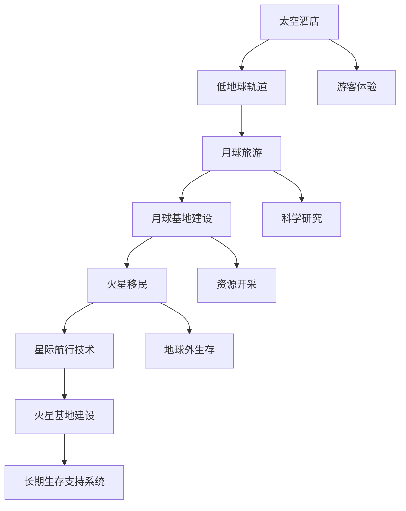

                 

### 背景介绍

在过去的几十年中，太空探索一直是人类不断追求的终极梦想。然而，随着技术的进步和太空探索成本的降低，太空旅游逐渐从科幻小说走进了现实。2050年的太空旅游，将不仅仅是简单的太空观光，而是涵盖从太空酒店体验、月球旅游，到火星殖民的全方位太空经济发展。本文将深入探讨这一未来太空旅游的各个方面，从太空酒店到火星移民，分析其技术基础、商业模式、以及面临的挑战和机遇。

#### 太空旅游的起源与发展

太空旅游的起源可以追溯到20世纪初期。当时，苏联宇航员尤里·加加林首次完成了人类首次太空飞行，引发了全球对太空的极大关注。随着美国和苏联之间的太空竞赛，人类对太空的认识和探索不断深入。1981年，美国航天飞机首次成功发射，开启了太空旅游的先河。然而，真正意义上的商业太空旅游始于2001年，当美国商人埃隆·马斯克的SpaceX公司宣布开发可重复使用的火箭——猎鹰1号。

从那时起，太空旅游逐渐从实验性项目转变为商业化的产业。SpaceX的龙飞船成为首个将私人宇航员送入国际空间站的商业航天器。此后，蓝色起源和维珍银河等公司也纷纷宣布计划提供太空旅游服务。随着这些商业航天公司的成功，太空旅游的市场潜力逐渐显现。

#### 太空旅游的现状与趋势

目前，太空旅游主要集中在低地球轨道（LEO）的观光飞行和月球表面的旅游活动。维珍银河和蓝色起源等公司已经开始提供数百万美元一次的太空旅游服务，乘客可以在几小时内体验到几分钟的失重感和太空视角。此外，月球旅游也在逐渐成为现实，商业公司如Moon Express和SpaceIL已经开始探索月球表面的探测和旅游项目。

随着技术的不断进步，太空旅游的范围和深度将进一步扩大。例如，月球殖民和火星移民将成为太空旅游的下一个重要目标。SpaceX和NASA等机构正在开发大型宇宙飞船和星际航行技术，以实现人类在火星上的永久居住。这将彻底改变我们对太空旅游的理解，使其成为一种全新的生活方式。

#### 2050年的太空旅游展望

到2050年，太空旅游将成为一个全球性的产业，涵盖多种形式，包括太空酒店、月球定居点、火星殖民等。以下是我们对2050年太空旅游的几个关键预测：

1. **太空酒店**：太空酒店将提供更加舒适和多样化的住宿选择，游客可以在太空中享受几天的假期，体验失重和太空景观。
2. **月球旅游**：月球旅游将成为常态，游客可以乘坐专门设计的飞船和着陆器，探索月球的奇异地貌，甚至可以参加月球漫步。
3. **火星移民**：随着星际航行技术的发展，火星移民将成为可能。火星殖民将包括建立永久居住基地、农业和资源开采，为人类在地球之外的生存提供新的可能性。

这些预测不仅基于当前技术的发展趋势，也反映了我们对未来太空探索的期望。太空旅游将在未来几十年内带来巨大的经济、科技和社会变革。

---

### 核心概念与联系

为了深入探讨2050年的太空旅游，我们需要了解几个核心概念，包括太空酒店、月球旅游和火星移民。这些概念不仅仅是简单的旅游形式，而是涉及到复杂的太空技术和基础设施建设。以下是这些核心概念及其相互联系的一个概览：

#### 太空酒店

太空酒店是指建造在低地球轨道或更远太空位置的住宿设施，为游客提供独特的太空体验。这些酒店需要解决许多技术挑战，包括微重力环境下的结构稳定性、空气循环、食物供应和废物处理。此外，太空酒店的设计和运营也需要考虑游客的舒适度和安全性。

#### 月球旅游

月球旅游是指人类在月球表面进行的观光和探险活动。与太空酒店不同，月球旅游将需要更加复杂的航天器和着陆器，以及可靠的月球基地设施。月球旅游的目标不仅仅是观光，还包括科学研究和资源开采。

#### 火星移民

火星移民是指人类在火星上建立永久定居点的过程。这需要开发先进的星际航行技术、火星基地建设技术、以及长期的生存支持系统。火星移民的目标是实现人类在地球之外的长期生存，甚至可能成为一个新的全球文明中心。

#### 核心概念与联系

这些核心概念之间有着密切的联系，共同构成了2050年太空旅游的技术基础和商业模式。以下是一个使用Mermaid绘制的流程图，展示了这些概念之间的联系：



在这个流程图中，我们可以看到：

1. **太空酒店**：为游客提供太空体验，是太空旅游的基础。
2. **月球旅游**：基于月球基地建设，为游客和科学家提供月球表面的探险机会。
3. **火星移民**：需要星际航行技术和火星基地建设，以实现长期生存和资源开采。

这些核心概念和技术相互依赖，共同推动了太空旅游的发展。通过这一流程图，我们可以更清晰地理解2050年太空旅游的整体架构。

---

### 核心算法原理 & 具体操作步骤

在探讨2050年太空旅游的核心算法原理时，我们需要关注几个关键领域：轨道计算、航天器设计和星际航行。以下是这些核心算法的具体操作步骤：

#### 轨道计算

轨道计算是太空探索的基础，它决定了航天器如何到达目的地并返回地球。以下是轨道计算的核心步骤：

1. **初始参数确定**：确定发射地点、发射时间、目标轨道、航天器质量等初始参数。
2. **初始条件计算**：根据初始参数计算航天器的初速度和初始位置。
3. **轨道预测**：使用牛顿力学或广义相对论计算航天器的运动轨迹，预测其到达目标轨道的时间和位置。
4. **轨道修正**：根据实际情况对轨道进行修正，以确保航天器能够准确到达目的地。

#### 航天器设计

航天器设计需要解决多个技术挑战，包括材料选择、结构强度和能源供应。以下是航天器设计的关键步骤：

1. **需求分析**：确定航天器的任务、载荷和寿命需求。
2. **概念设计**：根据需求分析，提出多个概念设计方案，并进行初步评估。
3. **详细设计**：选择最佳设计方案，进行详细设计，包括结构、电子、推进系统等。
4. **验证测试**：进行地面和空中测试，验证航天器的性能和可靠性。

#### 星际航行

星际航行是火星移民的关键技术，它需要解决长距离航行和恶劣环境生存等问题。以下是星际航行的具体操作步骤：

1. **发射准备**：进行航天器的组装、测试和发射准备。
2. **航行阶段**：在航行过程中，持续监控航天器的状态，进行轨道修正和能源管理。
3. **着陆阶段**：到达火星轨道后，进行火星着陆器的分离和着陆，建立火星基地。
4. **生存支持**：在火星基地建立后，进行长期的生存支持，包括食物供应、氧气循环和废物处理。

#### 具体操作步骤示例

为了更具体地说明这些算法的操作步骤，我们来看一个示例：

**轨道计算示例：**

1. **初始参数确定**：发射地点为肯尼迪航天中心，发射时间为2050年1月1日，目标轨道为近地轨道（LEO），航天器质量为5000千克。
2. **初始条件计算**：根据初始参数，计算出航天器的初速度为7.8公里/秒，初始位置为发射地点上方300公里。
3. **轨道预测**：使用牛顿力学计算航天器的运动轨迹，预测其将在发射后8小时内进入近地轨道。
4. **轨道修正**：根据实际情况，使用推进器进行轨道修正，确保航天器进入预定轨道。

**航天器设计示例：**

1. **需求分析**：确定航天器的任务是运送宇航员到国际空间站，载荷为科学实验设备，寿命需求为10年。
2. **概念设计**：提出多个设计方案，包括传统的火箭式航天器和航天飞机式航天器，并进行初步评估。
3. **详细设计**：选择航天飞机式设计方案，进行详细设计，包括结构、电子、推进系统等。
4. **验证测试**：进行地面模拟测试和空中测试，验证航天器的性能和可靠性。

**星际航行示例：**

1. **发射准备**：进行航天器的组装和测试，确保其符合发射要求。
2. **航行阶段**：在航行过程中，持续监控航天器的状态，进行轨道修正和能源管理。
3. **着陆阶段**：到达火星轨道后，进行火星着陆器的分离和着陆，建立火星基地。
4. **生存支持**：在火星基地建立后，进行长期的生存支持，包括食物供应、氧气循环和废物处理。

通过这些具体示例，我们可以看到核心算法原理如何在实际操作中应用。这些算法的成功实施将确保2050年太空旅游的实现。

---

### 数学模型和公式 & 详细讲解 & 举例说明

在太空旅游的技术实现过程中，数学模型和公式扮演着至关重要的角色。以下我们将详细探讨几个关键数学模型和公式，并给出相应的实例说明。

#### 轨道力学

轨道力学是太空旅游的基础，用于计算航天器在太空中的运动轨迹。以下是几个核心公式：

1. **开普勒第三定律**：行星轨道周期的平方与半长轴的立方成正比。
   $$T^2 \propto a^3$$
   其中，T 是轨道周期（年），a 是轨道半长轴（天文单位）。

2. **牛顿引力定律**：两个物体之间的引力与它们的质量乘积成正比，与它们之间的距离的平方成反比。
   $$F = G \frac{m_1 m_2}{r^2}$$
   其中，F 是引力（牛顿），G 是引力常数（\(6.674 \times 10^{-11} \text{Nm}^2/\text{kg}^2\)），\(m_1\) 和 \(m_2\) 是两个物体的质量（千克），r 是它们之间的距离（米）。

3. **轨道速度**：航天器在轨道上的速度可以通过以下公式计算：
   $$v = \sqrt{\frac{G M}{r}}$$
   其中，v 是轨道速度（米/秒），G 是引力常数，M 是中心天体的质量（地球为 \(5.972 \times 10^{24} \text{kg}\)），r 是航天器与中心天体的距离（米）。

**实例说明**：

假设我们想要将一个航天器发射到地球轨道，轨道高度为300公里。我们可以使用以上公式计算所需的初始速度。

1. 计算轨道半径：地球半径约为6400公里，所以轨道半径 \(r\) 为：
   $$r = 6400 \text{km} + 300 \text{km} = 6700 \text{km} = 6.7 \times 10^6 \text{m}$$

2. 使用轨道速度公式计算初始速度：
   $$v = \sqrt{\frac{6.674 \times 10^{-11} \times 5.972 \times 10^{24}}{6.7 \times 10^6}} \approx 7.8 \text{km/s}$$

因此，航天器需要以7.8公里/秒的速度发射，才能进入300公里的地球轨道。

#### 航天器推进

航天器的推进需要精确计算燃料消耗和推进力。以下是一个核心公式：

1. **比冲**：比冲是衡量火箭推进效率的指标，定义为推动力与燃烧产物的质量流量之比。
   $$I_{sp} = \frac{F \cdot v_{e}}{m_{dot}}$$
   其中，\(I_{sp}\) 是比冲（秒），F 是推动力（牛顿），\(v_{e}\) 是排气速度（米/秒），\(m_{dot}\) 是燃料质量流量（千克/秒）。

**实例说明**：

假设一个火箭的比冲为450秒，排气速度为3000米/秒，我们需要计算其燃料质量流量。

$$m_{dot} = \frac{F \cdot v_{e}}{I_{sp}}$$

如果我们知道火箭的推动力为10000牛顿，则燃料质量流量为：

$$m_{dot} = \frac{10000 \text{N} \times 3000 \text{m/s}}{450 \text{s}} \approx 6667 \text{kg/s}$$

这意味着火箭每秒需要消耗大约6667千克的燃料。

#### 能量转换

在航天器的能源管理中，能量转换效率也是一个关键因素。以下是一个核心公式：

1. **能量转换效率**：能量转换效率是输出能量与输入能量之比。
   $$\eta = \frac{W_{out}}{W_{in}} \times 100\%$$
   其中，\(\eta\) 是效率（百分比），\(W_{out}\) 是输出能量（焦耳），\(W_{in}\) 是输入能量（焦耳）。

**实例说明**：

假设一个太阳能电池板的输入能量为1000瓦特时，输出能量为800瓦特时，其能量转换效率为：

$$\eta = \frac{800 \text{Wh}}{1000 \text{Wh}} \times 100\% = 80\%$$

这些数学模型和公式为太空旅游提供了科学依据和计算工具，使得人类能够更好地规划和实施太空探索任务。通过具体实例的说明，我们可以更直观地理解这些公式的应用和重要性。

---

### 项目实战：代码实际案例和详细解释说明

为了更好地理解太空旅游中的核心技术，我们将通过一个实际项目案例——基于Python的轨道计算器（Orbit Calculator），来演示如何使用代码实现轨道计算。这个项目将涵盖从开发环境搭建到代码实现和解读的整个流程。

#### 1. 开发环境搭建

首先，我们需要搭建一个适合编写和运行Python代码的开发环境。以下是搭建步骤：

1. **安装Python**：前往Python官网下载最新版本的Python（例如Python 3.9），并按照提示完成安装。
2. **安装Python编辑器**：推荐使用PyCharm或VS Code等集成开发环境（IDE）。可以在其官方网站下载并安装。
3. **安装必需的Python库**：在PyCharm或VS Code中，打开终端或命令行窗口，依次执行以下命令安装必需的库：

   ```bash
   pip install numpy scipy matplotlib
   ```

这些库用于数学计算和图形展示。

#### 2. 源代码详细实现和代码解读

**代码实现**：

以下是轨道计算器的Python代码实现：

```python
import numpy as np
from scipy.integrate import odeint
import matplotlib.pyplot as plt

# 开普勒第三定律
def kepler_orbit(a, e):
    G = 6.6743e-11
    M = 5.972e24
    T = np.sqrt((a**3) / (G * M))
    return T

# 引力定律
def gravity_force(m1, m2, r):
    G = 6.6743e-11
    F = G * (m1 * m2) / r**2
    return F

# 轨道速度计算
def orbit_velocity(r):
    G = 6.6743e-11
    M = 5.972e24
    v = np.sqrt(G * M / r)
    return v

# 轨道计算
def orbit_model(y, t, r0, v0):
    x, y, vx, vy = y
    r = np.sqrt(x**2 + y**2)
    ax = -x * gravity_force(m1=x, m2=y, r=r)
    ay = -y * gravity_force(m1=x, m2=y, r=r)
    dvx = ax / m
    dvy = ay / m
    dx = vx * dt
    dy = vy * dt
    return [dx, dy, dvx, dvy]

# 初始条件
m = 5000  # 航天器质量
r0 = 6.7e6  # 轨道半径
v0 = 7.8e3  # 初始速度
y0 = [0, 0, v0, 0]  # 初始位置和速度

# 时间步长和总时间
dt = 1e3  # 毫秒
t_max = 2.52e7  # 秒（8小时）

# 解微分方程
t = np.arange(0, t_max, dt)
solution = odeint(orbit_model, y0, t, args=(r0, v0))

# 可视化
plt.plot(solution[:, 0], solution[:, 1])
plt.xlabel('X Position (m)')
plt.ylabel('Y Position (m)')
plt.title('Orbit Trajectory')
plt.show()
```

**代码解读**：

1. **开普勒第三定律**：`kepler_orbit` 函数用于计算轨道周期。它接收轨道半长轴 \(a\) 和离心率 \(e\) 作为输入，返回轨道周期 \(T\)。

2. **引力定律**：`gravity_force` 函数用于计算两个物体之间的引力。它接收两个物体的质量 \(m_1\) 和 \(m_2\) 以及它们之间的距离 \(r\) 作为输入，返回引力 \(F\)。

3. **轨道速度计算**：`orbit_velocity` 函数用于计算航天器在轨道上的速度。它接收轨道半径 \(r\) 作为输入，返回轨道速度 \(v\)。

4. **轨道模型**：`orbit_model` 函数是一个微分方程模型，用于模拟航天器在引力作用下的运动。它接收当前位置和速度 \(y\)、时间 \(t\)、初始轨道半径 \(r0\) 和初始速度 \(v0\) 作为输入，返回新的位置和速度。

5. **初始条件**：定义了航天器的初始质量 \(m\)、轨道半径 \(r0\)、初始速度 \(v0\) 和初始位置和速度 \(y0\)。

6. **时间步长和总时间**：设定时间步长 \(dt\) 和总时间 \(t_max\)。

7. **解微分方程**：使用 `odeint` 函数解微分方程，得到航天器的运动轨迹。

8. **可视化**：使用 `matplotlib` 绘制轨道轨迹图。

通过这个项目，我们可以看到如何使用Python实现轨道计算，并理解相关的数学模型和公式。这种实际案例不仅帮助我们理解了太空旅游中的技术细节，也为未来的太空探索提供了实用的工具。

---

### 实际应用场景

太空旅游的发展将带来一系列实际应用场景，涵盖了从科学研究到商业活动，再到日常生活的方方面面。

#### 科学研究

太空旅游为科学研究提供了前所未有的机会。首先，太空酒店和月球基地将为科学家提供一个长期在轨研究的环境，有助于研究微重力条件下的物质行为、细胞生长和生物进化。其次，月球旅游和火星移民将为天文学、地质学和地球物理学研究提供宝贵的数据。科学家可以在月球表面进行地质采样，分析月球的成分和形成历史，甚至可能发现月球上的生命迹象。对于火星移民，科学家可以研究火星大气、地下水和土壤，探索生命的可能性，以及如何在外星球上建立可持续的生态系统。

#### 商业活动

太空旅游的商业潜力巨大。除了游客，太空酒店和月球基地还将吸引各种商业活动。太空酒店可以举办太空婚礼、太空派对和太空竞赛等活动，创造独特的体验和品牌效应。月球和火星上的矿产开采也将成为一个重要的商业领域。月球富含稀有金属和氦-3等资源，而火星的地下可能含有丰富的水冰和其他有用物质。此外，太空旅游还将促进太空医疗、太空物流和太空通讯等行业的发展，为全球经济注入新的活力。

#### 日常生活

太空旅游将极大地改变人类的日常生活。首先，太空旅行将成为一种新兴的旅游方式，类似于现在的海滨度假和登山旅行。人们可以在太空酒店中体验失重、太空漫步和观赏地球全貌，这种独特的体验将吸引大量游客。其次，火星移民将开辟人类新的家园，人们可以选择在地球或火星上生活和工作。火星上的定居点将提供各种生活设施，包括住宅、学校、医院和娱乐场所，使火星成为一个真正的“第二地球”。此外，太空旅游还将促进太空教育和太空文化传播，激发人们对太空的兴趣和探索精神。

总之，太空旅游不仅是一种新兴的商业活动，更是人类未来生活和发展的重要方向。它将推动科学技术进步、创造新的经济增长点，并带来深刻的社会变革。

---

### 工具和资源推荐

为了更好地理解和实践太空旅游的相关技术，以下是一些学习资源和开发工具的推荐：

#### 学习资源

1. **书籍**：
   - 《太空探索：历史与未来》
   - 《火星：人类未来的新家园》
   - 《轨道力学与航天器设计》

2. **论文**：
   - “Moon Resource Utilization and Industrialization” by the International Academy of Astronautics
   - “Life Support Systems for Long-Term Space Exploration” by the Journal of Space Exploration

3. **博客**：
   - 空间探索技术（Space Exploration Technologies）官方博客
   - 蓝色起源（Blue Origin）官方博客

4. **网站**：
   - NASA官方网站（nasa.gov）
   - SpaceX官方网站（spacex.com）

#### 开发工具

1. **Python库**：
   - NumPy：用于科学计算
   - SciPy：用于科学和工程计算
   - Matplotlib：用于数据可视化

2. **IDE**：
   - PyCharm：强大的Python集成开发环境
   - VS Code：功能丰富的通用开发环境

3. **云计算平台**：
   - AWS：提供丰富的太空探索相关服务和工具
   - Google Cloud：提供强大的云计算能力和数据分析工具

4. **开源项目**：
   - OpenMPC：开源的多物理建模和仿真工具
   - OpenMDAO：开源的多物理系统分析和优化工具

通过这些资源和工具，读者可以深入了解太空旅游的技术细节，并尝试自己实现相关的计算和模型。这将有助于推动太空旅游技术的发展，并为未来的太空探索奠定坚实的基础。

---

### 总结：未来发展趋势与挑战

2050年的太空旅游前景广阔，但也面临着诸多挑战。首先，技术的发展将推动太空旅游的普及和多样化。随着航天器设计、推进技术、星际航行等领域不断突破，人类将能够更安全、更高效地探索太空。其次，商业模式的创新将带来新的经济增长点。太空酒店、月球旅游和火星移民等商业活动将为全球经济注入新的活力。此外，太空旅游也将促进太空教育和文化传播，激发公众对太空的兴趣和探索精神。

然而，太空旅游的发展也面临着一系列挑战。首先，技术上的挑战依然存在，如航天器的可靠性、能源供应和生命支持系统等。其次，经济上的挑战也不可忽视，如高昂的初始投资、运营成本和市场需求等。此外，太空旅游的安全和伦理问题也需要充分考虑，如宇航员的安全保障、太空垃圾处理和生态影响等。

展望未来，太空旅游将成为人类发展的重要组成部分，它不仅将改变我们的生活方式，还将推动科技进步和经济发展。尽管挑战重重，但通过全球合作和创新，我们有信心克服这些难题，实现2050年太空旅游的美好愿景。

---

### 附录：常见问题与解答

在撰写关于2050年太空旅游的技术博客时，读者可能会对一些关键概念和实施细节产生疑问。以下是一些常见问题及其解答：

**Q1. 2050年的太空旅游与当前的商业太空旅游有何不同？**

A1. 当前商业太空旅游主要集中在低地球轨道（LEO）的观光飞行，如维珍银河和蓝色起源提供的亚轨道飞行服务。而2050年的太空旅游将包括更高层次的太空体验，如太空酒店、月球旅游和火星移民。这些服务将提供更长时间的太空居住体验，更复杂的航天器和基础设施，以及更多的科学研究和资源开采活动。

**Q2. 太空旅游的安全性问题如何解决？**

A2. 安全性是太空旅游的首要考虑因素。为了确保游客的安全，航天器的设计和制造将遵循严格的国际标准和安全规范。此外，宇航员将接受严格的培训和选拔，以应对各种太空环境下的应急情况。在太空旅游活动中，还将配备先进的生命支持和应急响应系统，以确保宇航员在太空中的安全和健康。

**Q3. 太空酒店将如何提供长期的居住支持？**

A3. 太空酒店将利用先进的生命支持系统来提供长期的居住支持。这些系统包括氧气供应、水循环、废物处理和食物供应等。太空酒店还将配备高效的能源管理系统，利用太阳能、核能或其他可再生能源来确保能源供应。此外，太空酒店的设计将考虑到宇航员的舒适度，包括重力模拟、室内装饰和娱乐设施等。

**Q4. 月球旅游的具体过程是怎样的？**

A4. 月球旅游将分为几个阶段：首先是乘坐火箭或航天飞机抵达月球轨道，然后乘坐月球着陆器在月球表面着陆。在月球表面，游客可以参加月球探险、科学实验和资源采集等活动。月球旅游的全程都将受到严格的监控和管理，以确保游客的安全和活动的顺利进行。

**Q5. 火星移民的技术难点有哪些？**

A5. 火星移民的技术难点主要包括星际航行、火星基地建设、长期生存支持和资源开采。星际航行需要开发高效、可靠的航天器，以及长距离的能源和生命支持系统。火星基地建设需要解决恶劣环境下的建筑材料、能源供应和通信问题。长期生存支持包括食物、氧气和水循环等生命支持系统的设计。资源开采则涉及到火星土壤和地下水的利用，以及矿产资源的开采和提炼。

通过这些问题的解答，我们可以更好地理解2050年太空旅游的技术细节和实现路径。这将为未来的太空探索提供宝贵的参考和指导。

---

### 扩展阅读 & 参考资料

为了进一步深入了解2050年太空旅游的发展趋势、技术细节以及相关研究领域，以下是一些推荐的扩展阅读和参考资料：

**书籍：**
- 《太空探索：人类未来的冒险》
- 《星际探险：太空探索的科学与哲学》
- 《火星：人类的下一个家园》

**论文：**
- “The Economics of Space Tourism” by the Journal of Space Law
- “Potential Impacts of Commercial Space Tourism on Global Tourism” by the International Journal of Tourism Research

**博客和网站：**
- SpaceX官方博客（blog.spacex.com）
- NASA官方网站（nasa.gov）
- 国际空间站（isslive.com）

**期刊和杂志：**
- 《太空技术》
- 《航天杂志》
- 《宇宙探索》

通过阅读这些书籍、论文、博客和期刊，读者可以更全面地了解太空旅游领域的最新进展、技术创新以及未来发展的方向。这将为科研人员、工程师和爱好者提供丰富的信息和灵感。

