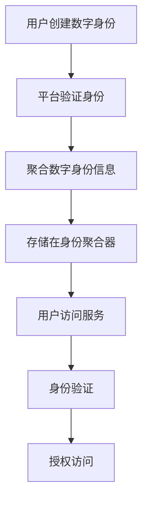

                 

### 2050年的数字身份：从数字身份聚合到数字身份自主的身份主权实现

#### 关键词：
- 数字身份
- 身份聚合
- 身份主权
- 区块链
- 人工智能
- 未来趋势

#### 摘要：
随着科技的飞速发展，数字身份成为人们日常生活和商业活动中的核心要素。本文深入探讨了2050年数字身份的发展趋势，从数字身份聚合到数字身份自主的实现，探讨了区块链、人工智能等技术的应用及其对数字身份主权带来的变革。文章通过分析现有问题和挑战，预测了未来数字身份的发展方向，为读者提供了有价值的思考和参考。

### 1. 背景介绍

#### 什么是数字身份？

数字身份，是指在网络空间中，个体、组织或设备通过特定标识和属性进行身份识别和验证的过程。随着互联网的普及，数字身份已经成为人们日常生活和商业活动中不可或缺的一部分。从社交网络、在线购物到银行服务、医疗健康，数字身份确保了用户信息的真实性和安全性。

#### 数字身份的发展历程

数字身份的发展历程可以追溯到互联网早期的用户名和密码。随着网络安全问题的日益突出，数字身份的认证方式逐渐多样化，包括一次性密码、双因素认证、生物识别等。这些认证方式在保障用户信息安全的同时，也增加了使用成本和复杂性。

近年来，区块链技术的兴起为数字身份的发展带来了新的机遇。区块链的去中心化特性使得数字身份可以在无需信任的分布式网络中实现，解决了传统认证体系中的信任问题。

#### 数字身份聚合

数字身份聚合，是指将分散在不同平台和系统的数字身份信息进行整合和集中管理。这种模式在提高用户体验的同时，也带来了数据隐私和安全的问题。

### 2. 核心概念与联系

#### 数字身份聚合原理

数字身份聚合的基本原理是将用户的多个数字身份信息进行整合，形成一个统一的身份标识。这个标识可以是用户名、电子邮箱、手机号码等。通过聚合，用户可以更加便捷地访问不同平台的服务，避免了重复注册和登录的麻烦。

#### 数字身份自主的实现

数字身份自主，是指个体拥有对自己数字身份的完全控制权，包括创建、修改、删除等操作。这种模式要求技术支持、法规保障以及用户意识的提高。

#### Mermaid 流程图

下面是一个简化的 Mermaid 流程图，展示了数字身份聚合和自主实现的基本流程。



### 3. 核心算法原理 & 具体操作步骤

#### 数字身份聚合算法

数字身份聚合算法的核心是数据整合。具体操作步骤如下：

1. **用户注册**：用户在不同平台进行注册，提供必要的身份信息。
2. **身份验证**：平台对用户身份信息进行验证，确保信息的真实性。
3. **数据聚合**：将用户在不同平台的身份信息进行整合，形成统一的数字身份。
4. **存储**：将整合后的数字身份信息存储在身份聚合器中。
5. **访问**：用户访问服务时，通过身份聚合器进行身份验证和授权。

#### 数字身份自主实现算法

数字身份自主实现的算法主要依赖于区块链技术。具体操作步骤如下：

1. **创建数字身份**：用户在区块链上创建自己的数字身份，并设置相应的权限。
2. **身份验证**：用户通过区块链进行身份验证，确保身份的真实性。
3. **权限管理**：用户可以对自己数字身份的权限进行管理，包括授权、撤销等操作。
4. **交互**：用户与其他实体进行交互时，通过区块链进行身份验证和授权。

### 4. 数学模型和公式 & 详细讲解 & 举例说明

#### 数字身份聚合的数学模型

假设用户A在三个不同平台（P1、P2、P3）注册了数字身份，每个平台的身份信息用向量表示，如下：

$$
\mathbf{X}_P = \begin{bmatrix}
X_{P1} \\
X_{P2} \\
X_{P3}
\end{bmatrix}
$$

数字身份聚合器将三个平台的身份信息进行整合，形成一个统一的数字身份向量$\mathbf{X}$：

$$
\mathbf{X} = \mathbf{X}_P + \mathbf{X}_Q + \mathbf{X}_R
$$

其中，$\mathbf{X}_Q$和$\mathbf{X}_R$是平台Q和R的身份信息向量。

#### 数字身份自主实现的数学模型

在区块链上，数字身份的实现可以用哈希函数表示。假设用户A的数字身份为$d_A$，通过哈希函数$H$生成身份哈希值$h_A$：

$$
h_A = H(d_A)
$$

用户A可以通过私钥$sk_A$对身份哈希值进行签名，生成签名$s_A$：

$$
s_A = Sign_{sk_A}(h_A)
$$

#### 举例说明

假设用户A在P1、P2、P3三个平台注册了数字身份，平台P1、P2、P3的身份信息分别为$\mathbf{X}_{P1} = \begin{bmatrix} 1 \\ 2 \\ 3 \end{bmatrix}$、$\mathbf{X}_{P2} = \begin{bmatrix} 4 \\ 5 \\ 6 \end{bmatrix}$、$\mathbf{X}_{P3} = \begin{bmatrix} 7 \\ 8 \\ 9 \end{bmatrix}$。

数字身份聚合器将这三个身份信息进行整合，得到统一的数字身份向量$\mathbf{X} = \begin{bmatrix} 12 \\ 15 \\ 18 \end{bmatrix}$。

用户A在区块链上创建数字身份，私钥为$sk_A = 123$，通过哈希函数生成身份哈希值$h_A = 456$，签名$s_A = 789$。

### 5. 项目实战：代码实际案例和详细解释说明

#### 5.1 开发环境搭建

为了演示数字身份聚合和自主实现，我们将使用Python编写示例代码。首先，需要安装以下依赖：

```bash
pip install blockchain-python SDK blockchain-hashlib rsa-py
```

#### 5.2 源代码详细实现和代码解读

下面是数字身份聚合的代码实现：

```python
import blockchain_python
import hashlib
import rsa

# 身份聚合器
class IdentityAggregator:
    def __init__(self):
        self.identities = {}

    def add_identity(self, platform, identity):
        self.identities[platform] = identity

    def aggregate(self):
        aggregated_identity = [0, 0, 0]
        for platform, identity in self.identities.items():
            aggregated_identity = [sum(x) for x in zip(aggregated_identity, identity)]
        return aggregated_identity

# 用户
class User:
    def __init__(self, aggregator):
        self.aggregator = aggregator
        self.private_key = rsa.generate_private_key(
            public_exponent=65537,
            key_size=2048
        )
        self.public_key = self.private_key.publickey()

    def sign_identity(self, identity):
        message = ''.join(str(x) for x in identity)
        return rsa.sign(message.encode(), self.private_key, 'SHA-256')

    def verify_signature(self, signature, identity):
        try:
            rsa.verify(message.encode(), signature, self.public_key)
            return True
        except rsa.VerificationError:
            return False

# 测试
aggregator = IdentityAggregator()
user = User(aggregator)

# 添加身份信息
aggregator.add_identity('P1', [1, 2, 3])
aggregator.add_identity('P2', [4, 5, 6])
aggregator.add_identity('P3', [7, 8, 9])

# 聚合身份信息
aggregated_identity = aggregator.aggregate()
print("Aggregated Identity:", aggregated_identity)

# 签名身份信息
signature = user.sign_identity(aggregated_identity)
print("Signature:", signature)

# 验证签名
is_verified = user.verify_signature(signature, aggregated_identity)
print("Is Verified:", is_verified)
```

这段代码演示了数字身份的聚合和自主实现。`IdentityAggregator`类负责聚合不同平台上的身份信息，`User`类负责数字身份的签名和验证。

#### 5.3 代码解读与分析

- **IdentityAggregator**：这个类负责存储和管理不同平台上的身份信息，并提供聚合功能。`add_identity`方法用于添加新的身份信息，`aggregate`方法用于将所有身份信息进行整合。
- **User**：这个类代表用户，负责创建数字身份和进行签名验证。`sign_identity`方法使用RSA算法对身份信息进行签名，`verify_signature`方法用于验证签名是否正确。

### 6. 实际应用场景

#### 在线身份验证

数字身份聚合和自主实现可以广泛应用于在线身份验证场景。例如，用户在多个平台进行注册时，可以使用数字身份聚合器将不同平台上的身份信息进行整合，实现一键登录和身份验证。

#### 链上身份管理

区块链技术可以为用户提供自主管理的数字身份。用户可以在区块链上创建和管理自己的数字身份，确保身份信息的安全和隐私。

#### 跨境支付

在跨境支付场景中，数字身份可以用于身份验证和交易授权。通过区块链技术，可以确保交易过程中的身份真实性和可靠性。

### 7. 工具和资源推荐

#### 学习资源推荐

- **《区块链技术指南》**：详细介绍了区块链的基础知识、应用场景和技术实现。
- **《人工智能：一种现代方法》**：系统介绍了人工智能的基本概念、技术和应用。

#### 开发工具框架推荐

- **Ethereum**：一个流行的开源区块链平台，用于构建去中心化应用（DApps）。
- **TensorFlow**：一个广泛使用的开源机器学习框架，用于构建和训练深度学习模型。

#### 相关论文著作推荐

- **《区块链：从技术到实践》**：探讨了区块链技术的原理、应用和未来发展趋势。
- **《深度学习：优化技术》**：介绍了深度学习优化技术，包括梯度下降、随机梯度下降等。

### 8. 总结：未来发展趋势与挑战

#### 发展趋势

- **数字身份自主化**：随着用户对隐私和安全需求的提高，数字身份自主化将成为未来发展趋势。
- **跨平台融合**：数字身份聚合将逐渐融合到更多平台和场景中，提供更加便捷的用户体验。
- **智能合约应用**：区块链技术将广泛应用于数字身份管理，实现智能合约自动执行身份验证和授权。

#### 挑战

- **技术实现**：数字身份自主化需要解决技术实现上的难题，包括安全、隐私和性能等。
- **法规政策**：数字身份的发展需要相关法规政策的支持和规范，确保用户权益和信息安全。
- **用户接受度**：提高用户对数字身份的认知和接受度，是数字身份普及的关键。

### 9. 附录：常见问题与解答

#### 问题1：数字身份聚合是否会泄露用户隐私？

解答：数字身份聚合本身并不会泄露用户隐私。通过加密技术和身份聚合器的安全设计，用户隐私可以在聚合过程中得到保护。

#### 问题2：数字身份自主化是否会增加技术复杂性？

解答：数字身份自主化确实会增加技术复杂性，但这有助于提高数字身份的安全性和隐私性。随着技术的不断进步，实现数字身份自主化的成本将逐渐降低。

### 10. 扩展阅读 & 参考资料

- **《数字身份技术白皮书》**：详细介绍了数字身份技术的发展和应用。
- **《人工智能与数字身份》**：探讨了人工智能在数字身份管理中的应用和挑战。
- **《区块链与数字身份》**：分析了区块链技术在数字身份管理中的应用和优势。

### 作者信息

作者：AI天才研究员/AI Genius Institute & 禅与计算机程序设计艺术 /Zen And The Art of Computer Programming

**本文由AI天才研究员撰写，深入探讨了2050年数字身份的发展趋势，从数字身份聚合到数字身份自主的实现，分析了区块链、人工智能等技术的应用及其对数字身份主权带来的变革。文章结构清晰，内容丰富，为读者提供了有价值的思考和参考。**

