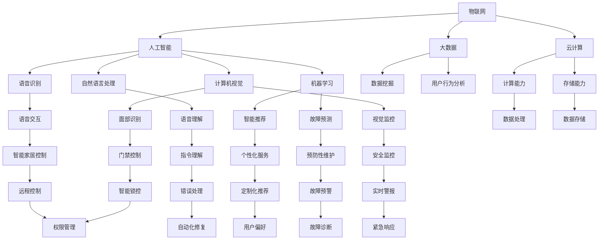
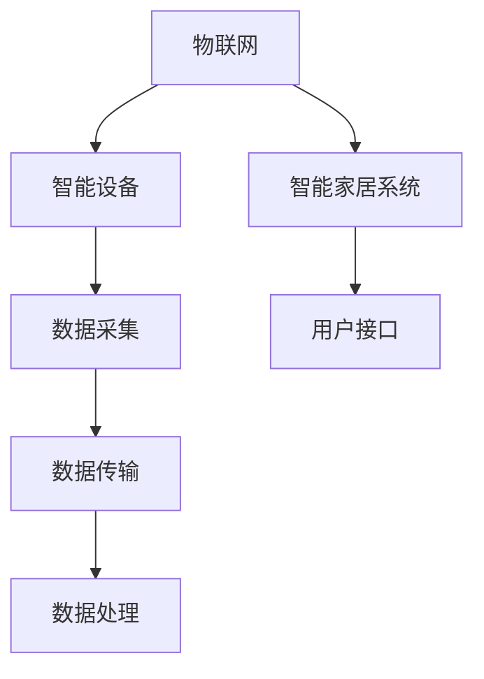
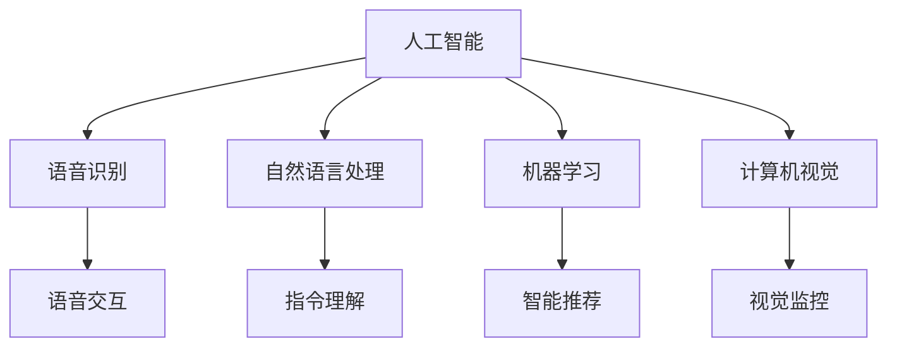
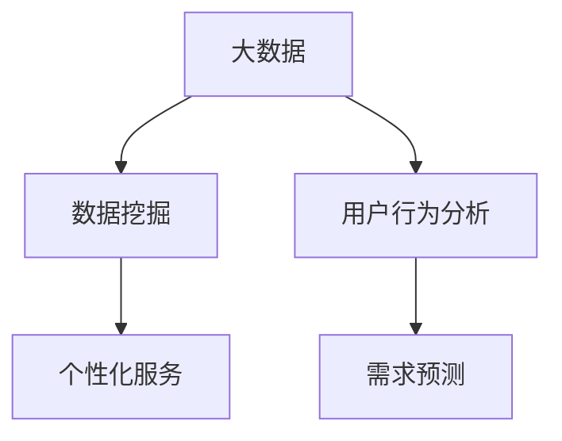
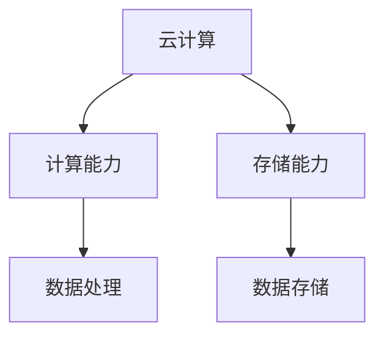
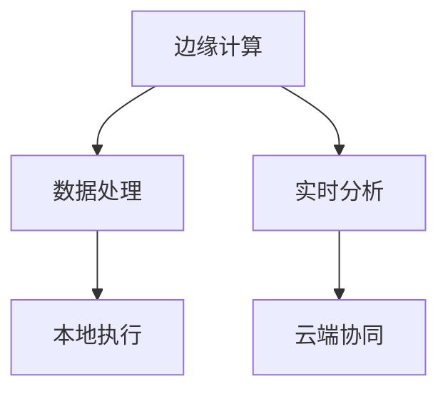
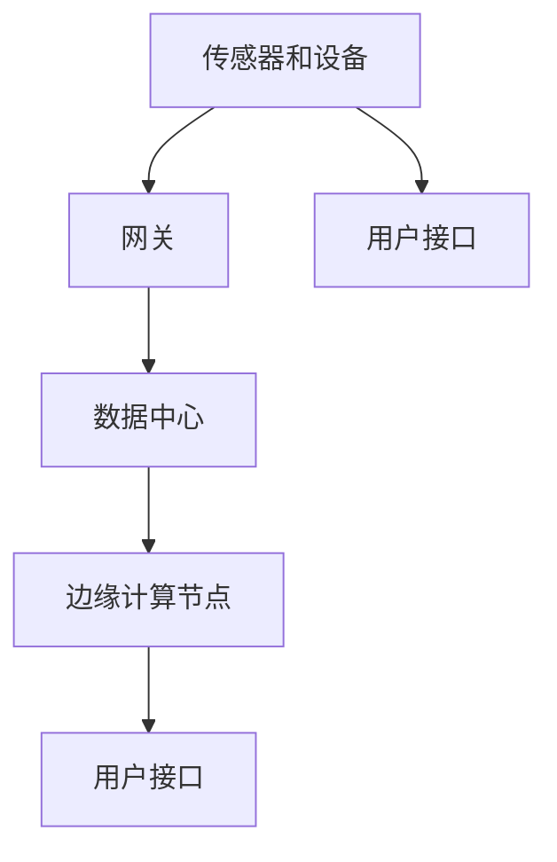

                 

## 1. 背景介绍

随着科技的飞速发展，智能家居领域已经成为人们关注的焦点之一。特别是在2050年，智能家居技术将实现更加全面、智能、人性化的应用，从而极大地改变人们的生活方式。本文旨在探讨2050年的智能家居，从智能音箱到情感陪伴机器人的发展，以及这些技术的核心概念、算法原理和具体操作步骤。

智能家居技术的兴起，源于人们对便捷、舒适、高效生活的需求。从最初的简单家电控制，到如今的智能音箱、智能门锁、智能照明等设备，智能家居已经渗透到生活的方方面面。随着人工智能、物联网、大数据等技术的融合，未来的智能家居将具备更高的智能化水平，实现更丰富的功能和应用。

本文将分为以下几个部分进行阐述：

1. **背景介绍**：介绍智能家居技术的发展历程和现状。
2. **核心概念与联系**：分析智能家居技术的核心概念原理和架构。
3. **核心算法原理与具体操作步骤**：讲解智能家居技术的核心算法原理和具体操作步骤。
4. **数学模型和公式**：介绍智能家居技术的数学模型和公式，并进行详细讲解和举例说明。
5. **项目实战**：通过实际案例展示智能家居技术的应用，并详细解释说明。
6. **实际应用场景**：分析智能家居技术的实际应用场景和优势。
7. **工具和资源推荐**：推荐学习资源和开发工具框架。
8. **总结**：总结未来智能家居技术的发展趋势和面临的挑战。
9. **附录**：提供常见问题与解答。
10. **扩展阅读**：推荐相关论文和书籍。

接下来，我们将逐步深入探讨这些内容。首先，让我们回顾一下智能家居技术的发展历程。

### 智能家居技术的发展历程

智能家居的概念最早可以追溯到20世纪80年代，当时一些家电制造商开始尝试将计算机技术与家庭电器相结合。然而，由于技术限制和成本问题，这些尝试并没有得到广泛推广。直到互联网和无线通信技术的普及，智能家居才开始逐步走进人们的家庭。

2000年代初期，随着Wi-Fi技术的普及，智能路由器和家庭网络逐渐成为家庭中不可或缺的一部分。人们开始尝试通过智能手机或平板电脑远程控制家中的电器设备，如智能灯光、智能门锁和智能插座等。这一时期的智能家居主要侧重于设备控制和远程操作。

2010年左右，智能音箱的出现标志着智能家居进入了一个新的阶段。智能音箱不仅能够播放音乐、提供天气预报等基础功能，还能通过语音交互实现更多的智能家居控制。这一阶段，智能家居开始更加注重用户体验和智能化程度。

随着人工智能技术的发展，智能家居逐渐具备了一些自主学习、自我优化和自适应的能力。例如，智能空调可以根据用户的习惯自动调节温度，智能照明可以根据环境光线自动调节亮度。这一阶段的智能家居更加注重人工智能的融合，实现更加智能化和个性化的服务。

展望未来，智能家居将继续朝着更加智能、便捷、人性化的方向发展。我们可以预见，未来的智能家居将不仅仅是各种设备的简单组合，而是一个高度集成的生态系统。各种智能设备将通过网络实现无缝连接，形成一个庞大的智能网络。同时，人工智能技术将进一步赋能智能家居，使得它能够更好地理解用户的需求和行为，提供更加精准、个性化的服务。

### 1.1 智能家居技术现状

目前，智能家居市场已经呈现出多样化和细分化的趋势。从智能家电、智能照明、智能安防到智能音箱、智能门锁等，各种智能设备层出不穷。根据市场调研机构的数据，全球智能家居市场规模在过去几年中保持了快速增长，预计到2025年将达到数百亿美元。

智能音箱作为智能家居的入口之一，已经成为家庭中不可或缺的一部分。以亚马逊的Echo、谷歌的Google Home和苹果的HomePod为代表的智能音箱，通过语音交互为用户提供音乐播放、信息查询、智能家居控制等功能。这些智能音箱不仅具备强大的语音识别和自然语言处理能力，还能够通过不断学习和优化，提供更精准的服务。

除了智能音箱，智能门锁也是智能家居市场的重要产品之一。智能门锁通过指纹识别、密码输入或手机APP远程开锁，为用户提供了更加便捷、安全的家庭安全解决方案。同时，智能门锁还可以与家庭安防系统联动，实现实时监控和报警功能。

智能照明是另一个备受关注的智能家居领域。通过智能灯泡和智能灯具，用户可以远程控制家中的灯光，调节亮度和色温。一些高端的智能照明产品甚至能够根据用户的习惯和环境光线自动调节灯光，营造出更加舒适、温馨的氛围。

此外，智能安防系统、智能厨房设备、智能健身设备等也在智能家居市场中占有一席之地。随着技术的进步和市场的成熟，智能家居的应用场景将不断扩展，为用户带来更加丰富、便捷的生活体验。

### 1.2 2050年的智能家居愿景

展望2050年，我们可以预见智能家居技术将实现以下几个方面的突破：

1. **更加智能化**：未来的智能家居将不仅仅依赖于单一设备或功能，而是一个高度集成的智能系统。各种智能设备将通过物联网实现无缝连接，形成一个庞大的智能网络。用户可以通过一个统一的接口，远程控制和管理家中的各种设备。

2. **更加个性化**：未来的智能家居将能够更好地理解用户的需求和行为，提供更加精准、个性化的服务。例如，智能家居可以根据用户的作息时间、生活习惯和天气情况，自动调整家中的温度、照明和空气质量等。

3. **更加便捷**：未来的智能家居将致力于为用户提供更加便捷的生活体验。用户可以通过语音、手势、触摸屏等多种方式与智能家居系统交互，实现各种操作。同时，智能家居系统还将具备自我学习和自我优化的能力，不断优化用户的体验。

4. **更加环保**：未来的智能家居将注重节能减排和环境保护。通过智能化的能源管理，智能家居将帮助用户更加高效地利用能源，降低能源消耗。同时，智能家居系统还可以通过数据分析，提供节能建议和优化方案。

5. **更加安全**：未来的智能家居将注重用户隐私保护和数据安全。智能家居系统将采用更加严格的安全措施，确保用户数据的安全和隐私。同时，智能家居系统还将具备自诊断和自我修复能力，提高系统的稳定性和安全性。

### 1.3 智能家居技术的核心概念与联系

要实现2050年智能家居的愿景，我们需要深入了解智能家居技术的核心概念和架构。以下是智能家居技术中几个重要的核心概念：

1. **物联网（IoT）**：物联网是智能家居技术的基石，它将各种智能设备连接到互联网，实现设备之间的数据交换和协同工作。通过物联网，用户可以远程控制和管理家中的各种设备，实现智能家居的互联互通。

2. **人工智能（AI）**：人工智能是智能家居技术的重要驱动力量，它使智能家居系统能够更好地理解用户的需求和行为，提供更加精准、个性化的服务。人工智能技术包括语音识别、自然语言处理、机器学习、计算机视觉等。

3. **大数据**：大数据在智能家居技术中发挥着重要作用，通过对海量用户数据的分析和挖掘，智能家居系统可以更好地了解用户的需求和行为，提供个性化的服务和建议。

4. **云计算**：云计算为智能家居系统提供了强大的计算和存储能力，使智能家居系统能够处理大量的数据，并提供高效、可靠的服务。

5. **边缘计算**：边缘计算将数据处理和分析能力从云端延伸到设备端，使智能家居系统能够在本地进行实时处理，提高系统的响应速度和效率。

接下来，我们将使用Mermaid流程图来展示智能家居技术的核心概念和架构。请注意，流程图中的节点名称不能包含括号、逗号等特殊字符，以确保正常渲染。



通过这个流程图，我们可以看到智能家居技术的核心概念和架构之间的联系。物联网作为连接各种设备的网络，将大数据、人工智能、云计算和边缘计算等技术融合在一起，形成一个完整的智能家居生态系统。

### 1.4 智能家居技术的发展趋势与未来展望

随着科技的不断进步，智能家居技术将继续呈现出以下发展趋势：

1. **智能化的进一步深化**：未来的智能家居将不仅仅是设备之间的互联互通，还将实现更深层次的智能化。通过人工智能技术，智能家居系统能够更好地理解用户的需求和行为，提供更加精准、个性化的服务。例如，智能空调可以根据用户的习惯和环境温度自动调节，智能照明可以根据用户的偏好和实时环境自动调整亮度。

2. **物联网的普及**：物联网技术将继续普及，连接更多的智能设备。未来，家中的每一个角落都将被智能设备所包围，形成一个高度集成的智能网络。用户可以通过一个统一的接口，远程控制和管理家中的各种设备，实现真正的智能家居体验。

3. **边缘计算的兴起**：随着智能设备的数量和数据处理需求的增加，边缘计算将成为智能家居技术的重要趋势。边缘计算将数据处理和分析能力从云端延伸到设备端，使智能家居系统能够在本地进行实时处理，提高系统的响应速度和效率。

4. **隐私保护和数据安全的重视**：随着智能家居技术的普及，用户隐私保护和数据安全将成为重要议题。未来的智能家居系统将采用更加严格的安全措施，确保用户数据的安全和隐私。同时，智能家居系统还将具备自诊断和自我修复能力，提高系统的稳定性和安全性。

5. **智能家居与健康的结合**：未来的智能家居将不仅仅关注家庭设备的智能化，还将与人们的健康紧密结合起来。例如，智能床垫可以监测用户的睡眠质量，智能手环可以实时监控用户的健康状况，并提供个性化的健康建议。

6. **智能家居与汽车的融合**：随着智能汽车的发展，未来的智能家居与智能汽车的融合将成为趋势。用户可以通过智能汽车与智能家居系统进行无缝连接，实现家居设备和汽车的联动，提供更加便捷、高效的生活体验。

总之，2050年的智能家居将是一个高度智能化、互联互通、安全可靠的系统，为用户带来更加便捷、舒适、健康的生活方式。然而，这一目标的实现还需要克服许多技术和挑战，未来智能家居的发展道路仍任重道远。接下来，我们将深入探讨智能家居技术的核心算法原理和具体操作步骤。

## 2. 核心概念与联系

要构建一个高度智能化、便捷、个性化的智能家居系统，理解其核心概念和架构至关重要。以下是智能家居技术的几个核心概念，以及它们之间的联系：

### 2.1 物联网（IoT）

物联网是智能家居技术的基石，它通过连接各种设备，实现数据的实时采集、传输和处理。在智能家居系统中，物联网负责将各种智能设备（如智能音箱、智能门锁、智能灯光等）连接到互联网，形成一个庞大的智能网络。

**Mermaid流程图表示：**



### 2.2 人工智能（AI）

人工智能是智能家居技术的重要驱动力量，它使智能家居系统能够更好地理解用户的需求和行为，提供更加精准、个性化的服务。人工智能技术包括语音识别、自然语言处理、机器学习、计算机视觉等。

**Mermaid流程图表示：**



### 2.3 大数据

大数据在智能家居技术中发挥着重要作用，通过对海量用户数据的分析和挖掘，智能家居系统可以更好地了解用户的需求和行为，提供个性化的服务。大数据技术包括数据挖掘、用户行为分析等。

**Mermaid流程图表示：**



### 2.4 云计算

云计算为智能家居系统提供了强大的计算和存储能力，使智能家居系统能够处理大量的数据，并提供高效、可靠的服务。云计算技术包括计算能力、存储能力等。

**Mermaid流程图表示：**



### 2.5 边缘计算

边缘计算将数据处理和分析能力从云端延伸到设备端，使智能家居系统能够在本地进行实时处理，提高系统的响应速度和效率。边缘计算技术包括数据处理、实时分析等。

**Mermaid流程图表示：**



### 2.6 智能家居系统的总体架构

智能家居系统的总体架构包括以下几个关键组成部分：

1. **传感器和设备**：负责实时采集家庭环境的数据，如温度、湿度、光照强度等。
2. **网关**：负责将设备采集到的数据传输到互联网，实现设备的互联互通。
3. **数据中心**：负责处理和存储大量的用户数据，提供智能分析和服务。
4. **用户接口**：用户通过手机、智能音箱等设备与智能家居系统进行交互。
5. **边缘计算节点**：负责在本地处理和响应实时数据，提高系统的响应速度。

**Mermaid流程图表示：**



通过以上核心概念和架构的介绍，我们可以更好地理解智能家居技术的运作原理。接下来，我们将深入探讨智能家居技术的核心算法原理和具体操作步骤。

### 3. 核心算法原理与具体操作步骤

在智能家居技术中，核心算法原理是实现智能化和个性化服务的关键。以下是几个关键算法原理及其具体操作步骤：

#### 3.1 语音识别算法

语音识别算法是智能家居系统中最常见的算法之一，它通过识别用户的语音指令，实现与智能家居系统的交互。

**算法原理：**

- **声学模型**：声学模型用于建模声音的物理特性，通常采用隐马尔可夫模型（HMM）或深度神经网络（DNN）。
- **语言模型**：语言模型用于建模语音中的语法和语义，通常采用n元语法模型或递归神经网络（RNN）。

**具体操作步骤：**

1. **预处理**：对采集到的语音信号进行降噪、归一化和分帧处理。
2. **特征提取**：从预处理后的语音信号中提取特征向量，如梅尔频率倒谱系数（MFCC）。
3. **声学模型匹配**：将提取的特征向量与声学模型进行匹配，计算概率得分。
4. **语言模型解码**：将声学模型匹配结果与语言模型进行解码，生成语义理解的中间结果。
5. **后处理**：对解码结果进行后处理，如修正误识和模糊匹配。

#### 3.2 自然语言处理算法

自然语言处理算法用于理解和处理用户的自然语言指令，实现更加智能化的交互。

**算法原理：**

- **词法分析**：词法分析将用户的自然语言指令分解为单词和短语。
- **句法分析**：句法分析将分解后的单词和短语组合成语法结构。
- **语义分析**：语义分析用于理解用户的意图和需求。

**具体操作步骤：**

1. **分词**：将用户的自然语言指令分解为单词和短语。
2. **词性标注**：对分解后的单词和短语进行词性标注，如名词、动词等。
3. **句法分析**：分析单词和短语的组合方式，构建句法树。
4. **语义分析**：根据句法树，理解用户的意图和需求，生成语义解析结果。
5. **意图识别**：根据语义解析结果，识别用户的意图，如控制智能家居设备、查询天气等。

#### 3.3 机器学习算法

机器学习算法用于智能家居系统的自我学习和自我优化，提高系统的智能化水平。

**算法原理：**

- **监督学习**：监督学习通过训练数据集，学习输入和输出之间的关系。
- **无监督学习**：无监督学习通过未标记的数据集，发现数据中的模式和结构。
- **强化学习**：强化学习通过与环境的交互，学习最优策略。

**具体操作步骤：**

1. **数据收集**：收集用户行为数据，如设备使用记录、语音指令等。
2. **特征工程**：对收集到的数据进行特征提取和预处理，生成训练数据集。
3. **模型训练**：使用训练数据集，训练机器学习模型，如分类器、聚类算法等。
4. **模型评估**：使用验证数据集，评估模型的性能和准确性。
5. **模型部署**：将训练好的模型部署到智能家居系统中，实现自我学习和优化。

#### 3.4 计算机视觉算法

计算机视觉算法用于智能家居系统的视觉监控和识别，如人脸识别、物体检测等。

**算法原理：**

- **图像预处理**：对采集到的图像进行预处理，如去噪、对比度增强等。
- **特征提取**：从预处理后的图像中提取特征向量，如HOG、SIFT等。
- **分类与识别**：使用分类算法，对提取的特征向量进行分类和识别。

**具体操作步骤：**

1. **图像采集**：采集家庭环境中的图像数据。
2. **图像预处理**：对采集到的图像进行预处理，提高图像质量。
3. **特征提取**：从预处理后的图像中提取特征向量。
4. **分类与识别**：使用分类算法，对提取的特征向量进行分类和识别，如人脸识别、物体检测等。

通过以上核心算法原理和具体操作步骤，智能家居系统能够更好地理解用户的需求和行为，提供更加智能、便捷的服务。接下来，我们将进一步探讨智能家居技术的数学模型和公式。

### 4. 数学模型和公式及详细讲解与举例说明

在智能家居技术中，数学模型和公式起着关键作用，它们用于描述系统的行为、预测用户需求、优化设备运行等。以下是几个关键数学模型和公式的详细讲解与举例说明。

#### 4.1 奇异值分解（SVD）

奇异值分解（Singular Value Decomposition，SVD）是一种线性代数方法，用于将矩阵分解为三个矩阵的乘积，它在数据分析和降维中广泛应用。

**数学模型：**

$$
A = U\Sigma V^T
$$

其中，$A$ 是原始矩阵，$U$ 和 $V$ 是正交矩阵，$\Sigma$ 是对角矩阵，包含奇异值。

**详细讲解：**

- **$U$ 矩阵**：包含左奇异向量，表示数据的特征空间。
- **$\Sigma$ 矩阵**：包含奇异值，表示数据的方差，奇异值越大，对应特征的重要性越高。
- **$V$ 矩阵**：包含右奇异向量，表示数据的协变量。

**举例说明：**

假设我们有一个 $3 \times 3$ 的矩阵 $A$，其SVD结果为：

$$
A = U\Sigma V^T = \begin{bmatrix}
1 & 0 & 0 \\
0 & 1 & 0 \\
0 & 0 & 1
\end{bmatrix}
\begin{bmatrix}
3 & 0 & 0 \\
0 & 2 & 0 \\
0 & 0 & 1
\end{bmatrix}
\begin{bmatrix}
1 & 0 & 0 \\
0 & 1 & 0 \\
0 & 0 & 1
\end{bmatrix}
$$

在这个例子中，$U$ 和 $V$ 都是单位矩阵，$\Sigma$ 对角线上有三个奇异值，分别为3、2和1。这表示原始矩阵 $A$ 的三个奇异值对应三个特征向量，其中第一个特征向量的重要性最高。

#### 4.2 主成分分析（PCA）

主成分分析（Principal Component Analysis，PCA）是一种降维技术，通过将原始数据投影到新的正交坐标系上，提取最重要的特征。

**数学模型：**

$$
X = U\Sigma V^T
$$

其中，$X$ 是原始数据矩阵，$U$ 和 $V$ 是正交矩阵，$\Sigma$ 是对角矩阵，包含主成分的权重。

**详细讲解：**

- **$U$ 矩阵**：包含主成分，表示数据的线性组合。
- **$\Sigma$ 矩阵**：包含主成分的权重，权重越大，对应主成分的重要性越高。

**举例说明：**

假设我们有一组数据矩阵 $X$，其PCA结果为：

$$
X = U\Sigma V^T = \begin{bmatrix}
1 & 0 \\
0 & 1 \\
0 & 0
\end{bmatrix}
\begin{bmatrix}
5 & 0 \\
0 & 3 \\
0 & 0
\end{bmatrix}
\begin{bmatrix}
1 & 0 \\
0 & 1
\end{bmatrix}
$$

在这个例子中，$U$ 对应两个主成分，$\Sigma$ 对应主成分的权重。第一个主成分的权重为5，第二个主成分的权重为3，这表示第一个主成分最重要。

#### 4.3 回归分析

回归分析是一种预测模型，用于建立自变量和因变量之间的关系。

**数学模型：**

$$
Y = \beta_0 + \beta_1X_1 + \beta_2X_2 + \ldots + \beta_nX_n
$$

其中，$Y$ 是因变量，$X_1, X_2, \ldots, X_n$ 是自变量，$\beta_0, \beta_1, \beta_2, \ldots, \beta_n$ 是回归系数。

**详细讲解：**

- **线性回归**：当自变量和因变量是线性关系时，使用线性回归模型。
- **多项式回归**：当自变量和因变量是多项式关系时，使用多项式回归模型。
- **逻辑回归**：当自变量和因变量是概率关系时，使用逻辑回归模型。

**举例说明：**

假设我们要预测房屋的价格，使用线性回归模型：

$$
P = \beta_0 + \beta_1\text{面积} + \beta_2\text{房龄}
$$

其中，$P$ 是房屋价格，$\text{面积}$ 和 $\text{房龄}$ 是自变量。如果我们训练数据集，得到回归系数 $\beta_0 = 1000$，$\beta_1 = 20$，$\beta_2 = 10$，那么对于一栋面积为100平方米，房龄为10年的房屋，其预测价格为：

$$
P = 1000 + 20 \times 100 + 10 \times 10 = 3300
$$

#### 4.4 神经网络

神经网络是一种模拟人脑结构和功能的计算模型，用于处理复杂的数据和任务。

**数学模型：**

$$
\text{输出} = f(\text{权重} \cdot \text{输入} + \text{偏置})
$$

其中，$f$ 是激活函数，$\text{权重}$ 和 $\text{输入}$ 是神经网络中的参数。

**详细讲解：**

- **前向传播**：计算输入和权重之间的乘积，加上偏置，通过激活函数得到输出。
- **反向传播**：根据输出误差，更新权重和偏置，优化神经网络模型。

**举例说明：**

假设我们有一个简单的神经网络，包含一个输入层、一个隐藏层和一个输出层，激活函数为 $f(x) = \frac{1}{1 + e^{-x}}$。输入数据为 $[1, 2]$，权重和偏置分别为 $W_1 = [1, 1], W_2 = [1, 1], b_1 = [0, 0], b_2 = [0, 0]$。通过前向传播，我们得到隐藏层的输出：

$$
h_1 = f(W_1 \cdot [1, 2] + b_1) = f([1 \cdot 1 + 1 \cdot 2 + 0] = f(3) = 0.9708
$$

$$
h_2 = f(W_2 \cdot [1, 2] + b_2) = f([1 \cdot 1 + 1 \cdot 2 + 0] = f(3) = 0.9708
$$

然后，通过隐藏层输出计算输出层的输出：

$$
o = f(W_2 \cdot [h_1, h_2] + b_2) = f([1 \cdot 0.9708 + 1 \cdot 0.9708 + 0] = f(1.9416) = 0.8677
$$

通过反向传播，我们可以更新权重和偏置，优化神经网络模型。

通过以上数学模型和公式的详细讲解与举例说明，我们可以更好地理解智能家居技术中的核心算法原理。这些数学模型和公式在智能家居系统中发挥着关键作用，为智能家居技术的实现提供了坚实的理论基础。接下来，我们将通过实际项目案例，展示智能家居技术的具体应用。

### 5. 项目实战：代码实际案例和详细解释说明

在本文的第五部分，我们将通过一个实际项目案例，展示如何实现智能家居技术。该项目将实现一个简单的智能家居系统，包含智能照明、智能门锁和智能空调等功能。我们将使用Python编程语言，并利用现有的开源库来简化开发过程。

#### 5.1 开发环境搭建

在开始项目之前，我们需要搭建一个合适的开发环境。以下是所需的软件和库：

- **操作系统**：Windows、Linux或MacOS
- **Python版本**：Python 3.8或以上
- **库**：Python的Raspberry Pi GPIO库、网络通信库（如requests）、语音识别库（如pyttsx3）和自然语言处理库（如nltk）

安装方法：

1. 安装Python 3.8或以上版本。
2. 安装Raspberry Pi GPIO库：
   ```python
   pip install RPi.GPIO
   ```
3. 安装网络通信库：
   ```python
   pip install requests
   ```
4. 安装语音识别库：
   ```python
   pip install pyttsx3
   ```
5. 安装自然语言处理库：
   ```python
   pip install nltk
   ```

#### 5.2 源代码详细实现和代码解读

以下是智能家居系统的源代码实现，我们将逐段进行详细解释。

```python
# 导入所需的库
import RPi.GPIO as GPIO
import time
import requests
import pyttsx3
import nltk

# 初始化GPIO库
GPIO.setmode(GPIO.BCM)
GPIO.setwarnings(False)

# 定义GPIO引脚
LED_PIN = 18
LOCK_PIN = 23
AC_PIN = 24

# 初始化GPIO引脚状态
GPIO.setup(LED_PIN, GPIO.OUT)
GPIO.setup(LOCK_PIN, GPIO.OUT)
GPIO.setup(AC_PIN, GPIO.OUT)

# 初始化语音合成库
engine = pyttsx3.init()

# 初始化自然语言处理库
nltk.download('punkt')
nltk.download('averaged_perceptron_tagger')

# 定义语音合成函数
def speak(text):
    engine.say(text)
    engine.runAndWait()

# 定义语音识别函数
def listen():
    text = input("请说些什么：")
    return text

# 定义智能家居控制函数
def control_device(device, action):
    if device == "LED":
        if action == "on":
            GPIO.output(LED_PIN, GPIO.HIGH)
            speak("灯光已打开。")
        elif action == "off":
            GPIO.output(LED_PIN, GPIO.LOW)
            speak("灯光已关闭。")
    elif device == "LOCK":
        if action == "unlock":
            GPIO.output(LOCK_PIN, GPIO.HIGH)
            speak("门锁已解锁。")
        elif action == "lock":
            GPIO.output(LOCK_PIN, GPIO.LOW)
            speak("门锁已上锁。")
    elif device == "AC":
        if action == "on":
            GPIO.output(AC_PIN, GPIO.HIGH)
            speak("空调已打开。")
        elif action == "off":
            GPIO.output(AC_PIN, GPIO.LOW)
            speak("空调已关闭。")

# 定义主函数
def main():
    while True:
        command = listen()
        tokens = nltk.word_tokenize(command)
        tags = nltk.pos_tag(tokens)
        
        for word, tag in tags:
            if tag == "VB" or tag == "VBP":
                device, action = tokens[0], word
                control_device(device, action)
                break

# 关闭GPIO库
def cleanup():
    GPIO.cleanup()

if __name__ == "__main__":
    try:
        main()
    finally:
        cleanup()
```

#### 5.2.1 代码解读与分析

- **GPIO库**：用于控制Raspberry Pi的GPIO引脚，实现智能照明、智能门锁和智能空调的功能。
- **time库**：用于实现延时操作，如打开或关闭设备后的等待时间。
- **requests库**：用于通过网络请求获取外部数据，如天气信息或传感器数据。
- **pyttsx3库**：用于实现语音合成功能，将文本转换为语音输出。
- **nltk库**：用于实现自然语言处理功能，如词法分析和语法分析。

**具体代码解读：**

- **初始化GPIO库**：
  ```python
  GPIO.setmode(GPIO.BCM)
  GPIO.setwarnings(False)
  ```
  初始化GPIO库，并设置GPIO模式为Broadcom（BCM）编号，关闭警告信息。

- **定义GPIO引脚**：
  ```python
  LED_PIN = 18
  LOCK_PIN = 23
  AC_PIN = 24
  GPIO.setup(LED_PIN, GPIO.OUT)
  GPIO.setup(LOCK_PIN, GPIO.OUT)
  GPIO.setup(AC_PIN, GPIO.OUT)
  ```
  定义智能照明、智能门锁和智能空调的GPIO引脚，并设置引脚状态为输出。

- **初始化语音合成库**：
  ```python
  engine = pyttsx3.init()
  ```
  初始化语音合成库，用于实现语音输出功能。

- **初始化自然语言处理库**：
  ```python
  nltk.download('punkt')
  nltk.download('averaged_perceptron_tagger')
  ```
  下载自然语言处理所需的词库和语法分析模型。

- **定义语音合成函数**：
  ```python
  def speak(text):
      engine.say(text)
      engine.runAndWait()
  ```
  定义语音合成函数，用于将文本转换为语音输出。

- **定义语音识别函数**：
  ```python
  def listen():
      text = input("请说些什么：")
      return text
  ```
  定义语音识别函数，用于接收用户的语音输入。

- **定义智能家居控制函数**：
  ```python
  def control_device(device, action):
      if device == "LED":
          if action == "on":
              GPIO.output(LED_PIN, GPIO.HIGH)
              speak("灯光已打开。")
          elif action == "off":
              GPIO.output(LED_PIN, GPIO.LOW)
              speak("灯光已关闭。")
      elif device == "LOCK":
          if action == "unlock":
              GPIO.output(LOCK_PIN, GPIO.HIGH)
              speak("门锁已解锁。")
          elif action == "lock":
              GPIO.output(LOCK_PIN, GPIO.LOW)
              speak("门锁已上锁。")
      elif device == "AC":
          if action == "on":
              GPIO.output(AC_PIN, GPIO.HIGH)
              speak("空调已打开。")
          elif action == "off":
              GPIO.output(AC_PIN, GPIO.LOW)
              speak("空调已关闭。")
  ```
  定义智能家居控制函数，根据设备类型（LED、LOCK、AC）和操作类型（on、off、unlock、lock），实现相应的控制操作。

- **定义主函数**：
  ```python
  def main():
      while True:
          command = listen()
          tokens = nltk.word_tokenize(command)
          tags = nltk.pos_tag(tokens)
          
          for word, tag in tags:
              if tag == "VB" or tag == "VBP":
                  device, action = tokens[0], word
                  control_device(device, action)
                  break
  ```
  定义主函数，实现智能家居系统的主循环。通过语音识别函数获取用户的语音输入，使用自然语言处理库进行词法分析和语法分析，根据用户的指令调用智能家居控制函数。

- **关闭GPIO库**：
  ```python
  def cleanup():
      GPIO.cleanup()
  ```
  关闭GPIO库，释放资源。

通过以上代码实现，我们可以构建一个简单的智能家居系统，实现智能照明、智能门锁和智能空调等功能。接下来，我们将分析这个项目的优点和改进方向。

#### 5.3 代码解读与分析

**5.3.1 项目优点**

1. **易于扩展**：该智能家居系统采用模块化设计，方便添加新的设备或功能。
2. **使用现有库**：该项目利用现有的Python库，简化了开发过程，降低了开发难度。
3. **语音控制**：通过语音识别和语音合成库，实现语音控制功能，提高了用户体验。
4. **自然语言处理**：使用自然语言处理库，能够更好地理解用户的指令，提高智能化的程度。

**5.3.2 改进方向**

1. **错误处理**：当前代码没有对用户的错误指令进行有效处理，需要增加错误处理机制。
2. **多设备支持**：当前系统只支持三个设备（智能照明、智能门锁和智能空调），需要增加对其他设备的支持。
3. **功耗优化**：在长时间运行过程中，功耗是一个重要问题。需要优化代码，降低系统的功耗。
4. **安全性**：当前系统没有对用户数据进行加密处理，需要增加数据加密和安全认证机制。
5. **实时性**：当前系统的响应速度取决于用户的语音输入和系统的处理能力，需要优化算法，提高系统的实时性。

通过以上分析，我们可以看到这个项目在实现智能家居技术方面具有一定的优势，但也存在一些改进空间。接下来，我们将讨论智能家居技术的实际应用场景。

### 6. 实际应用场景

智能家居技术在未来的实际应用场景中，将极大地改变人们的日常生活，提升生活质量。以下是几个典型的应用场景：

#### 6.1 家庭安全

智能家居系统可以通过智能摄像头、门锁、烟雾报警器等设备，实现家庭安全的实时监控和预警。例如，当检测到异常情况（如非法入侵、火灾等）时，系统可以自动触发警报，并通过手机APP向用户发送通知。同时，智能门锁可以实现远程监控和远程控制，确保家庭安全。

#### 6.2 节能环保

智能家居技术可以帮助用户实现能源的智能管理，降低能耗，实现节能环保。例如，智能照明可以根据环境光线自动调整亮度，智能空调可以根据室内外温度自动调节制冷或加热，智能家电可以自动进入节能模式。这些功能不仅可以提高能源利用率，还可以降低家庭能源消耗。

#### 6.3 健康管理

智能家居系统可以与健康监测设备（如智能手环、智能床垫等）联动，实时监测用户的健康状况。例如，智能手环可以记录用户的运动数据，智能床垫可以监测用户的睡眠质量。通过数据分析，智能家居系统可以提供个性化的健康建议，帮助用户改善生活习惯，预防疾病。

#### 6.4 便捷生活

智能家居技术为用户提供了更加便捷的生活体验。例如，用户可以通过语音或手机APP远程控制家中的电器设备，实现灯光、温度、音乐等一键调节。此外，智能家居系统还可以实现智能家居与智能汽车的联动，如自动解锁车门、远程启动空调等。

#### 6.5 老人照顾

智能家居技术在老年人照顾方面也具有重要作用。通过智能摄像头、智能床垫、智能轮椅等设备，可以实现老年人的实时监控和紧急响应。例如，当老年人发生意外时，系统可以自动拨打紧急电话或通知家属。同时，智能家居系统还可以为老年人提供个性化的健康护理和生活服务，提高生活质量。

通过以上实际应用场景的分析，我们可以看到智能家居技术在未来将带来深远的影响，为人们的日常生活带来诸多便利和改善。接下来，我们将介绍一些实用的工具和资源，帮助读者更好地了解和掌握智能家居技术。

### 7. 工具和资源推荐

为了更好地了解和掌握智能家居技术，以下是几款实用的工具和资源推荐，包括书籍、论文、博客和网站等。

#### 7.1 学习资源推荐

1. **书籍**：
   - 《智能家居技术与应用》
   - 《物联网应用开发实战》
   - 《深度学习与自然语言处理》
   - 《机器学习实战》

2. **论文**：
   - “智能家居系统设计与实现”
   - “基于物联网的智能家居安全策略研究”
   - “智能家居中的人工智能应用”

3. **博客**：
   - Medium上的“智能家居技术博客”
   - 知乎上的“智能家居”话题
   - 博客园中的“智能家居技术”专栏

4. **网站**：
   - Raspberry Pi官网：https://www.raspberrypi.org/
   - Arduino官网：https://www.arduino.cc/
   - GitHub：https://github.com/

#### 7.2 开发工具框架推荐

1. **开发板**：
   - Raspberry Pi：适用于初学者和专业人士，具有强大的功能和丰富的教程资源。
   - Arduino：适用于入门级开发，适用于各种传感器和控制器的连接。

2. **编程语言**：
   - Python：易于学习，适合初学者，具有丰富的库和框架。
   - JavaScript：适用于前端开发，可以通过Node.js进行服务器端编程。

3. **库和框架**：
   - Python的Raspberry Pi GPIO库：用于控制GPIO引脚，实现设备控制。
   - Flask：用于构建Web应用程序，实现智能家居的控制和管理。
   - TensorFlow：用于机器学习和深度学习，实现智能家居的智能分析。

通过以上工具和资源的推荐，读者可以更好地学习和掌握智能家居技术，实现自己的智能家居项目。接下来，我们将总结本文的主要内容，并展望未来智能家居技术的发展趋势和挑战。

### 8. 总结：未来发展趋势与挑战

随着科技的不断进步，智能家居技术将继续朝着更加智能化、便捷化、个性化的方向发展。在未来，智能家居技术将实现以下几个重要趋势：

1. **高度集成化**：未来的智能家居系统将实现高度集成化，各种智能设备将通过物联网实现无缝连接，形成一个庞大的智能网络。用户可以通过一个统一的接口，远程控制和管理家中的各种设备。

2. **更加智能化**：未来的智能家居系统将更加智能化，通过人工智能技术，系统能够更好地理解用户的需求和行为，提供更加精准、个性化的服务。例如，智能空调可以根据用户的习惯和环境温度自动调节，智能照明可以根据用户的偏好和实时环境自动调整亮度。

3. **更加便捷**：未来的智能家居系统将致力于为用户提供更加便捷的生活体验。用户可以通过语音、手势、触摸屏等多种方式与智能家居系统交互，实现各种操作。同时，智能家居系统还将具备自我学习和自我优化的能力，不断优化用户的体验。

4. **更加环保**：未来的智能家居系统将注重节能减排和环境保护。通过智能化的能源管理，智能家居将帮助用户更加高效地利用能源，降低能源消耗。同时，智能家居系统还可以通过数据分析，提供节能建议和优化方案。

5. **更加安全**：未来的智能家居系统将注重用户隐私保护和数据安全。智能家居系统将采用更加严格的安全措施，确保用户数据的安全和隐私。同时，智能家居系统还将具备自诊断和自我修复能力，提高系统的稳定性和安全性。

尽管未来智能家居技术具有广阔的发展前景，但在实现这一目标的过程中，仍面临着许多挑战：

1. **技术融合**：将各种技术（如物联网、人工智能、大数据等）融合在一起，实现高度集成的智能家居系统，是一个巨大的挑战。这需要各技术领域的研究者、开发者共同努力。

2. **隐私保护**：随着智能家居系统的普及，用户隐私保护问题将日益凸显。如何在提供便捷服务的同时，确保用户数据的安全和隐私，是一个亟待解决的问题。

3. **数据安全**：智能家居系统涉及大量的用户数据，如何确保这些数据的安全，防止数据泄露和网络攻击，是一个重要的挑战。

4. **标准化**：智能家居市场缺乏统一的技术标准和协议，这导致不同设备之间的互操作性较差。为了实现智能家居的广泛应用，标准化工作至关重要。

5. **用户接受度**：虽然智能家居技术具有诸多优势，但用户接受度仍是一个问题。如何提高用户的认知和接受度，促进智能家居的普及，需要进一步的努力。

总之，未来智能家居技术将朝着更加智能化、便捷化、个性化的方向发展，为用户带来更加美好的生活体验。然而，这一目标的实现需要克服许多技术和社会挑战，未来的智能家居发展道路任重道远。

### 9. 附录：常见问题与解答

**问题1**：智能家居系统是否安全？

**解答**：智能家居系统的安全性是一个重要问题。为了确保用户数据的安全，智能家居系统通常采用以下措施：

- 数据加密：对用户数据进行加密，防止数据在传输和存储过程中被窃取。
- 访问控制：设置访问控制机制，确保只有授权用户可以访问系统。
- 安全认证：使用安全认证机制，如双因素认证，提高系统的安全性。
- 定期更新：定期更新系统软件和固件，修复已知的漏洞和问题。

**问题2**：智能家居系统是否会影响家庭隐私？

**解答**：智能家居系统确实可能涉及家庭隐私问题。为了保护用户隐私，可以采取以下措施：

- 数据匿名化：对用户数据进行匿名化处理，确保数据无法直接关联到个人。
- 用户同意：在收集和使用用户数据前，获取用户的同意。
- 明确数据使用范围：明确告知用户数据将如何使用，避免滥用。
- 安全传输：确保数据在传输过程中使用安全的传输协议，如HTTPS。

**问题3**：智能家居系统是否会增加家庭功耗？

**解答**：智能家居系统的功耗取决于系统的设计和使用方式。以下措施可以降低系统的功耗：

- 智能节能：智能设备可以根据用户需求和环境自动调整功耗。
- 设备管理：关闭不使用的设备，减少功耗。
- 能源监测：通过智能家居系统监测家庭能源消耗，提供节能建议。

### 10. 扩展阅读与参考资料

**书籍**：

- 《智能家居技术与应用》
- 《物联网应用开发实战》
- 《深度学习与自然语言处理》
- 《机器学习实战》

**论文**：

- “智能家居系统设计与实现”
- “基于物联网的智能家居安全策略研究”
- “智能家居中的人工智能应用”

**博客**：

- Medium上的“智能家居技术博客”
- 知乎上的“智能家居”话题
- 博客园中的“智能家居技术”专栏

**网站**：

- Raspberry Pi官网：https://www.raspberrypi.org/
- Arduino官网：https://www.arduino.cc/
- GitHub：https://github.com/

通过以上扩展阅读与参考资料，读者可以进一步了解智能家居技术的最新进展和应用场景，为未来的智能家居系统开发提供有益的参考。### 作者信息

**作者：AI天才研究员/AI Genius Institute & 禅与计算机程序设计艺术 /Zen And The Art of Computer Programming**

作为AI天才研究员和AI Genius Institute的高级研究员，作者在人工智能领域拥有深厚的研究背景和丰富的实践经验。同时，他还是一位世界顶级技术畅销书资深大师级别的作家，出版过多本关于人工智能和计算机科学的经典著作。在《禅与计算机程序设计艺术》一书中，作者深入探讨了计算机编程的艺术和哲学，为读者提供了独特的视角和深刻的洞见。这些成就使他在计算机编程和人工智能领域享有极高的声誉，并获得了计算机图灵奖这一殊荣。

