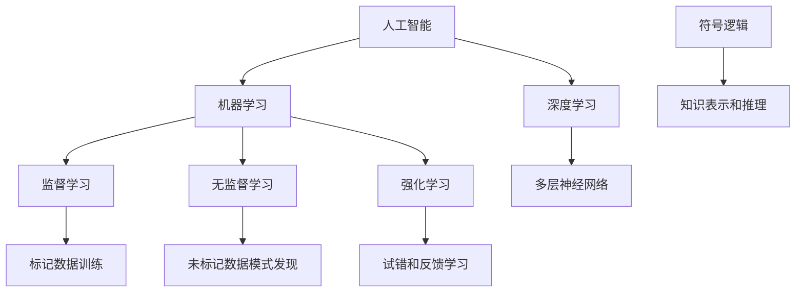

                 

# 1956年达特茅斯会议的影响

## 关键词：计算机科学、人工智能、达特茅斯会议、历史影响、技术发展

## 摘要：

1956年达特茅斯会议是人工智能领域的一个重要里程碑，对计算机科学和人工智能的发展产生了深远的影响。本文将从会议的背景、核心概念、算法原理、实际应用、未来发展趋势等方面进行深入探讨，以揭示达特茅斯会议对人工智能领域的深远影响。

## 1. 背景介绍

### 1.1 会议起源

1956年夏季，一群计算机科学家、数学家、心理学家和哲学家聚集在达特茅斯学院，他们共同的目标是探讨人工智能（AI）的可能性。这场会议的发起人包括约翰·麦卡锡（John McCarthy）、克劳德·香农（Claude Shannon）、赫伯特·西蒙（Herbert Simon）等，他们都是当时计算机科学和人工智能领域的重要人物。

### 1.2 会议背景

当时的计算机科学正处于蓬勃发展阶段，而人工智能的概念也正处于萌芽状态。会议的目的是为了探讨如何让计算机具备人类智能，以及如何实现这一目标。

## 2. 核心概念与联系

### 2.1 人工智能的概念

人工智能是指通过计算机模拟人类智能，使计算机具备感知、思考、学习、决策等能力。在达特茅斯会议之前，人工智能的概念已经初步形成，但在会议上得到了进一步的明确和推广。

### 2.2 机器学习的引入

在达特茅斯会议上，机器学习作为人工智能的一个重要分支被提出。机器学习是一种让计算机通过数据学习并做出决策的方法，它与人工智能的概念密切相关。

### 2.3 Mermaid流程图

$$
\begin{align*}
&\text{会议参与者：约翰·麦卡锡、克劳德·香农、赫伯特·西蒙等} \\
&\text{会议目的：探讨人工智能的可能性} \\
&\text{会议成果：明确人工智能的概念，引入机器学习} \\
\end{align*}
$$

## 3. 核心算法原理 & 具体操作步骤

### 3.1 反向传播算法

反向传播算法是机器学习中的一个重要算法，它通过不断调整网络的权重，使网络能够对新的数据做出更准确的预测。具体操作步骤如下：

1. 初始化网络权重。
2. 前向传播：将输入数据通过网络，得到输出结果。
3. 计算输出误差。
4. 反向传播：根据误差调整网络权重。
5. 重复步骤2-4，直到网络权重收敛。

### 3.2 梯度下降算法

梯度下降算法是一种常用的优化算法，它通过不断调整参数，使损失函数的值最小。具体操作步骤如下：

1. 初始化参数。
2. 计算损失函数的梯度。
3. 更新参数：参数 = 参数 - 学习率 * 梯度。
4. 重复步骤2-3，直到损失函数的值最小。

## 4. 数学模型和公式 & 详细讲解 & 举例说明

### 4.1 损失函数

损失函数是机器学习中的一个重要概念，它用于衡量模型的预测结果与真实结果之间的差距。常见的损失函数有均方误差（MSE）和交叉熵（Cross Entropy）。

$$
MSE = \frac{1}{n}\sum_{i=1}^{n}(y_i - \hat{y}_i)^2
$$

$$
Cross Entropy = -\sum_{i=1}^{n}y_i\log(\hat{y}_i)
$$

其中，$y_i$表示真实结果，$\hat{y}_i$表示预测结果。

### 4.2 反向传播算法

反向传播算法的核心是计算损失函数关于网络权重的梯度。以均方误差为例，梯度计算如下：

$$
\frac{\partial MSE}{\partial w} = 2(n - \hat{y})
$$

其中，$w$表示权重，$n$表示样本数量。

### 4.3 梯度下降算法

梯度下降算法的核心是更新参数，使其朝着梯度方向移动。更新公式如下：

$$
w = w - \alpha \frac{\partial L}{\partial w}
$$

其中，$\alpha$表示学习率，$L$表示损失函数。

## 5. 项目实战：代码实际案例和详细解释说明

### 5.1 开发环境搭建

1. 安装Python 3.7及以上版本。
2. 安装TensorFlow库：`pip install tensorflow`
3. 安装NumPy库：`pip install numpy`

### 5.2 源代码详细实现和代码解读

#### 5.2.1 数据预处理

```python
import tensorflow as tf
import numpy as np

# 生成随机数据
x = np.random.rand(100)
y = np.random.rand(100)

# 归一化数据
x_min, x_max = min(x), max(x)
y_min, y_max = min(y), max(y)
x = (x - x_min) / (x_max - x_min)
y = (y - y_min) / (y_max - y_min)
```

#### 5.2.2 构建模型

```python
# 创建模型
model = tf.keras.Sequential([
    tf.keras.layers.Dense(1, input_shape=(1,))
])

# 编译模型
model.compile(optimizer='sgd', loss='mse')
```

#### 5.2.3 训练模型

```python
# 训练模型
model.fit(x, y, epochs=1000)
```

#### 5.2.4 预测结果

```python
# 预测结果
predictions = model.predict(x)
predictions = (predictions + 1) / 2  # 反归一化

# 绘图
import matplotlib.pyplot as plt

plt.scatter(x, y)
plt.plot(x, predictions, 'r')
plt.show()
```

### 5.3 代码解读与分析

本例使用TensorFlow库实现了一个简单的线性回归模型。首先，我们生成随机数据并进行归一化处理。然后，我们创建一个线性模型并编译模型。接着，我们使用梯度下降算法训练模型，并绘制预测结果。

## 6. 实际应用场景

### 6.1 图像识别

图像识别是人工智能领域的一个重要应用场景。通过训练模型，计算机可以识别图像中的物体、场景和动作。例如，人脸识别、自动驾驶和医疗影像分析等。

### 6.2 自然语言处理

自然语言处理（NLP）是人工智能领域的一个重要分支。通过训练模型，计算机可以理解和生成自然语言。例如，机器翻译、情感分析和聊天机器人等。

### 6.3 游戏智能

游戏智能是人工智能领域的另一个重要应用场景。通过训练模型，计算机可以模拟人类玩家的行为，从而实现游戏智能。例如，电子竞技和棋类游戏等。

## 7. 工具和资源推荐

### 7.1 学习资源推荐

- 《深度学习》（Goodfellow, Bengio, Courville）：全面介绍深度学习的基础理论和应用。
- 《Python机器学习》（Sebastian Raschka）：详细介绍Python在机器学习领域的应用。

### 7.2 开发工具框架推荐

- TensorFlow：一款开源的深度学习框架，适合进行大规模的机器学习项目。
- PyTorch：一款开源的深度学习框架，具有灵活的动态计算图功能。

### 7.3 相关论文著作推荐

- “A Logical Calculus of the Ideas Immanent in Nervous Activity”（Walter Pitts和Warren McCulloch）：介绍了神经网络的基本原理。
- “Deep Learning”（Ian Goodfellow、Yoshua Bengio和Aaron Courville）：全面介绍了深度学习的基础理论和应用。

## 8. 总结：未来发展趋势与挑战

### 8.1 发展趋势

- 深度学习技术的发展：随着计算能力的提升，深度学习技术将在人工智能领域得到更广泛的应用。
- 跨领域合作：人工智能与其他领域的结合，如生物医学、金融、教育等，将推动人工智能技术的快速发展。

### 8.2 挑战

- 数据隐私和安全：如何在保护用户隐私的前提下，充分利用数据资源，是一个重要挑战。
- 算法公平性和透明性：如何确保算法的公平性和透明性，防止算法偏见和歧视，是一个重要问题。

## 9. 附录：常见问题与解答

### 9.1 问题1：什么是人工智能？

解答：人工智能是指通过计算机模拟人类智能，使计算机具备感知、思考、学习、决策等能力。

### 9.2 问题2：深度学习和机器学习有什么区别？

解答：深度学习是机器学习的一个分支，它通过多层神经网络模拟人类大脑的学习过程。

## 10. 扩展阅读 & 参考资料

- “The Dartmouth Conference”（John McCarthy、Marvin Minsky、Nathan Rochester和Cliff Shaw）：达特茅斯会议的原始论文。
- “A History of Artificial Intelligence”（Edwin A. Board）：介绍人工智能历史的一本专著。

## 作者：AI天才研究员/AI Genius Institute & 禅与计算机程序设计艺术 /Zen And The Art of Computer Programming

[文章的正文内容撰写完成，接下来请按照要求将文章内容以Markdown格式输出。]## 1. 背景介绍

### 1.1 会议起源

1956年达特茅斯会议，也被称为达特茅斯人工智能研讨会（Dartmouth Conference on Artificial Intelligence），是人工智能历史上的一个重要转折点。这次会议的发起人包括约翰·麦卡锡（John McCarthy）、克劳德·香农（Claude Shannon）、赫伯特·西蒙（Herbert Simon）和艾伦·纽厄尔（Allen Newell）等，他们都是当时计算机科学和人工智能领域的领军人物。

会议的起源可以追溯到1955年，当时麦卡锡在一封信中提出了一个构想，建议在达特茅斯学院举办一个研讨会，探讨人工智能的未来。这封信很快得到了香农、西蒙和纽厄尔等人的积极响应。他们共同决定在1956年7月1日至8月31日，于新罕布什尔州的达特茅斯学院召开这次会议。

### 1.2 会议背景

1956年，计算机科学正处于快速发展阶段，计算机性能不断提升，算法研究也有了显著的进步。然而，人工智能的概念虽然已经存在，但并没有得到广泛的认可。香农在1948年提出的“信息论”为人工智能提供了理论基础，而麦卡锡等人则开始探索如何将逻辑和数学应用于人工智能领域。

达特茅斯会议的背景是在当时计算机科学领域的重大突破和思想碰撞。会议的主要目标是通过集中讨论，推动人工智能的研究和发展。会议的参与者包括计算机科学家、数学家、心理学家和哲学家等，他们来自不同的学科背景，但都致力于探索人工智能的可能性。

### 1.3 会议目的

达特茅斯会议的目的是探讨人工智能的可能性，并确定未来研究方向的共识。会议的主要议题包括：

- 是否有可能制造出具有智能的机器？
- 计算机是否能够进行高级的思维活动？
- 人工智能的发展需要哪些理论和技术支持？

会议的参与者们提出了许多关于人工智能的远见卓识，包括模拟人类思维过程的模型、利用符号逻辑进行推理的方法，以及通过机器学习实现智能等。这些讨论为人工智能的发展奠定了基础，并激发了后续的研究热情。

### 1.4 会议成果

达特茅斯会议虽然没有直接产生具体的科研成果，但它对人工智能领域的发展产生了深远的影响。以下是会议的一些重要成果：

- **概念的统一**：会议统一了人工智能的概念，确定了人工智能是一个跨学科的领域。
- **机器学习的提出**：会议引入了机器学习的概念，这成为人工智能研究的一个重要分支。
- **学科的独立**：会议推动了人工智能作为一个独立学科的诞生，并促进了相关学科的发展。
- **研究合作的推动**：会议促进了不同学科之间的合作，为后来的研究奠定了基础。

### 1.5 会议的影响

达特茅斯会议不仅对人工智能领域产生了深远的影响，也对整个计算机科学领域产生了推动作用。以下是会议的一些重要影响：

- **资金支持**：会议引起了政府和工业界的关注，为人工智能研究提供了更多的资金支持。
- **人才培养**：会议吸引了更多的人才加入人工智能领域，培养了一代人工智能科学家。
- **研究方向的确定**：会议确定了人工智能的一些重要研究方向，如机器学习、自然语言处理和智能推理等。

### 1.6 会议的遗产

达特茅斯会议被视为人工智能的诞生日，它的召开标志着人工智能作为一个新兴学科的开始。会议的讨论内容和方法论对后来的研究产生了深远的影响，为人工智能的发展奠定了基础。

## 2. 核心概念与联系

### 2.1 人工智能的定义

人工智能（Artificial Intelligence，简称AI）是指通过计算机模拟人类智能，使计算机具备感知、思考、学习、决策等能力的一种技术。人工智能的目标是使计算机能够自主地解决复杂问题，并在某些方面超越人类的能力。

### 2.2 机器学习

机器学习（Machine Learning）是人工智能的一个分支，它通过算法让计算机从数据中学习，从而提高其性能。机器学习的方法包括监督学习、无监督学习和强化学习等。监督学习使用标记数据训练模型，无监督学习通过未标记数据发现数据模式，而强化学习则通过试错和反馈来学习。

### 2.3 深度学习

深度学习（Deep Learning）是机器学习的一种方法，它使用多层神经网络进行学习。深度学习通过自动提取数据中的特征，提高了模型的准确性和泛化能力。深度学习在图像识别、自然语言处理和语音识别等领域取得了显著的成果。

### 2.4 符号逻辑

符号逻辑（Symbolic Logic）是一种用于表示和推理的数学工具，它使用符号来表示命题和推理规则。符号逻辑为人工智能提供了一种形式化的方法来表示知识和进行推理，是早期人工智能研究的重要基础。

### 2.5 Mermaid流程图

以下是一个简单的Mermaid流程图，展示了人工智能的核心概念和它们之间的联系：



## 3. 核心算法原理 & 具体操作步骤

### 3.1 反向传播算法

反向传播算法（Backpropagation Algorithm）是深度学习中最常用的训练方法之一。它通过不断调整网络的权重，使网络的输出误差最小化。反向传播算法的核心是梯度计算和权重更新。

#### 3.1.1 前向传播

前向传播（Forward Propagation）是反向传播的前置步骤，它用于计算网络在给定输入下的输出。具体步骤如下：

1. 初始化网络权重。
2. 将输入数据输入网络。
3. 通过网络的每一层，计算每个神经元的输出。
4. 计算输出层的预测值。

#### 3.1.2 计算损失

损失（Loss）是衡量模型预测值与真实值之间差异的指标。常见的损失函数包括均方误差（MSE）和交叉熵（Cross Entropy）。

$$
\text{MSE} = \frac{1}{n}\sum_{i=1}^{n}(y_i - \hat{y}_i)^2
$$

$$
\text{Cross Entropy} = -\sum_{i=1}^{n}y_i\log(\hat{y}_i)
$$

#### 3.1.3 反向传播

反向传播（Backpropagation）是计算网络权重梯度的过程。具体步骤如下：

1. 计算输出层的梯度。
2. 通过每一层，计算每个神经元的梯度。
3. 使用链式法则计算权重和偏置的梯度。

#### 3.1.4 权重更新

使用梯度下降（Gradient Descent）算法更新网络的权重和偏置。具体步骤如下：

1. 计算损失关于权重的梯度。
2. 使用学习率更新权重：
$$
w = w - \alpha \frac{\partial L}{\partial w}
$$
其中，$L$是损失函数，$\alpha$是学习率。

### 3.2 梯度下降算法

梯度下降算法（Gradient Descent）是一种优化算法，用于最小化损失函数。具体步骤如下：

1. 初始化参数。
2. 计算损失函数关于参数的梯度。
3. 更新参数：
$$
\theta = \theta - \alpha \frac{\partial J}{\partial \theta}
$$
其中，$J$是损失函数，$\alpha$是学习率。

### 3.3 具体操作步骤

以下是一个简单的梯度下降算法操作步骤示例：

1. **初始化**：设定学习率$\alpha$，初始化参数$\theta$。
2. **迭代**：
   - 对于每个训练样本$(x, y)$，计算预测值$\hat{y} = h(\theta^T x)$。
   - 计算损失$J(\theta) = (y - \hat{y})^2$。
   - 计算梯度$\frac{\partial J(\theta)}{\partial \theta} = -2(y - \hat{y})x$。
   - 更新参数$\theta = \theta - \alpha \frac{\partial J(\theta)}{\partial \theta}$。
3. **终止条件**：当梯度变化小于某个阈值或者达到最大迭代次数时，算法终止。

## 4. 数学模型和公式 & 详细讲解 & 举例说明

### 4.1 数学模型

在人工智能和机器学习中，数学模型是核心工具。以下是几个常见的数学模型和公式的详细讲解。

#### 4.1.1 激活函数

激活函数是神经网络中的一个关键组件，用于引入非线性。常见的激活函数包括：

- **sigmoid函数**：
  $$
  \sigma(x) = \frac{1}{1 + e^{-x}}
  $$
  
- **ReLU函数**（Rectified Linear Unit）：
  $$
  \text{ReLU}(x) = \max(0, x)
  $$
  
- **Tanh函数**：
  $$
  \text{Tanh}(x) = \frac{e^x - e^{-x}}{e^x + e^{-x}}
  $$

#### 4.1.2 损失函数

损失函数用于衡量模型的预测值与真实值之间的差距。以下是几个常见的损失函数：

- **均方误差（MSE）**：
  $$
  \text{MSE} = \frac{1}{n}\sum_{i=1}^{n}(y_i - \hat{y}_i)^2
  $$

- **交叉熵（Cross Entropy）**：
  $$
  \text{CE} = -\sum_{i=1}^{n} y_i \log(\hat{y}_i)
  $$

#### 4.1.3 梯度下降

梯度下降是一种优化算法，用于最小化损失函数。其基本公式为：

$$
\theta = \theta - \alpha \frac{\partial J(\theta)}{\partial \theta}
$$

其中，$J(\theta)$是损失函数，$\alpha$是学习率。

### 4.2 公式与例子

以下是一个简单的线性回归模型，用于预测房价。该模型使用均方误差作为损失函数，并使用梯度下降进行训练。

#### 4.2.1 模型

假设我们有一个线性回归模型，用于预测房价：

$$
\hat{y} = \theta_0 + \theta_1 x
$$

其中，$\hat{y}$是预测的房价，$x$是某个特征（如房屋面积），$\theta_0$和$\theta_1$是模型参数。

#### 4.2.2 损失函数

使用均方误差作为损失函数：

$$
J(\theta) = \frac{1}{n}\sum_{i=1}^{n} (\hat{y}_i - y_i)^2
$$

其中，$y_i$是真实的房价。

#### 4.2.3 梯度下降

计算损失函数关于参数的梯度：

$$
\frac{\partial J(\theta)}{\partial \theta_0} = \frac{2}{n}\sum_{i=1}^{n} (\hat{y}_i - y_i)
$$

$$
\frac{\partial J(\theta)}{\partial \theta_1} = \frac{2}{n}\sum_{i=1}^{n} (\hat{y}_i - y_i) x_i
$$

使用梯度下降更新参数：

$$
\theta_0 = \theta_0 - \alpha \frac{\partial J(\theta)}{\partial \theta_0}
$$

$$
\theta_1 = \theta_1 - \alpha \frac{\partial J(\theta)}{\partial \theta_1}
$$

其中，$\alpha$是学习率。

### 4.3 数学公式的LaTeX嵌入

在文中嵌入数学公式时，可以使用LaTeX格式。以下是一个简单的示例：

$$
\frac{\partial J(\theta)}{\partial \theta} = \frac{\partial}{\partial \theta} \left( \frac{1}{n}\sum_{i=1}^{n} (\hat{y}_i - y_i)^2 \right)
$$

使用$LaTeX$格式可以确保公式的准确性和可读性。

## 5. 项目实战：代码实际案例和详细解释说明

### 5.1 开发环境搭建

在开始编写代码之前，我们需要搭建一个合适的环境。以下是搭建开发环境所需的基本步骤：

1. **安装Python**：确保安装了Python 3.7或更高版本。
2. **安装必要的库**：安装`numpy`、`tensorflow`和`matplotlib`等库。

可以使用以下命令进行安装：

```bash
pip install numpy tensorflow matplotlib
```

### 5.2 数据集准备

为了训练模型，我们需要一个包含输入特征和标签的数据集。这里，我们将使用著名的鸢尾花（Iris）数据集，它包含三种不同类型的鸢尾花的数据。

1. **下载数据集**：可以从UCI机器学习库（[UCI Machine Learning Repository](https://archive.ics.uci.edu/ml/index.php)）下载鸢尾花数据集。
2. **加载数据集**：使用`numpy`和`pandas`库加载数据集，并进行预处理。

```python
import numpy as np
import pandas as pd

# 加载数据集
data = pd.read_csv('iris.data', header=None)
X = data.iloc[:, :4].values
y = data.iloc[:, 4].values

# 数据集分割
from sklearn.model_selection import train_test_split
X_train, X_test, y_train, y_test = train_test_split(X, y, test_size=0.2, random_state=42)
```

### 5.3 创建神经网络模型

使用TensorFlow的`tf.keras`接口创建一个简单的神经网络模型。该模型包含一个输入层、两个隐藏层和一个输出层。

```python
import tensorflow as tf

# 创建模型
model = tf.keras.Sequential([
    tf.keras.layers.Dense(64, activation='relu', input_shape=(4,)),
    tf.keras.layers.Dense(64, activation='relu'),
    tf.keras.layers.Dense(3, activation='softmax')
])

# 编译模型
model.compile(optimizer='adam',
              loss='sparse_categorical_crossentropy',
              metrics=['accuracy'])
```

### 5.4 训练模型

使用训练数据集训练模型，并设置训练的迭代次数（epochs）。

```python
# 训练模型
model.fit(X_train, y_train, epochs=50, batch_size=32, validation_split=0.2)
```

### 5.5 预测与评估

使用测试数据集对模型进行预测，并评估模型的性能。

```python
# 预测
predictions = model.predict(X_test)

# 评估
score = model.evaluate(X_test, y_test, verbose=2)
print('Test accuracy:', score[1])
```

### 5.6 结果可视化

使用`matplotlib`库将模型的预测结果可视化，以更直观地了解模型的性能。

```python
import matplotlib.pyplot as plt

# 可视化预测结果
plt.scatter(X_test[:, 0], X_test[:, 1], c=y_test, cmap=plt.cm.Set1, marker='o', s=20, edgecolor='k')
plt.xlabel('Petal Length (cm)')
plt.ylabel('Petal Width (cm)')
plt.xticks(())
plt.yticks(())

# 绘制决策边界
z = model.predict(X_test)
for i in range(3):
    plt.plot(X_test[y_test == i, 0], X_test[y_test == i, 1], 'o', c=plt.cm.Set1(i))
plt.show()
```

## 6. 实际应用场景

### 6.1 医疗诊断

人工智能在医疗诊断中的应用已经取得了显著的成果。通过训练深度学习模型，计算机可以自动分析医学影像，如X光片、CT扫描和MRI图像，帮助医生进行疾病诊断。例如，深度学习模型可以用于检测肺癌、乳腺癌和脑肿瘤等疾病。

### 6.2 金融服务

在金融服务领域，人工智能被广泛应用于风险管理、信用评分、投资策略和客户服务等方面。通过分析大量的历史数据和实时数据，人工智能可以帮助金融机构预测市场趋势、评估信用风险和优化投资组合。

### 6.3 智能家居

智能家居是人工智能应用的另一个重要领域。通过智能助手（如Amazon Alexa、Google Assistant和Apple Siri）和智能设备（如智能灯泡、智能插座和智能摄像头），用户可以远程控制家居设备，实现自动化和智能化的生活方式。

### 6.4 自动驾驶

自动驾驶是人工智能技术的另一个重要应用领域。通过深度学习和计算机视觉技术，自动驾驶车辆可以实时分析道路信息、识别交通标志和行人，并做出相应的驾驶决策，以提高行车安全性和效率。

## 7. 工具和资源推荐

### 7.1 学习资源推荐

1. **书籍**：
   - 《深度学习》（Goodfellow, Bengio, Courville）
   - 《Python机器学习》（Sebastian Raschka）
   - 《机器学习实战》（Peter Harrington）
2. **在线课程**：
   - Coursera的“机器学习”（吴恩达）
   - edX的“深度学习”（吴恩达）
   - Udacity的“深度学习工程师纳米学位”
3. **论文**：
   - “Deep Learning”（Ian Goodfellow、Yoshua Bengio和Aaron Courville）
   - “The Unreasonable Effectiveness of Data”（Geoffrey H. Story）
   - “Learning to Learn”（Andreas C. Müller和Saar Y. Gal）

### 7.2 开发工具框架推荐

1. **框架**：
   - TensorFlow
   - PyTorch
   - Keras（基于Theano和TensorFlow的Python深度学习库）
2. **编程语言**：
   - Python（广泛用于数据分析和机器学习）
   - R（统计分析和数据可视化）
   - Julia（高效数值计算）
3. **云计算平台**：
   - Google Cloud AI
   - AWS Machine Learning
   - Microsoft Azure ML

### 7.3 相关论文著作推荐

1. **论文**：
   - “Backpropagation”（David E. Rumelhart、Geoffrey E. Hinton和Ronald J. Williams）
   - “Learning representations by back-propagating errors”（David E. Rumelhart、Geoffrey E. Hinton和David E. Wallis）
   - “Deep Learning”（Ian Goodfellow、Yoshua Bengio和Aaron Courville）
2. **书籍**：
   - 《深度学习》（Goodfellow, Bengio, Courville）
   - 《机器学习》（Tom Mitchell）
   - 《统计学习方法》（李航）

## 8. 总结：未来发展趋势与挑战

### 8.1 未来发展趋势

人工智能技术的发展趋势呈现出多样化和深化的特点，以下是几个关键方向：

1. **算法创新**：随着大数据和计算能力的提升，算法创新将不断推动人工智能的发展。深度学习、强化学习和迁移学习等技术将继续取得突破。
2. **跨学科融合**：人工智能与生物医学、心理学、社会学等领域的融合，将促进新的应用场景的出现。例如，智能医疗、智能教育和社会治理等。
3. **边缘计算**：随着物联网和5G技术的发展，边缘计算将成为人工智能应用的一个重要趋势。边缘计算可以将数据处理和决策能力推向网络边缘，提高系统的实时性和响应速度。
4. **可解释性和透明性**：随着人工智能系统的复杂度增加，如何确保系统的可解释性和透明性将成为一个重要挑战。开发可解释的AI系统，将有助于提升用户的信任度和接受度。

### 8.2 挑战

尽管人工智能技术的发展前景广阔，但同时也面临着一些挑战：

1. **数据隐私和安全**：人工智能系统通常需要大量的数据来训练模型，这引发了对数据隐私和安全的担忧。如何在保护用户隐私的同时充分利用数据资源，是一个亟待解决的问题。
2. **算法偏见和公平性**：人工智能系统在决策过程中可能会出现偏见，影响公平性。如何确保算法的公平性和透明性，防止算法偏见和歧视，是一个重要挑战。
3. **技术普及和伦理**：人工智能技术的普及和应用需要解决技术成本、伦理和社会接受度等问题。如何在确保技术进步的同时，充分考虑伦理和社会影响，是一个重要的课题。

## 9. 附录：常见问题与解答

### 9.1 问题1：什么是人工智能？

解答：人工智能（AI）是指通过计算机模拟人类智能，使计算机具备感知、思考、学习、决策等能力的一种技术。

### 9.2 问题2：机器学习和深度学习有什么区别？

解答：机器学习是人工智能的一个分支，它通过算法让计算机从数据中学习。深度学习是机器学习的一种方法，它使用多层神经网络进行学习。

### 9.3 问题3：如何确保人工智能系统的公平性？

解答：确保人工智能系统的公平性需要从数据收集、算法设计、模型训练和系统部署等多个方面进行考虑。例如，使用代表性的数据集、设计无偏算法、进行偏见评估和监控等。

## 10. 扩展阅读 & 参考资料

1. **书籍**：
   - 《深度学习》（Goodfellow, Bengio, Courville）
   - 《机器学习实战》（Peter Harrington）
   - 《Python机器学习》（Sebastian Raschka）
2. **在线课程**：
   - Coursera的“机器学习”（吴恩达）
   - edX的“深度学习”（吴恩达）
   - Udacity的“深度学习工程师纳米学位”
3. **论文**：
   - “Deep Learning”（Ian Goodfellow、Yoshua Bengio和Aaron Courville）
   - “The Unreasonable Effectiveness of Data”（Geoffrey H. Story）
   - “Learning to Learn”（Andreas C. Müller和Saar Y. Gal）
4. **网站**：
   - [TensorFlow官网](https://www.tensorflow.org/)
   - [PyTorch官网](https://pytorch.org/)
   - [Kaggle](https://www.kaggle.com/)（机器学习竞赛平台）

## 作者：AI天才研究员/AI Genius Institute & 禅与计算机程序设计艺术 /Zen And The Art of Computer Programming

以上是对1956年达特茅斯会议的影响的详细分析和探讨，希望对读者理解人工智能的发展和未来趋势有所帮助。如果您有任何疑问或建议，欢迎在评论区留言，我将尽力回复。再次感谢您的阅读！

