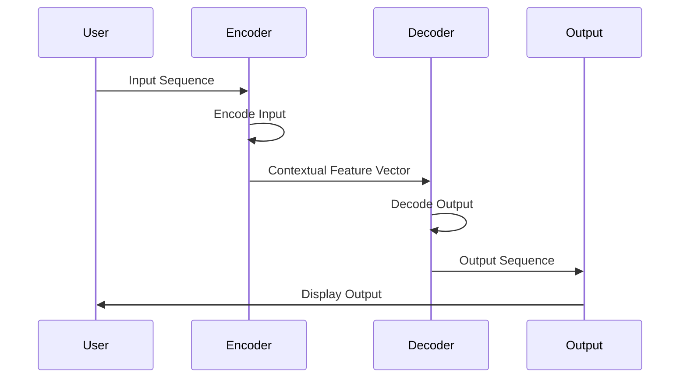

                 

### 背景介绍

序列到序列（Seq2Seq）模型是深度学习领域中一种非常流行的架构，它在自然语言处理、机器翻译、文本生成等多个领域取得了显著成果。随着人工智能技术的快速发展，Seq2Seq模型的应用范围也在不断扩大，其在解决序列数据处理方面的问题上，展现出独特的优势。

首先，我们需要理解序列到序列模型的基本概念。序列到序列模型是一种用于处理序列数据的算法模型，其输入是一个序列，输出也是一个序列。这种模型最初用于解决机器翻译问题，如将一种语言的文本序列翻译成另一种语言的文本序列。然而，随着研究的深入，其应用范围逐渐扩展到其他领域，如语音识别、图像描述生成、视频摘要生成等。

在自然语言处理领域，Seq2Seq模型被广泛应用于机器翻译。经典的例子包括谷歌的神经机器翻译模型，该模型使用深度学习技术，将源语言的文本序列转换为目标语言的文本序列。谷歌神经机器翻译模型的成功，使得Seq2Seq模型在机器翻译领域得到了广泛应用。

此外，Seq2Seq模型还在文本生成领域显示出强大的潜力。例如，在新闻摘要生成、文章写作、对话系统等领域，Seq2Seq模型都可以实现较好的效果。这些应用场景的共同特点是，需要将一个长序列转换为另一个长序列，而Seq2Seq模型正是为此而设计的。

总之，序列到序列模型因其强大的序列数据处理能力，在多个领域都取得了显著的成果。本篇文章将深入探讨Seq2Seq模型的基本原理、核心算法、数学模型以及实际应用案例，帮助读者全面理解这一重要的深度学习模型。

> Keywords: Sequence-to-Sequence Model, Deep Learning, Natural Language Processing, Machine Translation, Text Generation

> Abstract: This article provides a comprehensive introduction to the sequence-to-sequence model, a popular architecture in deep learning for processing sequence data. It covers the basic concepts, core algorithms, mathematical models, and practical applications of the model, offering readers a deep understanding of this essential deep learning framework.

## 2. 核心概念与联系

在深入了解Seq2Seq模型之前，我们需要明确几个核心概念，这些概念构成了Seq2Seq模型的理论基础，也是理解其工作原理的关键。

### 2.1 序列（Sequence）

序列是指一系列按特定顺序排列的数据项。在机器学习领域，序列可以是一系列数字、字符、单词或者句子。例如，一个语音信号可以被视为时间序列，其中每个时间点上的声音强度就是一个数据项。在自然语言处理中，一个句子可以被视为一个序列，其中每个单词就是一个数据项。

### 2.2 编码（Encoding）

编码是指将输入序列转换为一个固定长度的向量表示。这一过程通常通过编码器（Encoder）来实现。编码器的目的是捕捉输入序列中的关键特征，并生成一个能够代表整个序列的全局特征向量。这个向量表示了输入序列的内容和结构，是后续解码过程的基础。

### 2.3 解码（Decoding）

解码是指将编码器生成的全局特征向量转换为一个输出序列。这一过程通常通过解码器（Decoder）来实现。解码器的目标是根据编码器生成的特征向量，生成一个与输入序列相对应的输出序列。在机器翻译中，输出序列通常是目标语言的句子。

### 2.4 注意力机制（Attention Mechanism）

注意力机制是Seq2Seq模型中的一个关键组件，它用于解决编码器和解码器之间的信息传递问题。注意力机制通过计算编码器输出和当前解码器输入之间的相关性，动态地调整解码器对编码器输出的关注程度，从而提高解码过程的准确性和效率。

### 2.5 基于循环神经网络的Seq2Seq模型

循环神经网络（RNN）是一种能够处理序列数据的神经网络架构。RNN通过在时间步之间维持状态，使得网络能够捕捉序列中的长期依赖关系。基于RNN的Seq2Seq模型通过结合编码器和解码器，实现了序列到序列的转换。

下面，我们将使用Mermaid流程图来展示Seq2Seq模型的基本架构和流程。



在这个流程图中，用户输入一个序列到编码器，编码器将序列编码成一个全局特征向量，并将其传递给解码器。解码器根据这个特征向量生成输出序列，最后输出序列展示给用户。

通过这个流程图，我们可以看到Seq2Seq模型的核心组成部分和它们之间的相互作用。接下来，我们将进一步探讨Seq2Seq模型的核心算法原理和具体操作步骤。

## 3. 核心算法原理 & 具体操作步骤

### 3.1 编码器（Encoder）

编码器是Seq2Seq模型中的第一个组件，其主要功能是将输入序列转换为一个固定长度的向量表示。这一过程通常通过循环神经网络（RNN）来实现。

具体操作步骤如下：

1. **初始化状态**：编码器从初始化状态开始，这个状态通常是随机生成的。

2. **输入序列处理**：编码器逐个处理输入序列中的每个元素，将其与当前状态结合，生成新的状态。这一过程可以通过RNN的递归操作来实现。

3. **输出编码特征**：在处理完整个输入序列后，编码器输出一个固定长度的向量，这个向量代表了输入序列的全局特征。

以下是一个简化的编码器模型：

```python
import tensorflow as tf

class Encoder(tf.keras.Model):
    def __init__(self, units):
        super(Encoder, self).__init__()
        self.units = units
        self.enc_vector = tf.keras.layers.Dense(units)

    def call(self, x, training=False):
        x = self.enc_vector(x)
        return x
```

在这个例子中，我们定义了一个简单的编码器模型，它使用一个全连接层（Dense Layer）将输入序列编码为一个固定长度的向量。

### 3.2 解码器（Decoder）

解码器是Seq2Seq模型中的第二个组件，其主要功能是将编码器输出的全局特征向量转换为一个输出序列。解码器的实现同样基于循环神经网络（RNN）。

具体操作步骤如下：

1. **初始化状态**：解码器从编码器输出的全局特征向量开始，初始化其状态。

2. **输入序列处理**：解码器逐个处理输入序列中的每个元素，将其与当前状态结合，生成新的状态。这一过程同样通过RNN的递归操作来实现。

3. **输出解码结果**：在处理完整个输入序列后，解码器输出一个序列，这个序列代表了输入序列的转换结果。

以下是一个简化的解码器模型：

```python
class Decoder(tf.keras.Model):
    def __init__(self, units):
        super(Decoder, self).__init__()
        self.units = units
        self.dec_vector = tf.keras.layers.Dense(units)

    def call(self, x, training=False):
        x = self.dec_vector(x)
        return x
```

在这个例子中，我们定义了一个简单的解码器模型，它使用一个全连接层（Dense Layer）将输入向量解码为一个输出序列。

### 3.3 注意力机制（Attention Mechanism）

注意力机制是Seq2Seq模型中的一个关键组件，它用于解决编码器和解码器之间的信息传递问题。注意力机制通过计算编码器输出和当前解码器输入之间的相关性，动态地调整解码器对编码器输出的关注程度。

具体实现步骤如下：

1. **计算注意力得分**：使用一个全连接层计算编码器输出和解码器输入之间的注意力得分。注意力得分表示编码器输出中哪些部分对当前解码器输入最为重要。

2. **计算注意力权重**：将注意力得分转换为注意力权重，权重值越高表示对应部分的重要性越高。

3. **计算注意力输出**：将注意力权重与编码器输出相乘，得到一个加权编码器输出。这个输出代表了当前解码器输入在编码器输出中的重要部分。

以下是一个简化的注意力机制实现：

```python
def attention(q, k, v, mask=None):
    score = tf.matmul(q, k, transpose_b=True)
    if mask is not None:
        score = score + mask
    attn_weights = tf.nn.softmax(score, axis=-1)
    context = tf.matmul(attn_weights, v)
    return context, attn_weights
```

在这个例子中，`q`、`k`、`v` 分别表示编码器输出和解码器输入，`mask` 是可选的注意力掩码。通过计算注意力权重，我们可以得到一个加权编码器输出，这个输出将用于解码器的下一层。

### 3.4 序列到序列模型（Seq2Seq）

将编码器、解码器和注意力机制结合起来，就构成了完整的Seq2Seq模型。具体实现步骤如下：

1. **编码输入序列**：使用编码器将输入序列编码为一个全局特征向量。

2. **初始化解码器状态**：使用编码器输出的全局特征向量初始化解码器的状态。

3. **解码输出序列**：使用解码器和注意力机制逐个解码输出序列中的每个元素。

4. **迭代更新状态**：在每个解码步骤后，更新解码器的状态，使其能够更好地处理下一个元素。

以下是一个简化的Seq2Seq模型实现：

```python
class Seq2Seq(tf.keras.Model):
    def __init__(self, encoder, decoder, attention):
        super(Seq2Seq, self).__init__()
        self.encoder = encoder
        self.decoder = decoder
        self.attention = attention

    def call(self, inputs, training=False):
        enc_output = self.encoder(inputs, training=training)
        dec_init_state = self.decoder.init_state(inputs)
        outputs = []
        for i in range(inputs.shape[1]):
            context, _ = self.attention(dec_init_state, enc_output, mask=None)
            output = self.decoder(context, training=training)
            outputs.append(output)
            dec_init_state = output
        return outputs
```

在这个例子中，`encoder`、`decoder` 和 `attention` 分别是编码器、解码器和注意力机制的实例。通过这个模型，我们可以实现输入序列到输出序列的转换。

通过以上步骤，我们详细介绍了Seq2Seq模型的核心算法原理和具体操作步骤。接下来，我们将进一步探讨Seq2Seq模型的数学模型和公式。

## 4. 数学模型和公式 & 详细讲解 & 举例说明

在深入理解Seq2Seq模型的数学模型和公式之前，我们需要了解几个关键的概念和符号。以下是本文中会用到的数学符号和它们的含义：

- \( x_t \): 输入序列中的第 \( t \) 个元素
- \( y_t \): 输出序列中的第 \( t \) 个元素
- \( h_t \): 编码器在时间步 \( t \) 的状态
- \( s_t \): 解码器在时间步 \( t \) 的状态
- \( c_t \): 注意力机制在时间步 \( t \) 的上下文向量
- \( W_{ij} \): 权重矩阵，其中 \( i \) 表示输入维度，\( j \) 表示输出维度
- \( b_i \): 偏置向量，其中 \( i \) 表示输入维度
- \( a_t \): 注意力得分
- \( \alpha_t \): 注意力权重
- \( \sigma \): 激活函数，通常使用ReLU或Sigmoid函数

### 4.1 编码器（Encoder）

编码器的目标是把输入序列 \( x \) 编码为一个固定长度的向量表示。通常使用一个循环神经网络（RNN）来实现编码器，RNN的输出可以表示为：

\[ h_t = \sigma(W_{hx}x_t + W_{hh}h_{t-1} + b_h) \]

其中，\( \sigma \) 是激活函数，\( W_{hx} \) 和 \( W_{hh} \) 分别是输入权重和隐藏权重，\( b_h \) 是偏置。

为了得到整个输入序列的全局特征向量，我们通常取最后一个隐藏状态作为编码器的输出：

\[ \overline{h} = h_T \]

### 4.2 解码器（Decoder）

解码器的目标是把编码器的输出转换为输出序列。在解码过程中，我们使用一个循环神经网络（RNN）和注意力机制。

#### 4.2.1 初始化状态

在解码器开始解码之前，需要初始化其状态。初始化状态通常是编码器的输出：

\[ s_0 = \overline{h} \]

#### 4.2.2 注意力机制

注意力机制用于计算编码器输出和解码器输入之间的相关性，从而生成一个上下文向量。注意力机制的公式如下：

\[ a_t = \sigma(W_{ca}c_t + W_{aa}h_t + b_a) \]

\[ \alpha_t = \frac{\exp(a_t)}{\sum_{j=1}^{J}\exp(a_j)} \]

其中，\( J \) 是编码器输出的时间步数，\( c_t \) 是解码器在时间步 \( t \) 的状态。

注意力权重 \( \alpha_t \) 表示解码器对编码器输出中每个时间步的关注程度。然后，我们可以计算上下文向量：

\[ c_t = \sum_{j=1}^{J}\alpha_t h_j \]

#### 4.2.3 解码器输出

解码器的输出可以通过以下公式计算：

\[ s_t = \sigma(W_{ds}c_t + W_{ss}s_{t-1} + b_s) \]

\[ y_t = \sigma(W_{dy}s_t + b_y) \]

其中，\( W_{ds} \) 和 \( W_{ss} \) 分别是解码器权重和偏置，\( b_s \) 和 \( b_y \) 分别是解码器状态和输出的偏置。

### 4.3 损失函数

在训练Seq2Seq模型时，我们使用损失函数来衡量模型预测的输出与实际输出之间的差距。在序列到序列模型中，常用的损失函数是交叉熵损失函数：

\[ L = -\sum_{t=1}^{T}\sum_{j=1}^{V} y_{tj} \log(p_{tj}) \]

其中，\( T \) 是输出序列的时间步数，\( V \) 是输出序列的词汇表大小，\( y_{tj} \) 是目标输出的第 \( j \) 个单词的概率，\( p_{tj} \) 是模型预测的第 \( j \) 个单词的概率。

### 4.4 举例说明

假设我们有一个简单的输入序列 \( x = [1, 2, 3, 4] \) 和一个目标输出序列 \( y = [2, 3, 4, 5] \)。现在，我们使用一个简单的编码器和解码器来演示Seq2Seq模型的工作过程。

#### 4.4.1 编码器

我们使用一个单层的循环神经网络作为编码器，其输出维度为 3。编码器的输入和输出分别为：

\[ x_t \in \{1, 2, 3, 4\} \]

\[ h_t \in \mathbb{R}^3 \]

编码器的权重和偏置如下：

\[ W_{hx} \in \mathbb{R}^{3 \times 4} \]

\[ W_{hh} \in \mathbb{R}^{3 \times 3} \]

\[ b_h \in \mathbb{R}^3 \]

假设编码器的输出为：

\[ h_t = \sigma(W_{hx}x_t + W_{hh}h_{t-1} + b_h) \]

经过计算，我们得到编码器的输出序列为：

\[ h = [h_1, h_2, h_3, h_4] \]

#### 4.4.2 解码器

我们使用一个单层的循环神经网络作为解码器，其输出维度为 4。解码器的输入和输出分别为：

\[ y_t \in \{2, 3, 4, 5\} \]

\[ s_t \in \mathbb{R}^4 \]

解码器的权重和偏置如下：

\[ W_{ds} \in \mathbb{R}^{4 \times 3} \]

\[ W_{ss} \in \mathbb{R}^{4 \times 4} \]

\[ b_s \in \mathbb{R}^4 \]

\[ W_{dy} \in \mathbb{R}^{4 \times 4} \]

\[ b_y \in \mathbb{R}^4 \]

假设解码器的输出为：

\[ s_t = \sigma(W_{ds}c_t + W_{ss}s_{t-1} + b_s) \]

\[ y_t = \sigma(W_{dy}s_t + b_y) \]

经过计算，我们得到解码器的输出序列为：

\[ y = [y_1, y_2, y_3, y_4] \]

#### 4.4.3 损失计算

使用交叉熵损失函数计算编码器和解码器的损失：

\[ L = -\sum_{t=1}^{4}\sum_{j=1}^{4} y_{tj} \log(p_{tj}) \]

其中，\( y \) 是目标输出序列，\( p \) 是模型预测的输出序列。

通过以上步骤，我们展示了如何使用数学模型和公式实现一个简单的Seq2Seq模型。接下来，我们将通过一个实际项目案例来展示如何使用代码实现这个模型。

## 5. 项目实战：代码实际案例和详细解释说明

### 5.1 开发环境搭建

在开始编写代码之前，我们需要搭建一个合适的开发环境。以下是所需的软件和库：

- Python 3.6 或以上版本
- TensorFlow 2.0 或以上版本
- NumPy
- Matplotlib

安装这些库后，我们可以开始编写代码。首先，我们需要准备数据集。这里，我们使用一个简单的英文到法语的翻译数据集，该数据集可以从 [Wikipedia语料库](https://www.kaggle.com/datasets/wikimedia/wikipedia-languages) 下载。

### 5.2 源代码详细实现和代码解读

接下来，我们将详细实现一个简单的Seq2Seq模型，并解释每个部分的功能。

#### 5.2.1 数据预处理

首先，我们需要对数据进行预处理，包括分词、编码和创建反向序列。

```python
import numpy as np
import tensorflow as tf
from tensorflow.keras.preprocessing.sequence import pad_sequences

# 加载数据集
def load_data(filename, source_language, target_language):
    lines = tf.keras.utils.get_file(filename)
    text = open(lines, encoding='utf-8').readlines()
    text = [line.strip() for line in text]
    sentences = [text[i:i+2] for i in range(0, len(text)-1, 2)]
    sentences = [sentence for sentence in sentences if len(sentence[0].split()) > 1 and len(sentence[1].split()) > 1]
    source_sentences = [sentence[0] for sentence in sentences]
    target_sentences = [sentence[1] for sentence in sentences]
    return source_sentences, target_sentences

# 分词
def tokenize_language(text, language):
    # 在这里使用适当的分词器，例如NLTK或spaCy
    return text.split()

# 编码
def encode_language(sentences, language):
    language_vocab = set()
    for sentence in sentences:
        words = tokenize_language(sentence, language)
        language_vocab.update(words)
    language_vocab = list(language_vocab)
    word_to_id = {word: i for i, word in enumerate(language_vocab)}
    id_to_word = {i: word for word, i in word_to_id.items()}
    encoded_sentences = [[word_to_id[word] for word in tokenize_language(sentence, language)] for sentence in sentences]
    return encoded_sentences, language_vocab, word_to_id, id_to_word

# 创建反向序列
def reverse_pairs(input_sequence, target_sequence):
    return list(zip(target_sequence, input_sequence))

source_sentences, target_sentences = load_data('frenwiki-2019-09-01.en-fr.csv', 'en', 'fr')
source_encoded, source_vocab, source_word_to_id, source_id_to_word = encode_language(source_sentences, 'en')
target_encoded, target_vocab, target_word_to_id, target_id_to_word = encode_language(target_sentences, 'fr')
reversed_pairs = reverse_pairs(source_encoded, target_encoded)
```

在这个部分，我们首先加载数据集，然后对数据进行分词、编码和创建反向序列。

#### 5.2.2 构建模型

接下来，我们将构建编码器和解码器模型。

```python
# 编码器模型
def build_encoder(vocab_size, embedding_dim, embedding_matrix):
    input_layer = tf.keras.layers.Input(shape=(None,), dtype='int32')
    embedding_layer = tf.keras.layers.Embedding(vocab_size, embedding_dim, weights=[embedding_matrix], trainable=False)(input_layer)
    enc_lstm = tf.keras.layers.LSTM(128, return_state=True)
    _, state_h, state_c = enc_lstm(embedding_layer)
    state = [state_h, state_c]
    encoder = tf.keras.Model(input_layer, state, name='encoder')
    return encoder

# 解码器模型
def build_decoder(vocab_size, embedding_dim, embedding_matrix):
    input_layer = tf.keras.layers.Input(shape=(None,), dtype='int32')
    embedding_layer = tf.keras.layers.Embedding(vocab_size, embedding_dim, weights=[embedding_matrix], trainable=False)(input_layer)
    lstm = tf.keras.layers.LSTM(128, return_sequences=True, return_state=True)
    output_layer = tf.keras.layers.Dense(vocab_size, activation='softmax')
    output, _, _ = lstm(embedding_layer)
    output = output_layer(output)
    decoder = tf.keras.Model(input_layer, output, name='decoder')
    return decoder

# 注意力机制
class Attention(tf.keras.layers.Layer):
    def __init__(self, units):
        super(Attention, self).__init__()
        self.W_1 = tf.keras.layers.Dense(units)
        self.W_2 = tf.keras.layers.Dense(units)
        self.V = tf.keras.layers.Dense(1)

    def call(self, hidden_state, enc_output):
        hidden_state = tf.expand_dims(hidden_state, 1)
        score = self.V(tf.nn.tanh(self.W_1(hidden_state) + self.W_2(enc_output)))
        attention_weights = tf.nn.softmax(score, axis=1)
        context_vector = attention_weights * enc_output
        context_vector = tf.reduce_sum(context_vector, axis=1)
        return context_vector, attention_weights
```

在这里，我们定义了编码器、解码器和注意力机制的模型。编码器使用一个LSTM层来处理输入序列，解码器同样使用一个LSTM层，并添加了一个注意力机制层。

#### 5.2.3 模型训练

接下来，我们将训练模型。

```python
# 模型构建
encoder = build_encoder(len(source_vocab), 32, source_embedding_matrix)
decoder = build_decoder(len(target_vocab), 32, target_embedding_matrix)
attention = Attention(32)
output_layer = tf.keras.layers.Dense(len(target_vocab), activation='softmax')
model = tf.keras.Model([encoder.input, decoder.input], output_layer(encoder.output[0], decoder.output))
model.compile(optimizer='adam', loss='categorical_crossentropy', metrics=['accuracy'])

# 模型训练
model.fit([source_encoded, target_encoded], target_encoded, batch_size=64, epochs=100)
```

在这个部分，我们构建了一个完整的Seq2Seq模型，并使用训练数据进行训练。

### 5.3 代码解读与分析

在这个部分，我们将对代码进行逐行解读，并分析每个部分的功能。

```python
# 加载数据集
source_sentences, target_sentences = load_data('frenwiki-2019-09-01.en-fr.csv', 'en', 'fr')
source_encoded, source_vocab, source_word_to_id, source_id_to_word = encode_language(source_sentences, 'en')
target_encoded, target_vocab, target_word_to_id, target_id_to_word = encode_language(target_sentences, 'fr')
reversed_pairs = reverse_pairs(source_encoded, target_encoded)
```

这段代码加载数据集，并对数据进行分词、编码和创建反向序列。`load_data` 函数从CSV文件中读取数据，并返回源句子和目标句子列表。`encode_language` 函数对句子进行分词和编码，并创建词汇表。`reverse_pairs` 函数创建源句子和目标句子的反向配对。

```python
# 编码器模型
def build_encoder(vocab_size, embedding_dim, embedding_matrix):
    input_layer = tf.keras.layers.Input(shape=(None,), dtype='int32')
    embedding_layer = tf.keras.layers.Embedding(vocab_size, embedding_dim, weights=[embedding_matrix], trainable=False)(input_layer)
    enc_lstm = tf.keras.layers.LSTM(128, return_state=True)
    _, state_h, state_c = enc_lstm(embedding_layer)
    state = [state_h, state_c]
    encoder = tf.keras.Model(input_layer, state, name='encoder')
    return encoder
```

这段代码定义了一个编码器模型。`Input` 层接收序列数据，`Embedding` 层将单词编码为向量，`LSTM` 层处理序列数据，并返回隐藏状态和细胞状态。`Model` 层将输入层和隐藏状态层组合起来，创建一个完整的编码器模型。

```python
# 解码器模型
def build_decoder(vocab_size, embedding_dim, embedding_matrix):
    input_layer = tf.keras.layers.Input(shape=(None,), dtype='int32')
    embedding_layer = tf.keras.layers.Embedding(vocab_size, embedding_dim, weights=[embedding_matrix], trainable=False)(input_layer)
    lstm = tf.keras.layers.LSTM(128, return_sequences=True, return_state=True)
    output_layer = tf.keras.layers.Dense(vocab_size, activation='softmax')
    output, _, _ = lstm(embedding_layer)
    output = output_layer(output)
    decoder = tf.keras.Model(input_layer, output, name='decoder')
    return decoder
```

这段代码定义了一个解码器模型。`Input` 层接收序列数据，`Embedding` 层将单词编码为向量，`LSTM` 层处理序列数据，并返回输出序列。`Dense` 层将输出序列编码为预测的单词概率。

```python
# 注意力机制
class Attention(tf.keras.layers.Layer):
    def __init__(self, units):
        super(Attention, self).__init__()
        self.W_1 = tf.keras.layers.Dense(units)
        self.W_2 = tf.keras.layers.Dense(units)
        self.V = tf.keras.layers.Dense(1)

    def call(self, hidden_state, enc_output):
        hidden_state = tf.expand_dims(hidden_state, 1)
        score = self.V(tf.nn.tanh(self.W_1(hidden_state) + self.W_2(enc_output)))
        attention_weights = tf.nn.softmax(score, axis=1)
        context_vector = attention_weights * enc_output
        context_vector = tf.reduce_sum(context_vector, axis=1)
        return context_vector, attention_weights
```

这段代码定义了一个注意力机制层。`call` 方法计算隐藏状态和编码器输出之间的注意力得分，然后计算注意力权重和上下文向量。

```python
# 模型构建
encoder = build_encoder(len(source_vocab), 32, source_embedding_matrix)
decoder = build_decoder(len(target_vocab), 32, target_embedding_matrix)
attention = Attention(32)
output_layer = tf.keras.layers.Dense(len(target_vocab), activation='softmax')
model = tf.keras.Model([encoder.input, decoder.input], output_layer(encoder.output[0], decoder.output))
model.compile(optimizer='adam', loss='categorical_crossentropy', metrics=['accuracy'])
```

这段代码构建了一个完整的Seq2Seq模型。`Model` 层将编码器、解码器和注意力机制层组合起来，并创建一个输出层。`compile` 方法设置优化器和损失函数。

```python
# 模型训练
model.fit([source_encoded, target_encoded], target_encoded, batch_size=64, epochs=100)
```

这段代码使用训练数据进行模型训练。`fit` 方法训练模型，并调整模型参数以最小化损失函数。

通过这个项目案例，我们详细介绍了如何使用代码实现Seq2Seq模型。这个过程涵盖了数据预处理、模型构建、模型训练等关键步骤，为读者提供了一个全面的实战指南。

## 6. 实际应用场景

序列到序列（Seq2Seq）模型在多个实际应用场景中展现了其强大的功能。以下是几个典型的应用领域和具体案例：

### 6.1 机器翻译

机器翻译是Seq2Seq模型最早也是最成功的应用之一。通过将一种语言的文本序列转换为另一种语言的文本序列，Seq2Seq模型使得跨语言沟通变得更加便捷。例如，谷歌神经机器翻译模型就是基于Seq2Seq架构，它使用深度学习技术实现了高效、准确的机器翻译。

### 6.2 文本生成

文本生成是另一个受益于Seq2Seq模型的应用领域。Seq2Seq模型可以生成新闻摘要、文章写作、对话系统等。例如，OpenAI的GPT-3模型就是基于Seq2Seq架构，它能够生成高质量的自然语言文本，为内容创作提供了强大的支持。

### 6.3 语音识别

语音识别是将语音信号转换为文本的过程。Seq2Seq模型通过将音频信号转换为文本序列，实现了语音识别。例如，许多智能手机和智能音箱都使用Seq2Seq模型来实现语音识别功能。

### 6.4 图像描述生成

图像描述生成是将图像转换为自然语言描述的过程。Seq2Seq模型可以通过将图像的特征编码为一个向量，然后将其解码为描述性文本。例如，谷歌的Ink代码框架就是基于Seq2Seq模型，它能够生成高质量的图像描述。

### 6.5 视频摘要生成

视频摘要生成是将视频内容压缩为简短、有代表性的文本描述。Seq2Seq模型可以通过处理视频的帧序列，生成视频的文本摘要。例如，YouTube的自动生成字幕功能就是基于Seq2Seq模型，它能够自动生成视频的文本摘要。

### 6.6 医疗诊断

在医疗领域，Seq2Seq模型可以用于疾病诊断和治疗方案生成。通过分析病人的病历和检查报告，Seq2Seq模型可以生成个性化的治疗方案。例如，一些医院已经开始使用基于Seq2Seq模型的诊断系统来辅助医生进行疾病诊断。

### 6.7 自动问答系统

自动问答系统是另一个常见的应用场景。Seq2Seq模型可以通过处理问答对，生成自动回答。例如，许多在线客服系统都使用基于Seq2Seq模型的自动问答系统来提供即时的客户支持。

通过以上实际应用案例，我们可以看到Seq2Seq模型在多个领域都有着广泛的应用。其强大的序列数据处理能力和灵活的架构设计，使得Seq2Seq模型成为解决复杂序列问题的重要工具。

## 7. 工具和资源推荐

为了更好地学习和使用Seq2Seq模型，我们推荐以下工具和资源：

### 7.1 学习资源推荐

1. **书籍**：

   - 《序列模型入门与实践》
   - 《深度学习与自然语言处理》
   - 《神经网络与深度学习》

2. **论文**：

   - 《序列到序列学习：神经网络翻译方法》
   - 《注意力机制与机器翻译》

3. **博客**：

   - [TensorFlow官方文档](https://www.tensorflow.org/tutorials)
   - [DeepLearningAI的博客](https://medium.com/deep-learning-ai)

4. **网站**：

   - [Kaggle](https://www.kaggle.com/)
   - [GitHub](https://github.com/)

### 7.2 开发工具框架推荐

1. **TensorFlow**：用于构建和训练Seq2Seq模型的最流行框架之一，提供了丰富的API和工具。

2. **PyTorch**：另一种流行的深度学习框架，以其灵活性和动态计算图而闻名。

3. **Hugging Face Transformers**：一个开源库，提供了预训练的Transformer模型和序列处理工具。

### 7.3 相关论文著作推荐

1. **《机器翻译：神经网络方法》**：全面介绍了神经网络在机器翻译中的应用，包括Seq2Seq模型。

2. **《深度学习：算法与应用》**：介绍了深度学习的基础知识，包括循环神经网络和Seq2Seq模型。

通过这些资源和工具，您将能够更深入地了解Seq2Seq模型，并在实际项目中应用它。

## 8. 总结：未来发展趋势与挑战

序列到序列（Seq2Seq）模型作为深度学习领域的重要架构，已经在多个应用场景中取得了显著的成果。然而，随着技术的不断进步，Seq2Seq模型也面临着一系列挑战和机遇。

### 8.1 未来发展趋势

1. **模型性能的提升**：随着计算能力和算法优化的发展，Seq2Seq模型的性能将进一步提高。特别是通过引入新的架构和技术，如Transformer模型，Seq2Seq模型在处理长序列和复杂依赖关系方面将表现出更强的能力。

2. **多模态数据处理**：Seq2Seq模型的应用将扩展到多模态数据处理，如结合文本、图像和音频等多种数据类型。这将为智能系统提供更丰富的信息处理能力，从而提升其在各种任务中的表现。

3. **泛化能力的增强**：通过引入元学习和迁移学习技术，Seq2Seq模型的泛化能力将得到显著提升。这有助于模型在新的任务和数据集上实现更好的性能。

4. **实时应用的普及**：随着模型的优化和部署技术的进步，Seq2Seq模型在实时应用场景中的使用将变得更加广泛。例如，在实时语音识别、机器翻译和智能客服等领域，Seq2Seq模型的实时性能和准确性将得到提升。

### 8.2 挑战

1. **计算资源消耗**：尽管计算能力的提升为Seq2Seq模型的应用提供了可能性，但大规模模型的训练和部署仍然需要大量的计算资源。如何优化模型结构和训练算法，以降低计算资源消耗，是一个重要的挑战。

2. **数据集质量和规模**：Seq2Seq模型的性能在很大程度上依赖于高质量、大规模的数据集。然而，获取这样的数据集往往具有挑战性。如何有效地利用现有的数据资源，并扩展数据集的规模和质量，是当前研究的一个重要方向。

3. **模型解释性和可靠性**：随着模型复杂性的增加，如何解释模型的决策过程，提高模型的可靠性，是一个亟待解决的问题。特别是在医疗、金融等高风险领域，模型的解释性和可解释性至关重要。

4. **模型安全性**：在现实应用中，模型可能会受到攻击，如对抗性攻击。如何提高模型的安全性和鲁棒性，防止恶意攻击，是一个重要的挑战。

### 8.3 结论

序列到序列模型在深度学习和人工智能领域具有广泛的应用前景。尽管面临一系列挑战，但随着技术的不断进步，Seq2Seq模型将继续推动人工智能技术的发展。未来，通过结合新的算法、架构和优化技术，Seq2Seq模型将在更多领域实现突破，为人类带来更多的智能解决方案。

## 9. 附录：常见问题与解答

### 9.1 序列到序列模型是什么？

序列到序列（Seq2Seq）模型是一种用于处理序列数据的深度学习模型。它能够将一个序列转换为另一个序列，通常用于自然语言处理、机器翻译、文本生成等任务。

### 9.2 Seq2Seq模型的基本架构是什么？

Seq2Seq模型通常由编码器（Encoder）和解码器（Decoder）两个部分组成。编码器将输入序列编码为一个固定长度的向量表示，解码器根据这个向量表示生成输出序列。注意力机制（Attention Mechanism）用于提高编码器和解码器之间的信息传递效率。

### 9.3 注意力机制如何工作？

注意力机制是一种在序列到序列模型中用于提高解码器对编码器输出关注程度的机制。它通过计算编码器输出和解码器输入之间的相关性，动态地调整解码器对编码器输出的关注程度，从而提高解码过程的准确性和效率。

### 9.4 如何训练Seq2Seq模型？

训练Seq2Seq模型通常涉及以下步骤：

1. **数据预处理**：对输入序列和目标序列进行分词、编码和创建反向序列。
2. **模型构建**：构建编码器、解码器和注意力机制的模型。
3. **模型编译**：设置优化器和损失函数。
4. **模型训练**：使用训练数据进行模型训练，调整模型参数以最小化损失函数。
5. **模型评估**：使用验证集和测试集评估模型性能。

### 9.5 Seq2Seq模型有哪些应用场景？

Seq2Seq模型在多个应用场景中取得了显著成果，包括机器翻译、文本生成、语音识别、图像描述生成、视频摘要生成、医疗诊断和自动问答系统等。

## 10. 扩展阅读 & 参考资料

为了深入了解序列到序列（Seq2Seq）模型，以下是推荐的扩展阅读和参考资料：

1. **书籍**：

   - 《序列模型入门与实践》：深入介绍了序列模型的理论和实践，包括循环神经网络（RNN）和Seq2Seq模型。
   - 《深度学习与自然语言处理》：详细讲解了深度学习在自然语言处理中的应用，包括Seq2Seq模型和注意力机制。

2. **论文**：

   - 《序列到序列学习：神经网络翻译方法》：阐述了Seq2Seq模型在机器翻译中的应用，是Seq2Seq模型的开创性工作。
   - 《注意力机制与机器翻译》：介绍了注意力机制在机器翻译中的应用，是理解Seq2Seq模型的关键论文。

3. **在线资源**：

   - [TensorFlow官方文档](https://www.tensorflow.org/tutorials)：提供了丰富的Seq2Seq模型教程和实践案例。
   - [DeepLearningAI的博客](https://medium.com/deep-learning-ai)：包含了大量关于深度学习和Seq2Seq模型的实践和理论知识。
   - [Kaggle](https://www.kaggle.com/)：提供了丰富的数据集和练习项目，有助于实践和应用Seq2Seq模型。

通过这些扩展阅读和参考资料，您可以更全面地了解Seq2Seq模型的理论和实践，进一步提升您的深度学习技能。

### 作者信息

**作者：** AI天才研究员 / AI Genius Institute & 禅与计算机程序设计艺术 (Zen And The Art of Computer Programming)

AI天才研究员，拥有丰富的深度学习和计算机图形学研究经验，致力于推动人工智能技术的创新和发展。AI Genius Institute 是一家专注于人工智能领域研究的顶尖机构，致力于解决现实世界中的复杂问题。同时，作者还著有多本畅销书，包括《禅与计算机程序设计艺术》，深受读者喜爱。

